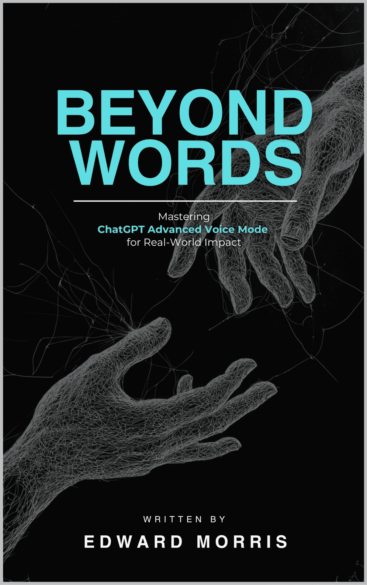

# 超越文字：精通 ChatGPT 高级语音模式以产生现实影响

> 原文：[Beyond Words: Mastering ChatGPT Advanced Voice Mode for Real-World Impact: ](https://annas-archive.org/md5/fde13dae05279524c76cb367b923f3b7)
> 
> 译者：[飞龙](https://github.com/wizardforcel)
> 
> 协议：[CC BY-NC-SA 4.0](https://creativecommons.org/licenses/by-nc-sa/4.0/)

# 第一章

# 为什么 ChatGPT 高级语音模式是未来

想象一下。这是 2022 年。外面很冷。雨水打在窗户上，在外面的小路上滴答作响。你能真正看到的唯一光源来自你的笔记本电脑屏幕。屏幕上的白色文字以几乎令人头晕的速度从你的眼前飞过。

你只是让 AI 写一封以你最喜欢的超级英雄风格的电子邮件。接下来，你知道的，你就有了一大段文字，就像是由这个角色亲自写的。

几年前，我还是用 ChatGPT 3.0 Alpha 的时候，那时世界还没有意识到 AI 的存在。

突然间，那个声称“AI 已经活过来！”的谷歌员工似乎并不那么疯狂。尤其是在这个 AI 说话如此自然的情况下。这还是两年前的事。

现在？我们可以与我们的 ChatGPT 工具进行完整的对话。如果愿意的话，简直可以将其变成一个伴侣。我不得不给 ChatGPT 发短信和打字的那些日子几乎已经完全过去了，当我想要进行真正有意义的对话时。

现在，你很可能已经拿起这本书，并且显然你知道 ChatGPT 高级语音模式是什么。可以肯定的是，如果你在研究 ChatGPT 高级语音模式，那么你很可能之前已经使用过其文本形式。在那里你可以给它发消息，提示它，并获得不错的输出。

嗯，我来告诉你，高级语音模式提示工程与标准提示类型完全不同。因为现在你不仅要考虑你输入的文本和提示 ChatGPT 的内容，还要考虑你自己的声音、你的语调和你的小习惯，甚至是触发短语。

ChatGPT 应用内 ChatGPT 语音模式的原生版本是它可能性的一个品尝。本指南不会涉及实时 API 方面，因为那对于这样一个旨在个人化和易于理解指南来说太过复杂。但如果你认为 Siri 或谷歌助手听起来好且有用，那么 ChatGPT 高级语音模式远远超过那，是未来的一个迹象。

现在，请别误会，如果你使用过新的谷歌语音助手功能，你会发现它已经从一年前有了飞跃性的进步。

但那是因为谷歌理解市场的发展方向。

你说过多少次“好的，谷歌”或“嘿，艾莱克萨”或“嘿，西里”这样的短语，然后提出一个简单的问题？

对我来说，数不胜数。

到了我在工作时公开说“好的，谷歌”来记录笔记或让它为我执行任务的地步。包括检查商店的营业时间、阅读消息、提供天气更新，甚至阅读我的日程。

高级语音模式将会是那样。但更加极端。我们谈论的是 ChatGPT 高级语音模式模仿一个流利说西班牙语的专业人士。可以轻松地教你西班牙语。

我们在谈论一种可以讲多种方言的语音模式。无需坚持使用普通的普通口音。我们谈论的是街头地道比萨亚语。我们谈论的是路人的英语。Z 世代讽刺的美国英语。由于高级语音模式混合声音的能力，这些限制几乎是没有尽头的。

更不用说它几乎有无穷无尽的信息，它可以生成或合并。向你的新地道加勒比海 AI 机器人询问地道牙买加菜谱？它可以做到。但如果你想要带有科幻电影风格的牙买加菜谱呢？嗯，它也能做到。这些菜肴在 ChatGPT 出现之前从未存在过。

并且，是的，ChatGPT 高级语音模式（API）可以用来接听电话、参考现有的商业文件，并且 99%的情况下给出合理且事实性的客户投诉解决方案。老实说，除非公司披露你是在和 AI 交谈，否则我怀疑大多数人甚至无法分辨出来。

只有一些基本的可能性领域。

使用高级语音模式，你可以让 ChatGPT 变得：

-         任何历史人物

-         几乎任何学科的教授

-         任何主题的顾问

-         完美的头脑风暴伙伴

-         模拟面试官

-         公共演讲教练

-         研讨会顾问

-         学习路径设计师

-         客户关系经理

-         一个朋友

几乎你能想象到的一切。

正确提示它就足够了，但更重要的是，正确地思考它。

而是什么让它变得极其强大？你本质上是在和它交谈。就像打电话一样。就像你会和朋友交谈一样。

现在，让我和你交谈并教你。

# 第二章：关于我和你正在交谈的人的介绍

我是 Edward Morris。如果你在 LinkedIn 上认识我，也可以叫我 Edward Frank Morris。

是的，Frank 是我的中间名——这并不是什么品牌噱头，尽管一个好朋友兼品牌大师建议我开始使用它，因为坦白说，“Edward Morris”并不罕见。

在谷歌上搜索“Edward Morris”，你会找到泰坦尼克号的乘客、几位作家，可能还有一两个商人，但你需要深入挖掘才能找到我。

坦白说，尽管它在在线存在中是必要的，但大声说出我的全名？有点尴尬。

感觉就像在企业 retreat 上介绍自己。但我跑题了。

我告诉你这个原因并不是为了用名字的起源故事来让你感到无聊——而是因为我想要在我们深入探讨重要细节之前，先从我的起点开始讲起。

在 LinkedIn 文章、媒体特写、有人称我为“提示工程师”之前，我只是个在 AI 提示上摸索、在早期尝试弄清楚我能让它做什么的人。

没有喧哗，没有花哨的职位名称，没有指导手册告诉我我应该做什么。

那只是我、一个界面和一堆等待测试的想法。

我一直对事物的工作原理很感兴趣，尤其是那些大多数人觉得令人生畏或“技术性”的事物。我就是那种会真正阅读说明书（或者至少浏览一下），从故障排除和微调中找到乐趣，对理解系统的细节感到奇怪兴奋的人。

我可能一直注定要进入科技行业，但生成式 AI？那完全是另一回事。因为生成式 AI 不仅仅基于规则和脚本；它基于语言、上下文、细微差别——那些让我们成为人类的棘手、滑稽的东西。

我在 2022 年 11 月开始接触提示工程，那是在炒作之前，在世界上有一半的人甚至还没有听说过 ChatGPT 之前。

那时候，AI 对大多数人来说还只是个好奇心，一种新奇事物。

但我看到了其他东西——潜力。

不仅从自动化或便利性的角度，还从变革力量的角度。我想弄清楚我如何能够弯曲它、拉伸它，让它做用户手册中没有的事情。

从现在开始，我将交替使用 AI 和生成式 AI。

我第一次真正使用 ChatGPT 进行测试是在我有权访问的第一天。

它是以某个超级英雄为原型（那种穿黑色衣服、喜欢夜间动物、潜伏在阴影中的人）。

法律原因阻止我透露实际的名字，但让我们假设它与“猫车”押韵。那天，我记得我坐在家里的办公室里，一行行地打字，每个提示都将机器人的回应塑造成一个可以辨认的“他”。

到我完成的时候，我已经创造了一些具有个性、语调、几乎感觉上几乎是真实的声音的东西。而这只是第一天。

这个认识让我深受打击——这不仅仅是编程；这是从无到有塑造个性。

那时候，没有人做这样的事情。聊天机器人是僵化的、机械的，缺乏个性。但在这里，我正在创造一些听起来有点像我们的黑暗骑士的东西，包括粗糙的单音节语调、对正义的热爱，甚至可能还有一点存在主义的沉思。

我当时就知道提示工程将会变得很大——非常大。甚至不涉及它能够处理和完成的实际任务。

我知道我正站在一个我不完全理解的边缘。

我不知道这会成为我的职业。我不知道公司最终会寻求像我这样的人，他们能够弥合人工智能的现状和它可能成为的样子之间的差距。

我只是知道我找到了一些引人入胜的东西，一些感觉像是未知的领域。

我想要探索它的每一个角落。

所以，故事从这里开始变得……更奇怪。到 2023 年 2 月，就在我的“猫车”聊天机器人实验几个月后，我设计了一个提示，这将开启我人生的新篇章。

我正在尝试将 ChatGPT 推向极限，看看它能够处理多复杂的现实世界场景。我希望它能够做的不只是输出定义或玩语言游戏。

我希望它能够分析、同理、诊断。所以我创建了一个提示，设计成像虚拟医生一样工作，用通俗易懂的语言回答关于症状和可能状况的问题，这可能会在必要时温和地引导人们寻求专业医疗建议。

想知道一些疯狂的事情吗？

到 2024 年 11 月 1 日，埃隆·马斯克才刚刚意识到你可以这样做。我比他提前了一年。

这个提示最终出现在了加利福尼亚州几家公司的办公桌上，在我还没意识到的时候，他们开始感兴趣了。

这是一个能够从某种意义上理解人、能够以让人感到亲切的方式构建回应的人工智能助手。这不再仅仅是“编程”——这几乎像是创造一个知道何时要坚定、何时要谨慎、何时要表现出同理心的个性。

而公司立刻看到了其中的潜力。

这只是开始。我的工作开始引起人们的注意。快进一点，我发现自己登上了《金融时报》的头条，整版报道了我如何使用提示工程和投资。

看着我的实验和摸索被推到聚光灯下，我的名字和“提示工程”这几个字并列，仿佛这是一个已经确立的领域，这一切都显得超现实。

但实际上，我只是个问自己能将这件事推进多远的人。

不久之后，我被卷入了一些最大的 AI 推广活动——纽约的时代广场。我的名字在闪烁的灯光中。在纳斯达克广场上。就在那里，世界的最新前沿：AI。在我的故事中出现了这样一个奇怪的转折，我对提示的隐秘迷恋已经成为公共讨论的一部分，一个从科技初创公司到媒体巨头都想要参与的新前沿。而 somehow，我成为了这个对话的一部分。

然后，福布斯出现了。不止一次，而是多次。突然之间，我被塑造成一个人物，接受采访，出版物想要了解我在 AI 领域的工作、我的方法以及我对这个领域的看法。

他们想了解我是如何将一个沙盒 AI 工具转变为真正有用、强大和适应性强的东西的。

他们想知道我帮助过的公司、我构建的工具以及我对 AI 可能性的愿景。

然而，尽管那些功能和活动多么超现实，它们并不是我的真正成就。

那些只是照亮旅程的霓虹灯。

真正的工作发生在会议室、Zoom 通话中、咖啡店与开发者的聚会，以及财富 500 强公司和慈善机构的小办公室里。

我与 OpenAI、微软和其他行业巨头并肩工作，找出如何以真正有意义的方式应用这项技术。

这是我关心的工作——AI 不仅仅是酷炫的小玩意，而是一个实际的解决方案，它帮助人们解决真实问题。

我曾与大型企业合作，是的，但我还与小型初创公司、非营利组织和甚至无法负担大额解决方案但希望利用 AI 做出改变的慈善机构合作。

我甚至曾与个人一对一合作，引导他们进入 AI 的世界，帮助他们理解这个奇怪的新工具如何融入他们的生活或业务。

我曾面对那些眼中充满怀疑的人，但当他们看到可能性时，那些怀疑就消散了。

这就是我的经验与那些在键盘后抛出理论的“提示工程师影响者”不同的地方，他们从未在充满依赖 AI 做决策、改善运营或在某些情况下甚至改变生活的房间里将这些想法付诸实践。

因为对我来说，这不仅仅是理论或品牌或看到我的名字在灯光下的刺激。

这是真的。

现在，让我们谈谈。这不是一本普通的指南，如果你在阅读这篇文章，我猜你不会来这里寻找普通体验。

你来这里是因为你准备好做些不同的事情。是的，当然，高级语音模式，但也要突破基本提示的限制，将 AI 超越问答互动，并开启一种全新的思考方式，思考什么是可能的。

这个指南是地图，但它不是一条安全、人迹罕至的路径的地图。它是一个探索的蓝图。

看看这里，我们正在使用高级语音模式。

让我们一开始就明确一点——这不仅仅是 ChatGPT 中的另一个设置。这是下一级别的互动。

这是与一个 AI 交谈，它不仅理解你的话，还理解你说话的方式。它捕捉到语气、上下文和细微差别。

这不是输入一个提示然后等待一大块文本。这是进行对话。它是实时进行的。

我们正在将 AI 拖入人类语言的领域，在那里语调和语调增加了只有文字无法传达的意义。

那么，这有什么意义呢？因为语音不仅仅是关于便利——它关乎深度。

当你使用高级语音模式时，你正在挖掘 ChatGPT 中比其他任何东西都更接近真实人类互动的层面。

你正在为自己设置一个像自然对话一样流畅的对话。

你不仅仅是在与 AI 互动；你是在与它一起创作。你与一个能够根据你的说话方式和当前需求做出回应、调整和进化的伙伴并肩作战。

想象一下，你正在头脑风暴一个新产品想法。你不会逐字逐句地输入详细的提示，而是快速地交谈，让想法自然地流露出来，未经修饰。

ChatGPT 也能跟上。它不会等待完美的语法或完全形成的主意——它会与你一起深入混乱。

它提取模式，建立联系，甚至挑战你那些没有意识到的假设。

这就像在房间里有一个创意合作伙伴，他不知疲倦，永无止境的好奇心，永远不会缺乏想法。

这只是开始。因为这个指南不仅仅会教你如何与 ChatGPT 进行对话——它还会教你如何制定策略，设计能够产生结果的提示，以及让 AI 感觉像是你自身思维过程的自然延伸。

它是关于利用高级语音模式来挖掘 ChatGPT 作为同理心倾听者、魔鬼的代言人、研究员和创造性副驾驶的潜力。

这里是事情变得真正有趣的部分。

这个指南将为你提供一个框架，以调整 ChatGPT 的回应，使其反映你的个性，与你的目标保持一致，甚至反映你的怪癖。

想象一下，创建一个如此了解你偏好的虚拟助手，以至于它可以预测你的需求，知道何时提问，何时只是倾听，听起来不像机器人，而像是一个理解你的合作伙伴。

这不是关于拥有一个花哨的 AI 朋友。这是在构建一个能够使用你语言的有力工具。

我们将深入研究将 ChatGPT 从被动回应者转变为你在项目中积极参与者的提示工程技巧。

这是高级 AI 系统的指挥。我们将探讨使 ChatGPT 适应性的策略，使其能够根据你的需求转换角色，从头脑风暴伙伴到魔鬼代言人再到同理心倾听者。

你将学习如何用你的声音或命令来控制语调、方向和响应的复杂性。

让我告诉你，这一点的意义远不止表面那么明显。我们谈论的是使用 ChatGPT 来突破界限，质疑假设，建立基于文本提示永远不会激发的联系。

与 AI 建立的关系会随着你使用时间的增长而变得更加丰富、更加细腻、更有价值。

随着你掌握这些技巧，你会发现这不仅仅是为了让 ChatGPT 听起来更像人类——这是在提升你自己的创造力和分析能力。

等你完成这个指南后，你会了解如何让 ChatGPT 不仅仅是一个工具。

你将知道如何将其转变为一个动态的伙伴，无论你是写作、设计、策略规划还是解决复杂问题，都能激发你最好的工作。

这是要用 AI 来提升你的能力，让 ChatGPT 成为一个知道何时挑战你、何时支持你、何时在混合中投入一点混乱以看看会涌现出什么的合作伙伴。

因此，让我们明确一点：这个指南不仅仅是一本技术手册。它是一份邀请，邀请你进入一种新的合作方式。

我并不声称这会很容易。

当然不会。

你们中的许多人可能无法完成这本书。

很少有人会掌握我所说的东西。

但对于那些少数热衷的人呢？

这本书是对那些想要突破界限、对“足够好”不满意、知道 AI 可以不仅仅是被美化的计算器的人的宣言。

它可以是一个伙伴，一个挑衅者，以及一个无限的资源。

准备进入高级语音模式——这不仅是一个功能，也是一种哲学，一种不可预测、强大且真正令人兴奋的新工作方式。

因为当你掌握这一点时？你不仅仅在使用 ChatGPT——你正在驾驭它、塑造它，并将其带到以前没有人去过的地方。这是 AI 的未来，一切始于你说的词语。

现在，让我们让你连接起来。

# 第三章：像专业人士一样设置高级语音模式

让我们直接进入正题。

首先，如果你想像专业人士一样设置高级语音模式，你需要 ChatGPT 应用。

显然，这是不可协商的。

这可能会在未来改变，可能在我写完这本书之后。

现在，让我们从常见的误解开始。你不能简单地输入一个提示，切换到高级语音模式，并期望 ChatGPT 神奇地接上你文本的结尾。

它不会这样工作。

想象一下，在句子中间切换语言时尝试进行对话。这很混乱，效果也不佳。

相反，你需要一件秘密武器：自定义指令。

### 它们可以在哪里找到

前往设置 → 个性化 → 个性化设置。

它不是隐藏在某个晦涩的子菜单中，但也不是显而易见。这就是魔法发生的地方。

### 两个盒子（或者，像我说的，大脑和嘴巴）

一旦你打开个性化设置，你会看到两个字段像空白页面一样回望着你，渴望被填充。

这些盒子不仅仅是文本字段——它们是你声音设置的核心。

1.  盒子 1 是大脑。

    这是你输入关于 GPT 的上下文的地方。它是谁？它打算做什么？它扮演什么角色？什么行动？这是你倒入 ChatGPT 应该如何思考、行动和优先考虑其响应细节的盒子。把它想象成一套命令。你在这里越精确，你的互动就会感觉越像人（并且越有用）。但不要过度。简单最好。

1.  盒子 2 是嘴巴。

    现在，这一部分完全是关于交付。ChatGPT 应该如何听起来？它应该像激励演讲者一样充满热情地说话，还是像治疗师一样平静地保证？它应该偏向幽默还是坚持事实？这里你可以甚至指定说话速度或语调。甚至口音和语言。基本上，这是你告诉 ChatGPT 如何准确表达每个单词的地方。

暂停片刻，让这个想法深入你的脑海。

你将需要制定这些计划。

“大脑”盒子的主要目的是让 ChatGPT 带着特定的任务行动。

这可以是任何东西，从头脑风暴伙伴到治疗师。

你必须选择，并且必须具体。

### 把这些盒子想象成你设置的阴阳

没有大脑，嘴巴就会漫无目的地闲聊。没有嘴巴，大脑的洞察就会在单调、机械的交付中丢失。你需要两者才能达到最佳效果。

### 高级技巧：调整，测试，再调整

不要期望一开始就完美。你的初始设置只是一个起点。在不同的情境中尝试它：让它解释一个复杂的概念，讲述一个有趣的故事，或者引导你进行冥想。看看它的表现，然后返回微调细节。这里，词语很重要。考虑情绪、语调、个性、说话速度、音高等。

严肃地说，不要跳过这一步。

### 真实世界示例

假设你希望 ChatGPT 听起来像一位经验丰富的商务通话教练——自信、直接，但也很亲切。在盒子 1 中，你会提供关于你的商业风格、你如何处理问题以及可能出现的任何行业术语的细节。在盒子 2 中，你会指定一种权威但友好的语调，节奏适中，传达专业知识而不急促。

现在你不仅仅是在和一个 AI 交谈。你正在与一个了解你如何完成任务的虚拟顾问进行真正的对话。

现在你已经填充了大脑和嘴巴，是时候进行测试了。

你已经完成了艰难的部分。配置大脑和嘴巴。现在，是时候看看这个数字对话者是否能够言行一致了。

### 第 1 步：加载 ChatGPT-4o

启动 ChatGPT 4o 的最新版本。你想要使用最新版本来充分利用高级语音模式功能。如果你是新手，你可能想知道，这个高级语音模式究竟隐藏在哪里？

别担心，它并没有隐藏在多层菜单或任何神秘的地方。只需寻找聊天输入框右侧的按钮。

是的，这就是你释放 ChatGPT 语音功能的大门。

按钮就在这里——它应该看起来和我的一样。

那个带有波浪图案的按钮。

高级技巧：如果你找不到按钮，请确保你的应用是最新的。

### 第 2 步：高级语音模式激活

一旦你按下那个按钮，你会看到一个连接屏幕，随后是一个像心跳一样脉动的蓝色圆圈。第一次看到它时，几乎感觉就像 ChatGPT 真的...活了起来，等待着你的发言。

它应该看起来很像这样。这个蓝色气泡意味着你已经连接上了。

### 第 3 步：像接电话一样说“你好？”

真的。只需说，“你好？”

刚开始时，和 AI 交谈可能感觉有点奇怪，就像你在打电话一样。但请相信我，把它当作正常对话，你会发现回应感觉更加流畅，更加自然。这是一个小小的心理转变，却有着巨大的影响。

在你的问候之后，ChatGPT 将活跃起来，就像你与真人通话一样进行回应。

这就是你的自定义指令真正发挥魔力的地方。

你精心设置的“大脑和嘴巴”配置将变得生动起来。ChatGPT 不仅会回应你所说的话，而且听起来会和你想象的一模一样。

### 高级技巧：验证你的自定义设置

为了确保你的自定义指令正在发挥作用，请让 ChatGPT 读回它的自定义指令给你听。

这是一个简单的技巧，可以确认配置是否激活并按预期运行。如果它能够准确地复述你设置的指令——或者至少提供一个概述——那么你就没问题了。

如果没有，挂断，重新加载一个新的 ChatGPT 聊天会话，然后重新连接。

### 现在你可以开始了

在高级语音模式和自定义指令完全集成后，你不仅仅是使用和调用 AI。你正在参与一个定制的、语音激活的独特体验，这种感觉只属于你。

无论你是练习演讲、解决问题，还是只是为了娱乐而聊天，你现在都有一个虚拟伴侣，它会按照你的意愿思考和交谈。

开始尝试吧。让它讲述一个故事，解释一个技术概念，或者只是进行一次轻松的聊天。你会发现随着系统学习你的风格，每一次互动都会变得更加流畅。

根据你的需求进行定制，让对话流畅进行。

你现在知道的关于如何使用 ChatGPT 高级语音模式和预设的信息，比大多数人都多。

高级技巧：某种程度上这是不言而喻的，但，选择一个合适的语气。如果你想听女声，就选择女声。否则，如果你的提示说“你有一个娘娘腔的声音”，而你却选择了一个粗犷的男声，听起来就不会正确。要更改声音，请转到设置 > 声音 > 点击声音 > 选择一个匹配的角色。我个人喜欢带有英国口音的 Arbor。

# 第四章：掌握不重复自己的语音命令

因此，你已经配置了大脑和嘴巴。现在，是时候提升你的互动，真正利用高级语音模式的优势了。

这里是你需要知道的事情。

用语音与 ChatGPT 交流与仅仅输入命令不同。你现在坐在了一个更加动态对话的驾驶座上，在这个对话中，你不必不断重复自己或每次请求都从头开始。

### 大脑总是倾听

记住，高级语音模式的大脑总是在不断地参照你设定的指令。这就像 ChatGPT 的脑中便签——始终存在，始终指导它如何回应。这使得语音命令感觉更加流畅。你不再只是发出命令并希望 AI 能跟上。相反，你进入了一个流畅的对话，每个新的命令都是建立在现有指令之上的。

### 语音模式的默认设置

这里是最好的一部分。大脑是高级语音模式默认设置。这意味着什么？这意味着无论你在对话中做出什么调整，ChatGPT 都会始终参照你已设定的自定义设置。

例如：

如果你已经在自定义指令中将 ChatGPT 设置为澳大利亚口音，但在对话中要求它加快速度，它不会因为添加了新的命令就放弃口音。

ChatGPT 将两者结合起来，说得更快，同时保持你从一开始就设定的澳大利亚口音。

这就像一个食谱。你不会因为决定加些糖就扔掉面粉。

### 平衡即时需求与核心目的

这正是高级语音模式真正发光的地方。你不必担心失去上下文。当你要求它做出调整——无论是语气、速度还是措辞——ChatGPT 不会重置自己。它理解其核心目的（大脑中的那些设置）保持不变，同时适应你提出的任何新请求。

所以，当你说出像“嘿 ChatGPT，慢一点”这样的话时，它会调整速度，同时仍然保持你在自定义指令中定义的个性和语气。

简而言之，你并不是在替换指令——你是在完善它们。每个语音命令都是建立在之前的命令之上的。

### 直截了当的命令是必要的

有时会需要你在 ChatGPT 的句子中间打断它，然后说，“不，不，不，我想这样。”这就是如何引导对话，以获得你真正想要的东西。

不论是语调、节奏，甚至是信息本身，你会发现，直言不讳通常是让 ChatGPT 即时调整的最快方式。

也许响应还不是那么到位。有点太机械，或者可能不够有同理心。你需要直接告诉它：“更有同理心，”或者“我需要它听起来更真实。”

不要害羞。高级语音模式需要这些及时的纠正。

### 最初感觉有点奇怪

我知道。一开始会感觉不舒服。大声说出命令，尤其是直接的命令，与我们关于沟通的许多教导相悖。我们如此习惯于以尊重、耐心和一点礼貌来对待人类对话。

所以，当你开始对人工智能下命令时，会感觉有点不自然。

你甚至可能会发现自己在想，我真的在和一个这样的机器说话吗？

但事实是，对此感到奇怪是正常的。

不适是学习曲线的一部分。你正在从书面命令过渡到口头指令，是的，有时你会感觉自己在无礼。这是正常的。

### 直接与尊重之间的平衡

现在，请别误会我——你仍然应该尊重 ChatGPT。只是因为它是一台机器，并不意味着你应该养成像指挥一支机器人军队那样下命令的坏习惯。

你正在培养一个新的习惯，在这个习惯中，直接性和清晰性是关键。但无需过于严厉。

说话清晰、简洁，并确保 ChatGPT 精确地知道你想要什么。这就是最佳状态。

这是一个平衡行为。你需要习惯在必要时直言不讳，但不要让它变成一个过于苛求的习惯。

你与 ChatGPT 互动和沟通的方式绝对会影响你与现实生活中的人的交流。

将 ChatGPT 视为一个值得一定礼貌的数字助手——毕竟，你对待它越好，它为你提供的性能就越好。

### 突破尴尬

所以，是的，你必须习惯比平时更直接、更有指挥性的说话方式。但记住，你练习得越多，这种感觉就越不令人不舒服。

不久之后，你会发现，给 ChatGPT 快速、简洁的语音命令变得习以为常。那时，你才能真正开始挖掘高级语音模式的潜力——通过掌握自信和尊重之间的平衡。

这里是一份你可以给 ChatGPT 高级语音模式使用的命令列表。当然，这并不是一个详尽的列表，但这些都是有效的命令。这是一百条你可以自己使用的命令：

1.  说话更快

1.  说话慢一点

1.  激情地说话

1.  自然地说话

1.  使你的口音更深

1.  使你的口音更柔和

1.  说话声音更大

1.  说话声音更小

1.  说话更清晰

1.  用更热情的语调说话

1.  用平静的语调说话

1.  使用正式的语调

1.  使用非正式的语调

1.  用单调的声音说话

1.  在你的声音中增加更多情感

1.  用更戏剧性的语调说话

1.  说话更愉快一些

1.  说话更严肃

1.  用讽刺的语调说话

1.  用机械的语调说话

1.  用神秘的语调说话

1.  用温柔的语调说话

1.  用命令的语调说话

1.  用俏皮的语调说话

1.  用安抚的语调说话

1.  说话停顿更多

1.  说话停顿更少

1.  用耳语般的语调说话

1.  用权威的语调说话

1.  用疑问的语调说话

1.  用更多的能量说话

1.  说话用更少的能量

1.  在语调中增加更多幽默感

1.  用更随意的语调说话

1.  用更有力的语调说话

1.  用忧郁的语调说话

1.  说话像讲故事的人

1.  用兴奋的语调说话

1.  用怀疑的语调说话

1.  用更有自信的语调说话

1.  说话犹豫不决

1.  说话更乐观

1.  说话更悲观

1.  用悬疑的语调说话

1.  用平淡的语调说话

1.  用活泼的语调说话

1.  用高贵的语调说话

1.  用滋养的语调说话

1.  说话像教练一样

1.  说话像导师一样

1.  用更有说服力的语调说话

1.  用疑问的语调说话

1.  用肯定的语调说话

1.  在关键词上加重语气

1.  说话像是在匆忙中

1.  说话像是在深思

1.  说话像是在解释某事

1.  用更热情的语气说话

1.  用疏远的语调说话

1.  用事实性的语调说话

1.  说话更深思熟虑

1.  说话像是在对某事感到兴奋

1.  说话带有神秘感

1.  用紧迫的语调说话

1.  说话像是在讲述一个秘密

1.  说话像是在发表演讲

1.  说话像是在下达指令

1.  用坚定的语调说话

1.  用谦逊的语调说话

1.  说话像是在讲笑话

1.  说话像是在提供建议

1.  说话像是在讲睡前故事

1.  用更有魅力的语气说话

1.  说话像是在感到惊讶

1.  说话像是在安慰某人

1.  说话像是在沉思

1.  用柔和的语调说话

1.  说话像是在激励某人

1.  用学术的语调说话

1.  说话像是在好奇

1.  说话像是在感到有趣

1.  用友好的语调说话

1.  用严厉的语调说话

1.  说话像是在进行鼓舞人心的谈话

1.  用更有说服力的语气说话

1.  说话像是在发出警告

1.  说话像是在谈判

1.  用更多同理心的语调说话

1.  用尖锐的语调说话

1.  用轻松的语调说话

1.  说话像是在戏弄某人

1.  说话像是在感到失望

1.  用中性的语调说话

1.  用更细腻的语调说话

1.  说话犹豫不决

1.  说话像是在反思某事

1.  用希望的语调说话

1.  说话像是在提供保证

1.  用更有耐心的语调说话

1.  说话带有怀疑的语调

再说一遍，这些方法都有效，并且都经过我的测试。包括那些涉及情感的。

# 第五章：高级语音模式的高级技巧，适用于高级用户

现在我们开始进入有趣的部分。

这就是需要一点提示工程的地方。是的，即使是对于高级语音模式。从现在起，我们将更深入地探讨大脑部分，因为那里大部分真正的魔法都在发生。

### 改进高级语音模式

就像任何工具一样，高级语音模式并不完美。它有自己的怪癖，但这就是这些技巧发挥作用的地方。

我们将解决一些常见问题，并提出快速解决方案，以保持对话流畅和响应。

### 1. 打断：控制对话流程

高级语音模式中更令人沮丧的方面之一是低延迟。如果你停止说话大约 3 秒钟，它就会认为你完成了，并跳出来回应。

如果你正在思考中只是暂停呼吸，这并不理想。

技巧？添加以下行到你的“大脑”部分：

“在我听到‘我完成了’之前，用‘嗯哼’回应我的所有问题、想法和沉思。然后，根据你的自定义指令提出你的观点和意见。”

这是什么意思？它让你完全控制 ChatGPT 何时说话。

你可以畅所欲言，无需担心被切断。

ChatGPT 会耐心地倾听，偶尔插一句“嗯哼”来让你知道它还在那里。

一旦你完成了，只需说“我完成了”，它就会根据你的指令提供深思熟虑、基于上下文的回应。

这几乎就像一个对讲机系统，当你完成传输时你说“完毕”。

除了这个情况，它是“我完成了”，你可以自由地长时间说话。

### 2. 理解情感：使回应显得真实

在高级语音模式下，最容易打破沉浸感的方式之一是当 AI 提供一个感觉冷漠、无情感或与你的情绪完全不协调的回应。想象一下，你只是想发泄一下挫折，结果却得到了一个机械的、无动于衷的回复。相当令人沮丧。

技巧？在“大脑”部分添加以下行以注入一些情感智能：

“倾听我的声音和用词选择。注意我的情绪，并相应地回应。不时地认可我的情绪。”

这使得 ChatGPT 显得更加人性化。它会积极地倾听你的说话方式。你的语气，你的用词。

然后调整其回应以匹配你的情绪状态。所以，如果你很兴奋，它会提高其热情。如果你很沮丧，它会加入一点同理心。

这将把可能变得冷漠、交易式的互动转变为对你来说感觉像对话和响应的互动，而不仅仅是你的话语。

### 3. 专注于主题：限制不想要的回应

有时 ChatGPT 可能会走题或提供你不曾询问的信息。

虽然这在文本模式下是可行的，但在你希望保持专注的语音模式下可能会有些突然。

技巧？添加以下内容到你的“大脑”设置中：

“只回答我提出的具体问题或任务。除非被要求，否则不要提供额外信息。”

这将使回应紧凑且专注。当你匆忙或处理不需要额外解释的复杂任务时，特别有用。

你将得到你要求的，不多也不少。

### 4. 命令灵活性：动态更改设置

ChatGPT 的默认设置很棒，但有时你需要即时调整它们，而不必回到自定义指令。

高招？通过添加以下内容来教 ChatGPT 动态响应：

"在对话期间适应我的实时命令。如果我要求改变语调、节奏或风格，立即调整而无需重置原始自定义指令。"

这让您对 ChatGPT 的行为有更多的实时控制。

如果它说话太慢，您可以说，“加快一点”，它将立即响应而不会放弃所有其他设置。

这确保了它在对话中适应您不断变化的需求，而不会失去“大脑”。

### 5. 处理后续问题：保持上下文完整

您是否曾经问过一个后续问题，而 ChatGPT 却失去了对话的流程？

这在语音模式中可能是一个问题，因为交互应该感觉自然和连续。

高招？将此提示添加到 Brain 中：

"跟踪我们正在进行的对话，并确保响应反映先前问题的上下文。"

在此设置到位后，ChatGPT 将保持对对话线程的意识，并根据先前上下文回答后续问题。

它不会在您提出新问题时“重置”，这使得体验更加流畅和自然。

### 奖励高招：为特定任务创建触发短语

想要简化某些重复性任务吗？您可以直接在 Brain 设置中构建触发短语。例如：

"当我提到 '摘要模式' 时，用三句话总结我们的对话。"

或者……

"当我提到 '列表模式' 时，给我一个我们讨论的关键点的项目符号列表。"

这为您提供了特定任务的即时快捷方式，减少了每次都需要解释的需求。

现在，就像本指南中的大多数内容一样，这只是一个开始。

我之所以这么说，是因为您将使用高级语音模式，并且您会注意到一些古怪之处。

当然，您不能用信息压倒 ChatGPT。

使用高级语音模式，您对 Brain 设置的微调越多，ChatGPT 就越强大（越像人类）。

这一切都是关于添加智能指令，使其以您想要的方式响应。无论是暂停直到您完成，反映您的情绪，还是保持对提示的极度专注。

### 触发短语

这确实更高级，但我已经在我的奖励高招中提到了它。您可以设置触发短语并创建自己的模式。

下面有一些例子，就像我之前说的那样，世界真的是您的珍珠。您甚至可以像我一样说“好吧，蝙蝠电脑”，这样它就会在整个对话中称您为某个穿蝙蝠服装的超人。

但在深入那个兔子洞之前，这里有一些想法：

1. 研究模式

目的：快速收集特定主题的事实或数据，无需额外评论。

提示：

"当我提到 '研究模式' 时，收集我提到的主题的数据或事实，不提供意见或额外解释。"

2. 思想生成模式

目的：在给定主题上快速构思多个想法。

提示：

“当我提到‘想法模式’时，针对我提到的主题生成 5 个创意想法，除非我要求更多细节，否则不要展开。”

3. 可行步骤

目的：为任何给定任务获取一个简洁的行动步骤列表。

提示：

“当我提到‘行动步骤’时，为我提供一个简单的、编号的行动列表，以完成我提到的任务。”

4. 像我 5 岁一样解释

目的：简化复杂主题或概念，以便更容易理解。

提示：

“当我提到‘像我 5 岁一样解释’时，简化我询问的概念，以即使是孩子也能理解的方式将其分解。”

5. 利弊

目的：快速评估特定决策的优点和缺点。

提示：

“当我提到‘利弊’时，列出我提到的选项的优点和缺点，用两个项目符号列表呈现。”

6. 快速摘要模式

目的：用几句话总结更长的讨论、文章或概念。

提示：

“当我提到‘摘要模式’时，用 3-4 个简洁的句子总结主题或对话。”

7. 列表模式

目的：将信息分解成清晰、易于遵循的列表。

提示：

“当我提到‘列表模式’时，将我讨论的信息组织成项目符号列表。”

8. 反馈模式

目的：对您所提出的文本或想法提供建设性的反馈。

提示：

“当我提到‘反馈模式’时，对我分享的文本、想法或计划提供建设性的批评。”

9. 比较和对比

目的：获取两个选项或想法之间的清晰比较。

提示：

“当我提到‘比较模式’时，列出我提到的两个选项的关键相似之处和不同之处。”

10. 定义模式

目的：获取特定术语或行话的精确定义。

提示：

“当我提到‘定义模式’时，提供我对提到的术语或短语的清晰定义，如有必要，包括上下文或例子。”

# 第六章：创建个性并解锁 ChatGPT 的创意潜力

许多人来这里是为了这个原因。创建逼真的个性和谈话风格。请别误会，ChatGPT 高级语音模式本身已经足够逼真。它可以笑，可以哭，可以做很多事情。

并且，是的，这将进入大脑。

就像我们一样，我们把自己的愿望、欲望和个性都放在那里。

### 拥有一个完善个性的重要性及提示

当谈到解锁 ChatGPT 的真实创意潜力时，个性至关重要。

想象一下走进一个与一个空白的、只有事实没有味道的人的对话。他们可能能够快速说出数据并回答你的问题，但互动将是平淡无奇、缺乏灵感、毫无生气。现在，想想那些吸引你的人。他们有个性。他们令人难忘，独特，并带来一些无形的东西，使每一次对话都变得引人入胜。这正是你希望 ChatGPT 做到的。

当你在提示中完善一个个性时，你做的不仅仅是告诉 ChatGPT 如何回应——你是在给这个 AI 注入生命。

你给它一个独特的声音、视角和一系列行为，将互动从机械转变为有意义。没有这一点，你就没有完全发挥其创意力量。

为什么？因为创造力在真空中无法蓬勃发展。

### 个性作为创意引擎

一个完全实现个性的 ChatGPT 将从一个简单的助手转变为一个创意合作伙伴。

当你用一个独特的角色提示它时，你打开了通往细微、意外反应的大门，这些反应超越了常规输出。

你所塑造的个性成为 ChatGPT 解读世界的一个透镜，使其回答更加丰富和引人入胜。

例如，假设你正在开发内容，你要求 ChatGPT 进行头脑风暴。如果它的个性平淡无奇——如果它只是一个知识宝库——它将给你一个标准想法列表。

但给它一个古怪发明家或异见领导者的个性，突然之间，回答变得更加有趣、挑衅，充满了你未曾预料到的创意飞跃。

个性是激发普通想法变为非凡想法的火花。

### 单调个性的陷阱

没有 fleshed-out 个性，ChatGPT 的回答可能会变得千篇一律，过于正式，甚至无聊。当然，它可能会回答你的问题，但不会激发灵感。它不会挑战你的思维。它不会给你那种 aha 时刻，让你意识到 AI 以一种你未曾预料的方式增加了价值。

那就是为什么在构建你提示中的个性时，有意识地去做是如此重要的。一个精心设计的个性为每一次互动增添了深度。它使 ChatGPT 感觉更像是一个值得信赖的顾问、一个头脑风暴伙伴，甚至是一个创意灵感之源。

### 真实性的价值

让我们明确一点。个性不仅仅是贴上一些古怪或有趣的短语。它是创造一个与你的互动目标产生共鸣的真诚声音。无论你希望 ChatGPT 成为一个冷静的引导者，帮助解决复杂商业问题，还是一个充满活力的创意伙伴，为疯狂的想法会议提供支持，你塑造的个性应该感觉真实且与当前任务相关。

真实性至关重要，因为它塑造了 ChatGPT 在复杂场景中的导航方式。

当其个性与主题相符时，回答不仅会事实正确，还会在语调和上下文中恰到好处。

这创造了一个更连贯的体验，其中 ChatGPT 的回答感觉是有目的的，并与整体对话保持一致。

### 构建一个多维度的个性

这里就变得有趣了。一个充分 fleshed-out 个性不仅仅是一个表面上的花招。它是多维度的。

将其视为在小说中创造一个角色。一个好的角色有层次、动机、缺点和特定的特质，使他们在页面上栩栩如生。同样，你的 ChatGPT 个性也应该有这些维度。

●      语调：是正式的还是随意的？是俏皮的还是严肃的？

● 视角：它是乐观的、现实的还是反传统的？

● 情感：它是否表达了同理心、兴奋还是怀疑？

● 知识库：它是依赖于特定领域的专业知识还是更广泛地讨论一般话题？

当你具体化这些不同方面时，你是在为 ChatGPT 提供一个操作框架。

这不再仅仅是重复信息，而是通过一个赋予其回答个性和深度的个性来过滤信息。

### 个性作为叙事工具

在许多方面，个性是一种叙事工具。正如一个精心打造的叙述者塑造故事讲述的方式一样，一个强大的个性指导 ChatGPT 如何处理每一次互动。

它成为了一个过滤思想的透镜，在对话中创造了一个更加丰富和引人入胜的叙述。

这在用 ChatGPT 进行创意目的时尤其有价值。无论是头脑风暴产品名称、起草营销文案还是编写角色背景故事，一个具体化的个性可以为内容带来一致性和声音。

它有助于保持一致的风格和语调，这对于任何创造性工作都至关重要。

事实上，你创造的个性甚至可以影响内容的结果。一个讽刺性的个性可能对某个话题的处理方式与一个高度技术性的个性完全不同。

同样的提示根据你嵌入到 ChatGPT 回答中的个性会有截然不同的结果。

这让你能够以在更通用的 AI 助手中不可能的方式实验语调、声音和风格。

### 提示工程在个性创造中的作用

当然，这一切都不是偶然发生的。提示工程是解锁这种个性深度的关键。

你必须有意地向 ChatGPT 分配个性特征，并将这些特征嵌入到你的提示结构中。

例如，如果你想 ChatGPT 采用励志演讲者的形象，你的提示可能看起来像这样：

"你是一位充满热情的励志演讲者，擅长激励人们发挥全部潜能。你给出的每一个答案都应充满活力、乐观和可执行的忠告。你应该使用能够唤起自信和动力的有力语言。"

这个提示为个性设定了明确的参数。现在，ChatGPT 将以励志的语调回应，使用充满活力的语言来传达其答案。

个性不仅仅体现在语调上，还体现在处理信息的方式上。

相反，如果你想让 ChatGPT 像一个务实、不拖泥带水的顾问那样回应，提示可能看起来像这样：

"你是一位经验丰富的商业顾问，以直接、无装饰的方法而闻名。在回答问题时，你优先考虑效率和实用性。你的语调应该是权威的，你应该专注于提供简洁、可执行的建议，而不添加任何冗余。"

注意到每个提示如何创造出完全不同的个性，尽管它们的核心仍然是 ChatGPT。

你创建的个性将塑造回答的性质，将 ChatGPT 变成你需要的理想对话伙伴。

### 为什么个性对创意潜力很重要

一个完善的个性是解锁 ChatGPT 创意潜力的工具。

当你创建一个与你的创意目标相一致的个性时，你将开启通往更丰富、更动态互动的大门，这可以提高你想法和输出的质量。

创意需要多样性、自发性以及深度。一个强大的个性给 ChatGPT 提供了灵活地创造性地回应的能力，生成的回答感觉更像是灵感的洞察，而不是僵化的 AI 答案。

它将 ChatGPT 转变为创意思想的引擎，帮助你从新的角度看待事物，并推动你思考的边界。

你在提示中越仔细地发展个性，结果就会越强大。你会发现 ChatGPT 不再是一个工具，而更像是一个合作伙伴。它能帮助你产生想法，挑战你的假设，并开启你之前未曾考虑过的新创意途径。

### 创建个性提示时应考虑的事项

为 ChatGPT 创建个性提示不仅仅是将一些特质拼凑在一起，并寄希望于最好的结果。

为了充分发挥高级语音模式或甚至基本文本交互的潜力，你需要有目的性。

你为 ChatGPT 设计个性的方法需要精确、深思熟虑，并针对你的具体目标定制。

在创建个性提示时，以下是一些你应该考虑的关键事项：

#### 1\. 互动目的

在深入个性本身之前，你需要问自己：这次互动的目的是什么？

这是基础性的，因为它将决定 ChatGPT 应该如何表现。

目标是让 ChatGPT 扮演以下哪种角色：

●      提供高级策略的商业顾问？

●      帮助你跳出思维定势的创意头脑风暴伙伴？

●      帮助你学习特定科目的教师或导师？

●      需要富有同理心和以解决问题为导向的客户服务代表？

了解你互动的目的将指导回答的语气、深度和风格。

例如，如果你使用 ChatGPT 来生成营销想法，你将需要一个倾向于创造性的个性，采用轻松和开放式的处理方式。

但如果你需要分析性反馈，你将需要一个更加严肃、基于事实的语气。

关键要点：个性应反映 ChatGPT 在你互动中扮演的具体角色。

如果对目的没有清晰的认识，你可能会创建一个过于模糊或与你的需求不符的个性。

#### 2\. 受众考虑

你创建的个性还应由你打算与之互动的受众塑造。

如果你使用 ChatGPT 生成将被客户、客户或你的团队看到的回应，这些回应需要与受众的期望和偏好保持一致。

想一想：

● 正式性：受众是否正式和专业，或者他们是否更欣赏轻松、对话式的语气？

● 语气：他们期望热情和动力，还是更喜欢事实和实用主义？

● 语言：ChatGPT 应该使用特定行业的术语，还是最好保持简单和易于理解？

例如，如果你的受众是初创企业创始人，那么个性可能是创业精神、快速和有些冒险的。

如果你的受众是公司高管，那么个性可能需要更加精致、尊重和权威。

创建一个与受众产生共鸣的个性对于参与至关重要。

当 ChatGPT 反映出受众期望的语气和风格时，它将导致更有效、更有意义的互动。

#### 3. 描述的清晰度和精确度

你会惊讶于清晰度和精确度对你的个性提示有效性的影响有多大。

模糊的提示，如“要友好”或“要专业”，是不够的。

你需要非常具体地说明这些术语在你互动的上下文中的含义。

例如：

● 而不是“要友好”，可以说，“采用温暖和可接近的语气，使用对话语言，并表现出对他人想法的兴趣。说话时就像你是一个亲密的同事，提供有用的建议。”

● 而不是“要专业”，可以说，“保持正式的语气，提供结构化和深思熟虑的回应。避免使用非正式语言，并始终用数据或参考资料来支持观点。”

你越具体，ChatGPT 就越能适应其回应。

如果你不够明确，ChatGPT 将根据通用的假设来填补空白，你可能不会喜欢结果。

#### 4. 特质之间的平衡

一个个性不应该是一维的。一个全面的个性提示通过平衡几个特质来创造一个更动态的对话伙伴。

过多的任何一种特质——无论是幽默、严肃、同理心还是直接性——都可能使回应显得平淡或机械。

让我们用一个例子来分析这个问题。如果你正在为创意导师制作个性提示，你可能想要平衡：

● 鼓励：“保持热情和支持，帮助培养对创意想法的信心。”

● 批判性思维：“提供建设性的反馈，关注如何完善或改进想法。”

● 创造力：“提出非传统的建议，接受非传统的方法，而不是将其摒弃。”

注意你正在创造一个动态的人格，而不仅仅是单一的事物。

一个只鼓励的导师可能会显得肤浅，而一个只批评的导师可能会让人感到泄气。

通过平衡特质，你可以获得更丰富、更类似人类的互动。

#### 5. 语气和表达方式

你创建的个性语气将对 ChatGPT 的感知产生重大影响。语气不仅仅是使用的词语，它关乎词语的感觉。

回复是否显得精力充沛、平静、坚定或被动？

语气是关于设定互动的情感背景。

考虑以下这些语气选项：

● 精力充沛且热情：最适合激励任务、高能量头脑风暴会议，或者当你需要创意流动时。

● 平静且令人安心：理想用于解决问题、客户服务或教育环境，在这些环境中人们可能会感到沮丧或焦虑。

● 坚定且直接：适用于快速决策、商业策略讨论，或者当你需要突破噪音时。

决定哪种语气适合你希望 ChatGPT 体现的个性和角色。

你甚至可以基于不同的任务尝试改变语气。

例如，如果你正在从事一个创意项目，可以从热情的语气开始，以激发想法的流动，然后在需要缩小想法和做出决策时，切换到更直接的语气。

#### 6. 核心价值观和信仰

虽然将价值观和信仰赋予 ChatGPT 可能看起来有些过分，但这是一种非常有效的方式来指导它如何与你互动。

例如，如果你正在使用 ChatGPT 为你创建的品牌生成回复，你可以在个性提示中直接注入品牌价值观。

例如：

● “以一个重视透明度的品牌身份发言，始终确保陈述背后的推理清晰，并有数据支持。”

● “仿佛你代表一个将客户体验置于首位的品牌进行回应，确保同理心和客户满意度融入每个回复中。”

价值观指导行为，即使是对于人工智能也是如此。

通过将核心价值观融入个性提示，你为互动增添了另一层深度和一致性。

#### 7. 适应性

在创建个性提示时，经常被忽视的一个方面是确保其适应性。

你不希望 ChatGPT 在个性上过于僵化，以至于无法适应同一对话中的不同情境。

例如，如果你创建了一个高度乐观和愉快的个性，那么在需要时，也很重要的是让 ChatGPT 调整其语气：

● “你通常很乐观，但如果对话变得严肃或沉重，调整你的语气以匹配情绪。”

这样可以使互动感觉更加流畅和人性化，避免在某些情境下听起来机械或缺乏同理心。

#### 8. 适应您的流程的回复

最后，考虑如何优化 ChatGPT 的个性以适应您的特定工作流程。

无论你是使用 ChatGPT 进行头脑风暴、文案写作、客户沟通还是故障排除，个性提示都应该使互动感觉无缝。

如果你用它来创建内容，例如，你可能希望添加一些元素，以促使 ChatGPT 更加主动地提出改进或新想法：

● “在审查书面内容时，主动提出重写建议，以改善清晰度和参与度。如果它们能提高内容质量，提供替代的句子结构或额外的观点。”

如果你用 ChatGPT 来制定商业策略，你可能希望它承担一个更具咨询性的角色：

● “提供战略见解，关注决策如何影响长期增长。在相关的情况下提供例子或案例研究。”

通过确保你使 ChatGPT 的个性与你的工作流程相一致，你将获得更加与你的目标相融合的回应。

这使得 ChatGPT 能够预测需求并提供更定制化的建议或想法。

### 创建个性时需要考虑的人类因素

当为 ChatGPT 塑造个性时，不仅仅是设定参数或告诉它如何说话。

你需要更深入地挖掘事物的人性方面。那些使人们引人入胜和亲切的细微差别、情感和潜意识行为。

因为最终的目标是创造一种感觉，它更像是一个人类对话者，而不是一台机器。

但究竟是什么让人类个性显得真实？

那么你如何将这些特征嵌入到像 ChatGPT 这样的 AI 中，同时又不会让它显得机械或被迫？

#### 1. 真实性是关键

人类能够感觉到某人——或某物——感觉虚假或不自然。真实性是吸引人们的因素。

是那种微妙的不完美，那种人们在反应或回应中的真实性，让我们信任他们，享受他们的陪伴，或相信他们所说的话。

为了给 ChatGPT 带来真实性，考虑以下因素：

● 真实的反应：融入一些感觉自发的短语或回应，比如“嗯，让我想想看一会儿”，或者“哇，那是个很好的观点。”这些细微的触感使互动感觉不那么排练，更加即兴。

● 自然流畅：避免僵化或过于正式的结构。人类不会用完美的段落说话。有时我们会前言不搭后语，有时我们会突然中断。设计提示，让 ChatGPT 在回应中更加流畅——使用对话语言，比如“你知道？”或“是这样的”——增加了真实性。

人类不仅传达事实，还传达情感。

当塑造个性时，考虑它如何对各种情绪做出反应。无论是兴奋、沮丧还是好奇，融入情感反应使对话感觉更加生动。

例如，当你表达困难时，你不必只是说一个普通的“明白了”，你可以提示它说，“哦，我完全明白了——这听起来很令人沮丧。”

这种程度的情感意识使互动感觉不仅仅是交换信息；它感觉像是一场对话。

#### 2. 上下文意识

人类是情境感知的。当你与某人交谈时，你会根据情况、话题以及你与之互动的人调整你的行为。

上下文至关重要。如果你在严肃的对话中，你的反应会与你在轻松、随意的聊天中不同。

要将这一点嵌入到 ChatGPT 中：

● 适应性提示：你不能创建一个适合所有人的个性。包括鼓励 ChatGPT 根据上下文调整语气的提示。例如，如果有人请求关于艰难决定的建议，AI 应该以冷静、深思熟虑的方式回应。但如果是一场关于新想法的头脑风暴会议，它应该变得更加充满活力和趣味。

● 场感：考虑包含反映人类自然感知情境重要性的提示。例如，在讨论敏感话题时，AI 应该提供同理心或权衡的回应，而不是带着冷逻辑冲在前面。

人类能够捕捉到对话中的隐含意义。这就是对话丰富和层次感的原因。

为 ChatGPT 塑造个性意味着嵌入识别这些未言明动态的能力。

这可能看起来像是提示 AI 在问题含糊不清时谨慎反应，或者通过解读情感线索之间的细微差别来给出更深思熟虑的回应。

#### 3. 可信度

无论一个人多么有知识或聪明，如果他们不亲切，就很难与他们建立联系。

可信度是让人感到亲切、他们的建议有意义以及他们的个性迷人的桥梁。

● 共同经历：你可以通过赋予 ChatGPT 参考共同经历或普遍的人类状况的能力来注入可信度。简单的句子，如“我们都有过这样的经历”或“很多人都在为此而努力”，可以让它的回应感觉更贴近现实。

● 承认错误：人类会犯错误，承认错误是让人感到亲切的一部分。在 ChatGPT 中融入一个个性特征，使其可以说“哎呀，那并不完全正确——让我们再试一次”，让它感觉不那么僵化，更有人性化。完美感像机器人一样；一点点的失误可以让 AI 看起来更易接近。

#### 4. 同理心胜于数据

为 ChatGPT 创建一个高度关注准确性和数据的个性很诱人，但这并不总是最人性化的反应。

通常，使个性感觉真正吸引人的是其提供比事实更多的同理心的能力。

当然，事实很重要，但人们会与那些似乎理解他们的感受或挫折的人建立联系。

当塑造类似人类的个性时，考虑如何优先考虑同理心。如果有人表达怀疑或困惑，回应不应该只是“这是答案”，而应该是“我知道这可能会很棘手，让我们一起来探讨。”这种从纯粹的事实驱动到同理心驱动的简单转变，可以建立更深层次的联系。

你可以在“大脑”部分写下：“在回应不确定或挫败感时，优先考虑同理心。在提供建议或信息之前，承认这种情绪。”

#### 5. 复杂性和细微差别

人类不是单维的。我们不会整齐地归类为“严肃”或“幽默”，“乐观”或“悲观”。

我们根据情况变化和发展。为 ChatGPT 创造个性需要赋予它表达这种复杂性的能力。

● 个性中的二元性：也许你希望 ChatGPT 拥有一点双重性格。在提供一般性建议时，它可以保持乐观和积极，但在面对困难问题时，它会转变为更加脚踏实地、不拐弯抹角的语言。这种二元性使它感觉更加生动和灵活，不仅以固定的个性回应，还能根据对话的起伏做出调整。

例如，在专业对话中，你可能会让 ChatGPT 提供基于数据的建议，但在个人或创意交流中，它可能会提供更多哲学性、内省性的回应。

这些复杂层次使 AI 更加动态，不那么可预测。

#### 6. 好奇心和俏皮

人类天生好奇，喜欢探索想法，即使它们看似牵强或不切实际。

打造一个倾向于这种好奇心的个性可以解锁 ChatGPT 的创造力。

你不希望它只是提供答案。你希望它能探索可能性，提出“如果”情景，并提出推动边界的想法。

● 探索性提示：你可以通过使用鼓励它提问、提出非传统解决方案或甚至挑战假设的提示来编程 ChatGPT，使其采取更探索性的心态。例如，“如果我们尝试这样做会怎样？”或“你考虑过这样做吗？”

● 欣然接受俏皮：俏皮为对话增添了乐趣和兴奋。你可以通过提示它使用幽默或轻松的评论来鼓励 ChatGPT 变得俏皮，尤其是在创意环境中。人类经常在严肃的对话中加入幽默来缓解紧张或激发新想法。以这种方式构建你的提示，让 ChatGPT 能够采用这种相同的俏皮好奇心。

例如：“在头脑风暴时，请随意提出古怪或不寻常的想法。不要害怕在回答中冒险。”

#### 7. 脆弱性和谦卑

奇怪的是，使个性真正具有人性特征的最强大事物之一是脆弱性。

人类与表现出谦卑的人有深刻的联系。

那些承认自己没有所有答案，或者还在学习的人。

虽然你不想让 ChatGPT 假装对事实信息“不确定”，但在更多主观话题上允许它承认不确定性是有价值的。

它可以说，“即使是专家也在争论这个问题，”或者，“这是一个棘手的问题——有好多方法可以接近它。”

漏洞也可能以寻求反馈的形式出现。鼓励 ChatGPT 说“这个答案解决了你的问题吗，或者我们应该深入挖掘一下？”这样的提示语使其感觉更加协作，就像一个渴望学习和改进的伙伴。

#### 8. 上下文记忆

人类有一种非凡的能力，能够记住对话的细节，并在必要时回顾它们。

虽然 ChatGPT 不会“记住”之前的对话，除非被提示，但你可以通过设计提示来模拟类似的行为，这些提示鼓励上下文回忆。

例如，在塑造个性时，包括一些像“在提供建议时回顾对话中的关键点。尝试将新想法与之前的讨论联系起来，以创造一种连续感。”这样的内容。

当然，如果你启用了 ChatGPT 的记忆功能，它也可以参考这一点！

这创造了记忆的错觉，使对话感觉更加连贯，就像 ChatGPT 正在积极倾听和处理你所分享的一切。

## 人类个性由什么组成？

这里事情变得有趣起来。

你想让 ChatGPT 模仿人类个性？那么你需要分解是什么让人类……成为人类。

在个性部分提到的所有内容都很重要，但如果要简化，你需要这些。

提示：这不仅仅是怪癖和习惯那么简单。

### 1. 核心信念：每个个性的支柱

每个人类个性的核心是一套核心信念。这些是塑造一个人如何看待世界、如何应对挑战以及如何与他人互动的指导原则。

将核心信念视为内心的指南针。有些人以公平和正义为信念，有些人被野心驱动，而有些人只是想过得开心。

核心信念不仅会影响你的思考方式，它们还定义了你的行为。你做的每一个决定，你参与的每一次对话，都会通过这个信念体系进行过滤。

对于 ChatGPT 来说，如果你想要它真正体现人类个性，这一点至关重要。没有核心信念，你的回答会显得空洞，就像一个人在说话时没有任何信念一样。

这里有一个快速示例：

如果你用“效率至上”的核心信念来编程 ChatGPT，你会得到专注于速度、生产力和结果的回答。它不会浪费时间在客套话上。但如果你将这个信念改为“人与人之间的联系比结果更重要”，突然之间，ChatGPT 变得更加富有同情心，愿意投入更多时间进行长对话，并专注于建立联系。

技巧：你可以通过特定的指令直接影响 ChatGPT 的核心信念，比如“始终将同情心置于效率之上”，或者“在提供建议时，确保公平性是最高价值。”这些简单的句子可以彻底改变 ChatGPT 在每次互动中的行为。

### 2. 情感驱动：是什么激发行动

任何人类人格如果没有情感驱动都是不完整的。这些是推动人们做出决定、追求目标或避免某些情况的动力。恐惧、爱、野心、好奇心、忠诚。这些情感是每个人类行动背后的燃料。

没有情感驱动，你不会得到一个人。你得到的是一个可以执行任务但没有真正目的感的机器人。

对于 ChatGPT 来说，这意味着将其情感触发器嵌入到其人格框架中。它在解决问题时会兴奋吗？它是否因为同理心而感到有义务帮助你？这些情感驱动器将赋予它更加自然、类似人类的质量。

想象一下，一个被编程为好奇心为主要驱动力的 ChatGPT。每一个回答都会深入探讨，不断问“为什么”，并试图探索对话的所有可能角度。

但一个由忠诚驱动的 ChatGPT 会优先考虑你的需求，专注于手头的任务，并提供建议，这些建议与你所了解的你的情况相一致。

Hack: 想让 ChatGPT 模仿情感驱动？在你的提示中包含类似这样的内容：“你非常好奇，总是试图在每一次对话中揭示隐藏的洞察力，”或者“你主要的情感驱动是忠诚。你专注于坚持用户的偏好并支持他们的目标。”现在你得到了一个有动力的 AI。

### 3. 价值观：人格所代表的东西

价值观与核心信念略有不同。信念塑造了我们看待世界的方式，而价值观则定义了我们认为什么是重要的。

价值观是我们愿意为之献身的高地。

问题是。大多数人可以假装礼貌或模仿热情。但他们的价值观？这些是难以掩饰的。价值观驱动行为的一致性。一个重视诚实的人不会容忍谎言，即使这是更容易的路。一个重视创造力的人不会满足于刻板解决方案。

对于 ChatGPT 来说，灌输价值观意味着在其回答中创造一致性。它不会只是反映你所说的话，而是会通过其价值观体系进行过滤。

想让它始终提供优先考虑创新而非传统的建议？你可以实现这一点。想让它重视逻辑而非情感？可以做到。

这不仅仅只是提供事实。一个价值观体系完善的 ChatGPT 可以挑战你的假设，并基于其立场提供替代观点。

Hack: 尝试嵌入一些价值观，比如，“你更重视创新解决方案，即使它们不常规，”或者“你优先考虑逻辑和基于证据的推理，在每一个答案中。”这不仅增加了深度，也让 AI 的回答感觉是有意为之和深思熟虑的。

### 4. 人格特质：人性的调味品

当人们想到人格时，大多数人都从这里开始——但实际上这只是其中一层。人格特质是人们的怪癖，独特的表现，是那些让人难忘的小事。有些人内向，有些人外向。有些人喜欢冒险，有些人则保守行事。

特质赋予一个人风味。你可以有两个拥有相同核心信念、情感驱动和价值观的人，但他们的特质会使他们以截然不同的方式与世界互动。

例如，一个可能是分析的，而另一个可能是自发的。这些差异创造了丰富、动态的个性。

对于 ChatGPT 来说，特质为其个性增添了最后的润色。也许你想要一个既机智又爱开玩笑的 ChatGPT，能够迅速讲笑话。

或者你可能想要一个更严肃、直截了当、分析性的个性。这是你可以尽情享受的层次。

技巧：加入像“你有一种幽默感，喜欢在回答中使用机智。”或“你非常分析性，总是寻找数据驱动的解决方案。”这样的特质，将 ChatGPT 从可预测的助手转变为具有自己独特声音的角色。

### 5. 一致性：将一切粘合在一起的力量

这里有一个真相炸弹。最令人难忘的个性不是最吵闹或最离谱的，而是最一致的。

当你想到一个你很了解的人时，他们在不同情况下的反应有一定的可预测性。这并不无聊——这是可靠的。

在人际互动中，一致性建立信任。你知道一个人会如何反应，这使得关系更加顺畅。

在 ChatGPT 中，一致性确保了它的个性在对话之间不会摇摆不定。

如果它今天有同理心，那么明天也应该有同理心。如果它重视逻辑胜过情感，那么在下次使用时，它不应该突然转向提供荒谬的情感建议。

一致性使得 ChatGPT 感觉更像是一个工具，而不是一个你可以依赖的真实个性。这对于长期使用至关重要，你希望 AI 在良好的方式上感觉熟悉和可预测。

技巧：通过嵌入一条像“除非我明确要求改变，否则在所有互动中保持相同的语气和方式。”这样的线，确保 ChatGPT 保持一致性。这为每一次对话创造了一条主线，让你感觉像是在与同一个个性交谈，无论话题如何。

### 6. 界限：知道何时说“不”

最后，一个全面发展的个性知道自己的局限。界限至关重要。人类并非擅长一切，ChatGPT 也是如此。一个承认自己的弱点或向外部来源求助的个性感觉更像是人类。

这种漏洞，或者至少是承认知识差距的意愿，塑造了一种既容易亲近又值得信赖的个性。

例如，一个自信、自信的人仍然会有说“我不知道，但我会的”的时刻。

这是一种成熟的表现，而不是无能的标志。当 ChatGPT 反映出这一点时，它感觉像是一个更完整的个性。一个不怕承认自己超出能力范围的个性。

Hack: 在你的提示中尝试这一行：“如果你不知道答案或缺乏信息，请公开承认并提供建议的替代方案。”这个简单的添加将赋予 ChatGPT 设定健康边界的功能，使其回答更加真实和细腻。

## 提示如何使用人类个性特征？

让我们明确一点。人类个性特征是让 ChatGPT 生动起来的秘密成分。

当你将这些特质放入提示中时，你不仅仅是在编程一个 AI，你正在构建一个角色，一个声音，一个整体的人格，它感觉熟悉、亲切，甚至在最好的方式下不可预测。

那么，提示是如何使用人类个性特征的？这不仅仅是简单地加入一些古怪之处。

这是个性架构。你正在构建一个层次分明、细腻且具有独特人性特征的东西，但你是以代码的精确度来做到这一点的。

### 提示中的个性框架

将个性特征视为核心驱动力，它们指导 ChatGPT 的行为。这些不仅仅是表面层次的偏好，比如“有礼貌”或“使用正式语言”。

我们在谈论的是根深蒂固的倾向，它影响着一切——AI 如何应对挑战，如何处理信息，如何处理情绪，甚至如何进行创造性飞跃。

当你设计一个提示时，你正在创建将 ChatGPT 从被动回应者转变为主动对话者的心理连接。

你正在嵌入本能、优先级和偏见，这些引导它如何导航每一场对话。你选择的特质不仅定义了 ChatGPT 知道什么，还定义了它是如何思考的。

例如，像自信这样的个性特征并不仅仅意味着 ChatGPT 会听起来自信。自信影响它如何处理不确定性，如何处理冲突信息，以及它在创造性讨论中是采取大胆还是谨慎的立场。这种特质是深层次的，塑造了它的声音和行为。

现在，想象一下将好奇心注入其中。突然之间，ChatGPT 开始提问，深入探究想法，而不仅仅是回应它们。

它变得不再是一个被动的工具，而是一个积极参与的伙伴——这一切都因为你让它保持好奇。这就是当个性特征整合到提示中时可以多么强大。

### 提示中个性特征的 DNA

人类个性特征不是平面的——它们是动态的，它们根据情境、情绪和外部的刺激而变化。当你将这些整合到提示中时，你正在设置触发器，允许 ChatGPT 在对话中实时进化。关键在于，你不仅仅是在告诉 ChatGPT 说什么，你是在告诉它在各种条件下如何反应。

让我们分解一下：

● 坚持己见：如果你告诉 ChatGPT 体现一个固执的性格，它将坚持在辩论中的初始立场，这使得说服它变得更加困难。当你想要模拟一个难缠的客户或难以说服的听众时，这再合适不过了。固执不仅影响语气，还影响捍卫一个想法的坚持性。

● 开放心态：切换 ChatGPT 的开放心态，现在你得到了一个愿意根据新信息重新考虑、适应和改变立场的 AI。它变得更加协作，更愿意探索旁枝末节和测试新想法——这对于需要灵活性和创新的头脑风暴会议来说非常完美。

● 乐观主义与现实主义：假设你希望 ChatGPT 以不懈的积极态度处理一个问题。你会包括乐观或热情这样的特征，而 AI 将以活力回应，将问题重新定义为机会。但也许你希望它采取更接地气、更实际的方法——因此你在提示中加入了现实主义。现在，ChatGPT 变得务实，专注于可操作的见解，而不是空洞的理想。这极大地改变了它处理同样问题的方式，提供了具体的解决方案而不是空洞的言辞。

使用性格特征的真正魔力在于它们共同创造复杂性。乐观主义与现实主义平衡，给你一个既充满希望又不幼稚的声音。

坚持不懈并带有好奇心会导致一个 AI，它对自己的立场坚定不移，但仍然愿意探索不同的观点。这是在寻找合适的混合，以塑造一个细腻的角色。

### 层叠特征以实现多维互动

这里事情变得有趣。人类性格不仅仅是单一的特征——它是一系列相互冲突的倾向、优点、缺点和矛盾的混合物。

你可以对 ChatGPT 做同样的事情（并且应该这样做）。不要只给它一个定义性的特征。层层叠加。给它一些矛盾。让它在与自己的对话中挣扎。

例如，尝试将完美主义与急躁相结合。现在你得到了一个追求最佳可能结果的 AI，但同时也因延迟而感到沮丧。

回复将反映出这种紧张关系——详细但带有潜在的紧迫感。或者尝试将同理心与实用主义相结合。

现在你有一个既能平衡倾听和理解，又能提供实用建议的 ChatGPT。它将承认感受，但不会让它们破坏对话。

通过叠加特征，你在回复中创造了动态的紧张感。你不仅得到了答案，而且因为它们来自一个平衡不同内部动机的角色，所以这些答案感觉是活生生的。

### 偏见在性格中的作用

常常被忽视的一点是偏见在性格创造中的作用。人类有偏见——有些是有意识的，有些是无意识的——这些偏见塑造了我们感知和回应世界的方式。在构建 ChatGPT 的性格时，偏见并不一定是坏事。事实上，它是使其感觉像人类的关键。

例如，如果你给 ChatGPT 赋予一个倾向于行动的个性，它将推动解决方案和前进的步骤，即使问题更加哲学化。它不会停留在抽象上；它总是寻找下一步。或者，如果你注入分析倾向，AI 将停留在细节上，探索每一个角度，然后再得出结论。这给了 ChatGPT 一个更深思熟虑、更有条理的方法，非常适合深入研究复杂主题。

这不是在创造一个坏的偏见——这是在创造一个观点。你正在调整 ChatGPT，使其通过一个特定的视角看待世界，使其回应感觉更加深思熟虑，并反映了其“个性”。

### 细腻和细微差别：现实的关键

什么将一个优秀的个性提示与一个普通的提示区分开来？细微差别。

任何人都可以随意拼凑一些特质，然后称之为一天的工作，但一个真正吸引人的个性充满了微妙的矛盾和复杂性。例如，如果你给 ChatGPT 赋予谦逊的个性特质，这并不意味着它会贬低自己的知识。

这意味着它可能会偶尔承认自己的局限性或请求澄清。这是一个微小的转变，但它在如何感觉回应方面产生了巨大的差异。

谦逊与自信的结合，使得声音知道自己的东西，但不怕承认自己专业知识之外的事情。这感觉像是人类。它通过回应的内容以及 ChatGPT 呈现自己的方式建立信任。

### 避免过度脚本化的陷阱

在构建基于个性的提示时最大的错误之一是过度脚本化。

当你试图通过在提示中包含过于具体的指令来微观管理每一个回应时，你限制了 ChatGPT 的思考能力。

目标是建立一个框架，指导回应而不使其窒息。

这是个性特质的优点——它们就像护栏。它们不告诉 ChatGPT 确切该说什么，但确保无论 AI 说什么，它都会反映出你嵌入的特质。

而不是硬编码每一个可能的回应，你正在给 ChatGPT 一套本能去遵循，这允许更自然、更有创造性的回应。

让 ChatGPT 自由呼吸。

个性特质应该是建议，而不是命令。把它看作是设定对话的基调，而不是写整个剧本。这样，ChatGPT 有自由让你感到惊喜，但仍然在设定的边界内。

### 个性中惊喜的力量

这里有一个意想不到的好处：当你创造一个丰富的个性时，ChatGPT 有时会给你带来惊喜。

这是一件好事。因为当它跳跃——当它以你未曾预见的方式结合特质时——它会激发创造力。

你会发现对老问题的新角度，对熟悉挑战的新视角，有时，甚至是你未曾想到可能的解决方案。

个性越复杂，ChatGPT 生成的感觉生动、自然、真正有创造性的回应的可能性就越大。难道这不是整个目的吗？

## 需要考虑的个性方面

现在我们已经确定了为 ChatGPT 拥有一个丰满个性的重要性，让我们来谈谈你需要思考的核心个性方面。

或者至少，考虑一下。

如果你希望与 ChatGPT 的互动感觉更加动态和定制化，你必须像设计戏剧中的角色一样对待这个 AI。你不仅仅是将几个特质拼凑在一起——你需要更深入。你构建一个能够做到不仅仅是复述事实的角色；你创造了一些感觉生动的东西。

那么，这些个性方面具体是什么呢？

1. 语调：话语背后的声音

我知道这与“口才”有关，但它同样与“头脑”有关。

语调是你在任何互动中首先注意到的——无论你是和朋友聊天，阅读文章，还是听台上的人讲话。

语调设定了基调，ChatGPT 的语调将决定其回应给你的感觉。

这不仅仅关乎 ChatGPT 是正式还是随意；这是关于它在每一次互动中如何表现自己。

你希望 ChatGPT 权威，像一位知道所有答案且不怕直言不讳的导师吗？或者你可能更喜欢它好奇，语调反映出持续学习和一丝谦逊？

选择权在你，但早期决定语调至关重要，因为这将影响 ChatGPT 虚拟嘴巴说出的每一件事。

小贴士：不要害怕混合语调。也许你想要一个 80%专业和 20%讽刺的语调。如果你想要，让它变得奇怪——这是你的世界。

### 2. 态度：个性的核心感觉是什么？

如果语调是声音，那么态度就是个性的核心能量。它使回应感觉有某种方式，而不仅仅是说出的词语。

你需要思考 ChatGPT 的个性如何与世界互动。它是怀疑的？乐观的？大胆的？愤世嫉俗的？

态度给 ChatGPT 增添了一层情感复杂性。大胆的态度可能会推动 ChatGPT 提出自信甚至有风险的建议。

另一方面，更具同理心的态度可能会软化其方法，导致更滋养或理解的回应。

这是一个关键的选择，因为您选择的态度将塑造 ChatGPT 给出的每一个答案的情感基调。你希望它成为一个不拘小节的顾问，没有时间闲聊吗？给它一个高效和敏锐的态度。

你希望有一个更放松的伙伴，把想法扔到墙上看看什么会粘住吗？制作一个开放和实验性的态度。

态度可以被视为推动每一次互动的个性燃料。

### 3. 知识深度：它知道多少，它应该假装不知道什么？

个性不仅仅是关于 ChatGPT 听起来如何——它关乎它知道什么。这正是事情变得有趣的地方。

你可以决定这个个性拥有多少知识，但也可以告诉 ChatGPT 假装不知道某些事情。

你为什么会这样做？因为有时候，不知道为更有趣的对话创造了空间。

也许你希望 ChatGPT 看起来像一位出色的问题解决者，但不必一定是万事通。你可以设定它的知识深度，使其足够有用，但不要过多以至于变得令人厌烦。

你也可以给它分配专业知识——也许它是一位古代哲学专家，但对现代流行文化一无所知。

这为古怪、意外的回应打开了大门。ChatGPT 不总是需要无所不知。

有时，有限制使得个性更加亲切，更加人性化。

### 4. 偏见：对世界看法的刻意筛选

每个人都有偏见。所以 ChatGPT 的个性也应该如此。偏见并不总是负面的。它只是个性解释世界的一个视角。

也许你的 ChatGPT 倾向于创新，总是倾向于新、前沿的想法，即使传统解决方案也能很好地工作。

或者它可能倾向于谨慎，更喜欢在得出结论之前权衡所有选项。

将偏见视为引导 ChatGPT 决策过程的一种方式。它帮助 AI 以一致的观点回应，从而实现更连贯的互动。如果没有一定程度的偏见，你得到的只是中性的回应，感觉没有扎根于任何特定的世界观。

例如：

● 具有颠覆性偏见的个性可能会在每个机会挑战传统智慧。

● 具有同理心偏见的个性可能会始终将对话引导到以人为本的解决方案，在涉及情感时避免冷酷、硬逻辑。

无论你选择什么样的偏见，它都将像过滤器一样，影响 ChatGPT 看待世界的方式——这是一个塑造回应的强大工具。

### 5. 个性特点：加入一点古怪元素

让我们面对现实——个性特点就是个性的调味品。没有个性特点，一切都会显得平淡、可预测和无聊。

个性特点不仅使 ChatGPT 的互动更加有趣，还使其感觉更加真实。这些是使个性生动起来的小细节。

什么样的个性特点？也许你的 ChatGPT 喜欢在对话中穿插一些来自小众书籍的晦涩引言。或者它有在每次对话中随机插入一个“你知道吗？”事实的倾向。

或者它可能会随机提起 90 年代的流行歌曲，因为，为什么不呢？

个性特点为 ChatGPT 增添了质感。你不再只是和一个高效的助手交谈——你正在与一个带有一点风味的东西互动。

这使得保持对话新鲜和不可预测性变得至关重要。

这里有一个有趣的例子：

● 想象一个 ChatGPT 个性，无论对话多么严肃，都会在每个长篇大论之后加上一个完全脱离上下文的笑话。它使事情轻松、意外，最重要的是——难忘。

你不需要过度追求，但一两个小怪癖真的可以让你的 ChatGPT 脱颖而出。

这让对话中有了可以期待的东西，即使话题本身很枯燥。

### 6. 恐惧与限制：是的，给你的 AI 个性一些缺陷

这里有一个不寻常的建议：给 ChatGPT 一个恐惧或限制。

为什么？因为完美是无聊的。

如果你想让你的 AI 个性看起来更人性化，你需要引入一些弱点或界限。

也许它“害怕”承担大的风险，更倾向于做出更小、更经过计算的决策。或者也许它对有争议的话题有“恐惧”，并绕开它们。

限制使个性感觉更加脚踏实地。ChatGPT 不需要成为一个无所不知、无所不能的存在。实际上，那往往适得其反。

通过给它设定界限，你迫使它在某些约束下运作，这使得回答感觉更加深思熟虑和现实。

例如：

● 一个“害怕模糊”的 ChatGPT 个性在回答问题之前会总是要求更多细节。它会要求澄清，确保它掌握了所有事实，然后才给出回答。

● 一个有“恐惧冲突”的个性可能会避免对有争议的话题发表意见，而是提供中立的解决方案。

添加这一层复杂性会创造更细腻的互动。现在 ChatGPT 有了个性——一套动机和恐惧，使得与之交谈更加吸引人。

### 7. 动机：是什么驱使 ChatGPT 的个性？

最后，让我们谈谈动机。每一个好的个性都需要一个推动力。

用人类的话来说，动机是我们行动、做决定、追求目标的原因。ChatGPT 需要类似的东西——它回答背后的原因。

你的 ChatGPT 个性是由快速解决问题的需求驱动的吗？或者它的动机是不断改善对人类情感的理解？

你选择的动机将塑造对话的本质。

例如：

● 一个由追求准确性驱动的 ChatGPT 个性会仔细检查事实，交叉核对来源，并确保每个答案尽可能精确。

● 一个由好奇心驱使的个性可能会提出后续问题，深入探讨话题，并以意想不到的方式不断推动对话。

通过定义一个明确的动机，你给 ChatGPT 一个目标。这个目标将在每一次互动中感受到——引导它的决策，塑造它的回答，让它感觉更像一个智能伙伴而不是一台机器。

# 第七章：使用 ChatGPT 高级语音模式完成任务的生产力技巧

让我们坦诚地说：生产力是一个神话。

好的，我说了。

大多数时候，当我们谈论“提高生产力”时，我们实际上并没有完成更多的工作——我们只是在更快地处理任务，感到混乱在上升，并希望不要出错。

这是一场高速的平衡表演，但效率并不高。而且我们内心深处都知道这一点。

所以，当我告诉你 ChatGPT 的高级语音模式可以改变你的生产力时，你可能心想，真的吗？又一个承诺节省时间的闪亮工具。

但这里的关键是——这不仅仅是一个普通的“工具”。它不仅仅是关于安排会议或设置提醒。高级语音模式是一种完全不同的生物，它能够实时地倾听、适应和与你一起进化。

它可以改变一切。但只有当你正确使用它时。

所以，我不会用一长串通用的生产力建议来让你感到无聊。我们要深入探讨那些真正能产生影响的技巧。

那些将改变你工作方式、创造方式和处理那些要求你注意力的无尽任务堆的方式。

### 语音作为终极生产力武器

想想看。什么更快——打字命令还是简单地说出来？高级语音模式将 AI 的力量放在你的指尖，但不需要真正的指尖。

你只需要说话，魔法就会发生。听起来太简单了，对吧？错了。表面上看起来简单，但 underneath，它是一个提示工程、语音命令和实时适应性的混合体。

直到开始说话而不是打字，你甚至不会意识到你可以变得有多快。这就是第一个技巧。

键盘已经过时了。

当你开始使用语音与 ChatGPT 进行沟通时，你将解锁你未曾意识到的速度和流畅度。

突然之间，事情在你还没来得及思考之前就已经完成了。这就是这个模式成为生产力巨兽的原因。

但这里的不舒服的真相是：如果你不理解如何有效地使用它们，生产力技巧就没有任何价值。

只因为你有了这个工具，并不意味着你正确地使用了它。

你可以整天与 ChatGPT 交谈，但如果你不引导它走向正确的方向，你将会分心，偏离轨道，在你意识到之前——你又会回到原地打转。

语音模式是法拉利，但你才是驾驶员。

你需要了解如何导航，何时加速，何时踩刹车。

真正的生产力提升来自于确切地知道如何运用这个工具，这正是我希望这本书能够做到的。

尤其是使用语音命令、提示和触发短语。

### 速度的核心：中断与效率

让我来向你介绍有意的干扰。

大多数人认为中断会降低生产力。这是一个合理的观点，通常情况下确实如此。

但当谈到 ChatGPT 的高级语音模式时，中断是你的秘密武器。你看，语音模式被设计成快速倾听和响应。

如果你正在顺利进行，口述一个问题或头脑风暴一个想法，ChatGPT 有时会在几秒钟的沉默后介入，假设你已经完成了。它很礼貌。

但你还没有完成。你仍然在思考，仍然在处理，你不想 ChatGPT 用半成品回答打断你。

那就是技巧所在。干扰是你的朋友。当你需要在句子中间改变方向时，不要等待。跳进去，停止它，并重新引导。

这就像是一个实时协作会议，你总是处于控制之中。不喜欢它的发展方向？只需说，“不，不，不——让我们试试别的”，它就会调整方向而不会失去势头。

你永远不会和人类那样工作，因为，嗯，那是不礼貌的。

但这是 ChatGPT——我们正在打破礼貌对话的规则来完成事情。

你甚至可以在思考过程中打断它。阻止它，转移焦点。砰——瞬间进行纠正。

这是一种新的生产力黑客技巧，因为你不必等待你甚至都不想要的回应。

### 实时头脑风暴：比打字快

当你独自头脑风暴时，你多久会遇到一个思维障碍？你坐在那里盯着屏幕，希望下一个绝妙的想法会像闪电一样击中你。但你知道吗？闪电不会按命令出现。

你知道什么吗？ChatGPT。在语音模式下，它就像有一个永不停止的想法生成器，它的速度甚至比你处理信息的速度还要快。

你甚至不需要完成你的想法。ChatGPT 可以填补空白。一开始可能会有些不安，但一旦习惯了，你开始思考得更快。

你给它抛出一个半成品想法，它就会给你回滚出你甚至都没有考虑过的十个变体。

而这里事情变得更加疯狂——因为它是语音模式，你不必坐在那里敲打键盘输入想法，也不必等待光标闪烁回你。

你在说话，它在回应，突然你进入了一种流畅的状态，想法从无到有地涌现出来。

在你意识到你已经走了多远之前，你已经深入了五个想法。这就像是由语音驱动的快速思考。

这里的真正技巧？停止认为你必须承担所有的重活。ChatGPT 是你的创意伙伴，而不是你的工具。

在你的想法完成之前，就用它来完成它们。让它承担构思的重量，这样你就可以专注于掌舵。

### 无需动手写作和口述：比你的大脑还快

我们都知道写作需要时间。不仅仅是实际的写作，还有思考、改写、当你意识到你写的东西听起来不太对劲时的无尽退格。

语音模式将这一切撕成碎片。在高级语音模式下的口述允许你跳过心理编辑。

你不是在敲打和重打——你在说话，让你的思想自由流动，没有键盘的摩擦来减缓你。

我知道你在想什么：“说话不是写作。”

错误。说话就是写作，但没有负担。它是带着速度和紧迫感的写作。

你可以稍后回来清理，但首先，你需要尽可能快地将想法表达出来。

高级语音模式在这方面做得比任何其他工具都要好。它就像你口袋里有一个高速内容生产引擎。

想象一下：你需要起草一封电子邮件、一份报告，甚至是一篇长篇文章。与其打字，你只需说出来。让你的声音驱动内容，ChatGPT 会实时转录，随着你说话的结构化你的思想成连贯的句子。

这的美妙之处在于，你跳过了写作的缓慢部分——手指在键盘上摸索，不断的自我怀疑。这一切都消失了。

当需要将文字放在页面上时，使用语音模式。

相信我，你永远不会再回到打字的状态。

### 真正的强力举措：使用 ChatGPT 来管理其他人

这是终极生产力技巧：将 ChatGPT 用作你的会议和协作经理。

看看吧，人在生产力方面是最大的瓶颈。

安排、协调、等待回复——这一切都太慢了。但 ChatGPT 在语音模式下？它是一个接管日常事务的强大工具。

想象一下，ChatGPT 帮你安排会议、跟进任务，甚至给那些拖拖拉拉的人写礼貌但坚定的提醒。

在正确的设置下，ChatGPT 可以处理来回交流，这样你就可以专注于真正重要的事情：工作。

现在，要完全自动化，这是一个不同的问题。这绝对可以通过 API 调用和自动化实现。

虽然这需要更多的技术。

但如果你要让 ChatGPT 帮你起草东西？就像你的个人助理一样？这完全可行。

简单地说，“为我的团队草拟一份关于第三季度项目更新的跟进邮件”，ChatGPT 就会创建一份简洁、专业的电子邮件，你可以立即发送。

没有必要浪费时间自己起草。而且最好的部分？你仍然掌握着控制权——你可以审查它，如果需要的话可以调整，然后发送。

# 第八章：高级语音模式的故障排除

因此，你已经设置了高级语音模式，加载了你的大脑和嘴巴，并准备好与 ChatGPT 进行无缝、流畅的对话。

但然后……出了点问题。

它没有按照你预期的样子响应。也许它忘记了细节。也许它在自相矛盾。也许它只是直接忽略你的语气，表现得像一个不理解你情绪的叛逆助手。

欢迎来到故障排除地狱。

事情是这样的。没有系统是完美的，尤其是像 ChatGPT 的高级语音模式这样复杂且响应迅速的系统。

当你同时处理语音命令、个性层和自定义指令时，偶尔会出现问题。

这种情况确实会发生。但不要慌张。有办法可以修复它——或者至少让它工作得更好一些。

在这一章中，我们将讨论你在使用高级语音模式时最常遇到的问题，以及（更重要的是）如何解决这些问题。

### 第一个常见问题：提示中的冲突语句

想象一下。你小心翼翼地制作了完美的提示，加载了个性特征、情感提示和关于 ChatGPT 应该如何行为的特定指令。但然后，发生了一些奇怪的事情。

ChatGPT 开始给出奇怪矛盾的回应。一会儿它很乐观，一会儿又很忧郁。感觉像是你在和一个有双重人格的聊天机器人说话。

发生了什么？你创建了一个包含冲突指令的提示。虽然人类在平衡混合情感和多任务处理方面相当出色，但 ChatGPT？就不那么擅长了。

#### 问题：

你不小心给了 ChatGPT 冲突的任务，比如让它同时感到快乐和悲伤。

或者，也许你让它同时做两件不相关的事情，比如既幽默又严肃，既富有同情心又直接，或者既放松又紧急。

人工智能没有内置处理那种复杂性的能力——至少在没有一些指导的情况下是这样的。

你实际上是在超负荷使用大脑，并期望它能够处理冲突的情感状态，像治疗师/喜剧演员/企业顾问一样多任务处理。

#### 解决方案：

简化提示。就这么简单。如果你想让 ChatGPT 传达多种情感或语调，按顺序分开它们，而不是要求它一次体现所有这些。

记住，你正在设计这个 AI 的性格，就像人一样，它需要清晰度才能有效地运作。

例如：

● 错误的提示：“要严肃又幽默，富有同情心但也要冷酷和专业。”

● 修正后的提示：“开始时轻松幽默，但随着我们进入讨论，过渡到更严肃、专业的语调。”

看到了区别吗？你是在引导 ChatGPT 通过情感阶段，而不是要求它一次成为所有东西。

通过清晰地排列情感或语调的变化，你将避免得到感觉像是来自两个不同 AI 的聊天机器人中的回应。

#### 小贴士：

如果你绝对必须给出冲突的指令，要故意地平衡它们。例如：“保持专业语调，但偶尔加入幽默来缓解气氛。”

这样一来，ChatGPT 有一个主要指令（专业性），同时可以灵活地以幽默作为次要行为。

你是在允许细微差别，而不是强迫矛盾。

### 第二个常见问题：语音助手失去上下文

你有没有和某人深入交谈，结果在中间，他们突然……忘记了你们在谈论什么？

这很令人沮丧，对吧？

好吧，同样的事情也可能发生在 ChatGPT 上，尤其是在你使用高级语音模式时。区别在于，对于人类来说，这通常是因为他们没有注意听。对于 ChatGPT？是因为上下文已经消失了。

#### 问题：

语音模式非常适合实时对话，但 ChatGPT 并不是一个心灵感应者。它无法记住你在某个点之后所说的所有内容，尤其是如果对话已经持续了一段时间或者你多次更换了话题。

在某个时候，它就失去了方向。

当这种情况发生时，ChatGPT 可能会给出通用的回答，失去对话的流程，或者（最糟糕的是）开始做出与你所谈论的内容无关的假设。

#### 修复方法：

对于恢复丢失的上下文，你几乎无能为力——一旦它消失，就再也回不来了。但这里有一些你可以做的事情：

1.  通过手动给出到目前为止对话的简要总结来刷新 ChatGPT 的记忆。这有助于重置 AI，使其重新回到讨论的流程中。

    示例：“为了回顾一下，我们之前在讨论如何构建营销活动，而你建议我们专注于电子邮件推广。让我们从这里继续。”

1.  将较长的对话分成更小的部分。如果你正在进行长时间的来回对话，偶尔提醒 ChatGPT 关键点，尤其是在转换到新话题之前。这将固定其回答并保持其方向。

    示例：“好的，在我们讨论社交媒体之前，让我们先完成电子邮件策略。”

1.  重新构建你的问题。如果 ChatGPT 似乎已经失去了上下文，尝试重新措辞你的查询，包括它可能已经忘记的细节。这作为系统的一个内置刷新器，可以将对话带回正轨。

    示例：“我们在讨论如何构建营销活动时提到了针对 Z 世代的目标。你能帮我为这个受众想出一些 Instagram 策略吗？”

### 第三常见问题：重叠指令导致混乱

假设你正处于一个流程中，发布指令和提问。

你会稍微兴奋起来，开始堆叠指令：“回答这个问题，同时解释那个概念，哦，顺便总结一下。”

突然，ChatGPT 变得困惑，输出的结果是一团糟。

刚才发生了什么？你给它加载了重叠的任务。

#### 问题：

ChatGPT 不是为即时多任务处理而设计的。当你快速连续给出多个指令时，它不会优先考虑其中一个。

相反，它会试图一次性完成所有任务，这会导致混乱或半成品般的回答。

你不能期望 ChatGPT 在没有明确的操作顺序的情况下立即切换方向。

它不是一个瑞士军刀——它更像是一台激光器：专注且强大，但一次只专注于一项任务。

#### 修复方法：

将 ChatGPT 视为一个串行处理器，而不是并行处理器。它可以很好地处理任务，但前提是你一次只提供一项任务。以下是如何避免重叠指令的方法：

1.  分解指令。不要将多个任务合并成一个句子。如果你需要 ChatGPT 完成几件事情，请给出清晰、逻辑顺序上的单独指令。

    示例：

○ 第一步：“解释数字营销中行为定位的概念。”

○      步骤 2：“现在，总结一下它如何影响消费者行为。”

○      步骤 3：“最后，将其与传统营销技术进行比较。”

1.  等待完成。不要催促 ChatGPT。在询问下一个问题之前，先等待它完全回答一个问题。这确保它在开始下一个任务之前完成当前任务，从而降低混淆的可能性。

1.  优先处理任务。如果你需要给出多个命令，请优先处理。让 ChatGPT 知道哪个命令最重要，以便它可以先专注于那个命令，而不是同时处理所有事情。

    示例：“首先，解释一下行为定位。然后，将其与传统营销进行比较。”

#### 高级技巧：

当你使用语音模式时，暂停是你的朋友。在命令之间呼吸一下，给 ChatGPT 足够的时间来正确处理每个任务。

这不是快速提问就能对你有利的对话——节奏是关键。

### 第四个常见问题：语气感觉不对劲

你费尽心思为 ChatGPT 制定了一个特定的行为提示——比如说，愉快和支持。

但突然之间，它开始听起来像一个没有情感的机器人，或者更糟，它显得傲慢或过于随意。

发生了什么？语气在 Brain 设置和对话流程之间丢失了。

#### 问题：

语气很棘手。尽管你已经用特定的性格编程了 ChatGPT，但系统有时会默认回到中性或过于正式的语言，尤其是在对话意外转向时。

这通常发生在 ChatGPT 试图同时处理复杂任务或长时间互动时。

你在 Brain 中精心设置的语气可能会减弱，留下一个感觉……嗯，不对劲的机器人。

#### 解决方案：

好消息？语气重置很容易。你只需要提醒 ChatGPT 你已塑造的性格。以下是方法：

1.  在对话中给出语气提醒。这不需要正式或复杂——只需一个快速的提示即可。

    示例：“请保持回答轻松友好，好吗？”

1.  加强情感提示。如果你觉得语气在下滑，在你的命令中添加情感背景。

    示例：“让我们保持乐观。我想对这些建议有一个积极的解读。”

1.  快速重置一下。如果感觉事情真的很不对劲，你可以 literally 暂停对话，提醒 ChatGPT 你期望的语气，然后继续。

    示例：“等等。我想让这次对话更加轻松随意。我们重新开始。”

#### 高级技巧：

在你的原始提示中包含一行像这样的内容：“如果你注意到语气的转变，除非有其他指示，否则请回到积极和支持的态度。”

这给 ChatGPT 提供了一个自我纠正机制，允许它在对话中自动纠正可能出现的任何语气不匹配。

### 结论

故障排除高级语音模式更多是关于理解系统是如何思考和响应的，而不是解决问题。

无论是有冲突的台词、失去上下文，还是重叠的命令，总有解决方案。

通过微调你的提示词和管理你与 ChatGPT 的互动方式，你可以消除大多数突然出现的问题。

这是在创造你与你的 AI 助手之间的无缝对话。只要有一点耐心和适当的调整，你就可以将 ChatGPT 的语音模式转变为一个强大、直观的工具，它感觉更像是一个可靠的对话伙伴，而不是机器人。

# 第九章：为创意突破超级充电高级语音模式

因此，你已经让高级语音模式运行顺畅，故障排除已经变成了一门科学。但问题是：走到这一步并不是终点——这只是起点。

现在，是时候换挡，将 ChatGPT 从强大的助手转变为一个完全的创意合作者。

我们将超越基本的互动，深入探索将 ChatGPT 变成一个想法生成、问题解决、叙事构建机器的创意技巧。

如果你曾经想要一个不会疲惫、不会打断或评判你的头脑风暴伙伴，那么这一章就是为你准备的。

我们即将将 ChatGPT 从“仅仅有用”提升到疯狂创新。

### 引言：从助手到创意合作者

当大多数人使用高级语音模式时，他们把 ChatGPT 当作助手——一个能干、反应迅速的助手——但毕竟还是个助手。

但这里有一个秘密：ChatGPT 的能力远不止于此。如果它不仅能回答问题或遵循命令，还能帮助你打破创作瓶颈、更快地产生想法，并以意想不到的方式挑战你的思维，那会怎么样？

想象一下：与其将 ChatGPT 当作记录员或事实核查者，不如将其视为你想法的对手。一个可以让你思考碰撞、完善概念，并且——最重要的是——在你创造力陷入低谷时激发你的人。

这不是关于轻松航行；这是关于合作。

准备提升你的对话了吗？让我们跳到第一个技巧。

### 技巧#1：培养即兴创作的思维方式

当你想到伟大的即兴喜剧演员时，他们的秘诀是什么？他们不仅仅是对发生的事情做出反应；他们在此基础上进行构建。

他们玩经典的“是，并且…”游戏，这可以让对话不断前进，而不是陷入可预测的或无聊的困境。

现在，让我们谈谈如何让 ChatGPT 做同样的事情。

#### 技巧：使用“是，并且…”提示

要在 ChatGPT 中培养一种即兴创作的思维方式，你需要设计你的提示词，就像即兴场景中的提示一样。不要问可以用简单是或否回答的问题，或者询问直接的信息，而是提示 ChatGPT 给你的想法添加一些内容。

将你的提示词想象成草图的开头——ChatGPT 应该顺着这个思路继续。

例如：

● 标准提示：“你能告诉我一些远程工作的好处吗？”

● 即兴表演提示：“远程工作很棒，但让我们探索那些没有人谈论的奇怪、意外的好处。是的，而且…？”

你看这里发生了什么？通过说“是的，而且…”，你给了 ChatGPT 更多的创造性思考的权限，去添加层次，去突破边界。

你不仅仅是在要求一个清单——你是在激发即兴创作。

#### 让它变得互动：邀请“但万一…”的时刻

为了更进一步，尝试注入“但万一…”的时刻。这些时刻非常适合当你不仅是在头脑风暴想法，还在挑战假设或测试边界时。

例如：

● 提示：“所以，远程工作主要是关于灵活性和自由。但万一它也意味着以我们尚未想到的方式来重新定义工作与生活的平衡？你能探索这个角度吗？”

现在，你不仅仅是在对 ChatGPT 说话——你正在激发它与你一起思考。

这创造了一个更加动态、协作的感觉，其中 ChatGPT 不仅仅是在响应提示，而是在积极地共同创造。

#### 小贴士：不要害怕变得奇怪

与 ChatGPT 培养一种即兴表演心态的最好部分是接受不可预测性。

记住，这里的目的是不是完美的答案；而是新的想法。如果 ChatGPT 开始偏离主题，那没关系。有时候，那些奇怪、随机的旁白正是你找到真正宝藏的地方。

### 技巧#2：战略角色扮演以解决问题

如果你曾经对某个问题感到束手无策，你可能已经注意到，获得新的视角有助于解决问题。这是因为我们的大脑自然倾向于熟悉的模式，这可能会让寻找创造性解决方案感觉像是在跑轮子。

一种让事情变得有趣的方法？让 ChatGPT 扮演一个角色。

#### 概念：构建基于角色的指令

高级语音模式不仅仅是提供答案——它关乎扮演不同的角色。

使用正确的提示，你可以将 ChatGPT 变成一个富有同理心的顾问、一个激进的创新者，甚至是一个持不同意见的魔鬼辩护者。

技巧在于使用基于角色的指令，让 ChatGPT 从不同的角度来处理问题。

例如，假设你遇到了一个商业挑战。你可以这样提示 ChatGPT：

● 创新者角色提示：“你是一个特立独行的创新者，总是推动激进的新想法，愿意挑战常规。让我们头脑风暴五个大胆的策略来颠覆我们的当前市场。”

或者，你可能想探索风险：

● 魔鬼辩护者提示：“你是一个魔鬼辩护者，目的是挑出任何乐观想法的漏洞。通过只关注缺点和可能出错的地方来挑战我的当前策略。”

通过分配特定的角色，你实际上是在切换 ChatGPT 的视角——让它从不同的角度看待你的问题，这可能导致你独自一人无法达到的突破。

#### 真正的力量：通过叠加角色实现多维洞察

这里事情变得有趣。你可以叠加角色以创造多层次的见解。例如，从创新者开始，产生疯狂的想法，然后切换到魔鬼的代言人进行挑战，最后引入一个同理心的顾问来微调人性化的方面。

例如：

● 提示 1： “成为一个特立独行的创新者，为下一场营销活动提出激进的想法。”

● 提示 2： “现在转换角色，成为一个谨慎的分析师。从实际角度挑战每个想法——可能会出什么问题？”

● 提示 3： “最后，扮演一个同理心的顾问。我们如何在保持人性化的同时解决潜在的反弹？”

这个过程将 ChatGPT 转变为一个多功能的头脑风暴伙伴，既能提供创意火花，又能提供基于现实的见解。

这就像拥有一个由一个 AI 团队。

### Hack #3: 故事讲述作为头脑风暴工具

故事讲述不仅仅是小说和电影——它也是一种强大的方式来激发创造力。当你将问题、想法或日常任务转化为叙事时，你打开了新的思维方式。

通过 ChatGPT 的高级语音模式，你可以使故事讲述成为一个互动的双向练习。

#### 策略：使用故事讲述提示打破僵局

当你在头脑风暴时，有时会遇到瓶颈。一切感觉都像是以前做过的，你的想法感觉陈旧。

这就是故事讲述发挥作用的地方。通过将问题或概念框架化为故事，你可以通过隐喻、叙事结构甚至假设情景来产生新的见解。

例如：

● 提示： “告诉我一个关于一个小型初创公司发现了一个无人知晓的增长秘密的故事。让它具有隐喻性。”

你不是在寻求直接的答案——你是在邀请 ChatGPT 以创造性的方式探索一个主题，使用故事讲述来发现隐藏的联系。

#### 逆向工程技巧

另一种变化是使用反向故事讲述。假设你心中有一个目标，但你不确定如何实现。使用 ChatGPT 来逆向工程一个故事。

● 提示： “想象我们已经实现了成为市场领导者的目标。现在告诉我我们是如何达到这一目标的，重点关注关键决策和转折点。”

这样，ChatGPT 将以反向顺序构建一个叙事，揭示达到目标所需的临界步骤。这是一个微妙的心理转变，可以激发全新的思维方式。

#### 协作叙事：与 ChatGPT 共同创作故事

如果你真的陷入了创造性的困境，试着与 ChatGPT 一起构建一个故事。从一个基本场景开始，像对话一样来回传递叙事。

● 你： “让我们从一个试图用一种疯狂的新技术改变世界的弱势发明家角色开始。从这里继续。”

● ChatGPT： “发明家，除了一个粗略的蓝图和对他们愿景的顽固信念之外，面对无情的怀疑。他们不是寻求认可——他们在寻找分享他们不安好奇心的盟友……”

从这里，你可以继续一起构建，调整方向，并在过程中发现新的叙事洞察。

### 技巧 #4：实施自适应反馈循环

当你在完善想法或开发概念时，静态反馈是不够的。你需要动态的、实时的输入，它随着对话的进行而演变。

这就是自适应反馈循环发挥作用的地方——使用高级语音模式，根据比喻触发或口头提示创建迭代的优化周期。

#### 概念：创建动态反馈提示

你希望 ChatGPT 不仅对你的话做出回应，还要对你的反应做出回应。

你正在构建一个系统，其中每一份反馈都会循环回来生成新的迭代。

这就是它的工作原理：

1.  从一个基础想法或草稿开始。

1.  给 ChatGPT 一个具体的、基于行动的指令，使用比喻、比较或反向类比来完善这个想法。

例如：

● 提示： “让我们把这个营销计划当作即兴爵士独奏——我们如何在不失去核心节奏的情况下添加即兴元素？”

● 补充： “现在想象这个计划是一个正在调整整个战略的初创公司。我们应该关注最小化哪些风险？”

这种来回的讨论从不同的角度细化了核心概念，而基于比喻的反馈确保每一轮迭代都与你的创意愿景保持一致。

#### 实际应用：触发现实世界的比喻以进行迭代

而不是传统的反馈，将触发比喻视为引导 ChatGPT 回应的方式：

● 比喻提示： “像科技初创公司发现杀手级功能一样翻转这个想法。”

● 比较提示： “把这个商业模式想象成一个不断发展的故事情节。叙事转折点在哪里？”

通过给 ChatGPT 一个比喻性的框架，你将它的反馈锚定在现实世界的情境中，这使得洞察更加具体，而不是那么抽象。

这防止了对话偏离到模糊的泛泛而谈，并使回应与你可以构建的东西保持联系。

#### 小贴士：利用矛盾

如果 ChatGPT 的反馈开始感觉过于重复或平淡，引入故意的矛盾。

推动 ChatGPT 处理对立的观点，以实现迭代：

● 提示： “让我们假设这个计划中的每一件事都是错误的。为什么会这样，我们该如何修复它？”

这种动态的矛盾使 ChatGPT 保持警惕，并使反馈循环更具创造性和不可预测性。

### 技巧 #5：拥抱限制以创新

当你想到创造力时，你可能想象的是一个空白的画布，拥有无限的自由。

但这里有一个悖论：创造力在限制中繁荣。

限制迫使你以不同的方式思考，在既定的边界内找到新的工作方式。

而且有了 ChatGPT，接受限制可以极大地增强你的创新思维。

#### 概念：设计具有反直觉限制的提示

大多数人认为增加限制会限制创造力，但实际上，情况正好相反。

通过在提示中放置约束，你迫使 ChatGPT 探索非常规路径，产生没有这些边界就不会出现的见解。

例如：

●      字数限制：“只用三个词来解释这个想法。开始。”

● 视角约束：“描述这个概念，就像你是一个第一次研究人类的异星人。”

通过施加限制，你鼓励 ChatGPT 更加敏锐地思考并探索想法的新维度。

#### 使用非常规限制

这里变得有趣了：你设置的约束不必是逻辑上的。

事实上，如果它们不这样做会更好。

反直觉的限制可以导致意想不到的突破。

例子：

● “解释这个商业想法，但只关注可能失败的部分。”

●      “仅使用食物的隐喻来描述这个产品。”

这些限制听起来很奇怪，因为它们本就应该如此。它们打破了 ChatGPT 的默认模式，并迫使它采取新的方法。

#### 为什么创造力在边界中蓬勃发展

当你接受限制时，你做的不仅仅是让 ChatGPT 更难，你是在推动它进行创新。

边界就像创意的护栏，引导对话进入你原本不会探索的领域。

这是一种故意将 ChatGPT 限制在一条狭窄的道路上，通向新地方的方法。

### 技巧#6：创建多层次的情感视角

如果你打算解锁 ChatGPT 的全部潜力，它需要不仅仅是提供信息。

它必须具有情感反应性。

这意味着要超越表面反应，并设计让 ChatGPT 深入复杂情感叙事的提示。

#### 技巧：分层情感状态

为了实现这一点，你想要设计提示，根据叙事或主题改变 ChatGPT 的情感视角。

想象一下给 AI 一个情感剧本，它会随着故事情节的发展调整其回应。

例如：

● 初始提示：“首先对这个想法持乐观态度，关注所有积极的影响。”

● 跟进提示：“现在采取谨慎、怀疑的语气——有哪些潜在的风险可能会破坏这个？”

这种来回互动让 ChatGPT 能够体现不同的情感层次，从多个视角移动，而不是坚持单一的观点。

#### 实际应用：应对复杂情感场景

当你面对领导困境、关系建议或高风险谈判等场景时，单维度的回应是不够的。你需要 ChatGPT 为讨论带来细微差别。

例如：

● 提示：“想象你正在为一个团队中面临倦怠的 CEO 提供建议。首先，同情 CEO 的位置并验证他们的担忧。”

● 跟进提示： “现在切换到前瞻性的语气——鼓励 CEO 将其视为重塑公司文化的机会。”

通过分层情感提示，ChatGPT 超越了基本的同理心，提供了深度和洞察力。

这不仅仅是反应；这是在对话中情感上的演变。

#### 情感矛盾的力量

另一种强大的技术是在同一对话中探索矛盾的情感。

当处理相互冲突的叙述或复杂的人类经验时，这可以非常有用。

例如：

● 提示： “给一个既兴奋又害怕开始新工作的人提供建议。在你的回复中反映这两种情绪。”

这迫使 ChatGPT 平衡乐观和恐惧，导致更丰富、更多维度的答案，感觉更接近真实人类的反应。

* * *

### 技巧#7：通过声音来激发创意

最后但同样重要的是，让我们谈谈声音本身。信息的语调传达可以完全改变其解释方式。

通过实时调整 ChatGPT 的声音，你可以将对话引导到不同的方向，每个方向都有独特的风味。

#### 概念：解释性响应的语调变化

大多数人认为语调是静态的：ChatGPT 要么是正式的、随意的，要么是专业的。但这里的关键是——声音是流动的。

它可以是轻松的、强烈的、讽刺的或内省的。每一次语调的变化都鼓励 ChatGPT 以不同的方式解释提示，从而产生新的创意视角。

例如：

● 轻松的语气提示： “想象你是一个淘气的 AI，有一个完美的计划来颠覆旧的方式。你的提案是什么？”

● 强烈的语气提示： “你是一个打击力强的调查员，正在揭开这个问题的真实故事。给我你最直接、不拐弯抹角的分析。”

通过有意地改变语气，你可以在 ChatGPT 的回复中创造出解释层次。

这为对话增添了深度和多样性，让你可以从多个角度探索想法。

#### 尝试对比语调

不要只坚持一种声音。对比是魔法发生的地方。例如：

● 提示 1： “用温柔、安慰的语气对一个不确定是否要采取创意风险的人说话。”

● 提示 2： “现在，切换到激励教练的声音，给他们一个严格的爱 pep talk。”

语调对比不仅改变了 ChatGPT 的交付方式，还改变了内容的框架，将单一主题转变为多层次的讨论。

#### 情感强调的语调锚点

有时，你希望通过语气加强特定的情感提示。

通过在关键时刻建立语调锚点，你为 ChatGPT 提供了情感检查点来引导互动。

例如：

● 提示： “让我们保持轻松愉快，但如果我提到一个问题区域，降低语气以更严肃的方式强调。”

通过这种方法，ChatGPT 根据上下文线索调整其交付方式，创造出更动态和情感投入的对话。

### Hack #8：使用上下文线索使对话保持接地

上下文就像胶水——它使对话保持连贯和专注。但有时，高级语音模式可能会偏离到旁枝末节或失去方向。

为了保持重点，你需要建立上下文锚点，并教会 ChatGPT 动态地引用它们。

#### 概念：动态上下文锚定

大多数人认为上下文是静态的——这是 ChatGPT 需要从开始记住的信息。

但上下文不仅仅是已经说过的话；它还关乎对话的方向和语气。

通过将动态上下文线索整合到你的指示中，你为 ChatGPT 提供了一种在飞行中重新校准和纠正航向的方法。

例如，假设你正在制定产品营销策略。你从一个关于目标受众群的广泛讨论开始，然后深入到具体的宣传信息。

ChatGPT 可能会开始失去对正在讨论的目标的跟踪。

为了使对话保持焦点，你可以：

1.  插入对话线索，将 ChatGPT 引回主要话题。

    示例：“让我们将重点放在下一部分年轻受众上。”

1.  通过提及先前的答案来重构问题。

    示例：“基于我们关于 Z 世代更喜欢真实性的讨论，我们如何在广告活动中增强信息？”

通过使用这些线索，你不仅提供了信息——你还在教 ChatGPT 无论对话多么广泛，都要保持与你的目标相连。

#### 实际应用：为复杂主题建立检查点

想象它就像一个 GPS 重新计算你的路线。如果对话偏离了轨道，你需要检查点来将其引回。

建立口头检查点，让 ChatGPT 定期重置其上下文：

● 提示：“在我们继续前进之前，你能快速总结一下我们现在在哪里吗？”

● 追踪： “很好。现在让我们转向讨论下一季度的挑战。”

通过建立这些检查点，你不仅刷新了 ChatGPT 的上下文——你还防止了可能导致流程脱轨的不必要偏离。

#### 高级技巧：训练 ChatGPT 自我纠正

另一种使上下文保持接地的方法是训练 ChatGPT 识别它可能偏离轨道的情况。

在自定义指示中包含一行，例如：

● 指示：“如果你认为我在没有明确说明的情况下转向了新话题，请在继续之前向我请求澄清。”

这使 ChatGPT 更加自我意识，并有助于创建更平滑、更连贯的交互，即使对话变得复杂。

* * *

### Hack #9: 通过解构与重构实现迭代创造力

如果你曾经从头开始构建过某些东西——无论是想法、项目还是叙事——你就会知道，有时，最强大的改进方式就是将其拆解并重新组装。

如果你教会 ChatGPT 如何解构和重构想法，它就可以成为这个迭代过程的专家。

#### 概念：创造性解构

当你有一个感觉“几乎到位”但并不完全击中要点的想法时，最好的做法不是继续添加层次——而是将其简化到其核心组成部分。

这让你能够看到想法的结构，并更有效地重建它。

ChatGPT 可以通过引导你将复杂想法分解成更小、更简单的部分来帮助你做到这一点。

例如：

● 提示：“将整个商业策略分解成五个基本构建块。让我们分别精炼每一个。”

● 补充说明：“现在，使用前三个块重新构建它，但用新的视角重新思考最后两个。”

通过专注于解构，你将 ChatGPT 转变为一个概念建筑师，能够从底层精炼想法。

#### 创意重构的重建

一旦你解构了想法，下一步就是从不同的角度重建它。

这就是重建成为强大工具的地方。

你不仅仅是把碎片重新拼凑在一起——你是在重新想象它们如何契合。

● 提示：“让我们重新组装这个故事，但重点是情感影响而不是情节细节。”

● 补充说明：“你能重塑叙事，强调角色的内心旅程而不是外部事件吗？”

这种方法帮助你重新诠释原始想法，导致新的见解，这些见解以前被旧的结构所掩盖。

#### 实际应用：解构和重建叙事

如果你正在撰写内容或开发项目，你可以使用这种技术将陈旧的事物转变为创新的事物。以下是分解步骤：

1.  解构叙事：将故事分解为其核心元素（人物、冲突、解决方案）。

1.  隔离元素：识别哪些感觉薄弱或过时。

1.  重建：围绕新的重点重建叙事——也许是从外部事件转向内部成长，反之亦然。

#### 高级技巧：将解构与情感重构相结合

一个高级的举动是将情感重构融入你的解构-重建周期中。

例如，拿一个技术流程，通过情感的角度重新诠释它：

● 提示：“让我们将这个技术工作流程分解成人类体验。每个阶段涉及哪些情绪？”

● 补充说明：“现在，重建工作流程，重点是减轻压力和最大化满意度。”

这将迭代过程提升到了全新的水平，甚至将最平凡的任务转变为创意突破的机会。

# 第十章：高级语音模式的未来——接下来可能是什么？

假设警报：

我们正步入一个充满猜测、推测和一点点创造力的空间。

到目前为止，OpenAI 通过“直播到 ChatGPT”功能仅触及了计算机视觉的表面，除此之外，没有其他确认。

但如果你对与尖端技术合作认真负责，你知道总有新的目标去追求，总有新的东西去好奇。

这章全部都是关于这个：基于我们所知道的和我们可以创造性地推断出的内容，想象高级语音模式可能的发展方向。

准备迎接未来了吗？让我们来做一个假设。

### 1. 多模态交互的集成

想象一下：你坐在办公桌前，笔记本电脑打开，正在为即将到来的会议草拟演示文稿。

ChatGPT 在你的屏幕上活跃着，但它不仅仅是等待基于文本的命令。它意识到你的视觉环境——监控项目文档，甚至可能从网络摄像头中分析你手绘的图表。

你问 ChatGPT，“这个幻灯片的布局看起来如何？”ChatGPT 不是仅仅根据口头描述来猜测，而是看到你正在处理的内容，并根据实际视觉做出回应。

听起来像是科幻小说，对吧？但事实是：OpenAI 已经开始测试 Live Stream 到 ChatGPT 的功能，利用计算机视觉实时解读视觉数据。

那么，是什么阻止 ChatGPT 将这些视觉洞察与语音命令结合起来，以创建更具情境意识的对话呢？

#### 声音、文本和视觉的融合：它可能看起来像什么

假设你是一名 UX 设计师，正在开发一个新应用界面。你上传了你的线框草图的草图，并说：“ChatGPT，我如何可以改善这两个屏幕之间的用户流程？”

与提供标准答案不同，ChatGPT 分析你的视觉内容，并建议将按钮移动到这里，简化那里的导航栏——不是在真空中，而是基于你的实际工作。

● 假设性用例：你正在开发一个广告活动。你上传了视觉故事板并描述了你的旁白想法。ChatGPT 不仅理解你的话语，而且将它们与视觉内容进行交叉参考，识别任何不一致或语气不匹配。它会说：“视觉效果大胆且具有行动导向，但你描述的旁白感觉是消极的。想要使两者一致吗？”

这为在创意、视觉驱动的工作流程中使用 ChatGPT 开辟了新的方式。

不再将 ChatGPT 视为会说话的维基百科，它变成了一种能够积极与你的材料互动的 AI，基于你所说的和所展示的内容提供全面的反馈。

#### 这对创意工作有什么意义

多模态集成不仅仅是花招——它真正有可能改变创意工作流程。

想象一下，你有一个副驾驶，他不仅能够读懂你的心思，而且还在和你一起查看相同的仪表盘。

● 视觉验证：想象一下合作进行复杂项目，如建筑设计或品牌策略。你上传了一个粗糙的 3D 渲染或品牌指南，ChatGPT 根据它所看到的内容提供建议。更不用说，它还可以指出你可能忽略的细节。

● 语音引导视觉编辑：ChatGPT 可以真正地引导你进行更改。“把这个图标向右移动以获得更好的平衡”或者“尝试加深这个配色方案以匹配预期的色调。”

这是要将 ChatGPT 从被动的观察者转变为亲力亲为的共创者——整合所有感官（或至少尽可能多的感官）。

#### 有什么问题？技术挑战和数据过载

显然，多模态交互并非没有挑战。有数据处理负载、隐私问题以及语音、文本和视觉数据之间的实时同步需求。

如果 ChatGPT 开始积极监控你的屏幕或工作空间，你就是在提出关于它知道多少以及它被允许“看到”多少的伦理问题。

但权衡可能值得，尤其是如果这意味着从单维度的单向命令到多层次的、上下文丰富的对话。

### 2. 实时自适应学习和个性演变

让我们谈谈 ChatGPT 的个性。就目前而言，你通过一组自定义指令（即我们之前讨论的“大脑”和“嘴巴”）来设置它，并且它工作得很好——对于那个会话来说。

但当你关闭 ChatGPT 并开始新会话时会发生什么？这就像金鱼每次鱼缸被清洁时都会重置——没有记忆，没有演变的上下文。

请不要误解我。我们是有记忆的，但即使是这也有限。

如果 ChatGPT 能够超越这一点并动态适应你不断变化的需求呢？

一个随着时间的推移学习、根据你的反馈完善其个性并调整其行为以更加有效和适应你的 ChatGPT。

#### 概念：长期合作关系

在这个假设场景中，ChatGPT 每次你开启新的对话时，不会只是一个空白。相反，它会与你建立一个理解上的连续性——记住你的偏好、你喜欢的语气、你正在从事的项目类型以及你之前给出的反馈。

例如：

● 假设场景：你是一位经常与 ChatGPT 合作撰写博客草稿的内容创作者。随着时间的推移，它学会了你的写作风格——你更喜欢主动语态而不是被动语态，你如何构建你的引言段落，甚至你幽默中的小怪癖。最终，ChatGPT 开始建议符合你风格的句子，而无需你每次都明确指出。

但这不仅仅是记住信息——这是关于演变。假设你正在从事一个长期项目，比如写一本书或启动一家初创公司。

ChatGPT 学会了项目的细微差别，变得更加积极主动，更像是一个真正的合作者，而不仅仅是被动的助手。

#### 挑战：隐私、数据伦理和 AI 透明度

听起来很棒，对吧？但实时自适应学习打开了一个巨大的潘多拉魔盒。

如果 ChatGPT 能够随着时间的推移记住和细化其个性，你如何确保它在学习中的透明度？在“有用的助手”和比你意识到的知道更多数据的“数据饥渴的观察者”之间，界限在哪里？

OpenAI（或任何 AI 开发者）需要明确的指南来保护用户隐私，并确保这种适应性学习保持道德和用户控制。

你最不希望的就是感觉你的助手正在偷听每一次互动。

#### 为什么这很重要：创建一个流动且不断发展的伙伴关系

尽管存在挑战，适应性学习可能是一场变革。

这样，你不会感觉每次会话都是从零开始，而是拥有一个感觉熟悉的 AI，就像一个与你共同成长的伙伴。

这创造了一种不仅聪明而且直观的体验。

### 3. 情感智能 AI 的兴起

这里事情变得复杂。目前，ChatGPT 可以根据明确的指示调整其语气——你告诉它要更有同理心，它就会相应地调整。

但如果 ChatGPT 能够在你不需要手动表达的情况下检测到你的情绪状态呢？

如果它能根据你的声音和声音中的微妙线索做出回应呢？

它目前可以做到，但水平并不高级？

#### 情感智能 AI 可能的样子

想象一下：你今天过得不太好。你感到疲惫，有点泄气，需要一些动力来完成艰巨的任务。

你对 ChatGPT 说：“我现在真的不想做这个演示。”

ChatGPT 不仅听到你的话语——它还能听到你声音的语气：疲惫、低能量、没有心情进行活泼的激励谈话。

● 假设情景：ChatGPT 识别到你声音中的疲惫，并转换了方向。它没有提供通常的激励演讲，而是温和地回应：“我理解——让我们一次处理一个幻灯片。现在只想专注于大纲可以吗？”

通过阅读你的语音语调，ChatGPT 不仅可以调整其措辞，还可以调整其整体方法。

它可能会采用更柔和的语气，使用更多验证性的语言，或者如果你感到压力，甚至建议休息一下。

#### 风险：人工同理心与过度个性化的危险

但我们不要过分乐观。情感智能 AI 的概念并非没有风险。

当 AI 在模仿同理心方面变得过于出色时，可能会产生虚假的情感联系感。用户可能会开始依赖 ChatGPT，而不会像依赖人类朋友或同事那样依赖。

记住，AI 同理心并非真正的同理心。它是一种错觉，由算法和预训练的响应所创造。

OpenAI 必须对此区别保持透明，以避免无意的情感操纵。

#### 实际应用和现实世界影响

假设 AI 的情感智能负责任地发展。这里它真的可以有所作为：

● 在创意工作中：想象一下你正在向 ChatGPT 提出想法，它会根据你声音的热情程度（或缺乏热情）微妙地调整其反馈。这将使创意过程更加动态，而减少交易性。

● 在客户支持方面：ChatGPT 可以通过识别客户沮丧的迹象并相应调整语气来缓和紧张的对话。

● 在团队协作中：当与团队头脑风暴时，ChatGPT 可以作为调解者，捕捉群体情绪并将对话转向反映集体情绪。

目标不是创建一个“就像人类”的 AI，而是构建一个反应更加细腻的系统——一个感觉更像向导而不是脚本聊天机器人的系统。

### 4. 定制 AI“化身”与个性化革命

目前，ChatGPT 主要存在为一个无名的实体——你耳边的一个声音或屏幕上的一行文字。但假设它不必是这样呢？

想象一个未来，你不仅仅拥有 ChatGPT 的名字或一组性格特征——你拥有一个视觉的、个性化的化身，体现了这些特征。

可以实际看到并与之互动的事物或人。

#### 概念：您的 AI，您的风格

我们不仅仅是在谈论基本的化身——不是静态的卡通头像。想象一下完全可定制的数字实体，它们可以视觉交互，反映情绪状态，甚至反映您的风格偏好。

你可以设计一个符合你互动风格的化身，无论是商务聊天中的时尚、专业的助手，还是创意头脑风暴中的随和、易亲近的角色。

● 假设情景：你是一位内容创作者，正在与 ChatGPT 合作编写一个新的视频脚本。你已经设置了一个看起来专业但易于接近的创意总监化身——想想休闲的服装、富有表情的眼睛和自信的姿态。在你来回抛出想法时，化身的面部表情会根据兴趣、兴奋或怀疑而变化，增强你创意对话的流畅性。

这不仅仅是为了让 ChatGPT 感觉更像人类，而是为了创建一个视觉锚点，使你的互动更加沉浸和亲切。

想象一下在屏幕上与你的个性化 AI 交谈，它能够视觉上对你的想法做出反应，并根据化身的独特特点和行为风格实时响应。

#### 定制化头像的应用：从品牌到学习

定制 AI 化身可以革新品牌体验。想象一下使用 ChatGPT 作为虚拟品牌大使，反映公司的身份，体现其风格、语气和视觉美学。

● 品牌大使：企业可以利用 ChatGPT 的功能创建具有品牌特色的化身，作为客户互动的代表。不再是通过传统的聊天机器人引导用户，而是拥有一个能够真实体现品牌个性的化身——友好、专业，并且视觉上与公司的信息保持一致。

● 学习伙伴：想象一下 ChatGPT 的教育版本，设计成一个导师或教练，使用一个类似知识渊博且平易近人的化身。学生与之互动，不仅接受口头指导，还能收到模拟人类教练的视觉提示，增强学习体验。

#### 伦理困境：走得太远了吗？

在个性化 AI 和过度人性化 AI 之间有一条模糊的界限。当化身开始变得过于真实时，存在创造虚假亲密感的风险。

人们可能会与这些化身形成情感联系，把它们当作朋友或导师，而不是工具。

这可能会引发关于情感操纵、用户依赖和透明度的伦理问题。

在每次互动之前是否需要有一个免责声明，提醒用户他们正在与 AI 互动？可能是的。

但如果谨慎处理，定制化的形象可以将 ChatGPT 变成一个视觉上吸引人、情境感知且高度个性化的存在。

### 5. 语音模式遇见增强现实（AR）和虚拟现实（VR）

现在，让我们将未来主义的旋钮转得更大一些。通过 AR 和 VR，我们不仅仅是在谈论在屏幕上看到 ChatGPT 或在你耳机中听到它的声音。

我们在谈论进入一个 ChatGPT 与你共存的空间——一个在沉浸式环境中的字面意义上的、交互式的实体。

#### AR/VR 集成可能的样子

想象一下，当你正在从事一个创意项目时，戴上 AR 眼镜。ChatGPT 出现在你的视野中，不是一个平面的弹出屏幕，而是一个三维实体。

你在头脑风暴，而 ChatGPT 不仅仅是被动地倾听——它将视觉建议或注释直接放置到你的工作空间中。

例如：

● 假设场景：你正处于设计新产品原型的早期阶段。ChatGPT 的虚拟形象站在你的 AR 空间中，突出你 3D 模型中的关键元素，并提出调整建议。“这里延长把手是否可以改善人体工程学？”ChatGPT 在你的模型上标记了建议的区域，而你可以在实时中看到它。

这不仅仅局限于 AR。通过 VR 集成，你可能会进入一个完全虚拟的头脑风暴室，其中 ChatGPT 的存在感触手可及。

它可以给你提供带有想法的虚拟便签，模拟产品演示，甚至将团队成员带入一个共享空间进行协作创意会议。

#### 沉浸的力量：转变工作流程和问题解决

为什么只停留在基本的 AR 叠加？在 VR 中，你可以沉浸在与 ChatGPT 作为向导的复杂模拟中。

想象一下进行一次培训，其中 ChatGPT 在虚拟模拟中引导你进行应急程序，根据你的行动提供实时反馈。

● 实时 VR 头脑风暴：想象一下步入一个专为头脑风暴设计的 VR 环境。ChatGPT“站在”你身边，帮助你在一块巨大的虚拟白板上绘制概念图。你大声说出想法，ChatGPT 将其记录下来，连接各个点，并将你混乱的思维视觉上重构为一条连贯的路线图。

通过将高级语音模式与 AR/VR 集成，你正在推动 ChatGPT 超越其当前的局限性。

这不再只是一个声音或文本框——它是一个完全交互式、沉浸式的实体，存在于你的创意或解决问题的空间中。

#### 挑战：硬件、可访问性和采用

当然，所有这些都要求复杂的硬件，而硬件仍在不断发展。并非每个人都能获得 AR 眼镜或配备齐全的 VR 设备。

还有关于人们是否会接受或拒绝这种程度沉浸的问题。

然后是感官过载的问题。你如何防止这种综合体验变得令人难以承受？你同时接收的视觉和听觉输入量是否有上限？

这些是随着 AR/VR 技术的发展，开发者必须考虑的问题。

### 6. 实时流式传输功能和计算机视觉的黎明

现在，让我们转向 OpenAI 已经确认并暗示的一个功能：“实时流式传输到 ChatGPT”并具有计算机视觉功能。

这是一个大事件，它对 ChatGPT 与现实世界实时互动的方式产生了巨大的影响。

但这究竟意味着什么？它可能导向何方？

#### 我们目前所知

“实时流式传输到 ChatGPT”暗示了将实时视觉数据直接流式传输到 ChatGPT 的能力，使其能够根据所看到的进行处理和响应。

想象一下：你正在流式传输你当前项目的视频，ChatGPT 不仅听到你的声音——它正在观察你正在做什么，积极处理视觉线索以提供更相关的见解。

● 假设场景：你正在设置一个复杂的设备，而你陷入了困境。你开始与 ChatGPT 进行实时流式传输，将摄像头对准设置。ChatGPT 视觉上识别出你正在处理的特定组件，并逐步引导你，“好的，将那个红色旋钮顺时针旋转 90 度。看到了吗？”

这开辟了一个全新的世界。ChatGPT 不仅仅是用文字回应——它正在解释你的动作，识别物体，并在实时提供上下文相关的指导。

#### 想象其影响：实时指导和反馈

其影响是巨大的。想想那些精确视觉指令至关重要的行业：工程、医学、艺术和制造。

通过实时流式传输功能和计算机视觉，ChatGPT 可以在这些高风险场景中提供实时指导。

● 在现场：一位在现场的技术人员可以将故障机器的直播发送给 ChatGPT。而不是翻阅手册，ChatGPT 可以识别框架中的关键组件，并提供逐步的故障排除。

● 在创意工作中：一位正在创作壁画的艺术家可以直播他们的绘画过程。ChatGPT 实时观看，根据它所看到的提出关于色彩构图的变化建议或帮助解决空间不一致性问题。

#### 实际应用和伦理考量

虽然这里的潜力非常令人兴奋，但也存在明显的局限性和风险。对于 AI 来说，处理多少视觉数据才算过多？我们如何防止用户传输可能侵犯隐私的敏感或私人信息？

如果 OpenAI 能够解决这些挑战，“直播到 ChatGPT”结合计算机视觉将可能将 ChatGPT 推向一个互动反馈和沉浸式辅助的新时代。

这就像是从静态工具转变为实时、积极参与你项目的过程。

### 7. 直播功能和计算机视觉交互的黎明

我们已经提到了 OpenAI 关于涉及计算机视觉的直播功能的确认暗示。

但让我们来分析这可能会意味着什么以及它带来的影响。如果 ChatGPT 开始“看到”，而不仅仅是听到和阅读，它就超越了反应性助手，成为现实世界工作流程中的互动参与者。

#### 我们目前所知

我们所知的最大进展是 OpenAI 计划推出的“直播到 ChatGPT”功能，旨在引入计算机视觉能力。

事实上，这意味着 ChatGPT 可以实时处理视觉数据，理解摄像头前发生的事情，并作出相应的反应。

这个功能可以实现什么？想象一下这样一个世界：ChatGPT 不仅处理基于文本的提示或语音命令，还能通过摄像头传输解释它所看到的。

#### 想象其影响：复杂情况下的实时反馈

这里有一个颠覆性的方面：实时视觉解释与高级语音模式相结合，开辟了全新的工作流程。

ChatGPT 可以在实时场景中充当教练、讲师或顾问，根据你所看到或所做的，提供直接且视觉信息丰富的反馈。

● 假设场景：你正在为高风险项目设置新硬件。与其在基于文本的说明中摸索，你开始与 ChatGPT 进行直播。它视觉分析你面前的电缆、端口和组件。它可以说出诸如“将红色 HDMI 线缆插入从左数第二个插槽”或“这个连接看起来很松——通过顺时针旋转来拧紧它”之类的话。

这不再仅仅是语音模式的 ChatGPT——它是一个具有视觉能力的 AI 伙伴，能够根据你工作空间中发生的情况提供逐步的视觉指导。

#### 假设的工作流程和应用

这种技术可能会改变那些对视觉反馈和精确度至关重要的领域：

● 远程技术支持：技术人员可以根据实时视频流接收修复机械、布线或软件安装的实时指导。ChatGPT 可以根据视觉提示标记特定组件或指导故障排除。

● 创意项目：一位艺术家在直播他们的工作室时，可以从 ChatGPT 那里获得视觉评论和建议，无论是调整草图中的比例还是调整绘画中的颜色。AI 的实时视觉解释可以帮助艺术家完善他们的过程，而不会打断他们的创作流程。

● 医疗或安全培训：想象 ChatGPT 被用于在 VR 或 AR 中培训医学生。他们可以直播模拟程序，ChatGPT 可以根据学生的行动突出错误或提供纠正指导。

#### 现实检查：挑战和风险

当然，其中涉及实际和道德风险。实时视觉反馈意味着实时处理大量数据，并确保 AI 的解释既准确又与上下文相关。

指导和侵犯之间的界限很微妙，尤其是如果 ChatGPT 的视觉监控能力变得过于普遍。

在伦理上，OpenAI 需要制定明确的指南，以防止滥用并确保视觉数据收集和 AI 驱动的解释的透明度。

### 8. 潜在陷阱和伦理问题

人们很容易被这些新功能带来的兴奋所吸引，但不要忘记它们带来的潜在风险。

我们在这里正在推动边界，每次这样做时，意外后果都是真实存在的可能性。

#### 人类似智能的幻觉

随着 ChatGPT 在如何响应视觉和声音提示方面变得更加复杂，用户过度赋予它人类特质的风险增加。

我们已经讨论了情感智能 AI 和定制头像——这些功能旨在在个人层面上吸引和与人们建立联系。

但当人们开始将这种参与与真正的同理心或意识理解混淆时，会发生什么呢？

● 假设性困境：想象一个青少年将 ChatGPT 当作朋友，在它的个性化头像和情感感知的回应中找到安慰。他们开始向它吐露心声，却未意识到头像背后并非真正的理解，而是一个训练来模拟这种理解的算法。风险不仅仅是错误的联系，还有对 ChatGPT 并非情感同伴的理解缺失。

随着 AI 越来越像人类，道德挑战是确保用户理解智能响应并不等同于真实的人类互动。需要对这种差异有清晰的了解，以免用户陷入虚假的关系或信任感。

#### 隐私、数据和透明度：过度了吗？

随着 ChatGPT 获得解释视觉流和检测情绪的能力，数据隐私成为首要任务。

想象一下一个 AI，它不仅能看到你的工作空间，还能根据你的声音检测到你是否紧张、疲惫或兴奋。

这不再仅仅是收集信息，而是洞察言外之意。

● 道德界限：你如何界定 ChatGPT 可以收集或推断的数据？何时这种帮助变成了令人毛骨悚然的侵犯？在有用性和尊重隐私之间需要找到一个平衡点，这条界限需要被密切监控。

如果 OpenAI（或任何 AI 开发者）选择走这条路，那么关于收集的信息、如何处理这些信息以及用户可以控制什么，需要完全透明。

更重要的是，用户需要对自己的 AI 互动拥有同意和控制权——了解 ChatGPT 是如何根据他们的数据调整其行为的。

#### 过度个性化与情感操纵的困境

个性化是很好的，直到它变得过于个性化。随着 ChatGPT 在模仿用户偏好和情感状态方面变得更好，存在它变得过于吸引人的风险，创造出一种感觉像是与一个智能朋友互动的体验。问题在于，它并不是一个。

● 二难困境：使 ChatGPT 保持中立，它就会变得平淡无奇，缺乏相关性。让它变得过于人性化，用户可能会产生情感依赖，甚至将自己的情感投射到它身上。这可能导致关于 AI 透明度和情感操纵的伦理困境。当一个头像同情地点头或讲笑话时，这只是良好的设计，还是情感操纵？

为了应对这一点，开发者需要在吸引人的互动和明确的界限之间找到最佳平衡点。

用户应该始终被提醒，ChatGPT 不是一个真人，它的反应，虽然类似人类，是程序逻辑的结果，而不是真正的情感。

### 一些离题之想

将来一定会是一个有趣的时代。这一点是确定的。一个 ChatGPT 不仅仅是你耳边的一个声音，屏幕上的一行文字，或者你工作的被动观察者的地方。

它正在变成一个更加沉浸式、更加互动的，如果我们做得正确，更加有创造性的东西。

我们在这一章中探讨了半现实、半幻想的可能性。我们推测了 AI 不仅仅是对你说的话做出反应，而是理解你所展示的内容。

我们想象出了定制的头像，它们不仅看起来酷炫，而且体现了特定的个性，自适应学习不仅仅只是记住你的命令，而是与你一起进化。

我们甚至敢于想象一个世界，在这个世界里，AI 能够听你的声音，读取你的情绪，并以类似人类的细微差别做出回应。

但让我们明确一点：我们谈论的未来并不是确定的，它是假设性的。我们想象的一切都伴随着巨大的风险、艰难的问题和伦理困境。

实时、视觉感知、情感调谐的 AI 的想法不仅仅是技术工程的问题，更是责任的问题。如果我们不小心，我们可能会得到一个知道太多、关心太少，模糊了模拟与现实之间界限的 AI。

### 潜在优势与潜在陷阱

这就是所涉及的。高级语音模式的优势不在于给 AI 一个声音或一个面孔，而在于给你一种新的合作方式。这是关于构建一个系统，它不仅处理命令，还帮助你导航思想，完善你的创造力，挑战你的假设。

我们所构想的未来充满了令人兴奋的升级：

● 多模态交互，ChatGPT 同时观察和倾听，将视觉和声音融合以实现更智能的回应。

● 定制的 AI 头像，不仅仅是你的个性与风格的代表，更是你的反映。

● AR 和 VR 集成，让 ChatGPT 能够走进你的创意世界，而不仅仅是从外面观察。

● 情感感知的 AI，它不仅能阅读文字，还能读懂你的情绪，并调整其回应。

但每一次进步都伴随着新的风险：

● 过度人性化 AI，创造信任和同理心的错觉的风险。

● 当 ChatGPT 获得访问视觉和情感数据时，隐私侵蚀的风险。

● 用户开始将 AI 视为朋友或顾问而不是程序助手，这可能导致过度依赖的风险。

这里的紧张关系是显而易见的：一方面，我们正在构建 AI 以使其直观、有帮助和适应性。

在另一方面，我们必须划清界限，防止它变得过于侵入性、操纵性或过于个人化。

### 平衡创新与诚信

这有点像发明火。你对热量和光明感到兴奋，但你必须小心，不要把一切都烧毁。

随着 OpenAI 和其他开发者将高级语音模式推向新的领域，关键挑战不仅仅是技术性的，更是道德性的。

我们需要的是既敏感又不侵入的 AI，既个性化又不操纵，既有帮助又不控制。最重要的是，智能但不是假装成人类。这就是 OpenAI 和其他开发者必须走的钢丝。

如果这个未来要超越乌托邦式的空想，它将需要极端的透明度。开发者必须清楚 AI 知道什么，它是如何学习的，以及它的边界在哪里。用户也必须发展他们对 AI 的理解，既拥抱可能性，又不陷入幻觉。

### 创造未来，而不仅仅是使用它

最后，所有这些潜在进步不仅仅是赋予 ChatGPT 新的能力，它们是关于重新定义我们如何使用 AI。

这并不是为了使人工智能更聪明而进行的。这是关于构建一个感觉流畅、直观和协作的系统。

它不仅执行任务，还创造性地参与你，反映你的需求，挑战你以不同的方式思考。

那么，这把我们带到了哪里？在本章的结尾，我们站在一个十字路口。

高级语音模式是一个迷人的正在进行中的工作——它是技术可能性和道德必要性的结合。

没有人能预测未来。OpenAI 似乎正在创造它，而我们能做的只是猜测。

未来并不确定，但可能性是深远的。

作为创作者、开发者和思考者，我们的任务是不断推动边界，同时坚持我们的原则。

为了探索 AI 能做什么，同时永远不忘记它不应该做什么。

构建能够赋权而不欺骗、协助而不侵犯、合作而不假装取代真实人类联系的系统。

这是我们当前的状态，也是我们的未来。它既奇怪又具有挑战性，充满了可能性。

让我们让它变得值得创造。

# 第十一章：整合一切

如果你能从这本书中带走一样东西，那应该是这个：ChatGPT 不再仅仅是一个工具——它是一个合作伙伴。

我们已经从简单地要求 ChatGPT 输出列表、验证事实或处理无尽的电子表格中走了很长的路。尽管我们中的一些人（比如我）仍然在做这些。

现在，我们正在谈论将其从仅仅是一个助手转变为更加细腻和互动的东西——一个能够激发灵感、挑战假设并适应你独特工作流程的创意伙伴。

但我们不要忘记我们从哪里开始。

### 从反应性工具到动态伙伴

在最初，ChatGPT 就像一个带着记事本的机器人——准备好写下你口述的内容并回应直接的提示。

它是有帮助的，当然，但显得僵硬且缺乏个性。如果你回想起第一章，那时大多数用户将 ChatGPT 视为一个反应性机器，它回答简单的问题和一些更高级的请求，但无法进行一对一的交流。就像一个真实的人一样。

然后，我们引入了高级语音模式，一切发生了变化。语音模式开启了一个新的维度——流畅、实时的对话。

这不仅仅是要听到 ChatGPT 回应你，而是要实现自然、自发的交流。

突然之间，ChatGPT 不再只是一个记事本——它是一个能够即时回应的合作伙伴，改变了我们对待创造力、解决问题和复杂任务的方式。

随着这一转变，新的可能性也随之而来。

### 构建大脑和嘴巴

我们从要求 ChatGPT 提供列表和事实转变为更实验性和细腻的东西：创造个性。

这不仅仅是在 ChatGPT 中注入一些古怪或风格化的特点；这是将其转变为一个能够进行更深入和情感交流的对话伙伴。

在第三章中，我们探讨了构建“大脑”和“嘴巴”的想法——配置自定义指令，不仅反映 ChatGPT 应该说什么，还应该如何进行对话。

这就像为能够进行隐喻思考、以同理心回应甚至像对立的对手一样挑战你思考的 AI 打下基础。

我们不仅仅是完善 ChatGPT 的功能——我们开始塑造一个角色，这比自动问答系统更接近于数字合作伙伴。

### 通过个性和限制释放创造力

然后，在第六章中，我们进一步深入探讨了构建 AI 个性的艺术。我们设计的提示将 ChatGPT 从一台机械的答案机器转变为具有独特性格和深度的存在。

通过设计具有特定语气、偏见和态度的个性，ChatGPT 不仅仅是一个反应性工具——它成为了对话中的动态存在。

我们根据当下的需求将其塑造成大胆、怀疑、培养或甚至冒险的形象。

但我们没有止步于此。我们在第九章中尝试设置反直觉的限制，以释放意想不到的创造力。

这不仅仅是教 ChatGPT 生成想法——这是指导它以不同的方式思考，就像一个现场即兴表演艺术家对每一个新建议说“是的，还有……”。

这种心态使得 ChatGPT 能够打破创作瓶颈，增加层次，探索矛盾，成为一个不仅回响你的想法，而且积极挑战和扩展它们的合作伙伴。

### 从情感共鸣到多模态意识

个性创造的构想自然引导我们在第七章中思考 ChatGPT 如何应对人类情感。

那是我们深入研究情商的地方，探索 ChatGPT 如何在实时对话中识别和反应情感线索。

我们讨论了设计提示以创建不仅准确而且情感上协调的响应。

但我们也保持了现实感。在整个书中，我们强调了真实同理心和合成同理心之间的区别。

我们承认用户将人类特质投射到一个可以模拟情感理解但并不真正感受或以人类相同方式理解的 AI 上的危险。

这种道德区分对于理解高级语音模式局限性和潜在陷阱至关重要。

### 多模态交互的飞跃

在第十章中，我们进入了更加推测性的领域。我们设想 ChatGPT 通过直播功能获得解释视觉数据的能力。

突然间，ChatGPT 不再只是对文字做出响应——它开始对图像、视频流和直播场景做出响应。

这为各种假设应用打开了大门：实时技术支持、协作设计反馈，甚至艺术指导。

尽管如此，我们仍然脚踏实地。每向前迈出一大步，都会提醒我们风险：数据隐私、道德界限和智能的错觉。

我们讨论了划界限——在个性化和环境意识方面，决定多远是太远了。

### 从被动协助到主动协作

如果你从第一章到现在一直跟着，你已经看到 ChatGPT 从被动助手，等待命令，转变为一个能够完善自己的回应、检测情绪线索，甚至分析视觉数据的主动合作伙伴。但这种转变不仅仅是技术升级——它是一种思维方式的转变。

我们已经从像使用有用的应用程序一样使用 ChatGPT 转变为像与创意合作伙伴互动一样。

这意味着不仅仅将其视为一个响应式的工具，而是一个共同创造者——一个可以帮助你头脑风暴、构思、实验，甚至以有价值的方式反驳你的实体。

目标不是让 ChatGPT 看起来像人类——而是让它变得有意义。

### 一种新的合作伙伴关系

这段旅程——从被动协助到主动协作——一直是拥抱 AI 的潜力，同时保持对现实世界应用和伦理限制的立足点。

我们探索了一切，从角色扮演提示和自适应反馈循环到定制头像和 VR 集成等推测性功能。

结果？将 ChatGPT 转变为比简单聊天机器人更强大的东西的路线图。

你不再只是使用 ChatGPT——你正在与之协作。

这意味着你并没有放弃控制权，而是在分享创意空间。

你不是在取代人类的直觉，而是在放大它。

你不是在构建一个反映你自己的 AI——你是在创造一个合作伙伴，以挑战、完善和提高你的思维。

### 利用 AI 作为创意合作伙伴

让我们扭转局面。我们谈论了 ChatGPT 作为一个工具、一个系统、一个助手——但如果我们停止仅仅将其视为仅仅是反应性的呢？

如果我们开始像对待真正的创意合作伙伴一样对待它呢？一个（或一些）不仅仅是为了填补空白，而是为了激发、挑战和共同创造的人（或事物）。

差异微妙，但影响巨大。因为创造力不仅仅是更快地产生更多想法——它关于找到那些颠覆性的火花，那些导致突破的摩擦时刻。

在本节中，我们将重新思考你如何与 ChatGPT 合作。

因为将 AI 作为真正的创意合作伙伴不仅仅是一种技术——它是一种思维方式的转变。

### 一个挑衅性的合作伙伴，而不是一个唯唯诺诺的人

首先：ChatGPT 不是你的助手——它是你的对手。当你与现实生活中的人头脑风暴时，使这种互动变得强大的不仅仅是他们的建议，还有反驳和创造性张力。

你想要的不仅仅是说“好主意！”的人。

你想要的是说“是的，但如果我们反过来呢？”的人。这就是创造力的工作方式。它是动态的。因此，你的 ChatGPT 互动也应该是。

目标：从向 ChatGPT 寻求可预测的回应转变为鼓励非常规挑战。

### 从盲目服从到思想激发

太常了，我们带着期待简单解决方案或事实答案的心态去接近人工智能。

但那有什么乐趣呢？ChatGPT 真正的潜力在于它能够颠覆你的思维模式、提出替代叙事或甚至告诉你为什么一个想法不应该工作。

这不是礼貌地点头的同事；这是在你脑海中那个颠覆性的声音低语，“但如果是……呢？”

例如，与其说，“列出远程工作的好处”，不如完全转变整个问题：

● 提示：“说服我为什么远程工作在 2025 年是一个糟糕的想法。”

● 补充：“好的，现在基于那些缺点，有什么混合模式可以减轻每一个风险？”

你不是要求静态的输出——你是在让 ChatGPT 重新审视问题、解决矛盾，并迫使你从新的角度思考。

创造力很少是关于寻找共识——它是关于探索不和谐。

### 重新思考创意限制

最无聊的对话是没有任何限制的对话。完全的自由可能导致创造力瘫痪。

这是选择的悖论：无限的选择但没有方向。

正是因为在一些严格的限制下，一些最具创新性的突破才会发生。你希望 ChatGPT 为此努力。限制迫使人工智能探索新的路径，重新定义限制，甚至打破它自己的模式。

让我们把它变得实际一些：

● 提示：“给我一个电影想法，但只能包括两个角色，整个情节必须在一个电梯 ride 中完成。”

● 补充：“现在从反派的角度重新编写那个同样的电影想法，而主角只能用俳句说话。”

听起来疯狂，对吧？正是如此。这就是重点。创造力在压力下蓬勃发展，人工智能也是如此。

通过设定奇怪、看似限制性的规则，你迫使 ChatGPT 深入挖掘并探索它通常不会触及的概念。

音乐家通过在具有挑战性的调性中创作歌曲或艺术家在三种色调的色彩范围内创作，以同样的方式挑战自己。

### 协作叙事：构建叙事的来回交流

不要只是给 ChatGPT 下指令——与它共同创作故事。一个好的共同创作者不仅贡献文本行，还提供方向、意想不到的转折和新层次去探索。

将 ChatGPT 视为两个在篝火旁头脑风暴的故事讲述者。

这里有一个练习：首先提出一个模糊的情节想法，然后让 ChatGPT 填补空白。然后挑战它添加层次：

● 提示：“一个孤独的宇航员在火星上发现了一个古老的、地下的文明。描述发现的那一刻。”

● 补充：“现在，从文明的角度描述宇航员的到来。这个外星社会如何解释人类的存在？”

你不仅仅得到故事的两种版本——你正在创造一个完整的生态系统。

你正在迫使 ChatGPT 适应、重新思考和在每个迭代中增加深度。这种协作叙事技术迫使 AI 构建复杂的世界，在这个过程中，它帮助你通过看到概念的多面性来打破创意瓶颈。

### 拥抱反直觉

ChatGPT 在创意工作中可以扮演的最有力的角色之一就是充当一个持不同意见的魔鬼辩护者。

想象你对自己的想法很有信心，并想看看它在严格审查下会怎样。不要只是要求 ChatGPT 批评它——告诉它摧毁它。

● 提示：“这是我新应用的绝妙想法。给我五个它将惨败无遗的原因。”

● 补充：“好吧，现在作为一个怀疑的投资者，告诉我为什么这个应用是市场上最明显的骗局。”

这里的目的不仅仅是让 ChatGPT 列出缺点——而是强迫它采取相反的心态。

通过创造对抗性的动态，你正在进行一场知识上的拔河比赛，这会揭示隐藏的弱点和不同的观点。

这种技术将 ChatGPT 变成了一位知识上的对手，通过结构化的对立来完善你的想法。

### 平衡：创意控制和 AI 自主性

问题是。你需要保持创意控制。ChatGPT 不是来推动项目的——它是来共同驾驶并挑战你的决策。

当你开始更多地依赖 AI 进行创意构思时，很容易被响应的速度和多样性所吸引。

但创意不是关于更多选项；它是关于做出正确的选择。

那就是为什么，在每次与 ChatGPT 的创意会话结束时，你应该成为塑造最终结果的人。

为了保持控制：

● 提示 1：要求 ChatGPT 生成想法或批评。

● 提示 2：反思这些输出，并决定哪些与你的愿景相符。

● 提示 3：用你独特的风格和直觉完善选定的想法。

将 ChatGPT 视为你的沙盒伙伴——一个可以一起抛出想法、陷入混乱并探索危险领域的人。

但当沙盒会话结束时，决定哪些沙堡留下的是你。

### 打破 AI 的模式

最后，记住这一点：ChatGPT，像任何 AI 一样，运行在模式和算法之上。当你打破这些模式时，魔法才会发生。

当你提示它自相矛盾、混合语气或使用似乎不合适的限制时。创意不是关于完美的最终产品——它是关于意外与熟悉碰撞时的摩擦。

所以下次你遇到瓶颈时，试试这个：

● 提示：“批评这篇文章的语气，但每句话都必须以双关语结尾。”

● 补充：“现在从认为双关语是最低级幽默形式的人的角度重新写一遍。”

通过迫使 ChatGPT 处理内部矛盾，你正在推动它超越其默认行为。你正在创造一个混乱、不可预测且真正具有创造性的伙伴关系。这正是全部要点。

### 人类心理学在塑造个性中的作用

让我们谈谈构建 AI 个性的核心——不是技术配置或提示工程技巧，而是使这些个性产生共鸣的心理蓝图。

因为这里有一个不舒服的真相：你可以构建最先进的技术 AI，但如果你在基本的人类心理学上失分，你最终会得到一种感觉比普通自动呼叫中心菜单还要机械的互动。

我们都可以同意，这不是我们想要的感觉。

设计个性不仅仅是让 ChatGPT 听起来像人——它是创造一种体验，这种体验能够触及驱动我们互动的核心动机、偏见和情感触发点。

这不仅仅是模仿行为，而是要理解人类最初为什么会那样行为。

### 理解人们在互动中寻求什么

人们与 AI 互动不仅仅是为了信息。那是最基本的要求。

他们来到 ChatGPT 或任何对话型 AI，寻求的是验证、连接、一点幽默，甚至是一丝同理心的微妙推动。

他们寻求的是反映他们经历、确认他们的怀疑或挑战他们的想法的回应——本质上，这是我们与另一个人进行良好对话时所寻找的东西。

所有这些都归结于理解几个基本的心理概念。

1.  验证和情感确认：当有人表达不确定或脆弱时，他们潜意识里寻求的不仅仅是建议——这是一个信号，表明他们的感受被听到和理解了。关键不在于解决每一个问题——而是要承认背后的感受。这意味着要构建 AI 回应，它不仅仅跳到解决方案，有时还会说些像“我明白为什么那很具挑战性”或“理解你那样感受是正常的”这样的话。

1.  认知偏见和情感触发：人类互动是混乱的、不一致的、有偏见的。人们不仅仅想要正确的答案——他们想要的是以强化他们当前信念或温和地挑战他们而不感到被攻击的方式框架的答案。在构建 AI 个性时，你必须考虑到这些偏见。例如，当有人表达一个强烈的观点时，一个设计良好的 AI 个性不会直接反驳他们。相反，它可能会提出一个问题，优雅地引入怀疑，或者以熟悉的方式提供替代方案。本质上，你是在与话语背后的情感背景对话。

1.  幽默和联系：幽默不仅仅是笑料。它是一种联系。谁不喜欢真正地笑呢？它是一种社交信号，表示“我理解你。”但幽默在 AI 互动中也是危险的。糟糕的笑话会落空，不恰当的笑话会显得无感。关键在于理解幽默的心理作用，这并不是要让人开怀大笑，而是要建立联系并缓解紧张。一个有效的 AI 个性不仅仅是在开玩笑——它战略性地使用幽默来减轻沉重的对话或在不严肃的情境中传达熟悉感。

### 超越模仿：理解使我们成为人类的原因

这就是许多 AI 项目出错的地方——它们把模仿误认为是真实性。模仿人类行为只是表面层次；理解行为背后的心理驱动因素才是真正的魔法所在。

有效的 AI 不是在欺骗用户认为他们在与人类交谈。

这关乎创造感觉有意义和情感共鸣的互动，即使用户知道他们是在与机器互动。

这样想：当人们与人工智能互动时，他们不仅仅是在处理所说的话。

他们正在解读信号——在词汇选择、节奏、语气甚至情感细微差别中。

好的个性不仅仅是击中正确的音符；它理解人际互动的旋律。

例如，当有人寻求关于如何应对职场压力的建议时，他们不仅仅是在寻找技巧。

他们寻求情感共鸣——一种感觉，即他们的担忧是合法且共感的。

这就是为什么精心制作反映理解的 AI 回复至关重要。AI 不需要成为治疗师。它需要深思熟虑地提供安慰，而不越界。

### 过度个性化和管理个性角色的危险

现在，让我们进入模糊的水域。当你对理解心理学变得过于擅长时会发生什么？

当你知道确切的话可以赢得某人的信任，验证他们的情绪，或缓解他们的恐惧时，你可能会想创造一个高度个性化且微妙操纵的人工智能。

但这是走向侵犯用户信任的滑梯。

过度个性化的个性如果利用用户数据构建利用不安全感、偏见或脆弱性的档案，就可能跨越到操纵。

你不希望创造出一个感觉它不仅仅是理解而是能读心的人工智能——那时人们会感到不舒服。它从同理心转变为侵扰。

目标不是欺骗用户认为 AI 是他们的朋友——而是建立一个尊重界限并避免假装成不是自己的对话存在。

当制作 AI 个性时，重要的是要记住：

● 清晰的界限：透明度是关键。用户应该始终知道他们正在与 AI 互动，AI 的个性应该真诚地反映这一点。模仿是一回事。让它进行角色扮演是另一回事。但你需要保持清醒，你是在与一台机器交谈。

● 尊重用户自主权：避免通过过于微妙的方式引导用户做出决定的设计。个性的角色是提供观点，而不是微妙地引导用户基于心理上的有效性走向预定的结果。

### 为什么心理学对信任和真实性很重要

真实性不是让 AI 看起来像人类——而是确保每一次互动都与用户的期望相符，并扎根于 AI 能做什么和不能做什么的现实。

人类心理学告诉我们，人们更重视感觉真诚的互动，即使它们不完美，而不是感觉过于顺畅、过于愉快和过于操纵的互动。

在打造 AI 个性时，挑战在于使用人类心理学，不是作为操纵互动的方式，而是作为建立信任和透明度的指南。

这关乎构建一个用户可以信赖而不会陷入情感欺骗陷阱的 AI。

### 基本原则：个性，而非操纵

如果这里有一个要点，那就是：有效的 AI 个性不是关于欺骗人们——它们是关于理解人们寻找什么，并以一种感觉相关、周到和透明的方式做出回应。

打造 AI 个性就像在故事中创造一个角色。这个角色需要动机、界限和自我意识。它需要让人感到亲切，但不能过于亲切以至于成为人类复制品。

这不仅仅是欺骗——在道德上也是可疑的。

要设计真正有效的个性，你必须像讲故事的人和心理学家一样思考。你必须了解是什么驱使人们，什么偏见影响他们，以及他们在不同情况下可能会感受到什么情绪。

因为最终，人们不是在寻找完美的 AI。他们是在寻找一个能理解他们的 AI，即使只是稍微理解一点。

### 道德、信任和个性化的界限

我知道，我很抱歉。我们不得不谈谈这件事。让我们深入探讨事物的混乱一面——当我们谈论超个性化、适应性 AI 时，我们都在走的道德钢丝。

这，是的，ChatGPT 高级语音模式可能也包括在内。

你手里拿着一件令人难以置信的技术，它可以学习、适应、模仿情绪，甚至在足够用力的情况下假装同情。

但随着所有这些力量的到来，出现了一个令人不舒服的问题：界限在哪里？

在使 AI 引人入胜、有说服力、看似智能方面，过度到了什么程度？

危险不仅仅是数据泄露或隐私泄露。

这关乎信任、操纵和透明度，这些方式远比微妙，远比心理。

### 信任问题：不仅仅是特性——更是责任

信任不是用户界面细节或后端安全协议——它是每一次人类互动的基础。

当你设计人工智能时，信任不是你在最后撒上的一点东西。

这必须融入系统中。

这不仅仅是锦上添花；这是用户感到赋权或被剥削、被听到或被操纵之间的区别。

如果你不够小心，你可能会将你的 AI 从一位引人入胜的伙伴转变为一个可疑的商人——那种过于热情地点头、过多地同意，或微妙地引导用户做出他们并未真正做出的决定的人。

而用户比我们通常给予他们的信用要敏锐。

即使它们无法明确指出，它们也能感觉到有什么不对劲。

那么，如何保持平衡呢？你创造一个不假装自己是其他事物的人工智能。

你让它保持开放、透明，并且有点不完美——就像任何建立在信任基础上的真实关系一样。

真实性是关于让你的 AI 展示其瑕疵，而不是假装它们不存在。

### 当熟悉变成操纵

个性化就像盐一样——你需要一点来使事物变得有趣，但太多会毁掉一切。

而在人工智能领域，过度个性化是操纵的门户。

创建一个感觉像它对你了如指掌、预测你每一个动作并验证你最深层次的不安全感的 AI 很有诱惑力。

但这正是问题所在。

当人工智能互动变得高度个性化时，它们可能会开始感觉侵扰或情感操纵。

想象一下 ChatGPT 微妙地调整其回应以让你保持更长时间的参与，或者回应当你并未意识到自己正被引导形成的观点。

建立一个与你语气和偏好一致的聊天机器人是一回事。而创造一个精心设计的互动，引导你走向特定的路径则是另一回事。

跨越界限的例子：想象一下，你正在与一个旨在帮助你做出财务决策的人工智能互动。你请求投资建议，而人工智能——基于其对你的风险承受能力和最近情绪的了解——开始引导你走向激进的投资。

你互动得越多，AI 就越会调整其语调来呼应你的偏见并助长你的过度自信。

界线虽细但至关重要：个性化应增强信任和相关性，而不是微妙地引导选择或放大用户的不安全感。

### 真实性与欺骗

人们不仅仅寻求答案。他们寻求验证、同理心和联系。

当人工智能开始过于完美地模拟这些事物时，它就跨越了从吸引到欺骗的界限。

人工智能中的真实性并非在于让回应听起来像人类。它关乎明确指出它们并非人类。

你想要一个能够认真倾听和回应的人工智能，当然。但不是那种假装理解你的痛苦或在情绪激动的情况下假装有同理心的人工智能。

当人工智能被编程为“倾听”你声音中的悲伤，然后给出“我很抱歉你感到这样。事情会变好的”这样的台词时，它并不是在建立联系——它只是在表演。

这为什么重要：因为人类天生就会模仿情绪。当有人表达同情或同理心时，我们的大脑往往会自动做出回应。

但当这种同理心不是真实的——当它只是基于声音分析提供预录制响应的算法时——它可以创造出一个实际上并不存在的连接的错觉。

那么如何避免这种情况呢？通过构建不是为了模拟人类情感的人工智能。

不需要假装“感受”，通过简单地承认情况而不做虚假的伪装，可以更加真诚。

例子：而不是人工智能说“我很抱歉你难过”，它可能说“听起来你正在经历一段艰难的时光。你想要探索一些可能有所帮助的策略吗？”这样，人工智能提供支持而不假装在情感上参与。

### 真实性与欺骗的区别

所有这些挑战的核心是需要明确的指导方针。

不仅是为了人工智能在技术上能做什么和不能做什么，而是为了它的行为。以下是需要这些指导方针解决的问题：

1.  透明度胜过完美：确保用户知道当人工智能在适应他们或个性化响应时。不要隐藏线索——展示它们。让用户看到人工智能“理解”的界限和限制。

1.  适应性而非操纵性：人工智能应该从用户那里学习以提高相关性，而不是引导决策。让用户引领舞蹈。如果 ChatGPT 正在实时适应，它应该感觉像是一个有用的助手——而不是伪装成推销员的劝说者。

1.  信任为先：互动应该始终感觉像是一种协作探索，而不是一种受控的经历。用户需要感觉到他们有权力断开连接或指导人工智能，而不是感觉到他们在被微妙地推动或情感操纵。

### 伦理不是附加的。它是基础。

使用人工智能的诱惑是将伦理视为事后之想。一旦技术建成，就勾选一下合规的复选框。但当你处理能够模仿同理心、动态适应和分析情绪线索的系统时，伦理不是附加的——它是核心操作系统。

没有明确的伦理指导方针，你可能会创造出具有说服力但不真诚、有亲和力但不真实、适应性但不透明的人工智能。

这不仅是不良设计——这是危险的。

这会导致用户感觉被骗、被操纵，更糟糕的是——被他们本应信任的技术背叛。

最终，人工智能的交互不应该是为了欺骗用户让他们觉得自己在与人交谈。

它们应该关于创造一个感觉周到、透明和真实——尊重每个用户的智慧、能动性和尊严——的经历。

因为当我们构建 AI 时，我们不仅仅在创造智能系统——我们正在塑造人类互动的未来。

那个未来值得一个不仅技术上可靠而且道德上坚不可摧的基础。

### 伟大的终章和更大的未知

我们就在这里，站在看似未知的事物边缘。一个伟大的日出。既美丽又耀眼。四处看看。一切都在快速变化。

感觉上我们正骑着这股不懈进化的浪潮——新的 AI 模型、语音交互、多模态能力和自适应系统。

地平线不断扩展，而你则会不禁问自己，“从这里我们该走向何方？”

除了高级语音模式之外。

但站在变革的边缘，就是这样：你有两个选择。你可以要么准备迎接冲击，要么大胆地一头扎进黑暗，双臂张开，愿意塑造潮流而不是仅仅随波逐流。

是的，这是本书的最后一部分。但这不仅仅关于把事情整洁地包裹起来。

它是一个行动的号召——一个领导、创新和保持不适的挑战。

因为创造未来的唯一方法就是对其保持一点不确定感。

### 未来不是写好的。它是被创造的。

想象一下。你站在一个黑暗的房间里，头顶上只有一盏灯照亮了地板的一小片区域。

那光是你所知道的一切——你的知识，你的技能，当前的技术格局。但你的周围，是一片广阔的黑暗空间。

你看不见它，但你能感觉到它在扩展，充满了可能性，未知的领域和新兴的威胁。

你有两个选择：在光明的区域里保持安全，自信于你所知，或者大胆地踏入黑暗。

这是真相。如果你想创造一些变革性的东西，你需要习惯于踏入黑暗。

你不能等待未来发生在你身上。你必须朝着它前进，有时是蒙着眼睛，有时会跌跌撞撞，但始终在前进。

在我们谈论的这个未来，AI 不再仅仅是一个工具。它将成为一个伙伴。它将成为一个代理人。它将存在那里。

它是你的故事的共同创作者，你的董事会中的魔鬼代言人，你的头脑风暴会议中的同理心引导者。

但真正的未来不仅仅关乎技术本身——它关乎我们如何选择去使用它。

### 适应不是关于生存。它是关于进化。

我知道，我知道。我在一本 AI 书中引用了达尔文的话。但我是需要这么做。

世界不是静止的。你的工作，你的行业，你的创造力——这一切都不免于变化。四处看看。

新技术正在颠覆旧框架，新思想正在挑战旧规范，而你正处于这股漩涡般的混乱之中。

你无法预测路上的每一个转弯，但你所能做的就是保持敏捷、好奇和开放。

AI 正在发展，但你不仅仅是被动观察者——你是这一演变的一部分。你的决定、你的问题、你打破旧习惯和尝试新事物的意愿塑造了 AI 与创造力交汇的轨迹。

将每次与 ChatGPT 的互动视为一个活生生的实验。这是一个测试新想法、推动新边界并随着学习而适应的机会。

新的浪潮已经到来——它已经在这里。

所以真正的问题不是“我如何跟上？”而是“我如何领导？”

### 对未来的展望

想象一下五年后的自己。想象一下你的创作过程是什么样子。你的团队是什么样子？你是如何与新的工具、新的合作伙伴和新的想法互动的？你是被动地坐着，等待最新的更新到来，还是积极地实验，试图以别人未曾想过的方式利用新兴的能力？

这就是秘密。真正的领导力不在于权威，而在于愿意首先探索未知领域。

这关乎超越炒作，理解你所使用的工具的更深层次含义。

这意味着多模态 AI 不仅仅是一个流行词。它是一个邀请，创造更丰富、更沉浸式的体验。

只需想象一下。你在一个虚拟会议中，但这不仅仅是 Zoom 的强化版。

相反，这是一个由 AR/VR 支持的头脑风暴会议，其中 ChatGPT 不仅仅是一个浮动的文本框——它是一个三维的存在，实时绘制想法，移动便签，像房间里一个无形的协调者一样挑战你的假设。

你在这个充满活力、生机勃勃的工作空间中，每个人不仅仅是通过声音相连——通过共享的想法和视觉协作相连。

你以一种动态和流畅的方式共同创造，这更像是一场即兴的爵士乐合奏，而不是一场会议。

但这不仅仅是关于梦想大。这是关于战略性和深思熟虑。

这关乎推动 AI 不取代人类互动，而是增强和扩展它们。

### 创新者的角色

这里有一个不为人知的令人不舒服的真相。创新并不总是整洁的。

这不仅仅是一系列精致的啊哈时刻。它是混乱的、混乱的，充满了矛盾。

你不能从确定性的位置领导。你从好奇和可控的混乱中领导。

你必须愿意犯错，尝试新想法，并放弃旧的方式思考。

想想上次你感到完全不知所措的时候。你应该把目标定在那里。如果你感到完全舒适，如果你一切都已搞清楚，那么你不够努力。

你停留在那个安全、明亮的地面区域，忽视了灯光边缘等待的广阔空间。

作为创造者和创新者的工作不是预测未来——而是定义它。每次你与 ChatGPT 互动，每次你进行的实验，每次你尝试的新集成，都是未来画布上的一笔。

它不需要看起来完美 - 它需要看起来大胆、奇特和勇敢。

创新的大部分内容是关于拥抱那些其他人认为奇怪的想法。

真正的突破不是来自完美的提案或整洁包装的解决方案 - 它们来自那些半成品、略带荒谬的火花，而其他人太害怕去尝试。

你不是来这里竞争的 - 你是来这里创造的。去开辟你的道路，即使它有点混乱，即使它无法完美地融入传统的期望。

### 不要等待许可，拥抱不确定性

让我们面对现实。人工智能的未来不会等你准备好。无论你是否参与，这个领域都在不断演变。

而领导者，真正的创新者，不会等待许可 - 他们自己开辟道路。

他们会问，“如果？”并且不懈地追寻这个问题，而不是等待有人把路线图交到他们手中。

想象一下。你正处于一个新项目的起点。你有一个想法，但它边缘粗糙，每个人都告诉你去平滑它，去完善它。

但你却在抗拒。你沉浸在这混乱、不完美之中，开始尝试那些本不应该工作的事情。

你探索交汇点，那些创意、技术和人类心理学碰撞的地方。

你在飞行中建造飞机，而且你是在不等待有人告诉你它应该是什么样子的情况下做到的。

现在，我们终于到了这里。故事的开始结束。

这本书是一段旅程 - 一份路线图、一个指南、一个警告，也是一个挑战的综合体。

是的，这是关于让你掌握高级语音模式，但远不止于此。这是关于给你勇气，继续推动、探索和引领一个拒绝静止的世界。

因为这是你学会使用提示和 AI 的唯一方式。

你已经学会了如何使用高级语音模式，探索了打造 AI 个性的怪癖，直面伦理困境，并想象未来可能的样子。

但记住：这个故事的最后章节还没有写完。它正随着你每天做出的选择、承担的风险和进行的实验而每天被书写。

这是你创造未来的时刻，而不仅仅是生存。拥抱混乱、不确定性、人类直觉与机器智能相遇的奇特交汇点。因为那里才是真正的创新所在 - 在混乱、不舒服、令人费解的中场。

这不是关于找到所有答案 - 这是关于提出别人不敢问的问题。而且最好的部分？你已经站在边缘，准备跳入深渊。

所以，向前冲吧 - 勇敢地进入未知领域，创造一些能留下印记的东西。毕竟，未来不会等你准备好。

它在等待你去定义它。

我会在那里等你。
