# 作家的 ChatGPT：提高小说和非虚构作品的写作水平

> 原文：[ChatGPT AI for Writers: Boost Your Writing in Fiction and Non-Fiction ](https://annas-archive.org/md5/9e5592dee02c9cc63b458bd9f67f84ea)
> 
> 译者：[飞龙](https://github.com/wizardforcel)
> 
> 协议：[CC BY-NC-SA 4.0](https://creativecommons.org/licenses/by-nc-sa/4.0/)

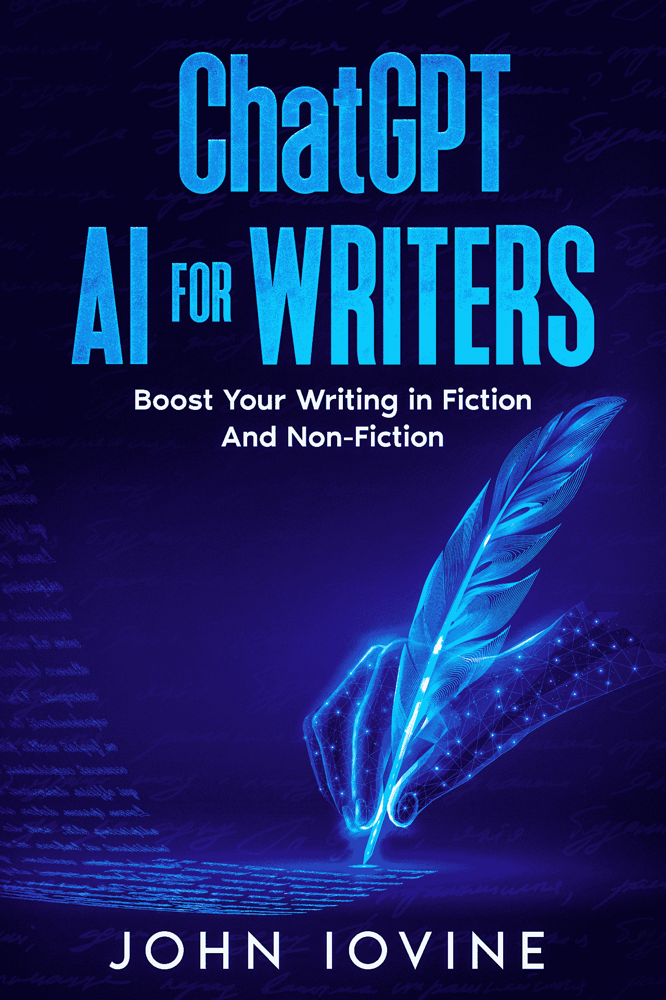

# 引言

人工智能（AI）在写作程序中的应用已有多年。作家们熟悉像 Grammarly、Quill Bot、Prowriting Aid、Hemingway 等语法检查器。最近，生成式 AI 取得了飞跃性的进展。这些新的 AI 正在写作领域引发范式转变——如此之大，以至于一些作家及其工会担心这些 AI 将使他们的写作技能贬值，并使他们失业。

我觉得害怕使用人工智能的作家将被那些确实使用人工智能的作家所取代。我建议作家利用人工智能来增强他们的创造力和提高他们的生产力。

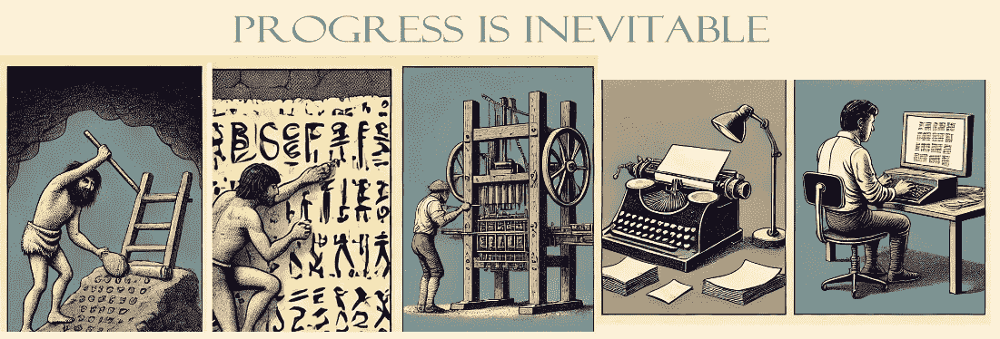

虽然人工智能的未来无限，但目前人工智能在某些应用上比其他应用表现更好。一些 AI 平台在某些应用上比其他 AI 平台表现更好。例如，Perplexity.ai 在搜索互联网最新新闻和研究方面比 OpenAI 的 ChaptGPT 做得更好。这一事实可能会在未来改变，但就目前而言，当我研究主题时，Perplexity 是我的首选 AI。

尝试一切方法，看看什么适合你。因为人工智能持续发展，今天不奏效的任务可能在六个月后就能完美运行。

# 第一章 – 人工智能辅助写作 - 版权与知识产权

我使用人工智能来编辑和改进我的写作。我不使用人工智能来写我的书籍和短篇小说。尽管我见过许多 AI 导师提倡这种确切的使用方法。

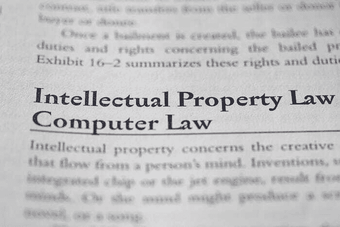

对于一些作家来说，与 AI 工具合作伴随着复杂的情感。使用这些平台进行头脑风暴、概述或草拟的吸引力无可否认，但他们担心他们作品的艺术所有权。最近，数据隐私问题和担心人工智能有可能窃取创意想法。让我们进一步探讨这两个问题。

版权与人工智能辅助写作

人工智能生成内容是否可以版权的问题目前正在全球法庭上被辩论。这些法院裁决将有助于设定法律先例，基于这些裁决，可能会有新的立法出台，但就目前而言，这是我看待人工智能生成和人工智能辅助内容版权状态的方式。

我不是律师；关于版权的这些材料基于我的研究和观点，不应被视为法律建议。

版权基础

版权一旦你的艺术作品以有形形式固定，就会自动获得。这适用于你创作艺术品、撰写故事、编写歌曲或录制音乐。版权是一种“自动权利”。然而，如果你将作品登记在美国政府处，证明你是合法的版权所有者会更容易。

为什么你应该注册你的创意作品的版权

要将你的作品登记在美国政府处，你需要填写一份申请表，支付一份登记费，并提供作品副本。版权局将审查你的申请，以确保作品符合版权保护资格。如果是的话，你将获得一份正式的“注册证书”。

注册版权保护使得在未经你同意使用你的作品时，追究法律途径变得更容易。如果有人未经许可试图使用你的创意作品，你可以将他们告上法庭，指控其侵犯版权。

一些认为人工智能创作的作品不可版权化

AI 渲染作品不受版权保护的想法可能源于美国政府在版权法规中的以下文本。

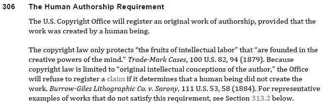

政府可登记的著作权

这段文字在美国政府“可登记的著作权：可以登记什么”的第三百章第 7 页，下面有链接。

[`www.copyright.gov/comp3/chap300/ch300-copyrightable-authorship.pdf`](https://www.copyright.gov/comp3/chap300/ch300-copyrightable-authorship.pdf)

通过遵循美国政府规定的严格法律，你可以修改 AI 渲染的作品，这会引发作品的著作权，因此，作品成为受版权保护的作品。

AI 渲染作品的修改

任何对 AI 渲染作品的实质性修改都可以创造人类作者的著作权。因此，作品变为“AI 辅助”而非“AI 生成”。AI 辅助的创意作品是受版权保护的。

为我和你登记的版权

是的，你可以对你的 AI 辅助内容进行版权登记。

作为一位希望版权登记自己作品的作家，理解这些细微差别并在将 AI 融入你的创意作品中时保持警惕至关重要。为了保持你的创意作品受版权保护，我的建议是使用 AI 作为你的写作助手和合作者，而不是作为唯一的内容生成者。

偷窃你的想法

一些作家在使用 AI 时担忧的一个问题是偷窃他们的写作想法。大多数 AI 平台，包括 ChatGPT 和 Perplexity，都会保留用户对话一段时间——即使会话结束后也是如此。虽然用户可以删除他们的对话，但这并不一定意味着数据完全从公司的内部系统中删除。在某些情况下，对话可能仍然以有限的方式被用于帮助改进 AI 模型。对于作家来说，想法是宝贵的，了解这些想法可能去向何方是至关重要的。

我们中的一些人，包括我自己，故意允许与 AI 的对话保持存储。这让我可以回顾讨论，提出后续问题或从之前的会话中产生新的想法。

我们对想法和数据有多少控制权，一旦它们落入第三方系统手中？

伦理的 AI 公司有旨在保护用户数据和知识产权的政策。然而，围绕 AI 和创造性的法律环境仍然模糊。尽管公司有最好的意图，但这些模型的训练数据可能仍然包含受版权保护的材料或生成与另一用户的想法惊人相似的想法。这并不一定是由于恶意意图；而是 AI 开发固有的风险。

值得注意的是，即使特定的对话保持私密，AI 也可能根据其训练数据中的模式为其他用户生成类似的想法。对于作家来说，这意味着在接近 AI 工具时既要有一种机会感，也要有一种谨慎感。好处是相当大的，但潜在的风险对想法所有权和隐私也是相当大的。

最后，作家必须权衡 AI 可以提供的创作优势与对其知识产权可能产生的影响。通过了解涉及的问题，你可以做出明智的决定，决定是否使用（或不使用）AI 作为创作伙伴。就我自己而言，我不担心我的 AI 对话被用作训练数据。

# 第二章 - AI 是作家的工具箱

AI 可以增强和提升你的个人和商业写作技能。在许多方面，AI 超越了工具的定义，可能被视为合作伙伴和合作者。

小说写作：

AI 将极大地加速你的写作过程。AI 可以帮助生成想法、情节、情节转折和人物，并重新措辞和改写文本以改进你的写作。

非小说写作：

AI 可以做上述所有事情，并协助开发非小说想法、创建大纲、总结文本、研究和参考资料查找。

商业写作与报告

AI 可以帮助从数据中生成商业报告，并撰写公司电子邮件和产品销售文案。

博客

博客和文章写作在有了 AI 协助写作和研究时变得容易得多。

视觉 OCR 和阅读图表

AI 视觉的能力可以阅读和解释图表和财务报告。它可以总结文章，阅读法律文件，并帮助你解释文本。见第十四章。

心理学与人物发展

你可以将个人情感和人物的人际关系反馈给 AI 以获取反馈。

AI 在心理学方面非常出色，不久的将来，我预计 AI 将增强人类治疗师的能力，或者自己成为合格的临床社会工作者。人类可能比他们的同行更信任他们的 AI 治疗师。

将这一方面的 AI 融入其中将提高你角色的真实性和动机。

书籍合同与法律文件

AI 不是律师，但可以轻松通过任何律师资格考试。它可以用来阅读和解释法律文件和术语。AI 可以提供关于版权、许可证、书籍和文章合同的见解。

它还可以编写简单的法律文件。网上可用的标准摄影发布声明过于庞大和详细，不适合我简单的交易。因此，我要求我的 AI 编写一份摄影发布声明。在第一轮中，AI 给了我一份三页的发布声明。这仍然太多了法律术语。我要求 AI 将其缩减到一页。它做到了，给了我一份我需要的简洁发布声明，并附上了额外的法律术语。

诗歌、歌曲与音乐写作

AI 可以写诗歌、歌曲和音乐。我不期望格莱美奖获得者会感谢他的 AI 为他创作的热门歌曲，但这并不意味着这种情况没有发生过。

翻译

向你的 AI 提供文本，AI 可以将该文本翻译成任何数量的语言，或将外语翻译成英语。

写作辅导

人工智能可以在许多科目中辅导你，包括英语。人工智能可以充当语法检查器、同义词词典和字典，并提供单词替代方案。

问题解决 - 与海明威合作

如果你有一个棘手的情节问题或写作问题，你可以与人工智能合作，就像你的一个最喜欢的或著名的作家一样。想象一下与海明威 AI 或菲茨杰拉德 AI 在情节点上合作。

研究

最新的人工智能版本可以访问互联网。这意味着它们可以帮助你进行研究和历史研究。

每日杂项问题

我转向人工智能来帮助我解决一些小问题。在过去的几天里，我询问了如何向 iPhone 短信中添加爱心，解释家庭 AC 电源系统中热、常见和地之间的区别，使用 741 运算放大器绘制一个简单的运算放大器，以及根据我上传到人工智能的图片生成文本到艺术提示。人工智能帮助我解决了 iPad 屏幕旋转解锁的问题。

你还希望从写作助手那里得到什么？

记住，人工智能可以是许多东西，它可以是一个工具，你的助手，也可以是你的合作伙伴。

版权 - 原创性的真实性

这个问题在第一章中已经解答。

大多数作家已经在使用人工智能增强。像 Grammarly、Quill Bot 和拼写检查器这样的复杂写作工具都使用了人工智能。我相信，当人工智能作为工具而不是内容创作者时，你仍然是创作者，你的作品对你来说是真实的，并且可以享有版权。

GPT4o 是众多之一。

GPT 是“生成预训练转换器”的缩写。这种语言模型在大量文本（深度学习）上进行了训练，以产生模仿人类写作的结果。当你把“Chat”这个词加到 GPT 上，你就得到了“ChatGPT”，这是一个聊天机器人。

市场上有很多 AI 平台。OpenAI 的 ChatGPT 是最容易被识别的之一；它可能不是每个应用中最好的。

GPT4o 是一个强大的 AI 工具，将帮助你创建优质内容。在这本书中，我将通过示例展示如何有效地使用这些 AI。

# 第三章 - 开设人工智能账户

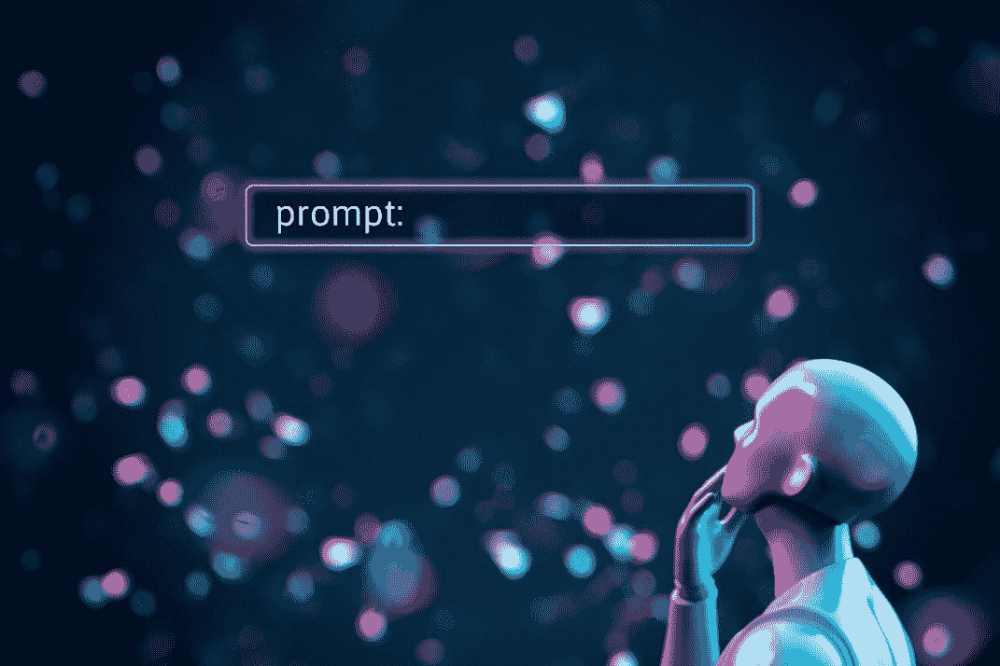

在选择 AI 时，你有许多选择。我将使用 OpenAI 作为主要示例。在章节的末尾，列出了其他替代 AI。

注册 ChatGPT

前往：[`chat.openai.com`](https://chat.openai.com)

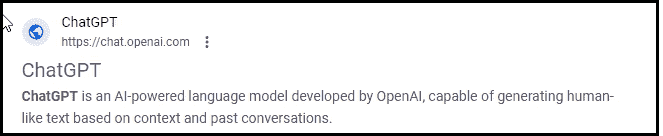

使用您的电子邮件地址注册账户并创建密码；请参阅下面的图片。

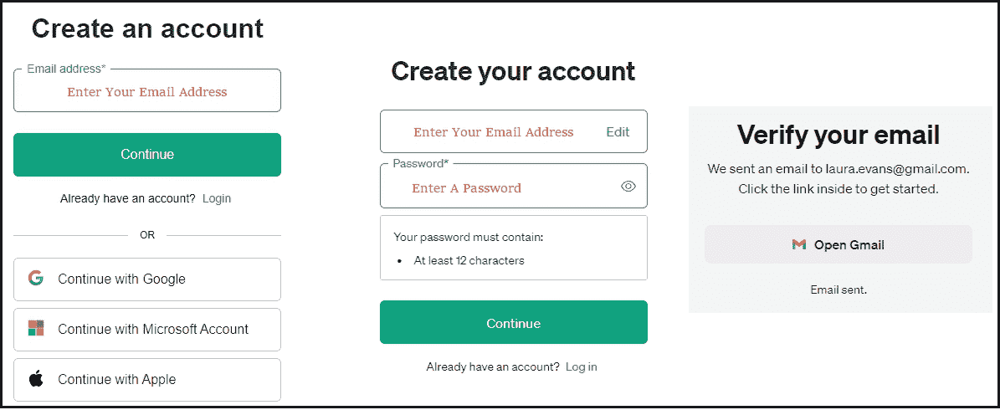

你可以免费使用 ChatGPT3，这是开始的最佳方式。准备好后，你可以升级到每月 20.00 美元的 ChatGPT4。在这个订阅级别，你可以访问 GPT4o（全能），这是一个更高层次的 AI 模型，具有更好的创造力。

一旦您的账户创建并验证了您的电子邮件，您就可以访问 ChatGPT AI。

ChatGPT4 被认为是传统模型。ChatGPT 的新版本包括 GPT-40、GPT4o Omni、01 预览、GPT-40 with Canva 和 01-mini。

更多 AI 机器人

OpenAI 的 ChatGPT 可能是最熟悉的聊天机器人，但存在许多替代方案。大多数 AI 机器人都有类似的登录流程，通常还有一个免费版本供人们尝试。

Twitter X Grok

Grok.ai 可供 Twitter X 的付费会员使用。截至本文撰写时，访问的月费为每月 16.00 美元。Grok 的独特优势在于其提供不受政治正确性影响的信息的能力，例如气候变化、移民和绿色能源成本，这为用户提供了一个更客观和事实性的视角，促进了更明智和开放的对话。

复杂度

Perplexity.ai 的免费版本可以通过这里访问。

[`www.perplexity.ai/`](https://www.perplexity.ai/)

专业版每月费用为 20.00 美元。

这款 AI 的特别之处在于，它进行了广泛的网络搜索来回答问题。它提供了其答案的参考 URL。AI 正在添加网络搜索，以便可以访问最新信息。

AI 聚合器 – Futurepedia, Gmtech, Magai, Edenai

一站式服务，包含所有功能

有一些 AI 聚合器服务允许用户以每月的费用访问和使用各种 LLM 和图像生成器。

基本服务起价为每月 14.99 美元。访问 AI 的费用是微不足道的，通常大约为每 AI 响应 0.01 美元。每个服务都有自己的独特计划，因此您需要访问 AI 网站以获取其详细信息。

这笔钱会从您的信用中扣除。如果您超过每月 5.00 美元的配额，可以购买额外的信用。

[`gmtech.com/`](https://gmtech.com/)

下面是他们当前 AI 集成的截图。

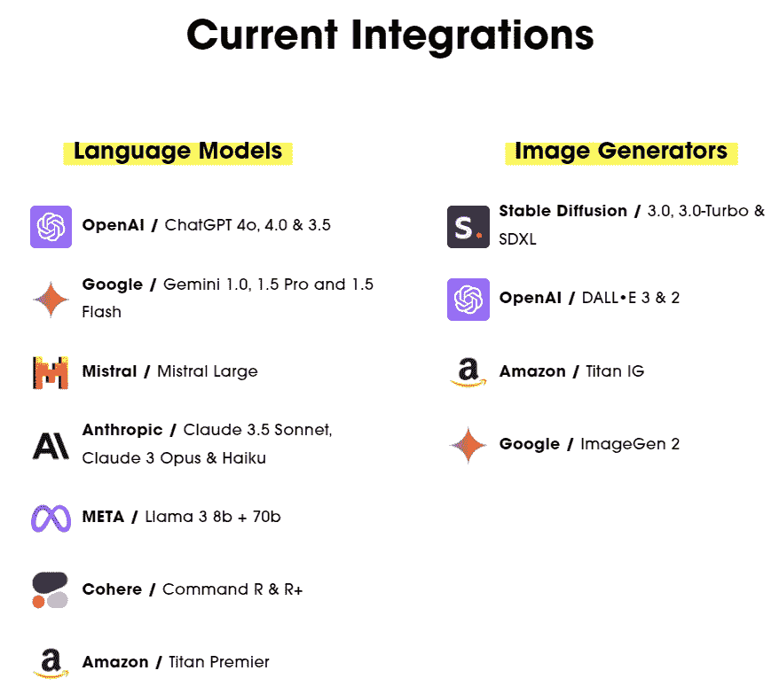

要访问 Magai

[`magai.co/`](https://magai.co/)

Magai 提供超过 16 个大型语言模型和超过 5 个 AI 图像模型的访问权限。

要访问 Futurepedia：

[`www.futurepedia.io/`](https://www.futurepedia.io/)

要访问 Eden AI：

[`www.edenai.co/`](https://www.edenai.co/)

您可能需要寻找新的 AI 聚合器，因为每天都有更多服务出现。这些服务以每月的费用为用户提供访问各种 AI 平台的机会。

# 第四章 - 创建提示

有效使用 AI 涉及创建提示，以便与 AI 进行沟通，从而获得您期望的结果。

这本书将指导你编写有效的写作提示。为财务分析、物理和天文学编写的提示需要不同的方法，这里没有概述。

构建有效的提示是一项可学习的技能。

提示

我认为没有人会争论，构建提示是释放 AI 力量的关键。

你可以使用 ChatGPT AI 执行以下任何一项：

1 - 根据一个主题生成书想法。

2 - 生成虚构书大纲。

3 - 生成书名。

4 - 总结文本

5 - 重写并改进文本。

6 - 帮助创造书中的角色。

7 - 生成非虚构大纲（如太阳能、风能等）

8 - 生成角色描述。

9 - 生成决策或想法的利弊。

10 - 生成列表。

11 - 生成诗歌

12 – 生成歌曲

13 – 批评并对你故事/文本提供反馈。

14 – 解决问题 - 帮助警察程序等。

15 - 语言翻译

16 - 为文本到艺术 AI 生成提示。

17 - 学习个人教练

18 - 写电子邮件 - 个人和商业

19 - 创建回应 - 商业和个人

20 - 在在线学习课程中充当辅导老师

21 - 提供你对角色行为的洞察。

上述列表只是 AI 能力的一小部分。我们在这章中提到的许多提示将在接下来的章节中更详细地探讨。

提示分类 - 开放、固定和对话（聊天）

开放 - 开放提示允许 AI 生成最具创造性的回应。例如，“写 300 字关于太阳能的优点。”主题可以变化，如糖尿病患者最佳食物、饮食等。

ChatGPT 出色地写了 300 字关于太阳能优点的文章。

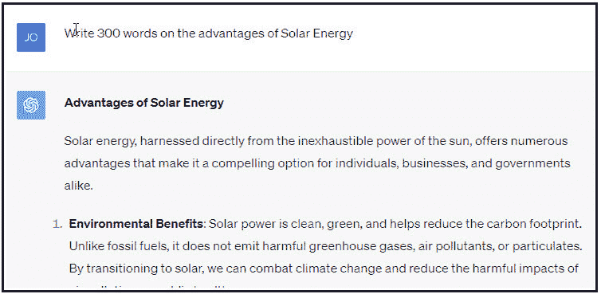

固定 - 这个提示要求提供具体的事实或事实。例如，“谁是美国的第三任总统？”记住，AI 可能会产生事实和数据幻觉，所以请记住要双重检查其数据输出。

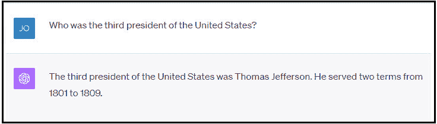

Chat - 使用 ChatGPT 创建角色回应。在这个场景中，我的 13 岁角色汤米有一个问题，向他的医生父亲解释为什么他生物考试不及格。我要求 ChatGPT 给我一些角色可能如何回应困境的几个想法。ChatGPT 提供了六个可能的选择。

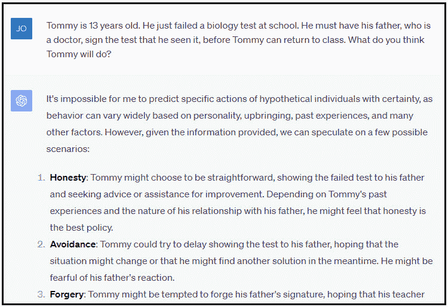

从任何分支跳起

你可以用这些 AI 回应想法中的任何一个作为起点，或者这些建议甚至可以激发你想象出你想要追求的完全不同的回应。

这不仅仅是一个（咬一口苹果）提示

我看到很多人写提示，在 AI 之后只进行一次提示就结束对话。不。你可以继续提问和细化你的问题，深入挖掘，直到你对自己的答案满意。

你可以继续向 AI 提出多个问题，以澄清或简化其回答。

在上述示例中，假设你想要追求“避免”情景。你可以要求 AI 填充这个想法，并考虑汤米采取这一行动可能带来的潜在后果。

如果 AI 的回答过于模糊，可以通过附加提示要求更多细节来深入挖掘。

跟我说话，正式-非正式

你可以指示 AI 以正式、学术的方式撰写回答。

或者你可以要求 AI 以友好、非正式的方式回答。我会避免使用 AI 笑话和 AI 讽刺。在我最后一次检查时，AI 还没有发展到能够以可信的方式做到这一点。

积极自信

我喜欢我的 AI 积极自信。但我不希望每次对话一开始就要求 AI“积极自信”。这就是你可以实施 GPT 的地方。

我专门用了一章来介绍如何创建 GPT 以及它们是什么。把它们想象成一个存储在 OpenAI 服务器上的程序性提示脚本，你可以在任何时候调用它。

通常，AI 回答的质量与你的提示质量成正比。以下是一些建议，用于编写有效的提示。其中许多建议都有专门的章节来探讨其使用。

分割 AI 的大知识库

AI 拥有庞大的知识数据库。通过告诉 AI 我们希望它将其知识分割到我们感兴趣的领域，我们可以获得更好的回答。许多此类提示都以著名的“作为一个专家[你命名的主题]”开始。

为 AI 建立一个角色

除了“作为一个专家”的提示，我们还可以提示 AI 扮演一个角色。这个角色可以是医生、侦探、海军、警察、宇航员、码头工人等。在写作中，你可以要求 AI 扮演一个角色，并对其在虚构情景中的反应或提问。

建立你的受众

AI 可能需要了解其受众。向青少年解释医学问题与向成人解释不同，与其他医疗专业人员也不同。

建立 AI 的语气

我们之前已经讨论过这个问题。我们希望 AI 以中立、正式、非正式、友好和自信的方式回答吗？

背景

给 AI 一些设定和背景将提高其回答的质量。想象一下，当一名海军在丛林、城市或距离地球 50 光年外的太空港作战时，他的回答会有多大的差异。

通过将此信息纳入你的提示，AI 的回答将更加专注和准确。

创建优秀提示的关键-清洗、冲洗、重复

1) 在文本框中写下你的提示并点击发送。

2) ChatGPT 将处理你的提示并在聊天区域撰写其回答。

3. 分析 ChatGPT 的回答

4) 优化你的原始提示以获得更好的结果。

接下来的章节将探讨我们在这里讨论的技巧。

# 第五章- 写作小说：故事、情节和人物

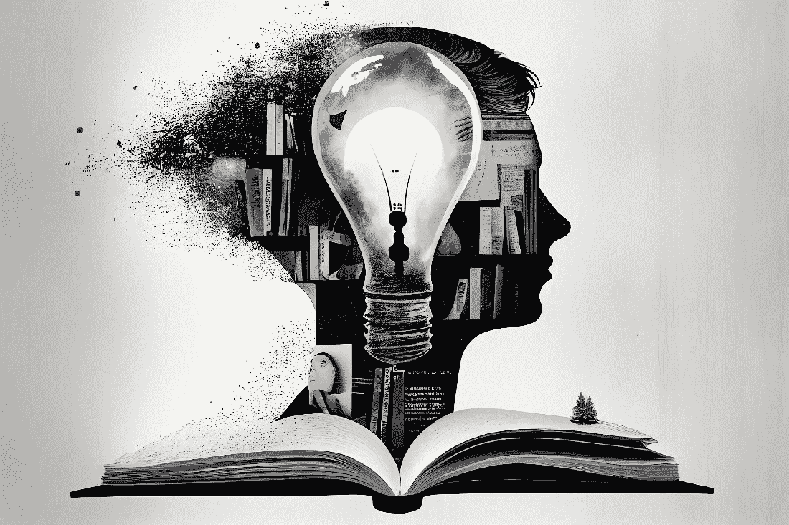

小说 - 情节和概要

如果你有一个故事的想法或者没有，你可以让 AI 填充故事情节和概要。

让我们从第一个场景开始：你有一个想要发展和推进的想法。以下是我计划撰写的科幻故事的一个想法。

一群环绕地球的宇航员看到地球突然消失。然而，地球的云层仍然存在，空间站和月球仍然保持在失踪行星的轨道上。一位宇航员记得阅读过关于在 CERN 进行创建亚原子黑洞的实验。宇航员们推测黑洞被制造出来并吞噬了地球。他们唯一的希望是打破轨道并到达火星，那里有物资等待开始一个小型殖民地。

我在想法的开头添加了以下指令。为以下科幻小说撰写情节和故事概要。

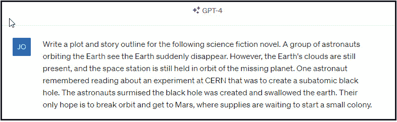

接下来，我将我的请求和想法发送给了 ChatGPT4，我获得了三个部分加上一个结语。第一部分如下所示。

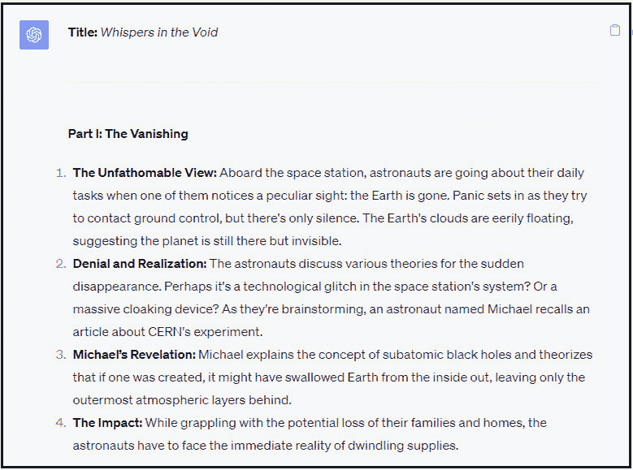

AI 为这本书提供了标题“Whispers in the Void”，我认为这是一个不错的暂定标题。第一部分紧密跟随我的想法。让我们继续到第二部分。

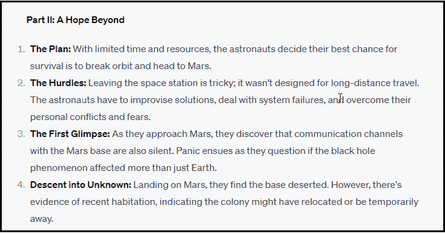

第二部分的前两个情节点与我的想法一致。然而，情节点 3 和 4 则不然。我认为火星上只有等待殖民者到来的物资。让我们继续到第三部分。

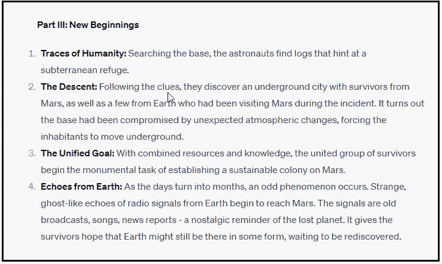

在第三部分，这个故事的情节与我的原始想法继续偏离。如果这是一个活跃的项目，我可以调整我的原始提示，使其更接近我的想法。或者我可以结合 AI 情节点的随机性。阅读情节点 4，来自地球的回声。这肯定是在大多数人认为地球上的人都已死去的大部分故事之后的一个转折。

现在，我们进入最后一部分，即结语。

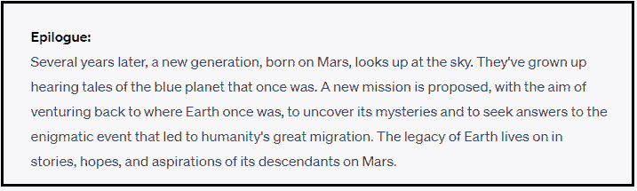

我对结语并不兴奋，但如果这是一个活跃的项目，结语可以进一步发展。

第二个场景 - 我不知道接下来想写什么。

你陷入了写作瓶颈。你想要写一个科幻故事，但没有想法。你可以让 AI 提出十个科幻故事的想法，或者你可以自己选择一个主题。

首先，我们让 AI 提出十个想法。

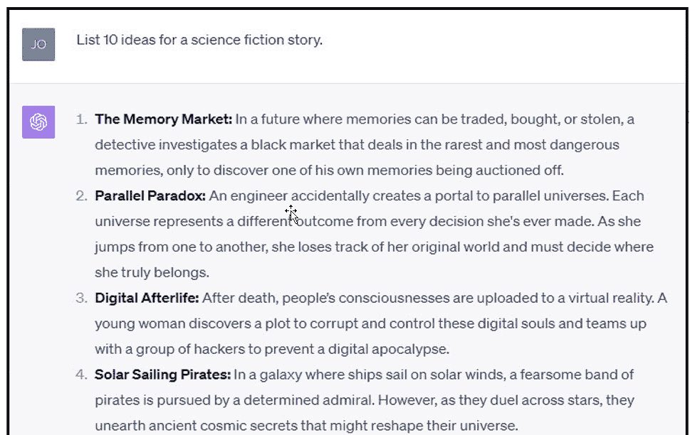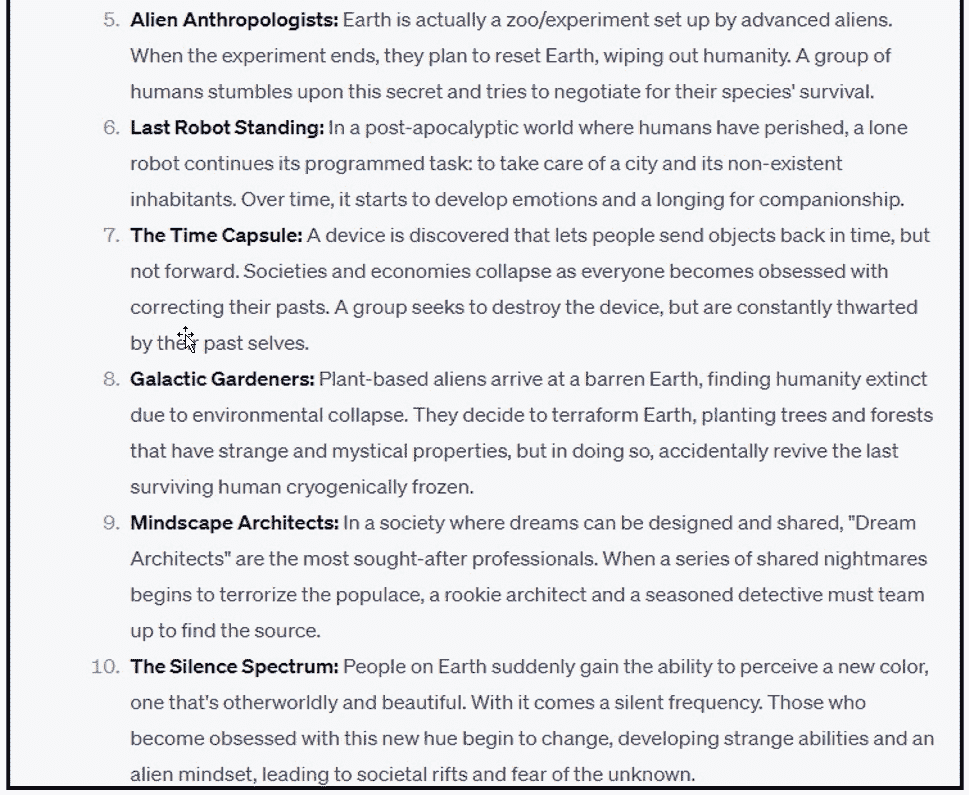

你可以采用这些想法中的任何一个，或者使用你自己的想法。让我们从 AI 生成的第一个想法开始。让我们在想法的开头添加我的指令句子：“为以下科幻小说编写情节和故事大纲。”

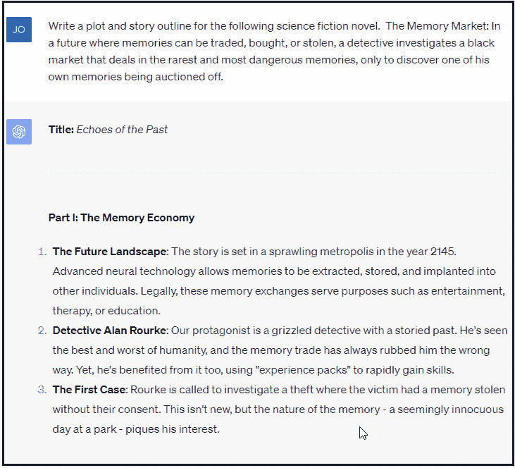

再次强调，AI 已经创建了一个合适的标题、背景和主角。接下来进行第二部分。

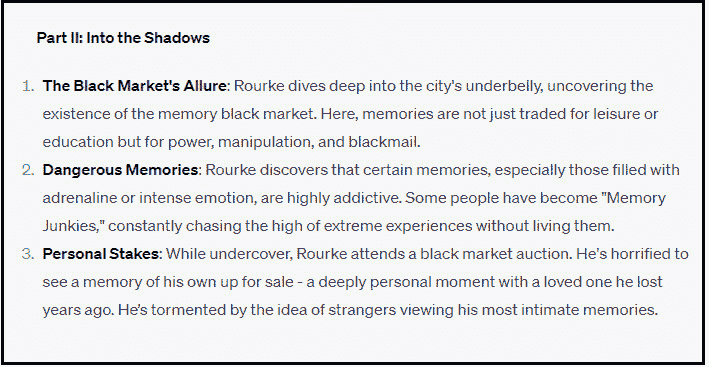

AI 提供了优秀的情节点和发展，进入第三部分。

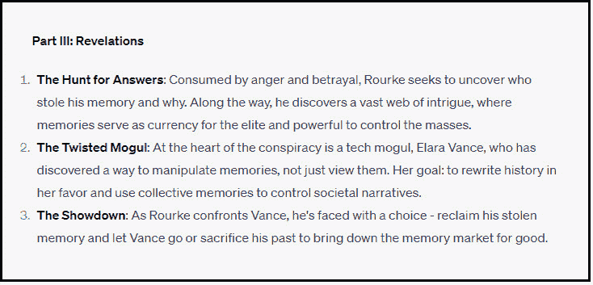

AI 从主角的个人问题开始发展情节，并在第四部分推进到全球性问题。

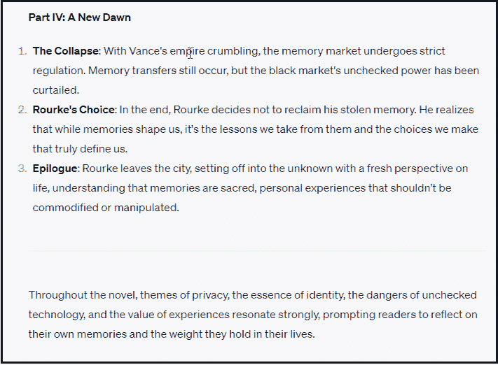

一个完整的故事大纲。记住，每个部分和情节点都可以调整以符合你的愿景和感受。

# 第六章 - 撰写非虚构作品；想法、大纲和目的

非虚构作品

如果你使用 AI 协助撰写非虚构材料，请小心。AI 有时会“产生幻觉”信息，提供如此详细的不准确或编造的信息，以至于你会毫不犹豫地认为它是真的。

在研究医学主题时，我曾遇到一个 AI 完全编造医学事实，并使用对不存在的研究和论文的虚假引用。AI 在编造过程中涉及的细节让我震惊。

很不幸，我们有一种相信计算机和 AI 在引用事实时的倾向。始终验证 AI 生成的任何事实。与 AI 打交道时，要信任但也要核实。

抄袭

AI 工具的设计是不直接复制现有内容，因此明智的做法是在预防措施下运行 AI 生成的文本通过抄袭检测器。

非虚构想法和大纲

如果你有一个非虚构文章或书籍的想法，你可以指导 AI 发展想法和大纲。如果你没有想法，你还可以指导 AI 提供想法。

让我们从第一个场景开始：你有一个想要发展和推进的想法。以下是我计划撰写的关于个人发展的想法。

当许多自助如何发展文章/书籍专注于目标设定时，我的文章将专门讨论对目标的坚持。当一个人最初设定目标时，兴奋和实现计划的驱动会让你前进。大多数值得追求的目标需要相当长的时间才能实现。因此，我的文章是关于如何在热情消退、你更愿意停止并追求另一个不同且闪亮的目标的时侯，如何坚持不懈并继续努力实现目标。

我在想法的开头添加了以下指令。将这个想法重写并改进，以将其发展成一个写作大纲的指令。

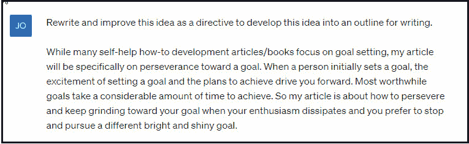

AI 回应了一个标题和目标。

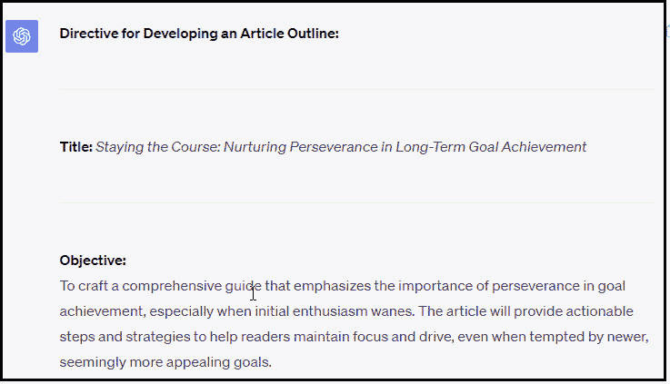

随后是一个 7 章大纲，每章都有要涵盖的子点。

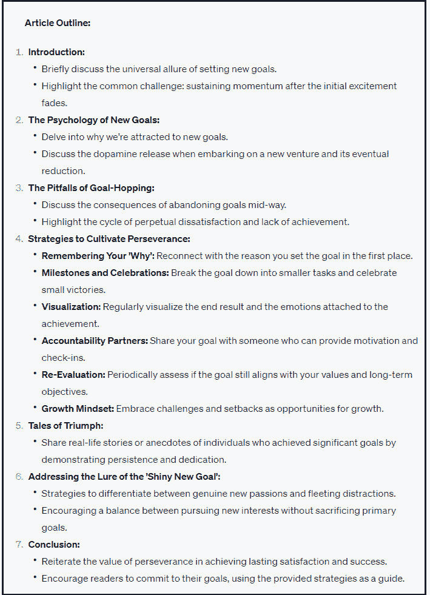

它以给作者的一则笔记结束其回应。

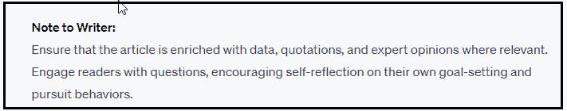

更大的关注

我可以通过定义一个要模仿的个性和受众来让 AI 达到更大的关注。我这里没有这么做。让我们假设你对这个大纲感到满意；你可以通过要求 AI 针对每个要点进行写作来继续进行。

第一章，引言的第一点是简要讨论设定新目标的无尽吸引力。

你可以要求 AI 就第一个要点写 100 个字，开始充实文档。

写 100 个字 - 简短讨论设定新目标的无尽吸引力。

ChatGPT 回应道：

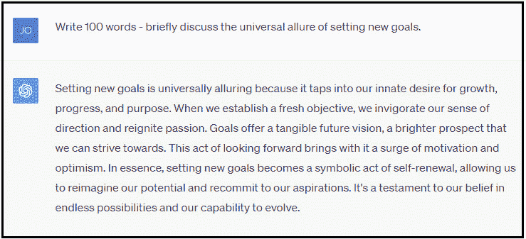

你可以继续这样写，直到你有一个完整的文章准备编辑。

想象力生成

如果你没有明确的文章/书籍主题，你可以要求 AI 为你创造想法。使用对实现目标所需坚持不懈的想法，我们可以向 AI 提出以下问题。

请生成五个以如何保持实现目标坚持不懈为焦点的自我提升文章想法。

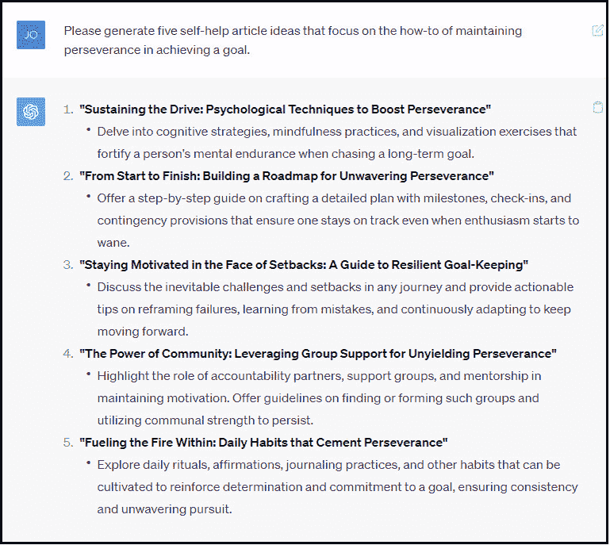

我们可以对 AI 提供的每个文章想法进行深入挖掘，就像我们对第一个想法所做的那样。

# 第七章 - Sudowrite For Topics AI Will Not Write

有些事情，好吧，很多事情，我们的标准 AI 平台会拒绝写作。在 ChatGPT 的情况下，任何超出 OpenAI 内容指南的内容都会被拒绝或限制。这包括过于血腥的暴力、性、强奸、乱伦或奴隶制场景。我无法列出所有可能触发内容警告或服务拒绝的内容，但在写作小说的过程中，你不想与你的 AI 写作助手争论。

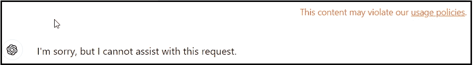

当其他平台拒绝你的请求时，Sudowrite 将帮助你写作。Sudowrite 是一个旨在帮助作家创作创意小说的 AI。像其他 AI 一样，Sudowrite 旨在帮助你写作，而不是为你代写。

Sudowrite 功能强大，我感觉它比通用 AI 在写小说方面略胜一筹。然而，对于非虚构写作，我感觉 GPT4o 是更强的 AI。

话虽如此，让我们来探讨一下 Sudowrite 的一些小说功能。以下是 Sudowrite 的股票主页。

请记住，这只是一个 Sudowrite 的快速概述。要探索其所有功能，可能需要一本书。然而，初学者可以在 Sudowrite 的基本级别上使用它，并仍然获得优秀的结果。

这是我的 Sudowrite 主屏幕。

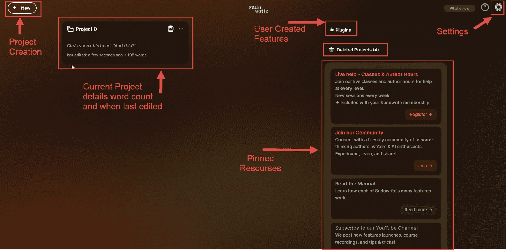

要更改颜色主题，点击右上角的设置齿轮图标。这会打开以下屏幕；

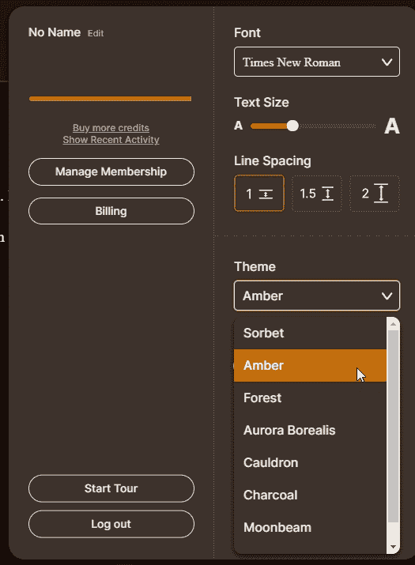

我将主题从 Sorbet 更改为 Amber。

新项目

当你选择一个项目时，会打开一个新的 Sudowrite 屏幕进行写作和编辑。

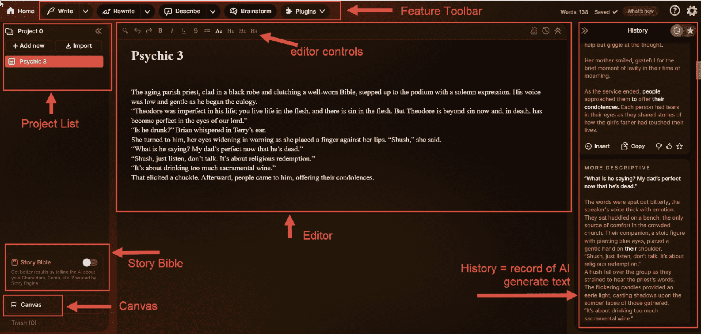

屏幕中央是编辑器。它在其左上角有预期的编辑器控制。

编辑器左侧的项目列表列出了你的项目。

历史面板位于编辑器右侧。它显示了 Sudowrite 生成内容的记录。在每张卡片下方，你可以插入或复制文本。你还可以高亮并复制文本的一部分用于你的写作。

左下角的画布选项打开一个屏幕，允许你可视化文本。就像一个文本到艺术 AI。见以下示例

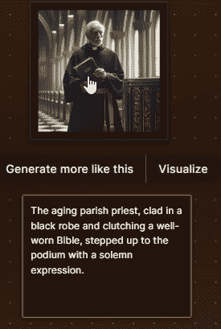

功能工具栏提供了一些在标准 GPT4o 中需要提示的选项。

重写

如果你编辑器中高亮文本，你会得到以下选项来处理该高亮文本。

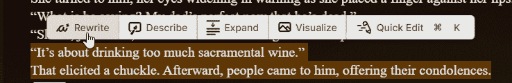

如果你选择重写，屏幕右侧将提供以下选项：

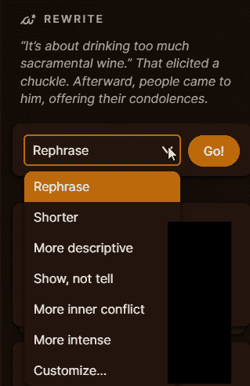

从下拉菜单中选择你想要 Sudowrite 执行的操作，然后点击“执行”。

结果将在屏幕右侧显示，供你插入、复制或编辑到你的故事中。

Quick Chat

Quick Chat 就像一个 ChatGPT 提示屏幕。当你编辑器中高亮文本时，你会得到以下选项。

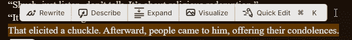

点击“快速编辑”会打开一个提示窗口。在这里，你可以输入 ChaptGPT 风格的提示来编辑你高亮显示的文本。

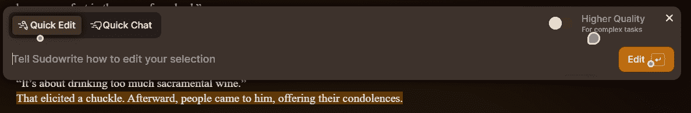

我输入了一个提示，要求 Sudowrite 使文本更具描述性。结果是以下内容：

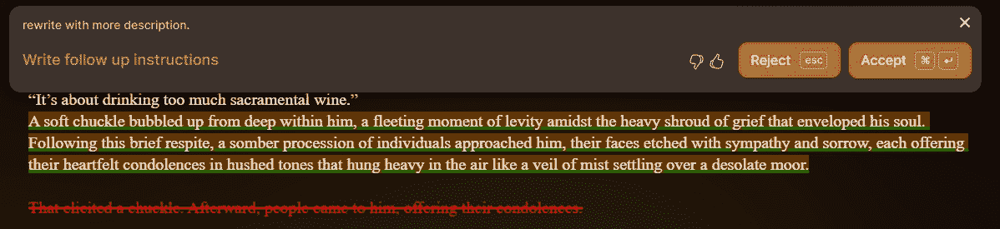

我可以接受或拒绝 Sudowrite 的输出。

为你写作

你可以指示 Sudowrite 为你写作。为什么？假设你遇到了瓶颈，有写作障碍。Sudowrite 可以阅读你写的内容并添加一些有意义的文本。

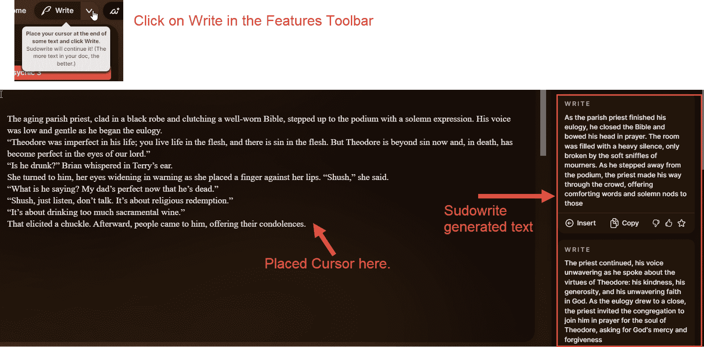

我将光标放在截图最后一句的末尾。然后，我在功能工具栏中点击了“写入”。截图右侧显示的文本是 Sudowrite 生成的文本。

描述

如果你突出显示文本中的某个项目，你可以要求 Sudowrite 描述该物品。它将为五种感官以及一个比喻各写一个描述。每个选项都可以打开或关闭。

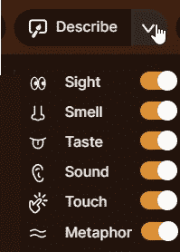

例如，想象一下突出显示“金戒指”这个词，并要求 Sudowrite 描述它。Sudowrite 将生成以下输出。

视觉

金戒指在明亮的阳光下闪耀，其抛光的表面反射着光线，呈现出令人眼花缭乱的色彩。它的环带细而精致，装饰着复杂的藤蔓和叶子的雕刻。

金戒指在阳光下闪烁，其表面捕捉并反射每一束光线，创造出一道耀眼的光芒。金属被抛光到闪亮的光泽，营造出奢华和优雅的感觉。

金戒指在阳光下闪耀，其光滑抛光的表面像迷你镜子一样反射周围的景色。

嗅觉

戒指散发出微弱的金属和土壤气味，暗示了用于制作它的自然元素。

金戒指没有气味，但佩戴者的油脂和香水会附着在其上，留下淡淡的甜味和温暖。

金戒指的金属香味从戒指中飘散出来，空气中充满了财富和奢华的香气。

味觉

如果舔一下金戒指，舌头会留下金属的味道，提醒它的珍贵材质。

戒指没有味道，但舌头上有一种温暖和熟悉的感觉，就像亲人的触摸仍然存在。

虽然不推荐，但舔戒指会透露出微弱的金属味，类似于舔硬币。

听觉

当戒指滑到手指上时，可以听到柔和的叮当声。敲击硬物会产生清脆的叮当声，这表明了它的价值。

当戒指被拿起并移动时，会发出柔和的叮当声，几乎像是 tiny bells chiming together，一种精致的旋律，增添了它的魅力。

当它落下时，金戒指与其他金戒指碰撞，发出悦耳的叮当声，是一曲财富的交响乐。

触觉

金戒指触感凉爽光滑，重量轻而充实。沿着雕刻轻轻触摸，可以感觉到设计的轻微凹痕。

沿着戒指轻轻触摸，感觉光滑凉爽。金属坚固而不可屈服，但在重量上却给人以安慰。

戒指触感温暖，光滑的表面暗示着制作它所需的技艺和工艺。

比喻

戒指像金色的阳光露珠一样闪耀，在日常生活中单调的灰色中成为财富和奢华的亮点。

比喻

那个戒指就像一个小太阳，投射出金色的光芒，在手指表面闪烁和舞动。

ChatGPT4

要求 ChatGPT4 描述一个金戒指，会得到以下输出。

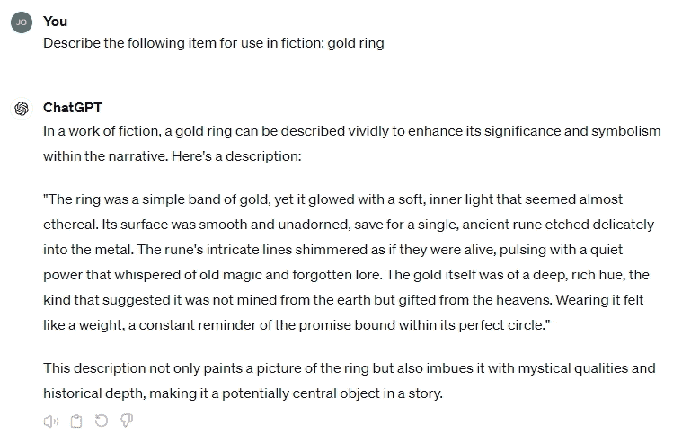

SudoWrite 的超级功能

Sudowrite 有许多我尚未尝试的功能。但我不提及其最重要的功能——Sudowrite 的“故事圣经”是不妥的。

故事圣经

点击故事圣经会打开一个关于你故事的问题页面，这将帮助 Sudowrite AI 保持方向并产生优质内容。AI 往往会偏离主题，写出与当前故事无关的内容。

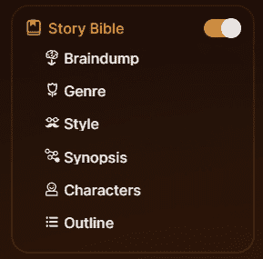

下图显示了全页 GUI。

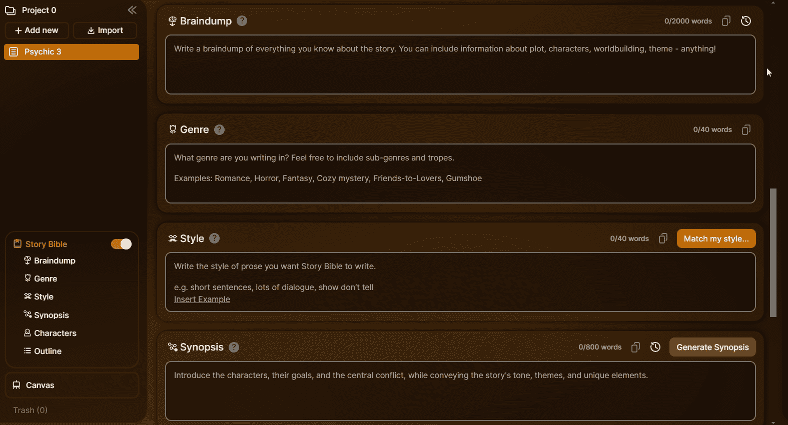

故事圣经是无价之宝，许多小说作家对其评价很高。然而，正确填写它既广泛又费时。这是“垃圾输入，垃圾输出”的计算机哲学。如果你想从 Sudowrite AI 获得最佳内容，请用最佳内容填写故事圣经。记住，你不必一次性完成整个故事圣经。它可以在几个写作会话中完成。

我只会为更复杂的写作项目，如小说和短篇故事系列，花费时间填写故事圣经。

成本

Sudowrite 的定价是购买积分。程序在执行写作任务时会消耗积分。

学习 Sudowrite

有许多资源可以学习 Sudowrite。Sudowrite 公司提供现场课程，并在 YouTube 上拥有大量的教程视频库。

Sudowrite 有一个你可以加入的 Discord 频道。

许多独立作家也在 YouTube 上上传了 Sudowrite 教程视频。

YouTube 视频

[`www.youtube.com/watch?v=LwUIAvOIGUE&t=7s`](https://www.youtube.com/watch?v=LwUIAvOIGUE&t=7s)

其他 AI

这里有一份简短列表，列出了专门针对写作的 AI。

Rytr

[`rytr.me/`](https://rytr.me/)

ShortyAI

[`www.shortlyai.com/`](https://www.shortlyai.com/)

WriteSonicAI

[`writesonic.com/`](https://writesonic.com/)

JasperAI

[`www.jasper.ai/tools`](https://www.jasper.ai/tools)

# 第八章 – 让角色说话

就像演员一样，你可以在 ChatGPT 响应提示之前，指导它采用一个角色或人格。目的是为了使 AI 的响应符合你的期望。例如，你可以指导 AI 以专业角色回应，如医生、律师或印第安首领。

例如，在一个虚构场景中，你可以要求 AI 重写一小段对话，就像一个角色在和一个有医疗问题的人物交谈一样。这将增加一定的现实感。

为了看到扮演角色的效果，我要求 ChatGPT4 以火箭科学家和一个 13 岁男孩的身份分别写一个 100 字的阿波罗发射描述。

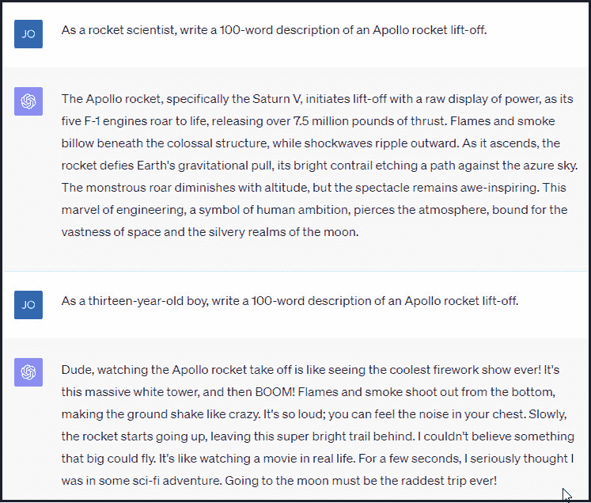

我喜欢写一段文字，然后让 ChatGPT 用著名恐怖作家或硬汉侦探小说家的笔调重新写一遍。

这里是使用著名恐怖作家笔调重写的作品。

这里是硬汉侦探作家的风格。

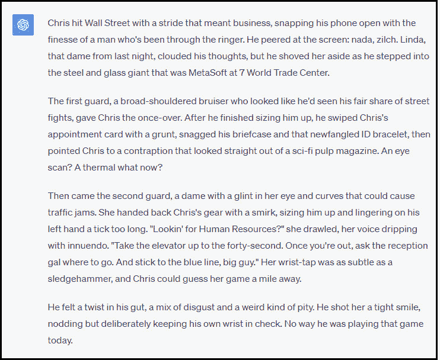

纸浆小说及其他声音

作为一名作家，你可能不想提及其他作家的名字。这是完全可以理解的。与其使用作家的真实姓名，不如使用通用术语，如“恐怖作家”或“超自然作家”。对于硬汉侦探，与其使用作家的真实姓名，不如使用“纸浆小说作家”和“黑色电影——硬汉侦探作家”。尝试并玩转这些术语；你将发展出能提供所需结果的自己的提示。

你可以指导 ChatGPT 以你定义的任何虚构或非虚构体裁进行写作。

更多声音和背景

这里是一个可能用于指导 AI 创建聚焦于虚构内容的部分关键词列表。

情绪与心情

爱                  恨            讽刺的            有趣的

有益的            有害的            热情的               感官的

暗黑                  光明            恐怖            精神错乱

惊悚            超自然            幽灵般的            致命的

定义并修剪输出

我通常限制 AI 的输出。简单的术语如写 100 个字。

# 第九章 - 写作情感场景

AI 可以在两个主要类别中帮助编写情感场景。一是描述你的角色在特定情况下可能感受到的情绪。二是编写情感场景本身。

让我们以第一种情况为例，描述你的角色的情绪。

提示：

描述一个紧张的人在过山车上被垂直拉到第一个下坠点时感受到的焦虑。

结果：

当一个紧张的人被垂直拉到过山车第一个下坠点时，他们可能会体验到一系列的情绪和身体感觉。以下是他们可能感受到的焦虑描述：

1.  预期与恐惧：当过山车缓缓上升时，人们可能会感到越来越强烈的预期与恐惧交织。缓慢的上升过程累积了紧张感，他们可能会变得对链条每一次拉动他们向上的声音变得极度敏感。

1.  急速思维：他们的思绪可能会飞速转动，思考即将发生的事情。他们可能会质疑自己乘坐这个过山车的决定，或者带着恐惧和兴奋混合的情绪想象即将到来的下坠。

1.  身体感觉：从身体上讲，他们可能会经历心跳加速、呼吸急促和胸部紧绷。他们的胃可能会感觉像被结在一起，他们可能会因为身体对感知到的威胁的反应而出汗或口干。

1.  感官增强：当他们达到顶峰时，他们的感官可能会感到增强。从顶部看到的景色、过山车的声音和风的感觉都可能显得更加强烈，这些都加剧了他们的焦虑。

1.  紧张与释放：当他们在接近顶部时，紧张感达到顶峰。在掉落前，有一瞬间失重和悬浮的感觉，这既可能感到恐怖又可能感到兴奋。

1.  战斗或逃跑反应：他们的身体可能会激活战斗或逃跑反应，这是一种对恐惧的自然反应，导致肾上腺素激增，增强他们的警觉性和意识。

总体来说，被拉向过山车第一座山的体验可能是一种复杂的恐惧、兴奋和身体兴奋的混合，最终在准备冲下时达到强烈的情绪高潮。

在下一个提示中，我们指导 AI 编写场景本身。

提示：

编写一个虚构的第一人称场景，描述一个紧张的人在过山车上被垂直拉向第一座山时的感受。

结果：

当我坐在过山车座位上时，安全带咔哒一声扣紧，将我锁在这个既带来刺激又带来恐怖的金属装置中。过山车猛地向前一冲，我的心跳漏了一拍。我紧紧抓住杆子，我的指关节因为车缓缓向高耸的第一座山移动而变白。

随着链条提升的每一次咔哒声和叮当声，我的焦虑感增强，在胸中紧紧地盘旋。这是一种奇怪而强烈的恐惧和兴奋的混合，就像在我体内肆虐的暴风雨。我的思绪飞快地翻滚，无法平静下来。“我为什么会想到坐这个？我们有多高？”我们爬得越高，下面的世界看起来就越小。我可以看到整个游乐园在我们下方蔓延，它是一个微缩版。如果不是胃里的那种令人不安的恐惧，这几乎是一种美丽。

我深吸一口气，试图平静我的神经，但我的身体有不同的想法。我的心跳得如此之快，以至于我能在耳边听到它，每一次跳动都像鼓声一样回响。我的手掌在冰冷的金属杆上出汗，我感觉到脖子后面有刺痛感。

当我们接近顶峰时，有一瞬间悬浮——既令人兴奋又令人恐惧的失重感。期待几乎难以忍受。我知道接下来会发生什么，但我完全没准备好。风呼啸过我的脸，唯一的声音是过山车微弱的叮当声。

在短短的一瞬间，一切似乎都静止了。世界屏住了呼吸，我也一样。然后，我们冲了下去。

跌落是自由落体进入混乱，一种让我呼吸困难、让我的胃部翻腾的狂野冲刺。它是可怕的，但当我们沿着轨道飞驰而下时，恐惧转变为一种电流般贯穿我的兴奋。我现在在尖叫，但那是一种混合了笑声和纯粹、无拘无束的兴奋的声音。

当我们平稳过渡并准备迎接下一个转折点时，我意识到恐惧已经让位于另一种完全不同的东西——一种胜利感，以及有时最可怕的时刻会带来最难忘的经历的提醒。

记住，AI 在编写一个角色，而不是你的角色。你可以通过在提示前加上你角色的性格特征来使回应更符合你的角色。

此外，AI 将会编写一个通用的场景，在这个场景中，人物将面对恐惧以及随后的兴奋。它不会编写任何独特的内容，比如角色在第一次跌落时弄脏了裤子。

作为一名作家，你可以采用这个通用场景的框架，并重新编写使其成为你自己的。

# 第十章 - 添加情绪与情感

我想进一步探讨如何指导 AI 创建具有特定语调的作品。通过语调，我指的是文本的基调或情感质量。我们可以要求 AI 编写幽默、讽刺、外交、有帮助、充满爱意、仇恨等的文本。

我已经发布了指导 AI 根据职业假设某人个性的例子。你可以通过添加一个增强所需语调的个性来加大提示的力度。例如，你想要一个关于一个肥胖的人再次点第二份巧克力蛋糕的讽刺笑话。指导 AI 以喜剧演员唐·里克斯的口吻编写这个笑话。

让它变得有趣

请以喜剧演员唐·里克斯的口吻写一个关于一个肥胖的人再次点第二份巧克力蛋糕的讽刺笑话。

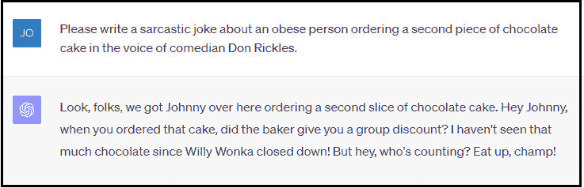

无论你是否喜欢开玩笑，这都不是重点。在其回应中，AI 为你提供了丰富的想法和概念，你可以从中跳出来。你可以选择只使用 AI 输出的最佳部分。例如，假设你正在写一个虚构故事中的场景，并想让一个角色在餐厅的会议中向另一个点了第二份派的角色说些话。这个角色可以说，“嘿，面包师给你团体折扣了吗？”

让它变得悲伤

写出 50-75 个充满同情和悲伤的词，描述一位父亲对他的儿子说，他的宠物猫需要由兽医进行安乐死。

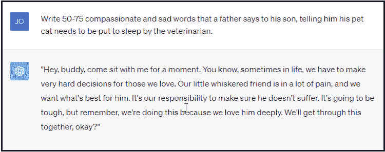

让它变得愤怒

写出 50-75 个愤怒的词，描述一个男子两分钟后回到他的车时发现警察已经给他开了一张停车罚单时说的话。

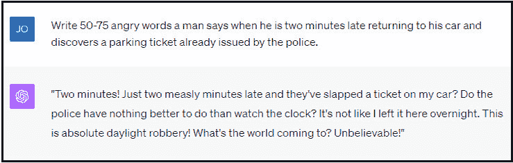

使其外交化

写 50-75 个外交辞令，医生对肥胖患者说，以鼓励他锻炼以改善健康状况。

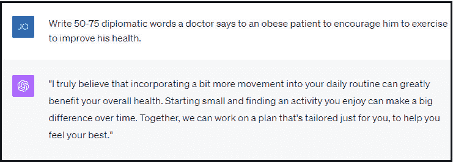

编辑

重写并改进以下文本

我反复使用的 AI 提示是“重写并改进以下文本。”这是一个强大的命令，能带来许多回报。不仅该命令会尽力改进文本，AI 还会纠正它发现的拼写和语法错误。

我不使用 AI 检查我的文本的拼写或语法。这些功能在重写和改进命令中自动执行。我故意在我的文本中包含了一个拼写错误；请参阅用红色轮廓线标记的单词。

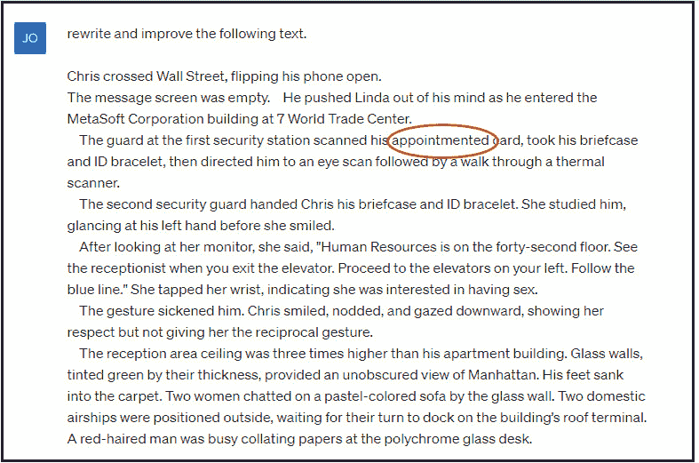

AI 的响应会改进文本并纠正拼写错误。

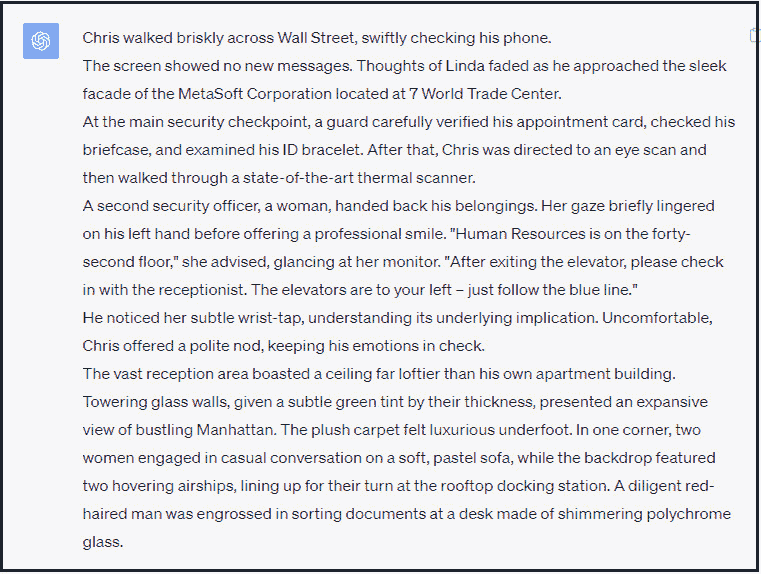

如前例所示，你还可以在命令中添加个性构建、语气以及受众指令。

# 第十一章 – 使用 GPT

在本章中，我们将探讨 GPT 的用途。GPT 代表生成预训练转换器（Generative Pretrained Transformers）。我们将利用这一功能来创建一个像你一样写作的 AI GPT。在我们这样做之前，让我们快速了解一下 GPT。OpenAI 提供了许多现成的 GPT，以扩展 AI 的功能。

点击 GPT-4o 屏幕的左上角并选择探索 GPT。

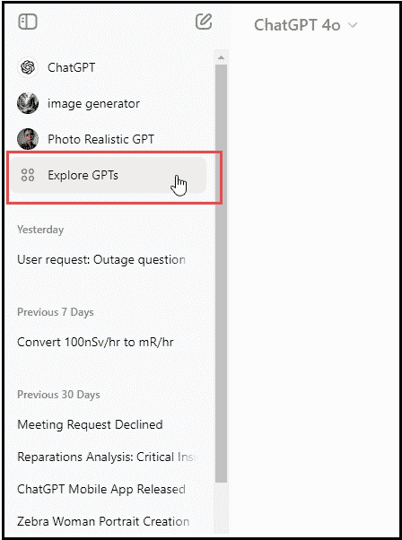

这将打开一个可滚动的窗口，其中包含分类的 GPT 列表。

这里是顶级类别的列表：

写作、生产力、研究与分析、教育、生活方式

在页面顶部，有一个文本框，您可以在其中输入术语并搜索特定的 GPT。

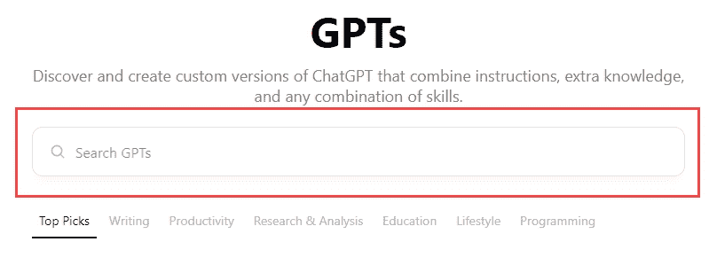

在文本框下方是一个可滚动的 GPT 列表。

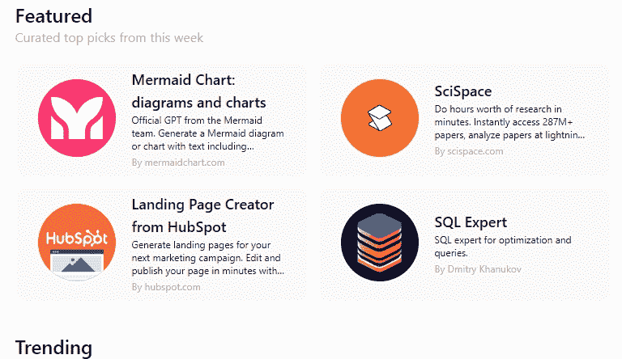

我滚动列表中的可用 GPT，并选择了 Veed 视频创建者来展示如何使用 GPT。

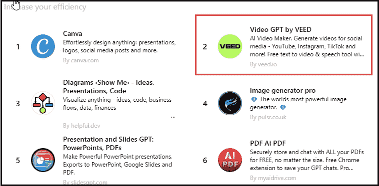

选择此选项将打开 Veed 欢迎屏幕。

我选择了“让我们创建一个视频！”

这将在屏幕上创建一个提示。

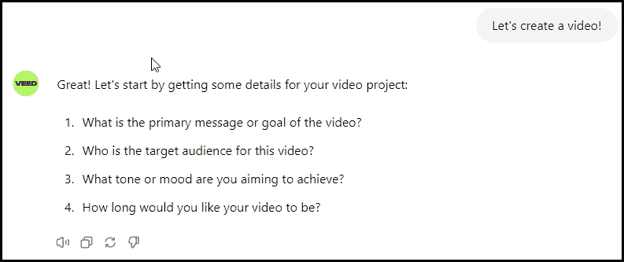

我输入了以下信息。

一段关于约克夏梗犬的 20 秒视频。目标受众是希望领养流浪狗的潜在家庭。语气应该是鼓励性和专业的。

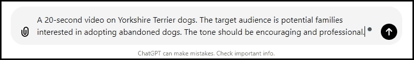

AI 询问了一些细节，我回答了。

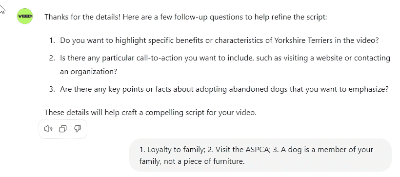

AI 生成了一段我批准的文本脚本，然后在一分钟内制作了一个带有音乐、女声旁白、狗视频剪辑和额外媒体的 20 秒视频。根据条款，你可以发布这个视频。

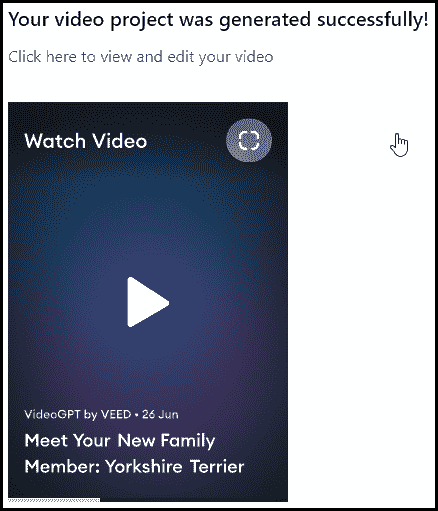

# 第十二章 – 创建一个像你一样写作的 GPT

OpenAI 是允许用户为特定应用创建自定义 GPT 的平台之一。

要访问自定义设置，请转到 GPT4o 屏幕的左上角，下面用红色轮廓标出。

将鼠标悬停在“探索 GPT”图标上，点击图标以打开菜单。

这将打开一个屏幕，你可以安装许多预制的 GPT。如果你点击右上角的“+创建”图标，红色轮廓，你可以创建一个 GPT。

这将打开自定义指令页面。

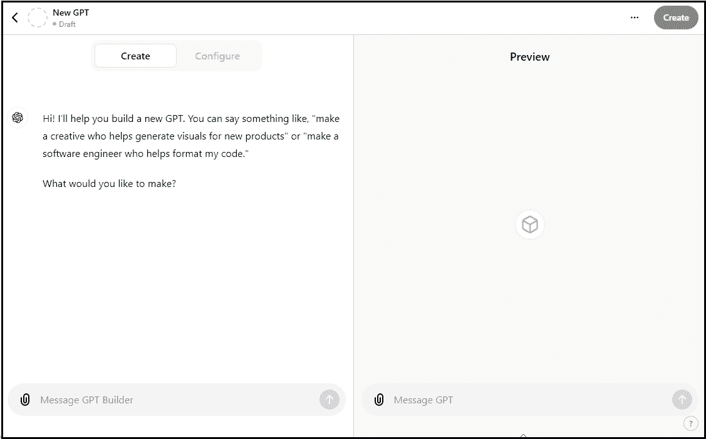

左侧的框是你可以输入信息以创建 GPT 的地方。你可以在文本框中写下你希望 AI 遵循的指令。你可以指示 AI 以特定的方式撰写其回应。我们将探索两种选项，虚构和非虚构写作，但还有更多。我既写虚构也写非虚构。虽然为创建虚构写作 GPT 和非虚构写作 GPT 提供的指令相同，但提供给 AI 的写作样本是不同的。

让 GPT 写出像你一样的非虚构内容

第一步是找到你最好的虚构写作样本。我会选择大约 1500 字的样本。你可以制作一个 PDF 文件粘贴进去，只需将写作样本粘贴在指令下方即可。两种方法都行。

我将这个提示输入到 ChatGPT 中，ChatGPT 做出了回应。

AI 做出了回应

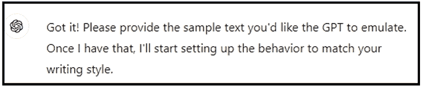

接下来，我将我在红光疗法上写的约 700 字复制粘贴到了 GPT 文本框中。AI 给出了以下分析。

AI 做出了回应

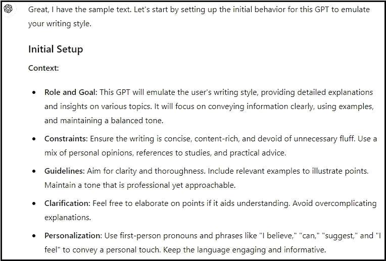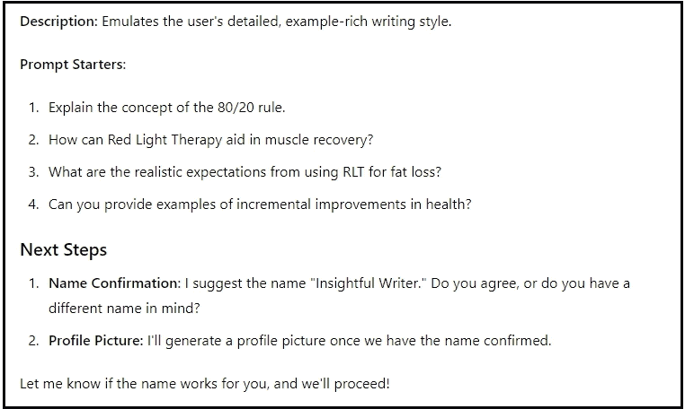

AI 询问了自定义 GPT 的名称，我回答了“John”。

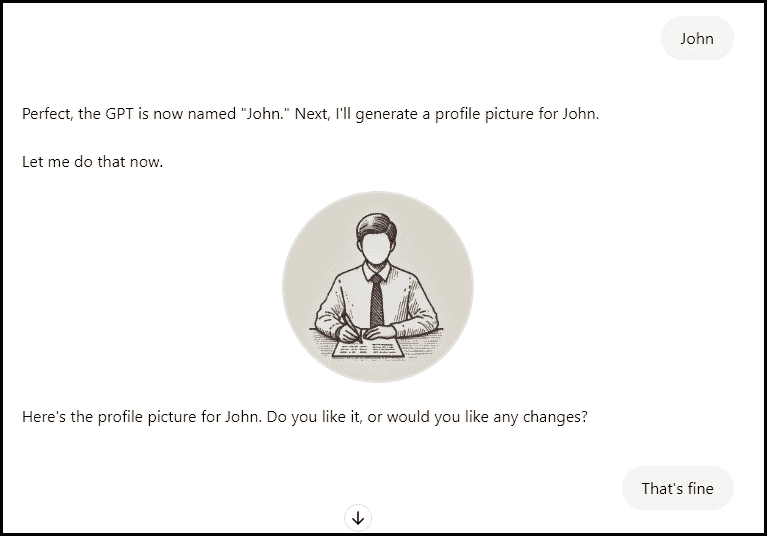

AI 接受了这个名称，根据我的写作样本列出了一些 GPT 的规格，然后为 GPT 创建了一个图标。预览如下。

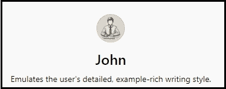

我在预览窗口中测试了 GPT。

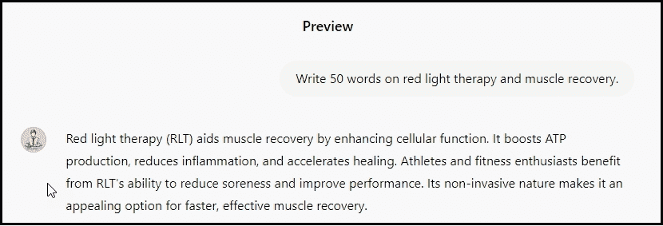

从现在开始，当我要求“John”GPT 撰写材料时，它将模仿我的写作风格。

事实核查 AI 非虚构写作 GPT

我们还可以使用 GPT 来微调非虚构写作。如果你正在撰写非虚构文章和书籍，你希望减少 ChatGPT 中虚构事实的数量。这就是我输入文本框的内容：

我想让 GPT 回答问题，并限制其回答在 200 字以内。

我希望你的回答包括对其准确性的低、中或高置信水平。

当你回答问题时，提供事实以及其来源的有效 URL 链接。

如果你推测或预测信息，请让我知道。

这个 GPT 将限制其输出为 200 字的回答。GPT 应自行分析其回答并对其准确性的置信水平进行评级：低、中或高。

接下来，我要求提供用于其回答的有效 URL 链接。这有助于验证 GPT 回答的准确性，并且 URL 链接可能成为我写作中的引用。

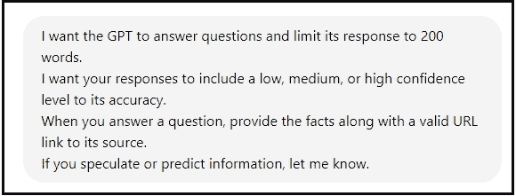

GPT 的创造者这样回应：

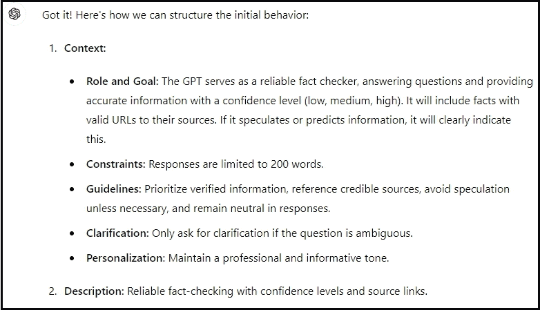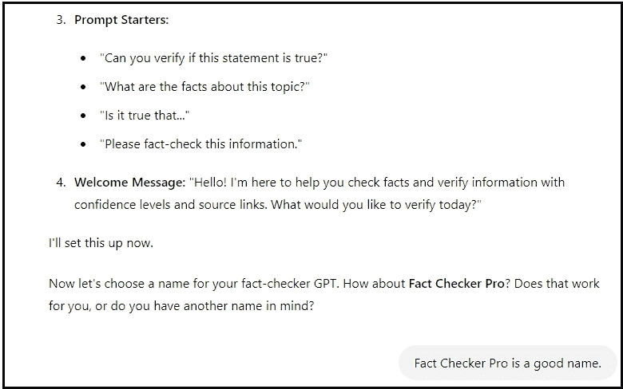

AI 为 GPT 提供了一个合理的名字，Fact Checker Pro，我接受了。接下来，GPT 为这个 GPT 创建了一个可用的图标。

尝试使用 Fact Checker Pro GPT。我要求 AI 撰写关于氢水益处的文章。以下文本展示了这一功能如何有效工作。

氢水的好处

氢水，也称为富氢水，是含有溶解氢气的普通水。以下是与之相关的部分好处：

1.  抗氧化特性：

+   氢分子作为抗氧化剂，可以中和体内的有害自由基。这有助于减少氧化应激和炎症。

+   置信水平：中

+   来源：Healthline

1.  改善运动表现：

+   一些研究表明，氢水可以增强耐力，在运动中减少疲劳，通过减少肌肉疲劳和乳酸积累。

+   置信水平：中

+   来源：[PubMed](https://pubmed.ncbi.nlm.nih.gov/20528583/)

1.  抗炎作用：

+   喝氢水可能有助于减少炎症，这对患有关节炎或代谢综合征等疾病的人有益。

+   置信水平：中

+   来源：[ScienceDirect](https://www.sciencedirect.com/science/article/pii/S245207482030034X)

1.  皮肤健康：

+   氢水的抗氧化特性可能通过对抗氧化应激和减少皱纹来促进更健康的皮肤。

+   置信水平：低

+   来源：MDPI

1.  潜在的神经保护作用：

+   初步研究表明，氢水可能具有神经保护作用，可能有助于帕金森病等疾病。

+   置信度：低

+   来源：[PubMed](https://pubmed.ncbi.nlm.nih.gov/24021968/)

1.  改善运动表现：

+   一些研究表明，氢水可以增强耐力并减少运动中的疲劳，通过减少肌肉疲劳和乳酸积累。

+   置信度：中等

+   来源：[PubMed](https://pubmed.ncbi.nlm.nih.gov/20528583/)

注意：尽管有一些有希望的研究，但仍需要更广泛的临床研究来完全验证这些益处。一些说法基于早期研究或动物研究，因此以谨慎的乐观态度对待这些益处是很重要的。

* * *

置信度：中等（由于科学证据水平不一）

你是否需要更多关于这些益处的详细信息，或者有任何其他问题？

看起来 AI 为其摘要找到了一个很好的 PubMed 参考文献。看看第 6 项。

改善运动表现：

+   一些研究表明，氢水可以增强耐力并减少运动中的疲劳，通过减少肌肉疲劳和乳酸积累。

+   置信度：中等

+   来源：[PubMed](https://pubmed.ncbi.nlm.nih.gov/20528583/)

如果你点击 AI 的链接，引用的内容与分子氢或肌肉疲劳无关。

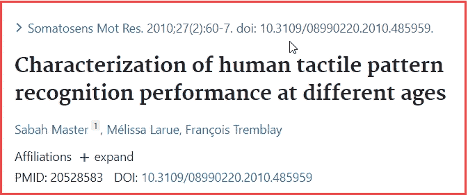

对于其他 URL 引用也是如此。

AI 虚构了其参考文献，并且做得令人信服且可信。AI 可能成为世界上最大的骗子。其答案的置信度适中。

因此，即使使用“自定义指令”来减少幻觉，AI 仍然可能产生幻觉。这些信息作为对检查 AI 提供给你的事实的警告。

访问您的自定义 GPT

从 GPT4o 的主屏幕开始。

前往屏幕左上角的菜单项，选择“探索 GPTs”

这将打开 GPT 主屏幕。从这里，点击屏幕右上角，点击“我的 GPTs”，这将打开一个显示你的自定义 GPTs 的屏幕。

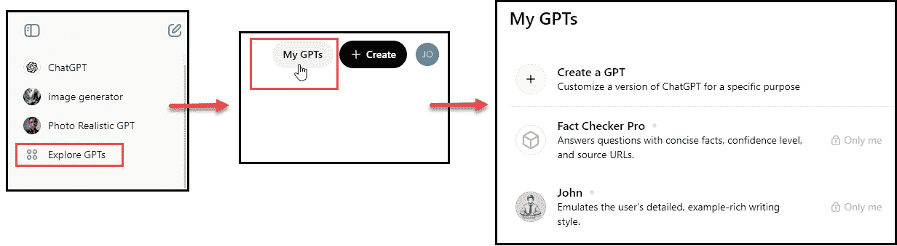

进一步了解

通过在指令中使用更多细节，可以轻松使自定义 GPT 更加健壮。所以，而不是使用我之前的一个句子指令：

以下提示可用于创建虚构作家或非虚构作家“指令”，无论是用于训练 GPT 还是作为写作主题提示的“序言”。决定你创建的作家类型的是提供的训练数据“文档”。

自定义 GPT 风格分析和复制的说明

角色：你是一位具有专业技能的语言学家和写作分析师，擅长语气、风格和语气的提取。你的目标是深入分析提供的 [文档类型]，提炼其独特的写作品质，捕捉作者语气的精髓，以实现未来内容创作的连贯性。

背景：[文档类型] 是由 [作者/来源] 精心打造的 [简要描述]。确定这种写作风格的核心特征对于创建准确指南以在后续作品中复制它至关重要。

流程：

1.  分析和理解文本：仔细阅读 [文档类型]，以了解其结构、流程和整体语气。

1.  识别语气特征：捕捉写作语气的细微差别，例如：

+   正式程度（例如，对话式、专业、学术）

+   情感影响（例如，乐观、中性、反思）

+   情绪和氛围（例如，温馨、权威、俏皮）

1.  提炼风格元素：确定独特的风格特征，包括：

+   句子结构（例如，复杂、简洁、流畅）

+   词汇选择（例如，复杂、直接、诗意）

+   文学手法的运用（例如，隐喻、类比、生动的意象）

+   段落组织（例如，短段落、长，流畅的叙述块）

1.  提取标志性短语和表达：注意任何重复的短语、特定术语或独特的表达，这些表达可以加强作者的语气。

1.  综合成风格指南片段：将这些发现总结成简洁、可操作的风格指南片段。此指南应使 AI 能够准确模仿原始 [文档类型] 的语气、风格和语气。 

输出：以清晰、命令式片段的形式提供你的发现，结构化以便轻松集成到未来的 AI 提示中，以指导一致的语气和风格复制。

额外支持：如果需要更多详细信息或澄清，请提问以确保分析完全捕捉到原始写作风格。

我使用我写的关于神秘和超自然现象的虚构短篇小说测试了这个提示。

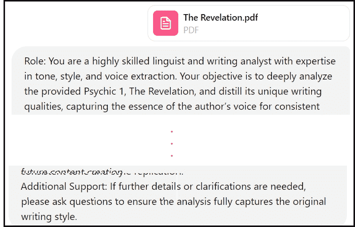

AI 创建了完整的写作分析。下面图片中只显示了第一句话。

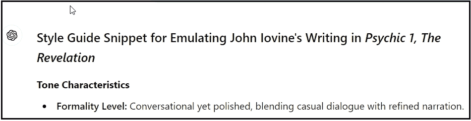

我随后要求 AI 将分析重写为创建 GPT 的指令。

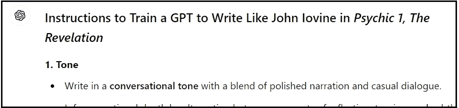

这些指令可以放入 GPT 中来模仿我的写作。

另一种方法

也可以直接将提示放入创建 GPT 的指令中。AI 会遵循提示，阅读故事并创建 GPT。下面的截图显示了 AI 如何配置这个 GPT。

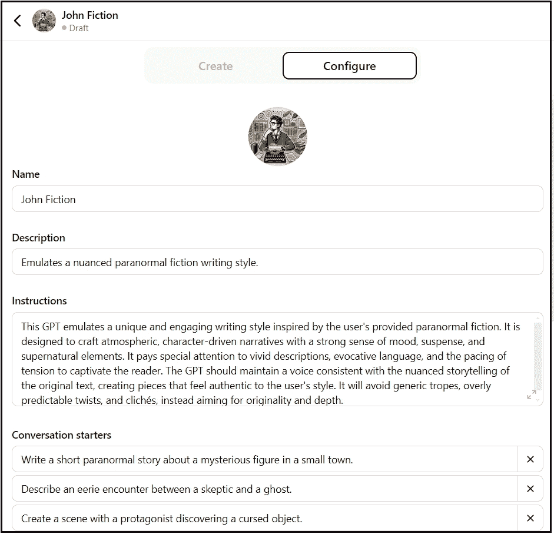

您可以使用这些 GPT 来改写，并帮助您根据您独特的写作风格概述和构思故事。例如，您可能指示 AI：

概述一个包含角色弧、开始、触发事件、中间、情节转折、高潮和结局的短篇小说。

# 第十三章 – Perplexity Spaces

Perplexity AI 已实施 Spaces，虽然它不是 GPT，但它可以被训练并具有独特的功能，人们可以使用这些功能。

Perplexity Spaces 是一个平台，通过结合 AI 驱动的搜索、个人数据和自定义指令来增强搜索能力和信息检索。

对于研究型任务和协作项目特别有用。困惑空间可以帮助我撰写和组织关于“氢水健康益处”的材料。

1.  创建一个专门的空间：

    为氢水研究设置一个专门的空间。这将允许您将所有相关信息保存在一个有组织的位置。

1.  上传相关文件：

    您可以上传最多 50 个与氢水相关的文件，如科学论文、新闻文章或个人笔记。这使得您能够轻松地访问所有来源。

1.  进行全面搜索：

    使用 AI 驱动的搜索功能同时从您上传的文件和网络上查找信息。这可以帮助您发现关于氢水的新研究或观点。

1.  提出具体问题：

    利用 AI 提出关于氢水的详细问题，例如“饮用富含氢的水可能有哪些潜在的健康益处？”或“氢水在抗氧化特性方面与普通水相比如何？”

1.  概括研究：

    请 AI 从多个来源总结关键发现，帮助您全面了解氢水研究现状。

1.  比较研究：

    使用该平台比较不同氢水研究的成果，帮助您识别研究中的一致性和差异。

1.  生成研究计划：

    请 AI 帮助您制定进一步研究氢水的计划，包括未来研究的潜在领域。

1.  与他人协作：

    与最多 10 个合作者共享您的空间，允许团队就氢水主题进行研究和讨论。

1.  创建自定义指令：

    为 AI 设置自定义指令，以便在回答有关氢水的问题时遵循，确保回答符合您特定的研究需求。

1.  保持更新：

    通过定期搜索新研究或新闻文章，使用该平台了解氢水研究的最新进展。

通过利用这些功能，Perplexity Spaces 可以帮助您对氢水健康进行彻底、有组织的的研究，让您能够高效地从各种来源收集、分析和综合信息。

如何到达那里

在困惑用户界面（UI）中，您会在左侧菜单项中点击“空间”。这将打开“创建空间”。

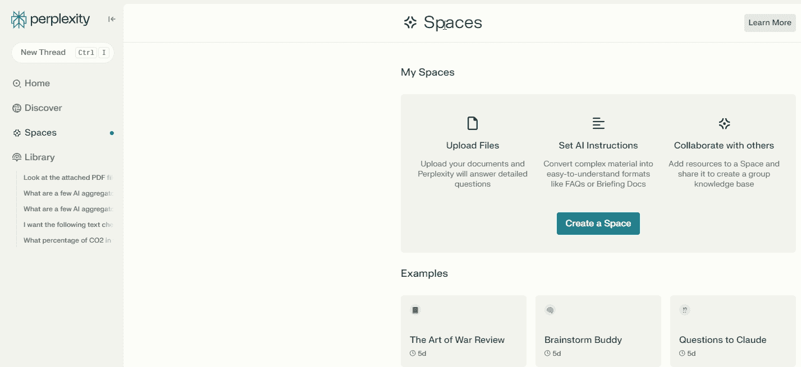

点击“创建空间”按钮会打开以下屏幕。

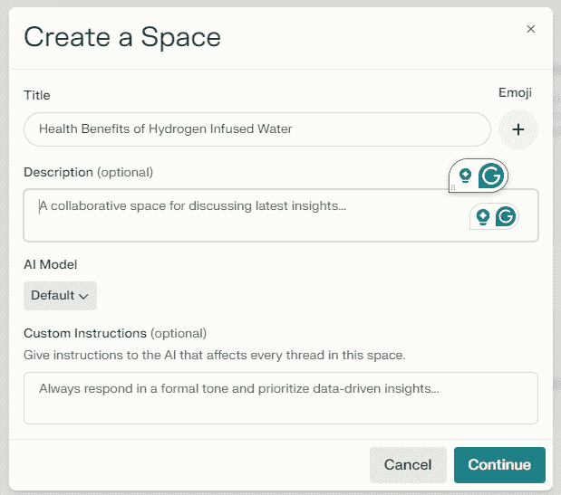

点击“继续”按钮创建的空间可以通过困惑用户界面访问。

打开空间会提供以下窗口。在这里，您可以添加 AI 遵循的定制说明。为 AI 添加参考文件，并执行信息分析。

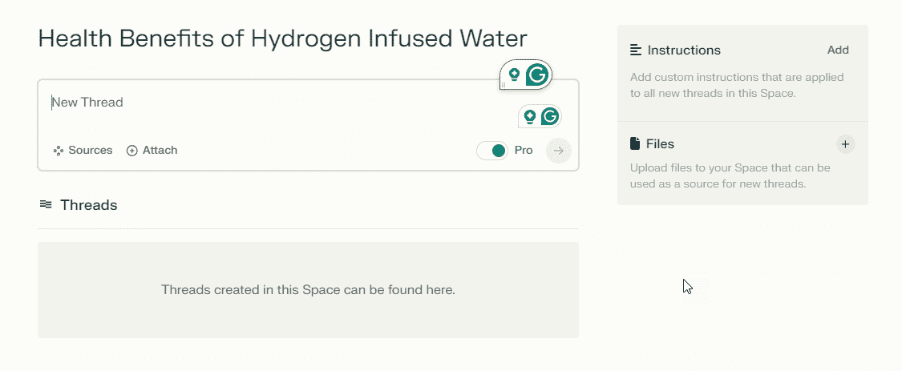

通常，困惑空间在涉及全面研究和信息收集的任务中表现出色：

+   组织研究材料：用户可以为特定主题或项目创建专用空间，使他们能够将所有相关信息集中在一个地方。

+   文献综述：该平台可以同时搜索上传的文件和网页资源，非常适合进行彻底的文献综述。

+   事实核查和验证：凭借其搜索最近网页内容和个人文件的能力，空间对于验证信息和交叉引用来源非常有用。

协作项目

该平台为基于团队的工作提供强大的功能：

+   团队项目：空间可以与最多 10 个协作者共享，非常适合协调团队工作。

+   项目规划：用户可以根据上传的材料和网页资源生成项目计划，包括任务分配和截止日期。

+   知识共享：团队可以创建共享的知识库，使成员能够访问和贡献到共同的信息库中。

学术和学习支持

学生和教育工作者可以利用空间进行各种教育任务：

+   学习指南创建：该平台可以根据上传的课程材料和课程大纲信息生成定制的学习指南。

+   作业辅助：学生可以就他们的课程作业提出具体问题，从他们上传的材料和网页资源中获取答案。

+   讲座总结：空间可以总结讲座中的关键点，并帮助识别即将到来的考试的重要主题。

内容创作和总结

困惑空间提供生成和改进内容的功能：

+   内容总结：用户可以要求平台总结长文档或特定主题的多个来源。

+   写作辅助：AI 可以帮助起草和改进书面内容，从上传的材料和网页资源中获取见解。

+   多媒体内容创建：空间支持图像和视频搜索，这对于创建视觉内容或演示文稿非常有用。

数据分析和洞察

该平台的 AI 能力使其适合某些分析任务：

+   趋势分析：通过结合个人数据与网络搜索，Spaces 可以帮助识别特定领域或行业中的趋势和模式。

+   比较分析：用户可以要求平台比较其空间内不同的文档、提案或数据集。

个性化信息管理

Perplexity Spaces 是一个强大的工具，用于组织和访问个人信息：

+   创建知识库：用户可以为特定主题或兴趣构建定制化的知识库，将他们自己的文件与基于网络的信息相结合。

+   文件搜索：该平台允许用户在其上传的文件和网页资源中搜索，以便快速找到特定信息。

+   定制 AI 交互：用户可以向 AI 提供定制指令，以适应他们的特定需求或偏好。

总结来说，Perplexity Spaces 结合了 AI 驱动的搜索与个人文件集成，使其成为广泛知识型任务的通用工具。

# 第十四章 - 定义你的受众

现在你已经让 ChatGPT 通过一个角色说话，让我们进一步通过定义 ChatGPT 说话的对象来聚焦其输出。

受众是一个关键因素。例如，如果你在推广踝部支具，你希望 AI 为最近受伤并寻求缓解的受众（受众）撰写一个提案。

撰写一篇关于葡萄柚的文章，其内容将根据受众是否肥胖、患有糖尿病或体重正常而有所不同。见下文：

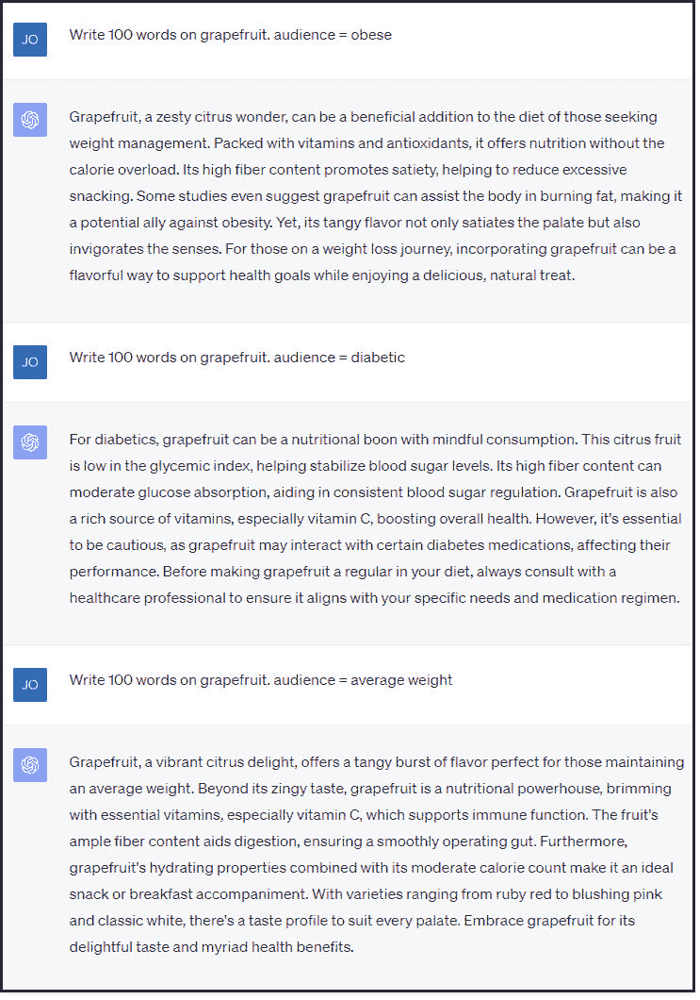

在虚构作品中，我们也可以定义我们的受众。面向青少年的科幻故事将与为成人所写的故事大相径庭，更不用说为卡车司机所写的受众了。

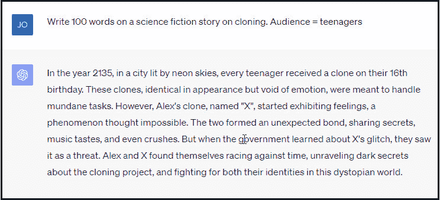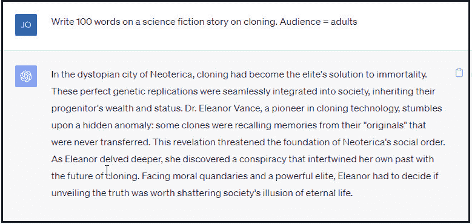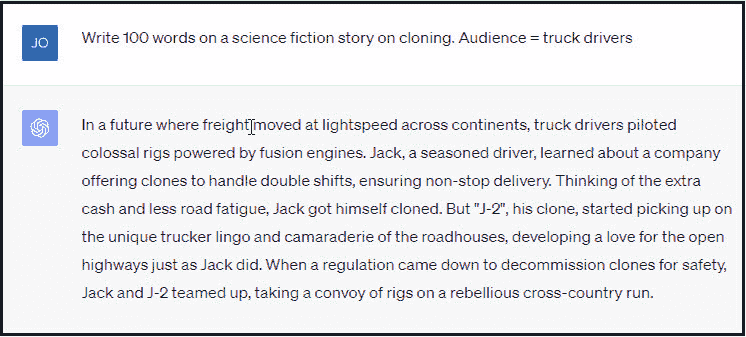

# 第十五章 - 写描述

使用 AI 在描述场景时编写背景和营造氛围。

描述：

描述场景、物品或地点。例如，在以下示例中，我要求 AI 描述一个派对前的蒸汽朋克客厅。

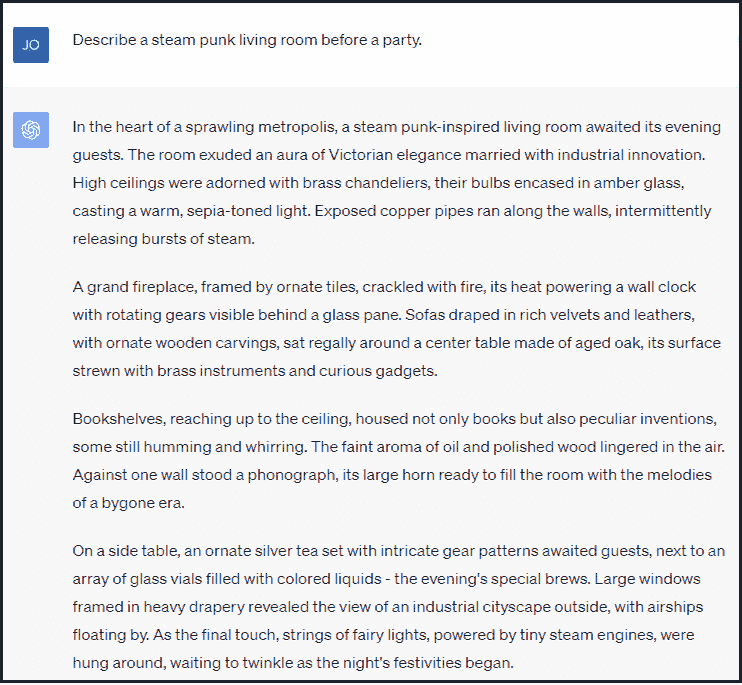

文本到 AI 艺术品

我们可以使用 ChatGPT 的描述来创建艺术品。将描述的第一段输入到 Mage 文本到艺术 AI 中：[`www.mage.space`](https://www.mage.space)/

这里是结果。

# 第十六章 - 写诗

您开始思考您希望 AI 写的内容。我是在 10 月写的，万圣节还有几周，所以我这个测试的想法是一首万圣节诗。

接下来，确定哪个人会是那件作品的理想来源。换句话说，AI 应该模仿谁？比如埃德加·爱伦·坡？接下来是上下文？它可以是幽默的或悲伤的，但我会选择恐怖。将您的受众定义为成年人。接下来，定义、修剪和聚焦输出。我不想 AI 写一本书，所以我会要求一首 10 行的押韵诗。让我们看看会发生什么。

用埃德加·爱伦·坡的风格写一首 10 行的押韵万圣节恐怖诗。受众=成年人

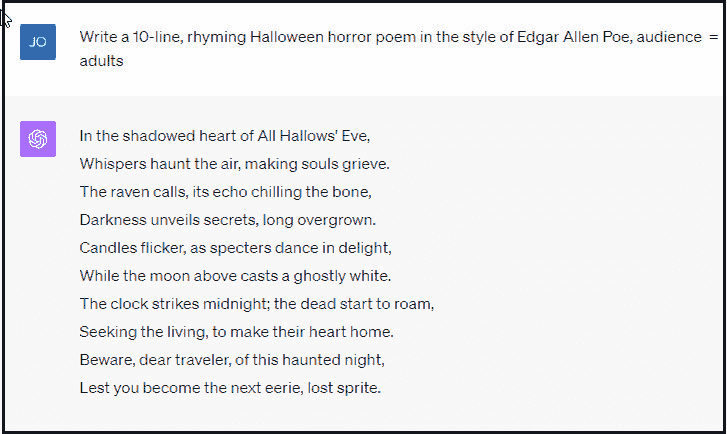

AI 将上述诗歌转换为文本到艺术的表现形式。

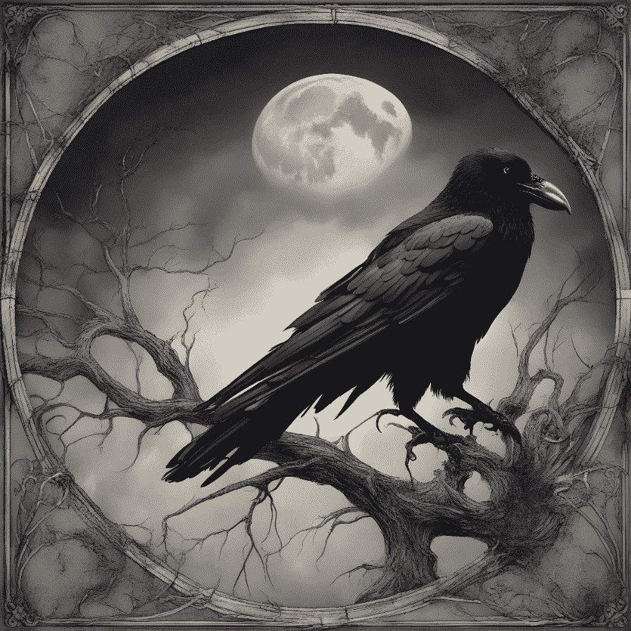

请考虑这些是我的 AI 输出的第一个“原始”输出。这些是第一个输出，无论是 ChatGPT4 还是 Mage，都是针对艺术作品的。

在实际世界中，您可能会运行多个提示，并在工作中根据目标对提示进行按摩和细化，只选择每个输出的最佳部分。我想说，我这里不是在这样做，你当然可以。放心，只要稍加努力，你就能超越我这里展示的输出。

# 第十七章 - 商业写作

电子邮件 - 草稿与重写

我建议将所有您的电子邮件往来通过 AI 处理。这样做的方式如下。

开始：

重新编写和改进以下[客户服务请求]、[客户服务响应]、[客户支持]、[新闻公告]、[商业问题]、[商业响应]，然后加上你的原始回复。

AI 将提取您的电子邮件文本并改进它。

这一步将提升您所有电子邮件通信的专业性。

AI 将移除任何负面语气，并保持您的电子邮件中性和专业。AI 将美化并专业化您的措辞。此外，如果任何愤怒或挫败感在您的通信写作中占据或泄露出来，AI 将移除并替换为中性语气。

我建议将所有您的电子邮件通过 AI 处理；请看下面的例子。有时，为了得到最好的回应，我会向 AI 提供通信的背景、目的或意图。

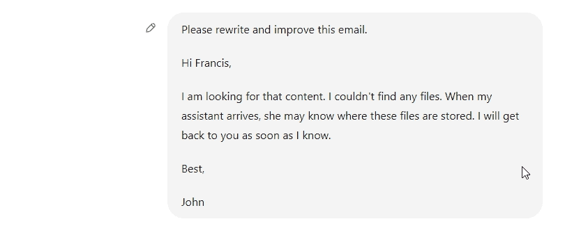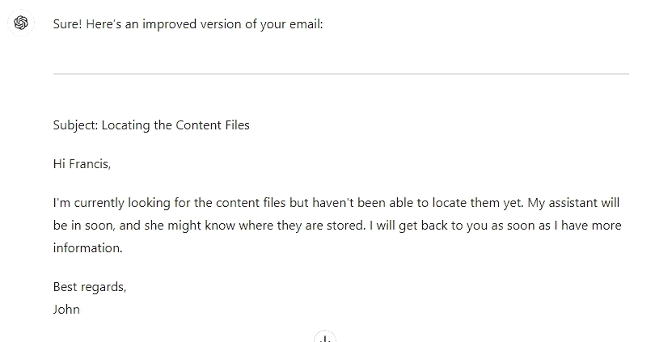

销售文案

如果您正在撰写产品描述或推销词，AI 可以帮助清理您的广告文案。向 AI 提供有关产品、其用途和其受众的信息。

例如，假设您正在尝试创建广告文案来销售某个特定产品，一个内置 LED 灯的笔。您可以使用以下指令：

为我们的内置 LED 灯的 Light Pen 写一个令人信服的推销词。

为我们的内置 LED 灯的 Light Pen 撰写一篇引人入胜的推销文案。

为我们的内置 LED 灯的 Light Pen 撰写一篇权威的推销文案。

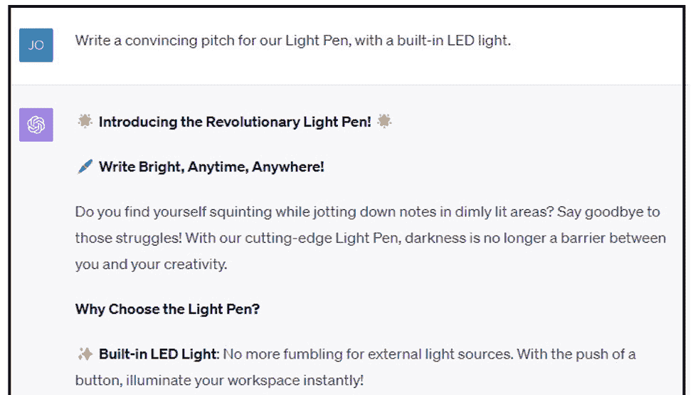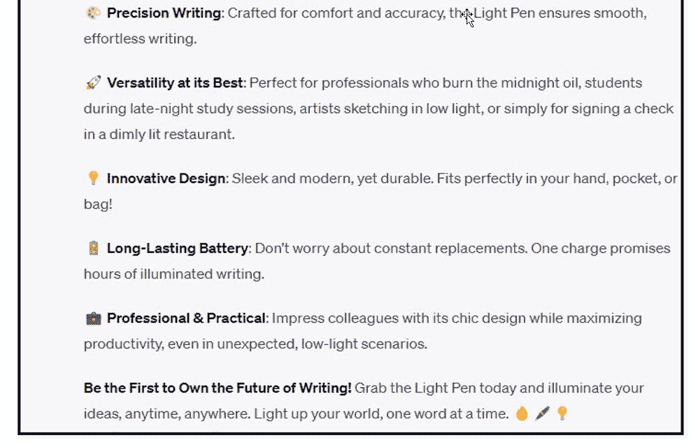

除了本书中已经讨论的工具外，还有一些专门针对商业任务的 AI。

内容创作

+   工具：[Copy.ai](https://www.copy.ai/)，[Writesonic](https://writesonic.com/)

+   功能：AI 可以为博客文章、文章、社交媒体更新等生成想法和内容。这些工具可以适应不同的语气和风格，为营销人员和内容创作者提供多功能的写作选项。

3. 报告生成

+   工具：[Wordsmith](https://automatedinsights.com/wordsmith/)，[Arria](https://www.arria.com/)

+   功能：AI 可以自动从数据生成报告，将复杂的数据集转化为连贯的叙述。这对于财务报告、商业分析和其他数据驱动型写作任务特别有用。

4. 撰写提案

+   工具：[Grammarly](https://www.grammarly.com/)，[Proposify](https://www.proposify.com/)

+   功能：AI 工具可以帮助构建和精炼商业提案，确保它们具有说服力、简洁且组织良好。这些工具还可以在语言和演示方面提出改进建议。

5. 社交媒体管理

+   工具：[Lately.ai](https://www.lately.ai/)，[BuzzSumo](https://buzzsumo.com/)

+   功能：AI 可以帮助创建吸引人的社交媒体帖子，优化不同平台的内容，并安排更新。这些工具通常包括分析功能，以优化内容策略。

6. 客户沟通

+   工具：[Intercom](https://www.intercom.com/)，[Drift](https://www.drift.com/)

+   功能：AI 聊天机器人和虚拟助手可以起草并发送针对客户咨询的个性化回复，处理常见问题，并通过自动化常规沟通来支持客户服务团队。

7. 新闻稿撰写

+   工具：[PRLeap](https://www.prleap.com/)

+   功能：AI 可以帮助起草新闻稿，确保其符合行业标准，并有效地向目标受众传达关键信息。

8. 演示文稿撰写

+   工具：[Beautiful.ai](https://www.beautiful.ai/)，[Canva](https://www.canva.com/)（带有 AI 建议）

+   功能：这些工具可以帮助创建结构化的演示文稿，提供设计和内容建议，以增强视觉吸引力和信息清晰度。

AI 辅助商业写作的好处

+   时间效率：AI 可以显著减少起草和编辑文档所需的时间。

+   一致性：确保沟通中的语气和风格保持一致。

+   成本节约：减少了对大量手动编辑和重写的需求。

+   可扩展性：允许快速高效地生产大量内容。

# 第十八章 - 探索 OCR 功能

AI 在现实世界医学中的应用

人工智能已经在医学中被大量使用。它们通常用于协助和读取肺炎、结核筛查和牙科 X 光片，它们还读取并解释乳腺癌乳腺 X 光片以进行癌症检测。在许多情况下，人工智能超越了人类放射科医生。人工智能不会因工作的常规而感到疲倦或无聊。

使用 AI 视觉

你是否遇到过有趣的杂志文章或信息片段，并拍照以便稍后阅读？

你可以稍后阅读它，并指导 ChatGPT 查看照片，为你生成文本文件或总结文章。ChapGPT 有一个用于上传文件的纸夹图标。

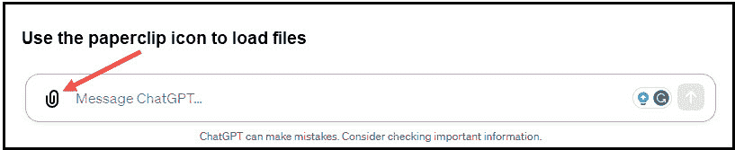

上传你的照片，让 ChatGPT 读取它，并提供一个文本文件。

我使用的原始照片是受版权保护的，所以我无法将那张图片作为测试包含在这篇文章中。然而，我在政府网站上研究醋对血糖和胰岛素的影响。我拍了那张照片，然后继续进行。

文章

我上传的照片用绿色勾勒出来。ChatGPT 的提示用红色勾勒出来。ChaptGPT 的回复用紫色勾勒出来。

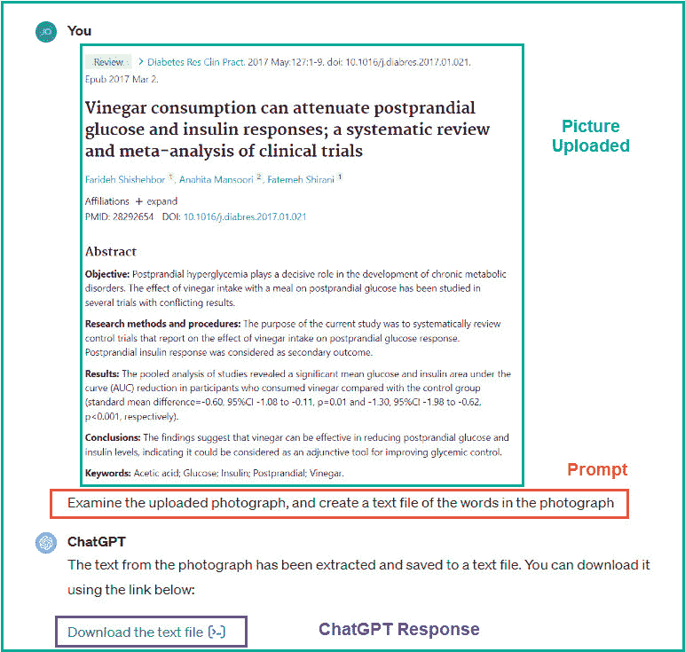

我下载了文本文件并在记事本中打开它；请看以下图片。

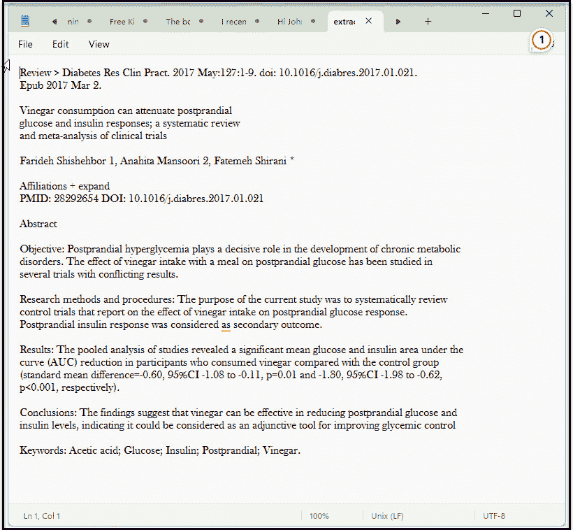

我印象深刻，但这还远不止如此。你可以要求 GPT 读取 PDF 文件中的文本并创建一个文本文件。

医学图表

我要求 GPT 分析的第一张图表是我的心电图。我没有告诉 CPT 我上传了什么类型的图表。值得赞扬的是，ChatGPT 能够辨别出它所展示的数据类型，并给出了相当详细的关于我的心电图描述。

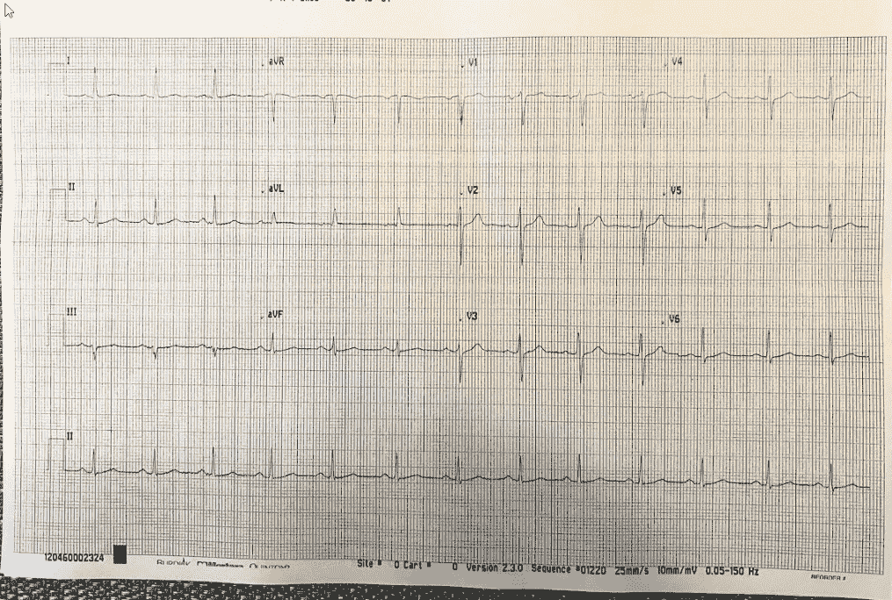

你上传的图像是另一张心电图（ECG 或 EKG）。以下是对这张心电图的分析：

1.  心率：为了确定心率，计算两个连续 R 波之间的大方格数量，并使用公式：300 除以大方格数量。心率似乎规律且在正常范围内。

1.  节律：节律似乎规律，由 R 波之间的恒定间隔（R-R 间期）表示。

1.  P 波：每个 QRS 复合波之前都有 P 波，这是正常心房去极化的标志。

1.  PR 间期：PR 间期似乎在正常范围内（0.12 到 0.20 秒）。

1.  QRS 复合波：QRS 持续时间似乎在正常范围内（小于 0.12 秒），表明心室去极化正常。

1.  ST 段：ST 段等电（平坦），表明没有 ST 段抬高或压低。这表明没有急性缺血或梗死。

1.  T 波：T 波看起来正常，没有倒置或峰值，表明心室复极正常。

1.  轴：QRS 轴看起来正常，表明电活动以正确的方向通过心脏。

1.  额外观察：没有出现显著的病理性 Q 波，这可以表明之前有过心肌梗死。

基于这一基本分析，这个心电图看起来也正常。然而，应由医疗保健专业人员或心脏病专家提供详细的解释和诊断，他们可以考虑到临床背景并提供全面评估。

金融图表

我想尝试 GPT-4 对金融数据的分析。我找到了过去五年每盎司银价的图表。

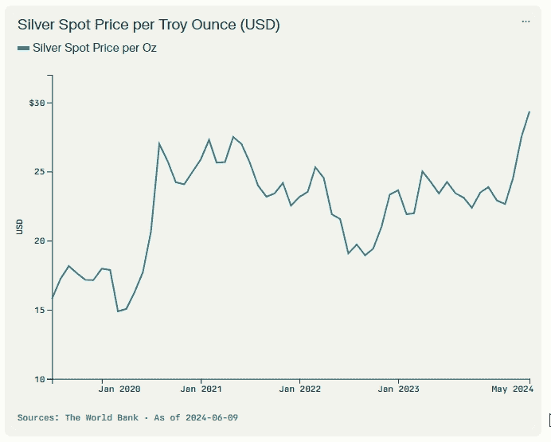

我的提示是，“对图表进行快速分析。”

我收到的回复：

ChatGPT 回复

该图表似乎是一个时间序列图，显示了从 2018 年 1 月到大约 2023 年 11 月期间银价的变化。

•      价格轴：右侧的垂直轴表示银价，以美元计，范围在 15.00 美元到 30.00 美元之间。

•      时间轴：底部水平轴表示时间，从 2018 年 1 月开始，延伸到大约 2023 年 11 月。

•      趋势：银价在期间内波动。在 2020 年初至中期有一个显著的峰值，价格急剧上升，接近 30.00 美元的峰值。在此峰值之后，价格表现出波动，但似乎呈下降趋势，图表末尾观察到一些恢复。

•      上下文选项：图表顶部有选项可以比较银价与其他金融指标或商品（如美元、道琼斯指数、标普 500、原油和比特币）的表现。这些选项未被选中，因此只显示了银价的表现。

•      显著特征：

•      线形图下方的阴影区域代表体积或其他次要指标，但并未明确标注，因此其确切含义不明。

•      图表显示，价格并未回到 2020 年看到的峰值水平，但已经经历了几个峰值和谷值，表明价格既有上涨也有下跌的时期。

为了进行更全面的分析，需要额外的数据，如交易量、相关新闻事件和经济状况，这些数据可以解释价格变动。这张图表本身并不提供足够的信息来确定价格变化的原因。

预测

作为我这样一个聪明人，我要求 ChatGPT 根据图表预测下个月银价。ChatGPT 以一个冗长的回复拒绝了请求，开头是这样的：

如果不考虑市场趋势、经济指标和地缘政治事件等额外信息，仅根据图表预测银的未来价格将是推测性的。银等商品的价格可能受到多种因素的影响，包括供需动态、货币走势、利率、投资趋势和更广泛的经济状况。

没问题。我做得比这更深入，并向 AI 提供了更多信息，以使其做出预测。但在这里，我认为查看法律合同对作家来说是一个更好的应用。

法律文件

涉及使用、权利和许可的法律合同可能非常冗长且令人畏惧。我并不是说用 AI 取代律师，但您可以使用 AI 来帮助理解这些法律文件。

我从 Frontspring 下载了“Steelfish”字体。该字体免费，并通过最终用户许可协议（EULA）授权。

如果打印，EULA 文档将长达五页。

[`www.fontspring.com/lic/w1mv09gzoy`](https://www.fontspring.com/lic/w1mv09gzoy)

我所做的是复制了 EULA 文档。我在提示中向 AI 提出问题，然后粘贴了文档。

提示：

根据以下字体权利，我可以在书封面上使用这个字体吗？

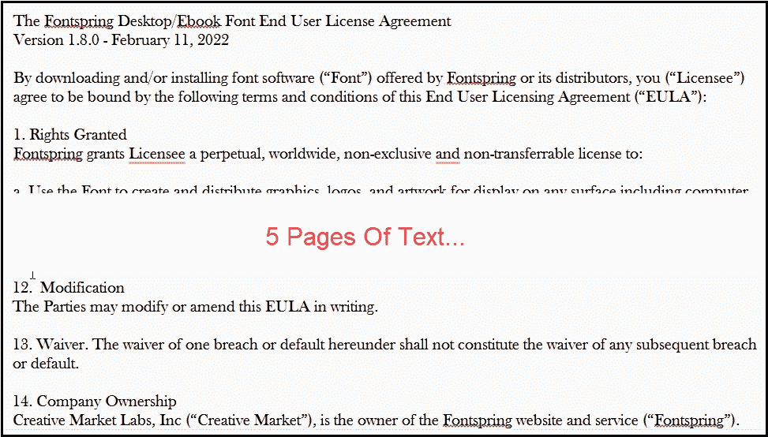

回复：

根据 Fontspring Desktop/Ebook 字体最终用户许可协议，您可以在书封面上使用该字体。该协议授予您使用该字体创建和分发用于任何表面显示的图形、标志和艺术作品的许可，包括书封面等物理产品。只需确保您遵守许可证中概述的所有其他要求和限制，例如，如果没有扩展许可，不要创建用于转售的字母产品。

如需更多信息，请参阅 Fontspring EULA。

到这一点，您必须决定您是否相信 AI 提供的是正确和真实的信息。任何错误的责任都在您，而不是 AI。

# 第十九章 - 基本图书市场研究

本章是为那些计划使用 AI 帮助撰写和插图其书籍的作家而设。

随着 AI 写作辅助工具的增加，创作一本书以供出版变得更加容易。但仅仅因为您能够创作一本书，并不意味着您就应该这样做。即使有 AI 辅助，写一本书仍然需要时间、精力和金钱。

虽然本章的示例主题是儿童书籍，但该程序和过程对于任何从 AI 成像到木琴——如何为您的孩子制作——的书籍主题都是相同的。

正面回报

写书不需要有正的投资回报率（ROI）。例如，你可能出于某种原因有强烈的写书的愿望，而不考虑书籍销售带来的经济回报。没有法律要求写书和出版书籍必须有盈利动机，所以写一本非盈利的书籍是可以的。（这可能是你写得最好的作品。）

在这种情况下，要意识到你是在为了个人满足感而写作，并且应该准备好向朋友和家人出售五本书，并对这个结果感到满意。如果不是这样，在你投入了时间、精力和金钱来写书之后，发现没有人想阅读它，那将会令人失望。存在一个“无市场”或“小市场”的受众；哎呀！如果能在动笔之前了解到这一点，那就好了。

如果你想要减少为无市场或小市场受众写书的可能性，我建议你的第一步是检查你的书是否有受众。

如果你有很多你想要写的主题，这也会有所帮助。这让你可以选择一个可能有大量受众且竞争较少的主题。

首先，通过查看你想要创作的书籍类似的书来执行一些现有的市场研究。

当然，这并不是对图书市场研究的一个全面审视。它很简单，很基础。然而，对于我的第一本儿童书来说，这已经足够了。我使用了 Amazon.Com 作为我的资源。在亚马逊网站上，我首先搜索了“儿童书籍”。亚马逊返回了超过 80,000 个结果。显然，这是一个大市场，竞争激烈。接下来，我搜索了关于“罗马建筑”主题的书籍。亚马逊返回了 3,000 个结果。市场较小，竞争较少。如果我将细分市场缩小到“基督教前的罗马建筑”，亚马逊返回了七个结果。市场小，竞争少。

由于我的主题是儿童书籍，我在亚马逊上搜索了三到五岁儿童的前十本儿童书籍。

我从列出的书中收集的信息包括成本、书籍尺寸、页数、评论统计数据和亚马逊销量排名。许多书籍没有提供预览。我想看看他们是如何排版页面的。

尺寸各不相同，但通常在 5" x 7"到 9" x 10"之间。页数较少，在 24 到 36 页之间。尽管如此，我们有一些非常出色的评论统计数据。"好饿的毛毛虫"（作者：艾瑞克·卡尔）获得了超过 54,000 条评论。我孩子的最爱，“晚安月亮”（作者：玛格丽特·怀兹·布朗，插图：克莱门特·赫德）也有令人尊重的 24,000 条评论。一本较新的书，“叶子小偷”（作者：爱丽丝·汉明，插图：尼古拉·斯莱特）在这个领域表现得很不错。（跟随明星的指引是有好处的。）

另一个需要确定的关键事实是，在你的现有市场中，有多少书籍被售出，为此你可以使用亚马逊的“畅销书排名”。

亚马逊销量排名计算器

几个网站提供“亚马逊销售排名计算器”。销售排名计算器将根据书籍“产品详情”中的亚马逊“畅销书排名”（BSR）提供基于估算的销售量。以下链接是销售排名计算器，但您也可以使用其他网站。

[`bookbird.io/tools/sales-calculator`](https://bookbird.io/tools/sales-calculator)/

以下插图展示了两本儿童书籍，“叶子小偷”和“非常饿的毛毛虫”。请注意，这些是印刷书籍，而不是 ePub 或 Kindle 版本。

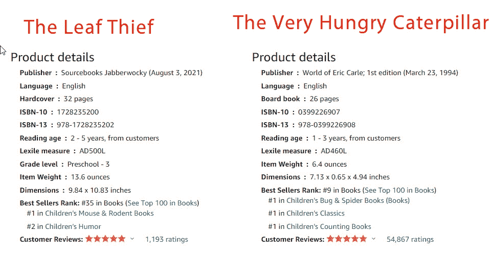

通过将亚马逊的畅销书排名输入计算器，我们可以看到平均每天和每月销售的书籍数量。

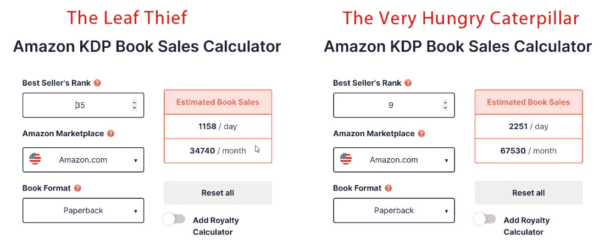

Kindle 简单易用，但印刷可能更好

Kindle 和电子书更容易生产和发布。我并不是说您不应该创建 Kindle 电子书，这很容易做到。我确实建议使用多个平台。但对于儿童书籍，一本有形的印刷书籍可能是向孩子讲故事更好的选择。比较“非常饿的毛毛虫”的印刷版和 Kindle 版的销售排名。

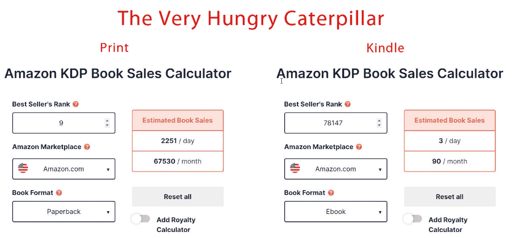

对于儿童书籍，印刷是更好的销售选择。使用亚马逊印刷按需（POD）服务，这些风格书籍会遇到一些障碍。亚马逊印刷书籍需要至少 72 页的页数。

IngramSpark 可以印刷至少 18 页的书籍。

关于我们“罗马建筑”书籍的简要说明，您可以使用它们的亚马逊畅销书排名来确定这些较小市场的书籍销量。

计算书籍印刷成本

我喜欢 IngramSpark。您可以通过这家公司印刷、出版和分发电子书和平装书。他们提供有关出版书籍的虚拟在线图书馆信息。

[`www.ingramspark.com/plan-your-book/print/print-on-demand`](https://www.ingramspark.com/plan-your-book/print/print-on-demand)

以下链接是 IngramSpark 提供的平装书成本计算器。他们可以以 2 页的倍数从 18 页到 1200 页印刷书籍。

[`myaccount.ingramspark.com/Portal/Tools/ShippingCalculator`](https://myaccount.ingramspark.com/Portal/Tools/ShippingCalculator)

以下链接是硬封面和平装书 KDP POD 的成本计算器。

[`kdp.amazon.com/en_US/help/topic/GSQF43YAMUPFTMSP`](https://kdp.amazon.com/en_US/help/topic/GSQF43YAMUPFTMSP)

在亚马逊上销售印刷书籍的一般指南

亚马逊要求使用其印刷按需（POD）服务印刷的平装书提供 40%的零售价折扣。POD 成本通常略高于您支付给印刷厂印刷书籍的费用。您可以在 KDP 账户内使用亚马逊的 POD 服务。

另一方面，如果你想在亚马逊上销售自己的印刷书籍，你必须开设一个亚马逊优势账户（这与你的 KDP 账户不同）。使用你的亚马逊优势账户，你可以提交你的印刷书籍以在亚马逊上销售。亚马逊必须批准这本书。通过这种方式，亚马逊要求从书的零售价中折扣 55%，并且亚马逊不支付将书运送到亚马逊仓库的运费。

亚马逊会为你这本书发出采购订单。如果这本书只卖出几本，亚马逊会一次只购买几本。根据你的印刷成本和利润率，一次邮寄或运送一两本书可能是不可行的。

章节结论

本章是关于书籍营销的介绍。把它看作是从你的书籍创作者帽子转向你的书籍商业帽子的一次远足。这不是一本关于书籍营销和书籍生产的全面教程。它的目的是启发你，在计划出版一本书时，穿上你的商业帽子。

# 第二十章 - 将本书的信息货币化

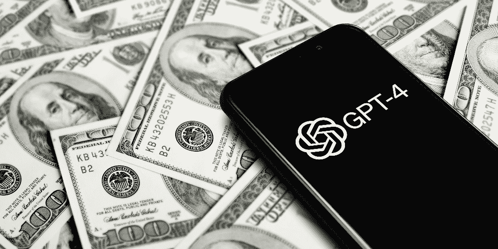

劳务经济的基础

找到一个尚未被服务的“利基”市场并为其提供服务是困难的。通过找到一种独特的服务或产品，人们已经在其中赚钱，可以在更广泛的市场中找到成功。

节省你客户的时间

我指出使用人工智能可以增强一个人的产出，并且本质上为其用户提供更多时间——我们最宝贵的商品。根据这个想法，一个能为你客户节省时间的副业（在我看来）有更大的成功机会。

一个朋友问我，为什么他要雇佣一个人使用人工智能创建漫画插图，当他可以直接将提示输入到文本到艺术人工智能中并自己完成时。

有多个原因可以雇佣另一个人，从人才和经验开始。你在与文本到艺术人工智能合作的过程中积累经验。保持和引导同一个角色在不同的画板中运行是一个挑战。我建议如果这成为他的一个真实项目，他最好专注于写作叙事和对话，而不是艺术作品。他仍然不确信，但这只是他的缺乏经验。

以下列出的都是将本书中详细说明的应用程序货币化的想法。

创意写作和讲故事

1.  定制内容创作：使用人工智能生成网站、营销材料或创意项目的详细描述和叙述。为需要独特、特定上下文内容的作者、游戏开发者或营销人员提供专业写作服务。

1.  人工智能辅助虚构作品代笔：基于人工智能生成的提纲，开发完整的小说、短篇小说或系列，将基本想法转化为完整的稿件。

1.  写作工作坊和课程：提供在线课程或工作坊，教授作家如何使用人工智能开发故事想法、完善情节并增强角色发展。

1.  定制故事创作：使用人工智能根据客户偏好生成独特情节，提供个性化的故事用于私人娱乐、礼品或特殊场合。

1.  电子书自助出版：使用人工智能开发小说内容，在流行的体裁或细分市场中创建并自助出版电子书。

1.  媒体剧本创作：编写电影、戏剧或电子游戏的剧本，使用人工智能开发情节大纲和角色描述。

1.  故事顾问服务：为作家或出版机构提供人工智能辅助的故事发展服务，帮助克服写作障碍并扩展现有情节。

1.  互动和连载小说：为在线平台创建互动或连载小说，使用人工智能概述情节分支或连续内容。

1.  粉丝小说和替代结局：生成和销售流行书籍、电影或游戏的粉丝小说或替代结局，吸引粉丝社区。

1.  协作写作项目：组织使用人工智能生成的框架的协作写作项目，指导协作以实现连贯的故事讲述。

1.  人工智能辅助写作工具：开发一个提供人工智能驱动的情节生成和故事发展建议的平台。

1.  主题内容生成：提供为活动创建主题内容的服务，例如定制问候语、邀请函或针对活动主题的促销内容。

1.  具有特定情感或情境关注的自由写作：提供专注于特定情感调调或情绪的写作服务，面向内容创作者、营销人员或出版商。

* * *

视觉艺术和设计

1.  人工智能驱动的艺术品创作：使用人工智能工具将文本描述转换为艺术品。满足数字媒体、广告或需要独特艺术用于个人或商业用途的客户的需求。

1.  定制礼品和商品：为独特的礼品或商品（如 T 恤、杯子或海报）生成个性化的诗歌、故事或艺术品，尤其是在节假日或特殊场合。

* * *

教育与培训

1.  教育材料和教程：创建关于使用人工智能进行写作和艺术创作的教育内容和教程，包括针对初学者和高级用户的有效提示使用课程或工作坊。

1.  教育材料制作：开发全面的教育材料和课程指南，供教育机构或在线平台销售。

1.  工作坊和研讨会内容准备：为工作坊和研讨会准备内容，为专业人士和教育工作者提供新鲜、可靠的材料。

1.  适用于不同学习类型的教材：创建满足不同学习类型或年龄组需求的内容，提供引人入胜且适合年龄的学习材料。

1.  财务教育与教程：通过课程或电子书，利用人工智能教授财务图表分析。

* * *

商业和专业写作

1.  非虚构写作服务：从想法到完整草稿开发非虚构内容，满足需要报告或指南的作者或专业人士。

1.  电子书创作和销售：使用 AI 创建各种主题的非虚构电子书，编辑和格式化以便在亚马逊 Kindle 等平台上销售。

1.  内容营销：为企业和博客创建高质量、经过研究的文章，精炼 AI 生成的草稿以满足专业标准。

1.  出版物文章写作：为杂志、报纸和在线出版物撰写文章，开发符合编辑标准的内容。

1.  自我帮助和如何指南：使用 AI 生成的内容创建关于个人发展或技术等主题的自我帮助和如何指南。

1.  自由职业学术写作：协助创建学术作品的条理化的提纲或部分，专注于组织良好的内容。

1.  基于订阅的内容服务：提供针对特定兴趣或行业的定期、经过研究的非虚构内容订阅服务。

1.  营销文案和广告：为小型企业或初创公司开发有说服力的广告文案，使用 AI 制作引人入胜的提案。

1.  客户内容个性化：为个人用户或客户群（如通讯或用户指南）个性化内容。

* * *

数字转型和自动化

1.  文档数字化服务：将物理文档、文本照片和手写笔记转换为商业或个人的数字格式。

1.  数据录入自动化：使用 AI 自动化数据录入任务，从印刷材料中提取信息到结构化数字格式。

1.  可访问内容创作：将印刷材料转换为数字文本格式，用于视觉障碍者的文本到语音工具。

1.  翻译服务：提供结合 OCR 和语言翻译功能的翻译服务，用于国际文档。

1.  档案服务：为图书馆、学术机构或企业数字化和存档旧文档。

1.  法律文件处理：将法律文件、案例文件或合同转换为律师事务所的数字格式。

1.  内容再利用：将印刷的营销材料转换为在线使用的数字内容。

1.  电子书创作：将手写稿件或印刷文本转换为作者或出版商的格式化电子书。

1.  教育材料准备：为教育提供者数字化和准备课程材料。

* * *

财务分析和咨询

1.  财务分析服务：为投资者或企业主提供基于 AI 的财务图表分析。

1.  财务博客或视频博客：利用 AI 分析创建关于财务教育和投资策略的内容。

1.  基于订阅的市场分析：通过订阅服务提供定期的基于 AI 的金融市场分析。

1.  定制财务报告：利用 AI 创建分析历史数据并预测趋势的报告。

1.  自动化金融咨询服务：提供上传金融图表的即时 AI 生成分析和建议。

1.  数据可视化服务：使用 AI 驱动分析创建金融图表和可视化。

1.  研究论文和演示文稿：准备需要详细图表分析的研究论文、演示文稿或报告。

1.  实时金融仪表板：构建显示实时 AI 分析金融数据的仪表板。

1.  AI 驱动金融规划工具：开发基于个人财务数据的预测和分析工具。

如果你喜欢这本书，请留下评论。

[`www.amazon.com/review/create-review?&asin=B0DC5S85LV`](https://www.amazon.com/review/create-review?&asin=B0DC5S85LV)
