# ChatGPT：使用人工智能设备

> 原文：[ChatGPT - Using the AI Appliance](https://annas-archive.org/md5/26fc251e7252394091692664aacc4194)
> 
> 译者：[飞龙](https://github.com/wizardforcel)
> 
> 协议：[CC BY-NC-SA 4.0](https://creativecommons.org/licenses/by-nc-sa/4.0/)

## 简单开始 - 跳过 AI 炒作 - 轻松获得结果

# 与本书及其作者建立联系

现在你有了这本书的副本，通过与其他人和同一主题的资源建立联系来启动其价值。

1.  信息：您可以通过我的出版商（BrainJuice.Media）使用他们的[反馈表单](https://bjl.ink/contact)给我发评论或提问。问我任何问题。我会尽快回答。（请记住在“主题”字段中选择书籍）

1.  Facebook 群组：加入我的私人[Facebook 群组](https://www.facebook.com/groups/adamoneverything)，这是任何对我在写的话题感兴趣的人的群组。那是我与大家互动的主要地方。

1.  作者页面：我的[My BrainJuice.Media 作者页面](https://bjl.ink/adam)是我所有当前内容的起点，包括已发布的和“正在进行”的内容。

1.  博客：我在 Medium.com 上发布关于我的[AdamOnProjects 博客](https://adamonprojects.com/)的文章。

1.  邮件列表：如果您还没有加入，请在我的出版商 Brainjuice.Media 的网站上注册我的[邮件列表](https://bjl.ink/engage)。当我有新书、课程和其他内容可供使用时，您将获得信息。我会更新您有关有趣交易的信息，以及关于即将到来的活动和 Adam On Projects 世界中的其他活动的信息。

1.  社交媒体：你可以在互联网上找到我：

+   [X（前身为 Twitter）](https://twitter.com/adamonprojects/)

+   [LinkedIn](https://www.linkedin.com/in/adamonprojects/)

# 关于这个版本的说明

这是这本书第一版的 1.00 版本。

它受益于为其他 ChatGPT 书籍编写和更新的内容，并在此处进行了改造。

我还平衡了内容与其他书籍，确保这里的内容独特，尽管信息相同。

书中的几乎所有内容都已被编辑、重新组织或两者兼而有之。

如果您发现任何错误，请告诉我。

# 引言

ChatGPT 简化了对强大人工智能技术的访问，使其几乎对任何人都可以使用。这本书采用“从简单开始”的方法，帮助你有效地利用 ChatGPT。

将 ChatGPT 视为一个 AI 设备。就像任何设备一样，它需要一些基本理解才能有效使用。虽然 ChatGPT 不是通用人工智能（AGI），但它可以以令人印象深刻的高效解决特定问题。

使用 ChatGPT 成功的关键在于采用“黑盒心态”。这种方法允许你专注于你可以控制的输入和输出，而不需要理解 AI 复杂的内部运作。通过专注于你可以控制的内容，你可以取得更好的结果，并在一段时间内提高你的技能。

在这本书中，你将学习如何：

+   以黑盒心态接近 ChatGPT。

+   从简单的技术开始，并在需要时增加复杂性。

+   确定 ChatGPT 最适合解决的问题。

我们的目的是帮助你有效地使用 ChatGPT，而不会迷失在 AI 术语中。让我们从简单开始，开始你的 ChatGPT 掌握之旅。

# 如何阅读这本书

我试图使本书的内容成为一次逻辑之旅，穿越 ChatGPT 使用的激动人心但常常令人困惑——甚至令人沮丧——的世界。请查看以下书籍大纲，并在你阅读完本书后考虑你可以使用的内容。

## 本书概要

本节为你提供了本书的顶层叙述和关键论点/收获的总结。

第一章“人工智能：新的通用应用”，概述了“AI 转折点”及其对你理解 ChatGPT 的重要性，介绍了“AI 电器”的概念以及它是黑盒思维模式的基础，然后我在概念上介绍了它，为下一章做了铺垫。

第二章“拆解 ChatGPT 黑盒思维模式”，更详细地描述了黑盒思维模式，并拆解了六个组成部分，为你提供了一个对整个 ChatGPT 互动景观的端到端视角。这包括理解 ChatGPT 的关键优势、ChatGPT 工作的总体约束以及作为用户你可以控制的事情。

第三章“与 ChatGPT 互动”，概述了帮助你应用与 ChatGPT 互动的黑盒思维模式的额外材料，包括对 ChatGPT 操作的浅层看法，打破一些关于 ChatGPT 的神话以及你可以控制的主要领域。

这三章将为你提供对 ChatGPT 在你特定问题领域应用的全面、端到端的切片，并提供概念框架和工具来分析和讨论你应该如何使用 ChatGPT。

他们将帮助你不仅能够现在就有效地使用 ChatGPT，还能获取更多关于 ChatGPT 应用领域的先进知识。

## 接下来是什么？

在你完成这本书后，你将比普通 ChatGPT 用户拥有更多有用和实用的知识。你可以通过阅读更多高级内容继续这段旅程。例如，查看以下标题。你可以在我的[Leanpub 个人资料页面](https://leanpub.com/u/adamonprojects)找到这些内容。

1.  [“高级 ChatGPT 应用入门”](https://bjl.ink/GptAP)：关于 ChatGPT 及其在你问题领域应用所需了解的一切的完整和详细描述。

1.  亚当：适用于敏捷项目经理的高级 ChatGPT：将“黑盒”方法扩展到敏捷项目管理实践。

# 人工智能：新的通用应用

“AI 是新的电力”——安德鲁·吴，AI 研究员、企业家和思想领袖

安德鲁·吴认为人工智能是一种通用技术，这意味着它不仅仅对一件事情有用，对许多事情都有用。

在这一章中，我想让你体验这种强大功能的风味，并提出我们应该如何思考像 ChatGPT 这样的应用的不同方式。

我认为 ChatGPT 的类比是一个使用 AI 电力的电器。

## 从简单开始

图 1. 完美

这本书的论点是，成功使用 ChatGPT 是一种揭示我们与 ChatGPT 互动中实际简单性的练习。如果你在网上阅读关于 ChatGPT 的文章，你会被多个模糊这一实际简单性的信息所淹没。要么是陈述过于简单化，在描述 ChatGPT 能做什么时忽略了关键的和非平凡的集成问题。要么信息极其复杂，深入到 GPT AI 引擎的内部。

我认为 ChatGPT 的实际使用可以避免后者：你实际上并不需要了解 GPT 内部的信息。首先，因为你不需要了解它们来有效地使用这个工具；其次，因为你所读到的许多信息都是误导性的、错误的或解释得不好。

另一方面，你确实需要了解如何恰当地将 ChatGPT 整合到你的工作流程中。我所说的“恰如其分”是指信息必须与你的用例的简单性或复杂性相平衡。在你使用 ChatGPT 的早期阶段，你只需要了解与你所使用的工具和数据相关的信息。

### 人工智能“转折点”

人工智能已经存在了几十年，但自从 OpenAI 发布了 ChatGPT，这些短短的几个月里，它的发展速度已经超出了人们的视线。

ChatGPT 及其竞争对手的使用正在爆炸式增长。因此，其误用似乎也在增加。人们基于模糊的声明、假设、偏见和错误的期望纷纷涌向使用它。虽然许多人惊讶并高兴于 ChatGPT 帮助他们创造的价值观，但其他人发现他们的期望没有得到满足。

2022 年 11 月 ChatGPT 的发布是 AI 赋能的“转折点”，在此之后，消费者对 AI 功能的参与发生了实质性变化。基于浏览器的 ChatGPT 界面使得 AI 技术对任何感兴趣的人开放，并吸引了巨大的关注。

“而且你看得越多，你就越能看到这个模型发生了哪些变化——以及为什么它似乎是一个转折点。…现在对所有人开放的 ChatGPT 已经完成了一个重要的转变。”——伊桑·莫利克在“[ChatGPT 是 AI 的转折点](https://hbr.org/2022/12/chatgpt-is-a-tipping-point-for-ai)”（hbr.org 2022 年 12 月 14 日）。

什么是转折点？

### 转折点解析

在“转折点”之前，任何商业或技术中对 AI 的使用至少受到一个（通常是两个）非平凡促进因素的制约：

1.  人工智能软件解决方案的开发

1.  人工智能模型的训练

在 AI 的“转折点”上，这些因素发生了逆转。

实施成本

人工智能解决方案的成本包括许多因素，例如：

1.  开发者成本用于设计、编码和测试解决方案。这取决于平台和集成环境，它们逐渐提供了更多的内置功能，因此需要更少的自定义代码。

1.  平台成本：有些是开源的，有些是专有的，但众所周知，“开源”并不意味着“无成本”。

1.  基础设施成本：无论是物理的还是虚拟化的，计算基础设施的非平凡成本。

1.  市场时间：时间是成本，其中最不重要的是在解决方案开发期间必须承担的额外负担。如果错过了市场窗口，也可能产生巨大的成本。

1.  模型训练：训练模型的成本：数据许可成本、基础设施成本和人力成本是三大成本。

模型训练

所有机器学习（“ML”）解决方案都需要在覆盖解决方案预期用途的数据上进行训练。

在“临界点”之前，解决方案开发者或专门的客户人员会在与组织试图用 AI 解决方案解决的问题直接相关的数据上训练 AI 模型。

如果选择的 AI 集成平台是一个产品，那么开发过程将包括进行模型训练。然而，是否允许提供训练好的模型取决于具体情况。

OpenAI 和其他通用人工智能平台供应商所做的是，在没有任何具体应用用例的情况下，在来自广泛来源的大量数据上训练他们的模型。或者，如果他们可能想到了参考用例，那么这个集合非常广泛。

这个模型的“预训练”涉及供应商在发布前在 AI 平台上进行的模型训练。例如，OpenAI 表示他们在所有维基百科数据上训练了 GPT，这包括数百万页和数十万个类别和链接。

大量预训练的结果是，产品可以立即供任何人使用，至少在理论上是这样。Andrew Ng 在下面提供了一个有趣的量化。

### 成本和时间的大幅降低

在“临界点”之后，AI 解决方案的交付时间大幅减少，如图下所示（来自 Andrew Ng 的视频演示“[AI 的机会](https://youtu.be/5p248yoa3oE)”），其价值主张非常有吸引力：当应用于正确类型的问题时。

例如，Andrew Ng 报告说，ChatGPT 将开发和部署 AI 应用的成本至少降低了两个数量级，例如，从 140 个工作日减少到 1-2 天，如图下所示。

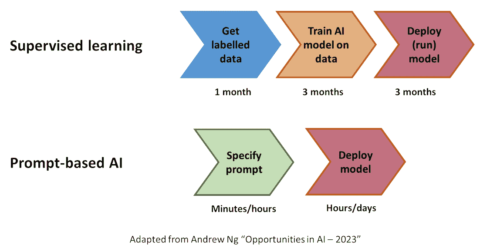

图 2. 比较人工智能应用部署速度（改编自 Andrew Ng）

但应用开发的“甜蜜点”在哪里？我确信 Andrew Ng 指的是软件开发，但仅仅是这些吗？你如何确定哪些应用与 ChatGPT 等设备有最大的亲和力？OpenAI ChatGPT 的消费者用户有多少种方式将其应用于他们的问题领域？

工具并非没有缺点，但入门门槛实际上是零，障碍可能主要在于对产品的知识和感知，而不是技术或产品本身的固有属性。

OpenAI 沿着这两条曲线的自然进化轨迹推动了它们，实现了“转折点”，在这个点上，预训练远远超过了任何个人或团队可能感兴趣的范围，并将实施成本降低到几乎为零。

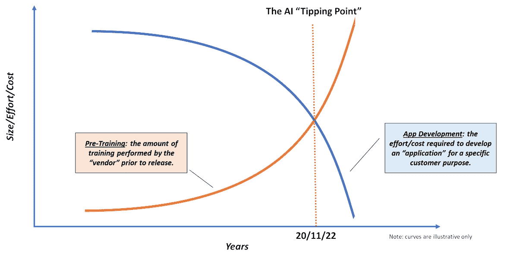

图 3. AI 转折点可视化

注意，这些进化曲线仅用于说明目的。y 轴上没有具体单位，也无法生成趋势线。图表中唯一的事实是 ChatGPT 的发布日期。

#### 结论

由 ChatGPT 的发布标志的过渡标志着人工智能技术的基本转变，从专业、狭窄的应用到多才多艺、高度强大的系统。这个“转折点”使人工智能更加易于访问、强大，并融入日常商业和个人任务中，塑造了技术未来和人类互动的格局。

## ChatGPT：面向每个人的 AI 设备

OpenAI 的 ChatGPT 显著提高了公众对人工智能（AI）的访问。它简化了 AI 的交互，提供了机遇和挑战，并且可以被视为任何通过互联网都能访问的 AI 设备。

### GPT 的复杂性和模糊性

GPT（生成式预训练转换器）是一个复杂且精密的机器。尽管其架构和功能的一些方面是透明的，但很大一部分仍然是专有的和模糊的。

许多试图解释 ChatGPT 的文章和论文要么过于技术化，要么依赖于肤浅的解释。这些作品往往最终让用户感到困惑，而不是阐明 ChatGPT 的工作原理。即使专家尝试深入分析这项技术，如 Stephen Wolfram 的详细分析，其深度和复杂性也使得普通用户难以理解。

对于 ChatGPT 能做什么和不能做什么存在很高的误解。这部分是因为解释往往混淆了多个问题的答案，比如“ChatGPT 是如何工作的？”，“它是如何构建的？”，以及“什么是人工智能？”。营销因素也加剧了这种混淆。

就像家用电器一样，ChatGPT 拥有简化的用户界面和特定的功能。它旨在面向广泛的用户群体，并隐藏其内部复杂性。

### 设备的特征

1.  具体功能配置：它做它声称要做的事情。

1.  简化的用户界面：仅暴露必要控件。

1.  隐藏的内部技术：引擎盖下的内容仍然在很大程度上被隐藏。

1.  目标受众：面向公众，而不仅仅是技术熟练的用户。

然而，由于 ChatGPT 的概率性质和有时不正确的响应，它并不是一个完美的工具。尽管营销和用户界面简化了体验，但其功能范围仍然有限。

了解 ChatGPT 的内部运作对用户来说大多无关紧要。更重要的是理解它擅长做什么以及如何最大化其满足你特定需求的效用。

## 跨越技能自举鸿沟

我们在从事任何事情时都是从新手开始的。当我们开始时，我们都在这个领域“糟糕”。但通过适当的练习和帮助，我们会变得更好。凯西·西拉将这个过程描述为从“糟糕区域”开始。我将这个想法扩展到 ChatGPT，并称之为“技能自举”，因为我们在 ChatGPT 中学到的大部分知识都来自于交互周期。我们使用最近交互的经验来为即将到来的周期自举我们的技能。问题是，如果没有方向，这可能会变成一种随机活动。

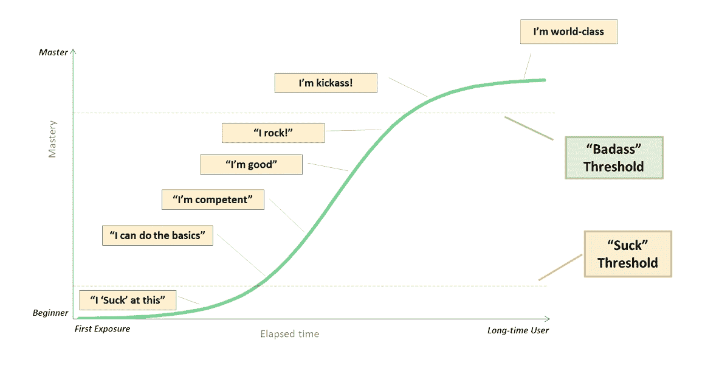

图 4. 技能自举（改编自凯西·西拉）

你可以看到凯西·西拉将能力（即专业知识）大致分为三个区域：

1.  “糟糕”区域：新手和其他在这个技能上通常“糟糕”的人。

1.  “胜任”区域：克服了“糟糕阈值”并变得自信和高效的人。

1.  “坏小子”区域：在技能上非常熟练的人——“世界级”的技能。

在《坏小子：让用户变得出色》（第 67 页）中提到：“在旅途中，他们会遇到许多里程碑，其中一些比其他更重要。但在这条曲线上的所有点上，最重要的两个是跨越糟糕阈值和跨越坏小子阈值。” 奥莱利媒体。Kindle 版。

这里强调的是“正确”这个词。使用这个工具并不能帮助你逃离凯西·西拉所说的“糟糕区域”。尝试不同的学习策略，以实现上图所示的增长。

如果我们没有一些帮助来改进 ChatGPT 技能的渐进式发展方法，那么我们可能会被“鸿沟”——在非常基础技能和走出“糟糕区域”之间的大差距所阻挡。

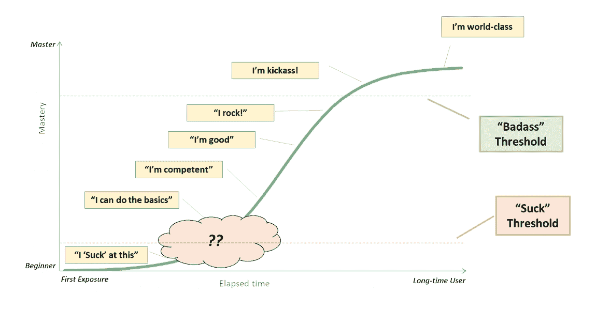

图 5. 技能自举鸿沟

技能自举鸿沟是一个过渡性障碍，大多数人都会经历：我们刚刚有足够的技能让 ChatGPT“工作”——输入提示并获取结果，但我们没有足够的技能来防止不良使用甚至误用。换句话说，我们了解得足够多，可以让自己陷入麻烦，但不足以摆脱麻烦。

这种鸿沟既是由挫折感造成的，也是由于技能不足。尤其是当人们试图通过了解 ChatGPT 的内部知识或过早地学习提示工程来取得过大的进步时，这种情况尤为明显。另一种方法是购买提示列表：如果它们有效，那很好；但如果它们需要在你的环境或特定用例中调整才能工作，可能你并没有足够的技能来有效地进行更改。

不“跨越鸿沟”的结果是困在“糟糕区域”，因为挫折和糟糕的结果超过了你愿意投入的时间和精力。

跨越技能自举鸿沟的方法是获得针对每个用户精确阶段和情况的针对性帮助。这包括诸如教练或导师、高质量课程，当然还有这本书这样的高质量书籍。

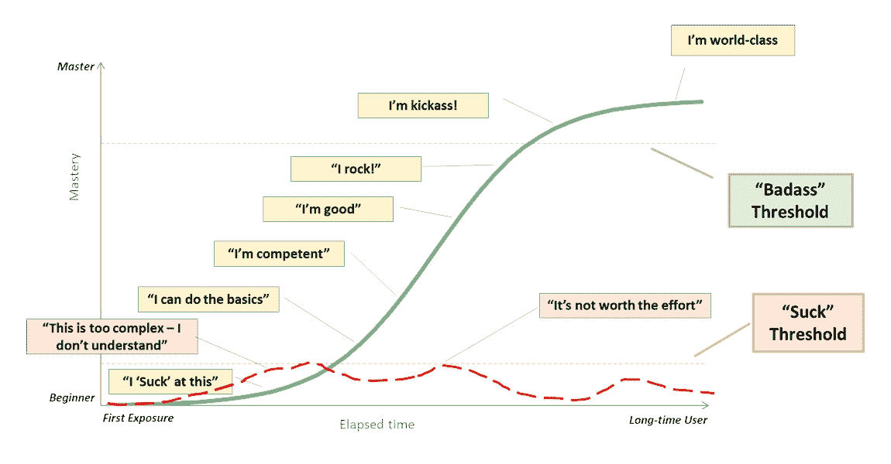

图 6. 困在“糟糕区域”（改编自 Kathy Sierra）

## ChatGPT 黑盒思维

“黑盒”是一个用户不了解其内部操作的系统。用户仅通过其输入和输出与之交互。

采用 ChatGPT 的“黑盒思维”有几个优点。它使我们摆脱了误解，让我们专注于我们能控制的事情，并有助于更好地理解 ChatGPT 的优势和劣势。

这是一个非常简单的概念，但它可以是双刃剑，带来利弊：

1.  它为想要解释内部结构的人打开了市场，即使他们自己并不完全理解。

1.  这导致了用户对盒内发生事情产生的神话和误解。

1.  它开启了“货船崇拜 AI”的潜力，人们会形成关于盒内发生事情的错误理论。

使用 ChatGPT 的有效第一步是将其复杂性视为一个单元，并把它当作一个黑盒来接受。这使我们能够专注于输入和输出，这些都在我们的控制范围内。

当前市场上针对 ChatGPT 的提供物很大一部分围绕着提示词。然而，这些往往忽略了评估输出或理解由于 ChatGPT 的概率性质导致的响应变化的相关指南。

了解如何更好地控制输入和评估输出对于优化 ChatGPT 的效用至关重要。这不仅仅是让过程看起来“即插即用”。

虽然你可以追求更深入地理解 GPT、AI 和 ML 的工作原理，但这种知识对于 ChatGPT 作为 AI 设备的实际使用并不是必要的。采用“黑盒”方法通常更有益，帮助你专注于你能控制的事情：输入和输出。

我将在下一节中拆解 ChatGPT 的“黑盒思维”的组成部分。

# 拆解 ChatGPT 黑盒思维

我们可以将黑盒思维描述为 ChatGPT AI 设备的六个因素。

本章概述了这些因素，然后更详细地拆解了每一个。

想要更深入地了解六个因素，包括实用提示和提示示例，请参阅我的书籍[《高级 ChatGPT 应用入门》](https://bjl.ink/GptAP)。

## 六个组成部分促成一种思维模式

黑盒 ChatGPT 互动框架指导用户有效地利用 ChatGPT 的能力，同时解决固有的限制，并在组织内确保负责任的用法。该框架包括六个关键组成部分，共同使用户能够以富有成效、道德和知情的方式与 ChatGPT 互动。这六个组成部分是：互动黑盒界面、发挥 ChatGPT 的优势、理解 ChatGPT 的关键限制、关注用户可以控制的内容、采用好奇的丰富性和实施黑盒治理。下面的图示总结了这些组成部分。

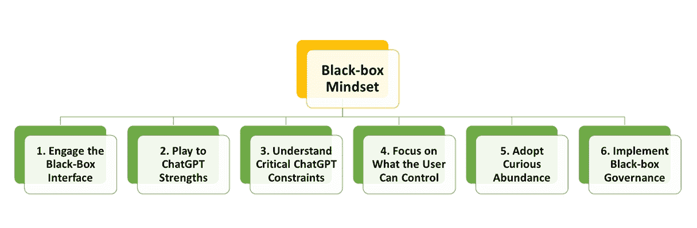

图 7. GPT 黑盒思维 - 概述

1. 互动黑盒界面

“GPT 黑盒界面”是 GPT 对应图灵测试的版本，我在 GPT 教义 #2 中提到了这一点。您与 GPT 的互动仅基于您的输入和 GPT 的输出。您忽略（或可能抑制）界面另一侧发生的事情。那可能是一个人、一群猴子，或者一艘外星母船。您不在乎。您关心的是您得到的输出，以及它如何用于您的使用和告知您未来的输入。黑盒界面是经验主义的极致。

2. 发挥 ChatGPT 的优势

为了充分发挥 ChatGPT 的潜力，用户必须发挥其优势。ChatGPT 在自然语言处理、类似人类的交互和自我改进能力方面表现出色。通过专注于这些优势，用户可以有效地将模型应用于各种应用，例如内容创作、客户支持和数据分析。认识和利用这些优势确保与 ChatGPT 的互动既高效又有效。ChatGPT 的优势就像其弱点一样令人惊讶。我们不应该将表面上的优势误认为是潜在能力的指示，而这种能力实际上并不存在。

3. 理解 ChatGPT 的关键限制

就像我们必须认识到 GPT 的优势并不要对自己其起源产生错觉一样，我们也必须客观并关注 GPT 的显著弱点。我把它们称为“限制”，因为它们是表明在哪里不要使用 ChatGPT 的指标——避免某些类型问题的指南，以免我们因结果不达标而受阻。在“黑盒思维模式”中，我们理解了在使用 GPT 时必须牢记的四个关键限制集。这些限制是 1) 无感知知识，2) 非确定性响应，3) 响应限制和 4) 明显的错误（例如偏见和非可解释性）。（我将在以后的叙述中详细说明）。最近，我们可能还可以增加第五个限制：基础设施性能和可用性。自 2023 年 DevDay 以来，OpenAI 平台的性能一直波动很大。（这可以说是一种中性的说法，有些日子真的很糟糕！）有一天，我会要求 GPT 处理大量数据并几乎立即得到响应。而在其他日子里，即使是简单的任务也无法使用。

4. 专注于用户可以控制的内容

当你作为用户使用 GPT 时，有三个因素是你完全控制的。这些是 1) 问题选择，2) 提示结构和内容，以及 3) 你如何使用响应。其他所有东西都内置在 GPT 架构中，或在 OpenAI 或，更近期的，其他软件合作伙伴（如插件构建者和 GPT 开发者）的控制之下。黑盒思维模式帮助你理解你可以控制的三个因素，并利用它们获得最佳结果。

5. 采用好奇的丰富性

“黑盒思维模式”包括对 GPT 持续演变的事实持好奇的提问态度，以及我们并不总是了解其做什么或如何做的所有事情。这种“好奇的丰富性”强调了 GPT 几乎神奇的本质：我们永远不能肯定地说我们了解其所有功能。不仅 OpenAI 不断调整模型并开发新的功能，而且有证据表明存在一个“机器中的幽灵”，它会用我们从未预料到的事情来惊吓我们。

6. 实施黑盒治理

在任何类型的商业环境中使用 GPT 时，我们需要考虑一定程度的治理。治理——广义上讲——是一套政策、程序和工具，帮助组织保护自己免受负面事件的影响，例如安全漏洞。术语“黑盒治理”几乎是一种矛盾，因为治理最终是关于风险管理（RM），而在风险管理中，你希望尽可能多地了解风险参数。但我们只能玩 OpenAI 给我们的牌。有些事情正在改善，但有些事情，如“可解释性”，由于架构限制，在 GPT 中可能永远无法解决。

结论

黑盒 ChatGPT 交互框架提供了一个全面的方法来与 ChatGPT 交互。通过解决六个关键组成部分中的每一个，用户和组织可以增强 ChatGPT 的有效性、可靠性和道德使用。这个框架赋予用户导航与黑盒 AI 模型交互的复杂性的能力，确保他们使用 ChatGPT 的创新性和责任感。

## 交互黑盒接口

在本节中，我们介绍了 ChatGPT“黑盒”思维的第一部分。

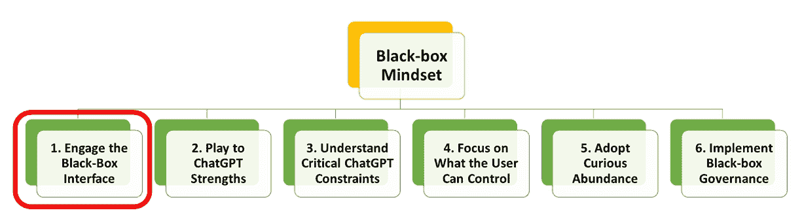

图 8. 黑盒思维 #1

### 人-ChatGPT 黑盒接口

“黑盒接口”是一个通过关注输入和输出而忽略 GPT 引擎复杂内部结构的简化人-ChatGPT 交互的概念。这种经验方法帮助用户有效地利用 ChatGPT 的优势，并客观地使用它。黑盒接口是艾伦·图灵构想的“模仿游戏”在 ChatGPT 中的扩展。

在原始的“模仿游戏”，也称为“图灵测试”中，概念是一个人（C）通过在墙的另一边发送书面信息来回通过一个槽位与某物交互。挑战是让这个人（C）确定墙的另一边是另一个人（B），还是一台计算机（A）。

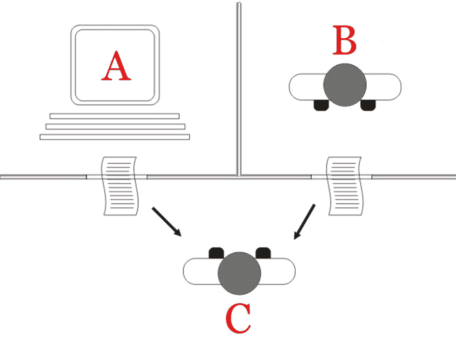

图 9. 原始图灵测试

图片来源：[Juan Alberto Sánchez Margallo - 文件：Test_de_Turing.jpg, CC BY 2.5](https://commons.wikimedia.org/w/index.php?curid=57298943).

黑盒接口是这一点的自然扩展，因为我们不关心墙的另一边是什么。我们的目的是根据我们收到的响应解决问题或执行其他功能。

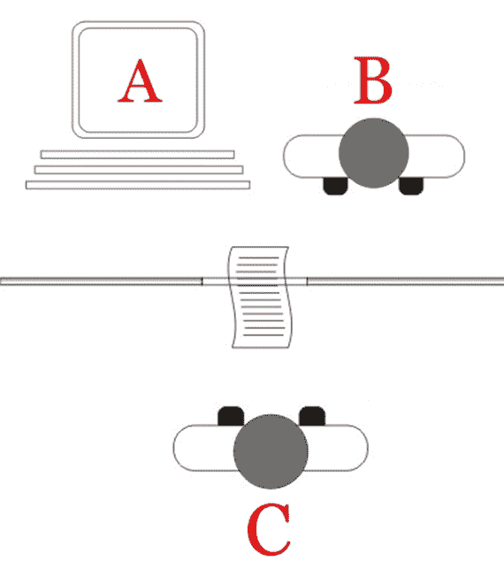

图 10. ChatGPT 黑盒接口

通过黑盒接口与 ChatGPT 交互涉及理解模型的运行动态，而不必了解其内部工作原理。

因此，我们最终得到了 ChatGPT 最简单的交互概念，一个忽略“盒子内部”发生的事情的概念。

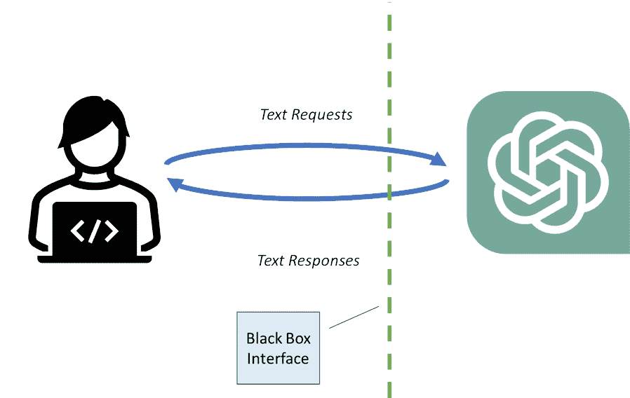

图 11. 最简单的 ChatGPT 交互概念

在书籍《“高级 ChatGPT 应用与操作指南”》的“高级黑盒思维 #1 - 交互黑盒接口”章节中，对此主题进行了更详细的介绍。[“高级 ChatGPT 应用与操作指南”](https://bjl.ink/GptAP).

### ChatGPT 的特点

让我们回顾一下 ChatGPT 背后的关键特征，这些特征隐藏在浮夸和夸张之下。真正让它运转的是什么？

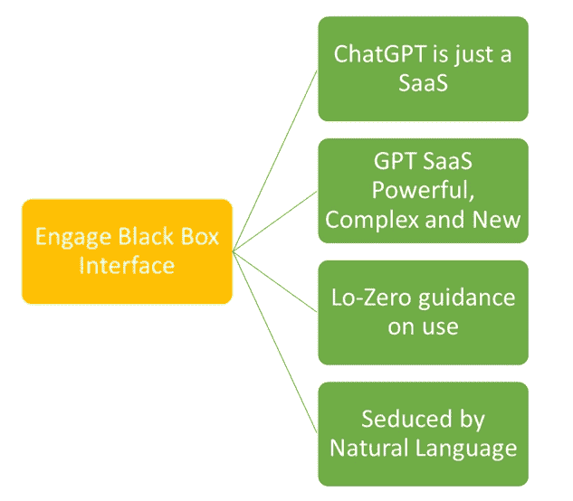

图 12. 交互黑盒接口功能

ChatGPT 只是一个 SaaS

ChatGPT 界面的另一边只是一个计算机程序，以“软件即服务”的模式提供。当然，它很强大，但仅仅是一个 SaaS：它有功能和功能差距；它有明显的优势和劣势。该平台有漏洞和故障。它的开发者和运营商是人类，他们大多数时候都做得很好，但也会犯错误。我们已经与 SaaS 产品共存了几十年，ChatGPT 在这方面并没有太大的不同。在某些方面，它可能比其他产品更容易受到威胁，因为它发展得太快了。

SaaS 极其强大且复杂且新颖

GPT 技术栈是一个极其复杂的系统，需要花费数月时间和数亿美元来构建。世界上真正理解它是如何工作的人寥寥无几，尽管许多人认为他们了解——这是一种 LLM Dunning-Kruger 效应。关于 ChatGPT 功能的许多想法和观点都是基于 AI 和计算概念，这些概念在 AI “临界点” 之前，因此可能是错误的、误导性的或完全无用的。

ChatGPT SaaS 几乎没有提供使用指导

ChatGPT 客户端的用户界面非常简单——它只是一个我们输入自然语言的文本框。实际上并没有真正的供应商指导如何使用它，只有一些高度技术性的内部描述和功能描述的有限说明。全世界有无数的信息来源。这些信息来源往往缺乏准确性和质量生产，其中许多充满了炒作和未经证实的断言。似乎有一种假设，即使用自然语言作为界面需要较少的指导——人们会“自己弄明白”。

我们被自然语言所吸引

通过利用自然语言，ChatGPT 激活了我们大脑中的某种原始能力，这可能使得 ChatGPT 看起来比实际上更智能和更有能力。人类如何构建语言直接映射到我们的思维方式（至少是我们认为的思维方式）。社会已经让我们将出色的语言使用与智力和其他积极属性联系起来。当我们遇到甚至稍微有点流畅的机器响应时，很难避免这种反应。语言也是文化，因此 ChatGPT 也触动了我们的文化归属感。通过自然语言的魔力，ChatGPT 说服我们它非常智能，并触动了我们的拟人化倾向。

### 结论

ChatGPT 无疑非常强大，但它的设计却像海妖之歌一样，容易让我们误解产品，误用我们的努力。通过黑盒界面与 ChatGPT 互动将帮助我们避免这种诱惑。

## 发挥 ChatGPT 的优势

要充分发挥 ChatGPT 的潜力，用户必须发挥其优势。ChatGPT 在自然语言处理、类似人类的交互和自我改进能力方面表现出色。通过关注这些优势，用户可以有效地将模型用于各种应用，如内容创作、客户支持和数据分析。认识和利用这些优势确保与 ChatGPT 的交互既高效又有效。

下面的图表展示了 GPT（生成预训练变换器）模型的关键优势和功能，强调了它们在处理自然语言任务方面的多方面专业能力。

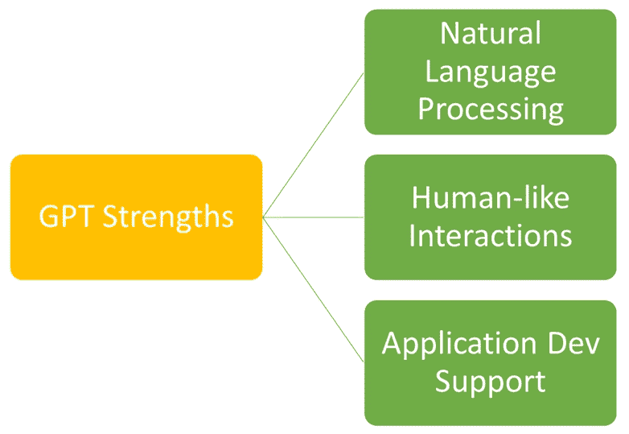

图 13. GPT 优势总结

这个主题在《高级黑盒界面#2 - 发挥 ChatGPT 优势》这一章节中进行了更详细的介绍，该章节收录于书籍《“高级 ChatGPT 应用与操作指南”》中[“Advanced ChatGPT Application and Operations Guide”](https://bjl.ink/GptAP)。

### GPT 关键优势

自然语言处理

GPT-4 展现出对人类语言的非凡理解能力。它可以生成上下文相关、语法正确且连贯的长篇文本。这使得它成为各种任务的有力工具，如起草项目文档、生成代码和促进利益相关者之间的沟通。

自然语言处理包括四个关键功能：提示语言解析、关注点分离、内容完成与转换以及输出语言调节。

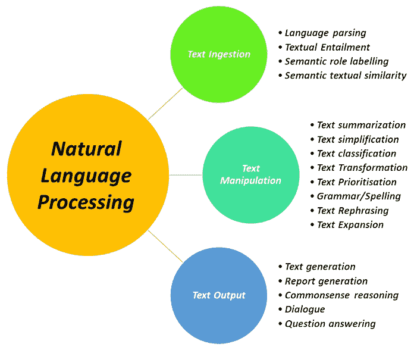

图 14. NLP 功能

类似人类的交互

GPT 模型可以模拟连贯、上下文相关和个性化的交互。关键方面包括与合理对话互动、个性化回复和实时生成。

合理性：GPT 模型生成的回复是合理且上下文适当的。

个性化：个性化是类似人类交互的关键方面。GPT 模型可以根据用户偏好、先前交互和特定上下文信息定制回复。

实时性：实时生成回复的能力对于保持对话的流畅性至关重要。

ChatGPT 的回复不是“预先设定的”——它们是直接针对用户在对话过程中提供的每个输入生成的。

这部分“人性”很大程度上归功于自然语言处理的优点，正如我在“参与黑盒界面”部分所描述的我们被自然语言所吸引。如果 ChatGPT 的回复不稳定，我们通常会从人类的角度来解释，比如“它在撒谎”或“它今天心情不好”。

自我改进能力

这种能力对于维护和提升模型生成的输出质量和相关性至关重要。这一能力的关键组成部分包括：自我学习、模型更新和会话内改进。

自我学习：GPT 模型可以从交互和经验中学习。

模型更新：定期更新模型对于其改进至关重要。

会话内改进：会话内改进指的是模型在单个交互会话中提升其性能的能力。

### 结论

通过确保您的 ChatGPT 使用发挥其优势，而不是我们在下一节中概述的局限性和弱点，ChatGPT 用户将获得更好的结果。

## 理解 ChatGPT 的关键限制

尽管具有优势，GPT-4 仍存在用户需要了解的某些局限性。在下图中，我们可以观察到与 GPT 模型相关的关键限制概述。

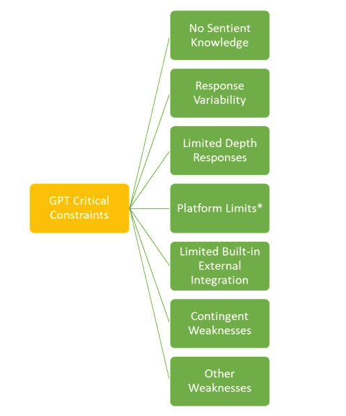

图 15. GPT 关键限制：总结

这些局限性总结如下。该主题在《“高级 ChatGPT 应用与操作指南”》一书的“高级黑盒接口 #3 - 避免 ChatGPT 限制”章节中有更详细的介绍。

没有感知知识

这一限制是理解 GPT 模型能做什么和不能做什么的基础，包括：

+   消息没有语义意义

+   GPT 不是通用人工智能或 AGI

理解“没有感知知识”的限制对于有效地使用 ChatGPT 至关重要。虽然该模型在生成类似人类的文本方面表现出色，但用户必须意识到其局限性，并在需要深入理解或关键决策的应用中谨慎行事。这种意识有助于设定现实的期望并确保技术的负责任使用。

响应变异性

这一限制突出了模型输出的本质，它可能受到各种因素的影响，导致不一致或不同的响应。理解这种变异性对于用户设定期望并有效地利用模型至关重要，包括：

+   响应是概率性的，而非逻辑驱动的

+   同一个提示不会总是产生相同的结果

识别和管理响应变异性对于有效地使用 ChatGPT 至关重要。虽然这一特性可能带来挑战，但也提供了创造性和动态的内容生成机会。通过理解导致变异性因素并实施适当的策略，用户可以发挥 ChatGPT 的优势，同时减轻潜在的缺点。

深度有限响应

这一限制影响了模型的表现，尤其是在专业或高度技术领域。理解这一限制有助于用户设定现实的期望并制定策略来应对或减轻其影响，包括：

+   缺乏深度专家级响应

+   响应在中等技能水平上“收敛”

虽然 GPT 模型在生成类似人类的文本和提供一般信息方面表现出色，但它们在特定响应方面的深度有限是一个关键限制。通过理解和解决这一限制，用户可以有效地利用 GPT 的优势，同时确保在特定或技术环境中信息的准确性和全面性。

平台限制

这些限制会影响模型在各种应用中的性能和可用性。理解这些平台约束对于有效地使用 GPT 模型以及管理对其能力和局限性的期望至关重要，包括：

+   有限的上下文窗口（对话跨度）**

+   数据量有限

认识和管理 GPT 模型的平台限制对于有效地利用其能力至关重要。通过理解与上下文窗口和数据大小相关的约束，用户可以制定策略来减轻其影响，确保更连贯和有用的交互。这些策略使得 GPT 模型能够在各种用例中有效应用，尽管存在固有的平台限制。

有限的内置外部集成

此约束对 GPT 模型在现实世界应用中的使用方式有重大影响，特别是那些需要与外部数据源和服务交互的应用，包括：

+   连接性有限

+   手动集成

随着 GPT-4o 的发布，针对有限的内置外部集成能力进行了重大改进。值得注意的是，GPT-4o 引入了连接到流行的云存储服务，如 Google Drive 和 Microsoft OneDrive 的能力。这些最新的添加显著增强了模型与外部系统和数据源交互的能力，包括：

+   Google Drive 集成

+   Microsoft OneDrive 集成

有限的内置外部集成一直是 GPT 模型的重大限制，影响了它们与外部系统和数据源交互的能力。然而，这些限制正在通过 GPT-4o 中引入的进步得到解决，包括与 Google Drive 和 Microsoft OneDrive 的集成。这些改进增强了模型的功能，简化了开发过程，并扩大了其在各种现实场景中的应用范围。

GPT 模型的潜在弱点

这些弱点可能并非模型本身的固有属性，而是将 ChatGPT 集成到各种工作流程和过程中的后果。理解这些潜在弱点对于有效地管理和减轻其对生产力和整体系统性能的影响至关重要，包括：

+   验证响应的额外开销

+   不明确的网络安全策略

+   偏见和伦理考量

+   依赖模型更新

+   用户培训和适应

认识和管理 GPT 的潜在弱点对于有效地将 ChatGPT 集成到工作流程和业务流程中至关重要。虽然该模型在生成类似人类的文本和自动化任务方面提供了显著的优势，但其间接后果，如额外的开销、不明确的安全政策和需要减轻偏见，必须得到解决。通过理解这些潜在弱点并实施适当的策略，组织可以最大限度地发挥 ChatGPT 的益处，同时最大限度地减少潜在的风险和低效。

其他 ChatGPT 弱点

这些弱点多种多样，可能影响其性能、可用性和集成到更广泛系统和工作流程的各个方面，包括：

+   对输入的非线性依赖

+   其他偏见

+   非自主处理

+   重复性响应

+   过于泛化的响应

+   数据丢失/安全问题

+   繁琐的响应

+   过度依赖 AI

+   产品进化早期阶段

+   没有教条或使用指南

+   无可解释性/审计

解决这些额外的弱点对于最大化 ChatGPT 的有效性至关重要。通过理解和管理这些限制，用户可以更好地将模型集成到他们的工作流程中，确保数据安全，减轻偏见，并保持人工监督。随着技术的不断发展，持续努力提高透明度、制定使用指南和增强模型功能对于其持续成功和可靠性至关重要。

## 关注用户可以控制的内容

在本节中，我们讨论了 ChatGPT“黑盒”思维的第四个组成部分。这一主题在《“高级 ChatGPT 应用与操作指南”》一书的“高级黑盒界面 #4 - 关注用户可以控制的内容”章节中有更详细的介绍。[“高级 ChatGPT 应用与操作指南”](https://bjl.ink/GptAP)。

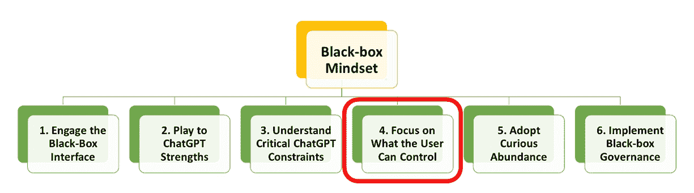

图 16. 黑盒思维 #4

尽管 ChatGPT 具有黑盒性质，但用户对其与模型的交互拥有显著的控制权。这一部分强调了在策略制定、态度和期望、提示结构及内容、交互用例和响应使用等方面用户控制的重要性。通过关注这些可控元素，用户可以优化他们的交互并从 ChatGPT 中获得最大价值。

在本节中，我们将探讨用户可以控制的 ChatGPT 的各个方面，以优化他们的交互并实现期望的结果。理解这些元素使用户能够充分利用 ChatGPT 的潜力，同时有效地管理其限制。以下图示概述了用户控制的关键领域，包括策略、态度和期望、提示结构及内容、GPT 交互和响应的使用。

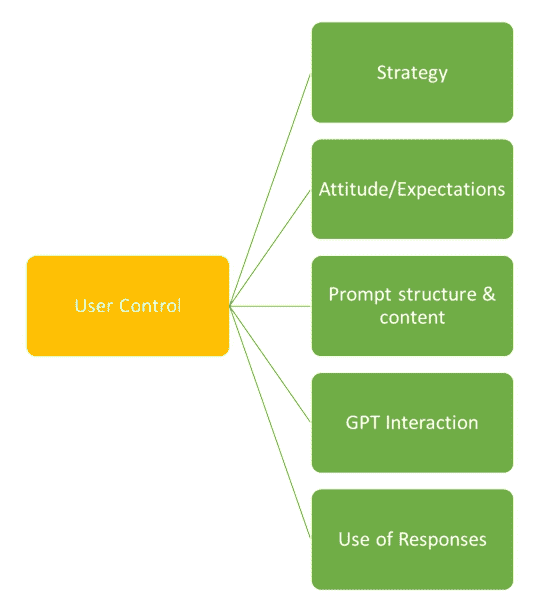

图 17. 用户可以控制的内容-总结

### 在用户问题域中决定 ChatGPT 的使用策略

当将 ChatGPT 集成到特定的问题领域时，制定一个明确和有效的策略至关重要。以下三个关键组成部分应指导这一策略：定义目标、选择问题以及制定操作策略。这些组成部分中的每一个都在确保 ChatGPT 的使用与用户的目标一致并产生有意义的结果方面发挥着关键作用。

目标是什么？

制定使用 ChatGPT 的策略的第一步是明确定义目标。为了建立明确的目标，用户应考虑以下因素：

+   SMART 目标：确保目标具有具体性、可衡量性、可实现性、相关性和时限性。

+   什么被启用？：了解 ChatGPT 在问题领域中的能力和局限性。

通过明确定义目标，用户可以为将 ChatGPT 集成到他们的工作流程中创建一个专注的路线图。

问题选择

选择 ChatGPT 可以有效应用的特定问题或任务。这涉及到识别问题领域内最能从 ChatGPT 的能力中受益的领域。为了选择正确的问题，考虑以下因素：

+   评估相关性和影响：评估哪些问题与目标最为相关，如果解决将产生最大的影响。

+   可行性分析：确定将 ChatGPT 应用于所选问题的可行性。

通过仔细选择与目标一致且可行的难题，用户可以确保他们的努力既有效又高效。

操作策略

一旦定义了目标和问题，最后一步是制定操作策略。一个稳健的操作策略确保 ChatGPT 的使用是系统化和协调良好的。操作策略的关键方面包括：

+   实施计划：制定将 ChatGPT 集成到工作流程中的详细计划。

+   监控与评估：建立监控 ChatGPT 性能和评估其影响的机制。

+   风险管理：识别潜在风险并制定缓解策略。

通过制定全面的操作策略，用户可以确保 ChatGPT 的集成得到良好执行并产生预期的结果。

结论

决定在用户的问题领域中如何使用 ChatGPT 的策略涉及定义目标、选择问题和制定操作策略的系统方法。

### 用户对 ChatGPT 的态度与期望

将 ChatGPT 集成到各种工作流程中的成功很大程度上取决于用户的态度和期望。正确管理这些因素可以显著提高与模型互动的有效性。下面图表中的主题分解突出了影响用户态度和期望的四个关键领域：准确性、相关性、人格化和知识范围。理解和解决这些领域有助于用户设定合理的期望并更有效地与 ChatGPT 互动。

准确性

准确性指的是 ChatGPT 生成的回答的正确性和可靠性。用户应了解以下方面：

+   期望管理：用户需要了解，尽管 ChatGPT 能力很强，但它并非完美无缺。

+   验证：对于需要高精度或涉及敏感数据的任务，验证 ChatGPT 提供的信息至关重要。

相关性

相关性涉及 ChatGPT 的回答与用户需求和上下文的一致性。关键考虑因素包括：

+   上下文提示：提供清晰和具体的提示可以提高 ChatGPT 回答的相关性。

+   迭代优化：用户可能需要优化他们的提示，并迭代地与 ChatGPT 互动以达到所需的关联性。

人格化

人格化是将人类特征归因于 ChatGPT，这可能会影响用户期望和互动：

+   理解局限性：用户应认识到，尽管 ChatGPT 具有类似人类的文本生成能力，但它并不具有意识，也不具备人类理解和情感。

+   交互风格：虽然用户可以以对话方式与 ChatGPT 互动，但他们应该记住，该模型的回答是通过统计模式生成的，而不是真正的理解。

知识范围

ChatGPT 知识范围是影响用户期望的另一个关键因素：

+   训练数据边界：ChatGPT 的知识基于其训练数据，这包括直到某个时间点可用的信息。

+   领域专业知识：虽然 ChatGPT 可以在各个领域提供有价值的见解，但它不能替代特定领域的专家。

结论

管理用户态度和期望对于有效地使用 ChatGPT 至关重要。通过理解模型的准确性，通过上下文提示确保相关性，认识到人格化的局限性，以及了解知识范围，用户可以设定合理的期望并更有效地与 ChatGPT 互动。

### 提示结构和内容

提示的结构和内容是用户在与 ChatGPT 交互中的关键控制组件。精心设计的提示可以显著提高模型生成的响应的质量和相关性。通过理解和有效使用提示设计的各种元素，用户可以优化与 ChatGPT 的交互。下方的图解将提示结构和内容的关键方面分解为六个类别：提示意图、提示数据、提示情境、提示指令、提示类型和提示框架。

提示意图

提示的意图定义了交互的目的或目标。明确意图有助于引导 ChatGPT 生成与用户目标一致的响应。

清晰性和具体性：明确说明提示的目的确保模型理解用户的需求。目标导向设计：在设计提示时考虑到明确的目标有助于简化交互。

提示数据

提示中提供的数据在塑造响应中起着至关重要的作用。包括相关且准确的数据有助于 ChatGPT 生成更精确和有见地的答案。

数据包含：在提示中融入相关事实、数据和细节，为响应提供坚实的基础。数据准确性：确保提供的数据准确且最新。

提示情境

情境提供背景信息，帮助 ChatGPT 理解提示所处的更广泛场景。包括情境可以增强响应的相关性和连贯性。

背景信息：提供与提示相关的背景信息确保 ChatGPT 全面理解主题。情境清晰性：在提示中明确定义情境有助于避免歧义。

提示指令

指令是指导 ChatGPT 如何处理提示的说明。这些可以包括具体任务、格式要求或风格偏好。

任务特定指令：包括对模型应执行的操作的明确说明（例如，总结、比较、解释）有助于集中响应。格式和风格：指定格式要求或风格偏好。

提示类型

不同的提示类型可以从 ChatGPT 那里引发不同类型的响应。理解各种提示类型有助于用户选择最适合他们需求的有效方法。

开放式与封闭式：开放式提示鼓励广泛和详细的响应，而封闭式提示则要求具体、简洁的答案。基于问题与基于指令：基于问题的提示邀请提供信息性的响应，而基于指令的提示则向模型提供更直接的指导。

提示框架

为 ChatGPT 的提示构建一个结构化框架可以确保与 ChatGPT 交互的一致性和全面性。制定标准化的提示设计方法可以增强整体效果。

一致的结构：提示的一致结构有助于简化交互并确保包含所有必要的元素。迭代优化：根据反馈和结果持续优化提示设计，有助于在使用过程中优化交互。

结论

有效的提示结构和内容对于充分发挥 ChatGPT 的潜力至关重要。通过关注意图、数据、上下文、指令、类型和框架，用户可以显著提高模型生成的响应的相关性、准确性和实用性。

### 交互用例

ChatGPT 的交互用例展示了如何使用不同的提示、数据和上下文组合来实现特定目标。每个用例提供了一种与模型互动的独特方法，使用户能够有效地定制他们的交互以满足各种需求。了解这些用例有助于用户充分发挥 ChatGPT 的潜力。

#### 交互组件概述

本节定义了 ChatGPT 交互模型中的关键组件。下面的图解将交互用例分解为几个类别，每个类别描述了提示、数据和上下文的独特组合。

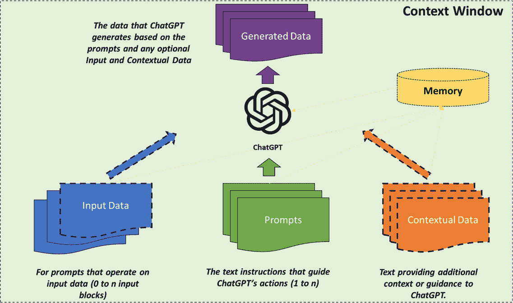

图 18. 交互用例上下文

1.  提示：这些是指导 ChatGPT 执行某些操作或触发响应的文本块。与 ChatGPT 的每次交互都是强制性的。

1.  上下文：这些是提供信息文本块，这些信息对多个提示或会话是通用的。这可能包括背景信息，如组织概述、项目描述或利益相关者列表。它也可能包括输出指令，例如始终以 Markdown 格式输出。上下文是可选的，但可以极大地提高 ChatGPT 响应的相关性和准确性。在 ChatGPT 网页客户端中，您可以输入“自定义指令”，这些是您通常可能包含在提示中的语句，但适用于多个提示或甚至您与 ChatGPT 的每次交互会话。

1.  数据：这些是我们希望 ChatGPT 根据提示指令处理或以某种方式考虑的信息块。数据是可选的，但对于需要处理或分析特定信息的工作至关重要。在最新版本中，OpenAI 部署了新的数据访问功能，包括直接访问位于公共互联网上的资源的 URL，以及与 Google Drive 和 Microsoft Onedrive 的集成点。您还可以将文件上传到上下文窗口或将文本数据粘贴到提示窗口中。

1.  记忆：OpenAI 在 2024 年引入了 ChatGPT 的“记忆”功能，用于存储用户关于其目标、上下文或数据的当前指导。目前尚不清楚这是否是一种新功能，或者只是用户界面上的“糖衣”，以帮助用户更好地理解 GPT 的操作。尽管如此，如果你对 GPT 提出分类性的陈述或指令，你经常会看到“记忆更新”之类的响应。

#### 基本 ChatGPT 交互数据模式

以下总结了八个（8）基本交互模式，并在我的书中进行了扩展 [《高级 ChatGPT 应用入门》](https://bjl.ink/GptAP)。

简单文本补全（仅提示）：用户提供一个简单的提示，没有额外的上下文或数据。ChatGPT 仅根据输入提示完成文本。

带上下文的简单文本补全：用户提供提示和一些上下文信息以引导响应。这种额外的上下文有助于 ChatGPT 生成更相关和精确的输出。

提示和数据：用户提供提示以及 ChatGPT 应将其纳入其响应的具体数据。这些数据增强了输出的相关性和准确性。

带上下文的提示和数据：在这种情况下，用户提供提示、具体数据和额外的上下文。这种综合输入允许 ChatGPT 生成详细且上下文准确的响应。

无上下文的分步操作：此模式涉及一系列不带额外上下文的提示。每个步骤都建立在之前的响应之上，以实现更复杂的目标。

带上下文的分步操作：在这个模式中，多步交互在每个步骤中都包含上下文，引导 ChatGPT 生成更连贯和相关的响应。

在上下文中输入数据：此模式涉及在上下文框架内提供具体数据。上下文有助于 ChatGPT 理解数据的关联性并生成适当的响应。

带上下文/数据的分步操作：在这个综合模式中，结合了多个步骤、上下文和数据。每个步骤都建立在之前的基础上，结合额外的信息和上下文以细化响应。

理解和使用各种交互用例使用户能够有效地调整与 ChatGPT 的互动以满足特定需求。通过以不同的方式结合提示、数据和上下文，用户可以优化模型生成的响应的相关性、准确性和连贯性。这些用例为与 ChatGPT 互动提供了一种结构化的方法，增强了其在广泛应用中的实用性。

### ChatGPT 产品交互

根据您的用例，您将使用一个或多个这三个黑盒接口，每个接口都需要更多了解 GPT 平台的内部结构和功能。

1.  ChatGPT 消费者界面

1.  OpenAI 操场界面

1.  OpenAI API 界面

1.  OpenAI 定制 GPT 界面

我将在下面简要介绍这些内容，并在本书的后续部分提供一些更完整的“用户指南”。

#### ChatGPT 消费者界面

这种黑盒界面是我在前几节中主要描述的内容。这种界面有三种子类型：

1.  Free ChatGPT

1.  ChatGPT Plus

1.  企业 ChatGPT

##### Free ChatGPT Interface

这属于我在本描述中迄今为止描述的广泛界面类别。

##### ChatGPT Plus 界面

ChatGPT Plus 为免费版本增加了三个重要功能：

1.  GPT-4 模型：您可以选择最先进的模型，该模型包括插件。

1.  自定义指令：您可以为聊天会话或一系列会话中常见的提示生成组件。您可以包括您希望 GPT 采用的角色、附加上下文、特定的输入和输出格式以及其他输入。ChatGPT 用户界面将这些自定义指令分为两个部分。据我所知，这两个部分对您的提示执行的影响与 TextCompletion API 中的“系统”消息相同（见下文）。我发现自定义指令在 ChatGPT 的工作中非常有用。

1.  测试预览：ChatGPT Plus 用户在早期发布时可以预览 ChatGPT 的新功能。

ChatGPT Plus 的 Plus 版是一个付费计划，提供了许多功能和选项。

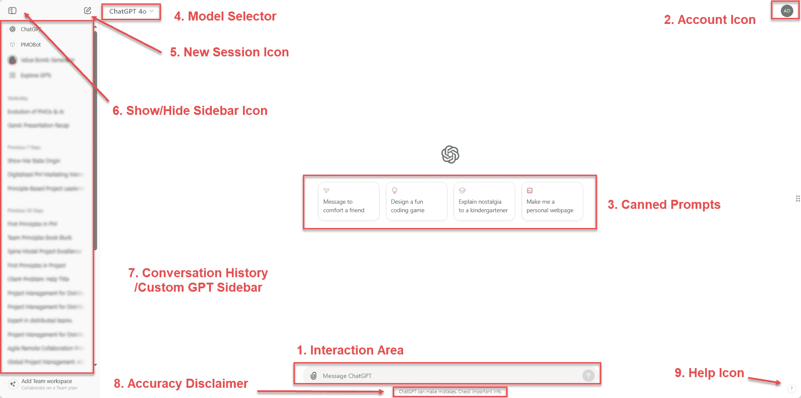

图 19. ChatGPT Plus 版本 UI

ChatGPT Plus UI 的元素：

1.  交互区域：交互区域是用户输入提示以与 ChatGPT 互动的地方。

1.  账户图标：位于右上角的账户图标提供访问用户账户设置和信息。

1.  预设提示：预设提示部分提供了用户可以点击以快速启动与 ChatGPT 交互的预定义问题和任务的选择。

1.  模型选择器：模型选择器允许用户在 ChatGPT 的不同版本之间进行选择，例如 GPT-3.5 和 GPT-4。

1.  新会话图标：新会话图标便于开始与 ChatGPT 的新对话。

1.  显示/隐藏侧边栏图标：显示/隐藏侧边栏图标切换侧边栏的可见性，其中包含导航和附加功能。

1.  对话历史/自定义 GPT 侧边栏：对话历史侧边栏显示与 ChatGPT 的先前交互，使用户能够回顾和参考过去的对话。

1.  准确性免责声明：准确性免责声明是提醒用户，尽管 ChatGPT 功能强大，但可能会出错。

1.  帮助图标：帮助图标提供访问支持资源和文档。

##### 企业 ChatGPT

如其名所示，企业 ChatGPT 是 OpenAI 针对 ChatGPT 多个用户组织的产品提供。

在撰写本文时，我无法访问企业版 ChatGPT，因此无法从经验角度进行评论。但从 OpenAI 的产品描述页面来看，差异主要在于数据安全、用户管理和服务级别。实际的用户界面与 ChatGPT Plus 相同。我不会再详细说明企业版 ChatGPT。如果我有更多经验，或许我会回来更新这个简介。

#### OpenAI 游乐场界面

OpenAI 游乐场是一个基于 Web 的界面，提供了一个用户友好的环境来实验 OpenAI 的语言模型，例如 GPT-4、GPT-4o 及其不可避免的继任者如 GPT-5。它是开发人员、研究人员和专业人员测试和调试他们的对话式 AI 用例、提示和其他应用的宝贵工具。这个游乐场通常是许多用户在将 OpenAI API 集成到他们自己的应用之前接触的第一个点。

因此，您的内部 GPT 模型需要更丰富，例如理解参数功能和三种类型的消息。其余的 Appliance AI 黑盒方法相同。

我不会在这里详细说明 OpenAI 游乐场。但参数在以下图中进行了说明，并在之后进行了更详细的描述。

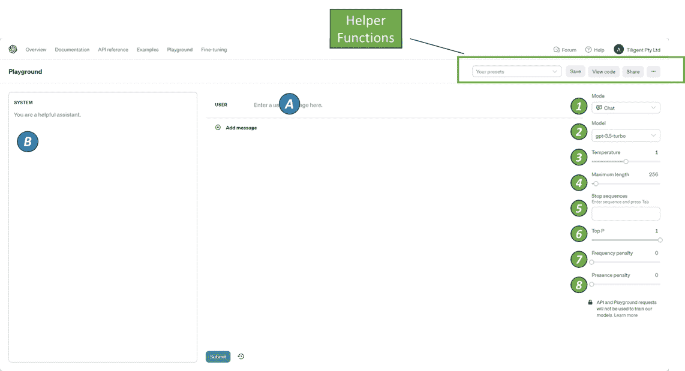

图 20. OpenAI 游乐场用户界面

您可以在两个区域添加要提交给 ChatGPT 进行处理的消息（“完成”）。

1.  用户消息：您提供给模型的输入文本。（也称为“提示”）

1.  系统消息：一个额外的文本输入，用于向模型提交以提供额外上下文的提示。

您可以设置八个（8）参数来控制 GPT 引擎如何处理提示并生成答案：

1.  模式：这是一个遗留参数 - 除非您知道自己在做什么，否则请将其设置为“Chat”。

1.  模型：指定要使用的 GPT 模型（例如，`text-davinci-002`，`text-ada-002`）。

1.  温度：控制模型输出的随机性（范围：0 到 1）。

1.  最大长度：限制模型输出的标记数量。（也称为“max_tokens”）

1.  停止序列：字符字符串，用于停止生成进一步的标记。返回的文本将不包含停止序列。您可以输入多达 4 个停止序列。

1.  TopP：在采样下一个标记之前过滤模型的词汇表。（范围：0 到 1）（也称为“top_p”）

1.  频率惩罚：对频繁出现的标记进行惩罚或奖励。（范围：-2 到 2）

1.  存在惩罚：对新的标记进行惩罚或奖励。（范围：-2 到 2）

在主工作屏幕的右上角也有一些“辅助函数”。

+   预设：您之前保存的上述参数设置和消息的配置。

+   保存按钮：一个保存当前配置命名版本的按钮。

+   查看代码按钮：一个显示当前配置的代码版本并可以复制粘贴到代码编辑器的按钮。

+   分享按钮：允许您与他人共享现有配置。

+   更多功能：三个水平点。目前仅显示一个菜单项，即激活内容过滤器弹出窗口。

OpenAI 游乐场是任何希望将对话式人工智能集成到专业工作流程中的人的关键工具。其用户友好的界面，结合一系列可定制的参数，为提示工程和测试提供了一个有价值的平台，这对于开发高质量对话式界面至关重要。

#### OpenAI API 接口

OpenAI API 接口提供了与 ChatGPT 网页用户界面和应用程序版本相同的程序化集成功能，同时还提供了额外的 API 端点。

OpenAI API 是开发者访问 OpenAI 最先进语言模型的门户。它提供了比游乐场中可用的功能更广泛的程序化访问。文本完成端点是集成对话式人工智能到专业知识工作者活动中的关键。此端点允许开发者利用语言模型的能力，根据提供的提示生成类似人类的文本。

我认为您不需要为 OpenAI API 接口添加比 OpenAI 游乐场接口更多的内容。有一些与 API 编程相关的细微差别，例如身份验证、速率限制、错误消息等，但所需的知识水平大致相同。

文本完成端点是许多涉及对话式人工智能的专业应用的工作马。理解其参数和高级技术可以生成高度定制和有效的输出，使其成为任何在专业环境中撰写或使用高级 ChatGPT 功能的人不可或缺的工具。

#### OpenAI 自定义 GPT 接口

OpenAI 自定义 GPT 接口是一个构建和配置界面，允许您开发和维护自定义 GPT，这些是具有额外提示的 GPT 引擎和 ChatGPT 聊天界面的实例，这些提示塑造了特定用例或应用领域的交互行为。

设计和实现自定义 GPT 虽然表面上非常简单，但涵盖了非常广泛的因素，超出了本书的范围。请搜索 OpenAI 网站获取更多信息。YouTube 上也有一些优秀的教程。

#### 摘要

因此，我们的 ChatGPT 黑盒模型是一个基于概率的文本重复器。我们以简化的人类交互模型与之互动，其中唯一可观察的行为是它重复的文本。话虽如此，我们从 ChatGPT 获得的输出通常非常出色。

如果你采用 ChatGPT 的“黑盒”模型，你将处于更好的位置将其应用于你的知识或实践领域，因为它将你的注意力集中在你可以控制的事情上。

通过关注你可以控制的事情，你将确定你可能需要改进的领域，通过这样做，你将提高从人工智能设备中获得的结果的质量和价值。

### ChatGPT 响应的使用

使用 ChatGPT 的响应是用户控制的一个关键要素，它对与模型交互的有效性和实用性有重大影响。正确管理响应的使用涉及设定适当的使用期望，评估响应的质量和相关性，并在用户的环境中有效地应用响应。

用户期望

设定关于 ChatGPT 能力的现实和有信息量的期望对于最大限度地发挥其响应的作用至关重要。了解模型能做什么和不能做什么有助于用户调整他们的目标并避免失望。

能力意识：用户应该了解 ChatGPT 的优势和局限性。

期望管理：管理期望涉及为用户使用 ChatGPT 旨在实现的目标设定明确的目标。

评估响应

有效地评估 ChatGPT 生成的响应对于确保它们是准确、相关和有用的至关重要。这个过程涉及根据几个标准评估内容。

准确性：检查 ChatGPT 提供的信息的事实正确性。

相关性：确定响应是否与提示和提供的上下文相关。

一致性和清晰性：结构良好且清晰的响应更容易理解和应用。

响应应用

有效地应用 ChatGPT 的响应涉及将它们整合到用户的流程或决策过程中。这一步骤确保响应以有意义和富有成效的方式被使用。

上下文整合：将响应整合到用户工作或项目的特定上下文中。

决策支持：将响应作为决策过程中的支持工具。

逐步改进：参与一个逐步的精炼和改进过程。

结论

有效地使用 ChatGPT 的响应涉及管理用户期望，仔细评估响应的质量和相关性，并在用户的环境中适当地应用它们。这种使用 ChatGPT 响应的战略方法使用户能够有效地利用模型的能力，更高效地实现他们的目标。

## 采用好奇的丰富性

在本节中，我们总结了 ChatGPT“黑盒”思维的第五个组成部分。这个主题在书籍“高级 ChatGPT 应用与操作指南”中的“高级黑盒界面 #5 - 采用好奇的丰富性”章节中有更详细的介绍。[“高级 ChatGPT 应用与操作指南”](https://bjl.ink/GptAP)。

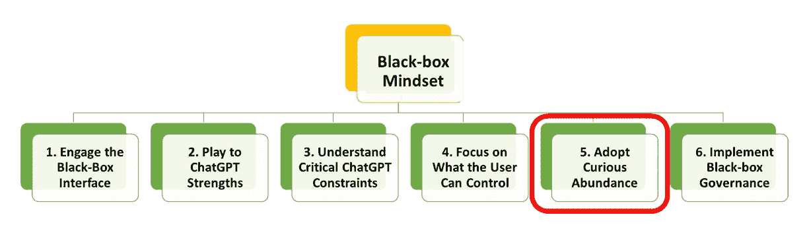

图 21. 黑盒思维 #5

采用好奇丰富的思维模式是有效使用 ChatGPT 的关键。这种思维模式结合了好奇心、独立性、理性、信心和乐观。具有好奇丰富思维模式的使用者更能装备自己探索 ChatGPT 的功能，批判性地评估其输出，并在模型的应用中创新。这种积极主动和积极的方法导致更有意义和更富有成效的互动。

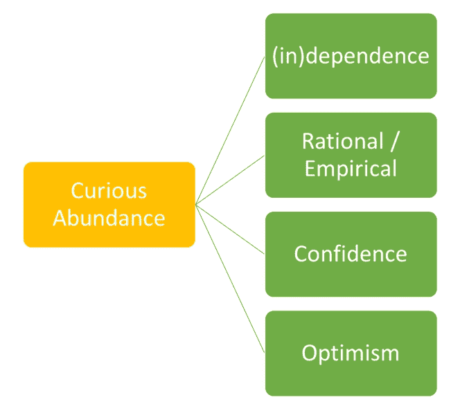

图 22. GPT 好奇丰富 - 摘要

(独立/依赖)

独立和依赖的平衡对于有效地与 ChatGPT 互动至关重要。用户应成为独立思考者，将模型作为工具而不是拐杖来依赖。

自信：用户应将 ChatGPT 视为决策过程中的辅助工具，而不是真理的唯一来源。批判性思维：与 ChatGPT 提供的信息进行批判性思考是必要的。协作使用：独立并不意味着孤立。

理性/经验

理性和经验的心态对于明智和逻辑地使用 ChatGPT 的功能至关重要。这包括基于证据和理性做出决策和行动。

基于证据的方法：在与 ChatGPT 互动时，用户应优先考虑证据和经验数据。逻辑分析：理性要求用户对收到的回应进行逻辑分析。客观性：保持客观是关键。

信心

使用 ChatGPT 的信心对于最大化其潜力是必要的。这种信心来自于理解模型的能力和限制，并在这些界限内自信地使用它。

明智的保证：信心应基于对 ChatGPT 的优势和劣势的全面理解。决断的互动：自信的用户与 ChatGPT 进行决断性的互动，提出清晰和有目的的问题。弹性：信心还涉及面对错误或次优响应时的弹性。

乐观

对 ChatGPT 可能性的乐观促进了对其使用的积极和积极主动的方法。乐观的用户更有可能探索和创新，推动模型能做的事情的边界。

积极预期：乐观的用户期望从与 ChatGPT 的互动中获得积极的结果。创新探索：乐观激发创新。建设性态度：乐观的心态鼓励对挑战和挫折采取建设性的态度。

结论

好奇丰富是用户与 ChatGPT 互动的理想心态。这种心态不仅提高了响应的质量和相关性，而且培养了一种富有成效和创新的方法来使用 ChatGPT，解锁其作为各种应用的有力工具的完整潜力。

## 采用黑盒治理

在本节中，我们总结了 ChatGPT“黑盒”思维的第六个组成部分。这个主题在书籍“高级 ChatGPT 应用与操作指南”的章节“高级黑盒接口 #6 - 实施黑盒治理”中有更详细的介绍。[“Advanced ChatGPT Application and Operations Guide”](https://bjl.ink/GptAP)。

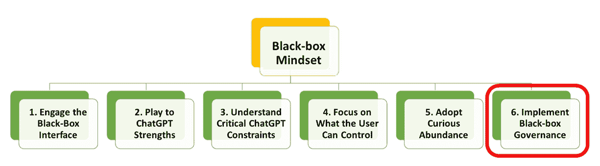

图 23. 黑盒思维 #6

ChatGPT 在组织中的部署带来了显著的好处，但也引入了需要谨慎治理的复杂性。“黑盒治理”指的是管理 ChatGPT 使用的一种结构化方法，确保其应用透明、道德，并与组织政策和标准一致。本章探讨了黑盒治理的关键组成部分，包括供应商知识、审计责任、披露和引用以及结果的质量和使用。下面的图提供了这些组件的详细分解。

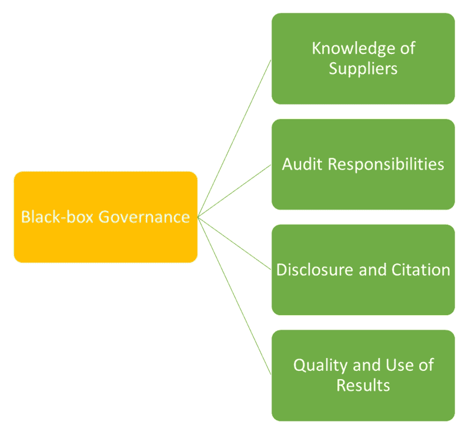

图 24. GPT 黑盒治理 - 摘要

供应商知识

理解供应商及其技术管理政策是有效治理的基础。这包括对数据共享、版权和安全政策的了解。

数据共享政策：组织必须了解 ChatGPT 供应商如何处理和共享他们的数据。版权政策：了解与 ChatGPT 生成内容相关的版权政策至关重要。安全政策：了解 ChatGPT 供应商实施的安全措施对于保护组织数据至关重要。

审计责任

为了保持问责制和透明度，组织需要强大的审计机制。这包括跟踪、理解和解释 ChatGPT 的使用和结果。

理解和可解释性：组织应努力理解 ChatGPT 生成响应的方式，并能够向利益相关者解释这些过程。审计跟踪：实施与 ChatGPT 交互的审计跟踪是必要的。其他：其他审计责任可能包括定期审查 ChatGPT 的使用情况。

披露和引用

ChatGPT 使用的透明度至关重要。这包括在内容创作中完全披露 AI 的参与，以及正确引用来源和贡献。

完全披露：组织应披露何时以及如何使用 ChatGPT，特别是在内容创作方面。如何解释：提供关于 ChatGPT 能力和限制的明确解释是必要的。如何引用：建立引用 ChatGPT 贡献的指南确保 AI 生成内容的使用得到适当认可和可追溯。

结果的质量和使用

确保 ChatGPT 输出的质量和适当使用涉及验证、验证和解决潜在风险，如注入和错误。

验证：组织在使用 ChatGPT 的响应进行决策过程之前，应验证其准确性和可靠性。验证：应建立验证流程，以评估 ChatGPT 输出的相关性和适用性。注入：组织需要意识到并减轻与数据注入攻击相关的风险。错误：建立识别和纠正 ChatGPT 响应中错误的协议至关重要。

结论

黑盒治理是一个全面的管理框架，用于管理组织内 ChatGPT 的使用。通过关注供应商的知识、审计责任、披露和引用以及结果的质量和使用，组织可以确保其使用 ChatGPT 是透明的、道德的，并与他们的战略目标一致。这种方法增强了人工智能应用的信任和可靠性，并使组织能够负责任和有效地利用 ChatGPT 的能力。

# 与 ChatGPT 交互

## 有机提示

本节总结了被称为“有机提示”的 ChatGPT 交互方法。这种方法与关注结果和影响而不是技术和交付的战略思维模式相一致。

与本书的主要论点保持一致，有机提示从简单性和问题“我能去掉什么以达到完美？”开始。

取对你有用的，忽略其余的。

但是，我已能听到人们问：“那 Prompt Engineering 怎么办？”所以，让我们首先解决这个问题。

### 为什么不直接从 Prompt Engineering 开始？

我假设你已经阅读过关于 ChatGPT 的文章或讨论。在这种情况下，你可能已经看到了对“Prompt Engineering”的引用，这是一个定义不严格的实践，它定义了为像 ChatGPT 这样的“聊天机器人”创建提示的规则和技术。

我对 Prompt Engineering 作为一种知识体系没有异议。就个人而言，我对各种提示类型及其工作原理非常感兴趣。

“Prompt Engineering”是从与较老的人工智能系统自然语言界面的漫长历史中产生的。从 Prompt Engineering 中可以获益良多，但它不是一种正式的实践，而且“Engineering”这个词有点过度夸张。在我长期的信息技术领域经验中，我看到了许多新兴实践被贴上“Engineering”的标签，以给人留下某种正式化、组织化和统一的印象。

意图是有的，但我总是担心那些只关注“是什么”和“怎么做”的建议，而不是“为什么”。

如果我们过于关注像 ChatGPT 这样的语言模型在提示制作中的技术，我们可能会忘记我们最初为什么要这样做。

“黑盒思维”的全部意义在于引导人们思考他们通过使用 ChatGPT 试图实现的目标，而不是它的工作原理。尽管提示是现实世界与 ChatGPT 之间的外部接口，但提示工程向用户揭示了其内部运作和能力。

用户经常使用过于技术化和规定性的提示来微观管理 ChatGPT。通过过度指定提示，用户无意中限制了模型生成创造性和有效输出的潜力。

你应该假设你放入提示中的每一件事都被 ChatGPT 用作生成响应的内容——参见章节“浅入 GPT 功能”。

在某些情况下，无疑需要更复杂的提示。但要从简单开始，根据需要逐步扩展。

### 有机提示的基础

ChatGPT 的“有机提示”的基础是简化用户与工具之间的交互。它侧重于清晰、以上下文驱动的提示，这些提示捕捉到预期的结果，而不是过程的细节。

用户可访问性：有机提示降低了非技术用户或可能不擅长构建复杂提示（目前）的普通用户进入的门槛。

效率：通过关注结果，用户可以快速有效地传达他们的需求，这可能导致更快、更相关的响应。

结果质量：它鼓励 LLM 生成与用户最终目标一致的响应，这可能会提高输出的可用性和适用性。

鼓励战略思考：有机提示鼓励用户思考的不仅仅是响应的即时生成，而是关于信息提供的战略使用。

灵活性：有机提示允许 AI 拥有更多的创造性自由，从其庞大的训练数据中提取信息以提供答案，通常导致更创新和全面的解决方案。设计的一个好规则是，一个好的设计比一个坏的设计更容易改变，这一点同样适用于提示。

可扩展性：有机提示允许用户从最简单的阶段开始，并根据他们的需求和情况顺利地进展。简单的事情容易做，但困难的事情也是可能的。从有机提示到其他提示框架，再到最终的提示工程，已经自然地发展了。

### 有机提示的原则

有机提示基于这样的前提：提示不需要复杂性；它们需要清晰性和上下文。提示应该是可执行的。有机提示认为，用户是 ChatGPT 响应有用性的唯一评判者。

出现性很棒

开始吧！然后，看看会发生什么。最好的提示来自于迭代交互。避免认为你需要“一次就做对一切”。将所有内容通过模型运行，并观察结果。

可接受性是唯一的质量

唯一的质量衡量标准是 ChatGPT 的结果是否在你特定的问题和情况下可以接受。

你并不总能得到你想要的东西，但有时你得到你需要的东西。

简单至上（并且始终如此）

最大化未完成工作量的艺术是至关重要的。清晰的提示是有效与 ChatGPT 沟通的基石。问问自己：“我能去掉什么内容，仍然得到相同或更好的结果？”

自然语言最佳

描述你想要的内容尽可能自然。使用直接的语言与 ChatGPT 沟通，但不要过分纠结或花费时间在 ChatGPT 之外撰写多个草稿。让模型施展魔法！像向同事或家庭成员解释事情一样编写你的提示。

启用指南流程

尽可能自然地描述你想要通过交互实现的内容。使用直接的语言与 ChatGPT 沟通，但不要过分纠结或花费时间在 ChatGPT 之外撰写多个草稿。让模型施展魔法！像向同事或家庭成员解释事情一样编写你的提示。

除非你发现不达到这一层面的细节就无法得到可接受的结果，否则不要描述步骤或 ChatGPT 应该如何解决问题。

上下文至关重要

提供上下文使 ChatGPT 能够理解提示的意图。上下文界定问题空间，而不规定解决方案的具体方法。

上下文的一个要素是你希望 ChatGPT 扮演的角色。

“通过使用 ChatGPT，我将能够……在某个主题或问题领域。”

“通过 ChatGPT 生成的信息，我将能够……在某个主题或问题领域。”

理解：了解一个主题的关键概念和原则，并阐述相似之处、不同之处和挑战。

应用：实施实用技术和工具。

分析：批判性地评估情况，并产生总结或根本原因，或提出额外的澄清问题**。**

评估：评估不同选项的有效性和实用性，并做出选择或决定。

创建：设计和撰写新的作品，如文章、艺术品、计划或数据表。

记住：回忆和引用基本原理、最佳实践、事实和观点。

### 有机提示的示例

假设你正在撰写一篇硕士论文，并需要某个特定主题的信息。

你可以深入到非常具体的细节，以表达你的担忧

“就当前立法如何影响小型太阳能发电的采用撰写 500 字的文章。清晰简洁地写作，避免 AI 检测。包括信息来源的引用，并包含多个引语。包括一个包含 APA 第 7 版格式中引用详细信息的“参考文献”列表。”

这种提示形式非常常见，起源于用户认为他们必须指定 ChatGPT 如何执行任务的想法。用户正在将他们对问题领域的知识投射到 ChatGPT 上，认为这些规则和约束很重要。我相信这位用户会得到一些结果。试着把它粘贴到 ChatGPT 上，看看你会得到什么。

这里有一个替代方法，遵循有机提示的原则。与其给出像“避免 AI 检测”这样的具体指令，不如通过陈述期望的结果来重构你的提示。

“我正在为[大学名称]的硕士学位论文撰写关于可再生能源政策的学术论文。我需要了解当前立法如何影响小型太阳能发电的采用。”

这是你能想象到的最简单的提示。它清楚地定义了信息的目的、背景和预期用途，使 ChatGPT 能够生成符合你需求的响应。提及大学名称为 ChatGPT 使用与硕士论文相关的任何信息（或类似机构的信息）打开了大门，包括剽窃和引用要求。

如果你得到了你需要的成果，那么你就完成了，可以继续下一个任务。如果你没有得到你想要的成果，那么你可以稍微扩展以下内容

“我正在为[大学名称]的硕士学位论文撰写关于可再生能源政策的学术论文。我需要了解当前立法如何影响小型太阳能发电的采用。包括来源引用和参考文献列表。确保信息针对学术受众，提供足够的细节，并且响应符合普遍接受的学术剽窃禁止规定。”

在某些情况下，你会使用完整的提示，而在其他情况下，由于提示-响应周期的演变性质，你可能需要将其拆分。

### 有机提示“微调”

在有机提示的背景下，一个微妙的建议被嵌入到提示中，以引导 ChatGPT 向期望的结果发展。这与行为科学中的微调类似，这些短语以可预测的方式影响 AI 的行为，而不限制其选项或强迫特定响应。微调温和地引导 AI，使其更有可能提供有用的答案，同时保持其响应的灵活性和创造性。

#### 高影响力微调

这里有一些高影响力的话语，你可以将其包含在你的有机提示中，作为微调来影响交互流程或结果。

控制流程

这个陈述在你准备好之前阻止了 ChatGPT 的回复。通常在我提问或布置任务之前，我会提供一系列输入提示。我通常在一个提示中定义关系和角色。然后在一个或多个提示中提供输入数据，然后我会提出一系列问题。在提供不需要更多回应的输入的每个循环中，我会使用以下短语。

“请在我给你一个具体任务或提出一个具体问题之前不要回复”

我更喜欢以原始形式生成我的输出，这样我就可以复制到其他应用程序。当然，你可以选择文本回复并将其复制到像 Word 这样的办公应用程序。但如果你想要更精细的控制，请以标记格式（XML、HTML）、Markdown 格式（Markdown）或数据格式（CSV）生成它，然后点击代码窗口顶部的“复制”链接。

“请在一个代码窗口中生成你的回复，这样我可以轻松地将结果复制到其他应用程序”

#### 低影响力暗示

我几乎每天都在提示中看到许多人们添加的陈述，因为他们认为这会“告诉”ChatGPT 以某种方式行事。再次强调，如果你发现这些对你有效，请继续使用它们。有时，它们只是用户为了跟踪早期提示中的问题或缓解紧张和挫败感的“糖衣”。

请参阅关于 GPT 弱点的相关章节。

激发情感

这些陈述假设 GPT 引擎内部存在某种情感能力，能够对情感色彩做出反应。

“尽力而为”

“不要愚蠢”

“你为什么这样对我？”

激发智力

这些陈述假设 GPT 引擎内部存在某种智力，可以通过给出明确陈述来控制。

“严谨准确”

“不要抄袭”

“尽力而为”

“说实话，不要撒谎”

语言形状或形式

这些陈述假设 ChatGPT 可以像我们一样监控其语言生产：页面、单词、长内容、短内容。我在“长篇”方面取得了一些成功，但 GPT 环境的可变性远远超过了这些短语带来的任何提升。

“生成 500 个单词”

“写一篇文章”

结论

就像任何关于 ChatGPT 提示的建议一样，请根据你具体的情况做你认为有效的事情。我可以给你我的建议，但“对你有效”总是胜过“别人认为有效”。

如果你专注于你试图实现的目标，你工作的上下文，以及创造尽可能简单的语言，那么你就在有机提示方面做得很好。

### 何时有机提示不是正确的方法？

有机提示的目的在于帮助早期用户可靠地开始提示，并帮助他们跨越我在第“跨越技能启动鸿沟”部分描述的技能启动鸿沟。我并不是把它作为一个普遍的过程来提出，除非，当然，它对你有效。

不是万能的银弹

有机提示并非“万能钥匙”。它不是每个用户在每个情况下都通用的解决方案。许多场景需要更复杂和技术的提示。有机提示建议我们只在需要时开始和扩大规模。

我们如何知道何时需要扩大规模？

有机提示基于关键策略、问题和用户假设。如果你的独特情况违反了这些假设中的任何一个，你可能已经达到了有机提示的极限。在这些情况下，有简单的补救措施来构建你的提示以实现你需要的结果。

假设：

这是有机提示的另一个原则：最好的提示是从

AI 解释是足够的：它假设 ChatGPT 可以从上下文中准确推断意图，这并不总是可靠的，可能导致用户期望与 AI 输出之间的潜在不匹配。

提示是明确的：虽然简单是有益的，但指导不足可能导致模糊的提示，导致同样模糊或广泛的输出。

提示不是低规格：用户可能会省略关键细节以保持提示结果集中，导致结果不可操作或不够详细，无法满足用户的需求。

效果可以评估：建立指标来衡量此类提示相对于更传统的、以输入为重点的提示的有效性可能具有挑战性。

结论

有机提示在 ChatGPT 的某些交互中很有用。这个子集与非常早期用户的需要高度重叠，因此对于刚开始的人来说是一个有用的策略。有机提示的美丽之处在于它是一个自我解决的疑问：如果它有效，就继续使用它，但如果它不起作用，就转向不同的方法。这可能是一个高级水平的有机提示，如下文所述，或者可能是早期阶段的提示工程。

## 与高级有机提示一起成长

本节描述了一些更高级的有机提示方法，当用户技能增长或问题变得更加复杂时，他们可能会发现这些方法很有用。

### 满足即满意

哪个更好：通过多次提示/响应循环来得到一个比第一次略好一些的结果，还是将不完美的第一次响应手动编辑以使其可接受？

只有你自己才能判断——没有正确答案。但我们都无法像我们希望的那样有足够的时间去处理一个问题，而且 ChatGPT 有很多不足之处。所以，总的来说，我知道我的想法是什么。

这一切都取决于你的情况。

我看到很多关于提示和提示结构的问题，这些问题似乎基于“提示焦虑”或“ChatGPT 焦虑”，即除非我们使用特殊的技术、技巧或“巫术短语”，否则就会错过 GPT 引擎中独特和特别的东西的“恐惧”。“巫术短语”是你看到在 Facebook 广告或视频中告诉你关于将“永远改变你的生活”的最新事物的那些，比如“不要闲聊”。

虽然我们都希望从 ChatGPT 中获得最大利益，但这种想法存在两个缺陷：

1.  它假设存在一些特殊的技巧、窍门或“巫术词汇”，这些词汇能够神奇地改变回应。

1.  ChatGPT 没有使用上面提到的#1 中提到的事物，却在保留专家级内容。这种想法认为，ChatGPT 内部隐藏着一个“金矿”，这将使用户看起来像世界级专家。

对于这一点，我有三点要说：

1.  我们永远无法真正了解 ChatGPT 可以变得多么详细或专家级，但它的训练并没有涵盖每个主题的每一块信息。

1.  ChatGPT 的结果更有可能达到中等水平的胜任，而不是世界级专家的水平。

1.  虽然可能会有一些捷径，但我们将自己的思考更多地注入 ChatGPT 对话中，我们对我们特定情况中的内容掌握得就会越好。

忘掉“恐惧错过”（FOMO）——开始专注于你自己的经验。

## 有机规划

当我提到“有机规划”时，我指的是由人类大脑内置的认知能力驱动的自然规划状态。每个人都会执行一种称为“实用展望”的活动，如果你去掉学术术语，这意味着如果你思考一个目标，你的大脑会自然地开始思考实现该目标的过程。

有机规划还指的是规划框架的自然扩展，例如计划、框架甚至方法，根据你的情况需要，你可以添加这些内容。有机规划的对立面是在一开始就尝试采用一个框架，如果这个框架对你的知识和经验来说过于先进，或者与你的环境不匹配，这可能会引起各种问题。

因此，有机规划从你大脑的能力开始，并以“即时”的方式添加额外的支持。

你可以在《公理 # 121. 敏捷思维中的所有内容都源自四个基本原则》中了解更多关于“实用展望”的内容，以及更多关于管理过程扩展的内容在《公理 # 96. 方法论悖论》中，这两部分内容都收录在书籍《项目管理公理》[“Axioms of Project Management”](https://bjl.ink/pmaxioms)中。

### 基本与 ChatGPT 的交互

如果你是一个非常新的用户，你可能对与 ChatGPT 的交互有一个简单的想法，那就是围绕这一点：你与 ChatGPT 的交互，如下所示。你只是提出想法，并以文本（可能附带一些数据）的形式将其推入 ChatGPT，并获取结果。

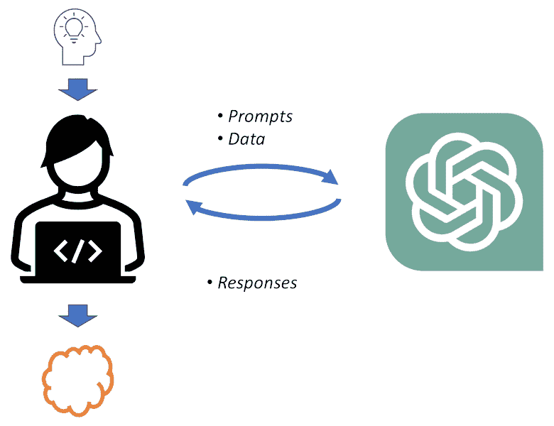

图 25. 基本 ChatGPT 交互

随着你逐渐积累更多经验，你将开始意识到，仅凭你的想法对于大多数用例来说是不够的，你需要做以下一项或两项：

1.  获取一些数据：你需要从你的操作环境中获取一些数据，这些数据将输入到 ChatGPT 中。这可能是一些上下文信息，提示的主题（例如，“审查这篇文章”），或者用于转换（例如，“分析这些数据”或“总结这份文档”）。

1.  使用响应：一旦你从 ChatGPT 获得响应，你打算如何处理它们？它们只是供你个人消费吗？或者你需要将它们分发给其他人？或者加载到另一个系统中？

这个交互周期会变成以下的样子。它仍然相当随意，但至少你在考虑选项。

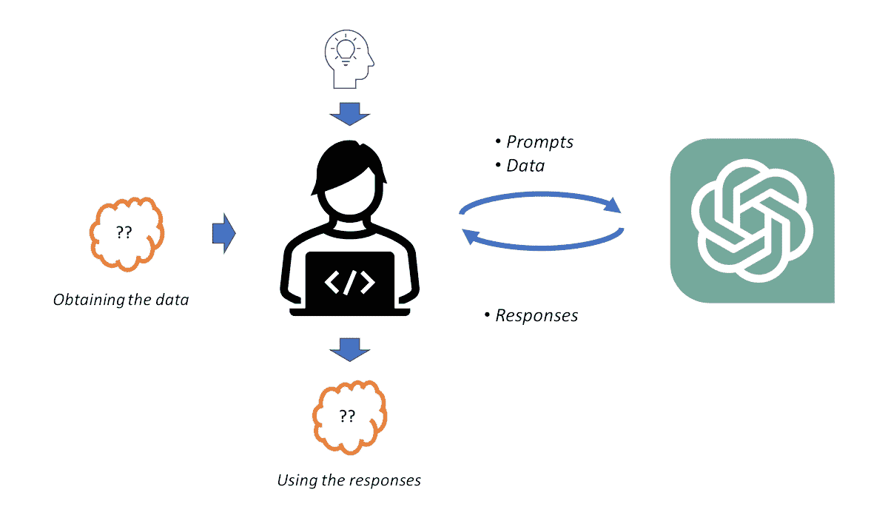

图 26. 扩展 ChatGPT 交互

### 从交互到 I-P-O

一旦你开始对 ChatGPT 有更多经验，你将开始扩展你希望在处理中包含的使用案例。这就是我们需要稍微更有结构化的地方。

每一次与 ChatGPT 的交互都涉及一个基本模式，无论你的问题领域、目标或你希望 ChatGPT 扮演的角色如何。

在流程术语中，我们称之为“IPO”模式（“输入-处理-输出”）。这是一个非常常见的流程模式，也容易理解。在 ChatGPT 的情况下（在“黑盒思维”中），我们主要关注“输入”和“输出”阶段。“处理”阶段是 ChatGPT 的“黑盒”。

图 27. 简单 I-P-O 概念

但这个“I-P-O”过程模式过于通用。一旦我们开始思考如何在更复杂的使用案例中实际使用 ChatGPT，我们需要根据下面的图表分解出一些子阶段。

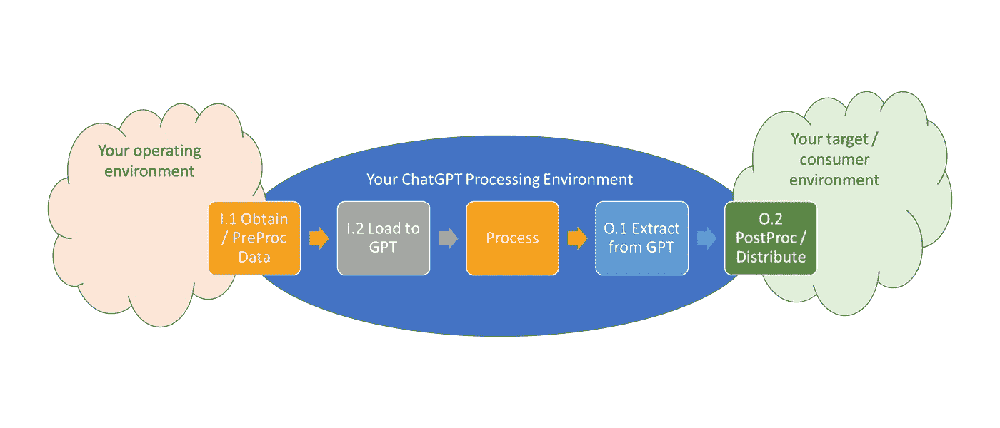

图 28. 上下文中的扩展 IPO 模型

这个模式由以下组件组成：

1.  你的操作环境：你工作或玩耍或与你的 ChatGPT 使用案例相关的地方。

1.  你的目标/消费者环境：你的“客户”生活和工作的地方。如果你有任何人员或团队接收你从 ChatGPT 响应中获得的信息，他们就在这里。

1.  I.1 获取/预处理数据：“输入”阶段的第一部分，其中你获取将提供给 ChatGPT 的数据并执行任何预处理函数，例如格式转换。这一步可能包括在 ChatGPT 之外发生的任何数据转换。

1.  I.2 加载到 GPT：这一步（“输入”阶段的第二部分）仅仅是把数据加载到 GPT 或提供链接。这个上传的技术机制选项有限，你可以在“ChatGPT 产品交互”部分简要了解，而主要的交互模式总结在“ChatGPT 提示和数据使用案例”部分。

1.  处理：这是你在向 ChatGPT 提交提示并得到响应之间发生的事情。

1.  O.1 从 ChatGPT 中提取：这一步（“输出”阶段的第一个部分）涉及您从 ChatGPT 获取数据。与上面的步骤“I.2”一样，此过程的技术选项有限。

1.  O.2 后处理/分发；这一步（“输出”阶段的第二部分）有子步骤。首先，执行任何必要的后处理，以将 ChatGPT 的输出转换为您的“目标/消费者环境”所需的格式。其次，将此数据分发给您的消费者。这可能意味着将数据加载到另一个系统，或者简单地将文件附加到电子邮件中。

虽然这听起来可能有些复杂，但除了简单和个人用例之外，任何需要考虑这些因素的情况都需要明确地考虑。

## 深入了解 GPT 功能

当我们保持一种“黑盒心态”，避免关注 ChatGPT 的内部操作时，重要的是要解决一些关于 ChatGPT 工作原理的现有概念。我们无法改变过去，不幸的是，世界上存在许多误解和神话，我们必须纠正。

### 关于 GPT 操作的某些（并非不合理）神话

关于 GPT AI 引擎的内部操作存在许多误解。正如我们在“黑盒心态”中提到的，我们坚持认为您不需要了解内部操作，这是我们认为这样做的理由之一。

但将某物视为“黑盒”，并期望人们永远不要思考内部发生的事情是不合理的——也是徒劳的。

黑盒接口：

首先，让我们简要回顾一下下面的简单“黑盒接口”，如图所示。根据我们认为内部发生的情况，我们对响应的期望，以及我们对质量的判断，会有所不同。

图 29. ChatGPT 最简单的黑盒接口

#### 常见（但错误）的期望

数据库期望

用户普遍持有的一个常见期望是将 GPT 视为数据库，如下所示。

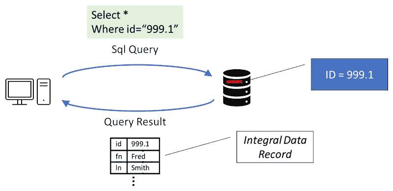

图 30. 数据库期望（数据 + 确定性响应）

数据库显然包含数据，以正式的结构。当我们发出查询时，我们期望得到可预测和可重复的响应。在图中，每次我们查询 ID=“999.1”时，我们期望得到一个完整、高完整性的响应，其中包含我们请求的所有与 id“999.1”相关的数据。数据可能与我们上次执行查询时不同，但这只是因为数据库中的数据发生了变化，可能是某种形式的控制。数据是权威的。

API 期望

同样，如果我们发起 API 调用，我们期望结果与 API 规范一致。

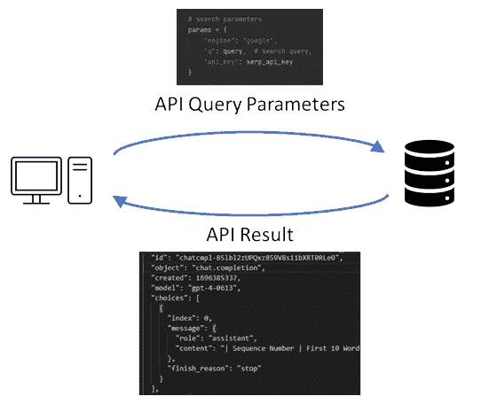

图 31. API 期望（数据 + 确定性响应）

Web 服务器期望

类似地，在万维网上，使用 Http 协议的“GET”命令会在 URL 正确的情况下返回特定的资源。

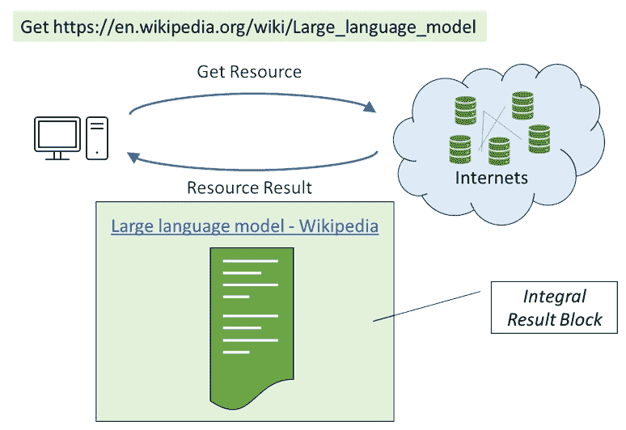

图 32. HTTP GET 期望（数据 + 确定性响应）

在这三个用例中，我们查询的数据都存储在目标位置（数据库、API 服务器或 Web 服务器）。查询过程是使用我们使用的任何协议来获取数据的副本。

这是一个简单易懂的概念，我们中的许多人每天都在接触到这种类型的查询。

ChatGPT neither uses the API nor the HTTP pattern to generate responses.

#### GPT 生成响应的简化视图

因此，我们已经探讨了某些常见的期望，这些期望并不是 GPT 生成响应的方式。让我们看看一个“简单”的等效示例，它展示了 GPT 是如何生成其响应的。ChatGPT 的情况（特别是 ChatGPT 下方的 GPT AI 模型）是截然不同的。

GPT 中存储的只是一些词汇关联概率——与黑盒思维一致，我们就到此为止。如果你真的想深入了解，可以查看书中附录“高级 GPT 内部操作”——《高级 ChatGPT 应用入门》。

让我们想象一个情况，其中英语中的每一个单词都有一个概率链接，连接到语言中的每一个其他单词。

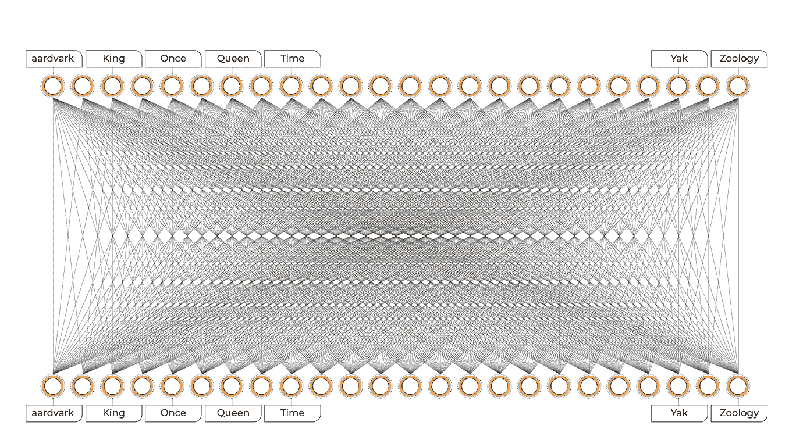

图 33. 虚构的词汇概率模型

虽然听起来很复杂，但它远不如 GPT 的词汇关联概率网络复杂。

现在，我们在响应中看到的“数据”是由 GPT 根据我们提示中的词汇和数据的复杂混合以及 GPT 网络中的概率网络即时生成的。

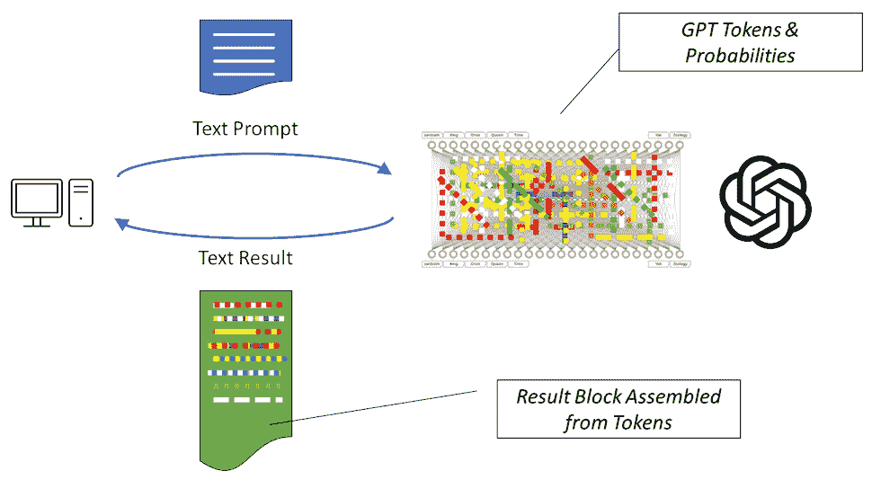

图 34. 混合词汇的 GPT 响应

所以，那些小小的彩色点代表的是坐在概率网络中的标记，GPT 根据你的提示和输入数据，即时地决定如何将它们组装起来呈现给你。

它的工作原理真的很神奇。正如我提到的，它远比想象的复杂，但有两个关键点需要记住：

1.  无持久数据：GPT 不是以类似维基百科按页面逐页的方式检索存储的事实或文本块。

1.  非确定性：GPT 应用了令人难以置信数量的概率因素——其中一些在大量维度上——来组装响应，因此你不太可能得到两次相同的响应。根据你对提示或上下文数据的更改，你可能会得到高度不同的响应。

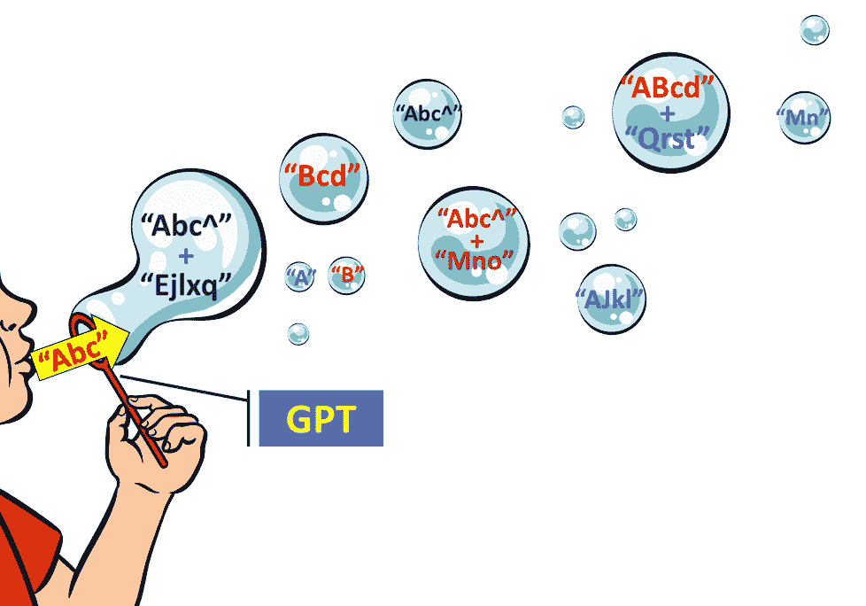

图 35. GPT 响应可能变化

### 结论

对于 ChatGPT 生成响应的功能模型并不破坏“黑盒”模型——它消除了会破坏黑盒模型的误解。

## 集中于用户可控方面的实用建议

尽管 ChatGPT 具有黑盒性质，但用户对其与模型互动的控制力很大。通过关注这些可控元素，用户可以优化他们的互动并从 ChatGPT 中获得最大价值。以下是基于此组件的实用“这样做…”和“不要这样做…”建议。

### 做这件事：

1.  定义明确目标：

    +   目的：明确你希望通过 ChatGPT 实现的目标，以指导你的互动。

    +   示例：“设定 SMART 目标，例如‘到今天结束时生成一篇关于可再生能源趋势的 500 字文章。’”

1.  选择相关问题：

    +   目的：确定 ChatGPT 可以最有效应用的特定问题或任务。

    +   示例：“使用 ChatGPT 起草电子邮件、创建摘要或生成内容想法。”

1.  制定操作策略：

    +   目的：系统地规划如何将 ChatGPT 集成到你的工作流程中。

    +   示例：“制定一个包括实施、监控和风险管理的 ChatGPT 内容创作使用步骤计划。”

1.  使用具体和上下文相关的提示：

    +   目的：制定详细且与主题相关的提示以获得更准确的回应。

    +   示例：“与其说‘解释营销’，不如说‘解释社交媒体营销对小企业的益处。’”

1.  迭代和细化互动：

    +   目的：通过根据初始输出细化提示来持续提高响应质量。

    +   示例：“如果回应过于模糊，请添加更多细节或重新措辞提示以获得更好的答案。”

1.  验证信息：

    +   目的：确保 ChatGPT 提供信息的准确性和可靠性。

    +   示例：“将 ChatGPT 的事实和数据与可信来源交叉核对，特别是对于关键或敏感任务。”

1.  管理用户期望：

    +   目的：设定关于 ChatGPT 能力和限制的现实期望。

    +   示例：“理解虽然 ChatGPT 可以生成有用的内容，但它并非完美无缺，可能需要人工审查和编辑。”

1.  利用领域专业知识：

    +   目的：通过领域特定专家的见解补充 ChatGPT 的输出，以增强质量和准确性。

    +   示例：“使用 ChatGPT 生成初步想法或草案，然后由主题专家进行审查。”

### 不要这样做：

1.  假设 ChatGPT 无限准确：

    +   风险：相信 ChatGPT 的回应总是正确可能导致错误信息。

    +   替代方案：始终独立验证关键信息。

1.  使用模糊提示：

    +   风险：模糊的提示可能导致无关或不切题的回应。

    +   替代方案：提供清晰和详细的提示以有效引导 ChatGPT。

1.  期待深度理解：

    +   风险：ChatGPT 没有真正的语义理解或情感智能。

    +   替代方案：使用 ChatGPT 处理需要语言处理而非深度上下文理解的任务。

1.  过度依赖 ChatGPT 做出关键决策：

    +   风险：ChatGPT 可能无法提供高风险决策所需的深度分析。

    +   替代方案：将 ChatGPT 作为辅助工具使用，并在做出关键决策时咨询人类专家。

1.  忽视对人类监督的需求：

    +   风险：ChatGPT 的输出可能需要改进和验证。

    +   替代方案：始终审查和编辑 ChatGPT 的回复，以确保它们符合你的标准。

1.  期望一致的回复：

    +   风险：即使使用相同的提示，ChatGPT 的回复也可能会有所不同。

    +   替代方案：进行多次迭代并选择最合适的回复。

1.  将 ChatGPT 视为有感知的：

    +   风险：假设 ChatGPT 具有类似人类的理解可能导致错误的信任。

    +   替代方案：记住 ChatGPT 是根据数据中的模式生成回复，而不是真正的理解。

1.  忽视知识范围限制：

    +   风险：ChatGPT 的知识仅限于其训练数据，可能不是最新的。

    +   替代方案：意识到模型的训练截止日期，并验证任何来自可靠来源的最新信息。

### 结论

通过关注用户可以控制的内容，例如设定明确的目标、选择相关的问题、制定操作策略和管理期望，与 ChatGPT 的互动可以被优化。这些实用的做法和禁忌提供了一个框架，以利用 ChatGPT 的优势同时减轻潜在的缺点，确保用户从与 AI 工具的互动中获得最大价值。

## 迷思、错误和偏见

有三个主要迷思或偏见会严重影响你与 ChatGPT 互动的能力并使其得到最佳利用。这些是：

1.  人格化 ChatGPT

1.  认为 ChatGPT 在产生幻觉

1.  认为 ChatGPT 在对你撒谎

这些是同一根本原因问题的不同方面：对 ChatGPT 或任何可能遇到的类似对话 AI 工具的架构、操作和能力缺乏理解。

### 人格化

人格化是将人类的特质、情感、意图或特征归因于非人类实体、物体或现象。这通常指的是将软件、机器人和人工智能视为具有类似人类的情感、思维或意图。

人格化在工作环境中可能产生三种影响：

1.  对 AI 的认知：与 ChatGPT 或类似 AI 模型合作的人可能会将类似人类的特征归因于 AI 系统。这可能会以相信 AI 系统有偏好、情感或偏见等方式表现出来。

1.  协作动态：将 ChatGPT 等 AI 工具人格化可能会影响团队的动态。如果团队成员将 AI 系统视为另一位“团队成员”，他们可能会过度信任或依赖其输出，忘记 AI 系统是基于数据和算法运作而没有真正的意识。

1.  伦理考量：随着 AI 变得更加先进并融入工作实践，需要解决人格化的伦理影响。误解 AI 系统的能力或角色可能导致不适当的期望和潜在的滥用。

在实施 ChatGPT 时，了解模型的能力和限制对于自己和同事来说至关重要。认识到 AI 系统没有情感、意识或固有的偏见，有助于：

+   为 AI 系统的角色设定合理的期望。

+   避免在没有人监督的情况下过度依赖 AI 系统做出关键决策。

+   认识到人类直觉、经验和协作决策的重要性。

通过对 ChatGPT 等 AI 工具有清晰的理解并设定界限，你可以利用 AI 系统的能力，同时避免陷入拟人化的陷阱。

### AI 系统中的幻觉

AI 系统中的幻觉指的是 AI 模型产生不基于其训练数据或在一个特定语境中几乎无意义的输出。本质上，AI 系统“幻觉”了未明确提供或内在于输入的信息。

在 AI 应用场景中，幻觉可能产生三种影响：

1.  信息准确性：在大多数工作环境中，准确性和及时的信息至关重要。如果 ChatGPT 或其他 AI 模型产生幻觉，可能会导致错误的决策或信息不明的利益相关者。

1.  项目可预测性：在依赖于迭代周期和反馈循环的环境中，幻觉数据或见解可能会破坏这个循环，导致不可预测或不受欢迎的结果。

1.  利益相关者沟通：在与利益相关者沟通时，展示可能包含幻觉元素的 AI 生成的见解可能会侵蚀对技术的信任和信心。

认识到 AI 幻觉的潜在可能性，并建立验证和交叉检查 AI 生成见解的机制。AI 用户可以：

+   使用多个数据来源或工具来证实 AI 的输出。

+   总是有人监督，尤其是在使用 AI 输出进行决策或沟通时。

+   教育团队成员关于 AI 模型的本性，确保他们了解潜在的不准确性。

通过积极主动和知识渊博，你可以利用 ChatGPT 等对话 AI 的好处，同时最大限度地减少与幻觉相关的风险。

### ChatGPT 和“撒谎”现象

当个人声称 ChatGPT“撒谎”时，他们通常指的是模型产生的事实上不正确或与现实不完全一致的输出。然而，理解 ChatGPT 没有意图、意识或故意欺骗的能力是至关重要的。

当考虑潜在的错误数据来源时，ChatGPT 的用户应考虑以下因素：

1.  缺乏意识意图：ChatGPT 根据其训练数据中的模式运行。它不会“思考”或具有与人类相同的方式的意图。可能看起来像谎言的东西通常是其训练或对提示的误解的产物。

1.  训练数据局限性：如果训练数据中存在不准确或偏见，模型可能会在其输出中重现这些不准确。

1.  过拟合和泛化：ChatGPT 有时可能会过度拟合到特定的模式或从其庞大的数据集中泛化，导致针对特定提示的输出并不完全准确。

即使 ChatGPT 回应你关于其意图的问题，或者为撒谎道歉，它也只是基于其上下文生成文本。它并没有承认撒谎。请记住以下三点：

1.  信任 AI 输出：如果你形成了一种看法，认为 ChatGPT 故意产生“错误”信息，这可能导致对工具的信任度降低。

1.  决策：如果你参与数据驱动的决策，那么 ChatGPT 的不准确输出可能会误导你和你利益相关者。

1.  反馈循环：如果你参与迭代开发和持续反馈，那么错误信息可能会破坏这些反馈循环。

采取以下步骤来解决任何实际或感知的不准确：

+   与其他来源交叉检查关键的 AI 生成洞察。

+   如果可能，使用特定、相关的数据集微调或重新训练模型。

+   理解精确和清晰的提示的重要性以获得准确的输出。

通过理解 ChatGPT 输出的机制并实施稳健的验证流程，用户可以在确保项目完整性的同时优化他们对对话式 AI 的使用。

## 你应该如何与 ChatGPT 互动？

如果你将 ChatGPT 用于你的专业工作，你既有巨大的机会，也有重大的风险。机会是使用“简单”工具如 ChatGPT 时能力的显著增强。我所说的“简单”是指对话式界面的性质，而不是底层代码和数据。

风险是声誉上的：如果你搞砸了 ChatGPT 输出的应用，你可能会成为你工作流程受损或甚至品牌损害你雇主或客户的贡献者。

请明智地使用它。

# 更多来自亚当·拉塞尔（Adam Russell）

如果你喜欢这本书，请查看我在 BrainJuice.Media 上的更多书籍和其他内容！

1.  项目管理原则—发布于[Amazon KDP](https://bjl.ink/pmprinciplesKDP)和 Leanpub.com

1.  亚当论：项目（第一卷）—发布于[Amazon KDP](https://bjl.ink/AOPV1Kdp)和 Leanpub.com

1.  亚当论：项目（第二卷）—发布于[Amazon KDP](https://bjl.ink/AOPV2Kdp)和 Leanpub.com

1.  亚当论：项目（引言版）—发布于[Amazon KDP](https://bjl.ink/AOPVQKdp)和 Leanpub.com

1.  亚当论：项目（敏捷版）—发布于[Amazon KDP](https://bjl.ink/AOPVAKdp)和 Leanpub.com

1.  ChatGPT：人工智能设备—发布于 Leanpub

1.  高级 ChatGPT 应用入门—发布于 Leanpub

1.  亚当论：高级 ChatGPT 敏捷项目管理—发布在 Leanpub 的 Beta 版本

1.  使用 TableWiz 进行高级 Excel 表格管理—发布于 Leanpub

1.  使用 TreeWiz 进行高级 Excel 大纲管理—发布于 Leanpub

1.  项目团队原则 - 在[Amazon KDP](https://bjl.ink/projteamprinKDP)和 Leanpub.com 上发布

1.  基于原则的项目领导力 - 在 Leanpub 上发布的 Beta 版本

1.  项目分解结构 - 在 Leanpub 上发布的 Alpha 版本

1.  可交付成果管理手册 - 在[Amazon KDP](https://bjl.ink/DvHbKDP)和 Leanpub.com 上发布

与读者建立联系是写作最好的事情。请查看“与本书及其作者互动”页面，了解不同的选项。我非常希望您能加入我的邮件列表。您可以在“互动”页面找到有关此和其他联系方式的详细信息。

查看我在[“BrainJuice.Media 标题页面”](https://bjl.ink/titles)上的其他内容

或者扫描下面的二维码：

# 关于作者

以下两个部分提供了亚当广泛的项目管理生涯的高级概述，以及亚当的“按数字划分的职业生涯”——工作经验的小结。

## 职业概要

亚当在软件开发、软件项目管理以及 IT 平台的大规模系统集成方面生活、饮食、睡眠和呼吸了将近 45 年的动态。这种经验使他能够深入理解软件项目，这有助于他成功交付各种类型的项目。

亚当最初是一名开发者，后来转向了预销售技术支持和项目管理。他在 1985 年管理了他的第一个项目，并且从未回头。

亚在供应商和客户双方都有丰富的企业经验。他在澳大利亚的一些最大公司工作过，例如新闻集团、IAG、Telstra 和 BHP，以及许多大型政府部门。他还为全球供应商如惠普、王实验室和威普罗工作过。这种经验导致了对有效 IT 治理的深入理解。

作为对比，亚当在初创公司和与较小的软件公司合作的经验，使他对敏捷和灵活交付客户价值的喜悦。亚当旨在以纪律和敏捷性实施治理：在需要的地方有强大的纪律控制，但同时也具有敏捷的独立性和灵活性，专注于产品开发中的客户价值。

亚当的优势在于将来自公司各个部门的人聚集在一起，通过软件或数字组件来交付价值。亚当喜欢在高度动态和经常混乱的数字环境中解决复杂问题，并热衷于构建数字产品并将它们推向市场。

亚当通过让团队专注于必须实现的结果来做这件事。尽管在大多数基于计划的（瀑布）和敏捷方法上都有经验，但亚当并不局限于任何特定的方法，更愿意根据每个案例逐一评估，并选择支持每个项目的最小工具集。

# 版权

BrainJuice.Media 出版物。

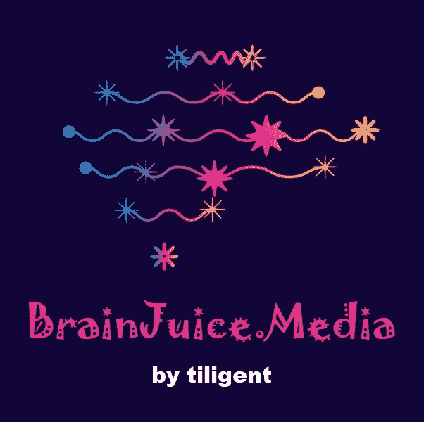

首次由 BrainJuice.Media（Tiligent Pty Ltd 的一个品牌）在 2023 年于澳大利亚出版，版权© Tiligent Pty Ltd 2023-2024

亚当·拉塞尔作为本作品作者的道德权利，已根据 1988 年版权、设计和专利法案由他本人主张。

所有权利保留。未经出版者书面许可，本出版物任何部分不得以任何形式或任何手段进行复制、存储在检索系统中或以任何形式或手段进行传输。不得以任何形式或包装进行其他形式的流通，除非在出版时未对后续购买者施加类似条件，包括本条件。
