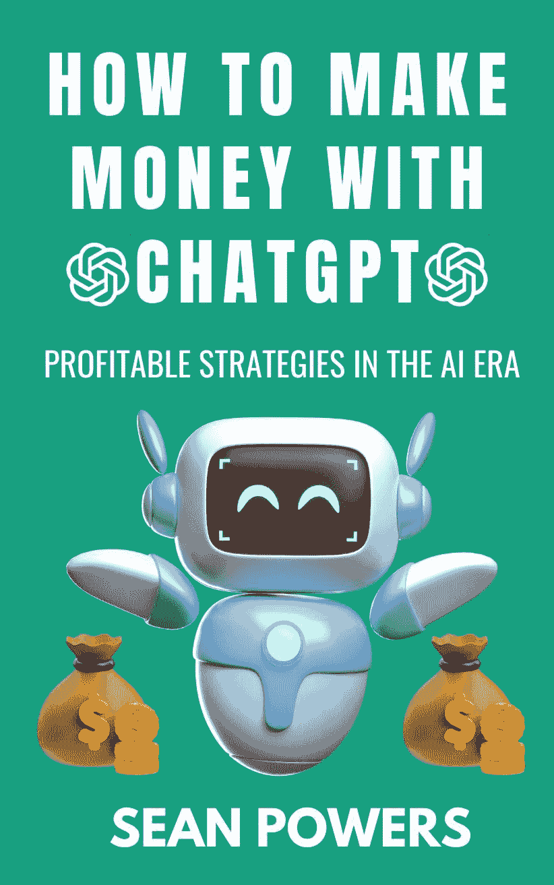

## 如何用 ChatGPT 赚钱：人工智能时代的盈利策略

> 原文：[How to Make Money with ChatGPT:](https://annas-archive.org/md5/0e22bd31b0a0441d0203d9e4d68d5ea0)
> 
> 译者：[飞龙](https://github.com/wizardforcel)
> 
> 协议：[CC BY-NC-SA 4.0](https://creativecommons.org/licenses/by-nc-sa/4.0/)

# 第一章：什么是 ChatGPT 以及它是如何工作的？

ChatGPT 和生成式人工智能的基础

ChatGPT 是由 OpenAI 开发的一项开创性的人工智能工具，建立在生成式人工智能的基础上。这项技术使 ChatGPT 能够处理文本、理解上下文，并对提示产生类似人类的响应。它是生成预训练变换器系列的一部分，该系列使用机器学习根据大量数据集预测和生成文本。

为了更好地理解 ChatGPT，让我们分解其关键组件：

训练数据：ChatGPT 在书籍、网站和其他书面材料的大量文本上进行训练。这使得它能够构建对语言结构、语法和上下文的理解。

处理提示：当用户提供输入时，ChatGPT 分析文本以解释其含义和意图。

生成响应：根据分析后的输入，模型通过生成与上下文相符的文本来预测最合适的响应。

与传统的基于规则的系统不同，ChatGPT 能够动态适应广泛的情况，使其成为创意和技术任务的通用工具。

关键特性和功能

ChatGPT 提供了一系列可以应用于各个行业和学科的技能。这些包括：

文本生成：创建论文、博客文章、社交媒体内容，甚至诗歌。

问答：提供简洁、准确的答案来回答用户查询。

编程辅助：在多种编程语言中编写和调试代码。

翻译：在多种语言之间翻译文本。

例如：

一位小型企业主可以使用 ChatGPT 为电子商务商店生成产品描述，节省数小时的手动工作。

学生可能会用它来总结复杂的学术论文，以便更容易学习。

利用 ChatGPT 的行业

许多行业已经将 ChatGPT 整合到他们的工作流程中，从中获得了显著的好处：

客户服务：由 ChatGPT 驱动的自动聊天系统通过提供即时答案来增强用户支持，回答常见问题。

医疗保健：AI 模型协助起草患者记录、医疗摘要和预约提醒。

市场：专业人士使用 ChatGPT 生成广告文案、博客文章和社交媒体活动。

教育：教师和学生依赖 AI 来创建学习资料、课程计划和作业。

例如，一位医疗保健提供者通过使用 AI 工具起草医疗笔记，将文档时间减少了 50%，使从业者有更多时间与患者相处。同样，一位自由撰稿人利用 ChatGPT 同时概述和起草多篇文章，提高了他们的生产力和收入潜力。

通过了解 ChatGPT 是什么以及它是如何运作的，你可以开始探索它作为个人和职业成长变革性工具的潜力。

# 第二章：ChatGPT 作为商业工具

提高生产力

ChatGPT 在自动化重复和耗时任务方面表现出色。通过将这些责任委托给人工智能，企业可以将精力转向战略决策和创造性工作。

一些实际应用包括：

邮件自动化：起草对常见查询的回复或创建专业沟通的模板。

文档摘要：将冗长的报告压缩成简洁的摘要，以便快速参考。

日程安排辅助：高效地管理日历和组织任务。

例如，一位市场营销经理可能会使用 ChatGPT 来起草针对不同客户群体的电子邮件营销活动，节省数小时的努力，同时确保语气和信息的连贯性。

内容创作和创意生成

ChatGPT 最有价值的用途之一是其生成高质量书面内容的能力。这包括：

博客文章：撰写针对特定主题或受众的吸引人的文章。

社交媒体内容：创建与目标受众产生共鸣的标题、标签和活动想法。

创意写作：协助作者进行故事发展、角色创造和对话生成。

例如，一个因写作障碍而苦恼的博主可以使用 ChatGPT 来构思想法，并在几分钟内撰写一篇 1,500 字的文章。同样，一个社交媒体经理可以在一次会话中生成一个月的帖子，确保为他们的品牌提供及时和相关的内容。

决策支持

ChatGPT 是解决复杂问题或探索创新解决方案的无价头脑风暴伙伴。例如：

战略规划：生成业务增长或扩张的情景。

产品开发：为新产品构思功能、优势和独特卖点。

流程优化：识别低效并提出改进建议。

考虑一个企业家在推出新产品。他们可能会使用 ChatGPT 生成潜在的市场策略列表，评估每一个，并根据他们的目标和资源选择最有效的方案。

# 第三章：为成功做好准备

将 ChatGPT 与工具和平台集成

为了最大化 ChatGPT 的效用，将其与补充其功能的平台和工具集成是至关重要的。这些包括：

API：OpenAI 提供 API，可以将 ChatGPT 嵌入网站、应用程序或客户服务平台。

第三方工具：像 Zapier 和 Notion 这样的平台可以实现任务的无缝自动化，例如数据录入或工作流程管理。

例如：

一个企业主可能会使用 Zapier 将 ChatGPT 连接到他们的电子邮件营销软件，自动化新闻简报的创建和安排。

软件开发者可以将 ChatGPT 集成到他们的编码环境中，以获得实时调试辅助。

选择正确的用例

并非每个任务都适合 ChatGPT。为了确定最佳用例：

分析您的目标：确定任务是否需要创造力、重复或两者兼而有之。

评估可行性：评估 ChatGPT 的功能是否与任务要求相匹配。

测试和改进：尝试不同的提示以优化 AI 输出。

例如，一个教育工作者可能会使用 ChatGPT 进行课程规划，但会避免依赖它来批改论文，因为人工监督确保了公平性和准确性。

道德考量与限制

虽然 ChatGPT 是一个强大的工具，但它并非没有挑战。道德考量包括：

透明度：在内容创作中使用 AI 时，向用户或客户通报。

知识产权：确保 AI 生成的内不侵犯现有的版权。

偏见缓解：识别和解决模型输出中存在的任何偏见。

通过采取负责任的方法，用户可以在保持诚信和专业性的同时有效地利用 ChatGPT。

# 第四章：使用 ChatGPT 进行自由职业

利用 ChatGPT 提供自由职业服务

自由职业是一个蓬勃发展的行业，数百万专业人士提供写作、营销、设计等服务。ChatGPT 增强了您大规模提供高质量工作的能力，使其成为在竞争激烈的市场中脱颖而出的自由职业者的强大盟友。通过了解如何将 ChatGPT 整合到您的工作中，您可以为客户提供独特、价值驱动的服务。

您可以提供的关键服务

ChatGPT 使自由职业者能够提供各种服务，包括：

文案和内容创作

使用 ChatGPT，您可以快速高效地撰写引人入胜的网站文案、广告和文章。例如：

一位小型企业主需要引人入胜的产品描述。使用 ChatGPT，您可以在几分钟内提供一份精炼的 200 字描述。

客户要求一系列关于数字营销的博客文章。ChatGPT 可以生成大纲、标题和供您审阅的草稿文本。

社交媒体管理

社交媒体是数字营销的基石，ChatGPT 简化了有影响力内容创作的过程。例如：

为 Instagram、Twitter 和 Facebook 等平台编写吸引注意力的标题。

生成包含标签和发布日程的一个月内容日历。

编辑和校对

ChatGPT 帮助识别语法错误，提出风格改进建议，并提高清晰度。例如：

客户提交了一份新闻稿草案。ChatGPT 润色了语气并确保其符合专业标准。

您收到了一份电子书手稿用于编辑。ChatGPT 识别冗余并改进句子流畅度。

研究协助

ChatGPT 可以快速总结文章、收集行业统计数据或构思主题想法。自由职业的研究员可能会用它来编制白皮书或报告的背景信息。

在自由职业平台上设置个人资料

为了最大化您的可见性并吸引客户，在 Upwork、Fiverr 或 Toptal 等平台上创建强大的个人资料。以下是一些优化您存在感的技巧：

在您的服务中突出 ChatGPT

对于像 ChatGPT 这样的 AI 工具的使用要透明。解释这是如何提高效率、一致性和为客户增加价值的。

展示作品集样本

包括 ChatGPT 驱动的作品示例，如博客文章、产品描述或营销文案。确保样本经过良好编辑并针对客户需求定制。

制定清晰的增值主张

强调与您合作独特的优势。例如：

"提供高质量、AI 增强的内容，并具有快速响应时间。"

"结合 AI 效率和个性化关注，以实现卓越成果。"

定价和扩展您服务的技巧

定价对于吸引客户并确保盈利至关重要。使用以下策略：

以具有竞争力的方式开始：提供入门级价格以建立客户群并收集评价。

基于价值的定价：根据你提供的服务价值收费，而不仅仅是投入的时间。

升级销售：一旦建立信任，提供额外的服务，如持续的内容更新或高级 SEO 优化。

例如，一位自由撰稿人可能开始以每篇 50 美元的价格提供基本的博客文章。随着声誉的增长，他们可以扩展到提供价值 500 美元或以上的高级服务，如白皮书或长篇文章。

扩大你的自由职业业务

扩大业务涉及优化运营和承担更大的项目。ChatGPT 通过以下方式帮助：

缩短周转时间：更快地交付草稿使你能够接受更多客户。

与团队协作：将 ChatGPT 集成到与其他自由职业者（如设计师或营销人员）的工作流程中，提供全面的套餐。

扩展专业知识：使用 ChatGPT 探索新的细分市场，如技术写作或创意故事讲述。

真实世界的成功案例

考虑 Alex，一位自由社交媒体经理。最初，Alex 管理了五个客户，手动创建每周的帖子。在整合 ChatGPT 后，Alex 扩大到 15 个客户，自动化内容生成同时保持高质量的工作。这使 Alex 的月收入增加了 200%。

通过将 ChatGPT 整合到你的自由职业旅程中，你可以提高生产力，吸引更多客户，并实现财务独立。

# 第五章：为被动收入创造内容

被动收入是指通过最小的持续努力赚取金钱。ChatGPT 是创建电子书、课程和博客等数字资产，这些资产随着时间的推移产生收入的无价工具。通过利用其功能，你可以高效地生产高质量的内容，并专注于扩大你的努力。

使用 ChatGPT 编写电子书

自行出版电子书是创造被动收入流的一种流行方式。ChatGPT 通过以下方式简化写作过程：

概述：生成详细的章节结构。

起草：为每个章节生产引人入胜的内容。

编辑：润色语气、语法和流畅度，以制作出完美的最终产品。

电子书写作示例工作流程

选择一个需求量高的主题，例如“数字营销入门”。2. 使用 ChatGPT 来构思章节标题和主要观点。3. 起草每个章节，修订并添加个人见解以使其独特。4. 在亚马逊 Kindle Direct Publishing 等平台上发布电子书。

创建在线课程和教程

在线学习市场正在蓬勃发展，ChatGPT 使你能够快速开发全面的课程。步骤包括：

规划课程模块：使用 ChatGPT 概述每个模块的主题和目标。

编写教学脚本：为视频教程或书面课程生成清晰、简洁的脚本。

补充材料：创建工作表、测验和幻灯片以增强学习体验。

例如，一位企业家使用 ChatGPT 设计了一个“社交媒体营销大师班”，通过 Udemy 等平台赚取了数千美元的被动收入。

博客和网站的货币化

博客仍然是通过广告、赞助帖子以及联盟营销实现被动收入的有利途径。ChatGPT 通过以下方式协助：

生成一致、SEO 友好的内容以吸引访客。

思考热门话题或常青帖子的想法。

编写吸引人的号召性用语以提升参与度。

真实世界案例

博客作者玛丽亚难以维持一致的发布日程。在集成 ChatGPT 后，玛丽亚将她的内容输出增加到每周三篇帖子，吸引了更多流量，并在六个月内将广告收入翻倍。

最大化被动收入潜力

要成功实现被动收入：

通过创建多个电子书、课程或博客来多元化你的资产。

定期更新内容以保持相关性。

投资营销以触及更广泛的受众。

通过将 ChatGPT 作为你的内容创作伙伴，你可以在维持追求其他事业自由的同时，建立一个可持续的被动收入流。

# 第六章：构建聊天机器人业务

聊天机器人行业简介

聊天机器人行业正经历指数级增长，这得益于对自动化和高效通信工具的需求。各行业的公司都在寻求成本效益高的方式来吸引客户、提供支持和提升用户体验。通过将 ChatGPT 作为你聊天机器人服务的核心，你可以创建一个成本最低、可扩展的业务。

ChatGPT 在聊天机器人开发中的作用

ChatGPT 是创建聊天机器人的强大工具，因为它可以：

以高精度理解和回应自然语言输入。

适应不同的对话风格，使其适用于各种行业。

处理重复性任务，如回答常见问题或预约，释放人力资源。

与传统的脚本机器人不同，由 ChatGPT 驱动的聊天机器人提供了一种感觉像人类的对话流程，这增加了客户满意度和参与度。

第 1 步：确定目标市场

在构建聊天机器人业务之前，定义你的细分市场。潜在市场包括：

电子商务：回答产品相关查询、协助购买和处理退货的聊天机器人。

医疗保健：用于安排预约、发送提醒和提供基本健康信息的机器人。

教育：为学生或教育平台提供虚拟导师或入职工具。

旅游业：预订助手和回答常见旅行者问题。

例如，想象你正在与一家小型电子商务商店合作。他们的客户服务团队因重复的关于运输政策的问题而感到不堪重负。一个由 ChatGPT 驱动的聊天机器人可以立即解决 80%的这些查询，使团队能够专注于更复杂的问题。

第 2 步：设计和定制聊天机器人

创建有效的聊天机器人需要规划和定制。以下是基本步骤：

理解用户需求

通过对目标受众进行研究和访谈来识别常见的痛点。例如，如果您为医疗服务提供商创建聊天机器人，关注简化预约或回答关于服务的问题。

定义对话流程

使用思维导图或流程图软件来概述潜在的用户交互。结构化聊天机器人的响应以引导用户无缝地通过对话。例如：

用户询问配送时间。

如果用户提供跟踪号码，聊天机器人提供详细信息并提供跟踪现有订单的优惠。

定制聊天机器人个性

调整聊天机器人的语气和风格以匹配品牌形象。为律师事务所创建的聊天机器人可能需要专业的语气，而为服装零售商创建的聊天机器人可以更加轻松和有趣。

测试和优化

发布您聊天机器人的测试版并收集用户反馈。优化对话流程并确保聊天机器人能够有效地处理意外输入。

第 3 步：为客户端实施聊天机器人

一旦您开发了聊天机器人，实施涉及：

平台集成

在受众互动最多的渠道上部署聊天机器人，例如网站、社交媒体平台或 WhatsApp 和 Facebook Messenger 等即时通讯应用。

训练机器人

使用真实客户数据来训练 ChatGPT，确保针对特定客户需求的准确响应。

监控和改进

定期使用分析工具监控聊天机器人的性能。例如，跟踪响应时间、完成率和用户满意度等指标。

第 4 步：定价您的服务

一个盈利的聊天机器人业务需要战略性的定价模型。考虑以下方法：

开发一次性费用：为构建和交付聊天机器人收取一次性费用。

订阅模式：以每月或每年的费用提供持续的支持和更新。

按交互付费：客户根据聊天机器人处理的交互次数或查询数量付费。

例如，您可能对初始聊天机器人开发收费 1000 美元，每月维护和更新收费 200 美元。

第 5 步：扩展您的聊天机器人业务

随着您服务的需求增长，扩展变得至关重要。以下是一些扩展策略：

标准化模板：创建行业特定的聊天机器人模板以加快开发。

扩展到新市场：与您尚未探索的行业中的客户合作，例如房地产或健身。

组建团队：雇佣开发者或 AI 专家来处理不断增长的工作量同时保持质量。

想象您从为当地零售商创建聊天机器人开始。随着时间的推移，您将扩展到包括酒店业，添加预订系统的模板。到第二年，您的公司为五个行业提供解决方案，每年产生六位数的收入。

真实世界案例

Sarah 是一位企业家，她成立了一家专注于中小企业的人工智能聊天机器人业务。她的第一个客户，一家当地餐厅，需要一个机器人来管理预订并回答客户关于菜单项目的询问。通过整合 ChatGPT，Sarah 在两周内交付了解决方案，提高了餐厅效率 60%。一年内，她在三个行业获得了 25 个客户，并扩大了团队以满足不断增长的需求。

结论

使用 ChatGPT 建立聊天机器人业务不仅有利可图，而且具有可扩展性和适应性。通过了解您的市场、设计有效的机器人并实施战略定价，您可以建立一个繁荣的企业。随着人工智能技术的快速采用，抓住这个机会的时机已经到来。

# 第七章：社交媒体和营销服务

使用 ChatGPT 的社交媒体和营销简介

社交媒体已经成为企业连接受众、打造品牌和推动销售的重要平台。然而，创建一致、高质量的内容、管理参与度和分析数据都是耗时的工作。ChatGPT 提供了一个强大的解决方案，以简化这些努力，使社交媒体管理和营销更加高效和有效。

本章探讨了如何利用 ChatGPT 生成吸引人的内容、管理广告活动和分析受众洞察，让您能够建立一个提供社交媒体和营销服务的盈利性业务。

第 1 步：内容创作变得简单

内容是社交媒体成功的基础。ChatGPT 使您能够生成各种社交媒体帖子，从吸引人的标题到深入博客风格的内容。以下是一些实际应用：

编写标题和帖子

ChatGPT 可以为不同的平台生成定制帖子，确保语气和风格与受众匹配。例如：

Instagram: "我们的新秋季系列已上市！现在购物，以时尚的方式迎接季节。[链接] #秋季时尚 #新品上市"

Twitter: "在增长受众方面遇到困难？发现建立参与社区必知的 5 个技巧。[链接] #社交媒体技巧"

创建标签

标签可以提高可见度，但找到合适的标签可能会很繁琐。ChatGPT 可以快速为特定主题或活动生成相关的标签，节省数小时的大脑风暴。

设计内容日历

一个精心策划的内容日历可以确保一致性与营销目标相一致。ChatGPT 可以帮助制定月度或周度计划，建议主题、话题和发布时间表。

内容创作示例工作流程

第 1 步：将您的品牌声音和营销目标输入 ChatGPT。

第 2 步：为 Facebook、Twitter 和 LinkedIn 等平台生成 30 天的帖子。

第 3 步：审查和编辑帖子，以符合您的特定信息和受众偏好。

第 2 步：管理广告活动

运行成功的广告活动需要具有说服力的文案、有针对性的策略和定期优化。ChatGPT 通过以下方式增强你创建和管理广告的能力：

编写广告文案

ChatGPT 可以撰写吸引人的标题、描述和行动号召，以驱动点击和转化。例如：

电子商务广告："发现适合每个场合的完美礼物！现在购物，订单满 50 美元即可享受免费送货。[链接]"

基于服务的商业广告："用我们的专业室内设计服务改造你的家。今天预约咨询！[链接]"

划分目标受众

ChatGPT 帮助构思角色和细化目标标准。例如，一个健身品牌可以确定多个受众：寻找快速锻炼的年轻专业人士、寻求低冲击性锻炼的老年人以及想要家庭友好型常规的父母。

生成 A/B 测试想法

通过测试文案、视觉或行动号召的变化来优化活动。ChatGPT 可以建议多个角度，例如在一个广告中强调好处，在另一个广告中突出紧迫性。

第 3 步：受众参与和社区建设

成功的社交媒体管理不仅限于内容创作和广告，还需要积极的受众参与。ChatGPT 通过以下方式促进这一点：

回复评论和消息

使用 ChatGPT 草拟对用户评论或直接消息的深思熟虑的回复，确保语气一致且专业。例如：

客户咨询："你们的店铺营业时间是什么时候？"

ChatGPT 生成的回复："感谢您的联系！我们的店铺周一至周六营业，上午 9 点至晚上 8 点。如果您有任何其他问题，请告诉我们！"

启动对话

通过提出问题或发起讨论来吸引你的受众。例如，ChatGPT 可以生成如下提示：

"你最喜欢怎样享受假期？在下面分享你的想法！"

"如果你能去世界上任何地方旅行，你会去哪里，为什么？"

监测品牌情绪

通过分析用户反馈和评论，ChatGPT 可以识别情绪趋势，帮助你解决担忧或利用积极的舆论。

第 4 步：分析绩效和生成报告

数据驱动的决策对于社交媒体的成功至关重要。ChatGPT 简化了分析指标并以易于理解的方式呈现洞察的过程。应用包括：

总结关键指标

将原始数据输入 ChatGPT 以获得清晰的摘要。例如：

"这个月，我们的 Instagram 账号增加了 1,500 名新关注者，平均参与率为 8%。我们表现最好的帖子是一个展示新产品的轮播图，获得了 3,200 个赞和 500 次分享。"

生成报告

使用 ChatGPT 为客户或利益相关者创建详细的报告，包括图表和可操作的推荐。

识别增长机会

ChatGPT 可以建议改进的领域，例如增加帖子频率或探索新的平台如 TikTok。

第 5 步：定价你的社交媒体服务

为了建立一个可持续的业务，考虑不同的定价模式：

套餐定价：提供分层套餐，例如基本内容创作、高级互动管理和高级报告服务。

按小时收费：根据管理账户和创建内容所花费的时间收费。

绩效定价：将你的费用与关键绩效指标对齐，例如关注者增长或网站流量增加。

例如，你可能每月收取 500 美元的基本管理费用，以及包括广告和互动在内的全面社交媒体营销服务每月 1500 美元。

扩大你的社交媒体和营销业务

随着你积累经验，通过以下方式扩展你的业务：

专注于行业：关注医疗保健、房地产或时尚等细分市场，以吸引寻求特定行业专业知识的企业。

建立团队：雇佣助手或分包商来处理重复性任务，同时你监督策略。

提供培训服务：教授企业如何有效地管理自己的社交媒体账户，创造额外的收入来源。

案例研究：扩大社交媒体帝国

约翰，一位数字营销专业人士，使用 ChatGPT 作为主要工具开始了社交媒体管理业务。最初，他管理了五个账户，专注于小型企业。通过自动化内容创作、高效地回应询问以及使用 ChatGPT 分析性能，约翰在两年内将客户群扩大到 20 个账户。如今，他管理着一个五人的团队，并每年产生超过 10 万美元的收入。

结论

社交媒体环境变化迅速，但 ChatGPT 为你提供了保持领先的工具。无论你是创建病毒性内容、管理广告活动还是与受众互动，ChatGPT 都允许你提供能够推动收入和促进长期成功的成果。通过掌握这些技术，你可以在社交媒体和营销服务领域建立一个繁荣的业务。

# 第八章：联盟营销与人工智能

使用 ChatGPT 入门联盟营销

联盟营销是通过推广产品或服务以换取佣金来生成被动收入的强大策略。在这个领域的成功取决于创建高质量的内容，这些内容能够吸引流量并促进转化。ChatGPT 是这个领域的变革者，它使你能够制作有说服力的营销材料，优化活动，并自动化你的策略。

本章探讨了如何使用 ChatGPT 来开发内容，简化你的联盟营销工作，并扩大你的收入。

第 1 步：了解联盟营销基础知识

联盟营销涉及三个关键参与者：

商家：提供产品或服务的公司。

联盟成员：推广产品的个人或企业。

消费者：通过联盟链接购买的用户。

作为联盟成员，你的目标是通过提供有价值的内容，突出你推广的产品或服务的优势，来影响消费者。ChatGPT 可以在这一过程的每个步骤中提供帮助。

第 2 步：创建高转化率的内容

内容是联盟营销成功的基础。ChatGPT 使您能够根据受众和目标生产各种类型的内容：

产品评论

真实、详细的评论有助于建立信任并推动转化。ChatGPT 可以通过以下方式协助：

概述关键产品功能和优势。

与类似产品进行比较。

编写具有说服力的行动号召。

示例评论：

“XYZ 健身追踪器是任何重视健康的人的变革性产品。实时跟踪、直观的应用程序和时尚的设计使其在 ABC 追踪器等竞争对手中脱颖而出。点击[这里]立即购买并开始您的健身之旅！”

博客文章

ChatGPT 可以生成引人入胜的文章，无缝融入联盟链接。例如：

“2024 年你必须拥有的 10 大旅行配件”附带指向亚马逊产品的链接。

“这款生产力工具如何改变您的工作日”特色包含指向软件解决方案的联盟链接。

邮件营销

邮件营销仍然是一个高转化渠道。ChatGPT 帮助制定：

主题行：“用这款必备小工具改造您的家庭办公室！”

正文：突出优势、客户评价和引人入胜的行动号召。

社交媒体帖子

使用 ChatGPT 为 Instagram、Twitter 和 LinkedIn 等平台创建简短、有影响力的帖子。包括引人注目的标题和相关的标签。

第 3 步：自动化联盟营销任务

ChatGPT 可以通过自动化重复性任务来简化您的联盟营销策略：

关键词研究：生成关键词以进行 SEO 优化，确保您的内容在搜索结果中排名更高。

广告文案创作：为谷歌广告或 Facebook 广告等平台开发多个广告文案变体。

受众定位：头脑风暴理想的客户角色以细化您的活动。

示例工作流程：

输入：“为关于环保家居产品的联盟博客文章生成关键词。”

输出：关键词：“可持续家居产品，环保清洁工具，零浪费生活必需品。”

第 4 步：扩展您的联盟营销业务

为了扩大您的努力并增加收入，请考虑以下策略：

多元化内容平台

在博客、YouTube、播客和社交媒体上扩大您的存在。例如：

在 YouTube 上创建教程视频，视频中包含描述中的联盟链接产品。

启动一个讨论行业趋势的播客，并融入赞助广告段落。

利用分析

使用谷歌分析或联盟平台仪表板等工具来跟踪性能。ChatGPT 可以通过分析数据和生成报告来协助。例如：

“您的博客文章《2024 年厨房必备 5 大工具》的转化率为 10%，本月产生了 500 美元的佣金。”

扩展联盟伙伴关系

与多个联盟计划合作，以多元化您的收入来源。流行的平台包括：

亚马逊联盟

ShareASale

ClickBank

第 5 步：定价和收入预测

推广佣金根据项目不同而有所变化，但通常每笔销售在 5%到 50%之间。为了最大化收入：

专注于高价值商品（例如，电子产品、奢侈品）以获得更高的每笔销售收益。

将高销量、低单价商品（例如，家庭必需品）组合起来，以产生稳定的收入。

收入示例分解：

10 件售价为$1,000 的产品，10%的佣金等于$1,000。

100 件售价为 50 美元的产品，5%的佣金等于$250。

通过优化你的策略与 ChatGPT，你可以在收入上实现一致性和可扩展性。

案例研究：将联盟营销转变为六位数业务

埃玛，一位内容创作者，以一个专注于健康和福祉的博客开始了她的联盟营销之旅。最初，她手动撰写产品评论，每周发表一篇文章。在整合 ChatGPT 后，她将产量提高到每周三篇文章，每篇文章都针对 SEO 进行了优化。一年内，埃玛扩展到 YouTube 和 Instagram，通过联盟链接赚取了$120,000 的佣金。

结论

联盟营销与 ChatGPT 的效率相结合，为被动收入提供了无限的机会。通过掌握内容创作、自动化任务和战略性地扩展，你可以建立一个可持续的联盟营销业务。关键在于利用 AI 来放大你的努力并为你的受众提供价值。

# 第九章：自动化工作流程

工作流程自动化的介绍

在当今快节奏的商业环境中，效率是成功的关键因素。工作流程自动化使企业能够简化重复性任务，减少人为错误，并将资源分配到更战略性的活动。ChatGPT 通过提供与现有系统无缝集成的智能解决方案，将自动化提升到了新的水平。

本章深入探讨了 ChatGPT 如何自动化不同行业的工作流程，提高生产力，并最终增加利润。

第 1 步：识别适合自动化的重复性任务

自动化工作流程的第一步是识别那些消耗时间和适合 AI 辅助的任务。常见的例子包括：

邮件管理：自动化对常见问题的回复，对邮件进行分类，并起草回复。

客户支持：处理咨询、故障排除和提供资源。

数据录入：从各种来源提取、组织和分类信息。

内容管理：安排帖子、生成更新并在各个平台上保持一致性。

示例用例：

人力资源专业人士花费数小时回答关于休假政策的类似问题。ChatGPT 可以被训练生成个性化的回复，从而为人力资源团队节省大量时间。

第 2 步：集成工具和平台

为了最大化 ChatGPT 的潜力，将其与增强其功能性的互补工具和平台集成。流行的选项包括：

Zapier：将 ChatGPT 与 Slack、Trello 和 Google Sheets 等应用程序连接，以自动化多步骤工作流程。

Notion：使用 ChatGPT 在协作工作空间内直接生成会议记录、项目更新或摘要。

CRM 系统：将 ChatGPT 集成到 Salesforce 或 HubSpot 等平台，以自动化客户互动和数据管理。

集成示例：

一家小型企业通过 Zapier 将 ChatGPT 连接到他们的 CRM。当添加新潜在客户时，ChatGPT 起草个性化的跟进电子邮件，安排发送，并记录互动。

第 3 步：设计自动化工作流程

一个成功的流程需要周密的规划。以下是设计和实施流程的方法：

绘制流程图：将任务分解成更小的步骤。例如，管理通讯稿活动可能包括撰写内容、校对和安排。

训练 ChatGPT：提供特定的提示和数据以微调其响应。例如：

输入：“起草一份推广夏日促销活动的通讯稿。”

输出：“主题：夏日优惠大放送！正文：不要错过高达 50%的折扣。现在购物[链接]。”

测试工作流程：运行试点以识别低效或错误。

优化：细化提示或集成点以提高准确性和速度。

第 4 步：自动化跨部门工作流程

ChatGPT 可以在不同部门自动化流程，例如：

销售：生成提案、更新 CRM 条目并跟进潜在客户。

营销：安排社交媒体帖子、创建活动报告和起草广告。

运营：管理库存更新、生成发票和跟踪运输。

示例：

一个营销团队自动化他们的月度报告流程。ChatGPT 从 Google Analytics 中整理数据，总结绩效指标，并起草一份准备好的报告。

第 5 步：克服常见挑战

虽然自动化提供了许多好处，但也伴随着挑战：

定制化：通过向 ChatGPT 提供详细说明，确保工作流程与特定业务需求一致。

可扩展性：设计能够随着业务增长或变化而适应的工作流程。

人工监督：在自动化和人工输入之间保持平衡，以确保质量和道德标准。

挑战示例：

一家公司注意到自动化客户支持响应中的不准确之处。他们细化了聊天机器人的训练数据，为复杂查询添加了升级协议，并指定了一名团队成员进行监督。

第 6 步：衡量自动化的影响

为了评估自动化的成功，跟踪关键绩效指标（KPIs）如下：

节省时间：比较实施 ChatGPT 工作流程前后在任务上花费的时间。

错误减少：监控准确度或一致性的改进。

成本效益：评估减少劳动时间或提高生产率带来的节省。

示例指标：

一家小型企业使用 ChatGPT 自动化发票生成，将处理时间减少了 80%，使财务团队能够专注于战略规划。

为最大利润扩展自动化

随着业务增长，通过以下方式扩展自动化工作：

扩展应用场景：探索更多可自动化的工作流程，例如招聘流程或供应商管理。

投资先进工具：将 ChatGPT 与人工智能驱动的分析或机器学习模型结合，以获得更深入的洞察。

培训您的团队：教导员工如何优化 ChatGPT 提示词和集成以获得更好的结果。

案例研究：利用 ChatGPT 变革工作流程效率

大卫是一家中型物流公司的运营经理，他面临着客户沟通和追踪效率低下的问题。通过集成 ChatGPT，他的团队自动化处理了发货查询的回复并实时更新了追踪系统。结果如何？客户满意度提升了 60%，员工工作量减少了 40%。

结论

利用 ChatGPT 自动化工作流程对于各种规模的企业来说都是一项颠覆性的策略。通过识别重复性任务、整合合适的工具并进行战略性扩展，您可以优化效率并增加利润。ChatGPT 赋能团队专注于创新与增长，确保长期成功。

# 第十章：个性化客户服务

个性化客户服务简介

在竞争激烈的商业世界中，个性化已不再是可选项，而是必需品。客户期望获得能满足其特定需求的定制化解决方案，而未能提供此类服务的企业则面临失去受众的风险。ChatGPT 提供了一种强大的方式，能够大规模提供个性化客户服务，将人工智能的效率与类人的定制化能力相结合。

本章探讨如何利用 ChatGPT 来定制内容与策略、进行市场调研以及有效管理客户关系。

步骤 1：为个体客户量身定制内容与策略

ChatGPT 使您能够根据个体客户需求创建高度定制化的内容和策略。方法如下：

理解客户需求

首先收集关于客户的信息，例如其所在行业、目标受众和目标。使用 ChatGPT 分析这些数据并生成量身定制的建议。

示例：一家小型面包店希望提升其线上影响力。ChatGPT 会生成诸如"在 Instagram 上推广季节性食谱"或"为节日活动提供虚拟烘焙课程"等创意。

定制交付成果

ChatGPT 可以调整语调、风格和信息传递方式，以匹配客户的品牌形象。

示例：一个奢侈品牌需要其营销材料使用优雅、正式的语言，而一个健身品牌则需要充满活力和激励性的语调。

实时个性化

使用 ChatGPT 在客户互动过程中提供即时定制服务。例如：

在销售演示中，ChatGPT 能生成针对客户异议的定制化回应，强调与其行业相关的益处。

步骤 2：利用 ChatGPT 进行市场调研

了解客户的市场对于提供有效解决方案至关重要。ChatGPT 通过以下方式简化市场调研：

分析竞争对手

输入竞争对手信息，以生成关于优势、劣势和机会的见解。

示例："分析这三个环保产品领域的竞争对手，并建议我们的客户如何区分自己。"

探索受众偏好

使用 ChatGPT 来识别客户目标受众中的趋势和偏好。

示例："千禧一代业主对节能家电的主要担忧是什么？"

创建调查问卷

制定调查以收集客户的直接反馈。ChatGPT 可以撰写专业、有针对性的问题，以获得有价值的见解。

示例："您希望在即将推出的产品线中看到哪些功能？"

第 3 步：使用 AI 管理客户关系

强大的客户关系是任何成功企业的基石。ChatGPT 通过以下方式帮助您管理这些关系：

自动化沟通

电子邮件模板：起草个性化的后续跟进、提案或感谢邮件。

示例："感谢您考虑我们的服务。根据我们的对话，我们建议以下步骤..."  - 会议摘要：在客户会议之后，ChatGPT 生成摘要，突出重点和行动项目。

安排和提醒

将 ChatGPT 与日程安排工具集成，以无缝管理预约、截止日期和跟进。

积极参与

使用 ChatGPT 预测客户需求并在请求之前提出解决方案。

示例："我们注意到对虚拟活动的需求有所增加。您希望我们创建一个活动来利用这一趋势吗？"

第 4 步：客户个性化中的道德考量

当使用 AI 进行个性化时，道德考量必须是首要任务。以下是如何保持信任和透明度：

数据隐私

始终遵守 GDPR 或 CCPA 等法规，保护客户和客户数据。关于数据如何收集和使用，保持透明。

真实性

避免过度依赖 AI。虽然 ChatGPT 可以增强您的努力，但人类监督确保解决方案保持真实和情境适当。

客户同意

当 AI 工具用于您的流程时，通知客户并确保他们同意其应用。

第 5 步：定价您的个性化服务

个性化客户服务通常因其附加价值而具有高端定价。考虑以下定价策略：

分级定价

提供不同级别的服务，如基础、高级和高端套餐。

示例：

基础：电子邮件模板和内容建议。

高级：全面市场分析和个性化策略。

高端：持续支持和实时定制。

按小时收费

对花费在研究、创建和定制解决方案上的时间收费。

保留协议

对于长期客户，提供涵盖所有需求的月度保留协议，确保收入稳定。

第 6 步：扩展个性化客户服务

为了扩大您的业务，专注于在不牺牲质量的情况下扩大运营规模：

标准化流程：创建常见任务的模板和框架，以节省时间同时保持质量。

利用数据分析：使用数据来优化您的个性化策略并识别改进领域。

扩展您的团队：聘请专家或培训员工协助提供定制解决方案，同时您专注于策略。

案例研究：提升精品营销机构

詹妮丝经营着一家专注于小型企业的精品营销机构。在 ChatGPT 之前，她的团队在为多个客户个性化活动管理工作量方面遇到了困难。通过整合 ChatGPT，他们自动化了电子邮件草稿、提案撰写和市场研究，将准备时间减少了 50%。这使得詹妮丝能够吸纳五位新客户，使年收入增加了 75,000 美元。

结论

在当今竞争激烈的市场环境中，个性化的客户服务使企业脱颖而出。通过利用 ChatGPT，您可以创建定制解决方案、有效管理关系并扩展您的业务运营。人工智能效率和人类洞察力的结合确保了您的服务提供最大价值并建立长期关系。

# 第十一章：创建和销售数字产品

数字产品简介

数字商业的兴起为数字产品创造了一个有利可图的市场——这些产品是可下载或在线的物品，生产成本最低，利润空间最大。例如，模板、指南、电子书、课程和设计资源。ChatGPT 简化了创建过程，使您能够高效地开发高质量的数字产品并扩大您的收入。

在本章中，我们将探讨如何利用 ChatGPT 作为强大的合作伙伴来创建、营销和销售数字产品。

第一步：选择合适的数字产品

第一步是决定哪种类型的数字产品与您的技能、受众和目标相匹配。流行的选择包括：

模板和工具

示例：社交媒体模板、预算表格或图形设计草图。

ChatGPT 应用：为模板生成内容，例如 Instagram 标题或电子邮件活动的可定制文案。

指南和教程

示例：“如何”指南、分步教程或特定领域的手册。

ChatGPT 应用：为特定行业或受众需求定制详细指南。

电子书

示例：小说、自助或专业指南。

ChatGPT 应用：概述章节、起草文本并优化内容以提高可读性和参与度。

在线课程

示例：摄影、编码或营销等基于技能的课程。

ChatGPT 应用：开发课程模块、撰写课程脚本并创建支持材料，如测验或工作表。

设计资源

示例：标志、字体或股票摄影集。

ChatGPT 应用：提供描述性文本或教程，以配合资源。

产品选择示例工作流程

第一步：确定有需求的利基市场，例如“自由职业生产力工具”。

第 2 步：使用 ChatGPT 来头脑风暴潜在产品，例如“时间跟踪电子表格”或“自由职业者发票模板。”

第 3 步：通过研究竞争对手和受众兴趣来验证想法。

第 2 步：使用 ChatGPT 创建你的数字产品

一旦你选择了产品，ChatGPT 可以简化创建过程：

内容概述

使用 ChatGPT 为你的产品创建一个有组织的结构。

示例：对于一本关于时间管理的电子书，ChatGPT 生成章节，如“设定优先级”、“消除干扰”和“建立可持续的习惯。”

生成草稿

ChatGPT 可以为指南、电子书或课程脚本撰写初稿。

输入：“写一个关于如何消除工作场所干扰的部分。”

输出：“干扰可能会破坏生产力。首先，识别常见的干扰，如通知或不必要的会议。实施策略，如专注时段关闭警报或分块安排会议。”

精炼和润色

当 ChatGPT 处理繁重的工作时，通过编辑和添加个人见解来确保最终产品反映了你的独特视角。

创建辅助材料

ChatGPT 可以生成清单、常见问题解答或补充文档，以增强产品的价值。

示例：“创建一个启动在线课程的清单。”输出：“清单：定义你的受众，起草课程，创建测验，并安排促销电子邮件。”

第 3 步：推广你的数字产品

一个强大的营销策略确保你的数字产品能够触及正确的受众。ChatGPT 可以通过以下几种方式提供帮助：

设计销售页面

编写引人入胜的文案，突出产品的优势和特点。

示例：“使用我们的全能自由职业者工具包提高你的生产力。节省时间，简化任务，专注于最重要的事情。”

电子邮件活动

制定一系列推广产品的电子邮件。

邮件 1：介绍产品及其优势。

邮件 2：分享推荐信或案例研究。

邮件 3：通过限时折扣创造紧迫感。

社交媒体推广

生成针对不同平台的帖子。

示例（Instagram）：“准备好提高你的生产力了吗？现在就获取我们的独家自由职业者工具包！#FreelancerLife #ProductivityTools”

示例（LinkedIn）：“注意自由职业者！我们新的工具包旨在简化你的工作流程并最大化效率。了解更多信息：[链接]。”

搜索引擎优化（SEO）

使用 ChatGPT 来识别关键词，并优化你的销售页面或博客文章以适应搜索引擎。

示例：“为远程工作电子书建议 SEO 关键词。”输出：“关键词：远程工作指南，在家工作技巧，远程团队的生产力。”

第 4 步：为你的数字产品定价

定价在你的产品成功中扮演着至关重要的角色。考虑以下策略：

基于成本的定价：计算你花费的时间和资源，然后添加利润率。

基于价值的定价：根据产品对你受众的感知价值来定价。

分级定价：提供多个套餐，例如：

基础版（$29）：仅电子书。

付费版（$49）：电子书 + 套餐模板。

终极版（$99）：电子书、模板，以及一小时的辅导课程。

示例：

一本定价为 29 美元的电子书在第一个月吸引了 100 位买家，产生了 2900 美元的收入。添加一个包含额外价值的 49 美元的付费版，可以将月收入提高到 4500 美元或更多。

第 5 步：销售您的数字产品

销售数字产品的平台包括：

您的网站

使用 Shopify 或 WordPress 等平台创建店面。ChatGPT 可以帮助撰写产品描述、常见问题解答和支持文章。

市场平台

在 Gumroad、Etsy（模板）、或 Amazon（电子书）等成熟的市场上销售。

电子邮件和社交媒体

利用您的电子邮件列表和社交媒体关注者直接向一个活跃的受众推广您的产品。

第 6 步：扩展您的数字产品业务

要实现规模化，关注以下方面：

创造更多产品

通过开发相关产品来多元化您的产品组合。例如，如果您的第一个产品是关于自由职业的电子书，下一个产品可以是关于寻找客户的课程。

自动化销售和营销

使用电子邮件自动化和广告活动等工具，无需额外手动努力，就能触及更广泛的受众。

拓展新市场

将您的产品翻译成其他语言或针对不同的受众群体。

案例研究：建立数字产品帝国

Lisa，一位平面设计师，最初在 Etsy 上销售社交媒体模板。使用 ChatGPT，她扩展了她的产品，包括营销指南和品牌电子书。通过自动化她的电子邮件营销活动并利用 SEO，Lisa 的月收入在一年内从 500 美元增长到 5000 美元。

结论

创建和销售数字产品是目前最盈利和可扩展的商业模式之一。有了 ChatGPT 作为您的创意合作伙伴，您可以开发高质量的产品，有效地进行市场推广，并建立一个可持续的收入来源。关键是确定您的利基市场，利用 AI 工具，并不断优化您的策略以满足受众需求。

# 第十二章：启动您的在线商店

在线商店简介

数字时代已经彻底改变了商业，使得启动和运营在线商店比以往任何时候都更容易。无论您是销售实体产品、数字商品还是服务，在线商店提供了一个平台，可以触及全球受众。ChatGPT 通过简化产品描述、创建吸引人的销售页面和构建有效的营销漏斗来增强这一过程。

本章将指导您通过 ChatGPT 作为合作伙伴的步骤来设置和管理一家成功的在线商店。

第 1 步：选择您的利基市场和产品

启动在线商店的第一步是决定销售什么。您的利基市场应与您的兴趣和专业知识一致，同时满足市场需求。以下是一些利基产品和产品的示例：

实体产品：手工工艺品、服装、小工具或健身设备。

数字产品：电子书、设计模板或在线课程。

服务：咨询服务、设计服务或虚拟辅导。

ChatGPT 如何帮助：

基于趋势和客户需求生成产品想法。

输入：“为可持续生活商店建议有利可图的产品。”

输出：“可重复使用水瓶、蜂蜡食品包装、竹制餐具和堆肥套件。”

例子工作流程：

使用 ChatGPT 研究市场，以识别热门细分市场。

发起产品提供，并通过评估竞争和需求验证想法。

第 2 步：建立您的在线商店

您在线商店的基础在于选择正确的平台并创建用户友好的设计。流行的平台包括 Shopify、WooCommerce、Wix 和 BigCommerce。

ChatGPT 如何帮助：

店铺名称和品牌：

为您的商店和品牌身份生成创意、难忘的名称。

输入：“为环保在线商店建议名称。”

输出：“EcoHaven，Greenly Goods，PlanetKind Marketplace。”

网站文案：

撰写引人入胜的标题、产品描述和“关于我们”页面。

例子：

标题：“可持续生活从这里开始。”

描述：“我们的可重复使用产品旨在帮助您在不牺牲风格或便利性的情况下减少浪费。”

导航和布局建议：

ChatGPT 可以为您的网站概述理想的结构。

例子：“主页、按类别购物、博客、关于我们和联系页面。”

第 3 步：撰写产品描述

一份出色的产品描述可以促成或破坏一笔交易。它应突出特点，强调好处，并解决客户的痛点。ChatGPT 擅长创建具有说服力且针对目标受众的描述。

ChatGPT 如何帮助：

描述性写作：突出产品特点和好处。

例子：“这套竹制餐具耐用、轻便、环保，非常适合野餐或日常使用。”

SEO 优化：结合相关关键词以提高可见性。

例子：“可重复使用竹制餐具 | 环保旅行餐具。”

A/B 测试：生成多个描述变体以测试哪个表现更好。

第 4 步：创建销售页面

销售页面对于将访客转化为客户至关重要。它们应包括：

一个强有力的标题：立即吸引注意力。

例子：“将您的家转变为零浪费天堂。”

吸引人的好处：突出产品如何解决问题或满足需求。

例子：“我们的堆肥套件使将厨房垃圾转化为富含营养的土壤变得容易，帮助您减少浪费并种植更健康的植物。”

客户评价：通过真实成功故事建立信任。

例子：“自从使用这个套件以来，我已经减少了 40%的家庭垃圾！” – Maria G.

行动号召（CTA）：鼓励访客采取行动。

例子：“现在下单，您的第一笔购买将享受免费送货！”

第 5 步：建立电子邮件营销漏斗

一个有效的电子邮件营销漏斗可以培养潜在客户并将他们转化为付费客户。ChatGPT 可以帮助你构建漏斗的每个阶段：

吸引物：提供免费资源，如电子书或折扣码，以换取电子邮件订阅。

示例：“订阅我们的通讯并享受首次订单 10%的折扣！”

欢迎邮件：创造积极的第一次印象并介绍你的品牌。

示例：“欢迎来到 EcoHaven！我们很高兴您加入我们为更绿色地球的使命。”

推广活动：突出销售、新品上市或季节性促销。

示例：“夏日大促销：本周末所有可重复使用产品享受 20%折扣！”

被遗弃的购物车电子邮件：鼓励用户完成他们的购买。

示例：“您的环保好物正在等待！现在完成订单，享受免费送货。”

第 6 步：吸引流量到你的商店

一旦你的商店设置完成，就要通过多个渠道吸引访客。ChatGPT 通过以下方式协助：

社交媒体帖子：

示例：“可持续生活变得简单！查看我们最畅销的可重复使用套装。[链接] #环保 #零浪费”

博客内容：

撰写能够带来自然流量并建立你权威的文章。

示例：“10 个简单步骤减少你日常生活中的塑料浪费。”

广告文案：

为 Facebook 和 Google 等平台制作吸引人的广告。

示例：“减少浪费，节省金钱，用我们的环保产品可持续生活。现在购物！”

第 7 步：扩展你的在线商店

为了增长你的商店，关注以下策略：

扩展产品线：根据客户反馈引入新产品或组合。

提供订阅：提供定期服务，如每月产品配送。

探索新市场：使用 ChatGPT 研究和调整针对国际客户的产品。

案例研究：启动盈利的在线商店

丹尼尔，一位健身爱好者，通过他的在线商店开始销售锻炼计划和餐食准备指南。使用 ChatGPT，他创建了吸引人的销售页面和电子邮件活动，带来了显著流量。在六个月内，丹尼尔扩展了他的产品，包括个性化指导和锻炼装备，月收入从 1000 美元增加到 10000 美元。

结论

在 ChatGPT 的帮助下开设在线商店可以让你简化运营，创建吸引人的内容，并构建引人入胜的购物体验。通过关注品牌、客户体验和营销，你可以将你的商店转变为盈利的生意。有了 AI 作为你的合作伙伴，扩展和演变成为一个无缝的过程。

# 第十三章：AI 咨询

AI 咨询简介

随着企业越来越多地采用 AI 技术，对能够指导他们通过整合过程的专家的需求日益增长。AI 咨询涉及帮助组织实施 AI 解决方案，如 ChatGPT，以提高效率、提升客户体验和推动创新。通过将自己定位为 AI 顾问，你可以利用你的专业知识提供高价值的服务，并建立盈利的生意。

在本章中，我们将探讨如何将自己定位为人工智能顾问，打包您的服务，并交付满足客户需求的有影响力的解决方案。

第 1 步：将自己定位为人工智能专家

要在人工智能咨询中取得成功，建立信誉和展示您的专业知识至关重要。以下是方法：

建立知识库

关注人工智能技术的最新发展，包括 ChatGPT 等生成式 AI 工具、行业趋势和案例研究。熟悉人工智能可以解决的常见商业挑战，例如客户支持自动化、数据分析以及内容创作。

创建作品集

打造一个展示您与人工智能相关的项目的作品集。这可能包括聊天机器人实施、内容自动化工作流程或您帮助设计的分析工具。如果您刚开始，创建示例项目以展示您的能力。

建立思想领导力

通过博客、网络研讨会或社交媒体帖子分享您的知识。例如：

撰写文章，例如“5 种方式 AI 可以改变小型企业”。 

举办关于“利用 ChatGPT 进行客户互动”的网络研讨会。

获得认证

获得人工智能或相关领域的认证，以增强您的可信度。Coursera、edX 和 OpenAI 等平台提供了有价值的资源。

第 2 步：定义您的咨询服务

人工智能咨询服务涵盖一系列服务。确定您的细分市场，并根据您的技能和目标受众定义您的服务。常见的 AI 咨询服务包括：

聊天机器人开发

帮助企业集成 ChatGPT 驱动的聊天机器人以用于客户支持、销售或内部沟通。

流程自动化

设计使用人工智能自动化重复性任务的工作流程，例如电子邮件回复或数据录入。

数据分析和洞察

使用人工智能工具分析数据并提供可操作的见解以供决策。

内容生成

协助组织简化营销、文档或培训目的的内容创作。

人工智能培训和教育工作

举办研讨会或培训课程，帮助团队有效地理解和使用人工智能工具。

第 3 步：打包和定价您的服务

人工智能咨询服务价值高，因此定价应反映您提供的专业知识和成果。考虑以下策略：

小时费率

向客户收取他们项目所花费的时间费用。AI 顾问的小时费率通常在$100 到$500 之间，具体取决于专业知识。

基于项目的费用

对于特定的交付成果，如设置聊天机器人或自动化工作流程，提供固定价格。

维护协议

对于长期客户，提供每月的维护费用以获得持续的支持和更新。

示例定价套餐：

基础套餐：聊天机器人设置和培训 – $2,000。

高级套餐：全面流程自动化及支持 – $5,000。

顶级套餐：全面的人工智能战略、实施和维护 – $10,000。

第 4 步：寻找和获取客户

为了吸引客户，关注可以从 AI 集成中受益最大的行业，如零售、医疗保健、教育和电子商务。使用以下策略来生成潜在客户：

网络营销

参加行业会议、网络研讨会和网络活动，以与潜在客户建立联系。

线上营销

向企业发送个性化的提案，强调 AI 如何解决他们的痛点。例如：

“我注意到您的客户支持团队处理了大量询问。一个由 ChatGPT 驱动的聊天机器人可以将他们的工作量减少 40%，同时提高响应时间。”

在线存在

使用 LinkedIn 和专业的网站来展示您的专业知识。分享案例研究、客户推荐和成功故事以建立信任。

合作伙伴关系

与软件提供商或数字营销机构合作，这些机构可能会向需要 AI 解决方案的客户推荐。

第 5 步：交付成果

作为 AI 顾问，您的声誉取决于交付可衡量的成果。使用以下方法确保客户满意：

理解客户需求

进行彻底的发现会议，了解客户的目标、挑战和现有系统。

提供定制化解决方案

根据客户的独特需求定制 AI 推荐。例如：

零售商可能需要一个聊天机器人来处理客户询问，而医疗保健提供者可能从自动预约安排中受益。

实施并优化

监督实施过程并根据客户反馈调整解决方案。

衡量成功

跟踪关键绩效指标，如效率提升、成本节约或客户满意度改进。与客户分享这些指标以展示投资回报率。

第 6 步：扩大您的 AI 咨询业务

要扩大您的咨询业务，请考虑以下策略：

扩大您的团队

招聘数据科学、机器学习或营销等领域的专家，以提供更广泛的服务。

开发可扩展的产品

创建客户可以独立购买的模板或工具，例如预构建的聊天机器人脚本或培训手册。

提供订阅服务

为 AI 实施提供持续的支持和更新，创造持续的收入流。

针对大型客户

随着您的作品集增长，接触需要更广泛 AI 集成的中型或大型企业。

案例研究：扩大 AI 咨询业务

马克，一位前软件工程师，通过帮助当地小型企业自动化电子邮件回复和预约安排等任务来启动了他的 AI 咨询业务。随着时间的推移，他将服务扩展到包括聊天机器人开发和数据分析。通过利用 ChatGPT 的可扩展解决方案，马克在两年内将客户群从五人增长到五十人，年营收达到 30 万美元。

结论

人工智能咨询是一个高收益领域，ChatGPT 提供了提供创新和有影响力的解决方案所需的工具。通过建立您的专业知识，定义您的服务，并战略性地扩展，您可以建立一个繁荣的咨询业务。人工智能革命已经到来，将自己定位为这一变革的向导确保了长期的成功。

# 第十四章：发展您的个人品牌

个人品牌介绍

在日益竞争激烈的市场中，一个强大的个人品牌是您可以拥有的最有价值的资产之一。个人品牌确立了您的权威，使您与竞争对手区分开来，并与您的受众建立信任。无论您是提供服务、销售产品还是分享专业知识，培养个人品牌确保了长期的可见性和成功。

ChatGPT 是管理和扩展个人品牌的有力盟友，帮助您创建一致的内容，与您的受众互动，并展示您的独特价值。本章探讨了如何使用人工智能工具开发和利用个人品牌。

第 1 步：建立您的品牌身份

在推广个人品牌之前，定义其基础至关重要。一个强大的品牌身份包括以下要素：

您的使命和愿景

明确您的目的和您想要实现的目标。

示例：“利用人工智能解决方案帮助小型企业扩展规模。”

您的独特价值主张

确定您在您所在领域的独特之处。

示例：“结合人工智能专业知识和实际咨询，以实现可衡量的成果。”

您的目标受众

定义您想要接触的受众群体或行业。

示例：“电子商务领域的创业者、单打独斗的创业者和小型企业主。”

ChatGPT 如何帮助：

为您的品牌使命、愿景和标语生成想法。

输入：“为帮助小型企业的人工智能顾问建议一个标语。”

输出：“利用人工智能助力小型企业实现重大成果。”

第 2 步：创建一致的内容

一致性是建立认可和信任的关键。ChatGPT 可以帮助您为各种平台生成广泛的内容：

博客文章

定期撰写博客使您在您的领域成为专家。使用 ChatGPT 来构思主题和撰写文章。

示例：“ChatGPT 如何革命性地改变小型企业的客户服务。”

社交媒体内容

在 LinkedIn、Twitter 和 Instagram 等平台上持续发布内容。ChatGPT 可以生成标题、标签和帖子想法。

示例：“人工智能不是未来，它是现在。了解 ChatGPT 如何每周为您节省数小时。#AIForBusiness #TimeManagement”

通讯录

建立通讯列表，与您的受众分享更新、见解和技巧。

示例：“本月的通讯：每位企业家都应该使用的 3 种人工智能工具。”

视频 和 脚本

使用 ChatGPT 为 YouTube 或网络研讨会演示创建脚本。

示例：“5 种人工智能可以帮助您扩展自由职业业务的方法。”

第 3 步：与您的受众互动

建立个人品牌不仅仅是传播您的信息；它是关于培养关系。ChatGPT 帮助您与受众进行真诚的互动：

回复评论和消息

使用 ChatGPT 撰写反映您品牌声音的深思熟虑的回复。

示例：“感谢您的提问！AI 绝对可以帮助您简化销售流程。如果您需要更多相关资源，请告诉我。”

开始对话

发布引人深思的问题或投票以鼓励受众互动。

示例：“在将 AI 集成到您的业务中时，您面临的最大挑战是什么？”

提供价值

分享免费资源，如模板或清单，以建立良好意愿并确立权威。

示例：“下载我的免费指南：《用 AI 自动化您的业务的 5 个简单步骤。’”

第 4 步：利用社会证明

社会证明——如推荐信、评论和案例研究——建立信任和信誉。使用 ChatGPT 有效地突出和重新利用社会证明：

撰写推荐信

使用 ChatGPT 将原始推荐信格式化为精致、有影响力的引言。

示例：“与[您的名字]合作彻底改变了我的业务。他们的 AI 解决方案每周为我们节省了 20 小时，并使我们的收入增加了 15%。”

撰写案例研究

通过总结挑战、解决方案和结果来展示成功的项目。

示例：“挑战：一家小型电子商务店在处理客户咨询方面遇到困难。解决方案：实施了 ChatGPT 驱动的聊天机器人。结果：响应时间减少了 70%，提升了客户满意度。”

突出成就

使用 ChatGPT 创建关于里程碑、奖项或客户胜利的吸引人的帖子。

示例：“非常高兴地宣布，我已经为小型企业完成了 50 次成功的 AI 集成！”

第 5 步：用 AI 管理您的个人品牌

保持一致且吸引人的个人品牌可能很耗时，但 ChatGPT 简化了这一过程：

内容日历

使用 ChatGPT 为下个月计划和组织内容。

示例：“为专注于 AI 咨询的个人品牌制定一份为期 4 周的内容日历。”

分析摘要

将您的社交媒体或网站分析数据输入 ChatGPT 以生成可操作见解。

示例：“您这个月的 LinkedIn 帖子互动增加了 25%。与 AI 自动化相关的主题表现最佳。”

自动化电子邮件活动

创建漏斗活动以培养潜在客户并将他们转化为客户。

示例：“第 1 周：AI 简介。第 2 周：ChatGPT 对小企业的益处。第 3 周：免费咨询优惠。”

第 6 步：扩展您的个人品牌

随着您的个人品牌成长，关注扩展您的努力以触及更广泛的受众：

合作与伙伴关系

与影响者、企业或组织合作以扩大您的覆盖范围。

演讲活动

通过在会议、网络研讨会或播客上发表演讲来定位自己为权威人士。

通过您的品牌盈利

创建付费产品，如电子书、课程或基于订阅的通讯，以从您的专业知识中产生收入。

案例研究：利用 ChatGPT 打造个人品牌

安娜，一位 AI 顾问，使用 ChatGPT 在 LinkedIn 上打造个人品牌。通过持续发布文章、与受众互动和分享案例研究，她在一年内将关注者从 500 人增长到 10000 人。她的可见性吸引了高薪客户，并在行业会议上获得了演讲机会。

结论

在当今竞争激烈的市场中，打造强大的个人品牌至关重要。借助 ChatGPT，您可以创建一致、引人入胜的内容，培养真诚的关系，并展示您的专业知识。通过结合 AI 的效率与您独特的声音和视角，您可以打造一个能够推动成功并开启新机遇的个人品牌。

# 第十五章：构建订阅模式

订阅模式简介

基于订阅的服务已成为现代商业策略的基石，提供可预测的收入流和长期客户参与。通过将 ChatGPT 融入您的订阅产品中，您可以通过 AI 生成的内容、工具和服务来提供持续的价值，这些内容、工具和服务针对订阅者的需求量身定制。

本章将指导您创建、管理和扩展基于订阅的服务，确保它们保持盈利性和可持续性。

第 1 步：了解订阅模式的好处

订阅模式对企业和客户都有益：

可预测的收入

订阅创造重复收入，使财务规划和增长策略更加完善。

提高客户保留率

定期互动与受众建立长期关系，降低流失率。

可扩展性

一旦建立，订阅服务可以轻松扩展，增量成本最小。

订阅服务示例：

为小型企业提供的每周 AI 生成社交媒体内容。

每月通讯，包含行业洞察和策略。

获取独家 AI 工具或资源。

第 2 步：确定您的订阅产品

建立订阅模式的第一步是确定您将提供的内容。考虑以下选项：

内容订阅

提供独家访问 AI 生成的内容，例如：

博客文章、通讯或文章。

可定制的模板和工具。

视频教程或网络研讨会。

AI 服务

提供由 ChatGPT 驱动的持续服务，例如：

社交媒体帖子生成。

客户查询的聊天机器人支持。

定制的商业策略或分析报告。

教育平台

创建学习模块、课程或辅导计划，并定期更新。

ChatGPT 如何帮助：

生成基于订阅的产品创意。

输入：“为专注于 AI 咨询的个人品牌建议订阅服务。”

输出：“每周 AI 技巧、每月问答环节以及独家案例研究访问权限。”

第 3 步：订阅定价

有效的定价确保盈利性，同时吸引您的受众。常见的定价策略包括：

分级定价：

提供多个价值递增的计划：

基础版：每月 10 美元，包括每周 AI 生成的社交媒体帖子。

高级版：每月 30 美元，包括每周帖子+定制模板。

顶级版：每月 50 美元，包括完整内容日历+分析报告。

按使用付费：

根据访问服务的频率或数量收费。

示例：每篇 AI 生成的社交媒体帖子 1 美元。

年度折扣：

通过提供折扣年度计划来鼓励长期承诺。

示例：每年 100 美元而不是每月 10 美元。

ChatGPT 如何帮助：

模拟客户角色以预测定价偏好。

输入：“建议一个提供 AI 生成博客文章的订阅定价层。”

输出：“基础版：每月 15 美元，标准版：每月 25 美元，高级版：每月 40 美元，包含定制功能。”

第 4 步：创建和交付价值

当订阅者持续感知到您的产品价值时，他们会保持忠诚。以下是如何确保您的订阅服务能够实现这一点的建议：

一致性与质量

保持定期交付计划，同时确保所有内容和服务的质量达到高标准。

示例：订阅新闻通讯的订阅者每周一早上 9 点都会收到精心撰写的文章。

个性化

使用 ChatGPT 根据个别订阅者的偏好定制内容。

示例：根据每个订阅者的品牌声音生成个性化的社交媒体帖子。

社区参与

通过举办问答会、论坛或现场网络研讨会，在您的订阅服务周围建立一个社区。

第 5 步：营销您的订阅

吸引订阅者需要强大的营销策略。ChatGPT 可以帮助制定突出您服务独特价值的活动：

销售页面：

编写具有说服力的文案，展示好处和功能。

示例：“从此不再为社交媒体内容担忧。立即订阅，每周接收专为您的品牌定制的 AI 生成帖子。”

邮件活动：

制定一系列培养潜在客户并鼓励注册的电子邮件。

邮件 1：介绍服务。

邮件 2：分享客户评价或成功故事。

邮件 3：通过限时优惠创造紧迫感。

社交媒体广告：

为 Facebook、Instagram 和 LinkedIn 等平台生成定向广告。

示例：“利用 AI 简化内容创作。今天加入，享受首月免费！”

第 6 步：管理和扩展您的订阅

一旦您的订阅模式建立，就要专注于管理和增长：

跟踪性能指标

监测流失率、终身客户价值（LCV）和订阅者获取成本（SAC）。利用这些洞察来优化您的策略。

自动交付

将 ChatGPT 与 Zapier 等工具集成，以自动化内容交付或服务执行。

扩展服务

定期推出新功能或等级，以保持订阅者的参与度。

升级销售机会

为现有订阅者提供附加功能或高级升级。

示例：“升级到我们的高级计划，享受个性化的分析和一对一咨询。”

案例研究：使用 ChatGPT 实现订阅成功

莉安，一位数字营销员，推出了一项订阅服务，为小企业提供 AI 生成的博客文章。利用 ChatGPT，他创建了一个无缝的工作流程，用于生成、审查和交付内容。通过提供三个定价层并自动化交付，莉安在一年内将订阅者基础增长到 500 名成员，每月产生 15,000 美元的持续收入。

结论

订阅模式提供了一种可持续和可扩展的方式来货币化你的专业知识和服务。通过利用 ChatGPT 提供一致、高质量的价值，你可以吸引和保留订阅者，同时扩大你的业务。通过周密的计划、有竞争力的定价和战略营销，你的订阅服务可以成为可靠的收入来源。

# 第十六章：教授他人使用 ChatGPT

教授 ChatGPT 技能入门

随着 AI 在商业和个人环境中的日益普及，教授他人使用 ChatGPT 是一项极具市场潜力的技能。无论是通过研讨会、在线课程还是一对一辅导，帮助个人和组织发掘 ChatGPT 的潜力可以是一项有利可图的业务。你可以满足不同受众的需求，从学习基础知识的初学者到寻求高级策略的专业人士。

本章探讨了如何构建和交付能够使他人有效利用 ChatGPT 的教育体验。

第 1 步：确定你的受众

为了设计一个有影响力的教学体验，你必须首先了解你的目标受众。常见的群体包括：

小企业主

专注于自动化客户服务、生成营销内容和提高生产力的应用。

自由职业者和创作者

教他们如何使用 ChatGPT 进行内容创作、创意生成和提案撰写。

企业团队

提供将 ChatGPT 集成到工作流程中的定制培训，例如客户支持或数据分析。

教育者和学生

展示 ChatGPT 如何通过课程规划、研究和总结来提升教学和学习。

ChatGPT 如何帮助：

根据受众需求生成定制课程计划。

输入：“为学习 ChatGPT 的小企业主制定一个研讨会大纲。”

输出：一个涵盖自动化客户电子邮件、撰写营销文案和安排日程等主题的结构化计划。

第 2 步：设计你的教育产品

一旦确定了你的目标受众，就创建满足他们需求的课程。流行的格式包括：

研讨会

举办现场会议，无论是面对面还是虚拟的，以提供实践培训。

示例：一个 3 小时的研讨会，教授自由职业者如何使用 ChatGPT 生成博客大纲、编辑草稿和优化客户提案。

在线课程

开发包含视频课程、作业和测验的自学课程。

示例：“掌握 ChatGPT 内容创作”，包括 SEO 写作、社交媒体内容和剧本写作等模块。

一对一辅导

为寻求定制指导的个人或小团体提供个性化课程。

示例：帮助一家初创公司将其客户服务策略整合到 ChatGPT 中。

企业培训

为组织设计全面的计划，涵盖其行业特定的用例。

第 3 步：创建你的课程材料

高质量材料可以提升学习体验。使用 ChatGPT 来创建：

课程计划和脚本

为每个模块或课程制定详细的提纲。

示例：“模块 1：ChatGPT 简介 – 概述、功能和动手练习。”

演示文稿

生成简洁、引人入胜的幻灯片内容，以补充你的课程。

输入：“为使用 ChatGPT 进行社交媒体管理的演示文稿创建 5 张幻灯片。”

作业和测验

设计练习以加强学习。

示例：“创建 5 个提示来测试使用 ChatGPT 生成客户支持电子邮件。”

补充资源

提供学习者可以独立使用的指南、清单和模板。

示例：可下载的“ChatGPT 快速参考指南。”

第 4 步：交付培训

一场引人入胜的演讲确保你的学习者能从你的培训中获得最大收益。遵循以下步骤：

从明确的目标开始

每个课程开始时概述参与者将学习的内容和达到的目标。

使用真实世界的示例

使用与你的受众相关的场景展示 ChatGPT 的应用。

示例：为小型企业主展示如何自动化预约提醒或撰写社交媒体帖子。

鼓励动手实践

在课程中为参与者提供使用 ChatGPT 的机会。

示例：“为产品发布编写一个 Instagram 标题的提示。”

提供反馈

审查参与者的输出并提出改进建议以优化他们的结果。

促进互动

鼓励提问、讨论和同伴学习。

第 5 步：推广你的教学服务

为了吸引学习者，有效地推广你的服务。ChatGPT 可以帮助创建促销内容：

社交媒体活动

发布吸引人的帖子来推广你的课程或研讨会。

示例：“准备好掌握 ChatGPT 了吗？加入我们的研讨会，学习如何每周节省数小时的时间使用 AI。名额有限！[链接]”

邮件联系

编写针对潜在客户的引人入胜的电子邮件。

示例：“嗨[姓名]，你正在寻找简化内容创作流程的方法吗？我们即将推出的 ChatGPT 研讨会非常适合你。”

着陆页面

创建有说服力的着陆页面，展示你提供的优势。

示例：“解锁 ChatGPT 的力量 – 学习如何生成内容、自动化任务和优化工作流程。现在报名！”

真实案例和案例研究

分享以前学习者的成功故事以建立信誉。

第 6 步：扩大你的教育业务

随着你的教学服务获得关注，专注于扩大影响力和收入：

创建按需课程

录制你的研讨会并将它们作为常青课程出售，让学习者随时加入。

开发高级模块

为经验用户提供专业课程，例如“高级提示工程”或“定制 ChatGPT 输出”。

扩大你的影响力

与组织、学校或行业团体合作，接触新的受众。

利用订阅

通过会员模式提供持续的价值，包括独家内容、现场会议和问答访问。

案例研究：为盈利而教授 ChatGPT 技能

索菲亚，一位内容策略师，开始举办关于使用 ChatGPT 进行社交媒体管理的虚拟研讨会。她的首次研讨会吸引了 50 名参与者，每人支付 100 美元。通过将研讨会转化为按需课程并扩展她的服务，索菲亚在一年内将业务规模扩大到每月产生 10,000 美元的收入。

结论

教授他人使用 ChatGPT 是一项有回报且有利可图的业务。通过确定你的受众、设计引人入胜的教育体验和战略性地扩展，你可以在 AI 教育领域确立自己的领导地位。ChatGPT 不仅为你的教学提供动力，还帮助你营销和扩大业务，确保长期成功。

# 第十七章：克服竞争

竞争优势简介

在快速增长的 AI 驱动服务领域，竞争是不可避免的。随着越来越多的人和企业采用 ChatGPT 等工具，脱颖而出需要创新、持续学习和独特的方法。区分你的服务、关注行业趋势以及为你的 AI 产品增添人性化的元素是长期成功的关键。

本章探讨了克服竞争并在市场中保持领先地位的战略。

第 1 步：区分你的服务

要脱颖而出，你必须提供竞争对手没有的东西。以下是如何创建独特的价值主张：

专注于细分市场

专注于一个特定的受众或行业，在那里你可以成为首选专家。

示例：与其提供一般的 AI 咨询，不如专注于帮助电子商务企业自动化客户支持。

添加独特功能

通过增值功能增强你的产品。

示例：提供与 AI 生成内容并行的详细分析报告，以展示可衡量的结果。

重视质量而非数量

强调你服务的深度和质量，确保每位客户都感到受到重视。

示例：为每位新客户提供个性化的入职培训。

利用个人品牌

通过博客、网络研讨会或社交媒体展示你的专业知识，建立信任和权威。

示例：“作为一名拥有 50 多个成功项目的认证 AI 顾问，我专注于使用 ChatGPT 转型工作流程。”

第 2 步：关注 AI 趋势

人工智能技术迅速发展，保持信息更新确保你能提供最新的解决方案。策略包括：

跟随行业领袖

关注 AI 先驱和组织，如 OpenAI、DeepMind 以及 AI 研究期刊。

示例：订阅专注于人工智能的出版物，以获取突破性和应用更新的信息。

参与社区

加入论坛、LinkedIn 群组或专注于人工智能主题的 Discord 服务器。

示例：在“商业人工智能工具”或“提示工程专家”等群体中与其他专业人士互动。

尝试使用新工具

定期探索新兴的人工智能工具和功能。

示例：将互补技术，如人工智能图像生成器或高级分析平台，集成到您的服务中。

第 3 步：为人工智能服务增添人文关怀

尽管人工智能具有能力，但人际互动对于建立信任和确保客户满意度仍然至关重要。将人工智能的效率与个人关注相结合：

定制您的解决方案

与客户紧密合作，了解他们的需求并创建定制的 AI 策略。

示例：一家小型零售业务可能需要一个语气友好、对话式的聊天机器人，而一家律师事务所则需要一个正式且专业的聊天机器人。

提供持续支持

定期进行客户回访、更新和改进，以展示对客户成功的承诺。

示例：安排每月通话，回顾聊天机器人性能并提出优化建议。

解释流程

帮助客户了解人工智能解决方案的工作原理以及它们如何使他们的业务受益。

示例：“您的新聊天机器人使用 ChatGPT 分析客户查询并提供即时响应，通过减少等待时间来提高满意度。”

展示同理心

通过强调人工智能在增强人类能力方面的作用来缓解人们对人工智能取代人类工作的担忧。

第 4 步：营销您的竞争优势

有效地传达您的优势有助于在竞争激烈的市场中吸引注意力。使用以下策略：

突出展示客户评价和案例研究

分享成功故事，以展示您的影响。

示例：“我们通过人工智能驱动的营销策略帮助一家在线商店提高了 25%的销售额。以下是具体做法……”

展示您的专业知识

发布具有领导力的内容，如文章、白皮书或 YouTube 教程。

示例：“10 种人工智能可以节省小型企业时间和金钱的方法。”

投资品牌建设

创建一个专业且易于识别的品牌，反映您的专业知识。

示例：一个设计简洁、信息明确且易于导航的网站。

使用定向广告

将您的广告集中在最有可能从您的服务中受益的行业或人口统计群体上。

示例：“律师事务所：发现人工智能如何简化文档审查并每周为您节省数小时。”

第 5 步：适应市场变化

人工智能领域是动态的，灵活性对于保持竞争力至关重要：

监控竞争对手

定期审查竞争对手的产品，并识别差异化机会。

示例：如果竞争对手专注于自动化，将自己定位为客户参与领域的专家。

适应定价模式

提供灵活的定价以吸引更广泛的客户。

示例：为小型企业推出入门级套餐，为企业提供高级选项。

扩展您的服务

根据新兴趋势或客户反馈推出新产品。

示例：添加 AI 驱动的分析仪表板以补充内容创作服务。

案例研究：超越竞争

Alex 是一位 AI 顾问，他注意到通用 AI 服务市场中的竞争日益激烈。为了脱颖而出，Alex 专门帮助非营利组织利用 ChatGPT 优化捐赠者联系。通过专注于这个利基市场，提供定制解决方案并分享成功故事，Alex 成为非营利组织的首选专家，一年内收入增长 50%。

结论

通过创新、持续学习和个性化服务来克服竞争需要积极的方法。通过区分服务、关注趋势和优先考虑客户关系，您可以在 AI 市场中保持领先地位。有了 ChatGPT 作为您的盟友，增长和繁荣的机会是无限的。

# 第十八章：处理伦理和法律问题

人工智能伦理和合规性简介

随着人工智能成为企业运营的组成部分，伦理和法律挑战不可避免地出现。滥用 AI 工具或忽视法规可能导致声誉损害、财务处罚和信任丧失。对于 ChatGPT 用户来说，负责任地应对这些挑战对于可持续成功至关重要。

本章探讨了与 ChatGPT 相关的关键伦理和法律问题，并提供了有效的策略来解决这些问题。

第 1 步：理解伦理挑战

AI 工具如 ChatGPT 可以生成令人瞩目的结果，但它们的使用伴随着伦理责任。常见的挑战包括：

透明度

客户和客户应了解何时使用 AI。将 AI 生成的内容错误地表示为纯人工创作会损害信任。

输出偏差

ChatGPT 可能无意中反映了其训练数据中存在的偏差，可能导致歧视性或误导性的输出。

过度依赖 AI

没有人类监督的 AI 过度使用可能导致错误或缺乏细微差别的输出，降低质量和真实性。

知识产权问题

确定 AI 生成内容的所有权在创意产业中可能是一个灰色地带。

第 2 步：解决伦理问题

积极应对伦理挑战可以建立信任并展示专业性。以下是方法：

确保透明度

明确披露内容或解决方案是否由 AI 生成。

示例：在文档或通讯中添加注释：“此内容部分使用 AI 工具创建。”

偏差审计

定期审查 ChatGPT 的输出，以识别和纠正潜在的偏差。

示例：使用多样化的提示来测试 ChatGPT 如何处理敏感话题。

平衡人和 AI 的贡献

使用 ChatGPT 提高效率，但确保最终输出由人类审查和改进。

示例：编辑 AI 生成的博客文章，添加独特的见解或观点。

明确所有权

在合同或协议中包含明确条款，指定 AI 生成内容的所有权。

示例：“为客户端生产的所有 AI 生成内容都是他们的专有财产。”

第 3 步：处理法律问题

理解和遵守围绕 AI 的法律法规至关重要。关键领域包括：

数据隐私法

在处理客户或用户数据时遵守 GDPR、CCPA 或其他本地法律的规定。

示例：在为特定客户任务训练 ChatGPT 时使用匿名数据。

著作权和知识产权

避免在 AI 生成输出中直接复制内容或过度依赖受版权保护的材料。

示例：验证用于商业项目的输出不侵犯现有著作权。

消费者保护法

确保 AI 生成的营销材料或推荐准确无误，不会误导消费者。

示例：避免提出无法证实的声明，例如“保证 300%的销售增长。”

合同义务

在服务协议中包含关于 AI 使用的条款。

示例：“此服务包括由提供商审查和最终定稿的 AI 工具生成初始草稿。”

第 4 步：构建道德 AI 工作流程

要将道德实践融入 ChatGPT 工作流程，请遵循以下步骤：

制定指南

制定 AI 使用的内部行为准则，涵盖透明度、质量保证和道德考量。

培训您的团队

教育团队成员关于使用 AI 工具的道德影响以及如何应对这些问题。

实施质量控制

建立审查流程，确保所有 AI 生成内容都符合道德和专业标准。

监控和更新实践

定期审查您的流程，以纳入新的见解、工具或法规。

第 5 步：传达道德实践

通过这些方法有效地传达您对道德的承诺，以安抚客户和利益相关者：

发布道德声明

在您的网站或营销材料中包含关于 AI 使用道德标准的部分。

示例：“我们优先考虑所有 AI 解决方案的透明度、准确性和公平性。”

参与公开对话

积极与客户或合作伙伴讨论道德问题。

示例：“这是我们确保 AI 生成输出与您的品牌价值观一致的方式。”

突出道德成功案例

分享您如何负责任地使用 ChatGPT 以交付结果的例子。

示例：“我们的 AI 驱动营销活动提高了 20%的参与度，同时遵守严格的数据隐私指南。”

第 6 步：为未来法规做准备

AI 法规正在迅速演变。保持在这些变化的前沿确保您的业务保持合规和竞争力：

跟踪政策发展

监控关于 AI 治理的本地和国际讨论。

示例：关注欧盟 AI 法案等提案。

加入行业组织

参与专注于人工智能伦理和合规的组织或论坛。

例子：加入人工智能伙伴关系或类似倡议。

咨询法律专家

与熟悉人工智能相关法律的律师合作，以应对复杂问题。

例子：寻求关于起草包含人工智能特定条款的合同的建议。

案例研究：导航伦理和法律人工智能使用

自由撰稿人 Emily 因未披露使用人工智能生成内容而遭遇抵制。从这次经历中吸取教训，她修改了工作流程，包括明确的免责声明，实施了质量检查，并优先考虑透明度。这种方法恢复了客户对她的信任，并吸引了重视她道德标准的组织的新业务。

结论

有效地处理伦理和法律问题对于构建可持续的人工智能驱动型业务至关重要。通过确保透明度、遵守法规和优先考虑负责任的做法，您可以保护您的声誉并促进长期成功。ChatGPT 的潜力巨大，但您对道德使用的承诺使您在竞争激烈的市场中脱颖而出。

# 第十九章：避免陷阱和常见错误

人工智能驱动型业务常见陷阱简介

虽然 ChatGPT 提供了巨大的机会，但其误用或过度依赖可能导致效率低下、客户不满或甚至业务挫折。最后一章重点介绍识别和避免常见陷阱，确保您的人工智能驱动型业务保持可持续、有效和盈利。

第 1 步：避免过度依赖 ChatGPT

ChatGPT 是一个工具，而不是人类创造力、判断或专业知识的替代品。过度依赖人工智能可能会稀释您品牌的真实性并损害质量。

保持人文关怀

平衡人工智能生成内容和人类输入，以确保输出与您的独特风格和价值观保持一致。

例子：使用 ChatGPT 起草想法，但将其完善以包括个人见解或轶事。

质量保证

总是审查和编辑 ChatGPT 的输出，以避免错误、不准确或泛泛之谈的内容。

例子：由 ChatGPT 生成的博客文章应进行事实核查，并调整以与您的目标受众产生共鸣。

培养多样化的技能

通过继续发展互补技能，如讲故事、品牌建设或客户关系管理，避免过度依赖 ChatGPT。

第 2 步：管理客户期望

明确设定关于人工智能能力的界限和期望对于防止误解或不满意至关重要。

教育客户

帮助客户了解 ChatGPT 能做什么和不能做什么。

例子：“ChatGPT 擅长生成想法和草案，但需要人类监督以完成最终输出。”

承诺少，交付多

避免过度夸大人工智能的潜力。相反，强调其提高效率的能力，同时强调人类参与的重要性。

传达挑战

对潜在的限制保持透明，例如 ChatGPT 无法提供实时更新或深入的专业知识。

第 3 步：平衡质量和可扩展性

过快地扩展而不保持质量会损害你的声誉。在保持高标准的同时关注可持续增长。

优化工作流程

开发高效的系统来处理不断增长的工作量，同时不牺牲对细节的关注。

示例：使用 ChatGPT 起草初步输出，然后进行人工审查以确保准确性。

招聘支持人员

随着你的业务增长，考虑雇佣团队成员来处理质量控制、客户管理或特定任务。

优先考虑关键客户

专注于向高价值客户提供卓越的结果，而不是过于分散精力。

第 4 步：克服技术挑战

就像任何工具一样，ChatGPT 有技术限制，需要主动管理。

训练有效的提示

制定精确和详细的提示，以从 ChatGPT 中获得最相关和准确的结果。

示例：与其说“写一篇关于营销的文章”，不如说“撰写一篇 500 字的关于使用 AI 进行小企业营销的文章，包括三个实际案例。”

管理输出长度和焦点

通过在提示中设置明确的参数来避免过长的或不相关的内容。

示例：“限制回复为三个可操作的步骤。”

制定停机计划

当 AI 服务不可用或延迟时，制定应急计划。

第 5 步：应对伦理和法律风险

伦理失误或违反规定可能后果严重。通过遵守第十八章中概述的最佳实践来避免这些陷阱。

监控道德实践

定期审查你的 AI 工作流程，以确保它们符合道德标准。

保持合规

保持对法律要求的最新了解，尤其是在拓展到新市场时。

保护客户数据

实施强大的数据隐私措施以保护敏感信息。

第 6 步：适应不断发展的 AI 趋势

人工智能领域发展迅速，无法适应可能导致你的服务过时。

投资于持续学习

了解 AI 的新功能、更新和趋势。

示例：探索 ChatGPT 的高级功能或尝试其他 AI 工具。

预测客户需求

积极识别新兴技术如何应对不断变化挑战。

示例：提供将 ChatGPT 与尖端平台（如 AI 驱动的分析工具）集成的服务。

定期创新

通过尝试 ChatGPT 的新应用来保持你的产品新鲜和相关性。

示例：从内容创作扩展到 AI 驱动的市场研究。

案例研究：将错误转化为成功

约翰，一位企业家，推出了一个由人工智能驱动的内容服务，但由于过度依赖 ChatGPT 而面临客户不满的挑战。通过整合强大的质量保证流程，重新培训团队，并管理客户期望，约翰不仅保留了关键客户，而且使月收入增加了 30%。

结论

ChatGPT 在构建盈利业务方面的潜力巨大，但成功在于避免常见陷阱并保持平衡的方法。通过结合人工智能的效率与人类的洞察力，管理期望，保持适应性，你可以建立一个在竞争激烈的人工智能领域中繁荣发展的可持续业务。

使用本书中概述的策略和工具，你将充分准备好利用 ChatGPT 的最大潜力。人工智能革命已经到来，机会无限。负责任地拥抱它们，无畏创新，建立一个与众不同的、未来无懈可击的业务。

最后的话

这本书标志着你进入人工智能驱动时代的旅程的开始。将其作为指南来探索、实验和卓越。记住，成功的秘诀不仅在于掌握技术，还在于你如何创造性地、道德地应用它。勇敢前行，将人工智能转化为收入——你的机会就在现在。
