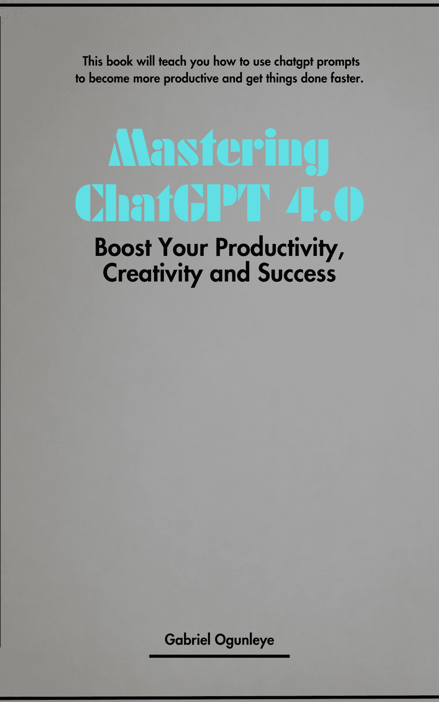

# 精通 ChatGPT 4.0：提升你的生产力、创造力和成功

> 原文：[Mastering ChatGPT 4.0: Boost Your Productivity, Creativity and Success](https://annas-archive.org/md5/c63f8ce4c658587555f12a0f79a97d71)
> 
> 译者：[飞龙](https://github.com/wizardforcel)
> 
> 协议：[CC BY-NC-SA 4.0](https://creativecommons.org/licenses/by-nc-sa/4.0/)

#1: 引言

在当今快节奏的数字时代，生产力比以往任何时候都更加重要。随着信息的爆炸和时间的日益紧张，找到更聪明地工作而不是更辛苦地工作的方式已经成为当务之急。ChatGPT 4.0 的出现，是一款旨在帮助你达到顶峰生产力的先进人工智能语言模型。

ChatGPT 4.0 不仅仅是一个工具；它是一个变革者。无论你是希望简化工作流程的商业专业人士，还是希望优化学习习惯的学生，或者是寻求新想法的创意人士，ChatGPT 4.0 都提供了丰富的可能性。这本书是你解锁这一强大 AI 全部潜能的全面指南。

"掌握 ChatGPT 4.0：提升你的生产力、创造力和成功"旨在教你如何利用 ChatGPT 来提高你的效率、创造力和整体生产力。我们将探讨实际应用、有效的沟通策略和高级技巧，帮助你充分利用这一工具。此外，我们还将讨论不要向 ChatGPT 询问的内容以及你永远不应该分享的信息，确保你负责任且安全地使用这项技术。

与我一起踏上这场旅程，借助 ChatGPT 4.0 改变你的工作方式、思维方式以及创作方式。让我们深入探讨，看看人工智能如何彻底改变你的生产力、创造力和带来甜蜜的成功！

#2: 开始使用 ChatGPT 4.0

什么是 ChatGPT？

ChatGPT 就像一个超级智能的计算机程序，它可以以与真人聊天的方式理解并与您交谈。想象一下与一个对几乎所有事情都了如指掌的智者交谈，他可以帮助您写作、回答问题、提供建议，甚至讲故事。它旨在理解您的问题并以有用和友好的方式回应。您可以用它来娱乐、学习或更高效地完成任务。

ChatGPT 代表 Chat Generative Pre-trained Transformer。以下是这一名称的分解：

+   聊天：表示它被设计用于对话交互。

+   生成：指的是它根据接收到的输入生成文本的能力。

+   预训练：意味着它在被使用之前已经在大量文本数据上进行了训练，因此它对语言和各个主题有大量的知识。

+   Transformer：指的是它使用的模型架构类型，这对于理解和生成类似人类文本非常有效。

在撰写这本小册子的时刻，ChatGPT 4.0 是 OpenAI 的生成预训练转换器最新版本，这是一个能够理解和生成类似人类文本的人工智能语言模型。经过大量数据的训练，ChatGPT 能够执行广泛的任务，从回答问题、生成内容到提供推荐和协助解决复杂问题。

如何访问和设置 ChatGPT

访问 ChatGPT 很简单。以下是一步一步的指南，帮助您开始使用：

1.  注册或登录：访问 OpenAI 网站 [`chat.openai.com/`](https://chat.openai.com/)，如果您还没有账户，请创建一个。如果您是现有用户，只需登录即可。

1.  订阅计划：选择一个符合您需求的订阅计划。虽然有一些免费选项，但高级计划提供更多功能和更高的使用限制。

1.  界面概述：登录后，熟悉 ChatGPT 的界面。您会找到一个输入框，用于输入您的查询，以及一个输出区域，ChatGPT 的响应将在此显示。

1.  设备兼容性：ChatGPT 可以通过桌面、笔记本电脑、平板电脑和智能手机上的网络浏览器访问，确保您可以在任何地方使用它。

基本功能与界面浏览

在深入研究高级用法之前，了解 ChatGPT 的基本功能是至关重要的：

1. 文本输入和输出：将您的问题或提示输入到输入框中，ChatGPT 将在输出区域生成响应。您的提示越精确和详细，您收到的响应就越好。

2. 对话历史：ChatGPT 维护您对话的上下文，允许提供更连贯和上下文相关的响应。然而，为了获得最佳结果，在每次提示中提供足够的信息是一个好习惯。

3. 定制回复：您可以通过指定您喜欢的语气、风格或格式来引导 ChatGPT 的回复。例如，您可以为商务沟通请求正式的语气，或为个人咨询请求随意的风格。

4. 编辑和精炼：如果回复不是你所期望的，你可以精炼你的提示并让 ChatGPT 再次尝试。尝试不同的措辞可以帮助你达到预期的结果。

5. 保存和导出对话：为了进行持续的项目或参考目的，您可以保存您的对话历史并在需要时导出。

通过掌握这些基本功能，你将能够有效地开始使用 ChatGPT 4.0。在接下来的章节中，我们将深入探讨具体应用、高级技术和最佳实践，以帮助您充分利用这个卓越的 AI 工具。

#3: 利用 ChatGPT 提高生产力

设定明确的目标和期望

在你能够充分发挥 ChatGPT 的潜力之前，设定明确的目标和期望至关重要。考虑一下你希望通过 ChatGPT 实现什么。你需要帮助管理任务、生成想法或简化工作流程吗？明确你的目标将帮助你更有效地使用 ChatGPT。

示例：如果你是一位正在为写作瓶颈而苦恼的作家，你的目标可能是使用 ChatGPT 来生成新的故事想法或帮助角色发展。如果你是一位项目经理，你可能使用 ChatGPT 来创建待办事项清单和管理截止日期。

使用 ChatGPT 进行任务管理

使用 ChatGPT 进行任务管理是最简单也是最有效的方法之一。通过向 ChatGPT 提供任务列表，你可以获得帮助来组织和优先处理它们。

示例：假设你有一个忙碌的一天，有多个会议、需要完成的报告和需要回复的邮件。你可以向 ChatGPT 询问：

= = = = = = = = = = = = = = = = = = = = = = = = = = = = = =

“嘿 ChatGPT，这是我今天的待办事项清单：

1. 上午 10 点与市场营销团队开会

2. 完成季度报告

3. 回复客户邮件

4. 准备明天的演示

“你能帮我优先处理这些任务并建议一个日程吗？”

= = = = = = = = = = = = = = = = = = = = = = = = = = = = = =

ChatGPT 可能会回复一个建议的日程，例如：

“当然可以！以下是一个建议的日程：

- 9 AM - 10 AM: 准备市场营销团队会议

- 10 AM - 11 AM: 参加市场营销团队会议

- 11 AM - 1 PM: 处理季度报告

- 1 PM - 2 PM: 午餐休息

- 2 PM - 3 PM: 回复客户邮件

- 3 PM - 5 PM: 继续完成季度报告

- 5 PM - 6 PM: 准备明天的演示

利用 AI 助手简化工作流程

ChatGPT 还可以通过自动化重复性任务和提供对常见问题的快速回答来帮助您简化工作流程。

示例：如果你经常需要起草邮件，你可以使用 ChatGPT 来创建模板。

= = = = = = = = = = = = = = = = = = = = = = = = = = = = = =

“你能为我创建一个会议后跟进客户的电子邮件模板吗？”

= = = = = = = = = = = = = = = = = = = = = = = = = = = = = =

ChatGPT 可能会生成如下模板：

“主题：关于我们最近会议的跟进

亲爱的[客户姓名]，

希望这封邮件找到您一切安好。我想跟进我们[日期]的会议，并讨论下一步行动。

正如我们讨论的，[简要总结关键点]。

请告知我如果您有任何问题或需要更多信息。我期待与您合作。

最好的问候，

[您的名字]”

您可以根据需要定制此模板，节省时间并确保一致性。

产品生产力的真实案例

为了说明 ChatGPT 对生产力的影响，让我们看看几个真实案例：

案例 1：内容创作

博客作者需要定期发布内容，但经常苦于找不到主题想法。通过向 ChatGPT 请求特定主题的博客文章想法，他可以在几分钟内生成一系列潜在的主题。

= = = = = = = = = = = = = = = = = = = = = = = = = = = = = =

“你能给我一些建议，关于可持续生活的博客文章想法吗？”

= = = = = = = = = = = = = = = = = = = = = = = = = = = = = =

ChatGPT 可能会这样回答：

“当然！以下是一些建议：

1. 10 种减少碳足迹的简单方法

2. 零浪费生活的益处

3. 如何开始一个社区花园

4. 可持续时尚：环保衣橱的技巧

5. 可再生能源：你需要知道的信息”

案例 2：项目管理

项目经理使用 ChatGPT 起草项目计划和进度表。通过提供基本的项目细节，他们可以快速生成全面的计划。

= = = = = = = = = = = = = = = = = = = = = = = = = = = = = =

“我需要一个新产品的项目计划。你能帮忙吗？”

= = = = = = = = = = = = = = = = = = = = = = = = = = = = = =

ChatGPT 可能会生成如下大纲：

“当然！以下是一个基本的项目计划：

1. 研发（2 个月）

- 进行市场研究

- 开发产品原型

2. 测试和反馈（1 个月）

- 与选定用户进行 Beta 测试

- 收集和分析反馈

3. 最终调整（1 个月）

- 根据反馈实施更改

- 确定产品设计

4. 市场营销和发布（2 个月）

- 制定营销策略

- 发布产品

5. 发布后审查（1 个月）

- 分析销售数据

- 收集客户反馈

- 规划未来更新”

#4: 与 ChatGPT 的有效沟通

制作精确提示

从 ChatGPT 获得最佳结果的关键是制作精确和详细的提示。您越具体，ChatGPT 就越能理解和回应您的需求。

案例：与其问“我应该写什么？”不如尝试“关于远程工作生产力技巧的博客文章，有哪些吸引人的主题？”

理解上下文和具体性

ChatGPT 依赖于您提供的上下文来生成相关的回复。始终包括必要的细节，以帮助 ChatGPT 更好地理解您的请求。

示例：如果你需要帮助规划旅行，请指定你的偏好：

= = = = = = = = = = = = = = = = = = = = = = = = = = = = = =

“我计划去纽约市进行为期 5 天的旅行。我喜欢博物馆、公园和美食。你能给我推荐一个行程吗？”

= = = = = = = = = = = = = = = = = = = = = = = = = = = = = =

ChatGPT 可能会根据你的兴趣提供一个详细的行程。

利用后续问题完善回答

如果 ChatGPT 的初始回答不是你需要的，不要犹豫，提出后续问题以完善答案。

示例：如果 ChatGPT 建议的行程包含太多的活动，你可以问：

= = = = = = = = = = = = = = = = = = = = = = = = = = = = = =

“这个看起来不错，但你能简化一下，每天只包括两个活动吗？”

= = = = = = = = = = = = = = = = = = = = = = = = = = = = = =

ChatGPT 将相应地调整行程。

有效的沟通示例

为了说明如何使用 ChatGPT 进行有效沟通，让我们看看几个例子：

示例 1：写作辅助

一个学生需要帮助起草研究论文的引言。他可以问：

= = = = = = = = = = = = = = = = = = = = = = = = = = = = = =

“你能帮我写一篇关于社交媒体对心理健康影响的研究论文的引言吗？”

= = = = = = = = = = = = = = = = = = = = = = = = = = = = = =

ChatGPT 可能会这样回答：

当然！以下是一个草稿引言：

近年来，社交媒体已成为全球数百万人的日常生活的重要组成部分。虽然这些平台提供了许多好处，包括即时沟通和信息获取，但人们对它们对心理健康的影响越来越担忧。本文探讨了社交媒体对心理健康的影响的多种方式，重点关注焦虑、抑郁和自尊等问题。通过研究当前的研究和数据，本研究旨在提供一个关于社交媒体使用与心理健康之间关系的全面理解。”

示例 2：商务沟通

一个商务专业人士需要为他的团队起草一份备忘录。他可以问：

= = = = = = = = = = = = = = = = = = = = = = = = = = = = = =

“你能帮我写一份关于即将到来的项目截止日期及其重要性的备忘录吗？”

= = = = = = = = = = = = = = = = = = = = = = = = = = = = = =

ChatGPT 可能会这样回答：

“当然！以下是一个草稿备忘录：

主题：即将到来的项目截止日期

主题：即将到来的项目截止日期

嗨，团队，

希望这条信息能让你心情愉快。我想提醒大家，我们当前项目的截止日期即将到来，请[插入日期]。我们必须保持专注并高效工作以按时完成任务至关重要。

按时完成任务对我们的客户满意度以及我们团队的成功至关重要。请确保所有任务按时完成，并尽快沟通任何潜在问题。

感谢你的辛勤工作和奉献。让我们使这个项目取得成功！

最好的问候，

[你的名字]”

通过与 ChatGPT 进行有效的沟通练习，你可以获得更精确和有用的回答，使其成为你工作和个人生活中各个方面的宝贵工具。

#5: ChatGPT 的创意用途

生成想法和头脑风暴会议

ChatGPT 是一个生成想法和头脑风暴的绝佳工具。无论你是在进行项目、策划活动，还是仅仅需要一点创意火花，ChatGPT 都能为你提供丰富的想法。

示例：想象你正在为朋友策划一个惊喜生日派对。你可以询问 ChatGPT：

= = = = = = = = = = = = = = = = = = = = = = = = = = = = = =

“你能帮我为一场 30 岁生日惊喜派对想一些有趣的主题吗？”

= = = = = = = = = = = = = = = = = = = = = = = = = = = = = =

ChatGPT 可能会这样回答：

“当然可以！这里有一些有趣的主题：

1. 80 年代复古派对 – 霓虹色彩、经典的 80 年代音乐和复古街机游戏。

2. 化装舞会 – 优雅的面具、华丽的礼服和一丝神秘感。

3. 户外探险 – 一天的徒步旅行、野餐和户外游戏。

4. 好莱坞璀璨 – 红毯、狗仔队和名人模仿大赛。

5. 海滩派对 – 热带装饰、沙滩排球和篝火。

用这些想法，你可以选择一个符合你朋友个性的主题，创造一个难忘的庆祝活动。

写作和内容创作

无论你是在写博客文章、故事，甚至商业提案，ChatGPT 都能帮助你快速有效地生成内容。你可以用它来起草章节、获取对写作的反馈，甚至头脑风暴情节转折。

示例：如果你是一位需要为关于健康饮食的下一篇文章寻找灵感的博主，你可能会这样问：

= = = = = = = = = = = = = = = = = = = = = = = = = = = = = =

“你能帮我写一篇关于健康饮食益处的博客文章的引言吗？”

= = = = = = = = = = = = = = = = = = = = = = = = = = = = = =

ChatGPT 可能会这样回答：

“当然可以！这里有一个草稿介绍：

健康饮食不仅仅是关于减肥或穿上你最喜欢的牛仔裤。它关乎感觉良好、拥有更多能量和改善你的整体健康。从增强你的免疫系统到提升你的情绪，健康饮食的好处是无穷无尽的。在这篇博客文章中，我们将探讨一些将营养食品融入你的饮食可以改变你生活的最顶尖理由。”

你可以在此基础上构建，完成你的博客文章。

问题解决和决策支持

ChatGPT 还可以通过提供不同的观点和解决方案来帮助你分析和做出决定。

示例：假设你正在考虑是否接受一份提供更高薪酬但需要搬迁的新工作。你可以询问 ChatGPT：

= = = = = = = = = = = = = = = = = = = = = = = = = = = = = =

“你能帮我权衡一下接受一份提供更高薪酬但需要搬迁的新工作的利弊吗？”

= = = = = = = = = = = = = = = = = = = = = = = = = = = = = =

ChatGPT 可能会这样回答：

“当然！以下是一些需要考虑的优缺点：

优点：

1. 更高的薪水 – 更好的财务稳定性和更多的可支配收入。

2. 职业发展 – 新的机会和挑战。

3. 新体验 – 探索不同的城市和结识新朋友。

缺点：

1. 重新安置压力 – 移动和适应新环境的麻烦。

2. 离开支持网络 – 远离家人和朋友。

3. 生活成本 – 新地点可能更昂贵。

通过考虑这些因素，你可以对工作机会做出更明智的决定。

#6: 数据安全和隐私

与 ChatGPT 分享时应避免的信息

虽然 ChatGPT 是一个强大的工具，但重要的是要记住它是由 OpenAI 开发的 AI，并且有一些类型的信息你应该避免分享以保护你的隐私和安全。

示例：避免分享敏感的个人信息，如你的社会保险号码、银行账户详情或密码。例如，而不是询问：

= = = = = = = = = = = = = = = = = = = = = = = = = = = = = =

“ChatGPT，这是我的信用卡号码。你能帮我查看是否有任何可疑的收费吗？”

= = = = = = = = = = = = = = = = = = = = = = = = = = = = = =

你应该直接联系你的银行或信用卡提供商以查询此类信息。

理解 AI 隐私保护限制

ChatGPT 设计用于尊重用户隐私和保密性，但仍然谨慎行事是个好习惯。了解 ChatGPT 虽然不会永久存储个人对话，但总是更安全一些。

示例：如果你在讨论商业策略或机密项目细节，请保持信息的一般性：

= = = = = = = = = = = = = = = = = = = = = = = = = = = = = =

“ChatGPT，你能建议我如何改进营销项目的团队协作吗？”

= = = = = = = = = = = = = = = = = = = = = = = = = = = = = =

而不是提供具体名称或专有信息。

保护个人数据的最佳实践

为了确保你安全且负责任地使用 ChatGPT，请遵循以下最佳实践：

1. 概括敏感信息：不要分享具体细节，而使用一般性术语。

示例：“我该如何保护我的在线账户？”而不是“我该如何保护[特定电子邮件地址]的电子邮件密码？”

2. 避免分享个人身份信息（PII）：不要分享你的全名、地址、电话号码、电子邮件或其他个人身份信息。

示例：“如果我丢失了手机，我该怎么做？”而不是“我丢失了带有[特定号码]的手机，我该怎么做？”

3. 使用安全渠道进行敏感通信：对于需要高度安全的信息，请使用加密和安全的通信渠道。

示例：如果你需要分享敏感的商业文件，请使用具有强大加密功能的加密电子邮件服务或云存储，而不是通过 ChatGPT 讨论细节。

通过遵循这些指南，你可以在保护隐私和数据安全的同时，安全地利用 ChatGPT 的功能。

#7：常见错误及其避免方法

误导性或含糊不清的提示

用户在与 ChatGPT 互动时遇到的最常见问题之一是使用误导性或含糊不清的提示。这可能导致混淆或不相关的响应。

示例：假设你问，“最好的改进方法是什么？”这个问题太含糊了。改进什么？你的健康？你的写作技巧？你的烹饪技巧？

更好的提示：“我如何改进我的专业电子邮件的写作技巧？”

通过具体化，你为 ChatGPT 提供了提供有用答案所需的上下文。

插图：

- 含糊提示：“告诉我关于技术的事情。”

- 具体提示：“你能解释区块链技术是如何工作的，以及它在金融领域的潜在应用吗？”

过度依赖 AI 执行关键任务

虽然 ChatGPT 是一个强大的工具，但过度依赖它执行关键任务是有风险的。始终双重检查重要信息，并使用人工判断做出关键决策。

示例：使用 ChatGPT 起草重要的商业提案是可以的，但你应该自己审查和改进内容，以确保其满足所有要求并传达正确的信息。

插图：

- AI 草稿：“我们建议通过数字营销策略扩大我们的市场覆盖范围……”

- 人工审核：检查语气、清晰度和准确性。确保其与公司的目标和价值观一致。

确保人工监督和验证

人工监督对于验证 ChatGPT 生成的输出至关重要。在处理敏感或复杂问题时尤为重要。

示例：如果你使用 ChatGPT 生成财务报告，请确保使用自己的计算和分析来验证数据和结论。

插图：

- AI 生成内容：“第三季度的预期收入增长为 15%。”

- 人工验证：与实际财务数据和市场分析交叉核对，以确认准确性。

避免常见错误的小贴士

1.  保持具体：始终提供清晰和详细的提示。例如：“每天吃苹果的健康益处是什么？”

1.  双重检查信息：将 ChatGPT 作为起点，但亲自验证重要细节。例如：“ChatGPT 说我们的销售额增加了 20%。让我们用我们的实际销售数据来验证这一点。”

1.  保持人工控制：使用你的判断力和专业知识来引导最终结果。例如：“ChatGPT 建议一个新的营销策略。我会调整它以适应我们的品牌和受众。”

#8：高级技巧和窍门

将 ChatGPT 与其他生产力工具集成

当 ChatGPT 与其他生产力工具集成时，它可以变得更加强大。这可以简化你的工作流程，使任务更易于管理。

示例：将 ChatGPT 集成到你的项目管理软件，如 Trello 或 Asana 中，以生成任务列表或项目时间表。

插图：

- 使用 ChatGPT 与 Trello：

- 提示： "ChatGPT，帮助我创建一个在 Trello 上发布新产品的任务清单。"

- 回复：ChatGPT 生成市场研究、产品开发、测试、营销策略和发布等任务。

使用特定命令定制回答

您可以通过指定您喜欢的语气、风格或格式来引导 ChatGPT 的回答。

示例：如果您需要一份专业的电子邮件草稿，您可能会说：

= = = = = = = = = = = = = = = = = = = = = = = = = = = = = =

"你能草拟一封正式的电子邮件给客户，通知他们他们的订单有延误吗？"

= = = = = = = = = = = = = = = = = = = = = = = = = = = = = =

插图：

- 提示： "写一封正式的电子邮件为发货延误道歉。"

- 回复：

主题：发货延误道歉

亲爱的[客户姓名]，

我希望这条信息能找到您一切安好。我写信是想通知您，您订单编号#[订单编号]的发货出现了意外延误。我们对由此带来的任何不便深表歉意。

我们团队正在努力解决这个问题，并预计您的订单将在[新交货日期]发货。我们感谢您在此事上的耐心和理解。

如果您有任何问题或疑虑，请随时与我们联系。

最好的问候，

[您的姓名]

利用第三方插件和扩展

通过使用第三方插件和扩展来增强 ChatGPT 的功能。这些工具可以帮助自动化任务，提高准确性，并添加新功能。

示例：使用像“Grammarly”这样的语法检查插件来润色 ChatGPT 的草稿。

插图：

- 在插件之前： "ChatGPT，草拟一篇关于冥想益处的博客文章。"

- 回复： "冥想可以帮助减轻压力，提高专注力，并促进平静和放松的感觉。"

- 在插件之后： "冥想可以显著降低压力水平，提高专注力，并培养深刻的平静和放松感。"

高级使用实例

1. 项目规划：将 ChatGPT 与像 Monday.com 这样的工具集成，以实现高效的项目规划。示例： "ChatGPT，为我们即将到来的营销活动创建一个项目时间表。"

2. 内容创作：将 ChatGPT 与像 Canva 这样的设计工具结合使用，以生成内容想法和视觉元素。示例： "ChatGPT，为我们新产品发布提出五个社交媒体帖子想法。"

3. 数据分析：将 ChatGPT 与 Tableau 等数据分析工具结合，以获得更深入的见解。示例： "ChatGPT，分析上一季度的销售数据，并提出关键趋势。"

通过使用这些高级技巧和窍门，您可以最大限度地发挥 ChatGPT 的潜力，并显著提高您的生产力。无论是与其他工具集成、定制回答还是利用第三方插件，这些策略都将帮助您充分利用 ChatGPT。

#9: 道德考量

人工智能的道德使用

这里是关键。AI，就像 ChatGPT，是一个强大的工具。但权力越大，责任越大。你必须负责任地使用它。没有捷径，没有不正当的商业行为。这是利用这个工具来提高你的生产力，同时保持你的正直。

示例：不要使用 ChatGPT 来操纵或欺骗人们。如果你在撰写电子邮件，要诚实直接。

插图：

- 不道德的提示："ChatGPT，写一封电子邮件让我的竞争对手看起来很糟糕。"

- 道德提示："ChatGPT，写一封电子邮件，突出我们产品的独特优势。"

人工智能响应中的偏见和局限性

人工智能并不完美。它是建立在可能包含偏见的数据之上的。当你使用 ChatGPT 时，要意识到这一点。你的工作是过滤掉任何有偏见或不恰当的回应。

示例：如果你注意到 ChatGPT 建议了一些让你感到不舒服的事情，不要只是接受它。运用你的判断力。

插图：

- 偏见的回应："我们的产品是最佳的，因为竞争对手无法匹配我们的质量。"

- 过滤后的回应："我们的产品提供独特的优势，在市场上脱颖而出。"

负责任的 AI 互动指南

交易是这样的：你需要负责任地与 ChatGPT 互动。把它当作一个工具，而不是拐杖。它在这里是为了帮助你，而不是做所有重活。

示例：使用 ChatGPT 来生成想法，但确保你正在添加自己的专业知识和见解。

插图：

- 过度依赖："ChatGPT，为我写整个商业计划。"

- 负责任的使用："ChatGPT，为我提供一个商业计划的提纲，然后我会填写细节。"

#10：案例研究和成功故事

成功使用 ChatGPT 的详细案例研究

好吧，让我们进入一些真实的话题。以下是一些 ChatGPT 如何将生产力提升到新水平的案例研究。

案例研究 1：企业家

见蒂姆，一个有远见但时间有限的企业家。蒂姆使用 ChatGPT 来简化他的日常任务和生成营销内容。他从花费数小时在社交媒体帖子中转变为几分钟就能完成。

示例：

- 在 ChatGPT 之前：蒂姆很难找到他帖子中的正确词语，通常每个帖子要花一个小时。

- 在 ChatGPT 之后：蒂姆向 ChatGPT 寻求内容想法和草稿，将每个帖子的时间缩短到 10 分钟。

插图：

- 提示："ChatGPT，给我五个吸引人的 Instagram 产品新产品的标题。"

- 反馈：

1. "改变你的身体，改变你的生活。#FitnessGoals"

2. "用我们顶级装备击败你的锻炼。#GymLife"

3. "今天提升你的健身水平！#HealthyLiving"

4. "准备好大汗淋漓了吗？让我们出发！#FitnessJourney"

5. "提升你的健身，提升你的生活。#WorkoutMotivation"

来自不同用户的证词和经验

现在，让我们听听那些经历过、做过并看到了结果的人。

证词 1：忙碌的专业人士

约翰，一位市场营销主管，使用 ChatGPT 来处理客户沟通和项目管理。他的生产力激增。

示例：

- 约翰的经验： "在 ChatGPT 之前，我邮件如山。现在，我几秒钟就能起草回复，并让客户满意。"

插图：

- 提示： "ChatGPT，为客户起草一封关于项目更新的电子邮件。"

- 响应：

主题：项目更新

嗨 [客户姓名]，

我希望这封邮件能找到您一切安好。我想向您提供我们当前项目的更新。我们已经完成了初步研究阶段，现在正在进入开发阶段。

如果您有任何问题或需要更多信息，请告知我。

最好的祝愿，

约翰

经验教训和最佳实践

这就是关键：明智、道德和高效地使用 ChatGPT。这是一个可以改变你生产力的工具，但它需要你的输入才能发光。

示例：始终回顾并个性化 ChatGPT 生成的内容。让它成为你自己的。

插图：

- 生成内容： "我们公司兴奋地宣布我们的新产品。"

- 个性化内容： "我很高兴与您分享，我们即将推出一款对我们团队来说具有革命性意义的新产品。迫不及待想让您尝试！"

通过遵循这些案例研究和推荐，你将亲眼看到 ChatGPT 如何成为提高你生产力的游戏改变者。利用这些经验和最佳实践，充分利用这个强大的 AI 工具。

#11：人工智能与生产力的未来

人工智能与生产力的新兴趋势

未来已经到来，它充满了即将彻底改变我们做事方式的 AI 创新。我们谈论的是将使 ChatGPT 看起来像打字机相比即将到来的东西。如果你想领先一步，你必须关注这些新兴趋势。

示例：考虑一下 AI 驱动的个人助理，它不仅能安排你的会议，还能预测你的需求，比如建议何时休息或何时继续推进。

插图：

- 当前 AI： "ChatGPT，安排下午 3 点的会议。"

- 未来 AI： "嘿 [你的名字]，你即将面临一个紧张的截止日期。我已经安排了下午 3 点的无干扰高效工作小时。之后，休息 15 分钟以获得最佳生产力。"

ChatGPT 的未来更新和潜力

ChatGPT 已经非常强大，但它的功能只会越来越好。未来的更新将使这个工具更加直观、高效和强大。想象一下，一个可以无缝集成到所有你的应用程序中、预测你下一步需要什么，甚至在你压力大时提供情感支持的 ChatGPT。

示例：未来的版本可能会提供实时协作功能，让你和 ChatGPT 可以同时在一个文档上工作，使其更加互动和动态。

插图：

- 当前 ChatGPT： "ChatGPT，起草一封关于项目更新的电子邮件。"

- 未来 ChatGPT： "嘿 [你的名字]，我已经开始为你起草那封电子邮件。第一行怎么样？我们是否应该添加客户最近取得的成就作为个人化的点缀？"

准备应对不断发展的 AI 领域

朋友们，你们必须为 AI 革命做好准备。这意味着要保持学习、适应，并始终寻找将 AI 融入工作流程的方法。不要等待未来来找你；走出去，抓住它的牛角。

示例：首先了解最新的 AI 工具以及它们如何补充 ChatGPT。也许是一个帮助数据分析的 AI，或者是一个优化你社交媒体策略的 AI。

插图：

- 积极主动的方法："我每个月都要探索新的 AI 工具，看看它们如何提高我的生产力。"

- 被动方法："我会等到有人告诉我最新的 AI 趋势。"

拥抱未来的实用步骤

1. 保持更新：关注 AI 新闻，加入论坛，参加网络研讨会。示例：订阅 AI 通讯或参加关于最新 AI 技术的在线研讨会。

2. 尝试新工具：不要害怕尝试新的 AI 工具，看看它们如何融入你的工作流程。示例：注册新 AI 软件的测试版程序并提供反馈。

3. 无缝集成 AI：寻找让 AI 成为你日常运营自然部分的方法。示例：使用 AI 自动化重复性任务，让你能专注于高影响活动。

插图：

- 保持更新："每个周一，我将花一个小时了解最新的 AI 发展。"

- 实验："这个月，我正在测试一个帮助客户服务响应的新 AI 工具。"

- 集成："我已经设置 AI 来处理所有我的电子邮件分类和优先级排序，这样我可以专注于战略规划。"

拥抱变化，引领潮流

这里还有一个挑战：未来属于那些准备好适应和进化的人。AI 不是来取代你的；它是来提升你的。拥抱变化，利用这些工具的优势，并引领潮流。记住，这不仅仅是工作更努力；这是工作更聪明。

示例：想象一下领导一个团队，每个人都充分利用 AI。生产力飙升，创造力流淌，成果显著。

插图：

- 旧方法："让我们加班来赶上这个截止日期。"

- 新方法："让我们使用 AI 优化我们的工作流程，高效地完成截止日期。"

AI 和生产力未来的前景光明，它正在等待你去抓住。走在曲线的前面，利用 ChatGPT 和其他 AI 工具的力量，让你的生产力飙升。让我们走出去，让未来成为现实。

#12：每个人都应该知道的 50 个重要提示

高效提示构建的介绍

亲爱的读者，在利用 ChatGPT 力量的旅途中，正确的问题可以引导我们找到深刻的答案。我们提供的提示的质量直接影响我们获得的价值。让我们深入了解 50 个基本提示，这些提示可以解锁巨大潜力，提高生产力，并提升我们的生活。

生产力和时间管理

1. 每日任务清单："ChatGPT，帮我创建今天的任务清单。"

正确的提示：“ChatGPT，我需要一个忙碌周一的任务清单，包括会议、电子邮件和项目工作。”

2. 任务优先级：“ChatGPT，我应该如何优先处理今天的任务？”

正确的提示：“ChatGPT，我有五个任务：电子邮件回复、项目报告、客户会议、团队简报和市场调研。请帮我优先排序。”

3. 时间块：“ChatGPT，你能帮我制定一天的时间块日程吗？”

正确的提示：“ChatGPT，我想从上午 9 点到下午 5 点安排时间，包括休息和专注的工作时段。”

4. 每周计划：“ChatGPT，帮助我有效地规划我的周。”

正确的提示：“ChatGPT，我星期二和星期四有会议。请帮我围绕这些会议规划我的一周。”

5. 目标设定：“ChatGPT，指导我设定这个月的目标。”

正确的提示：“ChatGPT，我想为本月我的职业和个人成长设定可实现的目标。”

灵感生成和头脑风暴

6. 内容想法：“ChatGPT，给我一些关于领导力的博客文章想法。”

正确的提示：“ChatGPT，建议一些探讨领导力和管理不同方面的博客文章主题。”

7. 创意写作提示：“ChatGPT，提供一些短篇小说的创意写作提示。”

正确的提示：“ChatGPT，给我一个设定在小镇上的神秘短篇小说的提示。”

8. 商业想法：ChatGPT，为科技行业提出一些创新商业想法。”

正确的提示：“ChatGPT，有哪些专注于人工智能和机器学习的独特创业想法？”

9. 项目想法：“ChatGPT，我需要为团队下个季度提供项目想法。”

正确的提示：“ChatGPT，我们可以在第三季度进行哪些有影响力的项目来提高生产力？”

10. 头脑风暴技巧：“ChatGPT，有哪些有效的头脑风暴技巧？”

正确的提示：“ChatGPT，我该如何促进与团队的有益的头脑风暴会议？”

写作和内容创作

11. 撰写电子邮件：“ChatGPT，草拟一封请求会议的专业电子邮件。”

正确的提示：“ChatGPT，给一位潜在客户写一封请求讨论合作机会的电子邮件。”

12. 撰写文章：“ChatGPT，帮助我写一篇关于远程工作益处的文章。”

正确的提示：“ChatGPT，提供一篇讨论远程工作对员工和雇主优势的文章草稿。”

13. 社交媒体帖子：“ChatGPT，为我们新产品发布创建吸引人的社交媒体帖子。”

正确的提示：“ChatGPT，为我们新的环保产品线生成 Instagram 配文。”

14. 编辑内容：“ChatGPT，编辑这段话，使其更清晰和简洁。”

正确的提示：“ChatGPT，改进关于我们公司使命陈述的这段话的清晰度。”

15. 创建大纲：“ChatGPT，帮助我概述一本关于个人财务的新电子书。”

正确的提示：“ChatGPT，提供一本涵盖预算、储蓄和投资的电子书大纲。”

个人发展和学习

16. 学习新技能：“ChatGPT，我如何有效地学习一项新技能？”

正确的提示：“ChatGPT，建议快速高效学习弹吉他的方法。”

17. 阅读推荐：“ChatGPT，推荐一些关于领导和自我提升的书籍。”

正确的提示：“ChatGPT，对于有抱负的领导者，有哪些必读的书籍？”

18. 每日肯定：“ChatGPT，给我一些增强自信的每日肯定话语。”

正确的提示：“ChatGPT，提供肯定的话语来提升我的自尊和自信。”

19. 提高工作效率的技巧：“ChatGPT，有哪些提高在家工作效率的技巧？”

正确的提示：“ChatGPT，我如何在工作远程时保持专注和高效？”

20. 实现目标：“ChatGPT，帮助我制定一个实现健身目标的计划。”

正确的提示：“ChatGPT，概述一个逐步计划，以实现我跑马拉松的目标。”

问题解决和决策

21. 分析问题：“ChatGPT，帮助我分析团队士气低落的问题。”

正确的提示：“ChatGPT，哪些因素可能导致我团队士气低落，我该如何应对？”

22. 决策框架：“ChatGPT，建议一些用于商业策略的决策框架。”

正确的提示：“ChatGPT，我可以使用哪些框架来做出战略性的商业决策？”

23. 冲突解决：“ChatGPT，我如何解决团队成员之间的冲突？”

正确的提示：“ChatGPT，提供调解同事间冲突的步骤。”

24. 风险评估：“ChatGPT，帮助我评估进入新市场的风险。”

正确的提示：“ChatGPT，进入欧洲市场的潜在风险和回报是什么？”

25. 创意解决方案：“ChatGPT，建议一些降低运营成本的创意解决方案。”

正确的提示：“ChatGPT，我们的公司如何在不降低质量的情况下降低成本？”

数据分析和研究协助

26. 市场调研：“ChatGPT，帮助我为我们的新产品进行市场调研。”

正确的提示：“ChatGPT，我应该分析哪些关键指标来了解我们新应用的市场？”

27. 数据解读：“ChatGPT，解读我们最新的客户满意度调查数据。”

正确的提示：“ChatGPT，我们可以从客户偏好调查数据中获得哪些见解？”

28. 竞争对手分析：“ChatGPT，为我们行业进行竞争对手分析。”

正确的提示：“ChatGPT，我们的主要竞争对手是谁，他们的优势和劣势是什么？”

29. 趋势识别：“ChatGPT，识别数字营销的最新趋势。”

正确的提示：“ChatGPT，我们应该考虑哪些社交媒体营销的当前趋势？”

30. 生成报告：“ChatGPT，生成我们上季度销售表现的报告。”

正确的提示：“ChatGPT，总结我们第二季度的销售数据，并突出关键绩效领域。”

沟通与社交媒体

31. 撰写信息：“ChatGPT，帮我为我们的客户撰写一条关于服务更新的信息。”

正确提示：“ChatGPT，写一条通知客户我们应用新功能的短信。”

32. 社交媒体策略：“ChatGPT，为我们的品牌制定社交媒体策略。”

正确提示：“ChatGPT，制定增加我们 Instagram 参与度的策略。”

33. 处理询问：“ChatGPT，提供常见客户询问的回复。”

正确提示：“ChatGPT，如何回应询问我们退货政策的客户？”

34. 公共关系：“ChatGPT，为我们的新产品发布草拟一份新闻稿。”

正确提示：“ChatGPT，为我们的环保包装发布撰写一份新闻稿。”

35. 参与策略：“ChatGPT，建议增加我们 LinkedIn 页面参与度的方法。”

正确提示：“ChatGPT，我们如何鼓励更多互动和评论在 LinkedIn 帖子上的？”

学术提示

36. 论文大纲：“ChatGPT，帮助我概述一篇关于气候变化影响的论文。”

正确提示：“ChatGPT，为讨论气候变化的社会和经济影响的 5 段论文提供一个大纲。”

37. 论文陈述：“ChatGPT，能帮我为关于可再生能源的研究论文撰写一个强有力的论文陈述吗？”

正确提示：“ChatGPT，为探讨可再生能源采用的好处和挑战的论文提出一个论文陈述。”

38. 学习指南：“ChatGPT，为我即将到来的生物学考试创建一份学习指南。”

正确提示：“ChatGPT，针对高中关于细胞呼吸和光合作用的生物测试，我应该关注哪些关键主题？”

简历撰写

39. 简历要点：“ChatGPT，帮助我写一些关于我作为项目经理经验的引人注目的要点。”

正确提示：“ChatGPT，生成突出我作为科技行业项目经理成就和职责的要点。”

40. 求职信：“ChatGPT，为市场营销职位草拟一份吸引人的求职信。”

正确提示：“ChatGPT，为科技公司市场营销职位写一份求职信，强调我在数字营销方面的技能和经验。”

41. 简历摘要：“ChatGPT，为我作为软件工程师的简历创建一份专业摘要。”

正确提示：“ChatGPT，为拥有 5 年开发网络应用经验的软件工程师写一份总结。”

学术研究和文献综述

42. 文献综述总结：“ChatGPT，总结关于医疗保健中机器学习的近期研究的关键点。”

正确提示：“ChatGPT，提供关于机器学习算法在医疗诊断中应用近期研究发现的总结。”

43. 研究提案想法：“ChatGPT，为环境科学博士提供研究提案想法。”

正确提示：“ChatGPT，针对关注可持续农业实践的博士论文，有哪些创新的研究主题？”

44. 引用辅助：“ChatGPT，帮助我格式化 APA 风格的论文引用。”

正确的提示：“ChatGPT，如何在我的可再生能源技术文献综述中引用 APA 格式的期刊文章？”

其他有用的提示

45. 活动策划：“ChatGPT，帮助我策划公司 retreat。”

正确的提示：“ChatGPT，建议一些团队建设活动的地点。”

46. 旅行行程：“ChatGPT，为我制定一个为期一周的纽约市旅行行程。”

正确的提示：“ChatGPT，为我规划一个包含活动、餐厅和观光的 7 天纽约市行程。”

47. 健康习惯：“ChatGPT，推荐一些可以融入日常生活的健康习惯。”

正确的提示：“ChatGPT，我可以采取哪些简单的习惯来改善我的健康？”

48. 预算技巧：“ChatGPT，提供创建个人预算的技巧。”

正确的提示：“ChatGPT，我如何创建一个帮助我省钱和管理开支的预算？”

49. 学习策略：“ChatGPT，建议有效的学习新语言策略。”

正确的提示：“ChatGPT，学习西班牙语的最佳方法是什么？”

50. 烹饪食谱：“ChatGPT，给我一份健康晚餐的食谱。”

正确的提示：“ChatGPT，提供一份营养且易于制作的晚餐食谱。”

#13：结论

亲爱的朋友，

当我们结束“掌握 ChatGPT 4.0：提升生产力、创造力和成功”的旅程时，我想花点时间回顾我们一起探索的关键见解，并强调前方巨大的潜力。能够引导你们进入 ChatGPT 及其众多应用的迷人世界是一种荣幸。

关键点回顾

1. 开始使用：我们从基础知识开始——了解 ChatGPT 是什么，如何访问和设置它，以及熟悉其界面。这些基础步骤对于充分利用这个强大工具至关重要。

2. 提高生产力：我们深入探讨了使用 ChatGPT 提高生产力的实用方法。从任务管理、时间块到目标设定和工作流程优化，我们涵盖了所有内容。记住，关键是要在提示中具体和明确。

3. 有效沟通：制作精确的提示和了解上下文被认为是与 ChatGPT 进行有效沟通的必要条件。我们还探讨了如何利用后续问题来细化回答并取得最佳结果。

4. 创意用途：ChatGPT 不仅仅是一个生产力工具；它还是一个创意动力源。我们讨论了生成想法、头脑风暴、内容创作，甚至问题解决。当你与 AI 结合发挥创意时，可能性是无限的。

5. 数据安全和隐私：我们强调了保护个人信息的必要性。知道什么不要分享以及理解 AI 隐私保护的限制对于负责任的使用至关重要。

6. 避免常见陷阱：我们确定了常见的陷阱，如含糊的提示和过度依赖人工智能，并提供了避免这些陷阱的策略。确保人类监督和验证对于保持对输出的控制至关重要。

7. 高级技巧和窍门：将 ChatGPT 与其他生产力工具集成、定制响应和利用第三方插件可以将你的生产力提升到新的高度。人工智能的未来在于无缝集成和智能使用。

8. 道德考量：道德地使用人工智能至关重要。我们讨论了保持诚信、识别偏见和负责任地与人工智能互动的重要性。道德使用确保人工智能始终是一股正能量。 

9. 成功故事和最佳实践：真实案例和证词展示了 ChatGPT 的变革力量。通过遵循最佳实践并从这些成功中学习，你可以解锁这个工具的全部潜力，从而提高你的生产力、创造力和成功。 

10. 人工智能与生产力的未来：未来充满希望，人工智能正准备彻底改变生产力。关注新兴趋势，尝试新工具，并将人工智能无缝集成到你的工作流程中，将使你保持领先。

11. 重要的提示：最后，我们提供了一份 50 个重要提示的宝藏，每个人都应该知道。这些提示是你与 ChatGPT 互动的起点，涵盖了广泛的应用。虽然它们并不全面，但应该能给你提供如何编写提示的想法。

最后的思考

随着我们即将结束，我想强调的是，ChatGPT 不仅仅是一个工具——它是你在通往更高生产力和创造力的旅程中的伙伴。以开放的心态拥抱它，道德地使用它，让它放大你的能力。我期待着你应用所学，看到它对你的工作和生活产生的积极影响。

感谢你加入我的这次旅程。你对学习和成长的承诺真正令人鼓舞。让我们共同期待一个与 ChatGPT 一起更加高效、有创造力和充实的未来！
