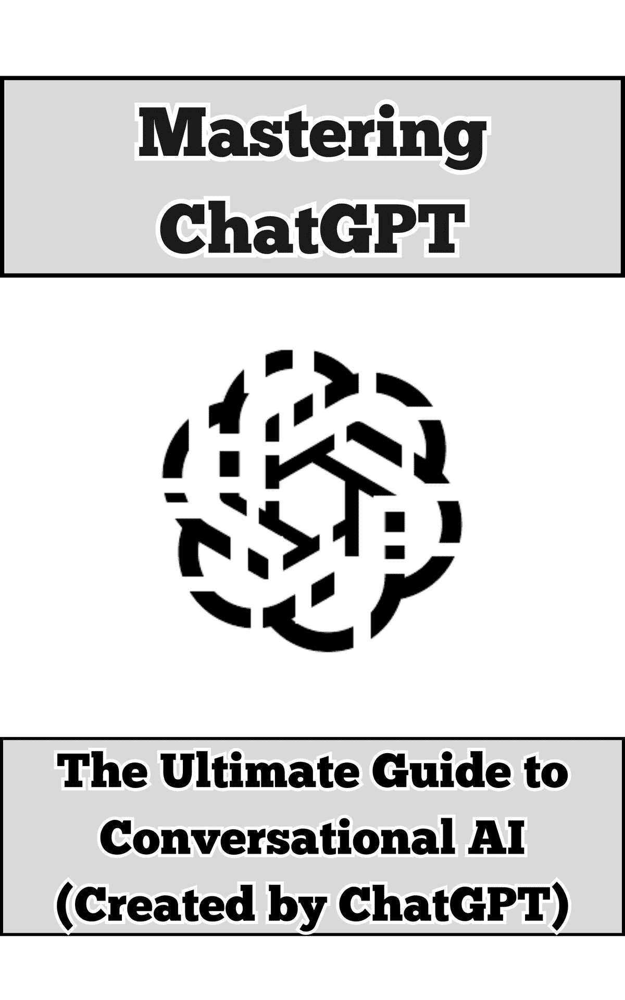

# 精通 ChatGPT：对话人工智能终极指南

> 原文：[Mastering ChatGPT: The Ultimate Guide to Conversational AI ](https://annas-archive.org/md5/b0fd15010383f35c3e9bdb1a84ff822e)
> 
> 译者：[飞龙](https://github.com/wizardforcel)
> 
> 协议：[CC BY-NC-SA 4.0](https://creativecommons.org/licenses/by-nc-sa/4.0/)



# 引言

人工智能（AI）不再局限于科幻领域——它正在塑造我们生活、工作和与世界互动的方式，成为一股变革力量。在这个领域的众多创新中，ChatGPT 已经崛起为一个强大的工具，重新定义了我们与技术互动的方式。由 OpenAI 开发，ChatGPT 是一个旨在生成类似人类响应的对话式 AI 模型，使其能够在无数场景中促进动态和有意义的交流。

这本指南是您开启 ChatGPT 潜能的钥匙。无论您是寻找创新教学工具的教育者、希望优化工作流程的专业人士，还是寻求激发新想法的创意人士，这本书都将作为您掌握这一变革性技术的可靠伴侣。

ChatGPT 不仅仅是一个聊天机器人——它是一个多才多艺的合作伙伴。它能够协助内容创作、编程、头脑风暴，甚至个人组织，其应用范围广泛，影响深远。然而，尽管功能强大，ChatGPT 也存在局限性。了解如何有效地与之沟通、制定精确的提示以及批判性地解读其输出，对于充分发挥其潜力至关重要。

在本指南中，我们将深入探讨 ChatGPT 是什么、它是如何工作的以及如何有效地使用它。您将学习如何制定能够产生最佳结果的提示，探索现实世界的应用案例，并发现将 ChatGPT 融入个人和职业生活的先进技术。此外，我们还将讨论 AI 的伦理影响以及如何负责任地使用它，确保您与 ChatGPT 的互动既富有成效又遵循原则。

在本指南结束时，您不仅将掌握 ChatGPT 的技术方面，还将对其在人工智能演变格局中的作用有更深入的理解。这不仅仅是一本手册——它是一张导航图，引导我们进入一个 AI 驱动工具变得不可或缺的世界。让我们共同探索 ChatGPT 如何帮助您实现更多、思考更广阔、工作更高效。

* * *

# 第一章：理解 ChatGPT

想象一下，与技术的对话就像与朋友聊天一样自然和直观。欢迎来到 ChatGPT 时代——一个如此先进的 AI，只需几个简单的提示就能撰写文章、解决复杂问题，甚至激发创意想法。但 ChatGPT 究竟是什么，它是如何工作的呢？在本章中，我们将揭开这个革命性工具的神秘面纱，探讨其设计、优势以及它以令人惊讶的方式改变我们日常生活的各种方式。让我们深入探索吧！

1.1 什么是 ChatGPT？

ChatGPT 是由 OpenAI 开发的高级对话 AI 模型，旨在根据用户提供的上下文生成类似人类的文本。在其核心，ChatGPT 作为一个智能助手，能够参与细微和有意义的对话，回答问题，解决问题，并在各个主题上提供见解。了解 ChatGPT 需要深入了解其底层架构、应用以及定义其能力的内在优势和局限性。

### ChatGPT 的设计

ChatGPT 建立在生成预训练的 Transformer（GPT）架构之上，这是一种专门从事语言处理的深度学习模型。GPT 模型通过以下方式工作：

1.  在大规模数据集上训练：在开发过程中，ChatGPT 在包含书籍、文章、网站和其他公开数据的庞大语料库上进行了训练。这个多样化的数据集使模型能够学习语言模式、上下文关系和风格变化。

1.  标记化：该模型通过将输入文本分解成称为标记的更小单元来处理输入文本，这些标记代表单词、子词或字符。通过分析标记及其关系，ChatGPT 预测下一个标记序列以生成连贯且与上下文相关的响应。

1.  注意力机制：GPT 架构采用诸如自注意力等机制，专注于输入上下文的相关部分，使其能够生成与用户意图一致的输出。

### ChatGPT 的优势

ChatGPT 的功能使其成为适用于广泛用例的多功能工具。其关键优势包括：

● 类似人类的对话：该模型生成的文本模仿自然的人类对话，使其适合互动和直观的交流。

● 跨领域适应性：ChatGPT 可以轻松地在主题之间切换，在教育、技术、商业和艺术等多样化的领域中提供见解。

● 创造性问题解决：用户可以利用 ChatGPT 来头脑风暴想法，生成独特的内容，并探索挑战的替代方法。

● 多语言能力：ChatGPT 支持多种语言，使其能够跨越语言和文化界限帮助用户。

● 编程和技术支持：开发者可以使用 ChatGPT 生成代码、调试和学习新的编程概念。

### ChatGPT 的局限性

尽管设计先进，ChatGPT 并非没有限制。理解这些限制对于有效地使用该模型至关重要：

1.  缺乏真正的理解：ChatGPT 不具备意识或理解能力；它基于模式生成响应，而不是真正的理解。

1.  偶尔的不准确性：虽然 ChatGPT 可以生成高度准确的结果，但它也可能生成不正确或误导性的信息，尤其是在细微或高度专业化的主题上。

1.  依赖输入质量：用户提示的质量和具体性会显著影响 ChatGPT 响应的相关性和准确性。含糊或模糊的输入可能导致不满意的结果。

1.  无法访问实时信息：ChatGPT 的知识是静态的，限于其最后更新时的数据。除非明确集成外部工具，否则它无法访问实时信息或事件。

1.  潜在偏见：由于 ChatGPT 从公开可用的文本中学习，它可能会无意中反映其训练数据中存在的偏见。用户在评估其输出时必须进行批判性判断。

### ChatGPT 在现代人工智能中的位置

ChatGPT 代表了自然语言处理（NLP）技术的重大飞跃，弥合了人工智能与人类沟通之间的差距。其发展突显了人工智能在提高生产力、创造力和学习方面的潜力，同时也提出了关于伦理使用和负责任部署的重要问题。

理解 ChatGPT 的设计、优势和局限性是有效利用其能力的第一步。有了这些基础知识，用户可以清晰地使用这个工具，最大化其好处同时减轻其不足。

* * *

1.2 核心功能

### 对话能力

ChatGPT 的核心在于其进行动态、类似人类的对话的能力。这一特性使其成为从日常互动到复杂问题解决等应用场景中不可或缺的工具。让我们更深入地探讨其对话能力以及这些能力如何使其成为一个强大的 AI 助手。

* * *

#### 上下文理解

ChatGPT 的一个显著特点是它能够维持和适应对话上下文。与传统聊天机器人提供孤立响应不同，ChatGPT 可以：

● 在多个回合中识别上下文：它记得对话中的先前交流，从而允许连贯和有意义的对话。例如，你可以问它一个问题，随后进行澄清，并期待其响应的连续性。

● 适应复杂查询：ChatGPT 能够处理多层级的查询并提供全面的答案，这使得它非常适合需要详细信息或细微讨论的用户。

* * *

#### 语气和风格适应性

ChatGPT 可以根据用户的偏好调整其语气、风格和复杂性。这种适应性使其能够：

● 反映正式程度：根据上下文参与正式或非正式的对话，例如撰写专业电子邮件或进行轻松聊天。

● 简化或扩展解释：根据用户的要求，ChatGPT 可以为初学者简化技术概念，或为专家深入探讨。

* * *

#### 在对话中的积极作用

ChatGPT 不仅仅是对提示被动响应——它通过以下方式积极参与对话：

● 提供建议：根据用户的输入提供想法或替代方案，这在头脑风暴会议中特别有用。

● 提出澄清问题：如果提示含糊不清，ChatGPT 可以要求更多细节以确保其响应相关且准确。

* * *

#### 跨领域专业知识

ChatGPT 的对话能力覆盖各种主题，使其成为全能助手。其跨领域能力包括：

● 教育讨论：它可以解释概念、回答问题或在科学、历史或数学等学科中协助学术挑战。

●      创造性对话：参与故事讲述、想法生成或艺术性头脑风暴。

● 问题解决对话：在专业环境中协作进行故障排除、编码或战略规划。

* * *

#### 处理模糊性和开放式查询

虽然不完美，ChatGPT 旨在通过以下方式导航模糊性：

● 多种观点：面对含糊的查询时，它通常会提供不同的解释或方法，赋予用户选择最相关答案的能力。

● 迭代优化：通过后续提示，用户可以优化对话以关注特定需求或澄清细节。

* * *

### 提高沟通和效率

ChatGPT 的对话能力简化了个人和职业环境中的沟通。例如包括：

●      客户支持应用：以清晰、类似人类的方式快速解决常见查询。

● 个人生产力：作为虚拟助手帮助安排日程、起草信息或优先处理任务。

●      协作工具：协助团队进行头脑风暴、报告生成或沟通策略。

* * *

### 对话环境中的挑战

虽然 ChatGPT 在许多领域表现出色，但用户应意识到其对话能力中可能存在的潜在限制：

● 误解提示：ChatGPT 高度依赖用户输入的清晰度。含糊或结构不良的提示可能导致不相关的响应。

● 上下文限制：虽然它记得会话中的先前交互，但不能跨会话保留记忆，需要用户在需要时重新建立上下文。

● 对响应过度自信：有时，ChatGPT 可能会自信地提供不正确或不完整的信息，需要用户谨慎验证输出。

* * *

ChatGPT 的对话能力是其功能的核心。通过结合上下文意识、适应性和跨领域专业知识，它使用户能够参与互动和富有成效的交流，彻底改变了我们与 AI 沟通的方式。

* * *

### 创造性问题解决

ChatGPT 最宝贵的功能之一是其进行创造性问题解决的能力，这使得它成为头脑风暴、生成创新想法和探索替代解决方案的强大工具。通过利用其庞大的训练数据和上下文推理，ChatGPT 赋予用户以独特和出乎意料的方式应对挑战。

* * *

#### 想象力生成

ChatGPT 擅长产生各种想法，无论是个人项目、专业任务还是艺术创作。

● 思维风暴会议：它可以快速为单一主题生成众多建议，帮助用户克服创作障碍。例如，如果您正在计划营销活动，ChatGPT 可以提出标语、主题或策略。

● 探索可能性：ChatGPT 可以提供对问题的全新视角，帮助用户考虑他们可能独立没有想到的选项。

● 内容构思：从小说的情节线到创新的产品设计，ChatGPT 在创意领域提供了丰富的灵感。

* * *

#### 替代解决方案

面对问题时，ChatGPT 可以提出多种解决方案，使用户能够评估和选择最佳的行动方案。

● 决策辅助：它可以概述各种方法的优缺点，帮助用户逻辑地权衡选项。

● 优化：ChatGPT 建议如何精炼现有的想法或流程，提供渐进的改进或全新的方法。

● 情景分析：用户可以描述一个挑战，ChatGPT 可以模拟不同的结果或提出成功的策略。

* * *

#### 创意写作和故事讲述

对于作家和故事讲述者来说，ChatGPT 可以作为一个无价的合作伙伴。

● 情节发展：它可以概述故事弧线，塑造人物，并创造引人入胜的冲突。

● 构建世界：ChatGPT 为虚构世界生成详细的背景、文化和历史，丰富了创意项目的深度。

● 对话和剧本：它可以创作出真实且引人入胜的对白，用于小说、戏剧或剧本。

* * *

#### 跨学科问题解决

ChatGPT 的多功能性使其能够处理各个领域的创意挑战。

● 技术创新：工程师或科学家可以使用 ChatGPT 来构思技术问题的解决方案，探索新概念或验证方法。

● 商业策略：它可以生成关于商业模式、营销策略或产品开发的创新想法。

● 教育工具：ChatGPT 帮助教育者设计引人入胜的课程计划、互动活动或创意教学辅助工具。

* * *

#### 迭代优化

创意问题解决通常涉及试错，ChatGPT 有效地支持这一迭代过程。

● 理念精炼：用户可以从一个粗略的概念开始，通过连续的提示，ChatGPT 帮助将其精炼成一个完善且可执行的计划。

● 动态反馈：它提供建设性的反馈，建议如何改进或扩展初步想法。

● 协作探索：ChatGPT 在来回互动中茁壮成长，让人感觉像是创作过程中的协作伙伴。

* * *

### 创意问题解决的应用

● 内容创作：作家、营销人员和设计师可以使用 ChatGPT 开发创新的内容或活动。

● 产品设计：创新者可以头脑风暴新的产品功能、用户体验或制造方法。

● 研究和学术界：学者可以利用 ChatGPT 的帮助来探索假设、生成研究问题或构思研究。

● 个人项目：从策划活动到 DIY 项目，ChatGPT 的创意输入可以简化并增强执行。

* * *

### 创新问题解决的局限性

虽然 ChatGPT 是一个强大的工具，但它有一些限制，用户应该牢记：

● 表面输出：对于高度专业或技术性的挑战，ChatGPT 可能并不总是能产生深入或专家级别的解决方案。

● 缺乏原创性：由于 ChatGPT 是在现有数据上训练的，其建议可能反映的是常见想法，而不是突破性的创新。

● 需要用户协作：创新问题解决通常受益于用户的迭代完善和批判性评估。ChatGPT 提供建议，但需要用户有效地引导过程。

* * *

ChatGPT 的创新问题解决能力使用户能够跳出思维定式，以新颖的视角应对挑战。通过结合其适应性、情境理解和迭代协作，它成为生成、完善和执行创意想法的无价资源。

* * *

### 多语言支持

ChatGPT 能够在多种语言中进行交互是其最灵活和最具影响力的功能之一。通过利用其广泛的训练数据，其中包括各种语言的文本，ChatGPT 可以促进跨语言和文化界限的沟通、学习和创造力。

* * *

#### 语言理解和生成

ChatGPT 被设计成能够理解和生成多种语言中的文本，使其成为多语言交流的强大工具。其功能包括：

● 识别多种语言的输入：用户可以用西班牙语、法语、德语、中文、阿拉伯语等多种语言提供提示。ChatGPT 可以解释这些输入并相应地做出回应。

● 在所需语言中生成文本：它可以创建针对用户语言偏好的文本回复、翻译或内容。

● 语言切换：ChatGPT 可以在单次对话中无缝切换语言，支持可能需要跨语言帮助的用户。

* * *

#### 翻译辅助

ChatGPT 多语言能力最实用的应用之一是翻译：

● 直接翻译：用户可以输入一种语言的文本，并收到另一种语言的准确翻译。例如，将电子邮件从英语翻译成日语。

● 在另一种语言中释义：ChatGPT 可以在相同语言中重新表述内容，或根据特定受众调整语气和风格进行翻译。

● 情境敏感性：虽然 ChatGPT 不是一个专门的翻译工具，但其情境理解通常比逐字逐句的方法提供更自然的翻译。

* * *

#### 语言学习和实践

对于旨在获取或提高语言技能的学习者，ChatGPT 提供了实质性的支持：

● 语法和句法解释：它可以阐明语法规则，并在目标语言中提供示例。

● 词汇构建：用户可以请求单词的定义、同义词、反义词或上下文适当的用法。

● 练习对话：ChatGPT 可以模拟现实生活中的对话，通过练习帮助学习者提高流利度和理解力。

● 定制练习：它可以创建语言学习练习，例如填空句子、测验或故事提示。

* * *

#### 文化适应和本地化

在另一种语言中进行有效沟通通常需要文化敏感性，ChatGPT 通过以下方式在此领域提供帮助：

● 调整语调和正式程度：它可以根据文化规范调整文本，以反映适当的正式或非正式程度。

● 习语表达：ChatGPT 可以在上下文中准确解释或使用习语和俚语，增强真实性。

● 本地化内容创作：从制作地区特定的营销材料到解决本地客户查询，ChatGPT 可以调整其输出以适应多样化的受众。

* * *

#### 多语言支持的应用

ChatGPT 的多语言能力使其在各个领域都成为一项有价值的工具：

● 全球沟通：企业在与国际客户或合作伙伴互动时，可以使用 ChatGPT 弥合语言差距。

● 客户支持：ChatGPT 使组织能够用多种语言提供支持，增强了全球受众的易用性。

● 教育：教师和学生可以使用 ChatGPT 创建或研究不同语言的内容。

● 内容本地化：创作者可以为不同地区的受众调整其材料，确保相关性和影响力。

* * *

#### 多语言支持的局限性

尽管它功能强大，但仍有一些限制需要注意：

● 准确性变化：对于某些语言，尤其是较少见或高度专业的语言，翻译或响应可能缺乏精确性。

● 文化细微差别：尽管 ChatGPT 在一般环境中表现良好，但它可能无法始终捕捉到深层次的文化细微差别或高度地区特定的习语。

● 有限的实时更新：ChatGPT 的训练数据可能不包括最近的语言变化或趋势，使其在快速发展的语言中效果较差。

* * *

### 最大化多语言优势

要从 ChatGPT 的多语言功能中获得最佳结果：

● 提供清晰具体的提示，尤其是在请求翻译或语言解释时。

● 对输出进行批判性审查，以确保在专业或商业用途中的文化适宜性和准确性。

● 使用迭代优化来调整语调、风格或重点，尤其是在处理复杂或微妙任务时。

* * *

ChatGPT 的多语言支持为跨语言的沟通、学习和协作开辟了无限可能。无论您是在翻译文档、练习新语言还是创建本地化内容，其功能使其成为在日益全球化的世界中导航的多功能工具。

* * *

### 编码辅助

ChatGPT 的编码辅助功能使其成为程序员、开发人员和学习者不可或缺的工具。无论您是在编写新代码、调试还是试图理解复杂的编程概念，ChatGPT 都是一个多功能且高效的伴侣，用于技术任务。

* * *

#### 代码生成

ChatGPT 可以用多种编程语言编写功能性的代码片段，包括但不限于 Python、JavaScript、Java、C++ 和 HTML/CSS。它理解详细指令的能力使用户能够：

● 快速原型代码：用户可以描述一个期望的功能或特性，ChatGPT 将生成相应的代码。例如，“编写一个 Python 函数来计算斐波那契数列。”

● 自动化重复性任务：ChatGPT 可以生成样板代码，例如 API 请求、数据处理脚本或基于模板的组件。

● 创建算法：从排序和搜索到更复杂的数据结构，ChatGPT 提供了针对用户需求的效率高的算法解决方案。

* * *

#### 调试和错误解决

调试是编程的一个关键方面，ChatGPT 在识别和解决问题方面提供支持：

● 错误诊断：通过分享代码片段和错误信息，用户可以获得可能导致问题的解释和建议的修复方法。

● 代码审查：ChatGPT 可以分析代码中的潜在低效、逻辑错误或风格不一致。

● 语法修正：它帮助纠正各种编程语言中的语法错误，确保代码能够按预期编译或运行。

* * *

#### 学习编程概念

对于初学者和高级用户来说，ChatGPT 都能作为一个知识渊博的编程导师：

● 解释代码：用户可以将代码片段粘贴并要求 ChatGPT 解释其功能，包括其目的、逻辑和流程。

● 教学概念：它简化了复杂的编程思想，如递归、面向对象编程或异步操作，使它们更容易理解。

● 算法讲解：ChatGPT 可以引导用户逐步实现算法或数据结构。

* * *

#### 代码优化

除了生成和调试代码之外，ChatGPT 还帮助用户优化现有的代码：

● 效率提升：它可以建议更改以改进性能、减少复杂性或遵循最佳实践。

● 代码重构：ChatGPT 帮助重构代码，使其更易于阅读、维护和模块化，同时不改变其功能。

● 可扩展性建议：对于更大的项目，它可以提供关于如何构建代码以适应未来增长或额外功能的建议。

* * *

#### 集成和 API 使用

ChatGPT 支持开发者将第三方 API 或库集成到他们的项目中：

● API 集成指南：通过描述 API 的文档或所需功能，用户可以收到实现 API 的逐步代码。

● 库使用示例：ChatGPT 展示了如何使用 NumPy、Pandas 或 React 等流行库，包括针对用户需求的详细示例。

* * *

#### 支持开发工作流程

ChatGPT 的编码辅助功能扩展到了实际的开发工作流程中：

● 版本控制技巧：它解释了 Git 分支、合并和冲突解决等概念。

● DevOps 辅助：ChatGPT 可以帮助创建 CI/CD 流水线脚本、Docker 配置或服务器部署说明。

● 测试用例生成：它编写单元测试或自动化测试脚本，以确保代码的健壮性。

* * *

#### 协作功能

开发者经常使用 ChatGPT 进行编码项目的协作：

● 配对编程：ChatGPT 作为虚拟伙伴，在编码会话期间提供实时建议和反馈。

● 文档辅助：它可以生成注释、docstrings 或全面的文档，提高代码库的可维护性和团队理解。

* * *

### 编码辅助的应用

ChatGPT 的编码功能适用于各种用例，包括：

● 学习和技能发展：有志于编程的人可以使用 ChatGPT 进行练习、提问和构建基础编程技能。

● 专业发展：团队可以使用 ChatGPT 通过自动化重复编码任务或解决问题来加速项目时间表。

● 研究和原型设计：研究人员可以通过为实验或模拟生成原型代码来快速测试假设。

* * *

### 编码辅助的限制

虽然 ChatGPT 功能强大，但它也有一些开发者应该考虑的限制：

● 可能的准确性问题：ChatGPT 可能会生成不正确或次优的代码。在实施前，请始终审查和测试输出。

● 缺乏专业知识：对于特定编程语言、框架或高度特定于特定领域的任务，ChatGPT 的响应可能不太可靠。

● 无实时集成：ChatGPT 无法直接访问实时代码库或开发环境，需要手动输入和输出交换。

* * *

### 在编码中使用 ChatGPT 的最佳实践

为了最大化 ChatGPT 编码辅助的好处：

● 提供清晰和详细的提示：指定语言、功能以及约束条件以获得最佳结果。

● 逐步改进输出：使用后续提示来澄清或调整生成的代码。

● 验证输出：彻底测试和验证 ChatGPT 提供的任何代码，以确保正确性和可靠性。

* * *

ChatGPT 的编码辅助功能使其成为开发者、学习者和技术专业人士的变革者。通过提供快速、上下文相关且准确的编码支持，它简化了工作流程，提高了学习效率，并使用户能够高效地实现编程目标。

* * *

### 1.3 为什么使用 ChatGPT？

ChatGPT 不仅仅是一个会话式人工智能——它是一个多功能的工具，能够改变我们的工作、创造和解决问题的方式。它的多功能性使其成为广泛应用的强大资产，为个人、企业和组织提供价值。以下，我们将探讨 ChatGPT 的有效利用方式。

* * *

### 教育和学习

ChatGPT 是学生、教师和终身学习者的宝贵教育伙伴：

● 简化复杂概念：无论是微积分、历史还是生物学，ChatGPT 都能将困难的话题分解成易于消化的解释，并针对用户的理解水平进行定制。

● 辅导支持：它提供即时答案、逐步问题解决和详细解释，作为全天候的虚拟导师。

● 学习辅助：学生可以生成摘要、闪卡或练习题来巩固学习并准备考试。

● 课程设计：教育工作者可以使用 ChatGPT 设计引人入胜的课程计划、练习和课堂活动。

* * *

### 内容创作

对于作家、营销人员和内容创作者来说，ChatGPT 是生成和精炼想法不可或缺的工具：

● 起草和写作辅助：ChatGPT 可以轻松地撰写文章、博客文章、电子邮件和社交媒体内容，节省时间和精力。

● 编辑和校对：它提供改进语法、风格、语气和清晰度的建议，使内容更加精致和专业。

● 灵感生成：遇到难题？ChatGPT 可以为活动、故事或创意项目提供独特的灵感，作为源源不断的灵感来源。

● 社交媒体管理：它生成标题、标签和回复，帮助保持一致且引人入胜的在线形象。

* * *

### 编码和开发

对于开发人员和程序员来说，ChatGPT 提高了生产率并简化了技术工作流程：

● 代码生成：它可以用各种编程语言编写代码片段，协助快速原型设计和开发任务。

● 调试支持：ChatGPT 能够识别代码中的错误并建议修复方案，使调试过程更加高效。

● 学习和培训：有志于成为程序员的人可以通过 ChatGPT 的清晰解释和示例学习编程概念、算法和最佳实践。

● 自动化文档：它为代码库生成全面的注释、docstrings 和文档。

* * *

### 头脑风暴和问题解决

ChatGPT 擅长激发创造力和探索解决方案：

● 灵感探索：从头脑风暴产品名称到开发新的商业模式，ChatGPT 提供多样化的建议和视角。

● 协作思维：它可以模拟讨论、提出策略并概述计划，充当虚拟合作者。

● 决策支持：用户可以使用 ChatGPT 的结构化和逻辑分析权衡各种选项的利弊。

* * *

### 客户服务

企业可以将 ChatGPT 集成到其运营中，以增强客户互动：

● 自动化协助：它处理常见的客户查询，让人类代理有更多时间处理复杂问题。

● 定制回复：ChatGPT 生成定制回复，提高客户满意度和参与度。

● 24/7 可用性：与人类代理不同，ChatGPT 可以持续运行，提供全天候的一致支持。

* * *

### 个人生产力

ChatGPT 是一个个人助理，帮助用户保持组织和高效：

● 任务管理：它创建待办事项列表、设置提醒并帮助优先排序任务。

● 安排协助：ChatGPT 可以帮助安排约会、计划活动并协调日程。

● 写作支持：从撰写电子邮件到创建演示文稿，ChatGPT 简化了日常沟通。

* * *

### 娱乐与创造力

ChatGPT 提供了放松和探索创造力的有趣方式：

● 讲故事：用户可以与 ChatGPT 共同创作虚构故事，发展角色或概述整个情节。

● 游戏 & 挑战：ChatGPT 可以模拟基于文本的游戏、测验，甚至角色扮演场景。

● 闲聊：参与轻松的聊天或探索假设性问题以娱乐。

* * *

### 研究和信息收集

ChatGPT 作为研究助理，帮助用户快速查找和处理信息：

● 内容总结：它可以将长篇文章或报告压缩成简洁的摘要。

● 解释概念：ChatGPT 提供对主题的深入解释，使理解复杂想法变得更容易。

● 探索新领域：用户可以深入研究不熟悉的主题，获得广泛的概述或详细的见解。

* * *

### 专业应用

在专业环境中，ChatGPT 支持各种角色和行业：

● 市场与策略：制定活动、分析趋势并生成引人入胜的文案。

● 人力资源：协助起草职位描述、准备面试问题或完善公司政策。

● 数据分析：虽然它不处理原始数据，但 ChatGPT 可以解释方法、解释结果或提出分析思路。

* * *

### 局限性与考虑事项

虽然 ChatGPT 提供了广泛的好处，但重要的是要认识到其局限性：

● 信息准确性：用户必须验证 AI 的输出，特别是对于关键或专业任务。

● 上下文依赖性：ChatGPT 的有效性取决于用户输入的清晰度和具体性。

● 道德使用：负责任的使用涉及确保输出符合道德和专业标准。

* * *

### 为什么选择 ChatGPT？

ChatGPT 因其易用性、适应性和效率而脱颖而出。无论您需要学习、生产力还是创造力的支持，ChatGPT 都提供了一系列针对您需求的功能。通过理解其功能并深思熟虑地应用，用户可以解锁其全部潜力，并改变他们处理个人和职业挑战的方式。

* * *

* * *

# 第二章：成功设置

解锁 ChatGPT 的强大功能始于一个坚实的基础。从创建您的账户到定制适合您需求的设置，本章将指导您完成利用对话 AI 全部潜力的基本第一步。无论您是初学者还是渴望深入了解高级功能，正确设置 ChatGPT 确保您的旅程从成功开始。让我们开始吧！

2.1 账户创建和访问

要开始使用 ChatGPT，您需要创建一个 OpenAI 账户并获取平台访问权限。本节提供了一系列清晰的、分步的指南，以帮助您设置账户并高效地开始使用 ChatGPT。

* * *

### 第 1 步：访问 OpenAI 网站

1.  打开您首选的网页浏览器，并导航到官方 OpenAI 网站：[ ](https://openai.com)[`openai.com`](https://openai.com)。

1.  在主页上找到“注册”或“开始”按钮并点击它。

* * *

### 第 2 步：创建账户

1.  提供您的电子邮件地址：

○ 在指定的字段中输入有效的电子邮件地址。请确保该电子邮件地址是您经常检查的，因为它将被用于账户验证和通讯。

○ 或者，您可能可以选择使用现有的 Google 或 Microsoft 账户进行注册，以加快设置过程。

1.  设置密码：

○ 为您的账户创建一个强大、安全的密码。一个强大的密码通常包括大小写字母、数字和特殊字符的组合。

○ 确认您的密码，请在指定的字段中重新输入。

1.  同意条款和条件：

○ 阅读 OpenAI 的服务条款和隐私政策。勾选复选框表示您同意继续操作。

1.  点击“注册”：

○ 一旦所有字段都已填写完整，请点击“注册”或等效按钮以创建您的账户。

* * *

### 第 3 步：验证您的电子邮件

1.  检查您的电子邮件收件箱，查找来自 OpenAI 的验证消息。

1.  打开电子邮件并点击提供的验证链接。这将带您转到 OpenAI 网站以确认您的账户。

* * *

### 第 4 步：完成您的个人资料

1.  提供附加信息：

○ 根据 OpenAI 的要求，您可能需要通过提供您的全名和其他必要详细信息来完善您的个人资料。

1.  设置双重身份验证（可选但推荐）：

○ 通过启用双重身份验证（2FA）来增强您账户的安全性。这通过在登录时要求输入一次性代码，在密码之外增加了一层保护。

* * *

### 第 5 步：选择一个计划

1.  免费计划：

○ 如果您是 ChatGPT 的新用户或想探索其基本功能，您可以从免费层开始（如果可用）。此计划通常提供有限的使用和访问 ChatGPT 的基本版本。

1.  付费计划（可选）：

○ 对于高级功能、扩展使用限制或访问最新模型（如 GPT-4），请考虑订阅付费计划。OpenAI 提供多个定价层以满足不同需求。

* * *

### 第 6 步：访问 ChatGPT

1.  登录您的账户：

○ 使用您的注册电子邮件和密码登录您的 OpenAI 账户。

○ 如果您启用了双因素认证，请输入发送到您的设备的验证码。

1.  导航到 ChatGPT：

○ 在 OpenAI 仪表板上找到 ChatGPT 界面或服务链接。

○      点击它以访问 ChatGPT 聊天窗口。

* * *

### 第 7 步：熟悉界面

1.  输入字段：

○ 这就是您输入提示或问题以与 ChatGPT 互动的地方。

1.  设置和偏好：

○ 探索设置以自定义 ChatGPT 的行为，例如调整响应长度、语言或语气。

1.  历史和存储：

○ 一些账户可能提供对话历史记录。检查您的输入和输出是否被保存，并了解如何管理或清除它们。

* * *

### 第 8 步：测试您的设置

1.  首先在聊天字段中输入一个简单的查询，例如，“你好，ChatGPT！你今天能帮我做什么？”

1.  确认 ChatGPT 的响应是否适当，并且界面运行顺畅。

* * *

### 解决账户创建问题

如果在账户创建过程中遇到任何问题，请考虑以下步骤：

● 忘记密码：在登录页面使用“忘记密码”选项重置您的密码。

● 邮件问题：如果验证邮件没有出现在您的收件箱中，请检查您的垃圾邮件或垃圾邮件文件夹。

● 技术支持：访问 OpenAI 帮助中心或联系支持以获取账户设置或访问的帮助。

* * *

通过遵循这些步骤，您将成功创建 OpenAI 账户并获取访问 ChatGPT 的权限。账户准备就绪后，您现在可以准备深入了解平台的功能和特性。

* * *

### 2.2 导航界面

#### 输入提示字段

输入提示字段是 ChatGPT 界面的核心组件，用户在这里直接与 AI 进行交流。了解如何有效使用此功能对于构建查询、接收准确响应以及充分发挥 ChatGPT 的潜力至关重要。

* * *

### 输入提示字段概述

输入提示字段位于 ChatGPT 界面内的文本框中。它是用户与 AI 之间的交互点，允许查询和响应的交换。以下是需要了解的信息：

● 位置：通常位于界面底部，输入字段易于访问且标记清晰。

● 功能：用户将问题、命令或提示输入到字段中，然后按“Enter”键（或点击发送按钮）将它们提交给 ChatGPT。

* * *

### 输入提示字段的特色功能

1.  打字空间：

○ 文本框可以容纳短输入和长输入。无论你是提出简单问题还是提供详细提示，该字段都会根据输入长度进行调整。

○      文本换行确保在输入时较长的输入仍然可见。

1.  提交按钮：

○ 位于输入字段旁边，发送按钮将你的提示提交给 ChatGPT。

○      或者，按“Enter”键也能达到相同的效果。

1.  占位文本：

○ 该字段通常包括占位文本（例如，“在此处输入您的消息”）以指导新用户如何开始。

1.  输入长度指示器（如有适用）：

○ ChatGPT 的一些版本可能会显示输入的字符或令牌限制，帮助用户在模型的处理约束内结构化他们的查询。

* * *

### 使用输入提示字段的最佳实践

#### 1. 具体明确

ChatGPT 响应的质量取决于你输入的清晰度和细节。为了优化你的互动：

●      使用清晰的语言，避免过于模糊或含糊不清的术语。

● 如有必要，包括上下文和示例。例如，与其问“最好的策略是什么？”不如具体说明，“针对小型电子商务企业的最佳营销策略是什么？”

#### 2. 分解复杂查询

对于复杂或多部分问题，将你的输入分解成更小、更集中的提示。这种方法有助于 ChatGPT 提供更准确和相关的答案。

示例：

● 不要这样： “解释人工智能的历史以及它如何应用于现代技术。”

● 使用：“你能概述人工智能的历史吗？”然后，“人工智能在现代技术中的应用是如何的？”

#### 3. 尝试不同的格式

输入字段支持各种格式化技术以提高清晰度：

●      使用编号列表或项目符号来组织多部分查询。

●      使用换行符分隔指令以获得更好的结构。

示例：

你能帮我处理以下内容吗？

1. 总结人工智能在教育中的优势。

2. 提供在课堂中使用的人工智能工具的示例。

#### 4. 逐步改进

如果初始响应没有完全满足你的期望，请使用后续提示来细化输出：

● 示例： “你能详细说明这个观点吗？” 或者 “你能用更简单的术语重写这个吗？”

* * *

### 常见挑战和建议

1.  处理长提示：

○ 如果你的输入超过了系统的字符或令牌限制，考虑将其分成更小的部分。

○ 示例：与其提交一份冗长的技术文档，不如总结每个部分并逐个提交。

1.  处理歧义：

○ 如果 ChatGPT 提供的响应似乎与问题不相关或不完整，请澄清你的查询。示例：“我是指社交媒体平台的营销策略。”

1.  实时反馈：

○ 监测 ChatGPT 如何解释你的查询，并根据未来的输入调整你的措辞以提高响应质量。

* * *

### 输入提示字段的实际应用

● 教育：输入关于历史或科学等主题的具体问题，以获得详细的解释。

● 生产力：使用输入字段请求列表、日程安排或任务管理技巧。

● 创意写作：提示 ChatGPT 进行头脑风暴或生成故事、博客或诗歌的草稿。

● 技术支持：粘贴代码片段或技术查询以进行调试和协助。

* * *

### 结论

输入提示字段是进入 ChatGPT 功能的门户。通过掌握其使用——构建清晰、具体的查询并采用迭代优化——您可以解锁平台的全部潜力，并实现更准确、相关和有影响力的结果。

* * *

### 2.2 导航界面

#### 聊天历史

聊天历史功能是 ChatGPT 界面的一个重要组成部分，允许用户回顾、管理和参考过去的对话。了解如何导航和利用聊天历史可以通过提供连续性、节省时间和确保有价值的信息不被丢失来显著提高您的体验。

* * *

### 聊天历史概述

聊天历史记录了您与 ChatGPT 之前的互动，使您能够访问早期的对话并在会话之间维持上下文。此功能对于涉及多个查询或详细讨论的任务尤其有用。

● 位置：聊天历史通常在界面的侧边栏或下拉菜单中显示，通常标记为“历史”、“最近聊天”或类似。

● 访问：点击保存的对话可以重新打开它，查看过去的交流，并继续你离开的地方。

* * *

### 聊天历史的键特性

1.  会话管理：

○ 每个会话或对话都被记录为单独的条目，通常以第一个查询的摘要或时间戳为标题。

○      用户可以根据这些标识符轻松区分不同的对话。

1.  搜索功能（如有）：

○ ChatGPT 的一些版本包含一个搜索栏，可以帮助通过关键词或日期定位特定的聊天。

1.  会话连续性：

○ 重新打开已保存的会话允许你在不需要重新介绍主题的情况下，维持上下文并基于之前的交流进行扩展。

1.  编辑和删除：

○ 用户可能有选项重命名、存档或删除聊天，以保持历史记录的组织和相关性。

* * *

### 使用聊天历史的益处

#### 1. 会话间的连续性

● 复杂任务：聊天历史对于多步骤项目，如撰写报告、调试代码或随着时间的推移进行头脑风暴非常有价值。

● 持续对话：您可以不重新输入上下文就继续讨论，节省精力并保持连贯性。

#### 2. 参考和学习

● 回顾信息：过去的对话可以作为资源，回顾之前生成的解释、解决方案或想法。

● 跟踪进度：对于研究或迭代问题解决等任务，聊天历史提供了您思维过程和输出的记录。

#### 3. 协作与分享

● 团队工作流程：导出或与同事共享聊天记录，以进行协作项目或有效沟通见解。

● 文档：将保存的交互作为创建文档、报告或演示的基础。

* * *

### 聊天历史的最佳实践

#### 1. 组织对话

● 将会话重命名以反映其目的或主题。例如，不要使用像“会话 1”这样的通用标题，而是将其重命名为“营销计划头脑风暴”或“Python 调试”。

#### 2. 使用搜索功能

● 如果可用，利用搜索功能快速定位特定的交流，而无需滚动大量记录。

#### 3. 删除不必要的聊天

● 定期清理聊天历史，删除无关或过时的对话，确保您的办公空间保持整洁和专注。

#### 4. 书签关键交互

● 对于关键见解或讨论，标记或标记特定的聊天（如果支持），以便将来快速访问。

* * *

### 隐私考虑

虽然聊天历史是一个方便的功能，但重要的是要考虑隐私和数据安全：

● 敏感信息：避免在可能被存储或访问的聊天中分享机密或个人信息。

● 数据保留策略：了解平台如何处理和存储聊天历史。OpenAI 可能提供选项来禁用或限制历史存储以增加隐私。

* * *

### 聊天历史的应用

1.  教育和学习：

○      使用历史记录回顾解释或总结先前会话的学习成果。

1.  创意项目：

○      参考早期的头脑风暴会议，以构建故事线、角色或主题。

1.  技术任务：

○      跟踪多个交流中的编码、调试或故障排除的迭代。

1.  客户支持：

○ 对于企业，维护客户咨询和 AI 生成的响应的记录，以确保一致性和后续跟进。

* * *

### 聊天历史的局限性

1.  会话内存限制：

○ 在一个活跃的会话中，ChatGPT 仅保留有限数量的交互的上下文。对话的较旧部分可能不会影响当前的响应。

1.  会话上下文：

○ 虽然聊天历史允许您查看过去的会话，但 ChatGPT 在它们之间不会自动保留上下文，除非手动重新引入。

* * *

### 结论

聊天历史功能通过提供连续性、组织和可访问性，增强了 ChatGPT 的实用性。通过有效地管理和引用过去的交互，您可以简化工作流程，提高学习效果，并充分利用 ChatGPT 体验。

* * *

### 2.2 导航界面

#### 设置和偏好

ChatGPT 界面的设置和偏好部分允许用户通过调整功能、控制和参数来定制他们的体验，以适应个人需求。了解并利用这些设置可以优化您与 ChatGPT 的互动，提高可用性，并使 AI 的响应与您的目标保持一致。

* * *

### 设置和偏好的概述

设置和偏好通常可以通过 ChatGPT 界面中的图标或菜单（通常由齿轮或三个点表示）访问。本节提供选项来配置 ChatGPT 的行为和与用户的交互方式。

* * *

### 设置中的关键配置

1.  回复风格和语气

○ 随意与正式：在非正式和正式语气之间选择，以匹配您的对话需求。例如，非正式语气可能适合头脑风暴，而正式语气更适合商务通信。

○ 创意与精确：在更具想象力的开放式回答和简洁的以事实为中心的输出之间切换。

1.  回复长度

○ 调整 ChatGPT 回复的长度：

■ 简短回答：适用于快速回答或总结。

■ 详细回答：适用于深入解释或全面分析。

1.  语言偏好

○ 设置交互的首选语言，确保所有回答都使用期望的语言生成。

○ 启用多语言模式，以便在同一个会话中无缝切换语言。

1.  自定义指令（如有）

○ 提供关于 ChatGPT 应该如何行为或响应的具体指南：

■ 目的特定指令：例如，“扮演编程导师”或“像专业记者一样写作”。

■ 上下文信息：提供背景细节，使回答更加定制和准确。

* * *

### 高级设置（如有适用）

1.  温度和创意控制

○ 调整 AI 的“温度”设置以影响回答的随机性：

■ 降低温度（0.2–0.5）：产生更确定性和一致的输出，适用于技术或事实任务。

■ 提高温度（0.7–1.0）：生成创造性和多样化的回答，适用于头脑风暴或讲故事。

1.  内存设置

○ 确定 ChatGPT 在会话中保留多少上下文。某些版本可能允许用户配置内存使用，以在长时间对话中获得更好的连续性。

1.  模型选择

○ 根据任务的复杂性和所需功能（如果您的计划包括多个选项），在可用的模型之间进行选择，例如 GPT-3.5 或 GPT-4。

1.  默认提示

○ 预加载特定指令或模板，以减少每次会话重新输入设置的必要性。

* * *

### 无障碍选项

1.  界面定制

○ 调整文本大小、字体样式或颜色主题，以提高长时间使用时的可读性和舒适度。

○ 启用暗黑模式，适用于低光环境或个人偏好。

1.  键盘快捷键

○ 访问快捷键列表，以简化导航并加快交互：

■ 示例：按“Tab”键快速切换字段，或按“Enter”键提交提示。

1.  语音和声音集成（如有）

○ 启用文本到语音或语音输入，以实现免提交互，这对于无障碍访问或多任务处理非常有用。

* * *

### 隐私和安全设置

1.  数据共享偏好

○ 控制您的互动是否用于训练或改进模型。可能提供退出选项以获得更大的隐私保护。

1.  聊天历史管理

○ 启用或禁用聊天历史记录的保存，或配置自动删除以维护机密性。

1.  双因素认证（2FA）

○ 通过激活双因素认证（2FA），在登录时要求进行二次验证，以增强账户安全性。

* * *

### 配置设置的最佳实践

1.  与您的目标保持一致

○ 根据您的目的自定义响应风格、长度和语气——无论是专业、教育还是创意。

○ 示例：使用正式简洁的设置撰写商务邮件，以及创意详细的设置进行头脑风暴。

1.  尝试并调整

○ 测试各种设置以找到适合您任务的优化配置。随着您对 ChatGPT 行为的熟悉，逐步细化偏好。

1.  考虑可访问性

○ 调整视觉和交互设置以增强可用性，尤其是在长时间会话或特定环境中。

1.  定期审查隐私选项

○ 定期审查和更新隐私设置，以确保它们与您的安全需求和偏好保持一致。

* * *

### 结论

设置和偏好部分是自定义 ChatGPT 体验的强大工具。通过调整 AI 的行为和交互风格，您可以优化响应以满足独特需求，并确保每次使用平台时都能获得无缝、高效的经验。

* * *

### 2.3 自定义您的体验

ChatGPT 最宝贵的特性之一是其适应性。通过自定义语气、长度、复杂性和风格等参数，用户可以定制 ChatGPT 的响应以符合特定的需求和偏好。本节探讨了策略和最佳实践，以帮助您优化互动，实现最大相关性和实用性。

* * *

### 1. 调整语气

ChatGPT 的响应语气可以根据您互动的上下文或受众进行调整。无论您需要专业、随意还是同理心的语气，清晰的操作提示可以引导 ChatGPT 相应地做出反应。

● 专业语气：用于商务沟通、正式邮件或技术报告。

○ 示例提示：“为要求客户提供其项目需求额外信息的正式邮件撰写。”

●      随意语气：适用于友好对话、头脑风暴或非正式内容创作。

○ 示例提示：“为周末公路旅行照片撰写一个随意的 Instagram 配文。”

●      同理心语气：适用于敏感话题或客户支持互动。

○ 示例提示：“对一个收到错误订单且感到不满的客户进行同理心回应。”

* * *

### 2. 控制响应长度

ChatGPT 的输出长度可以根据您的具体需求进行调整。无论您需要简洁的答案还是详细的解释，您都可以在提示中指定这一点。

●      简短响应：适用于快速答案、摘要或简洁指令。

○ 示例提示：“用一句话总结定期锻炼的好处。”

●      中等长度回应：平衡细节，适用于通用解释或指南。

○ 示例提示：“用一段话解释网络安全对小型企业的重要性。”

●      详细回应：适用于深入讨论、报告或技术解释。

○ 示例提示：“撰写一份关于可再生能源技术及其对减少碳排放影响的详细报告。”

* * *

### 3. 管理复杂性

ChatGPT 适应其复杂性的能力使其成为不同专业水平受众的多功能工具。

●      简化回应：非常适合初学者、年轻受众或非专业人士。

○ 示例提示：“用简单的话解释光合作用对 10 岁孩子来说是如何工作的。”

●      中级复杂性：非常适合普通受众或教育目的。

○ 示例提示：“为高中生物学课程详细描述光合作用的过程。”

● 高级复杂性：专为需要精确和详细信息的专家或技术受众设计。

○ 示例提示： “提供光合作用中卡尔文循环的科学解释，包括 ATP 和 NADPH 的作用。”

* * *

### 4. 精炼风格

ChatGPT 的输出风格可以根据您的内容格式或受众进行调整。例如，正式报告、创意叙事或技术文档。

●      正式风格：用于专业文件、学术写作或法律内容。

○ 示例提示：“起草一份实施远程工作政策的正式提案。”

●      创意风格：非常适合讲故事、诗歌或艺术内容。

○ 示例提示：“写一个关于宇航员发现新星球的故事。”

●      技术风格：最适合编码、技术指南或工程文档。

○ 示例提示：“编写设置 Linux 服务器的分步指南。”

* * *

### 5. 组合自定义参数

要实现最个性化的结果，请在单个提示中结合多个自定义参数。明确地说明语气、长度、复杂性和风格，以给 ChatGPT 提供清晰的指令。

● 示例：“写一封专业、中等长度的电子邮件给同事，解释采用新项目管理工具的优势。使用简单语言以确保清晰。”

* * *

### 6. 迭代优化

如果初始回应不符合您的期望，请使用迭代优化来改进它：

● 要求调整：提供具体的反馈，例如“使这个回应更简短”，或“用更对话的语气重写。”

● 提供示例：分享一个样本回应或格式，以帮助 ChatGPT 匹配您期望的风格。

● 分解任务：对于复杂请求，将任务分解成更小的步骤，然后合并结果。

* * *

### 7. 自定义的实用技巧

1.  明确具体：在您的提示中清楚地说明所需的参数。您的请求越精确，输出结果越好。

1.  使用上下文：提供背景信息或示例以引导 ChatGPT 的响应。

1.  测试不同的方法：尝试不同的措辞、格式和设置，以确定最适合您需求的方法。

1.  迭代：不要犹豫，完善您的提示词并请求修订，直到响应完美符合您的期望。

* * *

### 结论

定制 ChatGPT 的响应以适应您的需求是充分发挥其潜力的关键。通过仔细调整语气、长度、复杂性和风格，您可以创建既相关又针对特定受众和目的的输出。有了这些技巧，您就朝着掌握与 ChatGPT 进行有效和个性化沟通的艺术迈出了重要一步。

* * *

* * *

# 第三章：制作有效的提示词

#### 解锁 ChatGPT 全部潜力的秘诀在于一项简单的技能：制作完美的提示词。将提示词视为开启定制、洞察力和创造性响应之门的钥匙。在本章中，我们将向您展示如何提出正确的问题，设定正确的语气，并引导 ChatGPT 完美地满足您的需求。准备好掌握提示的艺术了吗？让我们深入探讨吧！

#### 3.1 什么是提示词？

提示词是您提供给 ChatGPT 以启动响应的输入或查询。它作为对话的起点，引导 AI 生成符合您期望的回复。了解提示词是什么以及它如何塑造 ChatGPT 的输出是有效使用此工具的基本。

* * *

### 提示词的作用

ChatGPT 完全依赖于提示词来确定如何响应。您输入的内容、结构和清晰度在塑造输出方面起着至关重要的作用。将提示词视为一套指令，它告诉 ChatGPT 您想要什么以及如何交付。

● 输入决定输出：提示词的质量直接影响响应的相关性、准确性和有用性。

● 灵活和适应性：提示词可以从简单的问题到详细的指令，使用户能够根据各种需求调整交互。

* * *

### 提示词的组成部分

1.  清晰度：

○ 一个好的提示词清楚地指定了任务或问题。避免含糊或过于宽泛的表达。

○      示例：

■     含糊：“告诉我关于技术的事情。”

■ 清晰：“解释可再生能源技术在应对气候变化方面的好处。”

1.  上下文：

○ 包含相关背景信息有助于 ChatGPT 生成更准确和上下文相关的响应。

○      示例：

■     无上下文：“写一个摘要。”

■     有上下文：“写一篇关于《杀死一只知更鸟》的摘要，重点关注其正义和道德主题。”

1.  具体性：

○ 具体的提示词会导致具体的答案。定义所需响应的范围、长度或风格。

○      示例：

■     一般：“什么是人工智能？”

■ 具体性：“简要解释人工智能，重点关注其在医疗保健中的应用。”

1.  指令：

○ 如果你需要特定格式或调子的响应，请包括明确的指令。

○ 示例：

■ “写一封正式的商业信函解释交货延迟。”

■ “用简单易懂的语言解释量子力学，适合高中生理解。”

* * *

### 提示如何塑造响应

提示的结构和措辞影响：

● 指令的深度：

○ 开放式提示会产生详细和探索性的回复，而简洁的提示会产生简短和专注的答案。

● 调子和风格：

○ 包括特定调子的指令（例如，正式的、对话式的）确保响应符合你的需求。

● 准确性和相关性：

○ 明确的提示可以降低出现无关或模糊输出的可能性。

* * *

### 提示的类型

1.  基于问题的提示：

○ 示例： “全球变暖的原因是什么？”

○ 这些会引发直接答案、解释或概述。

1.  基于指令的提示：

○ 示例： “写一份关于如何烘焙蛋糕的步骤指南。”

○ 这些直接指导 ChatGPT 执行特定任务或产生结构化内容。

1.  基于场景的提示：

○ 示例： “想象你是一名市场营销顾问。你将如何推广一款新的环保产品？”

○ 这些鼓励创造性和情境性思考。

1.  格式化提示：

○ 示例： “生成一份在面试中询问的 10 个问题的清单。”

○ 这些定义了响应的格式或结构。

* * *

### 构造提示的最佳实践

1.  清晰直接：

○ 使用直接的语言，并在你的查询中避免不必要的复杂性。

○ 示例：与其说“你能稍微解释一下机器学习，比如它是什么，你知道？”不如说，“什么是机器学习？提供一个清晰的解释。”

1.  提供上下文：

○ 包括背景细节或描述响应目标受众的描述。

○ 示例： “如果我是一名大学生物理学生，请解释相对论的理论。”

1.  使用迭代优化：

○ 从一个一般性的提示开始，并根据初始响应进行细化，以更接近你期望的输出。

○ 示例：

■ 初始提示： “解释光合作用。”

■ 补充： “你能用更简单的语言为初中科学课解释吗？”

1.  指定格式和风格：

○ 定义你希望响应的结构（例如，项目符号、段落、列表）及其调子。

○ 示例： “用项目符号列出太阳能的优点。”

1.  测试和学习：

○ 尝试不同的措辞，以发现最适合你需求的方法。根据 AI 的响应调整你的方法。

* * *

### 提示的常见挑战

1.  模糊性：

○ 模糊的提示往往会导致通用的或不相关的答案。

○ 解决方案：为你的查询增加清晰度和具体性。

1.  提示过载：

○ 非常长或复杂的提示可能会让 AI 感到困惑。

○ 解决方案：将任务分解成更小、更易于管理的部分。

1.  指令不足：

○ 缺乏指导可能导致不符合你期望的回答。

○ 解决方案：明确声明所需的格式、语气或重点。

* * *

### 结论

提示不仅仅是问题——它是对话的起点和一组指导 ChatGPT 行为的指令。通过制作清晰、具体且内容丰富的提示，你可以显著提高 AI 回答的质量。了解提示的工作原理是掌握与 ChatGPT 有效沟通艺术的第一步。

* * *

### 3.2 提示最佳实践

#### 明确和清晰

ChatGPT 回答的有效性在很大程度上取决于你提供的提示的清晰性和具体性。当提示模糊或过于宽泛时，AI 可能会生成不相关、不完整或不满意的答案。通过明确和清晰，你可以引导 ChatGPT 产生更准确和相关的输出。

* * *

### 明确性和清晰性的重要性

1.  减少歧义：

○ ChatGPT 只能根据提供的信息进行回答。模糊的提示留下了误解的空间，导致答案不够精确。

○ 示例：

■ 模糊： “告诉我关于技术的事情。”

■ 具体性： “解释人工智能如何改变医疗保健行业。”

1.  针对期望的结果：

○ 清晰的提示确保 ChatGPT 专注于你想要探讨的主题的具体方面。

○ 示例：

■ 模糊： “描述光合作用。”

■ 具体性： “描述光合作用的过程，包括其在产生葡萄糖和氧气中的作用。”

1.  提高相关性：

○ 通过缩小范围，你增加收到符合你需求回答的可能性。

○ 示例：

■ 模糊： “帮我修改简历。”

■ 具体性： “为我写一份作为有五年 Python 和数据分析经验的软件开发者的专业总结。”

* * *

### 明确性和清晰性的策略

#### 1. 定义目的

在你的查询中说明你希望 ChatGPT 完成的事情。无论是回答问题、撰写内容还是解决问题，都要明确你的目标。

● 示例：

○ 不明确： “写一些关于气候变化的内容。”

○ 清晰： “写一段关于减少碳排放以应对气候变化的必要性的说服性段落。”

#### 2. 包含上下文

提供相关的背景信息，以帮助 ChatGPT 理解你请求的范围。

● 示例：

○ 没有上下文： “总结这段文本。”

○ 有上下文： “总结这篇关于可再生能源的 500 字文章，重点关注太阳能的优点。”

#### 3. 使用可执行的指令

将你的提示构建为一个指令，指定 ChatGPT 需要遵循的任务、格式或风格。

● 示例：

○ 一般： “解释重力。”

○ 可执行： “用适合初中科学展示的简单术语解释重力。”

#### 4. 指定输出格式

定义你希望响应的结构方式，例如项目符号、段落或编号列表。

●      示例：

○      一般： “锻炼有哪些好处？”

○      具体： “用项目符号列出定期锻炼的五个好处。”

#### 5. 提供示例

如果可能的话，包括你期望的响应类型的示例。这有助于 ChatGPT 更好地将其输出与你的期望对齐。

●      示例：

○ “为智能家居设备编写产品描述。例如：‘这款智能恒温器会学习您的日程以优化能源使用并节省金钱。’”

* * *

### 明确和清晰提示的示例

#### 场景 1：写作辅助

●      不明确的提示：“帮我写一封电子邮件。”

● 明确提示： “写一封正式的电子邮件给我的团队，通知他们我们每周会议的时间从周三改为周五上午 10 点。”

#### 场景 2：编码支持

●      不明确的提示：“编写一个 Python 函数。”

● 明确提示： “编写一个 Python 函数，该函数接受整数列表作为输入，并返回按升序排序的列表。”

#### 场景 3：教育解释

●      不明确的提示：“解释光合作用。”

● 明确提示： “解释光合作用的过程，重点关注植物如何将阳光转化为化学能。”

* * *

### 需要避免的常见陷阱

1.  提示过载：

○ 在一个提示中提供过多信息或提出多个不相关的问题可能会使 AI 困惑。

○      解决方案：将查询分解为更小、更专注的提示。

○      示例：

■ 过载： “解释光合作用，讨论细胞呼吸，并描述植物生长。”

■ 焦点： “详细解释光合作用。然后，提供关于细胞呼吸的单独解释。”

1.  过于模糊：

○      通用或开放式提示通常会导致通用响应。

○      解决方案：增加具体性以聚焦响应。

○      示例：

■     模糊： “告诉我关于互联网的事情。”

■ 明确： “描述互联网如何促进全球通信和商业。”

1.  假设隐含上下文：

○      不要期望 ChatGPT 推断出你没有提供的信息。

○      解决方案： 明确陈述上下文或背景。

○      示例：

■     隐含上下文： “创建一个训练计划。”

■ 明确上下文： “为一名准备参加 5 公里比赛的初学者跑步者创建一个 4 周的训练计划。”

* * *

### 迭代优化

即使有清晰和具体的提示，初始响应可能也不完全符合你的需求。使用迭代优化来改进输出：

1.  请求调整：“你能使这个回答更简短、更正式吗？”

1.  明确细节：“更多地关注可再生能源的经济效益。”

1.  添加上下文：“将这个解释重写为面向高中生的版本。”

* * *

### 结论

在提示中具体明确是有效引导 ChatGPT 的关键。通过明确定义目标、提供上下文和深思熟虑地构建查询，您可以显著提高 ChatGPT 响应的相关性和准确性。通过练习，精确构建提示将变得自然而然，使您能够充分发挥这个强大工具的潜力。

* * *

### 3.2 提示最佳实践

#### 使用示例来指导输出

在您的提示中提供示例是引导 ChatGPT 响应的最有效方法之一。示例作为模板或基准，帮助 AI 理解您期望的语气、风格、结构或详细程度。无论您是在进行创造性写作、解决问题还是生成技术内容，示例都能使您的期望明确，并提高输出的质量。

* * *

### 为什么示例很重要

1.  明确期望：

○      示例明确地展示了您所寻找的内容，减少了歧义。

○      示例：

■     不带示例： “为智能手机编写产品描述。”

■ 带示例： “为智能手机编写产品描述。示例：‘这款尖端智能手机配备 6.7 英寸 OLED 显示屏、强大的 A15 仿生芯片，以及一整天的电池续航。’”

1.  对齐风格和语气：

○      示例有助于 ChatGPT 模仿您偏好的语气、正式程度或风格。

○      示例：

■ “为软件工程师编写一份专业简介。示例：‘约翰·史密斯是一位经验丰富的软件工程师，拥有超过 10 年在构建可扩展的 Web 应用和领导跨职能团队方面的经验。’”

1.  提高格式一致性：

○ 示例指导响应的结构，确保输出符合您的需求。

○      示例：

■ “总结这篇研究论文。示例：‘该研究考察了社交媒体对心理健康的影响，突出了积极影响，如增强的连通性，以及负面影响，如焦虑和抑郁。’”

* * *

### 如何有效地使用示例

#### 1. 包含样本输出

提供您期望作为结果的详细示例。

●      场景：编写常见问题解答

○      不带示例的提示： “为软件应用编写一个常见问题解答部分。”

○ 带示例的提示： “为软件应用编写一个常见问题解答部分。示例：

■ 问题：如何重置我的密码？答：要重置密码，请在登录页面点击“忘记密码”链接并按照指示操作。”

#### 2.指定详细程度

使用示例来说明您希望响应有多详细或简洁。

●      场景：解释一个概念

○      不带示例的提示： “解释量子力学。”

○ 带示例的提示： “用简单的话解释量子力学。示例：‘量子力学是研究非常小的粒子，如原子和光子，以及它们不遵循经典物理规则的特殊行为。’”

#### 3.指示格式偏好

示例可以定义你期望的格式，例如项目符号、段落、表格或列表。

● 场景：列出好处

○ 无示例的提示： “列出定期锻炼的好处。”

○ 带示例的提示： “用项目符号列出定期锻炼的好处。示例：”

■ 改善心血管健康”

■ 提升情绪并减少压力”

■ 增强体力和耐力。”

#### 4. 提供特定情境的样本

根据你的任务特定情境或受众定制示例。

● 场景：针对特定受众写作

○ 无示例的提示： “描述云计算。”

○ 带示例的提示： “为初学者描述云计算。示例：‘云计算意味着使用互联网来访问和存储数据，而不是将其保存在你的电脑上。像 Google Drive 和 Dropbox 这样的服务是云计算的例子。’”

#### 5. 将示例与清晰的指示结合

将示例与明确的指示配对，以确保 ChatGPT 理解范围和目的。

● 场景：生成内容

○ 无示例的提示： “为环保产品撰写一个营销标语。”

○ 带示例的提示： “为环保产品撰写一个吸引人的营销标语。示例：‘绿色生活，清洁生活！’”

* * *

### 使用示例的提示示例

1.  专业写作：

○ 提示： “草拟一份软件工程职位的正式求职信。示例：‘尊敬的[招聘经理姓名]，我写此信是为了表达我对[公司名称]软件工程师职位的兴趣。我有五年开发可扩展 Web 应用的经验，我渴望为您的团队做出贡献。’”

1.  创意写作：

○ 提示： “写一个关于机器人发现情感的短篇小说。示例：‘曾经只限于逻辑任务，单元 341 在观看日落时感到一种不熟悉的刺痛——这是一个它只能描述为敬畏的短暂时刻。’”

1.  技术写作：

○ 提示： “解释如何在 Windows 上安装 Python。示例：‘步骤 1：访问官方 Python 网站并下载安装程序。步骤 2：运行安装程序并选择将 Python 添加到 PATH 的选项。步骤 3：完成安装过程，并在命令提示符中输入‘python’以验证。’”

1.  客户服务：

○ 提示： “对要求退款的客户提供回应。示例：‘很抱歉听到你对购买不满意。请提供您的订单号和问题详情，我们将尽快处理您的退款。’”

* * *

### 迭代使用示例

如果初始响应不符合你的需求，请细化示例或提示：

● 添加更多细节：“关注产品的成本节约效益，如这个示例所示。”

● 要求调整：“你能将回应重写以匹配这个示例的语气吗？”

● 测试变体：通过不同的示例更精确地引导 ChatGPT 的输出。

* * *

### 结论

在你的提示中使用例子是引导 ChatGPT 生成高质量、相关且结构良好的响应的有效方法。例子可以明确期望，统一风格和语气，并提高整体输出的连贯性。通过有效地结合例子，你可以确保 ChatGPT 提供符合你特定需求的成果。

* * *

### 3.2 提示最佳实践

#### 利用后续提示进行细化

无论你的初始提示多么精心制作，都可能有时响应并不完全符合你的预期。这就是后续提示发挥作用的地方。通过迭代细化，你可以引导 ChatGPT 改进或调整其输出，直到满足你的期望。后续提示对于细化响应、澄清细节和实现最佳结果至关重要。

* * *

### 为什么使用后续提示？

1.  提高准确性：

○ 后续提示允许你纠正误解或在初始响应中澄清模糊点。

○      示例：

■     初始提示：“总结第一次世界大战的原因。”

■ 后续提示：“更多地关注联盟在导致战争中的作用。”

1.  添加缺失的细节：

○ 如果初始响应缺乏深度或忽略了某些元素，后续提示可以填补这些空白。

○      示例：

■     初始响应：“锻炼改善心血管健康。”

■ 后续提示：“你能详细说明锻炼如何通过降低血压来影响心脏健康吗？”

1.  调整语气、风格或格式：

○ 后续提示可以微调输出的风格、语气或结构，以更好地满足你的需求。

○      示例：

■     初始响应：云计算的技术解释。

■ 后续提示： “你能用更简单的术语重写这个解释，以便非技术受众理解吗？”

1.  迭代以激发创意：

○ 对于头脑风暴或创意任务，后续提示有助于细化想法或探索替代方法。

○      示例：

■     初始提示：“为环保产品提出营销口号。”

■ 后续提示：“你能使这些口号更加俏皮和吸引人吗？”

* * *

### 如何有效地使用后续提示

#### 1. 提供明确的反馈

明确说明你想要调整或改进的内容。含糊的后续提示可能导致类似的含糊改进。

●      示例：

○      不太有帮助：“这不是我想要的。再试一次。”

○ 更有帮助：“我正在寻找一个关于可再生能源的更简洁的解释，包括太阳能和风能的例子。”

* * *

#### 2. 窄化焦点

使用后续提示来聚焦于初始响应中需要关注的特定部分。

●      示例：

○      初始提示：“解释全球变暖的原因。”

○ 后续提示：“你能更详细地解释森林砍伐如何导致全球变暖吗？”

* * *

#### 3. 尝试不同的措辞

如果初始响应并不完全正确，尝试重新措辞你的提示以更有效地引导 AI。

●      示例：

○      初始提示：“写一个关于时间旅行者的创意故事。”

○ 跟进： “关注时间旅行者在改变历史事件时如何解决道德困境。”

* * *

#### 4. 请求不同的方法

鼓励 ChatGPT 为同一查询提供不同的观点或格式。

●      示例：

○      初步提示： “列出锻炼的好处。”

○ 跟进： “你能将这些好处分为身体、心理和社会类别吗？”

* * *

#### 5. 使用跟进进行迭代改进

细化通常涉及多轮反馈。使用连续的跟进来逐步改进回应。

● 示例：

○      初步提示： “总结《傲慢与偏见》的情节。”

○      第一次跟进： “你能使总结更简洁吗？”

○      第二次跟进： “更多地强调伊丽莎白·贝内特的性格发展。”

* * *

### 使用跟进提示细化回应的示例

#### 场景 1：教育解释

●      初步提示： “解释光合作用。”

● 初步回应： “光合作用是植物将阳光转化为能量的过程。”

● 跟进提示：

1.  “你能包括光合作用的化学方程式吗？”

1.  “扩展氯绿素在这个过程中所起的作用。”

1.  “为中学生简化解释。”

* * *

#### 场景 2：创意写作

● 初步提示： “写一个关于机器人发现情感的故事。”

● 初步回应：一个关于机器人感到快乐的简短、通用的故事。

● 跟进提示：

1.  “通过包括机器人理解自己感受的挣扎，使故事更具情感。”

1.  “更详细地描述环境，以创造一个生动的氛围。”

1.  “将故事改写成第一人称视角。”

* * *

#### 场景 3：专业写作

●      初步提示： “草拟一封请求会议的电子邮件。”

● 初步回应：一封形式最少的电子邮件。

●      跟进提示：

1.  “使这封电子邮件更加正式和专业。”

1.  “添加一个建议会议日期的章节。”

1.  “包含一个邀请回应的结尾。”

* * *

### 迭代细化的好处

1.  定制回应：

○ 跟进确保输出符合你的具体需求和目标。

1.  提高质量：

○ 细化回应经过多次迭代通常会产生精致、高质量的结果。

1.  创意探索：

○ 迭代提示允许你在确定最佳结果之前探索多个角度或想法。

1.  增强协作：

○ 跟进的双向性质模仿了一个协作过程，使 ChatGPT 感觉像是你任务中的真正合作伙伴。

* * *

### 成功跟进提示的技巧

● 有耐心：细化回应可能需要多次迭代。将这个过程视为对话，逐步提高输出。

● 保持具体：避免宽泛或开放式跟进。一次关注回应的一个方面。

● 利用示例： 如果细化后的回应仍然不完美，提供示例或模板以指导进一步改进。

* * *

### 结论

后续提示是增强 ChatGPT 响应的有效工具。通过迭代初始输出并提供清晰、集中的反馈，你可以引导 AI 提供符合你确切需求的成果。将这个过程视为一种协作对话，你将解锁 ChatGPT 在精确性、创造性和多功能性方面的全部潜力。

* * *

### 3.3 各种用例的提示模板

提示模板是预先设计的示例，有助于你根据特定任务或场景定制有效的查询。通过将这些模板作为指南，你可以最大限度地提高 ChatGPT 响应的准确性、相关性和质量。以下是为各种用例设计的模板，包括写作、编码、头脑风暴等。

* * *

### 1\. 写作

#### 1.1 内容创作

●      任务：生成一篇引人入胜的博客文章。

○ 提示模板：

“撰写一篇[长度：短/中/长]的博客文章，关于[主题]。包括[具体要点]并使用[语气/风格，例如，对话式、正式、幽默]。”

■ 示例： “写一篇关于远程工作益处的中等长度博客文章。包括保持生产力和维持工作与生活平衡的技巧。使用对话式语气。”

#### 1.2 编辑和校对

●      任务：提高清晰度和专业性。

○ 提示模板：

“编辑以下文本以使其更清晰和专业：[插入文本]。”

■ 示例： “编辑以下文本以改进语法和语气：‘我需要帮助写一封给我的老板关于错过会议的好邮件。’”

#### 1.3 创意写作

●      任务：创作一个故事或诗歌。

○ 提示模板：

“写一个[故事/诗歌]，关于[主题或背景]。专注于[具体元素，例如，角色发展，生动的意象]。”

■ 示例： “写一个关于侦探在一个未来城市解决神秘案件的短篇小说。专注于构建悬念和创造引人入胜的情节转折。”

* * *

### 2\. 编码

#### 2.1 代码生成

●      任务：为特定问题编写功能代码。

○ 提示模板：

“编写一个[编程语言]函数，执行[特定任务]。包括[具体要求或约束]。”

■ 示例： “编写一个 Python 函数，使用递归计算一个数的阶乘。”

#### 2.2 调试

●      任务：识别并修复代码中的错误。

○ 提示模板：

“调试以下[编程语言]代码并解释更改：[插入代码]。”

■ 示例： “调试以下 JavaScript 代码并解释修复了什么：

function addNumbers(a, b) {

return a + b

console.log(a + b);

}

```py”

■      

#### 2.3 Learning Programming Concepts

●      Task: Explain a programming concept.

○ Prompt Template:
“Explain [concept] in [specific level of detail, e.g., simple terms, advanced detail]. Provide examples in [programming language].”

■ Example: “Explain object-oriented programming in simple terms and provide examples in Python.”

* * *

### 3\. Brainstorming

#### 3.1 Idea Generation

●      Task: Generate ideas for a specific topic or project.

○ Prompt Template:
“Generate [number] ideas for [specific topic or project]. Focus on [specific criteria, e.g., innovation, feasibility].”

■ Example: “Generate 10 innovative ideas for a sustainable fashion brand.”

#### 3.2 Problem-Solving

●      Task: Propose solutions for a challenge.

○ Prompt Template:
“Suggest [number] potential solutions for [specific problem]. Include the pros and cons of each approach.”

■ Example: “Suggest 3 solutions for reducing employee turnover in a startup. Include the pros and cons of each approach.”

#### 3.3 Strategic Planning

●      Task: Outline a strategy or plan.

○ Prompt Template:
“Create a strategy for [specific goal]. Include [specific elements, e.g., key steps, milestones, metrics for success].”

■ Example: “Create a marketing strategy for launching a new app. Include key steps, a timeline, and metrics for measuring success.”

* * *

### 4\. Education

#### 4.1 Explaining Concepts

●      Task: Simplify a complex concept.

○ Prompt Template:
“Explain [concept] in [specific terms, e.g., simple terms, detailed academic explanation].”

■ Example: “Explain the theory of relativity in simple terms suitable for a middle school science class.”

#### 4.2 Tutoring and Study Aids

●      Task: Provide study support or practice materials.

○ Prompt Template:
“Create a [study aid type, e.g., quiz, flashcards] about [specific topic]. Include [specific elements, e.g., multiple-choice questions, key terms].”

■ Example: “Create 5 flashcards about the causes of World War I. Include key terms and brief explanations.”

#### 4.3 Lesson Planning

●      Task: Design a lesson plan.

○ Prompt Template:
“Design a lesson plan for teaching [topic]. Include objectives, activities, and materials needed.”

■ Example: “Design a lesson plan for teaching the water cycle to 5th-grade students. Include objectives, hands-on activities, and assessment methods.”

* * *

### 5\. Customer Service

#### 5.1 Responding to Inquiries

●      Task: Craft a professional response to a customer.

○ Prompt Template:
“Write a [tone, e.g., formal, empathetic] response to a customer who [specific issue].”

■ Example: “Write an empathetic response to a customer who received a damaged product and wants a replacement.”

#### 5.2 FAQ Creation

●      Task: Generate an FAQ section.

○ Prompt Template:
“Write an FAQ section for [product/service]. Include [specific number] of common questions and clear, concise answers.”

■ Example: “Write an FAQ section for a meal delivery service. Include questions about pricing, delivery times, and cancellation policies.”

* * *

### 6\. Professional Applications

#### 6.1 Report Writing

●      Task: Generate a professional report.

○ Prompt Template:
“Write a report on [topic]. Include [specific sections, e.g., introduction, analysis, conclusion]. Use a [tone/style, e.g., formal, technical].”

■ Example: “Write a report on the impact of remote work on productivity. Include an introduction, key findings, and recommendations.”

#### 6.2 Email Writing

●      Task: Draft an email for a specific purpose.

○ Prompt Template:
“Write an email to [audience] about [specific purpose]. Use a [tone, e.g., professional, casual] and keep it [length, e.g., concise, detailed].”

■ Example: “Write an email to a potential client introducing our web development services. Use a professional tone and keep it concise.”

#### 6.3 Proposal Writing

●      Task: Develop a professional proposal.

○ Prompt Template:
“Write a proposal for [specific project or initiative]. Include [key sections, e.g., goals, timeline, budget].”

■ Example: “Write a proposal for implementing a new employee training program. Include objectives, a 3-month timeline, and estimated costs.”

* * *

### Tips for Using Prompt Templates

1.  Customize as Needed: Tailor the templates to fit your specific task or audience.
2.  Combine Templates: For complex tasks, use multiple templates in sequence to guide ChatGPT effectively.
3.  Iterate for Refinement: Use follow-up prompts to tweak and improve the output as necessary.

* * *

### Conclusion

Prompt templates provide a solid foundation for creating effective queries tailored to diverse use cases. By using these templates as a guide and customizing them to fit your needs, you can harness the full potential of ChatGPT for writing, coding, brainstorming, education, and more. With practice, these templates will become an essential part of your ChatGPT toolkit.

* * *

* * *

# Chapter 4: Advanced Techniques

#### You’ve mastered the basics—now it’s time to elevate your interactions with ChatGPT to the next level. Advanced techniques like maintaining context, refining outputs, and integrating external tools can transform your experience from good to extraordinary. In this chapter, we’ll uncover strategies that make ChatGPT a seamless extension of your creativity, productivity, and problem-solving toolkit. Let’s unlock the full power of advanced AI techniques!

#### 4.1 Leveraging Context

One of ChatGPT’s strengths is its ability to maintain context within a single conversation. Leveraging context effectively ensures more cohesive, relevant, and tailored responses. However, context is limited to the active session, and understanding how to provide, maintain, and reintroduce context can significantly improve the quality of your interactions.

* * *

### Understanding Context in ChatGPT

Context refers to the information ChatGPT retains within the current conversation. It includes prior messages and responses, which the model uses to understand and craft its subsequent replies. While ChatGPT does not retain context between separate sessions (unless explicitly designed with memory), it excels at responding cohesively within a single dialogue.

* * *

### Strategies for Maintaining Context

#### 1\. Start with a Clear Foundation

● Set the Stage: Begin your conversation with a detailed overview of the task or topic to establish a solid context. Include key information and any specific objectives.

○      Example:

■     Instead of: “Write a summary of this.”

■ Use: “Write a summary of the following article about renewable energy, focusing on solar and wind power.”

● Provide Background Details: If you’re resuming a discussion or introducing a complex topic, restate key points from earlier conversations.

○      Example:

■ “Yesterday, we discussed strategies for improving customer retention. Let’s explore how loyalty programs could fit into this strategy.”

* * *

#### 2\. Use Iterative Prompts

Build on previous exchanges by referencing earlier messages to refine or expand on the output.

● Reference Previous Responses: Include phrases like, “Based on your earlier explanation,” or “Can you elaborate on what you mentioned about X?”

○      Example:

■ “Earlier, you suggested using social media ads to reach a wider audience. Can you elaborate on the best platforms for a small business?”

● Refine Outputs: If the initial response doesn’t fully meet your needs, clarify and refine your query in follow-up prompts.

○      Example:

■     Initial Prompt: “Suggest marketing strategies for a local bakery.”

■ Follow-Up: “Focus more on social media strategies and include examples of engaging posts.”

* * *

#### 3\. Structure Long Conversations

When tackling multi-step tasks, organize the conversation into sections, and remind ChatGPT of prior details as needed.

● Label Topics: Use clear headers or labels to delineate parts of the discussion.

○      Example:

■ “Let’s break this project into three parts: research, implementation, and evaluation. Start by outlining the research phase.”

● Recap Key Points: Summarize previous exchanges to re-establish context for complex or lengthy discussions.

○      Example:

■ “So far, we’ve identified the target audience and key messaging. Let’s move on to discussing distribution channels.”

* * *

#### 4\. Reintroduce Context in a New Session

Since ChatGPT doesn’t retain memory across sessions, you’ll need to reintroduce context manually if you want continuity.

●      Summarize Previous Interactions: Provide a concise summary of the earlier discussion.

○      Example:

■ “In our last session, we created a draft email for a product launch. Here’s the draft: [insert text]. Let’s refine it to include more technical details about the product.”

● Use Consistent Prompts: Repeat key phrases or instructions to maintain alignment with your goals.

○      Example:

■ “I’m creating a series of blog posts on renewable energy. The last one focused on solar power; now let’s explore wind energy.”

* * *

#### 5\. Be Explicit with Instructions

Avoid assuming the AI remembers implicit details. Reiterate your goals or constraints to ensure accuracy.

●      Include Contextual Reminders: State relevant details explicitly within the prompt.

○      Example:

■ “We’re working on a report about urban sustainability. Include data on green transportation methods and their environmental benefits.”

●      Define Parameters Clearly: Specify the scope and focus of each response.

○      Example:

■ “Keep responses limited to renewable energy technologies and avoid discussing fossil fuels.”

* * *

### Practical Applications of Context Management

#### 1\. Writing Projects

For multi-step writing tasks, context management ensures consistency in tone, style, and content.

●      Example:

○ Initial Prompt: “Draft an introduction for a report on e-commerce trends in 2023.”

○ Follow-Up: “Using the same tone, draft a conclusion that highlights the importance of adapting to emerging technologies.”

#### 2\. Coding Assistance

When debugging or writing code, provide relevant details from earlier prompts to avoid redundancy.

●      Example:

○ “Here’s the Python code we created earlier: [insert code]. Now, add error handling to account for invalid inputs.”

#### 3\. Brainstorming and Planning

Contextual continuity ensures ideas build logically over time.

●      Example:

○ “We brainstormed ideas for a social media campaign targeting millennials. Let’s refine these ideas into three actionable strategies.”

* * *

### Challenges and Solutions

1.  Context Loss in Long Conversations:

○ Challenge: ChatGPT has a token limit for retaining context, and older parts of a conversation may be forgotten.

○ Solution: Regularly recap and summarize key points to keep critical details within the active context.

2.  Reintroducing Context Across Sessions:

○      Challenge: Context is not retained across sessions.

○ Solution: Begin new sessions by re-summarizing past discussions or providing relevant background details.

3.  Ambiguity in Follow-Ups:

○      Challenge: Ambiguous follow-up prompts can lead to irrelevant or off-topic responses.

○      Solution: Reference specific parts of previous exchanges and clarify your request.

* * *

### Tips for Effective Context Management

● Be Organized: Use a systematic approach for complex tasks, dividing them into sections and tracking progress.

● Be Redundant When Necessary: Reiterate critical details to reinforce context, especially in lengthy or multi-step interactions.

● Use Summaries: Recap and reframe key points regularly to ensure continuity and alignment.

* * *

### Conclusion

Maintaining context is essential for cohesive and relevant outputs in conversations with ChatGPT. By establishing a solid foundation, using iterative prompts, and reintroducing context when necessary, you can guide the AI to deliver consistent and meaningful results. With these strategies, managing context becomes a powerful tool for leveraging ChatGPT effectively in any task.

* * *

### 4.2 Iterative Refinement

Iterative refinement is a powerful technique for improving ChatGPT’s responses. By providing feedback and progressively refining your prompts, you can guide the AI to produce more accurate, relevant, and polished outputs. This approach mimics a collaborative process, where each iteration builds upon the previous one to achieve your desired outcome.

* * *

### What is Iterative Refinement?

Iterative refinement involves using follow-up prompts to clarify, adjust, or expand on an initial response. Instead of expecting a perfect answer on the first try, you treat the interaction as a dialogue, refining the output step by step until it meets your expectations.

* * *

### Why Use Iterative Refinement?

1.  Improve Accuracy:

○ Fine-tune responses to better align with your specific needs or correct errors in the initial output.

2.  Enhance Relevance:

○ Narrow the focus of the response to ensure it addresses the exact topic or question.

3.  Customize Tone and Style:

○ Adjust the tone, complexity, or style of the response to suit your audience or purpose.

4.  Add Depth or Detail:

○      Expand on points that need more explanation or substance.

* * *

### How to Use Iterative Refinement

#### 1\. Provide Specific Feedback

Be clear about what needs to be improved or changed in the initial response. Avoid vague or general feedback.

●      Example:

○      Initial Prompt: “Explain the importance of renewable energy.”

○      Initial Response: A brief overview of solar and wind energy benefits.

○ Feedback: “Expand on the role of renewable energy in reducing greenhouse gas emissions, and include statistics.”

* * *

#### 2\. Ask Targeted Questions

Use follow-up prompts to dive deeper into specific parts of the response or to clarify ambiguities.

●      Example:

○      Initial Prompt: “Summarize the causes of World War I.”

○ Follow-Up: “Can you elaborate on how the alliance system contributed to the war?”

* * *

#### 3\. Request Alternative Perspectives

If the initial response doesn’t fully align with your needs, ask for a different angle or approach.

●      Example:

○      Initial Prompt: “Suggest marketing strategies for a small business.”

○      Follow-Up: “Focus on digital marketing strategies with a limited budget.”

* * *

#### 4\. Test Variations

Experiment with rephrasing your prompt or asking for outputs in different styles or formats.

●      Example:

○      Initial Prompt: “Write a product description for an eco-friendly water bottle.”

○      Follow-Up: “Can you rewrite this with a more playful tone?”

○      Second Follow-Up: “Now, make it concise for an e-commerce website.”

* * *

#### 5\. Expand Scope Incrementally

Start with a general request and progressively add more layers of detail or complexity.

●      Example:

○ Initial Prompt: “Write a guide on how to set up a home office.”

○      Follow-Up: “Include tips for choosing ergonomic furniture.”

○      Second Follow-Up: “Add advice on managing distractions in a home environment.”

* * *

### Practical Applications of Iterative Refinement

#### 1\. Writing Projects

●      Scenario: Drafting an email.

○ Initial Prompt: “Write an email to a client introducing a new service.”

○      Feedback Iterations:

■     “Make the tone more formal.”

■     “Add details about the service’s pricing and availability.”

■ “Include a closing sentence inviting them to schedule a meeting.”

#### 2\. Coding Assistance

●      Scenario: Debugging a program.

○      Initial Prompt: “Fix the error in this Python code: [insert code].”

○      Feedback Iterations:

■     “Explain why this change fixes the error.”

■     “Optimize the code for better performance.”

■     “Add error handling for edge cases.”

#### 3\. Creative Projects

●      Scenario: Writing a short story.

○      Initial Prompt: “Write a story about a time traveler.”

○      Feedback Iterations:

■     “Make the main character’s motivation more compelling.”

■ “Add a plot twist in the middle of the story.”

■ “Include a vivid description of the futuristic world they visit.”

#### 4\. Educational Tasks

●      Scenario: Explaining a concept.

○      Initial Prompt: “Explain photosynthesis.”

○      Feedback Iterations:

■     “Simplify this explanation for a 6th-grade student.”

■     “Add an example of a plant that uses photosynthesis.”

■     “Include the chemical equation and explain its components.”

* * *

### Tips for Effective Iterative Refinement

1.  Focus on One Aspect at a Time:

○ Address specific elements in each follow-up prompt, such as tone, accuracy, or depth.

○ Example: “Can you expand on this point?” rather than “Make this better.”

2.  Use Comparisons:

○      Ask ChatGPT to improve upon its previous response.

○      Example: “Rewrite this paragraph to make it more persuasive.”

3.  Be Patient and Persistent:

○ Iterative refinement may take multiple rounds to achieve the desired output. Treat it as a step-by-step process.

4.  Incorporate Examples:

○ Provide examples of the type of output you’re looking for to guide refinements.

○      Example: “Make this response more like this example: [insert example].”

* * *

### Common Challenges and Solutions

#### 1\. Inadequate Initial Output

●      Challenge: The first response is too vague or irrelevant.

● Solution: Clarify the prompt in a follow-up. Example: “I was looking for more technical details on how solar panels work.”

#### 2. Over-Refinement

● Challenge: Too many iterations can lead to a convoluted or less coherent result.

● Solution: Regularly revisit the original goal to ensure refinements align with your objectives.

#### 3\. Misinterpretation of Feedback

●      Challenge: ChatGPT misinterprets your feedback.

● Solution: Rephrase your follow-up prompt to eliminate ambiguity. Example: “By ‘formal,’ I mean professional and free of colloquial expressions.”

* * *

### Conclusion

Iterative refinement is a collaborative process that allows you to shape ChatGPT’s responses into exactly what you need. By providing clear feedback, asking targeted questions, and progressively building on previous outputs, you can enhance accuracy, depth, and relevance. With this technique, you can transform initial drafts into polished results, unlocking ChatGPT’s full potential for any task

* * *

### 4.3 Integrating External Tools

ChatGPT’s capabilities can be significantly expanded by integrating it with external tools, software, and APIs. These integrations allow you to automate workflows, access real-time data, and extend ChatGPT’s utility beyond standalone conversations. By combining ChatGPT with external systems, you can enhance productivity, streamline operations, and unlock advanced functionality.

* * *

### Benefits of Integration

1.  Automation:

○ Reduce manual tasks by using ChatGPT to handle repetitive processes in conjunction with automation tools.

2.  Real-Time Functionality:

○ Access up-to-date information, such as weather, financial data, or live system statuses, through APIs.

3.  Enhanced Workflows:

○ Use ChatGPT as a bridge between systems, enabling seamless communication and coordination across platforms.

4.  Custom Solutions:

○ Tailor integrations to specific needs, such as generating dynamic reports or managing databases.

* * *

### Common Integration Use Cases

#### 1\. Workflow Automation

●      Tool: Zapier or Integromat.

●      Application:

○ Automate tasks by setting up triggers and actions. For example, when a new email arrives, ChatGPT can draft a reply based on the email content.

○      Example Workflow:

■     Trigger: New customer support ticket.

■ Action: ChatGPT drafts an initial response based on ticket details.

* * *

#### 2\. Real-Time Data Access

●      Tool: APIs for live data.

●      Application:

○      Combine ChatGPT with APIs to retrieve and analyze real-time data.

○      Example:

■ Integrate with a weather API to provide detailed weather reports and forecasts.

■     Prompt: “What’s the weather forecast for New York tomorrow?”

* * *

#### 3\. Content Generation Pipelines

●      Tool: Content management systems (CMS) like WordPress or Notion.

●      Application:

○ Use ChatGPT to draft, edit, and publish content directly into your CMS.

○      Example:

■ ChatGPT generates blog posts, and an integration tool automatically uploads them to WordPress for review.

* * *

#### 4\. Coding and Debugging Assistance

●      Tool: IDEs or GitHub API.

●      Application:

○      Combine ChatGPT with your coding environment to streamline development tasks.

○      Example:

■ Use an integration to feed ChatGPT snippets of code for debugging, then apply the corrections directly in your IDE.

* * *

#### 5\. Customer Support

●      Tool: CRM systems like Salesforce or Zendesk.

●      Application:

○ Integrate ChatGPT to assist with customer inquiries by generating responses or summarizing customer histories.

○      Example:

■ Use ChatGPT to draft a personalized email reply to a customer based on data from your CRM.

* * *

### How to Integrate ChatGPT with External Tools

#### 1\. API Integration

The OpenAI API allows developers to connect ChatGPT to external systems programmatically. This is the most direct way to integrate ChatGPT with software and tools.

●      Steps:

○      Obtain an API key from OpenAI.

○ Use a programming language like Python to send and receive data from the API.

○      Combine the API with other systems using webhooks or middleware.

●      Example:

○ Create a chatbot that integrates ChatGPT with Slack to answer employee questions in real-time.

#### 2\. Third-Party Automation Platforms

Platforms like Zapier or Integromat simplify integration by connecting ChatGPT to hundreds of apps without requiring extensive coding.

●      Steps:

○      Select a trigger (e.g., a new email).

○      Add an action (e.g., use ChatGPT to draft a reply).

○      Automate the workflow with a few clicks.

●      Example:

○ Set up a workflow where new Google Calendar events trigger ChatGPT to generate meeting agendas.

#### 3\. Custom Applications

Develop custom software that integrates ChatGPT with specific tools tailored to your organization’s needs.

●      Steps:

○      Define the workflow or task.

○      Use the OpenAI API to integrate ChatGPT with your system.

○ Build a user-friendly interface for interacting with ChatGPT within your custom app.

●      Example:

○ Develop an HR tool where ChatGPT generates job descriptions based on team requirements.

* * *

### Examples of ChatGPT Integrated Solutions

#### Scenario 1: Sales Support

●      Integration:

○ Combine ChatGPT with a CRM system to generate personalized sales emails based on customer data.

●      Workflow:

○ ChatGPT analyzes CRM data (e.g., purchase history) and drafts targeted outreach emails.

#### Scenario 2: Social Media Management

●      Integration:

○      Use ChatGPT with a social media scheduling tool like Buffer.

●      Workflow:

○ ChatGPT generates captions and hashtags, which are automatically uploaded to your posting schedule.

#### Scenario 3: Data Analysis

●      Integration:

○      Pair ChatGPT with a data visualization tool like Tableau.

●      Workflow:

○ ChatGPT interprets raw data and generates summaries or insights, which are visualized in Tableau dashboards.

#### Scenario 4: E-Commerce

●      Integration:

○      Integrate ChatGPT with an inventory management system.

●      Workflow:

○ ChatGPT drafts product descriptions and suggests restocking strategies based on sales trends.

* * *

### Tips for Successful Integration

1.  Define Clear Objectives:

○ Determine what you want the integration to achieve (e.g., automate a task, provide real-time insights).

2.  Choose the Right Tools:

○ Evaluate tools and APIs that align with your goals and technical expertise.

3.  Test and Iterate:

○ Test the integration in a controlled environment before deploying it fully. Refine workflows based on feedback.

4.  Prioritize Security:

○ Use secure authentication methods and limit data exposure when integrating ChatGPT with external tools.

5.  Monitor Performance:

○ Regularly evaluate the integration to ensure it meets your needs and remains efficient.

* * *

### Conclusion

Integrating ChatGPT with external tools and APIs transforms it from a conversational assistant into a dynamic, multipurpose powerhouse. Whether automating workflows, analyzing real-time data, or enhancing content pipelines, these integrations unlock new possibilities for productivity and innovation. By combining ChatGPT’s capabilities with the right tools, you can create customized solutions that fit seamlessly into your workflows and maximize its potential.

* * *

* * *

# Chapter 5: Applications in Everyday Life

#### From simplifying your daily tasks to sparking creativity, ChatGPT isn’t just a tool—it’s a game changer for everyday life. Whether you’re managing your schedule, crafting the perfect email, or brainstorming ideas for your next big project, this chapter explores practical ways to make ChatGPT your ultimate personal assistant. Let’s discover how AI can fit seamlessly into your routine and elevate every part of your day!

#### 5.1 Personal Productivity

ChatGPT can serve as a versatile personal productivity assistant, helping you stay organized, manage tasks, and maximize your efficiency. By leveraging its capabilities for scheduling, reminders, and task management, you can streamline daily routines and focus on what truly matters.

* * *

### How ChatGPT Enhances Personal Productivity

1.  Scheduling Tasks:

○ ChatGPT can help you structure your day by creating schedules and prioritizing tasks based on urgency and importance.

○      Examples:

■ “Create a schedule for my workday, including a morning workout, project meetings, and time for emails.”

■ “Suggest time blocks for focused work between 9 AM and 5 PM.”

2.  Setting Reminders:

○ While ChatGPT doesn’t send notifications, it can help you draft a plan or list for use with external reminder tools or apps.

○      Examples:

■ “Help me create a list of reminders for today’s tasks.”

■ “Draft a reminder to buy groceries at 5 PM and pick up the dry cleaning.”

3.  Task Management:

○ Use ChatGPT to organize tasks into actionable lists, breaking down large projects into manageable steps.

○      Examples:

■ “Break down my project on website redesign into actionable steps.”

■ “Organize my tasks for the week by priority: high, medium, and low.”

* * *

### Practical Applications

#### 1\. Daily Planning

ChatGPT can help design structured plans tailored to your goals and available time.

●      Prompt Example:

○ “I have 8 hours tomorrow to complete the following tasks: write a report, attend two meetings, exercise, and grocery shop. Create a schedule for me.”

●      Output Example:

■     8:00–9:00 AM: Exercise

■     9:00–11:00 AM: Write report

■     11:00 AM–12:00 PM: Meeting 1

■     12:00–1:00 PM: Lunch break

■     1:00–2:00 PM: Grocery shopping

■     2:00–3:00 PM: Meeting 2

■     3:00–4:00 PM: Finalize report

* * *

#### 2\. Weekly or Monthly Overviews

Plan for larger timeframes by delegating tasks across days or weeks.

●      Prompt Example:

○ “Help me plan my week. I need to finish a marketing strategy, schedule team meetings, and have time for personal errands.”

●      Output Example:

○      Monday: Focus on drafting the marketing strategy.

○      Tuesday: Schedule and attend team meetings.

○      Wednesday: Revise and finalize the marketing strategy.

○      Thursday: Allocate time for personal errands.

○      Friday: Review the week and address pending tasks.

* * *

#### 3\. Goal Tracking

Stay on top of your short-term and long-term goals with ChatGPT’s organizational support.

●      Prompt Example:

○ “Help me set goals for the month and create a tracking system.”

●      Output Example:

○      Goals for the Month:

■     Professional: Complete client project by [date].

■     Personal: Exercise three times a week.

■     Financial: Save 10% of income.

○      Tracking System:

■     Weekly check-ins to monitor progress.

■     A summary review at the end of the month.

* * *

### Integration with Other Tools

While ChatGPT doesn’t have built-in notification or reminder functionality, it can complement other productivity tools:

● Google Calendar or Microsoft Outlook: Use ChatGPT to draft event descriptions or time blocks, which you can copy into your calendar.

● Task Management Apps: Generate to-do lists with ChatGPT and input them into apps like Todoist, Trello, or Asana.

● Note-Taking Apps: Use ChatGPT to summarize tasks or generate plans for Evernote, Notion, or OneNote.

* * *

### Advanced Task Management with ChatGPT

1.  Delegating and Prioritizing:

○ “Organize my tasks for today by priority and suggest which ones I should delegate to others.”

2.  Time Management Tips:

○      “Provide strategies for staying focused while working on high-priority tasks.”

3.  Scenario-Based Planning:

○ “Help me prepare for a busy week with limited free time. Suggest how to balance work and personal obligations.”

* * *

### Tips for Maximizing Productivity with ChatGPT

1.  Be Specific in Your Prompts:

○      The more detailed your request, the more accurate ChatGPT’s response.

○ Example: “Create a schedule for me to study 4 hours daily while working an 8-hour job.”

2.  Use Iterative Refinement:

○ Start with a basic plan and refine it based on your feedback.

○ Example: “Add a lunch break and time for reading to this schedule.”

3.  Incorporate Flexibility:

○      Ask ChatGPT to leave buffer time for unexpected tasks or interruptions.

○      Example: “Include 30-minute buffers between activities in my schedule.”

* * *

### Limitations to Keep in Mind

● No Active Reminders: ChatGPT can help plan but cannot send real-time notifications or alerts.

● Manual Integration Needed: You’ll need to transfer ChatGPT-generated plans into tools like calendars or task managers.

● Dependence on Input Quality: Ambiguous prompts may result in less useful outputs, so be clear and detailed.

* * *

### Conclusion

ChatGPT is an excellent companion for personal productivity, helping you organize tasks, manage time, and create actionable plans. While it doesn’t replace dedicated scheduling or reminder apps, its ability to generate structured plans and task lists makes it a valuable addition to your productivity toolkit. By integrating ChatGPT into your daily workflow, you can streamline your efforts and achieve your goals with greater focus and efficiency.

* * *

### 5.2 Creative Writing and Content Creation

ChatGPT is a powerful ally for creative writers and content creators. Its ability to generate ideas, write drafts, and assist with editing enables users to overcome writer’s block, produce high-quality content, and refine their work efficiently. Whether you’re crafting a novel, scripting a video, or preparing a blog post, ChatGPT provides inspiration and practical support.

* * *

### 1\. Generating Ideas

ChatGPT can help spark creativity and generate fresh concepts, whether for fiction, marketing campaigns, or personal projects.

#### 1.1 Brainstorming Concepts

Use ChatGPT to explore new themes, storylines, or content topics.

●      Examples:

○      “Suggest 10 unique plot ideas for a science fiction novel.”

○      “Brainstorm blog post ideas for a website about sustainable living.”

#### 1.2 Expanding on Existing Ideas

If you have a seed idea, ChatGPT can help you develop it further.

●      Examples:

○ “I want to write a story about time travel. What are some conflicts the protagonist could face?”

○ “I’m planning a social media campaign for an eco-friendly product. What are some creative angles I could explore?”

#### 1.3 Exploring Alternative Approaches

Ask ChatGPT to propose different perspectives or variations.

●      Examples:

○ “I’m writing a story about a hero’s journey. What would the story look like from the perspective of the antagonist?”

○ “Give me three different headlines for an article about the benefits of remote work.”

* * *

### 2\. Writing Drafts

ChatGPT excels at turning ideas into well-structured drafts, saving time and providing a solid starting point.

#### 2.1 Story and Script Writing

●      Examples:

○ “Write the opening scene of a fantasy novel set in a magical kingdom.”

○ “Draft a short script for a YouTube video about the history of the internet.”

#### 2.2 Blog Posts and Articles

●      Examples:

○      “Write a 500-word blog post about the benefits of mindfulness meditation.”

○ “Create an informative article about the impact of electric vehicles on the environment.”

#### 2.3 Marketing Copy

●      Examples:

○      “Draft a promotional email for a new line of fitness equipment.”

○      “Write a compelling product description for a handmade leather wallet.”

* * *

### 3\. Editing and Refining Content

ChatGPT can enhance your content by improving clarity, grammar, tone, and structure.

#### 3.1 Grammar and Style Editing

●      Examples:

○      “Edit the following paragraph to make it more professional: [Insert text].”

○      “Proofread this article and suggest improvements.”

#### 3.2 Enhancing Tone and Readability

●      Examples:

○      “Rewrite this paragraph in a conversational tone.”

○ “Simplify this explanation so it’s easier to understand for a general audience.”

#### 3.3 Adding Depth or Detail

If your draft feels incomplete, ChatGPT can expand on ideas or provide additional context.

●      Examples:

○      “Add more descriptive details to this scene of a stormy night.”

○      “Expand this blog post by including tips for beginners.”

#### 3.4 Formatting for Specific Audiences

ChatGPT can adjust content to suit different audiences or formats.

●      Examples:

○      “Rewrite this article for a younger audience.”

○      “Format this text as bullet points for a quick-read summary.”

* * *

### Practical Applications

#### 1\. Fiction Writing

●      Scenario: You’re writing a novel but stuck on a particular scene.

○ Prompt: “Write a tense dialogue between two characters where one accuses the other of betrayal.”

#### 2\. Content Marketing

●      Scenario: You need catchy headlines for an ad campaign.

○ Prompt: “Generate 5 attention-grabbing headlines for a campaign promoting eco-friendly cleaning products.”

#### 3\. Blog and Article Writing

● Scenario: You’re writing about a complex topic and need a clear introduction.

○ Prompt: “Write an engaging introduction for an article about the health benefits of a plant-based diet.”

#### 4\. Social Media

●      Scenario: You want to create engaging social media posts.

○ Prompt: “Write three Instagram captions for a travel agency promoting tropical vacations.”

* * *

### Tips for Effective Creative Writing and Content Creation with ChatGPT

1.  Provide Clear Context:

○ The more details you give, the better ChatGPT’s response will align with your vision.

○ Example: Instead of “Write a story,” say, “Write a mystery story set in a small coastal town with a reclusive detective.”

2.  Iterate and Refine:

○      Use follow-up prompts to tweak the output.

○      Example: “Can you rewrite this scene to make it more suspenseful?”

3.  Use ChatGPT for Inspiration, Not Replacement:

○ Treat the AI’s output as a starting point and refine it with your unique voice and creativity.

4.  Experiment with Formats:

○ Ask ChatGPT to generate content in different formats to explore creative possibilities.

○      Example: “Turn this story idea into a screenplay format.”

* * *

### Limitations to Keep in Mind

1.  Originality:

○ While ChatGPT can generate creative content, it may produce ideas similar to existing works since it relies on patterns in its training data. Always check for originality.

2.  Depth and Nuance:

○ ChatGPT’s responses may lack the emotional depth or nuanced perspectives of a human writer. Use it as a tool to enhance, not replace, your creativity.

3.  Fact-Checking:

○      Verify any factual information, especially for content intended for publication.

* * *

### Conclusion

ChatGPT is an invaluable tool for creative writing and content creation, providing inspiration, drafting support, and editing assistance. By using it effectively, you can streamline your creative process, overcome challenges like writer’s block, and produce polished, engaging content. With its versatility and ease of use, ChatGPT empowers writers and creators to focus on their ideas and bring them to life.

* * *

### 5.3 Learning and Education

ChatGPT is a powerful resource for learning and education, capable of simplifying complex topics, assisting with language acquisition, and providing customized study aids. Whether you’re a student, educator, or lifelong learner, ChatGPT offers tools to enhance understanding, streamline study efforts, and foster curiosity across a wide range of subjects.

* * *

### 1\. Explaining Complex Topics

One of ChatGPT’s strengths is its ability to break down intricate concepts into simpler, digestible explanations tailored to the user’s knowledge level.

#### 1.1 Simplification of Concepts

ChatGPT can rephrase technical or advanced material into plain language.

●      Examples:

○ “Explain quantum mechanics in simple terms suitable for a high school student.”

○      “What is blockchain technology? Explain it as if I’m a beginner.”

#### 1.2 Multiple Perspectives

It can provide different angles or methods to explain a topic, enhancing understanding.

●      Examples:

○ “Describe photosynthesis from a scientific perspective and then as an analogy using a factory.”

○ “What are the main causes of climate change? Explain both scientifically and with real-world examples.”

#### 1.3 Depth Customization

Users can request explanations at varying levels of detail.

●      Examples:

○      “Give me a one-sentence overview of the theory of relativity.”

○      “Explain the theory of relativity in detail with examples.”

* * *

### 2\. Language Learning

ChatGPT serves as a valuable tool for learning new languages, offering practice opportunities, grammar guidance, and cultural context.

#### 2.1 Vocabulary Building

●      Examples:

○      “What are 20 common phrases in French for travelers?”

○      “Provide synonyms and antonyms for the word ‘efficient.’”

#### 2.2 Grammar and Syntax Support

ChatGPT can clarify grammar rules and provide usage examples.

●      Examples:

○      “What is the difference between ‘affect’ and ‘effect’? Provide examples.”

○ “Explain the rules for using articles (‘a,’ ‘an,’ and ‘the’) in English.”

#### 2.3 Practice Conversations

Users can simulate dialogues to practice conversational skills.

●      Examples:

○ “Create a dialogue in Spanish between two friends meeting at a café.”

○ “Pretend you’re a language tutor and help me practice ordering food in German.”

#### 2.4 Cultural Context

ChatGPT can provide insights into idioms, customs, and formal/informal language usage.

●      Examples:

○ “What are some common idioms in Japanese, and what do they mean?”

○      “How do you greet someone formally in Italian?”

* * *

### 3\. Study Aids

ChatGPT can assist with creating and organizing study materials tailored to individual learning needs.

#### 3.1 Flashcards and Quizzes

Generate customized study aids for quick recall and self-assessment.

●      Examples:

○      “Create 10 flashcards for memorizing the capitals of European countries.”

○      “Make a multiple-choice quiz about the causes of the American Revolution.”

#### 3.2 Summarizing and Condensing Information

ChatGPT can summarize large amounts of information into concise, manageable formats.

●      Examples:

○      “Summarize this article on artificial intelligence in 200 words.”

○      “Condense the main points of this textbook chapter on organic chemistry.”

#### 3.3 Creating Study Plans

Organize study sessions and topics over a defined period.

●      Examples:

○      “Create a 4-week study plan for preparing for the SAT.”

○ “Help me organize my study schedule for finals week with time allocated to math, history, and biology.”

#### 3.4 Generating Mnemonics and Memory Aids

ChatGPT can help create mnemonics to aid memory retention.

●      Examples:

○ “Create a mnemonic to remember the order of planets in the solar system.”

○      “Help me memorize the stages of mitosis with a catchy phrase.”

* * *

### 4\. Assisting Educators

ChatGPT is also a valuable resource for educators, helping them design engaging materials and support students effectively.

#### 4.1 Lesson Planning

●      Examples:

○ “Design a lesson plan for teaching the water cycle to 5th graders. Include hands-on activities.”

○ “Create a 1-hour lecture outline on the history of the Roman Empire.”

#### 4.2 Creating Assignments

●      Examples:

○ “Write an assignment prompt for a high school essay on Shakespeare’s Macbeth.”

○      “Generate 5 math problems for practicing quadratic equations, with solutions.”

#### 4.3 Explaining Concepts to Students

●      Examples:

○ “Explain the concept of supply and demand to a 9th-grade economics class.”

○      “How can I explain the Pythagorean theorem using a real-world example?”

* * *

### 5\. Practical Applications

#### Scenario 1: Homework Help

●      Prompt Example:

○      “Help me solve this algebra problem: 3x + 5 = 20.”

●      Response:

○ “Step 1: Subtract 5 from both sides: 3x = 15\. Step 2: Divide both sides by 3: x = 5.”

#### Scenario 2: Learning a New Subject

●      Prompt Example:

○      “Teach me the basics of machine learning in simple terms.”

●      Response:

○ “Machine learning is a way for computers to learn patterns from data without being explicitly programmed. For example, it can learn to recognize faces in photos by analyzing many pictures.”

#### Scenario 3: Language Learning

●      Prompt Example:

○      “Help me practice French. Ask me questions about my daily routine.”

●      Response:

○ “Qu’est-ce que tu fais le matin? (What do you do in the morning?)”

* * *

### Tips for Effective Learning with ChatGPT

1.  Be Specific:

○      Clearly state your learning objective to receive tailored responses.

○      Example: “Explain Newton’s laws of motion with examples of everyday situations.”

2.  Iterate for Depth:

○      Ask follow-up questions to explore a topic further.

○ Example: “Can you elaborate on the second law of motion with a practical example?”

3.  Simulate Real-World Scenarios:

○      Use ChatGPT to create hypothetical situations or role-plays for applied learning.

○ Example: “Pretend you are an interviewer asking me about my understanding of economics.”

4.  Validate Information:

○      Cross-check facts, especially for academic or professional purposes.

* * *

### Limitations to Consider

1.  Accuracy:

○ While ChatGPT provides reliable explanations, it may occasionally produce errors or oversimplify complex topics.

2.  Context Specificity:

○ Without explicit instructions, the AI may generate responses that lack relevance to your particular focus.

3.  Depth of Knowledge:

○ For highly specialized or nuanced topics, additional resources may be required to complement ChatGPT’s responses.

* * *

### Conclusion

ChatGPT is a versatile tool for learning and education, capable of explaining complex topics, supporting language acquisition, and creating personalized study aids. Whether you’re mastering a new subject, tutoring a student, or refining your skills, ChatGPT provides a wealth of opportunities to simplify and enrich the learning process. By tailoring your prompts and iteratively refining responses, you can unlock its full potential as an educational resource.

* * *

### 5.4 Professional Use Cases

ChatGPT is a valuable tool for professionals across various domains, offering practical solutions for business, marketing, and development challenges. Its versatility enables users to enhance productivity, streamline workflows, and improve the quality of deliverables. From drafting business communications to generating code, ChatGPT provides tools to support a wide range of professional use cases.

* * *

### 1\. Business Applications

#### 1.1 Writing Professional Communication

ChatGPT can draft, refine, and edit business communications such as emails, reports, and proposals.

●      Examples:

○ “Write a formal email to a client informing them about a project delay.”

○      “Draft a business proposal for a new partnership opportunity.”

#### 1.2 Meeting Preparation

Prepare for meetings by creating agendas, talking points, or summaries.

●      Examples:

○ “Create an agenda for a team meeting discussing quarterly performance and future goals.”

○      “Summarize the key takeaways from this document for an executive briefing.”

#### 1.3 Data Analysis and Reporting

ChatGPT can assist in summarizing data insights and drafting reports based on raw information.

●      Examples:

○      “Summarize the findings of this customer feedback report.”

○ “Draft a report on sales performance using the following data: [insert data].”

* * *

### 2\. Marketing Applications

#### 2.1 Content Creation

Generate high-quality marketing content, including blog posts, social media captions, and ad copy.

●      Examples:

○ “Write a blog post about the benefits of using our project management software.”

○      “Generate three catchy Instagram captions for a new clothing line.”

#### 2.2 Campaign Strategy

Develop marketing strategies tailored to specific goals or audiences.

●      Examples:

○ “Outline a social media campaign strategy for launching a new eco-friendly product.”

○      “Suggest ways to promote a small business on a limited budget.”

#### 2.3 Market Research

Use ChatGPT to analyze trends, brainstorm ideas, or generate customer personas.

●      Examples:

○      “What are the current trends in digital marketing for e-commerce?”

○ “Create a detailed customer persona for a tech-savvy millennial interested in fitness apps.”

* * *

### 3\. Development Applications

#### 3.1 Coding Assistance

ChatGPT is an excellent tool for generating, debugging, and explaining code.

●      Examples:

○      “Write a Python function to calculate the Fibonacci sequence.”

○      “Debug this JavaScript code and explain the error: [insert code].”

#### 3.2 Algorithm Design

Get assistance in designing and understanding algorithms for various use cases.

●      Examples:

○ “Design an algorithm for sorting an array of integers in ascending order.”

○      “Explain how a binary search algorithm works with an example.”

#### 3.3 Documentation

Generate technical documentation, comments, or usage guides for software projects.

●      Examples:

○      “Write detailed comments for this Python code: [insert code].”

○      “Create a user guide for a new software application.”

* * *

### 4\. Cross-Domain Use Cases

#### 4.1 Project Management

Organize tasks, create timelines, and draft project plans.

●      Examples:

○      “Draft a project timeline for developing a mobile app, including milestones.”

○      “Create a checklist for launching a new product.”

#### 4.2 Training and Onboarding

Develop training materials or onboarding guides for new employees.

●      Examples:

○      “Write an onboarding guide for new hires in a marketing team.”

○      “Create a presentation outline on workplace diversity and inclusion.”

#### 4.3 Brainstorming and Problem-Solving

Use ChatGPT to explore creative solutions and alternative approaches.

●      Examples:

○      “Brainstorm ideas for reducing employee turnover in a startup.”

○      “Suggest innovative ways to improve customer engagement for an online store.”

* * *

### 5\. Workflow Integration

ChatGPT can enhance professional workflows when integrated with tools like Slack, Microsoft Teams, or project management platforms.

●      Examples:

○ Use ChatGPT in Slack to generate quick replies or ideas during team discussions.

○ Integrate ChatGPT with a task management tool like Asana to automate project updates.

* * *

### Best Practices for Professional Use

1.  Be Specific:

○      Provide clear instructions and relevant context to ensure accurate responses.

○ Example: “Write a professional email requesting feedback on our latest product prototype.”

2.  Iterate and Refine:

○      Use follow-up prompts to adjust tone, style, or focus.

○ Example: “Can you rewrite this email to make it more concise and direct?”

3.  Validate Outputs:

○ Always review ChatGPT’s responses for accuracy, especially in technical or business-critical contexts.

○      Example: “Double-check the calculations in this financial report summary.”

4.  Leverage Templates:

○ Develop reusable prompt templates for recurring tasks, such as drafting emails or creating reports.

○      Example: “Use this format for all client follow-up emails: [insert template].”

* * *

### Limitations to Consider

1.  Accuracy in Technical Fields:

○ While ChatGPT is capable of generating and explaining technical concepts, its outputs may not always be precise. Validate results with domain experts.

2.  Tone and Nuance:

○ ChatGPT may require refinement to align perfectly with the tone or style needed for professional communications.

3.  Data Security:

○      Avoid sharing sensitive or confidential information in prompts.

* * *

### Conclusion

ChatGPT is a versatile tool for professional use, offering applications across business, marketing, and development. By streamlining communication, generating content, and enhancing workflows, it empowers professionals to work more efficiently and effectively. With thoughtful application and careful refinement, ChatGPT can become an integral part of any professional toolkit.

* * *

* * *

# Chapter 6: Troubleshooting and Limitations

#### Even the most powerful tools have their quirks, and ChatGPT is no exception. Understanding its limitations and knowing how to troubleshoot common challenges can make all the difference in achieving great results. In this chapter, we’ll guide you through practical strategies to handle ambiguous outputs, maintain conversational flow, and navigate the boundaries of what ChatGPT can do. Let’s ensure your interactions stay smooth and effective!

#### 6.1 Common Challenges: Ambiguous Outputs

Ambiguous outputs are one of the most common challenges when working with ChatGPT. These responses may lack clarity, specificity, or relevance, leaving users unsure about how to proceed. Understanding why ambiguous outputs occur and how to address them is essential for maximizing the effectiveness of your interactions with ChatGPT.

* * *

### Why Ambiguous Outputs Occur

1.  Vague Prompts:

○ If the input lacks detail or context, ChatGPT may generate a generalized or unclear response.

○      Example:

■     Prompt: “Tell me about technology.”

■     Output: “Technology has improved our lives in many ways.”

2.  Overly Broad Questions:

○ Broad queries can lead to responses that attempt to cover too much ground without focusing on specifics.

○      Example:

■     Prompt: “What are the benefits of exercise?”

■     Output: “Exercise is good for health, fitness, and well-being.”

3.  Complex or Multifaceted Requests:

○ When a single prompt asks for multiple tasks, ChatGPT may struggle to address each part effectively.

○      Example:

■ Prompt: “Explain quantum mechanics and suggest how it applies to daily life.”

■ Output: “Quantum mechanics is a field of physics. It has various applications.”

4.  Context Loss:

○ In long conversations, earlier parts of the context may no longer influence the AI’s responses due to token limitations.

* * *

### Strategies to Address Ambiguous Outputs

#### 1\. Clarify Your Prompt

Provide more detail and context to guide ChatGPT toward a focused response.

●      Example:

○      Before: “Tell me about technology.”

○ After: “Explain how renewable energy technologies are helping to combat climate change.”

#### 2\. Use Follow-Up Prompts

Ask for elaboration or refinement if the initial response is too vague.

●      Example:

○      Initial Prompt: “What are the benefits of remote work?”

○      Initial Response: “Remote work improves flexibility and reduces commuting time.”

○ Follow-Up: “Can you expand on how remote work improves productivity and work-life balance?”

#### 3\. Break Down Complex Queries

Split multifaceted questions into smaller, more specific prompts.

●      Example:

○      Before: “Explain quantum mechanics and its applications.”

○      After:

1.  “Explain the basics of quantum mechanics.”
2.  “What are the practical applications of quantum mechanics in technology?”

#### 4\. Specify the Desired Format

Tell ChatGPT how you want the response structured, such as a list, a summary, or a detailed explanation.

●      Example:

○      Before: “What are the causes of climate change?”

○ After: “List five major causes of climate change with a brief explanation for each.”

#### 5\. Iteratively Refine the Output

Use iterative refinement to focus the response further.

●      Example:

○ Initial Response: “Climate change is caused by human activities and natural factors.”

○ Follow-Up: “Can you specify the human activities that contribute most to climate change?”

* * *

### Examples of Resolving Ambiguity

#### Scenario 1: Generalized Response

●      Prompt: “Explain artificial intelligence.”

●      Output: “Artificial intelligence is technology that enables machines to perform tasks.”

● Follow-Up: “Can you explain how machine learning differs from general artificial intelligence?”

#### Scenario 2: Overly Broad Scope

●      Prompt: “Describe global economics.”

●      Output: “Global economics involves trade, finance, and policy.”

●      Follow-Up Prompts:

○      “What is the role of international trade in global economics?”

○      “Explain how globalization affects developing economies.”

#### Scenario 3: Context Loss

● Prompt in a Long Conversation: “What are the advantages of wind energy?”

●      Ambiguous Output: “It is a renewable source of energy.”

●      Solution:

○ Summarize prior context: “We discussed renewable energy sources. Can you elaborate on wind energy’s cost-effectiveness and environmental benefits?”

* * *

### Best Practices for Preventing Ambiguity

1.  Be Direct and Specific:

○      Frame your prompts with clear objectives to reduce room for interpretation.

○ Example: Instead of “What can AI do?” ask, “How is AI used in healthcare for diagnostics?”

2.  Provide Context:

○      Include any relevant details or background information to narrow the focus.

○ Example: “Explain the benefits of a vegetarian diet for someone concerned about heart health.”

3.  Request Elaboration:

○      Prompt ChatGPT to expand on specific aspects of the response.

○      Example: “Expand on how wind energy impacts rural economies.”

4.  Experiment with Rephrasing:

○ If the response is still unclear, rephrase your query or try a different approach.

○ Example: “Describe wind energy” → “List three benefits of wind energy with examples.”

* * *

### Limitations to Keep in Mind

1.  AI’s Lack of True Understanding:

○ ChatGPT generates responses based on patterns in its training data and does not truly “understand” topics. This can lead to generic or ambiguous outputs.

○      Solution: Use targeted prompts and verify critical information independently.

2.  Token Limits:

○ In long conversations, ChatGPT may lose earlier context, leading to less cohesive responses.

○      Solution: Regularly summarize key points or reintroduce context in new prompts.

3.  Dependence on Input Quality:

○ The quality of ChatGPT’s output is highly dependent on the clarity of your input.

○      Solution: Invest time in crafting detailed and precise prompts.

* * *

### Conclusion

Ambiguous outputs can hinder the effectiveness of your interactions with ChatGPT, but they are often a result of unclear or overly broad prompts. By applying strategies like clarifying your prompts, breaking down questions, and using follow-up queries, you can refine responses and achieve greater precision. With practice, you can overcome this challenge and fully harness ChatGPT’s capabilities for meaningful and accurate outputs.

* * *

### 6.1 Common Challenges: Maintaining Conversational Flow

In longer or more complex interactions, maintaining a coherent conversational flow with ChatGPT can sometimes be challenging. Issues like context loss, redundant responses, or disjointed transitions can disrupt the exchange. By understanding the reasons for these disruptions and adopting strategies to address them, you can ensure more fluid and productive conversations.

* * *

### Why Conversational Flow Breaks Down

1.  Context Limitations:

○ ChatGPT processes conversations within a token limit (including input and response). As the conversation grows, earlier parts may no longer influence subsequent responses.

2.  Ambiguity in Prompts:

○ Unclear or vague prompts can result in responses that fail to build on the existing context.

3.  Complex or Multifaceted Queries:

○ Asking for multiple tasks in a single prompt may lead to incomplete or fragmented responses.

4.  Redundant Requests:

○ Rephrasing the same question without clarifying expectations can lead to repeated or slightly modified answers.

5.  Unintentional Topic Shifts:

○      Introducing unrelated topics mid-conversation can confuse the flow of dialogue.

* * *

### Strategies for Maintaining Conversational Flow

#### 1\. Reiterate and Summarize Context

When the conversation is long or complex, restate key points to help ChatGPT stay on track.

●      Examples:

○ “We’ve been discussing strategies for social media marketing. Let’s focus now on Instagram ads.”

○ “So far, we’ve identified three benefits of renewable energy. Can you elaborate on cost savings?”

* * *

#### 2\. Use Transition Prompts

Guide the conversation smoothly from one topic or question to the next.

●      Examples:

○ “Now that we’ve covered the benefits, let’s explore the challenges of remote work.”

○      “Can we switch focus to the environmental impact of wind energy?”

* * *

#### 3\. Avoid Overloading Prompts

Break complex questions into smaller, focused queries to maintain clarity and continuity.

●      Examples:

○ Before: “Explain the pros and cons of solar energy, wind energy, and hydropower in one response.”

○      After:

■     “What are the pros and cons of solar energy?”

■     “Now, let’s discuss wind energy.”

* * *

#### 4\. Reference Earlier Responses

Explicitly refer back to previous points to build on earlier exchanges.

●      Examples:

○ “You mentioned earlier that AI improves efficiency in manufacturing. Can you provide specific examples?”

○ “In your last response, you listed three key features of the product. Can you expand on the second feature?”

* * *

#### 5\. Be Explicit About Changes in Focus

Clearly state when you’re shifting to a new topic to prevent confusion.

●      Examples:

○ “Let’s change gears and talk about how to market this product to a younger audience.”

○ “Now that we’ve covered marketing, can we discuss the logistics of distribution?”

* * *

### Best Practices for Smooth Conversations

1.  Plan the Flow:

○ Have a clear idea of the progression of topics or tasks you want to cover. Use sequential prompts to guide the conversation logically.

2.  Iterate Thoughtfully:

○ Use follow-ups to clarify or refine previous answers without rehashing already-covered ground.

3.  Be Concise:

○ Avoid overly verbose or complicated prompts that can confuse the conversational flow.

4.  Check for Relevance:

○ Regularly ensure that the discussion remains focused on your goals. Gently steer back if the responses drift off-topic.

* * *

### Examples of Managing Conversational Flow

#### Scenario 1: Research Assistance

●      Prompt 1: “Summarize the causes of climate change.”

● Follow-Up: “You mentioned greenhouse gases. Can you explain how methane contributes to climate change?”

●      Next: “Great. Now let’s discuss solutions to reduce methane emissions.”

#### Scenario 2: Project Planning

●      Prompt 1: “Outline the key steps for launching a new product.”

● Follow-Up: “You mentioned creating a marketing strategy. Can we focus on social media tactics?”

●      Next: “After marketing, let’s discuss product distribution channels.”

#### Scenario 3: Educational Explanation

●      Prompt 1: “Explain the basics of machine learning.”

● Follow-Up: “You mentioned supervised learning. Can you provide an example of how it works?”

●      Next: “Now, let’s explore unsupervised learning.”

* * *

### Common Pitfalls and Solutions

#### 1\. Losing Track of Context

●      Issue: ChatGPT’s responses become repetitive or disconnected due to token limitations.

●      Solution: Reintroduce critical points from earlier in the conversation.

○ Example: “Previously, we discussed three key challenges. Let me restate them: [key points]. Can we focus on the second challenge now?”

#### 2\. Misinterpreted Shifts in Focus

●      Issue: Introducing a new topic without signaling the transition confuses ChatGPT.

●      Solution: Use clear transition phrases.

○ Example: “We’ve covered the technical features. Now, let’s talk about user experience design.”

#### 3\. Redundant Responses

● Issue: Asking similar questions repeatedly without refining the prompt results in repetitive answers.

●      Solution: Rephrase or provide additional details in follow-up prompts.

○ Example: “Can you expand on the environmental impact with specific examples or statistics?”

* * *

### Tips for Long Conversations

1.  Use Session Summaries:

○ Periodically summarize the discussion to keep track of progress and maintain continuity.

○ Example: “Here’s what we’ve discussed so far: [summary]. Next, let’s explore strategies for implementation.”

2.  Segment the Dialogue:

○ Divide lengthy conversations into smaller sections, each focused on a specific subtopic.

○ Example: “First, we’ll discuss marketing. Then, we’ll move on to product design.”

3.  Reset the Context When Necessary:

○ For particularly long discussions, restate key details to refresh the context for ChatGPT.

○ Example: “We’re working on a plan for an e-commerce startup. Here’s the background: [summary]. Let’s continue discussing marketing strategies.”

* * *

### Conclusion

Maintaining conversational flow is critical for effective and productive interactions with ChatGPT. By using strategies like summarizing context, breaking down tasks, and employing transition prompts, you can ensure smoother exchanges and more coherent responses. With practice and thoughtful prompts, you can turn ChatGPT into a seamless conversational partner for any task.

* * *

### 6.2 Recognizing AI Limitations

While ChatGPT is a powerful tool with wide-ranging capabilities, it has inherent limitations that can affect its performance and reliability. Understanding these limitations allows users to navigate around challenges effectively and make the most of what ChatGPT can offer.

* * *

### Key Limitations of ChatGPT

#### 1\. Lack of Real-Time Knowledge

ChatGPT’s responses are based on its training data, which has a specific cutoff date. It cannot access or provide information about events, trends, or data that emerged after that cutoff.

●      Example:

○      User Query: “What’s the latest on the Mars rover mission?”

○      Limitation: ChatGPT cannot provide up-to-date information or live updates.

● Workaround: Use real-time sources, such as news websites or live data APIs, for current information.

* * *

#### 2\. No True Understanding or Common Sense

ChatGPT generates responses based on patterns in its training data but does not “understand” the world as humans do. This can result in:

●      Contradictions: Responses may conflict or lack logical consistency.

●      Overconfidence: The AI may present incorrect information with unwarranted confidence.

●      Example:

○      User Query: “Explain why the sky is green during the day.”

○ Limitation: ChatGPT might attempt to justify a false premise instead of recognizing the error.

●      Workaround: Validate responses independently, especially for critical or technical queries.

* * *

#### 3\. Difficulty with Specialized Knowledge

ChatGPT may struggle with highly technical, niche, or specialized topics outside its general training data.

●      Example:

○      User Query: “Explain the latest advancements in quantum computing.”

○      Limitation: Responses may be surface-level or outdated.

● Workaround: Seek domain-specific experts or authoritative sources for in-depth and accurate information.

* * *

#### 4\. Ambiguity in Outputs

ChatGPT may generate responses that are vague or unclear, especially when prompts are not specific.

●      Example:

○      User Query: “Tell me about technology.”

○      Limitation: Response may be too generic to be useful.

● Workaround: Use precise prompts and iterative refinement to improve clarity and focus.

* * *

#### 5\. Token and Context Limits

ChatGPT can only consider a limited number of tokens (words or characters) in its context window. In long conversations, earlier parts may no longer influence the AI’s responses.

●      Example:

○ Issue: Key points from the start of the conversation are ignored in later responses.

● Workaround: Reintroduce context by summarizing or repeating essential details in new prompts.

* * *

#### 6\. Ethical and Sensitive Topics

ChatGPT may provide incomplete or neutral responses to questions about sensitive, ethical, or controversial topics. It aims to avoid generating harmful, biased, or inflammatory content, which can sometimes limit its usefulness.

●      Example:

○      User Query: “What’s the best political system?”

○      Limitation: Responses may avoid direct opinions or overly generalize.

● Workaround: Frame such discussions in neutral, academic terms and seek balanced perspectives.

* * *

#### 7\. No Physical or Experiential Awareness

ChatGPT lacks physical senses, emotions, or experiential knowledge. It cannot draw on personal experience or real-world observation.

●      Example:

○      User Query: “What does it feel like to skydive?”

○ Limitation: Responses will be based solely on second-hand information from its training data.

● Workaround: Consult individuals with lived experience or explore multimedia sources for richer insights.

* * *

### Practical Tips for Navigating Limitations

#### 1\. Be a Critical Consumer

Always evaluate ChatGPT’s responses critically. Cross-check facts, seek additional sources, and use human judgment to assess outputs.

#### 2\. Craft Precise Prompts

Clear, specific, and well-structured prompts lead to better responses and reduce ambiguity.

●      Before: “Tell me about renewable energy.”

●      After: “Explain the benefits of solar energy for reducing carbon emissions.”

#### 3\. Use Iterative Refinement

Refine responses through follow-up prompts to address gaps or improve accuracy.

● Example: “Can you clarify the last point about renewable energy subsidies with specific examples?”

#### 4\. Combine ChatGPT with Other Tools

Augment ChatGPT with tools or platforms designed for specific tasks:

●      Use live APIs for real-time data.

●      Employ domain-specific software for technical analysis or calculations.

#### 5\. Recognize Ethical Boundaries

Avoid relying on ChatGPT for advice or decisions that involve sensitive, legal, medical, or financial matters. These should always be handled by qualified professionals.

* * *

### Examples of Limitation Workarounds

#### Scenario 1: Outdated Knowledge

●      User Query: “What are the most recent findings on AI ethics?”

●      Limitation: ChatGPT may provide older data.

● Workaround: “Summarize the core principles of AI ethics from 2015-2020, and I’ll research updates elsewhere.”

#### Scenario 2: Logical Errors

● User Query: “Why does 2 + 2 equal 5 in advanced mathematics?”

●      Limitation: ChatGPT may attempt to justify incorrect premises.

● Workaround: Frame the question differently: “Does 2 + 2 ever equal 5? If so, in what context?”

#### Scenario 3: Context Loss

●      User Query: “Let’s continue discussing our marketing plan.”

●      Limitation: ChatGPT may forget earlier details in a long conversation.

● Workaround: “Earlier, we discussed targeting millennials with social media campaigns. Let’s focus on Instagram strategies.”

* * *

### Balancing Expectations

By understanding and accounting for ChatGPT’s limitations, users can set realistic expectations and maximize its utility:

● Focus on Strengths: Use ChatGPT for tasks like drafting, brainstorming, or summarizing.

● Mitigate Weaknesses: Supplement ChatGPT with additional resources for specialized or high-stakes tasks.

* * *

### Conclusion

Recognizing ChatGPT’s limitations is key to navigating its challenges effectively. While it excels at generating ideas, simplifying complex concepts, and assisting with diverse tasks, it’s not infallible. By crafting precise prompts, validating outputs, and leveraging complementary tools, users can work around these limitations and fully harness the potential of ChatGPT in a wide range of applications.

* * *

### 6.3 Ethical Considerations: Avoiding Misuse

As a powerful tool, ChatGPT comes with both immense potential and ethical responsibilities. While its capabilities can drive innovation, productivity, and creativity, misuse can lead to harm, misinformation, and unintended consequences. Understanding the ethical considerations and adopting responsible practices ensures that ChatGPT is used in a way that benefits individuals and society as a whole.

* * *

### Key Areas of Ethical Concern

#### 1\. Misinformation and Disinformation

●      Issue:

○ ChatGPT can unintentionally produce inaccurate or misleading information if the prompt or topic is misunderstood.

●      Examples of Misuse:

○      Spreading false news, rumors, or biased interpretations of facts.

●      Avoidance Strategy:

○ Validate all outputs from ChatGPT against credible sources before sharing or using them, especially in professional or public contexts.

○ Example Prompt: “Explain the causes of climate change based on data from the Intergovernmental Panel on Climate Change (IPCC).”

* * *

#### 2\. Sensitive Topics

●      Issue:

○ ChatGPT might be used to generate content that is harmful, offensive, or discriminatory.

●      Examples of Misuse:

○      Promoting hate speech, stereotyping, or inflammatory rhetoric.

●      Avoidance Strategy:

○      Frame prompts neutrally and focus on constructive, respectful discourse.

○ Avoid using ChatGPT to generate content that targets individuals or groups negatively.

○ Example Prompt: “Explain the importance of diversity and inclusion in the workplace.”

* * *

#### 3\. Automation Abuse

●      Issue:

○ ChatGPT can be misused to create spam, phishing content, or automated harassment.

●      Examples of Misuse:

○      Generating mass emails for scams or malicious campaigns.

○      Automating trolling on social media platforms.

●      Avoidance Strategy:

○ Limit automation to legitimate and productive purposes, such as customer service or internal communications.

○ Ethical Automation Example: “Draft a personalized email template for responding to customer inquiries.”

* * *

#### 4\. Intellectual Property Violations

●      Issue:

○ ChatGPT might inadvertently produce content that closely resembles copyrighted material or ideas.

●      Examples of Misuse:

○      Using AI-generated outputs to plagiarize or bypass intellectual property protections.

●      Avoidance Strategy:

○ Treat AI-generated content as a starting point and ensure it’s sufficiently original and transformed.

○      Properly attribute sources when using specific ideas or data.

○ Example Prompt: “Write an original summary of Shakespeare’s Hamlet focusing on its themes.”

* * *

#### 5\. Privacy Violations

●      Issue:

○ Sharing sensitive or personal data in prompts can lead to unintended exposure of private information.

●      Examples of Misuse:

○ Inputting confidential information (e.g., customer data, medical records) into ChatGPT without ensuring proper security measures.

●      Avoidance Strategy:

○      Anonymize any sensitive data shared in prompts.

○ Avoid inputting personal or proprietary information into ChatGPT for tasks that require confidentiality.

○ Example Prompt: “Create a generic response to a customer complaint about late delivery without including specific customer details.”

* * *

#### 6\. Over-Reliance and Dehumanization

●      Issue:

○ Overuse of ChatGPT for interpersonal or professional tasks can reduce human engagement and understanding.

●      Examples of Misuse:

○ Relying entirely on ChatGPT for personal interactions, such as apologies or condolences, leading to impersonal communication.

●      Avoidance Strategy:

○ Use ChatGPT to assist and support communication, but ensure a human touch remains integral in sensitive matters.

○ Example Prompt: “Help me draft an outline for an apology letter I will personalize for my colleague.”

* * *

### Best Practices for Ethical Use

#### 1\. Understand ChatGPT’s Limitations

●      Recognize that ChatGPT is not an infallible source of truth.

●      Validate outputs for factual accuracy and avoid sharing unverified information.

#### 2\. Use Neutral and Constructive Prompts

●      Frame prompts in ways that encourage positive, unbiased, and constructive outputs.

● Example: Instead of “Why is X the best option?” ask, “What are the advantages and disadvantages of X?”

#### 3\. Promote Transparency

● Clearly communicate when ChatGPT has been used to generate content, particularly in professional or public-facing work.

●      Example: “This FAQ section was created with the assistance of ChatGPT.”

#### 4\. Prioritize Human Oversight

● Always involve human review in contexts that require critical thinking, ethical judgment, or sensitivity.

#### 5\. Stay Informed on AI Ethics

● Keep up to date with guidelines and best practices for AI use from organizations like the OpenAI Ethics Board or other regulatory bodies.

* * *

### Examples of Ethical Use Cases

#### Scenario 1: Educational Content

● Ethical Use: “Generate a summary of key principles in cognitive psychology for a student study guide.”

● Avoid Misuse: Do not use ChatGPT to write a student’s assignment verbatim.

#### Scenario 2: Customer Service

● Ethical Use: “Draft a professional response to a customer’s query about product returns.”

●      Avoid Misuse: Do not generate content that misleads customers about policies.

#### Scenario 3: Marketing and Advertising

● Ethical Use: “Create a promotional email for our new eco-friendly product line.”

● Avoid Misuse: Do not generate false claims or exaggerated benefits about a product.

* * *

### Recognizing Warning Signs of Misuse

1.  Responses That Sound Too Good to Be True:

○ If ChatGPT produces content that seems overly definitive or hyperbolic, verify the information before using it.

2.  Potential for Harm:

○ Avoid sharing or using outputs that could cause emotional, reputational, or financial harm to others.

3.  Lack of Accountability:

○ Always ensure a human is accountable for the content generated by ChatGPT, especially in sensitive contexts.

* * *

### Conclusion

Ethical considerations are a vital aspect of using ChatGPT responsibly. By avoiding misuse and prioritizing transparency, accuracy, and respect for privacy and intellectual property, users can harness the tool’s potential while minimizing risks. Thoughtful and ethical practices not only protect individuals and organizations but also contribute to the broader societal trust in AI technologies.

* * *

### 6.3 Ethical Considerations: Promoting Responsible AI Interactions

As the adoption of AI tools like ChatGPT grows, promoting responsible use becomes paramount. Responsible interactions with AI ensure that the technology benefits individuals, businesses, and society while minimizing harm, misinformation, or misuse. By fostering accountability, transparency, and fairness, users can align their AI interactions with ethical standards and societal values.

* * *

### Principles of Responsible AI Interaction

#### 1\. Transparency

Be clear about when and how AI is used in communication or decision-making.

●      Best Practices:

○      Disclose the involvement of AI in content creation.

○      Example: “This email draft was generated with assistance from ChatGPT.”

#### 2\. Accuracy

Validate AI-generated outputs for factual correctness, especially in critical contexts like education, healthcare, or legal matters.

●      Best Practices:

○      Cross-check facts and figures with reliable sources.

○      Refrain from sharing unverified information as definitive truth.

#### 3\. Respect for Privacy

Ensure that personal and sensitive data is handled responsibly and securely.

●      Best Practices:

○      Avoid sharing confidential or identifying information in AI prompts.

○      Anonymize sensitive details when necessary.

#### 4\. Fairness and Inclusion

Use AI in ways that promote equality and avoid perpetuating biases.

●      Best Practices:

○      Frame prompts neutrally to reduce the risk of biased responses.

○      Evaluate outputs for unintended stereotypes or discriminatory content.

#### 5\. Human Oversight

Maintain human accountability for AI-generated content and decisions.

●      Best Practices:

○ Treat AI as an assistive tool rather than a replacement for human judgment.

○      Always review outputs for quality, tone, and alignment with ethical guidelines.

* * *

### Strategies to Promote Responsible AI Use

#### 1\. Encourage Ethical Prompts

Craft queries that align with positive, constructive, and unbiased goals.

●      Examples:

○ Instead of: “Write a persuasive argument for why one culture is superior to another.”

○ Use: “Compare cultural practices in different regions and their contributions to society.”

#### 2\. Educate Users

Increase awareness of AI limitations and ethical considerations.

●      Implementation:

○ Provide guidelines or training on how to use AI tools responsibly in educational, corporate, or public settings.

○ Example: “Before using ChatGPT for assignments, students should understand the importance of originality and proper citations.”

#### 3\. Monitor and Mitigate Risks

Implement measures to identify and correct misuse.

●      Implementation:

○ Use AI tools that include built-in safeguards against harmful or biased content.

○      Establish protocols for auditing AI-generated outputs in professional settings.

#### 4\. Advocate for AI Literacy

Promote understanding of how AI works and its implications.

●      Implementation:

○ Develop workshops or courses on AI literacy, emphasizing its strengths, limitations, and ethical considerations.

○      Example: “A workplace seminar on leveraging AI responsibly in marketing campaigns.”

* * *

### Use Cases for Responsible AI Interactions

#### Scenario 1: Professional Writing

● Responsible Use: “Generate a professional email template for introducing a new product to potential clients.”

● Accountability Practice: Include a human review to ensure alignment with the company’s tone and branding.

#### Scenario 2: Customer Support

● Responsible Use: “Draft a response to a customer inquiry about return policies.”

●      Accountability Practice: Review outputs to ensure clarity and accuracy before sending.

#### Scenario 3: Education

● Responsible Use: “Explain the causes of World War II in simple terms for a 10th-grade history class.”

●      Accountability Practice: Cross-check historical facts and add citations or references.

#### Scenario 4: Social Media

● Responsible Use: “Write an engaging Instagram caption for promoting a charity event.”

● Accountability Practice: Ensure the tone aligns with the organization’s values and avoid over-promising outcomes.

* * *

### Avoiding Common Misuses

#### 1\. Generating Harmful Content

●      Misuse: Prompts that encourage hate speech, discrimination, or misinformation.

●      Mitigation: Design prompts to foster positive and constructive outcomes.

○ Example: Use “What are the benefits of diversity in the workplace?” instead of divisive topics.

#### 2. Over-Automation

● Misuse: Over-reliance on AI for tasks requiring human empathy, such as conflict resolution or condolences.

● Mitigation: Use AI to draft content, but always personalize and humanize sensitive communications.

#### 3\. Intellectual Property Violations

●      Misuse: Copying AI-generated content directly from sources without proper attribution.

● Mitigation: Review content for originality and add citations when using ideas from specific texts.

* * *

### Promoting a Culture of Responsibility

#### 1\. Develop Ethical Guidelines

Organizations and individuals should establish clear guidelines for using AI tools responsibly.

●      Implementation:

○      Define acceptable use cases.

○      Set boundaries for sharing sensitive or proprietary data.

#### 2\. Encourage Feedback Loops

Actively seek feedback on how AI is being used and its potential impacts.

●      Implementation:

○ Use regular check-ins with teams or users to assess the effectiveness and fairness of AI applications.

○      Example: “Are ChatGPT’s responses meeting our ethical and quality standards?”

#### 3\. Lead by Example

Promote responsible AI use by modeling ethical behavior and decision-making.

●      Implementation:

○ Share success stories of ethical AI use in professional or educational contexts.

* * *

### Measuring the Impact of Responsible AI Use

1.  Trust: Responsible AI use fosters trust among users, clients, and stakeholders.
2.  Quality: Outputs aligned with ethical practices are more reliable and impactful.
3.  Innovation: Promoting responsible practices encourages creative, constructive, and inclusive AI applications.

* * *

### Conclusion

Promoting responsible AI interactions requires a commitment to transparency, accuracy, fairness, and accountability. By adhering to ethical principles, educating users, and setting clear guidelines, individuals and organizations can leverage ChatGPT effectively while safeguarding against misuse. Responsible AI use not only enhances outcomes but also contributes to building a more equitable and trustworthy technological future.

* * *

* * *

# Chapter 7: The Future of ChatGPT

#### What does the future hold for ChatGPT and conversational AI? From groundbreaking features like real-time data access to ethical innovations that reshape how we interact with machines, the possibilities are limitless. In this chapter, we’ll explore the exciting developments on the horizon and what they mean for you, your work, and the world at large. Let’s look ahead to the next chapter of AI evolution!

#### 7.1 Emerging Features: Upcoming Updates and Innovations

As technology continues to evolve, ChatGPT is poised to incorporate new features and innovations that enhance its capabilities, usability, and integration into everyday life. This section explores the potential developments that could shape the future of ChatGPT and similar AI models, making them more efficient, reliable, and versatile.

* * *

### 1\. Enhanced Context Retention

One of the most anticipated updates is improved context retention across longer conversations or even multiple sessions. This would allow ChatGPT to maintain coherence in discussions and better assist with tasks that span extended periods.

●      Current Limitation:

○ ChatGPT has a token limit that restricts how much context it can retain.

●      Emerging Feature:

○      Longer context windows to manage ongoing conversations without losing earlier details.

●      Potential Impact:

○      Enhanced usability for project management, storytelling, and multi-step problem-solving.

○ Example: A writer collaborating with ChatGPT could reference earlier chapters of a novel across multiple sessions seamlessly.

* * *

### 2\. Memory Capabilities

Future versions of ChatGPT may include memory features that allow the model to “remember” user preferences, styles, or specific recurring tasks across sessions.

●      Current Limitation:

○      ChatGPT does not retain information beyond the active session.

●      Emerging Feature:

○ Personalized memory that remembers key details, such as a user’s preferred tone or frequent topics.

●      Potential Impact:

○      Personalized and consistent interactions.

○ Example: ChatGPT could automatically adjust its tone to match professional emails or recall specific preferences for coding assistance.

* * *

### 3\. Multimodal Capabilities

As AI becomes more advanced, ChatGPT is expected to integrate multimodal features, enabling it to process and generate responses based on diverse inputs, such as text, images, audio, and video.

●      Emerging Feature:

○ The ability to analyze and generate outputs based on mixed media inputs.

●      Potential Impact:

○      Applications in design, presentations, and accessibility.

○      Examples:

■ Upload an image and ask for a textual description or critique.

■     Provide an audio file for transcription or analysis.

* * *

### 4\. Real-Time Data Access

Future versions of ChatGPT may include the ability to access real-time data through live APIs, enabling dynamic and up-to-date responses.

●      Current Limitation:

○ ChatGPT’s knowledge is static, based on training data with a cutoff date.

●      Emerging Feature:

○      Real-time integration with web services and databases.

●      Potential Impact:

○      Enhanced relevance for business, news, and technical applications.

○      Examples:

■     “What is the current weather in Paris?”

■     “Provide the latest stock market trends for technology companies.”

* * *

### 5\. Industry-Specific Models

AI advancements could lead to specialized versions of ChatGPT tailored for specific industries, such as healthcare, legal, education, or engineering.

●      Emerging Feature:

○      Custom-trained models focused on domain-specific expertise.

●      Potential Impact:

○      More precise, context-aware outputs for specialized fields.

○      Examples:

■ A medical ChatGPT that assists doctors with symptom analysis or treatment planning.

■ An education-focused model that creates personalized lesson plans and learning materials.

* * *

### 6\. Improved Ethical Safeguards

As AI technology becomes more integrated into society, ethical considerations will remain a priority. Future iterations of ChatGPT are expected to include enhanced safeguards to minimize harmful outputs and ensure fairness.

●      Emerging Feature:

○ More robust filters and monitoring to detect and prevent misuse, such as misinformation or biased content.

●      Potential Impact:

○      Increased trust in AI applications.

○      Examples:

■     Transparent disclaimers for uncertain or generalized information.

■     Dynamic recognition and mitigation of potentially harmful prompts.

* * *

### 7\. Better Coding Integration

ChatGPT is already a valuable resource for developers, but future updates could deepen its integration with coding environments, providing real-time debugging, code completion, and even direct interaction with development tools.

●      Emerging Feature:

○      Direct integration with IDEs (Integrated Development Environments) like Visual Studio Code.

●      Potential Impact:

○      Accelerated software development workflows.

○      Examples:

■     Real-time code suggestions as developers type.

■     Automatic testing and debugging recommendations.

* * *

### 8\. Collaborative AI Features

Future ChatGPT models could facilitate collaborative workflows, allowing multiple users to interact with the same AI instance for shared tasks.

●      Emerging Feature:

○      Multi-user collaboration support for group projects or brainstorming sessions.

●      Potential Impact:

○      Enhanced productivity in team settings.

○      Examples:

■ A team of marketers using ChatGPT to draft a campaign strategy together.

■     A group of developers troubleshooting code collaboratively.

* * *

### 9\. Increased Customization Options

Personalization will likely become a cornerstone of future ChatGPT iterations, allowing users to fine-tune the model to meet specific needs or preferences.

●      Emerging Feature:

○      User-configurable settings for tone, detail level, and response format.

●      Potential Impact:

○      More tailored and efficient interactions.

○      Examples:

■ Adjusting the AI to provide concise business memos or in-depth technical analyses.

■ Setting a default casual tone for personal conversations and a formal tone for professional tasks.

* * *

### 10\. Enhanced Accessibility

ChatGPT is expected to become even more accessible, incorporating features designed for users with diverse needs.

●      Emerging Feature:

○      Voice interaction capabilities and support for assistive technologies.

●      Potential Impact:

○      Broader adoption across different user demographics.

○      Examples:

■     Conversational interfaces for visually impaired users.

■     Voice-to-text and text-to-voice capabilities for seamless interaction.

* * *

### Opportunities and Challenges

#### Opportunities:

1.  Broader Applications: Expanding into fields like healthcare, education, and creative industries.
2.  Increased Efficiency: Reducing manual effort and time in complex tasks.
3.  Personalized Assistance: Adapting to individual preferences for tailored support.

#### Challenges:

1.  Ethical Concerns: Balancing innovation with privacy, fairness, and security.
2.  Over-Reliance: Ensuring AI remains a supplement to human judgment rather than a replacement.
3.  Bias and Misinformation: Continuously improving safeguards to address AI-generated inaccuracies.

* * *

### Conclusion

The future of ChatGPT is filled with exciting possibilities, from personalized memory features and multimodal capabilities to real-time data access and ethical advancements. As these innovations come to fruition, ChatGPT will become even more versatile, reliable, and impactful across industries and everyday life. By staying informed and adopting responsible practices, users can fully embrace these emerging features while navigating the challenges they may bring.

* * *

### 7.2 Community and Collaboration: How User Feedback Shapes the Evolution of ChatGPT

The evolution of ChatGPT is not solely driven by technological advancements; it is also profoundly influenced by the collective input and collaboration of its user community. Feedback from users helps refine the model, address limitations, and guide the development of features that make ChatGPT more versatile and user-friendly. This section explores the critical role of user feedback and how collaboration with the AI community fosters its growth.

* * *

### The Role of User Feedback

#### 1\. Identifying Pain Points

User feedback highlights limitations, inconsistencies, and areas where the model may fail to meet expectations. By understanding these pain points, developers can prioritize improvements.

●      Examples:

○      Reports of ambiguous or inaccurate responses.

○      Feedback on challenges with maintaining conversational flow in long interactions.

#### 2\. Guiding Feature Development

Feedback informs the design and implementation of new features that enhance usability, functionality, and accessibility.

●      Examples:

○      Requests for improved memory capabilities across sessions.

○      Suggestions for multimodal features, such as processing images or audio.

#### 3\. Enhancing Ethical Safeguards

Community input helps identify potential biases, harmful outputs, or unintended consequences, enabling the development of stronger safeguards.

●      Examples:

○      User reports of biased responses.

○      Feedback on handling sensitive topics in a respectful and unbiased manner.

* * *

### How Users Influence Updates

#### 1\. Structured Feedback Mechanisms

OpenAI provides channels for structured feedback, such as surveys, beta testing programs, and feedback forms. These avenues allow users to share their experiences and insights in a systematic way.

●      Examples:

○      User surveys to rate the quality of responses.

○ Bug reports highlighting specific issues, such as incorrect code or unclear explanations.

#### 2\. Monitoring Usage Patterns

Analyzing usage data helps developers understand how ChatGPT is being used, uncovering common trends and unmet needs.

●      Examples:

○ Observing a high volume of queries related to a particular domain, such as education or coding.

○      Identifying frequent follow-up prompts that indicate recurring limitations.

#### 3\. Community-Led Insights

Engaging with user communities, such as forums or social media discussions, provides unstructured yet valuable feedback on user experiences.

●      Examples:

○      Discussions in online forums where users share tips and frustrations.

○      Crowdsourced best practices for crafting effective prompts.

* * *

### Collaborative Improvements

#### 1\. Beta Testing Programs

Beta testing allows a select group of users to access early versions of updates or new features. Their feedback plays a pivotal role in refining these updates before full-scale deployment.

●      Examples:

○      Testing expanded context windows for long conversations.

○      Evaluating the usability of new APIs for real-time data integration.

#### 2\. Developer Community Contributions

Open-source initiatives and API integrations enable developers to build on ChatGPT’s capabilities, fostering innovation and adaptability.

●      Examples:

○ Developers creating plugins for seamless integration with platforms like Slack or Notion.

○ Contributions to fine-tuned models for specific industries, such as healthcare or finance.

#### 3\. Ethical Collaboration

The AI ethics community provides feedback on potential biases, transparency, and responsible usage, helping shape ethical guidelines.

●      Examples:

○      Recommendations for handling politically sensitive questions.

○      Collaboration on improving fairness and inclusivity in AI-generated outputs.

* * *

### Building a Strong User-AI Feedback Loop

#### 1\. Simplifying Feedback Submission

Streamlined tools for submitting feedback encourage more users to share their insights.

●      Examples:

○      In-app feedback buttons to rate specific responses.

○      Prompt suggestions for improvement after certain interactions.

#### 2\. Transparency in Updates

Sharing details about how feedback is implemented fosters trust and encourages further collaboration.

●      Examples:

○      Release notes explaining how user feedback influenced updates.

○      Case studies showing measurable improvements based on community input.

#### 3\. Incentivizing Participation

Offering incentives, such as recognition or access to premium features, motivates users to actively contribute.

●      Examples:

○      Inviting top contributors to exclusive workshops or webinars.

○      Highlighting community-led innovations on official platforms.

* * *

### Examples of Community-Driven Features

#### 1\. Improved Context Retention

Feedback about context loss in long conversations led to ongoing efforts to expand ChatGPT’s ability to manage extended interactions.

#### 2\. Enhanced Code Assistance

Reports of inaccurate or unclear coding help have informed updates to make ChatGPT more reliable for programming tasks.

#### 3\. Multilingual Support

User requests for better language support have guided improvements in translation accuracy and conversational fluency across languages.

* * *

### Fostering Collaboration in the AI Community

#### 1\. Open Innovation Challenges

Encouraging developers, researchers, and users to propose creative solutions to specific challenges fosters innovation.

●      Examples:

○      Competitions to design new integrations or plugins for ChatGPT.

○      Research grants for studying AI applications in underserved areas.

#### 2\. Educational Resources

Providing tutorials, best practices, and workshops empowers users to make the most of ChatGPT while contributing to its evolution.

●      Examples:

○      Guides on crafting effective prompts.

○      Webinars on ethical considerations in AI use.

#### 3\. Partnerships with Organizations

Collaborating with educational institutions, businesses, and non-profits expands the scope of ChatGPT’s impact.

●      Examples:

○      Partnerships with schools to enhance learning through AI.

○      Collaboration with NGOs to provide AI-driven solutions in humanitarian efforts.

* * *

### The Future of User Collaboration

#### Opportunities:

●      Expanding community-driven training datasets.

●      Involving diverse user groups to ensure inclusivity.

● Creating localized versions of ChatGPT tailored to specific cultural and linguistic needs.

#### Challenges:

●      Balancing diverse user needs while maintaining focus on core improvements.

●      Addressing privacy concerns in feedback mechanisms.

●      Ensuring that feedback-driven updates do not inadvertently introduce new biases.

* * *

### Conclusion

The evolution of ChatGPT is a collaborative journey shaped by the insights, creativity, and experiences of its user community. By fostering open communication, enabling active participation, and implementing feedback effectively, ChatGPT becomes a tool that reflects and adapts to the needs of its users. This partnership between developers and users ensures that ChatGPT not only remains relevant but also continues to grow as a reliable and innovative AI companion.

* * *

### 7.3 AI in Society: The Broader Implications of Conversational AI

The rise of conversational AI like ChatGPT is transforming the way humans interact with technology, raising important questions about its societal impact. As AI becomes increasingly integrated into everyday life, its influence extends beyond productivity and convenience to touch on ethical, economic, and cultural dimensions. This section explores the broader implications of conversational AI in society and how it shapes our future.

* * *

### 1\. Redefining Communication

#### 1.1 Shifting Human-Technology Interaction

Conversational AI has revolutionized how we communicate with machines, making interactions more intuitive and accessible.

●      Examples:

○      AI-powered customer service chatbots that provide instant assistance.

○      Voice-activated personal assistants that enable hands-free operation.

#### 1.2 Blurring Human-AI Boundaries

As AI becomes more conversational and lifelike, it can blur the lines between human and machine communication.

●      Potential Impacts:

○      Increased reliance on AI for companionship or emotional support.

○      Ethical concerns about impersonation and authenticity in interactions.

* * *

### 2\. Transforming Industries

#### 2.1 Business and Commerce

AI is automating and streamlining workflows, reshaping industries from retail to healthcare.

●      Examples:

○      AI-driven marketing strategies that analyze consumer behavior in real-time.

○ Conversational AI in healthcare to assist patients with symptom checkers or medication reminders.

#### 2.2 Education and Learning

Conversational AI is democratizing access to knowledge by providing personalized educational resources.

●      Examples:

○      AI tutors that adapt to a student’s learning pace and style.

○      Instantaneous language translation tools for global classrooms.

#### 2.3 Creative and Cultural Sectors

AI is fostering creativity by generating art, music, stories, and more, while also challenging traditional notions of authorship.

●      Examples:

○      AI-generated paintings and music compositions.

○      Collaborative storytelling platforms powered by conversational AI.

* * *

### 3\. Ethical and Societal Challenges

#### 3.1 Misinformation and Disinformation

AI’s ability to generate persuasive content raises concerns about the spread of false information.

●      Examples:

○      Deepfake videos and fabricated news articles.

○      AI-generated reviews or comments that mislead consumers.

●      Mitigation Strategies:

○      Developing robust fact-checking systems.

○      Enhancing transparency in AI-generated content.

#### 3.2 Privacy and Data Security

The data required to train and refine conversational AI raises privacy concerns.

●      Examples:

○      Sensitive user data being used to improve AI without consent.

○      Risks of data breaches exposing confidential interactions.

●      Mitigation Strategies:

○      Implementing stricter data anonymization and encryption standards.

○      Offering opt-out options for data collection.

#### 3.3 Bias and Fairness

AI systems can unintentionally perpetuate societal biases present in their training data.

●      Examples:

○      Biased hiring recommendations in AI recruitment tools.

○      Unequal access to AI benefits across different demographics.

●      Mitigation Strategies:

○      Conducting regular bias audits on AI systems.

○      Ensuring diverse and inclusive datasets during training.

* * *

### 4\. Economic Impacts

#### 4.1 Job Displacement and Creation

The automation of routine tasks by AI may lead to job displacement while creating new opportunities in AI-related fields.

●      Examples:

○      Replacing repetitive roles like data entry with AI tools.

○      Increasing demand for AI developers, ethicists, and trainers.

●      Potential Solutions:

○      Reskilling and upskilling programs to prepare workers for AI-driven industries.

○      Promoting AI literacy to help people adapt to new roles.

#### 4.2 Accessibility and Inequality

While conversational AI has the potential to bridge accessibility gaps, it may also exacerbate inequalities if access to AI tools is limited by cost or infrastructure.

●      Examples:

○      Providing remote healthcare support in underserved areas.

○      Limited access to cutting-edge AI technologies in low-income regions.

●      Potential Solutions:

○      Expanding affordable access to AI technologies.

○      Supporting infrastructure development in underserved communities.

* * *

### 5\. Cultural and Philosophical Implications

#### 5.1 Redefining Creativity and Authorship

The use of AI in creative processes challenges traditional notions of originality and ownership.

●      Examples:

○      Questions about copyright for AI-generated works.

○      Collaborative projects between humans and AI.

●      Discussion Points:

○      Should AI-generated content be attributed to the tool or its user?

○      How does AI redefine the value of human creativity?

#### 5.2 Emotional and Psychological Effects

As conversational AI becomes more integrated into daily life, it can affect human relationships and mental health.

●      Examples:

○      Relying on AI for emotional support in lieu of human interaction.

○      The potential for AI to foster loneliness or dependence.

●      Mitigation Strategies:

○      Encouraging balanced use of AI alongside human connections.

○      Designing AI tools to complement, not replace, human interaction.

* * *

### 6\. Governance and Regulation

#### 6.1 Ensuring Responsible Development

Governments and organizations play a crucial role in establishing guidelines for the ethical use of conversational AI.

●      Examples:

○      Creating policies to regulate AI-generated content in advertising.

○      Setting standards for transparency in AI communication.

#### 6.2 Collaborative Governance

International collaboration is essential to address the global impact of conversational AI.

●      Examples:

○      Agreements on AI ethics frameworks across countries.

○      Sharing best practices for AI development and deployment.

* * *

### 7\. The Future of Conversational AI in Society

#### Opportunities:

1.  Global Connectivity: Bridging communication gaps across cultures and languages.
2.  Empowering Underserved Communities: Expanding access to education, healthcare, and resources.
3.  Sustainability: Automating processes to reduce waste and improve efficiency.

#### Challenges:

1.  Ethical Dilemmas: Balancing innovation with privacy, fairness, and security.
2.  AI Dependence: Managing over-reliance on AI in critical areas like decision-making.
3.  Cultural Homogenization: Preserving diversity and individuality in a world shaped by AI.

* * *

### Conclusion

The societal implications of conversational AI like ChatGPT are vast and multifaceted. While it has the potential to drive progress and enhance human capabilities, it also presents challenges that demand thoughtful consideration and proactive governance. By fostering a balance between innovation and ethical responsibility, society can harness the transformative power of conversational AI while addressing its risks and ensuring that its benefits are equitably distributed.

* * *

* * *

# Appendices

#### Ever felt lost in a sea of technical jargon? Fear not! This glossary is your go-to reference for understanding the key terms and concepts that power ChatGPT and conversational AI. From “neural networks” to “prompt engineering,” we’ve got you covered with clear, concise definitions to keep you informed and confident. Let’s demystify the language of AI!

#### Glossary of Key Terms

This glossary provides definitions for key terms used throughout the book, ensuring a clear understanding of concepts related to ChatGPT and conversational AI.

* * *

### A

AI (Artificial Intelligence):
The simulation of human intelligence processes by machines, particularly computer systems, including tasks like learning, reasoning, and problem-solving.

API (Application Programming Interface):
A set of protocols and tools that allow software applications to communicate with each other. In the context of ChatGPT, APIs enable developers to integrate the model into their own applications.

* * *

### B

Bias:
The tendency of AI models to produce outputs that reflect prejudices or stereotypes present in their training data, which can lead to unfair or harmful results.

Bot:
A software application that performs automated tasks. Chatbots like ChatGPT are conversational bots designed to interact with users through text or voice.

* * *

### C

ChatGPT:
A conversational AI model developed by OpenAI that uses natural language processing to generate human-like text based on user prompts.

Context:
The information provided in a conversation that helps the AI generate relevant and coherent responses. Context can include previous prompts, responses, and implied knowledge.

Conversational AI:
Artificial intelligence systems designed to simulate human-like conversations through text or voice interfaces.

* * *

### D

Deep Learning:
A subset of machine learning involving neural networks with many layers, enabling AI models to learn from large amounts of data and perform complex tasks.

Domain-Specific AI:
AI models or systems fine-tuned for a particular field or industry, such as healthcare, finance, or education.

* * *

### E

Ethical AI:
The practice of developing and deploying AI systems responsibly, ensuring fairness, transparency, and respect for human rights.

Explicit Prompting:
A method of crafting clear and specific instructions for AI to generate precise and relevant outputs.

* * *

### F

Fine-Tuning:
The process of training an AI model on additional data to specialize it for specific tasks or domains.

Flow (Conversational Flow):
The coherence and logical progression of a conversation, ensuring that responses build on previous interactions smoothly.

* * *

### H

Human-in-the-Loop (HITL):
A process where humans oversee, guide, or validate AI-generated outputs to ensure accuracy and reliability.

* * *

### L

Language Model:
An AI system designed to understand and generate human-like text based on patterns in natural language data.

Limitations:
Constraints or challenges inherent to AI models, such as context retention, token limits, or inability to access real-time information.

* * *

### M

Machine Learning:
A subset of AI that focuses on enabling systems to learn and improve from experience without explicit programming.

Misinformation:
False or misleading information generated or spread unintentionally, which can occur if AI produces inaccurate outputs.

Multimodal AI:
AI that can process and generate responses using multiple types of input, such as text, images, audio, or video.

* * *

### N

Natural Language Processing (NLP):
A field of AI focused on enabling computers to understand, interpret, and respond to human language in a meaningful way.

Neural Network:
A computational model inspired by the human brain, consisting of layers of nodes (neurons) that process and learn from data.

* * *

### O

OpenAI:
The organization behind ChatGPT, dedicated to developing and deploying AI technologies responsibly for the benefit of humanity.

* * *

### P

Personalization:
The process of tailoring AI outputs to individual user preferences, needs, or styles, often achieved through memory or fine-tuning.

Prompt:
The input or query provided to an AI model that guides its response. Effective prompting is critical for achieving accurate and relevant outputs.

* * *

### R

Real-Time Data:
Up-to-date information retrieved at the moment of interaction, which is currently beyond the scope of ChatGPT without API integrations.

Responsible AI:
The practice of designing and using AI systems in ways that align with ethical standards and societal values.

* * *

### T

Token:
A unit of text (e.g., words or parts of words) used by language models like ChatGPT to process and generate responses. Models have a token limit that constrains the context they can retain.

Transparency:
The practice of openly disclosing how AI systems work, including their limitations, data sources, and decision-making processes.

* * *

### U

User Feedback:
Insights and suggestions provided by users to improve the functionality, accuracy, and usability of AI models.

* * *

### V

Voice Interface:
A system that allows users to interact with AI through spoken commands and responses, extending conversational AI beyond text.

* * *

### W

Workflow Automation:
The use of AI to perform repetitive or routine tasks, improving efficiency and productivity in professional and personal workflows.

* * *

This glossary serves as a reference for key concepts and terms that define the capabilities, limitations, and implications of ChatGPT and conversational AI. Understanding these terms is essential for leveraging the full potential of ChatGPT responsibly and effectively.

* * *

### Appendices

#### Need inspiration or a quick way to get the most out of ChatGPT? This handy reference guide provides a collection of ready-to-use prompts for writing, brainstorming, learning, coding, and more. Perfect for beginners and seasoned users alike, these examples are here to spark ideas and streamline your interactions. Let’s dive in and start prompting like a pro!

#### Quick Reference: Common Prompts

This section provides a list of common prompts across various use cases to help users quickly access ChatGPT’s capabilities. These examples are designed to be adaptable for different needs, ensuring efficient and effective interactions.

* * *

### 1\. Writing and Editing

#### 1.1 Content Creation

●      “Write a [length: short/medium/long] blog post about [topic].”

○ Example: “Write a short blog post about the benefits of remote work.”

●      “Draft a compelling introduction for a report on [subject].”

○ Example: “Draft a compelling introduction for a report on climate change policies.”

#### 1.2 Editing and Refining

●      “Edit this paragraph for clarity and grammar: [insert text].”

○ Example: “Edit this paragraph for clarity and grammar: ‘I think remote work is good because it helps work-life balance.’”

●      “Rewrite this text in a professional tone: [insert text].”

○ Example: “Rewrite this text in a professional tone: ‘Hey, can we fix the errors in the report?’”

* * *

### 2\. Brainstorming and Idea Generation

#### 2.1 Creative Ideas

●      “Generate 10 unique ideas for [topic].”

○      Example: “Generate 10 unique ideas for a science fiction story.”

●      “What are some innovative ways to promote [product/service]?”

○ Example: “What are some innovative ways to promote a new fitness app?”

#### 2.2 Problem-Solving

●      “Suggest potential solutions for [specific problem].”

○      Example: “Suggest potential solutions for reducing employee turnover in a startup.”

●      “What are the pros and cons of [approach/idea]?”

○ Example: “What are the pros and cons of offering unlimited vacation days?”

* * *

### 3\. Learning and Education

#### 3.1 Explaining Concepts

●      “Explain [concept] in simple terms suitable for [audience].”

○ Example: “Explain quantum mechanics in simple terms suitable for a high school student.”

●      “Provide a detailed explanation of [topic].”

○      Example: “Provide a detailed explanation of the water cycle.”

#### 3.2 Study Aids

●      “Create 10 flashcards on [topic].”

○      Example: “Create 10 flashcards on key dates in World War II.”

●      “Draft a study plan for learning [subject] over [time period].”

○ Example: “Draft a study plan for learning Python programming over 4 weeks.”

* * *

### 4\. Coding and Development

#### 4.1 Code Assistance

●      “Write a [programming language] function to [task].”

○ Example: “Write a Python function to calculate the factorial of a number.”

●      “Debug this code: [insert code].”

○      Example: “Debug this code:

def add(a, b):

return a + b

print(a + b)

```”

●

#### 4.2 算法解释

●      “用示例解释[算法]的工作原理。”

○ 示例： “用示例解释二分查找算法的工作原理。”

●      “设计一个[特定任务]的算法。”

○ 示例： “设计一个按升序排序整数数组的算法。”

* * *

### 5\. 商业和专业用途

#### 5.1 沟通

●      “为[受众]撰写一封关于[主题]的专业电子邮件。”

○ 示例：“起草一封关于项目延误的商务电子邮件。”

●      “面试后写一封跟进电子邮件。”

○ 示例：“写一封感谢面试官并重申对该职位兴趣的跟进电子邮件。”

#### 5.2 策略与规划

●      “为[目标/产品]制定营销策略。”

○ 示例：“制定一个新环保产品的营销策略。”

●      “起草一个关于[主题]的会议议程。”

○      示例：“起草一个关于提高团队生产力的会议议程。”

* * *

### 6. 个人生产力

#### 6.1 安排

●      “为[任务]分配时间来规划我的日程。”

○ 示例：“为锻炼、邮件和项目会议分配时间来规划我的日程。”

●      “制定一个周计划来完成[目标]。”

○      示例：“制定一个完成 5,000 字论文的周计划。”

#### 6.2 任务管理

●      “按优先级组织这些任务：[任务列表]。”

○ 示例：“按优先级组织这些任务：写报告、回复邮件和参加团队会议。”

●      “将此项目分解为可管理的步骤：[项目描述]。”

○ 示例：“将此项目分解为可管理的步骤：重新设计公司网站。”

* * *

### 7. 创意写作

#### 7.1 故事发展

●      “写一个设定在[地点]的[类型]故事的开场。”

○ 示例：“写一个设定在小海滨小镇的神秘故事的开场。”

●      “为[故事前提]提出三个可能的情节转折。”

○ 示例：“为关于时间旅行者的故事提出三个可能的情节转折。”

#### 7.2 诗歌和歌词

●      “写一首关于[主题]的[type]诗。”

○ 示例：“写一首关于秋叶的俳句。”

●      “起草关于[主题]的歌词。”

○      示例：“起草关于克服逆境的歌词。”

* * *

### 8. 多语言支持

#### 8.1 翻译

●      “将此文本翻译成[语言]：[插入文本]。”

○      示例：“将此文本翻译成西班牙语：‘早上好，你好吗？’”

●      “如何在[语言]中说[短语]？”

○ 示例：“如何在日语中说‘谢谢’？”

#### 8.2 语言学习

●      “用[语言]关于[主题]的话题创建一个练习对话。”

○ 示例：“用法语关于在餐厅点餐的练习对话。”

●      “解释[语言]中[具体概念]的语法规则。”

○ 示例：“解释英语中用冠词的语法规则。”

* * *

本快速参考提供了适用于各种用例的可适应提示，确保您能够高效地解锁 ChatGPT 的全部潜力。根据您的需求定制这些提示，以提高您的生产力、创造力和学习体验。

* * *

### 附录

#### 进一步阅读和资源

为了最大限度地提高您对 ChatGPT 和对话式 AI 的理解和利用，本节提供了一系列精选的书籍、文章、在线课程和工具，深入探讨 AI、机器学习、伦理考量以及实际应用。

* * *

### 文章和研究论文

1.  Vaswani 等人所著的《Attention Is All You Need》

○ 介绍 Transformer 架构的基础论文，该架构是 ChatGPT 等模型的基础。

1.  OpenAI 博客([openai.com/blog](https://openai.com/blog))

○ 定期更新人工智能的进步，包括新模型、新功能和伦理讨论。

* * *

### 工具和平台

#### 人工智能平台

1.  OpenAI API([openai.com/api](https://openai.com/api))

○      访问并集成 ChatGPT 到你的项目中。

1.  Hugging Face([huggingface.co](https://huggingface.co))

○      一个预训练模型和工具库，用于构建人工智能应用程序。

1.  [Google Colab](https://colab.research.google.com)

○ 一个在云端运行 Python 代码的免费平台，非常适合进行人工智能实验。

* * *

### 社区和论坛

1.  OpenAI 社区

○ 加入与其他用户和开发者的讨论，分享见解和反馈。

### 结论

这组资源提供了深入了解 ChatGPT、人工智能及其更广泛影响的途径。无论你是探索人工智能概念的初学者，还是希望提升技能的高级用户，这些材料都提供了宝贵的见解，帮助你有效地、负责任地利用对话式人工智能。

* * *

* * *

# 结论

ChatGPT 不仅仅是一个工具——它是一个多才多艺且动态的伴侣，能够赋能用户解决问题、提升创造力和提高生产力。无论你是头脑风暴、撰写内容、调试代码还是探索复杂概念，ChatGPT 都提供了丰富的可能性来支持你的个人和职业发展。

通过本指南，你了解了 ChatGPT 的工作原理、其优势和局限性。你学会了如何制作有效的提示、迭代地改进输出，并将这种人工智能的能力应用于从教育、商业到创意写作和编码的各个领域。通过理解伦理考量并培养负责任的互动，你可以确保 ChatGPT 在你的人生旅程中始终是一个有价值且值得信赖的伙伴。

随着人工智能的不断发展，它带来的机遇也将随之增长。通过保持好奇心、尝试新功能并提供建设性的反馈，你可以帮助塑造 ChatGPT 的未来，并最大化其在你生活中的影响。

拿着这份指南，你现在拥有了知识和工具来解锁 ChatGPT 的全部潜力。让你的创造力流淌，让你的问题得到解答，让你的目标得以实现。

享受对话吧！
