# 使用 ChatGPT 和 QualCoder 进行定性数据分析

> 原文：[Qualitative Data Analysis With Chatgpt And Qualcoder ](https://annas-archive.org/md5/2ebb009df16c1f60cfd85bfaf1c9273c)
> 
> 译者：[飞龙](https://github.com/wizardforcel)
> 
> 协议：[CC BY-NC-SA 4.0](https://creativecommons.org/licenses/by-nc-sa/4.0/)

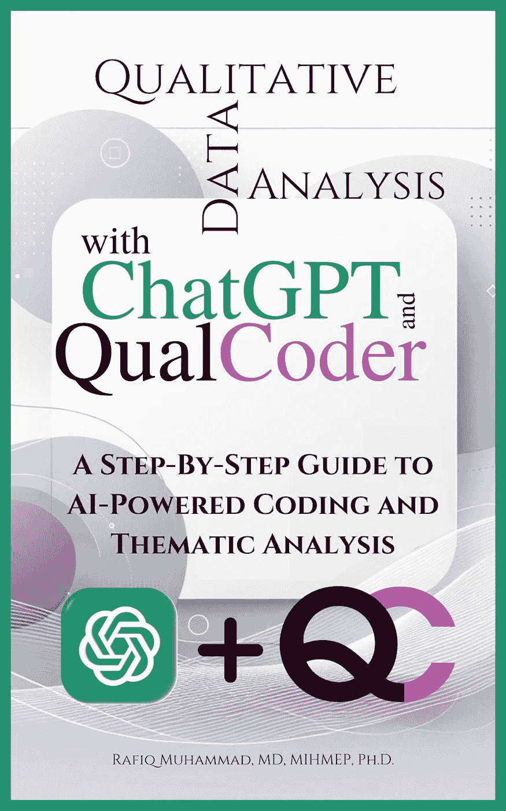

AI 驱动的编码和主题分析步骤指南

您刚开始研究之旅，感到不知所措吗？

获取我的免费 75 页小册子，开始研究设计：定性、定量和混合方法研究的快速指南。

在这本小册子中，您将找到实用的技巧、清单和清晰的解释，以帮助您自信地构建您的研究问题，选择正确的方法，规划您的数据收集，并使它们得以发表。

获取您启动研究所需的坚实基础——点击[链接下载](https://www.mastermythesis.com)您的免费副本！

|   |  |   |
| --- | --- | --- |

# 应该由谁阅读以及您将获得什么

您坐在办公桌前，周围是访谈记录、笔记，以及电脑屏幕上闪烁的光标。您面前的挑战是清晰的：从您收集的大量定性数据中提取意义。您如何从这些故事中提炼意义？您如何组织您的代码和主题，以保持对参与者声音的真实性？您靠在椅背上思考，“一定有更好的方法来简化这个过程。”

当你开始将第一组代码输入到电子表格中时，一个想法在你的脑海中徘徊：“我是否能够捕捉到这里的所有细微差别？”你的手悬停在键盘上，思考你是否还有尚未考虑到的主题。“我是否遗漏了什么重要的东西？”随着数据量的增加，面前的任务似乎变得艰巨。几个小时的手动编码和主题分析在你面前展开，而你仍在 wonder：是否有更高效的方法在不牺牲深度的情况下实现准确性？

这种场景对许多定性研究人员来说都很熟悉，尤其是那些在研究的编码和主题分析阶段工作的研究人员。数据的巨大量加上对严谨分析的需求，常常会让人感到不知所措。没有明确的策略或工具，研究人员可能会发现自己迷失在数据管理的深处，努力综合关键主题的同时保持数据的丰富性。

在那一刻，一个想法闪过你的脑海：“人工智能（AI）能帮我做这个吗？”你听说过像 ChatGPT 这样的 AI 工具被用来协助涉及语言的任务，但它真的能在像定性数据分析这样复杂的事情中发挥作用吗？你暂停下来，既感到兴奋又犹豫，不确定 AI 能否保持你研究的完整性，或者它只是另一个被过度炒作的工具。

但好奇心驱使你继续前进。

你打开一个新的文档，输入一个测试提示，要求 ChatGPT 帮助你总结你的访谈记录的一部分。几分钟后，你对响应的清晰度和相关性印象深刻。

“这真的可以加快事情的速度，”你心想，随着将人工智能融入你的研究路径变得越来越清晰。

定性研究中的最大障碍通常涉及劳动密集型任务，如编码数据、生成主题和解读复杂叙事。这些任务可能耗时且令人沮丧，尤其是在需要方法论严谨性的情况下。本书将这些挑战分解为可管理的步骤，指导你如何将 ChatGPT 和 QualCoder 作为定性分析中的宝贵工具一起使用。

同时，你意识到许多学生和早期职业研究人员面临的一个挑战：传统定性数据分析软件（如 MAXQDA、ATLAS.ti 和 NVivo）的高成本，通常使得这些工具难以获得。

本书旨在通过提供一份全面、分步指南，克服这些障碍，指导读者如何使用 ChatGPT 进行定性数据分析，同时将其与广泛认可的、免费且开源的定性数据分析软件 QualCoder 相结合。

无论你是经验丰富的定性研究人员，还是刚开始你的旅程，这本指南将向你展示如何利用 ChatGPT 和 QualCoder 的联合力量来简化并增强你的定性分析过程。通过将 ChatGPT 的人工智能能力与 QualCoder 的开源灵活性相结合，你可以在不牺牲定性研究所需的深度和严谨性的情况下，更高效地工作。这种动态组合让你可以更多地专注于解释和洞察，而工具则协助编码、模式识别和主题发展。

这本书的焦点是揭开定性研究中人工智能的神秘面纱，强调 ChatGPT 与 QualCoder 的整合。你将学习如何设置和配置这些工具，为编码和主题分析制定有效的提示，并将人工智能生成的见解与你的专业知识相结合。从数据准备到报告，本指南涵盖了帮助你保持对研究过程控制的同时，从人工智能驱动的效率中受益的必要策略。

这本书非常适合以下人群：

+   对于定性研究的新手，并希望探索人工智能和像 QualCoder 这样的开源工具如何帮助进行编码和分析。

+   拥有定性方法的经验，并希望通过 ChatGPT 和 QualCoder 提高生产力。

+   对负责任地融入人工智能感兴趣，同时不损害研究诚信。

到最后，你将掌握以下技能和洞察力：简化编码、在人工智能支持下开发主题，并从你的数据中获得更深入的见解。你还将了解涉及到的伦理考量，确保你的研究保持透明、可靠和有效。无论你是否被编码所困扰、不确定如何构建你的分析结构，或者对人工智能的潜力感到好奇，这本书都为你提供了从数据中得出有影响力的发现所需的指导。

|   |  |   |
| --- | --- | --- |

# 你将学到什么

在这本书中，你将学到以下内容：

+   人工智能定性研究的基础：了解人工智能，特别是 ChatGPT，如何融入定性研究，包括使用人工智能进行编码和主题分析的好处和局限性。你还将学习如何将 ChatGPT 与 QualCoder（一个免费的开源定性分析工具）结合使用，以增强你的研究过程，无需昂贵软件。

+   为定性分析制定有效的提示：学习设计清晰精确的提示，以激发 ChatGPT 产生有意义的响应，帮助你简化诸如开放式编码、模式识别和数据摘要等任务。你还将看到这些提示如何在 QualCoder 中工作，以支持更结构化的分析。

+   数据准备和隐私考量：探索清洗、组织和格式化你的定性数据的基本技巧，以优化 ChatGPT 的性能，同时确保在整个研究过程中维护隐私和伦理标准。此外，学习如何准备你的数据，以便与 QualCoder 无缝集成，进行高效分析。

+   AI 辅助开放式编码和主题发展：了解如何在编码过程中与 ChatGPT 协作，生成初始代码并识别新兴主题。你还将学习如何使用 QualCoder 来细化这些代码，并确保你的分析保持研究诚信，将 AI 建议与你的见解相结合。

+   将 ChatGPT 与 QualCoder 集成：探索将 ChatGPT 与 QualCoder 结合使用的实用策略，QualCoder 是一款功能强大、免费、开源的定性数据分析软件。学习如何利用这两个工具的优势来简化编码、模式识别和主题发展，使高质量定性分析更加容易获得。

+   数据解释的高级 AI 技术：学习如何使用 ChatGPT 深入探讨子主题，比较不同的数据集，并将复杂发现综合成连贯的叙述。你还将发现如何将这些见解整合到 QualCoder 中，以实现更全面的数据管理和可视化。

+   确保可信度和减轻偏见：了解如何验证 AI 生成的见解，用传统方法验证发现，并实施减少 AI 偏见的策略，确保可靠和道德的研究结果。通过使用 ChatGPT 和 QualCoder，你将能够保持可信度并确保平衡的分析。

尽管这本书的重点是使用 ChatGPT 作为定性研究的有力 AI 工具，但重要的是要认识到还有其他几种大型语言模型（LLMs）可以类似地使用。例如，Google 的 Gemini、Anthropic 的 Claude 和 Cohere 等工具提供了与 ChatGPT 类似的高级语言处理能力。每个模型都提供独特的功能，但将它们整合到你的研究过程中的核心原则——如提示制作、编码辅助和主题发展——保持一致。随着你阅读本书的进展，请记住，讨论的技术可以根据你的需求或资源调整，以适应最适合的 LLM。

此外，当许多定性研究人员转向付费软件如 NVivo、MAXQDA 或 ATLAS.ti 进行数据分析时，这本书专注于将 ChatGPT 与 QualCoder 集成，QualCoder 是一个免费的开源替代品。QualCoder 提供了与商业工具相同的许多功能——例如编码、分类和管理定性数据——而没有财务障碍。通过展示如何将 QualCoder 与 ChatGPT 结合用于自动化编码、模式识别和主题生成等任务，这本书确保了即使是预算有限的研究人员也能从 AI 在定性分析中的力量中受益。

|   |  |   |
| --- | --- | --- |

# 关于作者

R afiq Muhammad, MD , MIHMEP, Ph.D.，是一位经验丰富的学术和医疗专业人士，在医疗研究领域拥有丰富的背景。他获得了医学学位，随后在意大利享有盛誉的 SDA Bocconi 管理学院获得了国际医疗管理、经济学和政策硕士学位，并在瑞典世界著名的卡罗琳医学院获得了博士学位。

Dr. Rafiq 在学术出版物方面有着坚实的记录，为同行评审期刊做出了大量贡献，增强了医学研究领域的知识体系。他的专长不仅限于写作，还包括教学和指导研究生。Dr. Rafiq 在研究设计方面有着坚实的基础，通过众多同行评审出版物为学术界做出了贡献，并成功地指导学生完成他们自己的研究之旅。这本书提炼了这种专业知识，提供了实用的策略和见解，以帮助您自信地设计和执行您的研究。

在《使用 ChatGPT 进行定性数据分析》一书中，Rafiq 借鉴了个人经验和专业知识，为研究人员提供了在定性研究项目中取得成功所需的工具。无论你是第一次探索 AI 辅助分析，还是寻求提升当前的研究技能，这本书都提供了清晰、自信和实用的知识，以帮助你在不断变化的研究领域中取得成功。

第一章。

|   |  |   |
| --- | --- | --- |

# 引言

想象一下！

您发现自己正处于一场激动人心的学术讨论中，焦点正在转向 AI 在定性研究中的应用——特别是 ChatGPT。将 AI 整合到该领域的可能性正在积聚势头，许多人认识到它为导航大量复杂数据集提供的变革潜力。研究人员开始看到 ChatGPT 如何帮助简化传统上耗时耗力的编码、识别主题和解读叙事数据的过程（1-3）。然而，这种热情也伴随着疑问：AI 真的能帮助进行定性分析吗？它如何与既定的定性方法相结合，同时保持该领域所要求的深度和严谨性？

当您深入这些讨论时，您会遇到一篇文章，标题为“定性研究数据分析新时代：ChatGPT！”，展示了该工具处理大量文本数据的能力如何显著加快编码和主题生成等任务（2）。另一方面，一位同事指出，在定性研究中使用 AI 仍然相对较新且在不断发展，许多研究人员刚开始探索它如何融入他们的工作流程（4）。这种不断发展的格局开启了一场新的对话：作为新兴工具的 ChatGPT 如何解决定性研究中面临的核心挑战——即管理复杂数据集、将技术与传统方法相结合，并以引人入胜和有意义的方式呈现数据？

您自己的研究经验可能反映了这种动态。也许您面对的是一大堆访谈记录或实地笔记，不知道如何有效地组织和分析这些数据。在定性研究中，导航大量无结构化数据集的挑战是最大的障碍之一（5）。ChatGPT 通过充当强大的助手来提供解决方案——帮助您管理、排序和突出数据中的关键模式。但您如何确保这种由 AI 驱动的分析能够补充而不是取代您自己的解读？您如何利用 ChatGPT 的能力来丰富，而不是掩盖您定性洞察的深度？

ChatGPT 如何解决定性分析中的关键挑战

ChatGPT 的一个主要优势是它能够轻松处理复杂和大量的定性数据。想象一下手动筛选数百页的访谈记录，每一页都充满了丰富和详细的叙述。这可能是一项令人难以承受的任务，但 ChatGPT 可以通过快速组织和识别数据集中重复出现的主题、短语或概念来帮助您。

这并不取代您作为研究者的工作——它增强了它。

ChatGPT 让您更有效地导航数据，从而腾出时间进行只有人类洞察力才能提供的深入分析。

例如，ChatGPT 可以通过生成初步代码和提出模式来协助，但将这些发现精炼并解释其在你研究背景下的意义则取决于你。将 AI 与传统的定性方法相结合意味着你可以将技术的效率与你的解释技能相结合，确保数据的丰富性得到保留。这本书将指导你如何使用 ChatGPT 在保持定性研究所要求的严谨性和深度的同时，导航复杂的数据。

将 ChatGPT 与传统的定性方法相结合

尽管 AI 在定性研究中的应用仍在兴起，但 ChatGPT 是一个强大的工具，它可以无缝地补充传统方法。定性研究中的一个关键挑战是在需要技术辅助与以人为驱动的过程——解释之间取得平衡。ChatGPT 擅长管理大量文本和识别广泛模式，但真正的价值在于当这项技术与传统的技术（如手工编码、主题分析和叙事综合）结合使用时。

通过使用 ChatGPT 处理初始阶段，例如排序数据、提出代码和识别高级主题，你可以专注于解释的更细微方面。这允许有一个更动态的研究过程，其中技术支持你的专业知识而不是取代它。在这本书中，你将学习如何将 ChatGPT 融入分析的每一步，确保工具增强了你的工作而不损害你研究的一致性。

使用 ChatGPT 以吸引人的方式呈现数据

定性研究中另一个挑战是以既准确又吸引人的方式呈现你的发现。定性数据的丰富性源于其讲述故事的能力，而 ChatGPT 在这个过程中可以成为一个无价的盟友。通过使用 AI 来组织和结构化你的数据，你可以更容易地识别出将构成你叙述基础的关键洞见。ChatGPT 总结和综合复杂信息的能力可以帮助简化展示过程，使你的发现对观众来说更加清晰和易于理解。

然而，尽管 ChatGPT 可以帮助结构化数据，但定性研究的核心在于解释和讲故事。这本书将向你展示如何使用 ChatGPT 的能力以保持原始叙述的深度和细微差别的方式呈现你的数据，同时确保你的发现清晰、简洁且具有影响力。你将学习如何将 AI 生成的主题编织成一个引人入胜的叙述，捕捉人类经历的复杂性。

为什么这本书专注于 ChatGPT 在定性研究中的应用

在快速发展的研究环境中，ChatGPT 提供了一个独特的机会来解决定性分析中的一些最紧迫的挑战。本书旨在帮助你利用 ChatGPT 作为强大的工具来增强分析，在定性研究复杂世界中导航。从管理大型数据集到将 AI 与传统方法相结合，以及以引人入胜的方式展示你的发现，本书提供了如何使用 ChatGPT 来转变你的定性研究过程的实用指导。

不论你是寻求融入新技术经验的资深研究员，还是刚开始探索 AI 可能性的学生，这本书都将为你提供使用 ChatGPT 进行定性研究的知识和技能。你将学习如何充分利用 AI 的能力，同时确保你的研究符合定性分析所要求的解释深度和严谨性。

|   |  |   |
| --- | --- | --- |

# 为什么选择这本书？

在创建这本指南时，我精心设计了每一章，考虑到你——无论你是刚开始的本科生，深入研究的研究生，还是使用 ChatGPT 在定性数据分析创新领域中导航的资深研究员。我的目标是简化将 AI 融入你的研究中的复杂性，并为你提供拥抱这种变革性方法所需的工具和信心。

本书特色：

+   可操作步骤：通过清晰、实用的技巧将 ChatGPT 整合到你的定性分析中，减轻你在研究中使用 AI 的任何担忧。

+   应对现代挑战的实用解决方案：本书解决研究人员在定性分析中面临的现实世界问题，如管理大型、复杂的数据集以及将传统方法与 ChatGPT 等 AI 技术相结合。你将找到帮助你有效应对这些挑战的策略，使你的研究过程更加顺畅和高效。

+   关注开源和性价比工具：发现 QualCoder，这是一个强大、开源且免费的定性数据分析工具，让你能够在不承担其他软件高昂成本的情况下进行深入分析。

+   全面覆盖：从理解 ChatGPT 和 AI 辅助编码的基础到使用 AI 增强分析展示你的发现，本指南涵盖定性研究过程的全部内容，提供了一体化的资源。

+   清晰的解释：复杂的 AI 和自然语言处理概念以简单易懂的语言解释，辅以现实世界的例子，使这些想法的应用变得容易。

+   适用于所有水平：无论你是初学者还是拥有丰富的经验，本书都针对采用新技术时的独特挑战，提供定制化的建议，帮助你克服 ChatGPT 带来的任何障碍。

+   价值资源：访问模板、示例提示和有见地的建议，以增强你的研究项目，并无缝地将 ChatGPT 集成到你的定性分析中。

+   组织工具：利用清单和实用工具保持组织有序，确保你在将 ChatGPT 融入工作流程时不会错过任何关键步骤。

+   真实案例研究：本书包含案例研究和真实世界示例，展示了 AI 如何成功集成到定性研究项目中。这些实际应用展示了如何将本书中讨论的策略应用到你的工作中，使抽象概念具体化并具有可操作性。

这本书不仅仅是一本指南——它是你的可靠伴侣，赋予你利用 ChatGPT 进行定性研究的能力。无论你是开始你的第一个项目还是改进你的方法，你都将找到有价值的见解和实用的工具，使你的研究更加高效和有影响力。

到本书结束时，你将清楚地了解如何使用 ChatGPT 简化你的定性研究，同时保持数据的完整性和深度。无论你是管理大型数据集、寻找高级 AI 集成技术，还是仅仅寻求了解基础知识，本书提供了你自信增强定性研究所需的全部内容。

|   |  |   |
| --- | --- | --- |

# 本书包含哪些内容

本书首先为理解 ChatGPT 及其在定性研究中的作用奠定坚实的基础。在“理解 ChatGPT 和 AI 语言模型”中，解释了 AI 语言模型的基础知识，以及 ChatGPT 如何协助定性数据分析。“AI 在定性研究中的作用”深入探讨了 AI 的演变角色，讨论了将 AI 与人类解释相结合的担忧和可能性。“使用 ChatGPT 的归纳和演绎方法”帮助你理解如何使用 AI 工具应用这些方法论。

随着本书深入到更实用的方面，“有效提示工程”将引导你如何构建提示，以从 ChatGPT 中获得有用和准确的响应——这是有效 AI 辅助研究的关键技能。“AI 辅助开放式编码”展示了如何使用 ChatGPT 来辅助开放式编码，平衡 AI 生成的代码与你的解释性洞察，并确保编码过程的透明度。

随后，本书介绍了“QualCoder：一款免费、开源的定性分析工具”，提供了关于这款强大软件的概述以及如何开始使用的说明。在“将 ChatGPT 与 QualCoder 集成”中，它解释了如何将 ChatGPT 与 QualCoder 结合使用。

“为 AI 集成准备你的研究环境”涵盖了设置研究环境的必要步骤，包括访问和配置 ChatGPT、数据准备以及确保数据隐私和合规性。这为“使用 ChatGPT 和 QualCoder 进行逐步定性数据分析”奠定了基础，它提供了从清理数据到分析和可视化结果的整个过程的详细说明。

在后续章节中，“增强可信度和可靠性”专注于缓解 AI 偏见、将 AI 发现与传统方法三角化以及确保研究可信度的策略。“报告和展示发现”提供了使用 AI 洞察力制作引人入胜的报告的指导，包括在归因 AI 贡献时的道德考量，以及如何向不同受众有效传达复杂主题。

到本书结束时，你将全面了解如何将 ChatGPT 和 QualCoder 集成到你的定性研究过程中——帮助你管理大型数据集，结合 AI 与传统方法，并以清晰、引人入胜的方式展示你的发现。无论你是在撰写论文、博士论文还是进行专业研究项目，本书都提供了知识、工具和策略，以进行高质量的研究，同时利用 AI 的力量，同时保持定性分析的深度和解释性质。

| 章节要点：

+   管理大型、复杂的定性数据集对研究人员来说是一个重大挑战。

+   在不失去深度的情况下，平衡 AI 集成与人类解释至关重要。

+   以吸引人和有意义的方式展示定性发现往往很困难。

+   本书介绍了 ChatGPT 作为一种变革性工具来应对这些挑战。

+   它提供了将 ChatGPT 与传统定性方法集成的实用指导。

+   在不牺牲解释深度的情况下，利用 AI 提高效率是核心关注点。

+   本书赋予所有层次的研究人员自信地使用 AI 工具如 ChatGPT 的能力。

+   提供了缓解 AI 偏见并保持科学严谨性的策略。

+   针对道德考量和数据隐私进行讨论，以确保研究诚信。

+   目标是利用 ChatGPT 增强定性研究，使项目在方法论上坚实且具有创新性。

|

|   |  |   |
| --- | --- | --- |

# 第一部分：定性分析中大型语言模型的基础。

第二章。

|   |  |   |
| --- | --- | --- |

# 理解 ChatGPT 和 AI 语言模型

要在研究中充分发挥 ChatGPT 的潜力，首先理解人工智能和自然语言处理（NLP）的基本工作原理、ChatGPT 的功能和限制，以及将 AI 纳入研究过程所带来的伦理考量至关重要。到本章结束时，你将牢固掌握 ChatGPT 的机制，并准备好负责任且有效地使用它。

#### 人工智能与自然语言处理基础

人工智能近年来发展迅速，自然语言处理（NLP）已成为其最具变革性的分支之一。NLP 使机器能够以以前不可能的方式理解、解释和生成人类语言。在其核心，NLP 架起了人类沟通与计算机理解之间的桥梁，使 AI 能够处理和分析大量非结构化文本数据——这正是定性研究产生的那种数据。

在 ChatGPT 的语境中，自然语言处理（NLP）使 AI 能够“阅读”定性数据，如访谈记录或焦点小组讨论，并协助识别模式、编码和主题。NLP 的关键技术包括：

+   分词：将文本分解成更小的单元，如单词或短语。

+   文本分类：将预定义的类别分配给文本，这有助于执行诸如情感分析或主题编码等任务。

+   命名实体识别：在文本中识别和分类特定元素，如名称、日期或组织。

+   文本生成：AI（如 ChatGPT）从提示或问题中生成类似人类的响应或摘要的能力。

ChatGPT 特别基于 GPT（生成预训练变换器）架构，该架构使用深度学习模型来预测序列中的下一个单词，使其在对话生成和文本摘要等任务上非常熟练（6）。

在定性研究中，这些功能可以简化编码和主题分析等任务，节省研究者的时间和精力。

#### ChatGPT 的工作原理：功能与限制

要了解 ChatGPT 在研究环境中的功能，让我们分析其功能和限制（图 2.1）。

功能：

1.  文本摘要：ChatGPT 可以处理大量文本数据并生成简洁的摘要，帮助研究者快速从冗长的记录中识别核心思想或主题。

1.  文本分类与编码：ChatGPT 可以通过识别定性数据中的重复单词、短语或概念来协助开放编码过程。例如，如果你输入原始访谈记录，ChatGPT 可以突出显示关键术语并建议初始编码，你可以进一步精炼和验证。

1.  生成想法和问题：ChatGPT 在头脑风暴、生成问题或扩展主题洞察方面很有用。这在细化研究问题或发展主题分析的新角度时尤其有帮助。

1.  模式识别：通过分析定性数据中的趋势和重复主题，ChatGPT 可以支持模式识别，帮助你找到你可能否则会忽视的数据中的联系。

图 2.1：ChatGPT 的能力

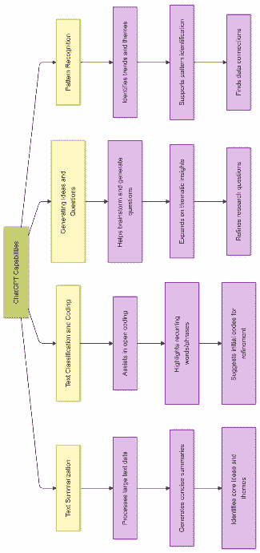

然而，尽管 ChatGPT 拥有令人印象深刻的性能，但重要的是要认识到它的局限性（图 2.2）。

局限性：

1.  上下文理解：尽管 ChatGPT 可以生成连贯的文本，但它并不真正理解数据被分析时的上下文。例如，它可能会根据语言模式提出代码，但它无法完全理解文化细微差别、情感基调或社会背景——这些因素在定性研究中至关重要。

1.  数据偏差：ChatGPT 是在从互联网上抽取的大量数据集上训练的，因此，它可能反映了其训练数据中存在的某些偏差。这可能会影响它生成的代码或主题，需要研究人员进行仔细的监督，以确保准确性和客观性。

1.  质量不一致：虽然 ChatGPT 可能在某个实例中产生高度相关的洞察，但它可能在其他情况下生成不太有用甚至无意义的回应。这种可变性要求研究人员将 AI 生成的结果与自己的分析交叉检查，以确保有效性。

1.  道德和解释挑战：ChatGPT 可以帮助识别模式和提出主题，但它无法解释发现或提供理论洞察。数据解释是一个独特的人类任务，它基于你对研究背景和指导你研究的理论框架的理解。

图 2.2. ChatGPT 的局限性

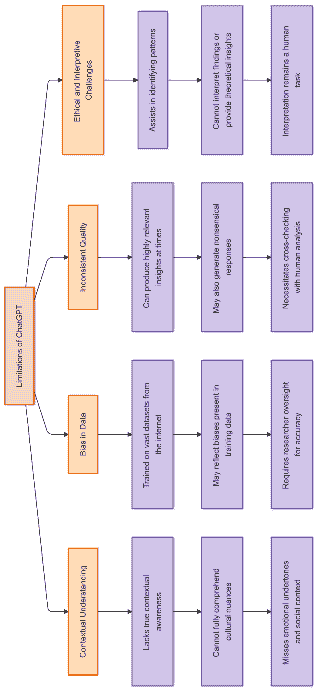

理解这些局限性有助于你保持对 ChatGPT 在研究中的角色的现实期望，并确保你将其用作补充——而不是取代——你的定性分析过程的工具。

#### 道德考量与负责任的使用

将 ChatGPT 融入你的研究引入了几个道德考量。与任何研究工具一样，以责任感和警觉性对待 AI 非常重要，确保其使用符合道德研究实践。以下是一些需要牢记的关键领域：

1.  数据隐私：在使用 ChatGPT 时，尤其是在基于云的应用中，确保敏感或个人信息的安全至关重要。这在定性研究中尤为重要，因为访谈记录、焦点小组笔记和观察数据通常包含私人或机密信息。在使用 AI 工具之前，您应采取措施匿名化数据，并确保任何第三方平台都符合数据保护法规，如 GDPR。

1.  知情同意：如果分析数据时将使用 AI 工具，如 ChatGPT，参与者应被告知。虽然 AI 可能简化分析过程，但参与者有权了解他们的信息将如何被处理以及谁将有权访问这些信息。这种透明度确保了道德标准的遵守和参与者权利的尊重。

1.  偏见与公平：如前所述，AI 工具如 ChatGPT 可能会反映训练数据中存在的偏见。在定性研究中，这可能导致强化刻板印象或忽略数据中重要但出现频率较低的模式。研究人员必须仔细评估 AI 生成的建议，并对照自己的解释进行验证，以确保公平性和准确性。

1.  AI 贡献的透明度：在呈现结果时，重要的是要清楚地说明 ChatGPT 在您的研究中扮演的角色。这意味着明确记录 AI 的使用方式——是用于编码、总结数据还是生成主题。透明度使您的听众能够全面了解方法论并评估 AI 在塑造分析中的作用。

1.  人的因素：最后，必须强调 ChatGPT 是一个工具——不是人类判断的替代品。最终的分析、主题的解释和结论的发展始终应掌握在研究人员手中。虽然 AI 可以支持和增强研究过程，但定性研究的深度和意义来自于研究人员对背景、参与者和理论框架的理解。

通过了解 AI 的基本知识、ChatGPT 的能力和局限性以及使用 AI 进行研究的伦理影响，您可以开始有效地利用这个强大的工具。随着本书的深入，我们将探讨为研究设置 ChatGPT、创建有效的提示以及以负责任和有影响的方式将 AI 整合到您的工作流程中的实用策略。

| 章节要点：

+   ChatGPT 简化了定性研究中的编码和主题分析，节省了时间和精力。

+   它总结文本以从冗长的记录中识别核心思想。

+   通过寻找重复出现的单词和概念来协助文本分类和编码。

+   生成想法和问题以完善研究调查。

+   在定性数据中识别模式和趋势。

ChatGPT 的局限性：

+   缺乏对文化细微差别和情感基调的真实语境理解。

+   可能反映了其基于互联网的训练数据中存在的偏见。

+   有时可能产生不一致或无意义的回应。

+   无法解释结果或提供理论洞察；人类分析仍然至关重要。

伦理考量：

+   通过匿名化敏感信息和遵守 GDPR 等法规来确保数据隐私。

+   在数据分析中使用人工智能时，从参与者那里获得知情同意。

+   通过批判性地评估人工智能生成的建议来解决偏见和公平性问题。

+   在研究过程中，关于如何使用 ChatGPT 要透明。

+   强调 ChatGPT 在定性分析中补充而非取代人类判断。

|

第三章。

|   |  |   |
| --- | --- | --- |

# 人工智能在定性研究中的作用

理解人工智能的作用，首先要了解定性方法的历史背景，以及人工智能如何增强（但不是取代）人类洞察力，并解决关于人工智能取代研究人员角色的常见误解。目标是突出人工智能在正确使用时如何增强定性研究，而不会损害其核心价值，如深度、丰富性和人类解释。

|   |  |   |
| --- | --- | --- |

# 定性方法的历史背景

定性研究有着悠久而丰富的历史，起源于社会学、人类学、心理学和教育等领域（7–9）。定性研究的核心目标始终是探索和理解人类行为、经验和社会现象的复杂性。与侧重于数值数据和统计分析的定量研究不同，定性研究优先考虑深度、意义和背景。深度访谈、焦点小组、参与观察和案例研究一直是收集和分析定性数据的主要工具（10,11）。

传统上，编码和分析定性数据的过程是手工的，需要研究人员筛选大量转录、田野笔记和其他基于文本的数据，以识别模式、主题和洞察。这是一个劳动密集型过程，需要仔细的解释和对数据收集背景的深入了解。在定性研究中，研究者的角色始终是核心的，重点是主观解释、细微差别和指导分析的框架。

随着定性数据的量增长，尤其是在数字时代，访谈、社交媒体内容和在线讨论可以产生大量的文本，研究者越来越多地面临在保持分析质量的同时管理大量数据集的挑战。这正是 AI，尤其是像 ChatGPT 这样的语言模型介入的领域——提供新的方法来协助诸如编码、模式识别和主题分析等任务。

虽然 AI 是定性研究工具箱中相对较新的补充，但将其视为历史定性方法的扩展，而不是替代品，这一点很重要。AI 并没有改变定性研究的核心目标；相反，它帮助研究者管理更大的数据集，简化耗时任务，使他们能够更多地专注于解释和理论构建。

#### 人类洞察与机器辅助的协同作用

将 AI，以及像 ChatGPT 这样的工具，引入定性研究最好被视为人类研究者与机器辅助之间的协作过程。人类洞察力和 AI 能力之间的协同作用增强了研究过程，而没有削弱研究者的角色。事实上，当正确使用时，AI 使研究者从耗时、重复的任务中解放出来，使他们能够更多地投入到工作的创造性、解释性和理论性方面。

下面是如何在实际中体现这种协同作用的：

+   管理复杂的数据集：使用 AI 进行定性研究的主要好处之一是其能够快速处理大量数据。例如，ChatGPT 可以通过识别重复的主题、模式和概念来帮助分析访谈记录、焦点小组讨论或社交媒体内容。然而，解释这些发现、在研究框架内对其进行背景化以及决定哪些主题最相关或重要的是研究者的职责。

+   支持而非取代编码：虽然 ChatGPT 可以通过基于重复出现的单词或短语建议可能的代码来协助开放编码的初始阶段，但最终由研究者来细化这些代码，将它们合并到更广泛的类别中，并解释其含义。AI 提供效率，但人类的洞察力确保分析能够捕捉数据的丰富性和复杂性。

+   模式识别和主题发展：AI 的优势在于其能够检测出人类眼睛可能不会立即察觉的大数据集中的模式。然而，AI 不能取代研究者对数据背景、文化和特定性的深入理解。AI 可以提出概念之间的联系，但决定这些联系如何与理论框架或研究问题相关的是研究者。

+   迭代分析：定性研究通常是迭代的，研究者会随着新数据或新见解的出现而不断改进他们的分析。ChatGPT 可以通过快速生成新的主题或随着数据的发展修订代码来协助这一迭代过程。但关键见解仍然来自研究者的直觉、经验和理论基础。

人类研究者与人工智能之间的合作导致工作流程更加高效，但研究者仍然是主要的决策者。人工智能作为一个强大的助手，帮助研究者管理数据，但始终是人类的洞察力推动了分析的深度和意义。

|   |  |   |
| --- | --- | --- |

# 澄清关于人工智能取代研究者的误区

有一种常见的误解，即像 ChatGPT 这样的 AI 工具即将取代人类研究者，尤其是在定性分析等耗时较长的领域。

然而，这与事实相去甚远。

认为人工智能会使研究者变得过时，忽视了定性研究的基本性质：它是一个深度的解释过程，需要人类的判断、文化理解和情商——这些领域是人工智能仍然不足的地方。

这里有一些关于人工智能取代研究者的误区及其背后的现实（图 3.1）。

+   误区 1：人工智能可以完全自动化定性分析

    现实：虽然人工智能可以在分析的一定阶段提供帮助——例如编码或模式识别——但它无法复制人类研究者带来的解释性和情境理解。人工智能可能能够识别出某些词语经常一起出现，但它并不理解这些词语背后的文化或情感细微差别。人工智能可以支持这个过程，但它无法提供来自人类经验和理论知识的深刻见解。

+   误区 2：人工智能可以取代研究者在解释中的作用

    现实：人工智能擅长识别模式，但缺乏在研究背景中解释这些模式的能力。例如，ChatGPT 可能会在访谈记录中识别出重复出现的主题，但理解这些主题如何融入更广泛的理论框架或社会背景的是研究者。解释是一个深植于人类的过程，受到研究者背景、知识和与数据的互动的影响。

+   误区 3：人工智能消除了传统定性方法的需求

    现实：人工智能并不取代传统的定性方法；相反，它增强了它们。研究人员仍然需要通过传统方法进行访谈、参与观察或收集叙事数据。人工智能可以在分析阶段提供帮助，但数据收集和解释阶段仍然高度依赖人类互动和洞察力。

+   神话 4：人工智能无懈可击

    现实：人工智能的效果取决于其训练数据。例如，ChatGPT 如果训练数据存在偏见或缺乏多样性，可能会产生有偏见或不完整的结果。研究人员必须始终批判性地评估人工智能工具提出的建议，检查其准确性、潜在偏见和相关性。研究人员的角色是确保人工智能的贡献能够增强研究，而不是扭曲研究。

图 3.1\. 定性研究中关于人工智能的神话

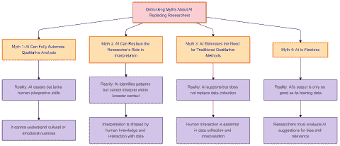

通过揭穿这些神话，我们可以更好地理解人工智能在定性研究中的真正作用。人工智能工具如 ChatGPT 远非取代研究人员，它们最好被视为助手——帮助管理大量数据、提出模式、简化工作流程，但始终将解释、分析和情境理解等关键任务留给人类研究人员。

人工智能是现代定性研究人员宝贵的工具，但它在与人类洞察力协作使用时最为强大。整本书的目标是向您展示如何利用 ChatGPT 的优势，同时确保您仍然控制着使定性研究独特的解释和分析过程。

本书的目的不是深入探讨定性分析的各个理论和基础。

因此，重点是为您提供一份实用指南，说明如何利用 ChatGPT 来增强定性数据分析的过程。虽然定性研究涵盖了广泛的方法论和理论视角，但我的目标是展示人工智能，特别是 ChatGPT，如何简化编码、识别模式和辅助主题发展等任务。到本书结束时，您将了解如何将 ChatGPT 整合到您的定性研究工作流程中，以补充您现有的研究技能和方法。

为了演示目的，本书将主要关注访谈记录的主题分析，特别是基于已建立框架的演绎内容主题分析。这种分析从预定义的代码或主题开始，引导对数据的探索（12,13），特别适合于说明 ChatGPT 如何帮助根据现有类别识别和组织数据。通过关注这一特定方法，我们将展示 ChatGPT 如何从最初的编码阶段到主题的发展和细化过程中融入您的分析过程。

| 章节要点：

+   定性研究传统上涉及对复杂、非结构化数据的耗时手动分析。

+   在数字时代，管理大量定性数据集变得越来越具有挑战性。

+   人工智能工具如 ChatGPT 可以通过简化编码、模式识别和主题分析等任务来协助研究人员。

+   人工智能作为传统定性方法的延伸，增强但不取代人类洞察力。

+   人类研究人员和人工智能之间存在协同作用，其中人工智能处理数据处理，而人类提供背景和解释。

+   关于人工智能将取代研究人员的神话被揭穿；人工智能缺乏进行深入定性分析所需的文化理解和情商。

+   人工智能可以管理复杂的数据集并支持编码，但最终解释和主题发展仍然是人类任务。

+   伦理考量强调，人工智能是支持而不是取代人类研究人员进行定性分析的工具。

+   本章重点介绍将 ChatGPT 整合到定性研究工作流程中的实用指南。

+   通过利用 ChatGPT 等人工智能工具，研究人员可以在保持定性研究的深度、丰富性和人类解释能力的同时提高效率。

|

|   |  |   |
| --- | --- | --- |

# 第二部分：使用 ChatGPT 的实用策略

第四章。

|   |  |   |
| --- | --- | --- |

# 使用 ChatGPT 的归纳和演绎方法

|   |  |   |
| --- | --- | --- |

# 使用 ChatGPT 进行定性数据分析的方法：归纳和演绎方法

当使用 ChatGPT 进行定性数据分析时，研究人员可以采用两种主要方法：归纳方法和演绎方法（12）。这两种方法都提供了独特的优势和局限性，其适用性取决于研究的具体背景、研究问题和指导研究的理论框架。了解每种方法的工作原理将帮助您在利用 AI 辅助时决定哪种方法最适合您的研究项目。第十章详细描述了 AI 辅助主题分析的逐步方法。

|   |  |   |
| --- | --- | --- |

# 归纳方法进行定性数据分析

#### 什么是归纳方法？

归纳方法具有探索性和数据驱动性。在此方法中，主题、模式和代码直接从数据本身中产生，而不是由预先存在的理论或框架指导（14,15）。当研究人员希望直接从数据中发现新的见解或理解，而不强加先入为主的观念或类别时，他们会使用归纳方法。

当使用 ChatGPT 进行归纳定性分析时，AI 协助识别数据集中重复出现的单词、短语和模式，研究人员随后可以将这些组织成主题。这种方法特别适用于进入一个新领域或研究不足的领域，其目标是基于数据发展理论或理解。

#### 使用 ChatGPT 进行归纳方法的步骤：

1.  输入原始数据：将原始数据（例如，访谈记录、焦点小组笔记）输入 ChatGPT，要求其识别重复出现的模式或概念。

1.  生成初始代码：ChatGPT 将突出显示数据中存在的常见单词、短语或想法。这些成为初始代码。

1.  审查和细化：研究人员审查 ChatGPT 的建议，选择哪些模式或概念应该发展成为更广泛的主题。这需要重大的人类判断以确保相关性和准确性。

1.  主题发展：从识别的代码中，研究人员发展出更广泛的主题，以解释数据的潜在意义。ChatGPT 可以通过进一步阐述或根据文本中的相似性对这些主题进行分组来协助。

#### 归纳方法的适用性：

+   探索性研究：适用于旨在探索新现象或生成理论而不是测试现有假设的研究。

+   基于扎根理论：常用于扎根理论方法中，研究者从涌现数据中自下而上地构建理论。

+   当存在很少的先验知识时：在关于研究主题知之甚少的情况下很有用，目的是让数据“为自己说话”。

#### 归纳方法的优势：

+   灵活性：没有预定义的结构允许发现意外的见解或主题。

+   数据的丰富性：由于分析是开放式的，它捕捉了数据的全部复杂性，而不受先前假设的限制。

+   AI 辅助模式识别：ChatGPT 在发现研究人员可能不会立即明显察觉到的模式方面非常有效，有助于代码生成。

#### 归纳方法的局限性：

+   过度依赖 AI：没有预定义的类别，存在过度依赖 ChatGPT 建议的风险，这可能导致识别表面或无关的主题。

+   缺乏焦点：归纳方法可能耗时且可能导致大量需要研究人员进行大量精炼的数据。

+   需要大量解释：研究人员仍然必须投入大量时间来精炼和解释主题，因为 ChatGPT 的输出可能是泛泛的或缺乏复杂分析所需的深度。

|   |  |   |
| --- | --- | --- |

# 归纳方法进行定性数据分析

#### 什么是归纳方法？

归纳方法是以理论驱动的，结构化的。在这个方法中，研究人员从基于理论框架或先前研究存在的主题或类别开始，并使用这些来指导分析（16）。这种方法通常被称为主题归纳分析，其中数据是根据一组预定义的类别或假设进行编码的。

使用 ChatGPT，归纳方法涉及要求 AI 根据预定义的主题识别和分类数据。ChatGPT 不是发现新模式，而是帮助系统地组织和整理数据到既定的代码或主题中。

#### 使用 ChatGPT 进行归纳方法的步骤：

1.  定义预存主题：在输入数据之前，研究人员根据理论模型或研究问题定义主题或类别。

1.  根据主题标记数据：将数据输入 ChatGPT，并提示其根据预定义的主题对响应进行分类。例如，指示 ChatGPT 标记与特定类别（如“工作与生活平衡”、“团队动态”或“情绪健康”）相关的文本部分。

1.  验证和精炼：研究人员检查 AI 的输出以确保编码准确且与理论框架一致。可能需要调整以微调分析。

1.  解释：一旦数据被排序，研究人员将在预定义框架的背景下解释研究结果。

#### 归纳方法的适用性：

+   假设检验：适用于研究目标是测试特定假设或理论的情况。

+   结构化研究：适用于基于现有文献和理论的研究项目，例如在测试概念模型或探索已知现象时。

+   应用研究：常用于应用领域（例如心理学、社会学），在这些领域中，特定的框架或工具（例如组织模型、压力框架）被用来指导分析。

#### 演绎法的优势：

+   效率：由于已经定义了明确的主题，分析更加专注和高效，尤其是在 ChatGPT 快速分类数据时。

+   与理论一致：预定义的分类确保分析始终与指导研究的理论框架紧密一致。

+   一致性：使用既定的主题可以导致在不同数据集中进行更一致和可靠的编码，尤其是在大规模研究中。

#### 演绎法的局限性：

+   错过新见解的风险：通过专注于预定义的分类，存在错过研究者未预见的主题的风险。

+   严格的结构：演绎法有时可能过于严格，阻碍研究者从数据中发现意外但宝贵的见解。

+   需要深入理解框架：研究者必须对理论框架有深刻的理解，并确保它与特定的数据集相关。ChatGPT 的作用仅限于在这些参数内组织数据。

|   |  |   |
| --- | --- | --- |

# 归纳与演绎：选择哪种方法？

#### 何时使用归纳法：

+   探索性研究：在探索新领域或未开发领域，且先前研究很少的情况下，使用归纳法。这允许灵活性，并有可能发现新的主题或模式。

+   理论发展：在生成新理论或模型时非常理想，尤其是在定性研究领域，如扎根理论。

+   开放式问题：如果你的研究问题是广泛的或探索性的，例如“员工如何看待虚拟现实对团队动态的影响？”归纳法允许数据引导发现。

#### 何时使用演绎法：

+   假设检验：在检验假设或验证理论模型时使用演绎法。如果你正在检查某些具体内容——比如测试领导风格对员工福祉的影响——演绎法可以帮助你专注于预定义的变量。

+   应用现有理论：如果你的研究基于既定的理论框架，如马斯洛的需求层次理论或压力管理模型，演绎法确保你的分析与该框架保持一致。

+   专注研究：对于需要明确、预定义的分类和结构化数据的研究，演绎方法可以保持分析的组织性和与研究目标的协调一致。

|   |  |   |
| --- | --- | --- |

# 使用 ChatGPT 的限制和考虑因素

虽然 ChatGPT 可以协助归纳和演绎方法，但理解其局限性是至关重要的：

+   上下文理解：ChatGPT 擅长识别文本中的模式，但缺乏对上下文或数据背后细微含义的真正理解。研究者必须始终审查和精炼 AI 的输出，以确保它们与研究目标一致。

+   AI 输出中的偏差：ChatGPT 可能会根据其训练数据生成有偏差的结果，这种偏差可能会影响归纳和演绎分析。在归纳方法中，AI 生成的编码可能会反映数据中过度代表的部分，而在演绎方法中，ChatGPT 对预定义主题的解释可能无法完全捕捉数据的丰富性。

+   研究者控制：无论采用哪种方法，人类研究者对于解释、精炼和应用研究结果都是至关重要的。ChatGPT 可以协助完成繁重的工作，但关于编码和主题的最终决定权仍属于研究者。

|   |  |   |
| --- | --- | --- |

# 选择正确的方法

使用 ChatGPT 进行定性数据分析时，选择归纳或演绎方法的决定取决于研究目标、研究的结构和主题的现有知识。归纳方法最适合探索性研究，其中新模式可能从数据中浮现，而演绎方法则适用于将既定理论或框架应用于测试特定假设的研究。这两种方法与 ChatGPT 等 AI 辅助工具结合使用，可以显著简化编码和分析定性数据的过程，同时研究者保持解释和理论协调的核心角色。

| 章节要点：

+   研究者可以使用两种主要方法与 ChatGPT 进行定性数据分析：归纳（探索性和数据驱动）和演绎（理论驱动和结构化）。

+   归纳方法允许主题和模式从数据中自然浮现，而不需要预定义的理论，这使得它在探索性研究中发现新的见解时非常适用。

+   演绎方法使用基于现有理论或框架的预定义主题或分类，非常适合测试假设和应用既定概念。

+   ChatGPT 通过识别模式和分类数据来协助两种方法，但它缺乏真正的上下文理解；研究人员必须批判性地审查和细化 AI 输出。

+   归纳方法的优点包括灵活性和捕捉数据的丰富性，而局限性包括可能过度依赖 AI 和缺乏专注。

+   归纳方法的优点是效率和与理论框架的一致性，但它可能错过新的见解并且可能过于僵化。

+   选择归纳和演绎方法取决于研究目标、现有知识和研究是否旨在探索新现象或检验特定假设。

+   人类研究人员在解释和最终决策中仍然是必不可少的；ChatGPT 作为助手，旨在增强而不是取代人类在定性分析中的洞察力。

|

表 4.1 总结了 ChatGPT 在定性分析中归纳和演绎方法的关键方面，为研究人员提供了一种实用的指南，以决定哪种方法最适合他们的项目。

表 4.1\. 归纳和演绎定性分析的关键方面

| 方面 | 归纳方法 | 演绎方法 |
| --- | --- | --- |
| 定义 | 数据驱动、探索性方法，其中主题从数据本身出现。 | 理论驱动、结构化方法，由预定义的主题或类别指导。 |
| 使用 ChatGPT 的步骤 | 1\. 将原始数据输入 ChatGPT。2\. ChatGPT 识别重复出现的模式（代码）。3\. 研究人员审查和细化代码。4\. 从模式中发展出主题。 | 1\. 定义预存在的主题。2\. 输入数据并提示 ChatGPT 根据预定义的主题对响应进行分类。3\. 研究人员验证和细化分类。4\. 在预定义框架内解释数据。 |
| 适应性 | - 探索性研究。- 开发新的理论或见解。- 基于扎根理论或当存在很少先验知识时。 | - 假设检验。- 由特定理论框架指导的研究。- 已建立类别的应用研究。 |
| 优点 | - 发现意外见解的灵活性。- 允许数据“自我表达。”- ChatGPT 帮助发现研究人员可能错过的模式。 | - 高效且专注的分析。- 确保与现有理论一致。- 在大型数据集中保持一致的编码。 |
| 局限性 | - 可能耗时且导致大量数据。- 需要研究人员进行大量解释和细化。- 存在过度依赖 ChatGPT 模式识别的风险。 | - 可能错过新兴主题或新颖见解。- 可能过于僵化，限制新信息的发现。- 依赖于对理论框架的深刻理解。 |
| 使用时机 | - 当探索新领域或生成理论时。- 研究问题是广泛或开放式的。- 关于该主题的先前研究很少。 | - 当测试特定假设或验证一个理论时。- 研究集中在结构化模型上（例如，马斯洛的需求层次）。- 有明确、预定义类别的应用研究。 |
| 提示示例 | 提示：“分析这份记录，并识别与团队动态相关的重复模式。” | 提示：“根据这些预定义的主题，标记所有与‘工作与生活平衡’和‘团队合作’相关的陈述。” |
| 研究者的角色 | - 需要进行重要的解释。- 研究者从 AI 建议的模式中提炼和组织主题。 | - 研究者审查和调整 AI 的分类，以适应理论框架。 |
| 适用于 | - 探索性研究。- 基于理论的。- 当需要分析灵活性时。 | - 理论驱动的研究。- 使用结构化类别测试假设。- 在一致性很重要的大型研究中。 |

第五章。

|   |  |   |
| --- | --- | --- |

# 有效的提示工程

在使用 ChatGPT 进行定性数据分析时，编写精确、结构良好的提示对于获得有意义和相关的输出至关重要。有效的提示工程是成功的人工智能辅助分析的基础，因为它指导 ChatGPT 的回答，并确保结果与研究目标一致（表 5.1）。

|   |  |   |
| --- | --- | --- |

# 编写提示以获得最佳响应

#### 精心设计提示的重要性

在定性数据分析中，从 ChatGPT 获得的结果质量很大程度上取决于你如何构建你的提示。一个精心设计的提示设定了明确的期望，并为 AI 提供了足够的信息来生成有用的回答。由于 ChatGPT 根据模式和上下文处理信息，模糊或含糊的提示可能导致不相关、肤浅或过于笼统的回答，这可能会削弱你分析的有效性。

当编写提示时，将其视为向 ChatGPT 下达指令：指令越清晰、越具体，AI 的输出就越准确、越专注。

以下章节概述了为 ChayGPT（图 5.1）编写有效提示的关键原则。

#### 编写有效提示的关键原则

1.  清晰并具体：

    +   使用简单、直接的语言。避免使用可能使 AI 困惑的复杂或复杂的措辞。例如，如果您正在分析关于虚拟现实（VR）对团队协作影响的访谈记录，而不是向 ChatGPT 提问“文本中存在哪些主题？”，一个更具体的提示如“在关于 VR 使用的访谈记录中，识别与团队动态和沟通相关的关键主题”将产生更聚焦的结果。

1.  提供上下文：

    +   给 ChatGPT 适当的上下文有助于它生成与研究目标相关的响应。例如，如果您正在进行演绎主题分析，向 ChatGPT 明确您需要什么：“我正在分析远程工作环境中 VR 的使用。识别与生产力、情感福祉或社交互动相关的任何陈述。”

1.  分解复杂请求：

    +   避免用过于宽泛的请求压倒 AI。相反，将分析分解成更小、更易管理的任务。与其询问“分析这个访谈的所有关键主题”，您可能会问：“首先，识别与团队沟通相关的陈述。然后，识别与情感福祉相关的陈述。”这种结构化的方法提高了分析的精确度。

1.  设置响应界限：

    +   有时，ChatGPT 可能会返回比您所需更多的信息或偏离分析的重点。您可以通过包括具体指令来限制其响应的范围。例如，如果您只想让 ChatGPT 关注特定的主题，指定“仅关注与生产力相关的主题”，或“排除任何与团队协作无关的评论。”

#### 优秀提示的示例：

+   提示： “分析以下访谈记录，并确定与虚拟现实（VR）如何影响远程工作中的团队沟通相关的主题。特别关注非言语线索、社交互动和团队动态。”

+   为什么这样做有效：这个提示清晰，提供了感兴趣的具体主题，并使 ChatGPT 的注意力集中在访谈的相关方面，最大限度地减少了不相关的输出。

图 5.1\. 构建有效提示的关键原则

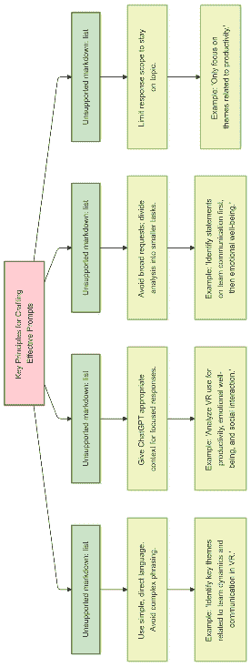

|   |  |   |
| --- | --- | --- |

# 迭代提问的技术

#### 为什么迭代提问很重要

定性分析通常需要细化或深入到具体的见解。迭代提问允许您通过建立在前一个回答的基础上，逐步关注数据更深或更细微的方面。当与像 ChatGPT 这样的 AI 一起工作时，这种技术至关重要，因为它使您能够逐步引导模型的分析，确保每次交互的输出都越来越精细和相关性。

使用迭代提问，你将每一轮的回答作为进一步探索的基础。这对于复杂或多方面的定性数据尤其有用，其中初始主题或代码可能需要进一步的阐述。

#### 有效迭代提问的关键技巧

1.  从广泛开始，然后缩小焦点：

    +   从一个一般性问题开始，以识别数据中的总体主题或模式。一旦 ChatGPT 提供回答，你可以使用这些信息来提出更有针对性的后续问题。例如：

        +   第一轮提示：“这份记录中关于远程工作中使用 VR 的主要主题是什么？”

        +   后续提问：“你能详细描述一下参与者在使用 VR 时如何描述他们的生产力吗？”

这种进展有助于你从广泛的洞察力过渡到具体、可操作的发现。

1.  使用后续提示细化回答：

    +   在 ChatGPT 生成初步回答后，使用后续问题来细化或澄清分析的具体方面。例如，如果 AI 识别出与压力相关的主题，你可能需要跟进提问：“你能提供更多细节，说明参与者是如何描述与使用 VR 进行远程会议相关的压力的吗？”

这个过程允许你深入探讨特定主题，并确保分析能够捕捉数据的复杂性。

1.  测试多个角度：

    +   定性数据通常包含重叠的主题或参与者回答中的细微差异。使用迭代提问来探索这些不同的角度。例如，在确定与团队动态相关的一般主题后，你可以问：

        +   “参与者是如何描述在使用 VR 前后与同事的关系的？”

        +   “是否有任何参与者提到他们在 VR 会话之外沟通方式的变化？”

这些问题将帮助揭示可能从初始回答中不明显出现的模式或矛盾。

1.  回顾并澄清模糊的结果：

    +   如果 ChatGPT 的初始回答不清楚或过于宽泛，使用后续问题来请求澄清。例如，如果 AI 提到像“对技术的不适”这样的主题，你可以问：

        +   “参与者觉得 VR 技术的哪些具体方面不舒服？”

这种技术确保模糊的结果得到具体化，并基于数据得到证实。

#### 迭代提问的示例：

+   第一轮提示：“在这份记录中，识别参与者对在团队会议中使用 VR 的情感反应的关键主题。”

+   后续提示：“你提到了压力作为一个主题。你能提供一些具体的例子，说明参与者是如何描述与 VR 相关的压力感的吗？”

+   为什么这种方法有效：第一轮提示确定了广泛的情感反应，而后续提示则深入挖掘压力的具体方面，提供了更深入的见解。

|   |  |   |
| --- | --- | --- |

# 处理模糊或复杂的数据输入

#### 模糊数据的挑战

定性数据通常是杂乱无章且复杂的，包含来自参与者的模糊或多层次回应。模糊性可能源于措辞不清、相互矛盾的陈述，或使用行话或俚语。在这些情况下，除非有精心设计的提示引导，否则 ChatGPT 可能难以准确解释数据。

处理模糊数据输入需要一种积极主动的方法。研究人员必须预测不确定性区域，并为 ChatGPT 提供如何处理冲突或不清晰信息的指示。

#### 处理模糊或复杂数据的策略：

1.  在提示中澄清期望：

    +   当处理可能模糊的数据时，在提示中明确你希望 ChatGPT 如何处理不确定性。例如，如果参与者对 VR 对生产力的影响表达出相互矛盾的观点，你可以指示 ChatGPT 识别双方：

        +   “确定这个访谈中关于 VR 对生产力影响的任何矛盾观点。突出正面和负面的陈述。”

1.  请求多种解释：

    +   模糊的数据通常需要解释。你可以提示 ChatGPT 提供多种可能的解释，以捕捉数据的复杂性。例如：

        +   “以下参与者的回应不明确。你能提供两种可能的解释，说明当参与者说‘VR 既是沟通的障碍也是桥梁’时他们可能的意思吗？”

1.  使用澄清提示处理复杂数据：

    +   如果 ChatGPT 对复杂数据输入的初始响应过于简单，请跟进澄清提示。例如，如果参与者提到对 VR 的复杂情绪，你可以问：

        +   “你能详细说明一下参与者所说的‘复杂情绪’指的是什么吗？分解他们回应中的情感成分。”

1.  标记矛盾：

    +   在某些情况下，参与者可能会提供相互矛盾的说法。你可以提示 ChatGPT 识别并标记这些矛盾，以便进一步探索。例如：

        +   “这个参与者描述使用 VR 进行会议的经验时，有没有任何矛盾之处？如果有，请总结它们。”

#### 处理模糊数据的示例：

+   提示： “参与者说，‘VR 既赋权又孤立。’参与者这样说的意思可能是什么？提供两种可能的解释并解释每个解释的细微差别。”

+   为什么这样做有效：这个提示承认了模糊性，并指示 ChatGPT 探索多个角度，确保对参与者的回应有更全面的理解。

| 章节要点：

+   精确、结构良好的提示对于从 ChatGPT 中获得有意义的定性分析输出至关重要。

+   有效的提示清晰、具体、提供上下文、分解复杂请求，并设定边界以引导 ChatGPT 的回应。

+   良好的提示工程确保 ChatGPT 的输出与研究目标一致，并避免无关或肤浅的结果。

+   迭代提问通过逐步关注数据的更深层次方面来细化分析。

+   技巧包括从广泛开始然后缩小焦点、通过后续提示细化、测试多个角度和澄清模糊结果。

+   处理模糊或复杂数据需要像明确期望、寻求多种解释和标记矛盾这样的策略。

+   研究人员必须积极引导 ChatGPT 以确保对复杂数据的准确和全面分析。

+   有效的提示工程是成功 AI 辅助定性分析的基础，增强了 ChatGPT 贡献的精确性。

|

表 5.1\. ChatGPT 有效的提示生成定性分析

| 部分 | 关键焦点 | 技术总结 | 示例提示 |
| --- | --- | --- | --- |
| 1\. 设计最佳响应的提示 | 设计清晰和结构化的提示以获得精确的结果 | 1\. 清晰具体：使用简单语言并关注特定主题。2\. 提供背景信息：给 ChatGPT 提供与研究相关的背景信息。3\. 分解复杂请求：将任务拆分为更小的查询以进行详细分析。4\. 设定边界：限制范围以避免无关输出。 | 提示： "确定与 VR 对远程工作中团队沟通的影响相关的主题，重点关注非言语线索。" |
| 2\. 迭代提问技巧 | 采用逐步方法来细化 AI 响应 | 1\. 从广泛开始，然后缩小焦点：从一般性问题开始，然后变得具体。2\. 通过后续问题细化响应：提出澄清问题。3\. 测试多个角度：探索不同的观点或主题的方面。4\. 回顾模糊结果：澄清含糊的回答。 | 第一提示： "这个记录中的主要主题是什么？" 后续： "你能详细说明参与者是如何描述生产力的吗？" |
| 3\. 处理模糊或复杂的数据输入 | 引导 AI 处理不明确或矛盾的数据 | 1\. 明确期望：指导 ChatGPT 如何管理冲突或不明确的信息。2\. 寻求多种解释：提示 AI 提供对模糊陈述的不同解释。3\. 使用澄清提示：要求 ChatGPT 澄清复杂的数据输入。4\. 标记矛盾：指示 AI 识别并标记冲突的陈述以进行进一步分析。 | 提示： "参与者说，'VR 既有赋权又有隔离性。' 提供对这个陈述的两个可能的解释。" |

第六章。

|   |  |   |
| --- | --- | --- |

# AI 辅助开放式编码

|   |  |   |
| --- | --- | --- |

# AI 辅助开放式编码

开放式编码是定性数据分析的基础步骤，其中原始数据被分解成有意义的片段，并分配代表主题、概念或模式的代码。传统上，研究人员通过反复阅读和分析转录本来手动开发这些代码。然而，像 ChatGPT 这样的 AI 辅助工具可以通过识别重复出现的模式并自动生成初始代码，显著提高并加速这一过程。在本章中，我们将探讨如何有效地使用 ChatGPT 进行 AI 辅助开放式编码，如何平衡 AI 生成的代码与研究者直觉，以及记录编码过程以实现透明度的重要性。

本节为第十章中将要遵循的逐步指南奠定了基础，在第十章中，我们将应用这些原则，使用第九章中讨论的假设访谈转录本对现实世界数据进行操作。让我们首先了解 ChatGPT 如何帮助生成初始代码，以及如何在定性研究中有意义地使用这些代码。

|   |  |   |
| --- | --- | --- |

# 什么是开放式编码？

开放式编码是将定性数据（如访谈转录本、焦点小组讨论或观察笔记）分解成更小片段的过程。每个片段都被标记或“编码”为一个术语或短语，该术语或短语总结了该数据的含义。在 AI 辅助开放式编码中，ChatGPT 可以帮助自动化识别这些初始代码，显著加快编码过程。

当您将数据输入 ChatGPT 时，AI 会扫描文本以检测重复出现的单词、想法和概念，这些可以用来生成初始代码。这些代码是进一步分析的开端，研究人员可以进一步细化并将它们分组到更广泛的类别或主题中。

#### 如何使用 ChatGPT 进行初始代码生成

在将您的转录本输入 ChatGPT 之前，确保数据经过清理、格式化和分割成可管理的部分非常重要，正如前面章节中提到的。这使 ChatGPT 能够更有效地运行，并更准确地检测数据中的模式。一旦您的数据准备就绪，您可以通过分析转录本并识别关键主题来提示 ChatGPT 协助初始编码过程。例如，如果您正在检查讨论虚拟现实（VR）对团队协作影响的转录本，您可以使用如下提示：“识别与虚拟现实影响团队协作和沟通相关的关键代码。关注重复出现的想法或概念。”

根据转录内容，ChatGPT 将随后提供一系列可能的代码，这可能包括诸如“非言语线索”、“团队动态”、“生产力”或“孤立”等术语。虽然 AI 生成的代码可以作为一个很好的起点，但确保它们准确反映内容进行审查和精炼是至关重要的。由于 AI 生成的代码可能相当宽泛，通过额外的提问来精炼它们可能是有用的。例如，在收到初始代码后，你可以通过使用提示如：“你将‘团队动态’识别为一个代码。你能将参与者关于团队动态的描述分解成更具体的代码吗？”来请求 ChatGPT 提供更具体的见解。

使用 ChatGPT 生成初步代码可以使开放式编码的初始阶段更加高效，让你有更多时间用于精炼和解读定性数据。

|   |  |   |
| --- | --- | --- |

# 平衡 AI 建议与研究者的直觉

#### 研究者在 AI 辅助编码中的作用

虽然 ChatGPT 在识别初始代码方面可以提供很大的帮助，但重要的是要记住，AI 缺乏人类研究人员在定性分析中带来的深入情境理解和解释技能。因此，研究人员应将 AI 生成的代码视为一个起点，而不是一个确定的发现集。

平衡 AI 建议与研究者的直觉涉及审查 AI 的输出，评估其相关性和准确性，并决定如何最好地将它们纳入整体分析。AI 的作用是帮助识别模式，但研究者仍然负责确保这些模式在研究背景下是有意义的。

#### 如何平衡 AI 建议与研究者的专业知识

1.  批判性地审查 AI 生成的代码：

    +   一旦 ChatGPT 生成了一串初始代码，批判性地评估这些代码是否真正代表了数据中的核心思想。例如，如果 ChatGPT 将“生产力”识别为一个代码，但没有区分生产力的积极和消极方面，那么研究者就有责任进一步区分“提高生产力”和“生产力挑战”。

1.  使用研究者的直觉来精炼代码：

    +   作为一名研究者，你为编码过程带来了宝贵的情境知识和理解。利用这一专业知识来修改或拒绝不符合你研究目标的 AI 生成的代码。例如，如果 ChatGPT 生成一个“技术使用”的代码，但你的研究专注于“虚拟现实”，你可能需要精炼或合并这些代码以确保它们与你的具体研究问题相一致。

1.  识别遗漏的模式：

    +   AI 工具有时可能会错过对分析至关重要的微妙或细微的主题。在审查 AI 的建议后，考虑是否有任何重要观点未被捕捉。例如，虽然 ChatGPT 可能会识别出像“压力”或“沟通”这样的广泛主题，但你可能会注意到 AI 未捕捉到的相关情绪细微差别，如“挫败感”或“兴奋”。

1.  修改和合并代码：

    +   AI 生成的代码有时可能会重叠或过于细化。使用你的判断来合并相似的代码或将它们分组到更广泛的类别中。例如，ChatGPT 可能会生成“团队互动”、“协作”和“团队动态”等代码。作为研究人员，你可以决定将这些合并为一个更广泛的类别，如“团队关系”，或者根据你的分析框架将它们保持为相互关联但独立的代码。

将 AI 生成的见解与你的专业知识平衡，确保最终的代码集既基于数据又具有理论依据。

|   |  |   |
| --- | --- | --- |

# 为透明度记录编码过程

#### 为什么编码过程的透明度很重要

在定性研究中，记录编码过程对于确保分析的严谨性和透明度至关重要。当使用 ChatGPT 等 AI 辅助工具时，这一点尤为重要，因为审稿人和同行需要了解 AI 的使用方式，它在识别代码中扮演的角色，以及研究人员在整个过程中如何精炼或修改这些代码。

通过记录 AI 辅助编码的每个步骤，你创建了一个清晰的数据解释和编码记录，这增强了你研究可靠性和可信度。这也允许其他研究人员在需要时复制你的方法。

#### 记录编码过程的最佳实践

1.  描述 ChatGPT 在你分析中的作用：

    +   在你的方法论中明确说明如何使用 ChatGPT 辅助进行开放式编码。例如，解释 ChatGPT 被用于生成初始代码，但所有代码在应用于数据之前都由研究人员进行了审查和精炼。

1.  记录迭代变化：

    +   如果你使用了迭代提问来精炼代码，记录这个过程的每个步骤。例如，如果 ChatGPT 最初生成了“团队动态”的代码，而你后来将其精炼为“积极的团队动态”和“消极的团队动态”，记录这些变化背后的理由。

1.  代码修改或拒绝的日志决策：

    +   记录你决定修改、合并或拒绝的代码。对于每个决定，提供简要的解释。这不仅有助于保持透明度，还确保你的编码决策是合理且有数据支持的。

    +   示例：

        +   ChatGPT 生成的编码：“技术使用”

        +   研究人员决策：合并到更广泛的类别“虚拟现实交互”中，以符合研究的重点。

        +   理由：该研究特别关注 VR，而“技术使用”范围太广，对这次分析没有帮助。

1.  确保编码应用的一致性：

    +   在不同数据集中应用编码的一致性对于保持分析完整性至关重要。记录你用来应用某些编码的规则或标准，以确保它们在数据中的一致应用。这尤其重要，如果多个研究人员正在同一个项目上工作，或者如果你计划分析大量记录。

1.  创建编码框架或编码手册：

    +   制定正式的编码手册是记录编码过程的一种优秀方式。编码手册包含每个编码的定义、它们的应用示例以及相似编码之间的任何区别。例如，你可以将“团队动态”定义为指在虚拟会议期间团队成员之间的互动，并提供记录中的例子来说明其应用。

|   |  |   |
| --- | --- | --- |

# 为 AI 辅助的开放式编码设定舞台

使用 ChatGPT 辅助的开放式编码为加快定性分析初期阶段提供了一个强大的工具。然而，平衡 AI 生成的编码与研究人员直觉对于确保最终编码方案准确、有意义且与研究目标一致至关重要。记录编码过程对于透明度和更好的结果复现和可信度至关重要。

在下一章中，我将提供一个逐步的方法，将这些原则应用于书中早些时候的假设性记录。我将展示如何使用 ChatGPT 生成初始代码，通过迭代提问来完善它们，并在保持清晰、透明的文档过程中平衡 AI 建议与研究人员洞察。

| 章节要点：

+   开放式编码涉及将定性数据分解成有意义的片段，并分配代表主题或模式的编码。

+   ChatGPT 可以通过自动识别重复模式并生成初始代码来增强和加速开放式编码。

+   通过清理、格式化和将数据分成可管理的部分来准备数据，可以提高 ChatGPT 的有效性。

+   研究人员必须平衡 AI 生成的编码与自己的直觉，批判性地审查和改进 AI 的建议。

+   研究人员负责解释数据，并确保最终编码与研究目标一致。

+   记录编码过程对于透明度和可信度至关重要，尤其是在使用 AI 辅助时。

+   文档的最佳实践包括描述 ChatGPT 的角色、记录变更、记录代码修改、确保一致性以及创建代码手册。

+   将人工智能辅助与研究人员的专业知识相结合可以提高效率，但需要谨慎管理以保持定性分析的严谨性。

|

第七章。

|   |  |   |
| --- | --- | --- |

# QualCoder：免费开源的定性分析工具

本章介绍了 QualCoder，这是一款免费的开源软件，专为定性数据分析设计。通过将 ChatGPT 的 AI 功能与 QualCoder 的强大功能相结合，研究人员可以增强他们的分析工作流程，减少手动编码所需的时间，同时保持分析的深度和严谨性。

|   |  |   |
| --- | --- | --- |

# QualCoder 简介

QualCoder 专门针对定性研究设计，能够高效地对包括文本、图像、音频和视频在内的各种数据类型进行编码、分类和分析（17）。它提供了进行彻底定性分析所需的所有基本功能，对于希望控制分析过程而不产生成本的研究人员来说，它是一个无价的工具（18–21）。

无论您是在进行访谈、分析焦点小组记录，还是对视觉数据进行编码，QualCoder 都可以帮助您系统地组织和探索您的数据。它支持多种数据格式，如 DOCX、ODT、PDF、图像和多媒体文件。凭借层次编码结构、编码者比较和可视化报告工具等功能，QualCoder 结合了强大的功能与简便性，使其适合新研究人员和经验丰富的研究人员。

|   |  |   |
| --- | --- | --- |

# QualCoder 功能概述

QualCoder 作为功能丰富的平台，无需商业软件的费用。其开源性质确保了所有用户的可访问性。主要功能包括：

1.  文本和多媒体编码：允许对文本、图像、视频和音频文件进行编码，扩大了分析不同数据类型的范围——对依赖非文本数据的领域有益。

1.  层次代码分类：允许将代码分组到树状结构中，为管理大型数据集或复杂主题的复杂编码方案提供了一种有组织的管理方式。

1.  记忆与日志记录：支持创建备忘录和日志笔记，以记录研究过程中的想法、反思和解释，增强透明度和可信度。

1.  可视化报告和编码者比较：生成各种报告，包括代码频率、编码图和编码者比较，使用如 Cohen 的 Kappa 等统计指标来评估编码者间的可靠性。这些工具有助于展示发现和理解代码之间的关系。

1.  跨平台兼容性：在 Windows、macOS 和 Linux 上运行，便于与不同操作系统的团队成员协作，无需兼容性问题。

1.  社区驱动开发：由其用户社区不断改进，通过 GitHub 提出功能建议和报告错误，确保软件不断进化以满足用户需求。

1.  离线功能：无需互联网连接即可运行，为研究人员在田野工作环境或互联网接入有限地区提供完整的项目访问。

1.  导出和导入选项：支持多种文件格式的导入和导出，包括文本、CSV 和 HTML，并旨在支持 REFI-QDA 标准，以实现与其他定性软件的互操作性，促进跨学科和协作工作。

|   |  |   |
| --- | --- | --- |

# 为什么选择开源软件进行定性分析

开源工具如 QualCoder 相比昂贵的商业软件具有显著优势，尤其是对于预算有限的研究人员和机构。它们提供高质量的定性分析能力，没有财务障碍，使得学生、早期职业研究人员和独立学者都能使用。

1. 成本效益

QualCoder 完全免费，消除了许多定性数据分析工具所需的昂贵费用或订阅。这种可负担性使基本研究工具的获取民主化，允许更多研究人员在没有预算限制的情况下参与定性研究。

2. 定制与控制

作为开源软件，QualCoder 允许用户根据具体研究需求修改和定制程序——这种灵活性在商业软件中很少见。具有技术专长的研究人员可以增强功能或添加新功能，这使得它在标准软件可能不足的复杂、跨学科项目中特别有价值。

3. 透明度和数据所有权

使用 QualCoder，研究人员可以完全拥有和控制他们的数据，无需担心受限制的许可证或机构关系。该软件完全离线运行，确保数据安全，并消除对可能限制数据访问的基于云的服务依赖。

4. 社区支持与持续改进

QualCoder 从一个协作用户社区中受益，该社区通过建议新功能、报告错误和增强功能来为其发展做出贡献。这种社区驱动的模式确保软件根据现实世界的科研需求发展，保持其功能更新和改进。

将 QualCoder 集成到您的科研工作流程中的益处

QualCoder 对于个人研究人员和协作团队来说，都能无缝集成到科研工作流程中，提供以下关键益处：

1. 流程化的编码过程

其直观的界面和灵活的编码选项简化了复杂定性数据的组织和管理工作。无论是分析文本访谈还是多媒体内容，QualCoder 都允许研究人员专注于解释，而不是在复杂的软件界面中导航。

2. 协作灵活性

虽然主要设计用于单用户项目，但 QualCoder 通过允许研究人员之间共享项目来支持协作。多个编码者可以独立地对同一数据集进行编码，然后使用内置工具比较他们的编码，从而增强协作，同时不损害个人编码工作。

3. 高效的数据管理

QualCoder 能够在一个项目中处理多种数据类型——包括文本、音频和视频。这种能力消除了在处理不同媒体类型之间切换不同软件的需求，使得研究人员能够在一个地方对他们的所有数据进行分类和编码。

4. 增强严谨性的可视化报告

软件的报告功能，如编码频率图表、代码层次图和编码者比较指标，提供了清晰和结构化的方式来展示和验证发现。这些可视化工具通过提供分析过程的透明文档来增强研究的严谨性。

5. 长期可持续性

作为一款积极开发的开源工具，QualCoder 确保了长期项目的可持续性。没有因许可证过期或定价变化而失去访问权限的风险，并且其符合 REFI-QDA 等开放标准，允许与其他定性软件无缝交换数据，使其具有前瞻性。

|   |  |   |
| --- | --- | --- |

# 开始使用 QualCoder

在使用 QualCoder 进行定性分析之前，正确安装和配置软件非常重要。本节提供了一步步的指南，帮助您下载、安装、创建您的第一个项目，以及导航界面。无论您是经验丰富的研究人员还是对定性数据分析新手，QualCoder 的直观设置都允许您快速开始处理您的数据。

下载和安装 QualCoder

1.  访问 GitHub 仓库：访问[`github.com/ccbogel/QualCoder`](https://github.com/ccbogel/QualCoder)以找到软件的最新版本。

1.  选择适当的版本：

    +   Windows 用户：从发布部分下载 Windows 安装程序可执行文件(.exe)。

    +   macOS 用户：寻找 macOS 可执行文件或遵循说明从源代码构建。

    +   Linux 用户：下载.tar.gz 文件或使用您的包管理器安装依赖项，然后从源代码运行 QualCoder。

1.  安装软件：

    +   Windows：运行下载的.exe 文件，并遵循屏幕上的说明。如果您计划对音频或视频文件进行编码，请安装 VLC 媒体播放器。

    +   macOS 和 Linux：您可能需要安装额外的依赖项，如 Python 和 VLC。详细的安装说明可在 GitHub Wiki 和文档页面上找到。

    +   Python 安装：对于源代码安装，请确保已安装 Python 3.10 或更高版本，以及 requirements.txt 文件中列出的所需 Python 包。

1.  启动 QualCoder：安装后，从应用程序菜单打开 QualCoder。软件应快速启动，准备好创建您的第一个项目。

系统要求和兼容性

QualCoder 可在各种平台上使用，且系统要求最低：

+   操作系统：

    +   Windows：与 Windows 10 及更高版本兼容。

    +   macOS：适用于当前 macOS 版本；可能需要手动安装依赖项。

    +   Linux：支持 Ubuntu、Fedora 和 Arch Linux 等发行版。

+   最小要求：

    +   Python 3.10 或更高版本：如果从源代码安装，则必需。

    +   VLC 媒体播放器：编码音频和视频文件所需的。

    +   屏幕分辨率：建议至少 1024 x 600 像素。

    +   磁盘空间：确保有足够的空间存储您的数据，尤其是多媒体文件。

+   离线功能：QualCoder 完全离线运行，非常适合网络访问有限的环境或安全处理敏感数据。

初始设置：创建项目和导航界面

1.  创建新项目：

    +   启动程序：打开 QualCoder 后，选择创建新项目。

    +   命名您的项目：输入一个有意义的项目名称，反映您的研究。

    +   选择位置：选择一个文件夹以保存项目文件。

    +   保存项目：点击创建以初始化项目工作空间。

1.  导航界面：

    +   菜单栏：访问主要功能，如项目管理、文件导入、报告导出和首选项。

    +   项目资源管理器面板：位于左侧，此面板列出您导入的文件，并允许您在数据类型之间导航（文本、图像、音频、视频）。

    +   编码区域：中央面板，您在此处查看和编码数据。选择文本或媒体文件中的区域以分配代码。

    +   代码树面板：在右侧，此面板显示您的代码及其层级关系，允许您管理和组织它们。

    +   笔记和日志：额外的标签页用于创建笔记和反思，以记录你的分析过程。

1.  设置首选项和参数：

    +   语言和外观：在“首选项”菜单中调整界面语言、字体大小和颜色设置。

    +   保存和备份：QualCoder 会自动保存你的工作。为了额外的安全性，请设置手动备份，并考虑定期将备份存储在外部存储设备上。

|   |  |   |
| --- | --- | --- |

# 将数据导入 QualCoder

在你可以在 QualCoder 中开始分析定性数据之前，第一步是将你的研究材料导入软件。QualCoder 支持广泛的文件类型，包括文本文档、PDF、图像、音频和视频文件，允许你处理不同的数据来源。本节将指导你准备导入的数据，带你完成上传文件的步骤，并解释如何在项目中组织和管理工作数据。

#### 准备导入数据（转录、文本文件和媒体）

在将数据导入 QualCoder 之前正确准备数据，确保分析过程顺利运行。数据准备对于保持一致性、提高可读性以及确保软件能够正确解释不同的文件格式至关重要。

##### 1. 清洗和格式化文本数据

+   转录：如果你正在处理访谈或焦点小组的转录内容，确保它们是干净的并且没有格式错误。除非对分析至关重要，否则请删除不必要的文本（例如，时间戳或访谈者的提示）。每个说话者应明确标识（例如，“访谈者”和“参与者”），并且文本应格式一致，以便于编码。

+   文本文件：QualCoder 支持多种文本格式，如 .txt、.odt、.docx、.pdf、.html 和 .epub。在导入之前，请确保文本文件完整、可读且格式正确。

+   标准化文本数据：对于涉及多个文件的项目，确保在不同文件中呈现文本的方式标准化至关重要。这可能包括确保字体、页边距和说话者标签的一致性，以便文本易于编码。

##### 2. 准备多媒体文件（音频、视频和图像）

+   音频和视频文件：如果你的研究包括多媒体文件（例如，记录的访谈或焦点小组讨论），请确保文件格式为 QualCoder 所支持。该软件需要 VLC 媒体播放器进行音频和视频播放，因此请确保它在你的计算机上已安装。常见支持的格式包括 .mp3、.wav（音频）和 .mp4、.avi（视频）。修剪文件中不必要的部分（例如，长时间的沉默或不相关的部分）以提高编码效率。

+   图片：QualCoder 支持.jpg、.png 和.bmp 等图像文件。在导入之前，请确保图像质量高、裁剪得当且与您的研究相关。

##### 3. 文件命名规范

+   为了保持您的数据组织有序，为所有文件使用清晰和一致的命名规范。例如，通过参与者姓名或编号（例如，“Interview_Participant_1.docx”）和数据收集日期标记访谈文件。一致的命名使在 QualCoder 中管理文件和跟踪分析进度变得更容易。

#### 步骤指南：导入文本、PDF 和多媒体

当您的数据清理完毕并准备好后，下一步是将数据导入到 QualCoder 进行分析。该过程用户友好，允许您处理多种文件类型，使 QualCoder 成为不同类型定性研究的多功能工具。

##### 1. 导入文本文件

+   打开您的项目：一旦启动 QualCoder 并创建了一个项目，请转到屏幕顶部的“文件”菜单。

+   选择导入文本：从下拉菜单中选择“导入文本”。这将打开一个文件浏览器，您可以导航到文本文件的位置。

+   选择文件：选择您要导入的.txt、.odt、.docx 或其他支持的文本文件。如果您要导入多个转录或文档，可以一次性选择多个文件。

+   确认导入：点击“打开”将选定的文件导入到您的项目中。文件现在将出现在“项目资源管理器”面板中，准备进行编码。

##### 2. 导入 PDF 文件

+   PDF 导入：QualCoder 还支持导入.pdf 文件，如果您的研究数据以这种格式提供（例如，报告、文章或扫描的转录），这非常有用。导入 PDF 的步骤与文本文件类似：

    +   前往“文件”菜单，然后选择“导入 PDF”。

    +   浏览您的文件，选择相关的 PDF 文件，然后点击“打开”。

    +   导入后，PDF 文件将出现在“项目资源管理器”中，您可以像处理文本一样开始对它们进行编码。

##### 3. 导入多媒体（音频、视频和图像）

QualCoder 在处理音频和视频文件方面具有独特的能力，使其成为多模式定性研究的多功能工具。

+   音频/视频导入：要导入音频或视频文件：

    +   导航到“文件”菜单，并选择“导入音频”或“导入视频”。

    +   浏览您的文件（例如，.mp3、.wav、.mp4），选择它们，然后点击“打开”。

    +   导入后，您可以在 QualCoder 内嵌的媒体播放器中编码媒体文件的具体时间段。您还可以直接创建与媒体文件部分相关联的备忘录或笔记。

+   图像导入：通过“文件”菜单下的“导入图像”选项导入图像。

    +   导入.jpg、.png 或其他支持的图像文件后，您可以注释和编码图像的特定部分。

    +   与文本和音频/视频一样，图像将在“项目资源管理器”面板中显示，以便于访问。

##### 4. 确认导入

一旦文件被导入，你可以在屏幕左侧的项目资源管理器面板中查看所有文档。你应该检查文件是否已完全导入并且格式正确，以便进行编码。你可以打开每个文件以确保文本可读，媒体播放流畅，图像正确显示。

|   |  |   |
| --- | --- | --- |

# 在项目中组织和管理工作数据

在导入你的数据后，有效地组织和管理工作文件对于简化你的分析工作流程至关重要，尤其是在处理大型数据集时。QualCoder 提供了各种工具来帮助你管理和结构化项目中的数据。

##### 1. 项目资源管理器：管理文件

+   文件结构：所有导入的文件都列在项目资源管理器面板中。你可以轻松地在文本、PDF、图像、音频和视频文件之间导航。项目资源管理器充当访问和管理你的数据的中心枢纽。

+   文件夹和子文件夹：通过创建文件夹和子文件夹来组织你的文件，以分组相似的数据。例如，你可以为不同的数据类型创建文件夹（例如，“转录”，“音频访谈”）或按参与者、主题或研究阶段进行组织。

##### 2. 分配代码和类别

+   一旦你的数据被导入，你就可以开始为各种片段分配代码。QualCoder 允许你将代码组织成层次类别，这在处理复杂或大型数据集时非常有用。代码可以嵌套在更广泛的类别之下，从而实现数据分析的结构化方法。

+   例如，你可能会创建一个名为“工作场所挑战”的父类别，其子类别包括“沟通问题”、“工作压力”和“工作满意度”。这种结构使得跟踪和分析不同主题之间的关系更加容易。

##### 3. 创建备忘录和日志

+   备忘录：在整个分析过程中，你可以创建备忘录来记录你的观察、反思和解释。备忘录可以附加到特定的文件、代码，甚至是文本或多媒体的特定部分，帮助你跟踪关键见解。

+   日志：QualCoder 还允许你维护一个研究日志，你可以记录随着项目进展的思考。日志对于记录决策、方法调整或数据中的新兴模式非常有用。

##### 4. 管理编码者比较

+   如果你正在与一组编码者合作，QualCoder 提供了比较不同研究者之间编码的工具。你可以运行报告来评估编码一致性，这可以通过使用像 Cohen 的 Kappa 这样的指标来量化，以评估编码者之间的可靠性。

+   此功能在需要证明你的编码过程在协作项目中的严谨性和一致性时特别有用。

##### 5. 备份和导出数据

+   备份文件：定期备份您的项目以防止数据丢失。QualCoder 项目存储在一个包含所有编码数据的文件夹中，可以复制到外部驱动器或云存储。

+   导出数据：您可以将编码数据和报告导出为多种格式，包括.csv、.txt 和.html。这对于与同事分享发现、准备报告或将数据传输到其他定性分析软件很有用。

|   |  |   |
| --- | --- | --- |

# QualCoder 中的编码和分类

编码是定性数据分析的基本方面。它涉及识别数据中有意义的部分，并用代表内容中出现的主题、模式或思想的代码进行标记。QualCoder 提供了强大的工具，用于手动和人工智能辅助编码，为希望使用传统编码方法或使用人工智能加快流程的研究人员提供灵活性。本节涵盖了如何在 QualCoder 中进行手动和人工智能辅助编码，如何创建和管理代码和类别，以及如何导航软件直观的编码界面。

#### 手动编码与人工智能辅助编码：如何有效使用两者

**QualCoder**主要支持手动编码，其中研究人员审查数据并根据他们的洞察力和解释框架应用代码。然而，QualCoder 也可以与人工智能辅助编码工具（如 ChatGPT）集成，通过从数据中提出模式或主题来增强编码过程。

##### 1. 手动编码

手动编码涉及研究人员仔细阅读或审查他们的数据，并将代码分配给反映关键思想或主题的文本、图像、音频或视频段。这种方法允许与数据进行深入互动，并确保研究人员的理解和理论框架指导编码过程。

+   优点：

    +   由于研究人员深入数据，因此提供了丰富、深入的见解。

    +   鼓励反思、记录和日记，这些都有助于在研究过程中保持透明度。

    +   允许对代码进行细微的解释和应用，这些代码反映了语言、情感和背景的微妙之处。

+   缺点：

    +   耗时，尤其是对于大型数据集。

    +   如果编码过程没有经过严格的检查或三角测量，则存在研究偏差的风险。

##### 2. 人工智能辅助编码

虽然**QualCoder**没有内置的自动编码人工智能功能，但它可以与 ChatGPT 等人工智能工具集成，以协助生成代码或根据文本提出主题建议。人工智能辅助编码对于在大数据集中识别初始模式特别有用，这些模式随后可以通过人工审查进行细化。

+   优点：

    +   AI 可以快速处理大量数据，识别出可能对人类编码者来说并不立即明显的基本主题或模式。

    +   在处理重复或大量数据集时，可以减少研究人员的负担。

    +   提供了交叉检查手动编码结果的机会，确保全面的主题覆盖。

+   缺点：

    +   AI 可能会忽略定性研究中至关重要的特定语境细微差别或文化微妙之处。

    +   存在偏见或过度依赖 AI 生成建议的风险，这些建议可能不符合研究的理论框架。

    +   需要研究人员监督以验证 AI 生成的代码。

##### 3. 有效使用两种方法

为了获得最佳结果，请将 AI 辅助编码与手动编码相结合：

+   首先，使用 AI 扫描数据集并建议广泛的模式或重复出现的术语。AI 可以帮助您快速识别可能进一步探索的潜在主题。

+   一旦 AI 提供了一组初始代码或主题，请手动审查这些代码。细化或丢弃不符合您研究框架或缺乏细微理解的 AI 生成的代码。

+   使用手动编码对数据进行更深层次、特定语境的解释，确保您的理论视角引导分析。

+   通过将 AI 的效率与手动编码的深度相结合，您可以加快流程，同时确保准确性和理论一致性。

#### 创建代码和类别

在 QUALCODER 中，代码和类别构成了定性分析的基础。代码是您分配给数据特定段落的标签，而类别将相关的代码组合成更广泛的主题。将代码组织到类别中有助于您构建分析并揭示数据中的模式。

##### 1. 创建代码

+   选择文本或数据段：当您正在审查文件时（无论是文本、图像、音频还是视频），您可以突出显示数据的具体部分以应用代码。

    +   对于文本：突出显示相关单词、句子或段落。

    +   对于图像：选择反映您想要编码的主题的图像部分。

    +   对于音频或视频：选择您想要编码的时间段。

+   分配代码：一旦选择了段，右键单击以访问编码选项并选择添加新代码。输入一个反映内容主题或意义的描述性代码名称。

    +   描述性代码：这些代码捕捉表面层次的内容，例如“工作满意度”或“工作与生活平衡”。

    +   解释性代码：这些代码反映了数据更深层次、更抽象的解释，例如“情绪韧性”或“隐藏的权力动态”。

+   记录和反思：在分配代码后，您可以添加记录（笔记）以记录您对为什么应用此代码或数据中的突出点的反思。记录对于保持透明度和帮助您在整个分析过程中跟踪不断发展的思想非常有用。

##### 2. 创建类别

+   将代码组织到类别中：一旦您创建了几个代码，您可以将相关的代码分组到类别中以创建一个层次结构。例如，如果您有“工作压力”、“沟通问题”和“团队合作问题”这样的个人代码，您可以将它们分组在更广泛的类别“工作场所挑战”下。

+   父代码和子代码：类别通常以父（广泛类别）和子（特定代码）关系的形式出现。这有助于以有意义的方式结构化您的数据，使您在分析的大规模和微观层面更容易识别模式。

+   创建新类别：要创建一个类别，右键单击代码树面板（通常位于屏幕右侧），然后选择“添加新类别”。然后，您可以为此类别分配现有的代码，构建主题结构。

+   动态分类：随着您分析的不断深入，您可能会发现新的类别或子类别出现。QualCoder 允许您轻松地移动代码，细化类别，并随着对数据的理解加深而持续发展您的代码结构。

#### 在编码界面中导航：代码树、备忘录和注释

QualCoder 中的编码界面旨在使管理您的代码、查看主题之间的关系以及记录您的想法变得容易。您将主要使用的组件是代码树、备忘录和注释功能。

##### 1. 代码树面板

+   概览：代码树面板以层次树格式显示您创建的所有代码和类别。此面板使您能够轻松地可视化代码之间的关系，并在它们之间导航。

+   管理代码和类别：您可以直接从代码树中添加、重命名或删除代码和类别。要将代码移动到不同的类别，只需简单地拖放即可。这种灵活性在新的主题出现并需要调整您的编码结构时特别有用。

+   颜色编码：QualCoder 允许您为不同的代码分配颜色，这可以在审查编码文本或图像时更容易地通过视觉区分主题。这对于一眼识别重复出现的主题特别有帮助。

##### 2. 备忘录

+   将备忘录链接到代码：您可以将备忘录附加到单个代码或类别，记录您对为什么应用某个代码或代码反映了哪些见解的反思。备忘录提供了重要的审计轨迹，证明了您编码决策背后的思考过程。

+   一般备忘录：除了针对代码的特定备忘录外，您还可以创建一般备忘录来记录您在分析过程中产生的整体印象或新想法。这些备忘录可以作为研究日志，帮助您反思项目的整体情况和项目轨迹。

##### 3. 注释

+   将注释添加到数据中：注释允许你直接在文本、图像或多媒体的片段上留下评论。这些注释作为进一步探索的提醒或提示，也可以作为返回数据中特别重要部分的标记。

+   将注释链接到代码：在编码一个片段时，你可以添加注释来解释为什么这部分数据以特定的方式编码。这不仅增强了编码决策的透明度，还有助于你保持组织，尤其是在处理大型数据集时。

+   查看注释：所有注释都可以随时访问和查看，为你提供快速回顾重要洞察或需要进一步分析的区域的方法。

Q UALCODER 的编码界面，结合其创建和管理代码和类别的灵活工具，使研究人员能够进行详细和系统的定性分析。

|   |  |   |
| --- | --- | --- |

# 在 QualCoder 中分析数据

一旦你完成了定性数据的编码和分类，下一步就是深入分析。QualCoder 提供了一系列内置的分析工具，帮助你从数据中挖掘更深入的规律、关系和洞察。

#### 内置分析工具概述

Q UALCODER 配备了几个强大的工具，允许你从不同角度分析定性数据。这些工具帮助你探索代码之间的关系，跟踪主题的频率，并在协作项目中评估编码者的一致性。

##### 1. 词频分析

词频分析是 QualCoder 中最基本的一种工具。该工具统计数据集中单个单词的出现次数，并以排名列表的形式显示最常使用的单词。这对于识别主导主题或可能需要进一步调查的术语特别有用。

+   使用方法：导航到“分析”菜单并选择“词频分析”。选择你想要分析的数据源（例如，单个访谈记录或整个数据集）。结果将显示一个包含单词及其频率计数的列表。

+   应用：使用词频分析来初步了解数据中的突出语言模式。这可以帮助你识别访谈、焦点小组或文档中的常见问题、情绪或重复主题。你也可以使用停用词表排除常见单词（如“the”、“and”、“but”），以关注有意义的术语。

##### 2. 代码共现表

**共现表**允许您检查您数据集中不同代码之间的关系。这是理解两个或更多主题在相同数据段中同时出现频率的临界工具，这可以提供对思想或问题之间复杂相互关系的见解。

+   使用方法：转到分析菜单并选择共现表。选择您想要比较的特定代码或类别，QualCoder 将生成一个表格，显示这些代码在您的数据中重叠的频率。

+   应用：共现分析在探索主题如何相互作用时特别有用。例如，如果您正在研究工作场所动态，您可能想了解“压力”与“领导问题”或“工作与生活平衡”如何经常同时出现。这可以揭示通过单独编码可能不明显更深入、更综合的模式。

##### 3. 编码频率

**编码频率报告**提供了每个代码或类别在您的数据集中被应用次数的计数。此工具为您提供了代码分布的概述，帮助您确定哪些主题更普遍，哪些更不常见。

+   使用方法：从报告菜单中选择编码频率。您可以选择显示单个代码或更广泛的类别的结果，并且可以按文件或整个数据集进行筛选。

+   应用：使用编码频率来评估您研究中不同主题的突出程度。例如，如果您正在分析焦点小组，此报告将显示哪些主题在参与者之间被最频繁地讨论。

##### 4. 编码者比较

如果您与多个编码者合作，编码者比较工具通过比较不同研究人员如何将代码应用于同一数据集来评估编码者之间的可靠性。该工具使用 Cohen 的 Kappa 统计量来衡量编码者之间的协议，为定性研究提供可靠性的定量度量。

+   使用方法：导航到分析菜单并选择编码者比较。选择由不同研究人员编码的数据段，该工具将计算一致性水平。

+   应用：在多个编码者分析相同数据的协作项目中，编码者比较非常有价值。高度一致表明编码过程是一致且可靠的，而差异可能表明需要进一步讨论或澄清的领域。

##### 5. 文本搜索

**文本搜索工具**允许您在数据集中定位特定的单词或短语，帮助您快速找到用于进一步分析或编码的相关数据段。当您想跟踪特定术语或主题在数据中的使用情况时，这特别有用。

+   使用方法：转到分析菜单并选择文本搜索。输入您要查找的单词或短语，QualCoder 将突出显示数据中出现该单词或短语的所有实例。

+   应用：这个工具对于主题跟踪很有帮助，尤其是当你想探索一个关键概念（例如，“创新”或“弹性”）如何在多个访谈或文档中被讨论时。

#### 可视化数据：词云、代码关系和图表

V ISUALIZATION 是探索和传达您发现的一种强大方式，尤其是在向可能不熟悉您研究细微差别的人群展示复杂定性数据时。QualCoder 包括几个可视化工具，帮助您以清晰和引人入胜的方式理解和展示您的数据。

##### 1. 词云

W ORD CLOUDS 提供了词频数据的视觉表示。在您的数据集中，一个词出现的频率越高，它在词云中显示得就越大。这个工具提供了一种快速、视觉上引人入胜的方式来识别数据中的关键主题。

+   如何使用：在运行词频分析后，您可以直接从结果中生成词云。QualCoder 将创建一个云，其中最突出的词以更大的字体大小显示，从而立即传达哪些术语主导了您的数据集。

+   应用：词云在演示和报告中特别有用，它为利益相关者提供了一种直观的方式来把握主要主题，而无需浏览详细报告。

##### 2. 代码关系图

C ODE RELATIONSHIP GRAPHS 允许你根据共现来可视化不同代码之间的连接。这些图将代码显示为节点，将关系显示为边，显示了某些主题在您的数据中一起出现的频率。

+   如何使用：导航到可视化菜单并选择代码关系图。选择你希望包含的代码，QualCoder 将生成一个图，显示所选代码之间的相互关联。

+   应用：使用代码关系图来可视化主题之间的复杂交互，例如“工作压力”如何与“工作满意度”和“管理支持”相连接。这个视觉工具可以帮助你看到数据中可能仅通过基于文本的分析不明显的潜在结构。

##### 3. 层次代码树

H IERARCHICAL CODE TREES 可视化您代码和类别的结构。如果您已经将代码组织成父子和关系，代码树将显示这些连接，帮助您了解特定子主题如何与更广泛的类别相关联。

+   如何使用：在可视化菜单中，选择层次代码树。QualCoder 将生成一个树状图，显示您代码之间的父子关系。

+   应用：代码树对于需要解释研究主题结构的演示非常有帮助。例如，一棵树可能显示“工作挑战”如何分支为“沟通问题”和“团队合作冲突”，从而清晰地展示你的分析框架的视觉表示。

#### 导出数据和结果以进行进一步分析

在 QualCoder 中完成分析后，您可能需要导出数据和结果以进行进一步分析、协作或报告。QualCoder 提供多种导出选项，以确保您的发现可以轻松共享或与其他工具集成。

##### 1. 导出编码数据

+   如何导出：转到“文件”菜单并选择“导出”。您可以选择导出整个编码数据集或特定部分，例如单个转录或文件。QualCoder 支持.csv、.txt、.odt 和.html 等导出格式。

+   应用：导出您的编码数据对于与合作伙伴分享结果、提交同行评审或转移到其他定性分析软件进行进一步分析至关重要。如果您希望将数据分析在 SPSS 或 R 等统计程序中，也可以导出为.csv 格式。

##### 2. 导出报告

+   编码频率报告：您可以导出编码频率报告以显示特定代码在数据集中应用的频率。这些报告以.csv 和.txt 格式提供，便于整合到电子表格或其他报告工具中。

+   单词频率报告：同样，单词频率报告可以导出为.csv 格式，这使得它们很容易被整合到详细分析中或与同事分享。

+   代码共现报告：共现表也可以导出为.csv 格式，以进行进一步探索或包含在您的研究成果中。

##### 3. 导出可视化

+   如何导出：包括词云、代码关系图和代码树在内的可视化可以作为图像文件（例如.png）导出，以便轻松包含在报告、演示文稿或出版物中。

应用：导出的可视化对于向利益相关者展示您的发现或说明学术论文中的关键主题非常有用。它们提供了一种视觉上引人入胜的方式来传达复杂的定性数据。

| 章节要点：

+   QualCoder 是一款免费的开源定性分析软件，具有与商业工具相当的功能，提供成本效益，并允许定制以满足特定的研究需求。

+   它支持对各种数据类型进行编码和分析，包括文本、图像、音频和视频，具有诸如分层代码分类、备忘录、日志记录、可视化报告和编码者比较工具等功能，增强了分析的多样性和深度。

+   QualCoder 是跨平台兼容的，可在 Windows、macOS 和 Linux 上运行，这有助于使用不同操作系统的研究人员之间的协作。

+   该软件确保数据所有权，并且完全离线运行，让研究人员能够完全控制他们的数据，无需担心受限制的许可证或基于云的存储。

+   将 QualCoder 集成到研究工作流程中简化了编码过程，增强了协作，改善了数据管理，并且由于其积极开发和符合开放标准，提供了长期可持续性。

+   开始使用 QualCoder 包括从其 GitHub 仓库下载和安装软件，创建一个新项目，并导航其用户友好的界面以开始导入和分析定性数据。

|

第八章。

|   |  |   |
| --- | --- | --- |

# 将 ChatGPT 与 QualCoder 集成

本章探讨了如何将 ChatGPT 的 AI 能力与 QualCoder 结合，QualCoder 是一个强大、免费、开源的定性数据分析工具。这两个平台的集成可以显著简化研究过程，减少手动编码所需的时间，同时确保高质量研究深度和严谨性的保持。

将 ChatGPT 生成的代码集成到 QualCoder 中有三种主要方法，每种方法根据研究者的技术专长和项目需求提供不同层次的自动化。

注意：本书的范围

本书重点关注将 ChatGPT 与 QualCoder 集成的手动导入方法，这在第十章中进行了详细说明。尽管半自动化和自动化方法提供了更高的自动化程度，但它们超出了本指南的范围。出于实用和操作目的，由于手动方法易于访问和使用，特别是对于任何技能水平的学者来说，更加强调了这种方法。虽然“手动”可能听起来有限制，但这种方法仍然通过允许 ChatGPT 的 AI 能力简化 QualCoder 中代码、模式和主题的识别和组织，显著提高了定性数据分析的速度和效率。这种方法保留了研究者对其数据分析过程的全权控制，确保与研究目标保持一致，并保持高质量定性研究所必需的严谨性。

#### 1. 手动导入

这种方法对于喜欢完全控制其数据分析过程的学者来说是非常理想的。在 ChatGPT 生成代码并提出主题之后，学者手动将他们的转录本上传到 QualCoder。然后，他们在软件中应用 ChatGPT 的编码建议，将这些建议作为他们分析指南。这种方法简单易行，适合初学者，允许研究者审查、完善并确保与他们的研究目标保持一致。这种方法的优势在于 ChatGPT 能够加速代码的识别，使研究者能够专注于在 QualCoder 中应用这些代码。在 QualCoder 中创建代码后，研究者可以利用软件内置的工具进行更深入的分析。ChatGPT 还可以帮助在代码中识别模式和主题，但研究者需要在 QualCoder 中手动创建这些类别，以保持对分析的全权控制。

2. 使用 CSV 或 TXT 文件进行半自动化传输

此方法适合具有基本技术技能且寻求部分自动化传输过程的研究人员。在此方法中，ChatGPT 生成的代码和主题以 TXT 或 CSV 等格式导出，然后可以导入到 QualCoder 中。虽然这种方法加快了初始编码设置，但转录中的相应引文不会自动传输，需要研究人员手动将相关文本与导入的代码关联起来。然而，可以通过使用 QualCoder 的备忘录功能来减轻这种限制，为每个代码或类别添加注释或背景信息。这种方法在自动化和人工监督之间取得平衡，节省时间的同时确保分析中的灵活性。

3. 通过 API 集成实现完全自动化导入：

最先进的集成方法涉及使用 API（应用程序编程接口）来自动化从 ChatGPT 到 QualCoder 的整个传输过程。通过 API 连接，ChatGPT 生成的代码、主题和模式将直接传输到 QualCoder，使其成为管理大型数据集或寻求最高效率的研究人员的理想解决方案。这种方法需要更多的技术专长，因为它涉及为两个平台开发 API 连接。虽然 QualCoder 支持导入 REFI-QDA（鹿特丹交换格式倡议）文件（22），但 ChatGPT 目前无法以这种格式导出数据。因此，可能需要第三方应用程序或另一款定性分析软件来促进传输。尽管这种方法功能强大，但它超出了本书的范围，并建议具有高级技术技能的人使用。

将 ChatGPT 与 QualCoder 集成的每种方法都允许研究人员优化他们的工作流程，同时确保定性数据分析的灵活性和严谨性。通过选择最适合他们需求和技能的方法，研究人员可以利用 AI 驱动编码和 QualCoder 强大功能的结合优势。

以下各节将详细阐述这些方法的每个方面。

|   |  |   |
| --- | --- | --- |

# 手动导入

将 ChatGPT 与 QualCoder 集成的手动导入方法非常适合那些希望对其数据分析过程保持完全控制的研究人员（图 8.1）。这种方法非常适合那些更喜欢亲自动手处理数据的人，确保分析的每个阶段都经过精心策划，最终输出完全符合他们的研究目标。以下各节将分解使用此方法涉及的关键步骤。

#### 步骤 1：使用 ChatGPT 生成代码和主题

流程开始于利用 ChatGPT 帮助从您的定性数据中识别初始代码和主题，例如访谈转录或焦点小组讨论。以下是开始步骤：

+   数据输入：将您清理和格式化的转录文本或定性文本输入到 ChatGPT 中。您可以要求 ChatGPT 识别数据中的关键概念、短语或重复出现的想法。示例提示包括：

    "请在这份访谈转录中识别与工作场所压力相关的重复主题。"

    "从这个关于远程工作生产力的讨论中，可以推导出哪些主要代码？"

+   代码生成：根据您的输入，ChatGPT 将建议一系列潜在代码。这些可能包括在数据中反复出现的特定术语、概念或关键短语。

+   主题识别：您可以进一步要求 ChatGPT 帮助将相关的代码分组到更广泛的主题中。例如，一旦 ChatGPT 建议了如工作负荷、沟通障碍和倦怠等代码，您可以要求它帮助将这些代码组合成更大的主题，如工作场所压力因素。

注意：此步骤通过提供代码和主题的第一稿来加速分析初期阶段。然而，研究人员应仔细审查和细化这些建议，以确保它们符合研究的背景和重点。

#### 第 2 步：上传转录文本到 QualCoder

一旦您使用 ChatGPT 生成代码和主题，下一步就是手动将您的转录文本上传到 QualCoder 进行进一步分析：

+   格式化转录文本：在将转录文本导入 QualCoder 之前，请确保它们格式正确（例如，清除无关信息，结构清晰）。QualCoder 接受纯文本、RTF 以及其他常见格式。

+   导入数据：打开 QualCoder 并使用“管理文件”选项将您的转录文件上传到项目中。这使得原始数据在软件环境中可用于分析。

小贴士：在开始编码之前，花些时间探索 QualCoder 内置的工具和选项，例如文件管理、备忘录创建和案例管理，以熟悉软件中数据组织方式。

#### 第 3 步：在 QualCoder 中创建代码

现在，转录文本已导入，是时候根据 ChatGPT 的建议在 QualCoder 中创建代码了：

+   手动创建代码：在 QualCoder 中，导航到“代码”部分并手动创建与 ChatGPT 建议相匹配的代码。对于每个代码，输入一个名称和描述，该描述清楚地定义了它所代表的内容。这个描述有助于确保在后续过程中应用代码的一致性。

+   Apply Codes to Text : 在创建您的代码后，遍历转录数据，并手动突出显示与每个代码相对应的相关文本段。例如，如果 ChatGPT 建议使用代码“工作压力”，您将识别讨论工作压力经历的转录部分，并将工作压力代码应用于这些段落。

这个步骤可能需要一些时间，但它确保了您与数据的实际联系，使您能够根据对研究背景的深入理解来审查、解释和编码文本。

#### 第 4 步：利用 QualCoder 的工具进行深入分析

一旦您的数据被编码，您就可以使用 QualCoder 的内置工具进一步分析您的数据。这包括：

+   Code Frequency Analysis : 使用内置的频率分析来查看每个代码在数据集中出现的频率，这有助于量化特定主题的重要性或出现频率。

+   Co-occurrence Analysis : 探索不同代码在相同文本段中出现的频率。这可以揭示概念之间的关系，这对于理解数据中的更深层次模式非常有价值。

+   Memoing : 在 QualCoder 中，您可以针对特定的代码、部分或整个文件添加备忘录或笔记，以捕捉您的思考、反思和新兴见解。这对于跟踪分析过程中的解释过程至关重要。

#### 第 5 步：手动精炼主题和类别

随着您在编码中取得进展并开始看到数据中的模式，您可以要求 ChatGPT 帮助精炼或建议额外的主题。然而，将代码分组到更广泛的类别或主题的过程应在 QualCoder 中手动执行：

+   Theme Development : 基于您的分析，您可以在 QualCoder 中手动将相关的代码分组到类别和主题中。例如，如果像倦怠、繁重的工作量和长时间工作等代码都与压力相关，您可能会创建一个名为“工作压力”的主题，并将这些代码分配到其下。

+   Category Creation : QualCoder 允许您将这些主题组织成层次结构或类别，这有助于构建您的最终分析和报告。这个过程完全是手动的，使研究人员完全控制代码和主题之间的关系。

#### 第 6 步：完成分析

到这一阶段，您已经应用了 ChatGPT 的建议，并在 QualCoder 中手动精炼了您的编码和主题。现在，您可以进入分析的最终阶段：

+   Generate Reports : 使用 QualCoder 的报告功能生成编码数据的摘要，包括代码频率、共现报告和主题摘要。这些报告可以导出，包括在您的最终分析或出版物中。

+   Cross-Analysis : 为了确保严谨性，您可以通过比较 ChatGPT 生成的代码与您手动应用的代码来执行交叉分析，以验证其相关性和准确性。

+   审查和反思：在最终确定分析时，使用 QualCoder 中的备忘录、摘要和可视化（如代码关系或词云）来反思发现，确保你的结论得到数据的充分支持。

#### 手动导入方法的优势

+   完全控制：此方法让你对分析拥有完全的控制权，确保所有代码和主题都适当地应用于你的研究背景。

+   亲身体验：通过手动审查和编码数据，你与定性材料保持紧密的联系，从而更深入地理解转录中的细微差别。

+   灵活且适合初学者：此方法对初学者来说是可访问的，他们可能没有技术专长，因为它不需要编程技能或复杂的设置。

+   可定制：尽管 ChatGPT 有助于生成初始代码，但你可以在 QualCoder 中完全自定义和细化它们，以符合你独特的研究目标。

图 8.1\. 将 ChatGPT 与 QualCoder 集成的手动导入方法

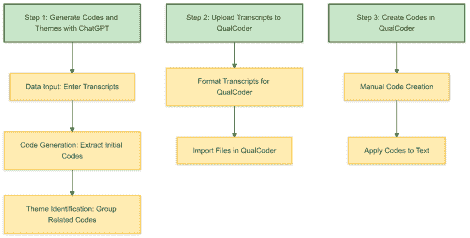

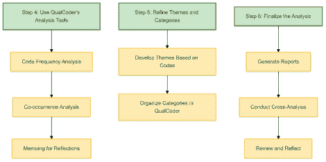

|   |  |   |
| --- | --- | --- |

# 使用 CSV 或 TXT 文件进行半自动化迁移

**半自动化迁移方法**在将 ChatGPT 与 QualCoder 集成时提供了自动化和手动监督之间的平衡（见图 8.2）。此方法适合具有基本技术技能的研究人员，他们希望在保持对代码应用方式控制的同时自动化部分流程。它涉及将 ChatGPT 生成的代码和主题以 CSV 或 TXT 等文件格式导出，然后导入 QualCoder 进行进一步分析。这种方法显著加快了代码和主题的初始设置，同时仍需要手动步骤将代码应用于数据中的特定引语。

这里是对此方法中涉及到的每个子步骤的详细分解。

#### 第 1 步：使用 ChatGPT 生成代码和主题

使用**手动方法**，你首先通过 ChatGPT 从你的定性数据中生成代码和主题。步骤如下：

+   将数据输入 ChatGPT：向 ChatGPT 提供你的定性转录或基于文本的其他数据，并请求代码建议。可能的提示包括：

    "确定关于远程工作挑战的这次访谈中的关键主题，"或

    "在以下文本中生成讨论工作与生活平衡的代码。"

+   代码和主题生成：ChatGPT 将根据内容提供一系列代码和潜在的主题。例如，它可能会生成如远程协作、生产力问题和员工福祉等代码。

+   审查和精炼：在继续之前，审查 ChatGPT 的建议并进行任何必要的调整。这确保了代码的相关性并与其研究问题保持一致。

#### 第 2 步：以 CSV 或 TXT 格式导出代码和主题

一旦 ChatGPT 生成代码和主题，下一步就是将这些内容导出为可以导入 QualCoder 的格式。

+   复制代码和主题：使用 ChatGPT 的输出，将代码和主题列表复制到结构化格式中。您可以通过手动复制和粘贴聊天窗口中的代码和类别来完成此操作，或者通过使用如“生成一个 CSV 适合的代码和主题列表”的提示在 ChatGPT 中生成一个更有序的列表。

+   创建 CSV 或 TXT 文件：将代码和主题保存为 CSV 或 TXT 文件格式。CSV 文件特别适用于在行和列中结构化数据，这使得 QualCoder 可以更容易地读取。CSV 文件的基本结构应类似于以下内容：

表 8.1\. 为导入 QualCoder 组织代码

| 代码 | 主题 | 描述 |
| --- | --- | --- |
| 远程协作 | 团队动态 | 远程沟通问题 |
| 生产问题 | 工作表现 | 维持生产力的困难 |
| 员工福祉 | 情绪健康 | 对工作与生活平衡的担忧 |

此格式确保您的代码组织有序，并允许轻松导入 QualCoder（表 8.1）。

#### 第 3 步：将代码和主题导入 QualCoder

现在，您的代码已保存为 CSV 或 TXT 格式，您可以将其导入 QualCoder，从而节省手动设置代码框架的时间。

+   打开 QualCoder：启动 QualCoder 软件，并打开您的项目。

+   导入代码：在 QualCoder 中导航到“代码”部分，并使用“导入”功能上传包含您的代码的 CSV 或 TXT 文件。QualCoder 将自动创建文件中列出的代码，并将它们与项目关联。

+   审查导入的代码：一旦导入，请审查 QualCoder 中的代码以确保它们已被正确映射。验证每个代码是否都有其关联的描述和主题，如预期。此审查对于避免在导入过程中可能出现的任何格式问题至关重要。

#### 第 4 步：手动将代码与文本片段关联

这种方法的局限性在于，虽然代码和主题可以自动导入，但相应的引言或文本片段则不能。因此，研究人员必须手动将导入的代码与文本的相关部分关联起来。

+   识别相关文本片段：在 QualCoder 中打开您的转录本，并手动突出显示与每个代码对应的文本部分。例如，对于代码“员工福祉”，识别参与者讨论其情绪健康的部分，并将适当的代码应用于这些部分。

+   应用代码：当您突出显示相关的文本段时，应用导入到 QualCoder 中的相应代码。这一步骤仍然是手动的，但确保您仔细审查和解释数据，保持编码的手动方法。

#### 第 5 步：使用备忘录进行上下文注释

为了减轻没有自动将引语链接到导入的代码的限制，您可以使用 QualCoder 的备忘录功能为每个代码或主题添加上下文注释。

+   创建备忘录：为每个代码添加备忘录，解释其上下文或您从数据中收集到的任何见解。例如，如果远程协作是一个代码，您可能创建一个备忘录解释这个代码涵盖了关于远程团队合作和沟通的挑战的讨论。

+   将备忘录链接到代码：将备忘录附加到特定的代码或类别，为每个提供额外的上下文。此功能有助于跟踪在导入过程中未自动生成的见解和反思。

小贴士：您不仅可以用备忘录来记录您的思考，还可以存储任何可能为特定代码或主题提供更多上下文的 ChatGPT 的附加信息。

#### 第 6 步：在 QualCoder 中精炼代码和主题

在将代码与适当的文本段关联后，您可以进一步精炼和组织它们到更广泛的类别或主题中。

+   开发类别：在 QualCoder 中将相关的代码手动分组到类别或主题中。例如，如果你有多个与团队沟通和协作相关的代码，你可能将它们分组在“远程工作挑战”这样的主题下。

+   分层结构：QualCoder 允许您创建代码的层次结构，这有助于构建您的最终分析。例如，在“员工福祉”主题下，您可能有子代码，如压力、工作与生活平衡和心理健康。

#### 第 7 步：最终化并分析数据

一旦您的代码被应用和精炼，您就可以利用 QualCoder 内置的工具进行进一步分析。

+   生成报告：QualCoder 允许您生成代码频率报告，总结每个代码在数据中出现的频率。您可以导出这些报告用于演示或出版物。

+   可视化关系：使用 QualCoder 的可视化工具，如代码关系图和词云，来识别代码之间的模式和联系。

+   交叉检查代码：为确保彻底分析，您可以比较 ChatGPT 生成的代码与您手动精炼的代码。这有助于验证 ChatGPT 输出的准确性和相关性。

#### 半自动化迁移方法的优势

+   节省时间：此方法通过通过 CSV 或 TXT 文件自动化导入过程来加速创建代码和主题的过程。您不需要手动将每个代码或主题输入到 QualCoder 中，在初始设置阶段节省了大量时间。

+   灵活性：虽然涉及一些自动化，但这种方法仍然允许手动精炼和审查数据，确保研究人员对分析保持控制。

+   备忘功能：使用备忘录补充代码增加了灵活性，允许研究人员即使引用没有自动传输也能记录他们的想法和反思。

+   初学者友好，基本技术技能：此过程只需要基本的技能，如处理 CSV 文件，使得那些习惯使用电子表格但可能没有编程知识的学者也能使用。

图 8.2. 从 ChatGPT 到 QualCoder 的半自动传输方法

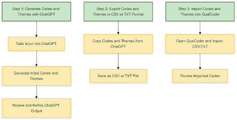

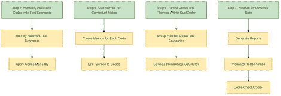

|   |  |   |
| --- | --- | --- |

# 通过 API 集成实现完全自动导入

通过 API 集成实现完全自动导入是集成 ChatGPT 与 QualCoder（图 8.3）的最先进方法。它通过使用 API 将 ChatGPT 生成的代码、主题和模式直接自动传输到 QualCoder。这种方法非常适合处理大型数据集且需要最高效率的研究人员。然而，它需要具备编程和 API 开发方面的扎实理解，以设置 ChatGPT 和 QualCoder 之间必要的连接。

在本节中，我们将概述使用 API 设置完全自动化系统的关键步骤，并讨论与此方法相关的优势和挑战。

#### 第 1 步：了解 API 并设置 ChatGPT 和 QualCoder 以进行集成

在深入技术设置之前，理解 API 在促进 ChatGPT 和 QualCoder 之间自动数据传输中的作用非常重要。

+   什么是 API？：API 允许两个软件平台自动通信和交换数据。在这种情况下，API 将使 ChatGPT 能够直接将生成的代码、主题和模式发送到 QualCoder，无需人工干预。

+   设置 OpenAI 的 API（ChatGPT）：您需要创建一个 OpenAI 账户并获取访问 ChatGPT 的 API 密钥。API 密钥允许您以编程方式发送和检索数据从 ChatGPT。

    +   获取 API 密钥：在 OpenAI 平台上注册并导航到 API 部分。从那里，您可以生成一个 API 密钥，该密钥将用于您的代码中，以访问 ChatGPT 的服务。

    +   API 文档：查阅 OpenAI API 文档，了解向 ChatGPT 发送数据并接收其输出的可用方法。这包括从文本数据生成代码和主题的方法。

+   设置 QualCoder 的 API 访问：QualCoder 目前不提供原生 API，但它支持导入 REFI-QDA 文件（定性数据的标准化格式）。为了实现完全自动化，您需要为 QualCoder 开发自定义 API 或使用支持基于 API 的数据传输的第三方工具。

    +   开发自定义 API 解决方案：如果您具有高级编程技能，可以创建一个自定义脚本或中间件，作为 QualCoder 的 API，将 ChatGPT 的输出转换为 QualCoder 可以解释和导入的格式。

    +   第三方应用程序：如果直接与 QualCoder 的 API 集成具有挑战性，考虑使用支持 API 和 REFI-QDA 文件格式的第三方软件作为 ChatGPT 和 QualCoder 之间的桥梁。

#### 第 2 步：自动化从 ChatGPT 到 QualCoder 的数据传输

一旦 API 访问设置完成，下一步就是自动化将代码和主题从 ChatGPT 传输到 QualCoder。

+   通过 API 向 ChatGPT 发送数据：首先，通过其 API 将您的定性数据（例如，访谈记录）编程发送到 ChatGPT。这可以通过编写一个将文本数据输入 ChatGPT 并请求代码和主题生成的脚本来完成。示例 API 请求：

python

复制代码

import openai

openai.api_key = 'your-api-key-here'

response = openai.Completion.create(

engine="gpt-4",

prompt="Identify key codes and themes from this interview transcript: [your transcript text here]",

max_tokens=1000

)

codes_and_themes = response['choices'][0]['text']

上述脚本将发送您的访谈记录到 ChatGPT，并接收包含建议代码和主题的响应。

+   将输出转换为结构化格式：一旦 ChatGPT 返回代码和主题，将输出格式化为 QualCoder 可以自动处理的格式。这通常涉及将输出保存为 CSV 或 JSON 文件。例如，简单的转换可以将代码输出到如下 CSV 文件：

python

复制代码

import csv

with open('codes.csv', mode='w', newline='') as file:

writer = csv.writer(file)

writer.writerow(["代码", "主题", "描述"])

for code, theme, description in codes_and_themes:

writer.writerow([code, theme, description])

此脚本创建一个 CSV 文件，稍后可以导入到 QualCoder。

+   自动导入到 QualCoder：如果您正在开发 QualCoder 的 API 或使用第三方工具，下一步是设置一个系统，自动将 ChatGPT 生成的 CSV 或 JSON 文件导入到 QualCoder 中。这可以通过自定义中间件实现，该中间件读取文件并将代码和主题插入到 QualCoder 的数据库或项目文件结构中。

#### 第 3 步：处理 REFI-QDA 格式以实现 QualCoder 集成

由于 QualCoder 支持 REFI-QDA 标准，您可能需要将 ChatGPT 的输出转换为该格式，以完全自动化导入过程。

+   什么是 REFI-QDA？：REFI-QDA 是定性分析软件用于在不同平台之间交换数据（例如，代码、主题和转录信息）的标准格式。虽然 ChatGPT 原生不支持 REFI-QDA，但你可以创建一个脚本，将 ChatGPT 的输出格式化为这种格式。

    +   转换脚本：编写一个脚本，将 ChatGPT 的输出转换为 REFI-QDA 格式。这可能涉及将 ChatGPT 中的代码和主题映射到基于 XML 的 REFI-QDA 结构中。

    +   第三方工具：或者，使用 NVivo 或 ATLAS.ti 等第三方应用程序，这些工具支持 API 集成和 REFI-QDA 导入，作为过程中的中间件。这些工具可以帮助弥合 ChatGPT 的输出和 QualCoder 的要求之间的差距。

#### 第 4 步：运行自动化工作流程

在 API 和数据转换过程就绪后，你现在可以自动化整个工作流程。以下是过程的简化概述：

1.  数据提交：研究人员将定性数据（转录、笔记等）上传到自动化脚本中，该脚本通过 API 将其发送到 ChatGPT。

1.  代码和主题生成：ChatGPT 处理数据并返回一个结构化的代码和主题列表。

1.  文件转换：输出自动转换为 CSV、JSON 或 REFI-QDA 格式。

1.  自动导入到 QualCoder：代码和主题通过自定义 API 连接或第三方软件中介直接转移到 QualCoder 的项目环境中。

1.  代码应用：在最高级的设置中，系统也可能尝试直接将代码应用到 QualCoder 中相关的文本片段，尽管这个功能可能仍然需要根据数据的复杂性进行一些手动干预。

#### 第 5 步：审查和最终分析

在完全自动化的导入过程之后，审查结果以确保准确性和相关性是非常重要的。

+   审查代码和主题：尽管传输是自动化的，但手动审查 QualCoder 中的代码和主题以验证它们是否符合你的研究目标是很重要的。

+   根据需要细化：对代码进行必要的调整，将相关的代码分组到类别中，并创建备忘录以记录你的分析过程。

+   应用 QualCoder 工具：一旦数据导入，你可以利用所有 QualCoder 的内置分析工具，例如代码频率分析、共现表和可视化功能，进行更深入的分析。

#### 完全自动化集成的挑战和考虑因素

尽管完全自动化的方法提供了效率和可扩展性，但也伴随着一些挑战：

+   技术专业知识：这种方法需要大量的编程知识来设置 API 连接并开发自动化数据传输过程的脚本。没有编码经验的研究人员可能会发现这种方法难以实施。

+   格式兼容性有限：ChatGPT 目前不支持 QualCoder 必需的 REFI-QDA 格式，因此需要额外的工具或自定义脚本来将 ChatGPT 的输出转换为兼容的格式。

+   调试和维护：API 连接和脚本可能需要持续的调试和维护，尤其是如果 ChatGPT 或 QualCoder 有更新。研究人员需要确保他们的自动化工作流程在软件平台发展过程中保持功能正常。

#### 完全自动方法的优点

+   大数据集的效率：这种方法特别适用于处理大量定性数据的研究人员，因为它消除了手动编码和数据输入的需要。

+   无缝集成：当正确设置时，这种方法提供了 ChatGPT 和 QualCoder 之间的无缝、端到端集成，使研究人员能够更多地专注于分析而不是行政任务。

+   可扩展性：这种方法可以扩展以处理多个项目或大型数据集，对于需要大量数据分析的研究团队或组织来说是一个理想的解决方案。

图 8.3\. 通过 API 集成从 ChatGPT 完全自动导入到 QualCoder

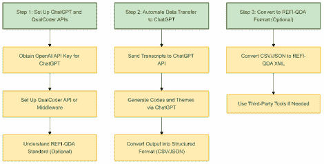

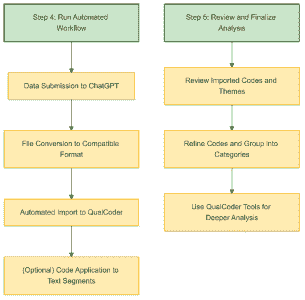

| 章节要点：

+   将 ChatGPT 与 QualCoder 集成通过结合 AI 能力和强大的开源工具，提高了定性数据分析的效率。

+   有三种集成方法——手动导入、半自动传输和通过 API 集成的完全自动导入——每种方法的自动化程度和技术专业知识要求各不相同。

+   手动导入方法涉及在 QualCoder 中手动应用 ChatGPT 生成的代码，提供完全的控制并与研究目标保持一致。

+   半自动传输方法使用 CSV 或 TXT 文件将 ChatGPT 代码导入到 QualCoder，节省了设置时间，但需要手动将代码与文本片段关联起来。

+   通过 API 集成完全自动导入方法使用 API 将 ChatGPT 的代码自动传输到 QualCoder，非常适合大型数据集，但需要高级技术技能以及可能需要额外的工具。

+   每种方法都允许研究人员根据他们的需求和技能优化他们的工作流程，同时确保严格的定性分析。

+   完全自动方法面临的挑战包括技术复杂性和兼容性问题，需要编程专业知识以及可能使用第三方工具。

+   选择合适的集成方法可以借助 QualCoder 的功能实现 AI 驱动的编码，提高效率而不影响研究质量。

|

第九章。

|   |  |   |
| --- | --- | --- |

# 为 AI 集成准备您的科研环境

|   |  |   |
| --- | --- | --- |

# 访问和配置 ChatGPT

为了有效地使用 ChatGPT 进行定性数据分析，理解访问和配置工具的不同方法至关重要。总的来说，有两大主要方式可以利用 ChatGPT 进行定性分析：

1.  使用默认 GPT 模型（通过 OpenAI 的网络界面或 API）

1.  构建针对定性分析量身定制的自定义 GPTs。

每种方法都有其独特的优势和局限性，您的选择将取决于项目的复杂性、您的技术技能以及您研究的具体需求（表 9.1）。

#### 1. 使用默认 GPT 模型进行定性分析

最常见且最直接的方法是直接通过 OpenAI 的网络界面或通过 API 集成（23）使用默认 GPT 模型（如 GPT-4）。这种方法易于访问，且几乎不需要任何技术专长。

+   访问 ChatGPT：您可以通过 OpenAI 网络界面（chat.openai.com）轻松访问 GPT 模型，或者使用 OpenAI API 将工具集成到您的流程中。这允许您输入定性数据，例如访谈记录，并直接从 ChatGPT 收到生成的主题、代码或甚至摘要。

+   订阅计划：如果您正在进行复杂分析或需要处理大量定性数据，请考虑使用 ChatGPT Plus，它提供了访问更先进的 GPT-4 模型的权限。GPT-4 提供了更好的语言理解能力、更高的准确度，并且可以处理比之前版本更复杂和细微的输入。

+   配置研究需求：

    +   提示制作：在使用默认模型时，您的成功在很大程度上取决于您如何制作提示。例如，您可以指示 ChatGPT 在一组回应中“识别关键主题”，或者您可以要求它“根据这份记录生成初始代码”。您需要确保提示清晰且具体，以产生有用的结果。

使用默认 GPT 模型的优点：

+   易于访问：默认模型通过简单的用户界面即可轻松获取，无需进行大量设置或技术知识。

+   快速高效：您无需构建或配置专用模型即可立即开始分析您的定性数据。

+   广泛适用：默认 GPT 模型通用性强，可以处理从总结到主题分析的各种定性任务。

使用默认 GPT 模型的缺点：

+   通用输出：由于模型未针对您的特定数据或分析需求进行定制，结果可能较为宽泛或缺乏复杂定性研究所需的深度。

+   定制化有限：您无法微调默认模型以专门从事定性研究，这可能会限制它们在识别非常狭窄或特定主题方面的有效性。

#### 2. 为定性分析构建自定义 GPT

对于寻求在定性分析中定制支持的学者，OpenAI 提供了使用其内置工具创建自定义 GPT 的能力。此功能允许您为您的项目构建和自定义 GPT，而无需使用 API 或复杂的编程。您可以通过提供特定的指令和示例来创建自定义 GPT，确保模型更加专注于您定性研究的独特主题和需求。

#### 什么是自定义 GPT？

自定义 GPT 是 GPT 模型的个性化版本，可以适应满足您特定的研究需求。通过 OpenAI 的用户友好界面，您可以通过输入您的数据和为您的定性研究制定详细的指令来自定义 GPT 的行为。例如，如果您正在分析与心理健康相关的访谈数据，您可以根据您的指令和示例创建一个专注于识别压力、应对机制或情绪福祉等概念的定制 GPT。

#### 构建自定义 GPT

+   定义您的指令和示例：首先概述您希望自定义 GPT 执行的具体任务。您可以通过提供详细的指令和示例问题来引导模型，帮助它专注于您研究中最相关的方面。

+   自定义 GPT：OpenAI 的内置工具允许您在不使用编程或 API 的情况下自定义 GPT 的行为。您可以定义模型的语气，阐明其在您研究中的角色，并上传样本数据以提供分析背景。例如，您可以指示它专注于识别与工作生活平衡、情绪压力或社交互动相关的主题。

+   测试和改进：一旦创建了自定义 GPT，您可以通过提出具体的研究相关查询来测试它。根据其响应，您可以进一步改进指令和行为，以确保它产生准确且富有洞察力的输出，与您的研究目标保持一致。

#### 构建自定义 GPT 的优点

+   适合您的研究：自定义 GPT 可以设计为专注于您的特定定性数据，产生与您的研究目标一致的相关代码和主题。

+   使用更便捷：与使用 API 从头开始构建模型的技术复杂性相比，OpenAI 的内置自定义 GPT 创建工具用户友好，且不需要任何编程知识。这使得它对具有不同技术水平的研究者都易于访问。

+   快速定制：自定义 GPT 可以相对快速地设置，使您能够在不进行大量设置的情况下调整其行为和焦点，使其非常适合对时间敏感的项目。

#### 构建自定义 GPT 的缺点

+   限制于预定义的功能：虽然定制选项很灵活，但你仍然是在 GPT 现有的框架内工作，这可能会限制与使用 API 训练的定制模型相比更高级或更具体的需求。

+   需要持续优化：尽管设置简单，定制 GPT 可能仍然需要基于测试和反馈的迭代优化，以确保它们与你的具体研究需求保持一致。

+   可能的成本：虽然使用定制 GPT 不涉及 API 驱动的微调的高成本，但根据你的数据量和定制需求，可能仍会有使用费用。

通过利用 OpenAI 内置的定制 GPT 工具，研究人员可以轻松创建适合他们定性研究需求的专用模型，而无需广泛的技术专业知识或资源。这使得定制 GPT 成为针对项目独特主题和问题的 AI 分析定制解决方案的理想选择。

|   |  |   |
| --- | --- | --- |

# 选择正确的方法

选择使用默认 GPT 模型或创建定制 GPT 取决于你的具体研究需求、时间表和资源。如果你寻求快速、一般性的见解且不需要深度定制，默认模型可能就足够了。然而，如果你的项目涉及复杂定性分析，具有特定主题或语言细微差别，构建定制 GPT 可能提供更高的精确度和相关性。

对于大多数一般性的定性研究项目，从默认模型开始并制作特定的提示将是实际和高效的选择。随着你的研究发展，如果你需要更多专业化的分析，你可能考虑过渡到定制 GPT。

注意：GPT 模型会持续更新，并随着时间的推移进行改进。为了获取最新功能和版本，建议定期检查 OpenAI 网站，以了解 GPT 模型的最新进展和能力。

表 9.1\. 访问和配置 ChatGPT 的方法

| 方面 | 使用默认 gpt 模型 | 构建定制 gpts（使用 openai 的内置工具） |
| --- | --- | --- |
| 定义 | 通过 OpenAI 的网页界面使用标准 GPT 模型（如 GPT-4）进行定性任务。 | 通过 OpenAI 内置的 GPT 定制功能创建针对你的研究需求定制的专业 GPT，无需 API。 |
| 访问方法 | - 通过 OpenAI 的网页界面访问。- 需要最少的设置或技术知识。 | - 通过 OpenAI 的网页界面（定制 GPT 功能）。- 不需要 API 或编程；直接在 OpenAI 的用户界面中构建。 |
| 配置 | - 为所需结果制定清晰和具体的提示。- 通过界面调整温度和语气设置以实现受控输出。- 提供详细的指令和示例以指导模型。- 无需技术编码技能即可自定义 GPT 的行为。 |
| 最佳使用案例 | - 快速、高效的访问，适用于总结、识别主题和生成初始代码等一般定性任务。- 适用于简单的科研项目。- 理想适用于需要更多具体焦点或与您研究相关的主题（例如，探索压力管理、特定的文化模式）的研究。- 对于希望获得更多定制见解而不需要编码或 API 设置的研究人员来说非常合适。 |
| 优点 | - 易于访问：简单的界面，即用即用。- 快速结果：立即访问定性分析。- 多功能性：可以处理广泛的定性任务。- 适合研究：易于定制以生成更准确、项目特定的输出。- 无需技术专长：无需编程或 API。- 深度见解：根据具体指令提供细微的数据。 |
| Cons | - 广义输出：可能缺乏高度专业化的定性分析深度。- 有限的自定义：仅提供对输出和行为的基本调整。- 限于预定义框架：虽然高度可定制，但功能仍限于更广泛的 GPT 模型的能力。- 持续改进：可能需要迭代调整以完善输出。 |
| 订阅/费用 | - ChatGPT Plus 订阅提供对性能更好的 GPT-4 的访问，适用于复杂任务。- 使用费用取决于数据量和定制，但无需涉及 API 费用。 |
| 示例使用案例 | - "在这篇访谈记录中识别与工作生活平衡相关的关键主题。" | - "根据提供的定制指令，分析这个焦点小组中关于压力的参与者的具体情绪反应。" |

此表提供了使用默认 GPT 模型和为定性研究构建自定义 GPT 之间的清晰比较，帮助研究人员根据他们的项目需求、技术技能和资源确定最佳方法。

|   |  |   |
| --- | --- | --- |

# 数据准备：清洗和格式化定性数据

一旦你访问了 ChatGPT 并决定使用默认模型或自定义 GPT，下一步就是准备你的定性数据以进行分析（图 9.1）。原始定性数据，如访谈记录、焦点小组讨论或观察笔记，通常需要清理和格式化，以便与 AI 辅助分析兼容。适当的数据准备确保 ChatGPT 在主题分析期间提供准确、有意义和相关的结果。

#### 数据清理和格式化步骤：

|   |  |   |
| --- | --- | --- |

# 转录准确性

如果你的数据包括访谈、焦点小组或其他音频/视频记录，拥有准确且清晰的转录本至关重要。虽然有多种转录工具可用，如 Otter.ai、Rev 或 Descript，但始终手动审查转录本以纠正任何错误。ChatGPT 在定性分析中的表现高度依赖于输入质量。转录本中的不准确——如听错的话或遗漏的句子——可能导致错误的编码或主题识别错误。

+   使用自动转录工具：自动转录工具是快速将音频数据转换为文本的有效方法。然而，无论多么先进，AI 驱动的转录工具都不是完美的。术语误解、说话者变化和背景噪音可能导致不准确，这就是为什么手动审查至关重要的原因。

+   手动审查：在生成转录本后，彻底审查以确保重要细微差别没有丢失或被错误地表达。当分析具有特定术语或背景的复杂访谈时，这一步骤至关重要。

|   |  |   |
| --- | --- | --- |

# 适用于 AI 可读性的格式化

为了确保 ChatGPT 能够有效地分析你的数据，重要的是以使 AI 易于处理的方式格式化转录本。格式化在帮助 ChatGPT 识别你的数据结构并在分析期间准确响应中起着关键作用。

+   移除多余信息：应删除或清理不必要的信息，例如时间戳、填充词（“嗯”，“你知道”，“就像”），或重复的采访提示。这些元素可能会使 ChatGPT 困惑，导致无关代码或主题。

    +   示例：

        +   原始：“嗯，是的，我想……就像，当我们使用 VR 时，嗯，很有趣，但也有些，你知道，耗精力。”

        +   清理后：“当我们使用 VR 时，很有趣，但也有些耗精力。”

+   标准化访谈结构：如果你正在分析多个访谈或讨论，确保所有转录文本遵循一致的结构。使用如“访谈者”和“参与者”等标题明确区分访谈者的问题和参与者的回应。这允许 ChatGPT 更好地理解对话的流程，并在分析中关注相关内容。

    +   示例格式：

        +   访谈者："使用 VR 如何影响你的生产力？"

        +   参与者："这有助于创意任务，但在常规会议中却是一个挑战。"

+   标记关键段落：使用标签或标记来标记你的转录文本中的关键区域。这使得 ChatGPT 在分析期间更容易关注特定部分，例如直接与生产力或幸福感相关的回应。你可以引入如“团队协作”或“情感福祉”等部分以提高清晰度和专注度。

|   |  |   |
| --- | --- | --- |

# 拆分大型数据集

ChatGPT 有令牌限制，这意味着它只能在一个查询中处理一定量的文本。如果你的访谈转录文本或数据集很长，你需要将它们拆分成更小、更易管理的部分。这一步对于避免过载模型和分析中丢失上下文至关重要。

+   拆分大型转录文本：如果访谈很长或包含多个部分，可以通过对每个具体问题的回应或主题（例如，“生产力”、“团队互动”、“幸福感”）进行拆分。通过保持部分逻辑结构，你允许 ChatGPT 在较小的数据批次中保持必要的上下文。

    +   示例：

        +   而不是提交一个完整的 3,000 字访谈，可以将其拆分为如下部分：

            +   第一部分：关于生产力的回应（1,000 字）

            +   第二部分：关于团队互动的回应（1,000 字）

            +   第三部分：关于幸福感的回应（1,000 字）

这种方法确保 AI 专注于数据的特定方面，生成更准确和主题特定的见解。

|   |  |   |
| --- | --- | --- |

# 主题数据清理

一旦你的转录文本格式化并分成可管理的部分，重要的是要考虑到你预定义的主题来清理你的数据。对于演绎性主题分析，你将已经从你的理论框架中识别出关键主题或类别。按照这些主题准备你的数据有助于 ChatGPT 专注于正确的内容并产生相关的代码或见解。

+   预先识别主题：突出显示与您关键兴趣区域相对应的转录部分。例如，如果您的预定义主题包括“沟通”、“生产力”和“情感福祉”，请确保转录的相关部分按此组织。这可以手动完成或通过文本标记完成，例如：

    +   示例：

        +   [主题：沟通]

        +   参与者： “VR 无疑使团队沟通更加动态，但虚拟环境也带来了一些尴尬。”

        +   [主题：生产力]

        +   参与者： “当我使用 VR 进行创意任务时，我感觉更有生产力，但常规会议感觉有点繁琐。”

+   使用标签和注释：如果您的转录存储在文本编辑器或定性分析软件中，请使用注释或标记功能来识别分析中的重要部分。当将这些内容输入 ChatGPT 时，您可以使用这些标记来指示 AI 关注特定的方面，确保它与您的研究主题相一致。

|   |  |   |
| --- | --- | --- |

# 数据清洗示例工作流程：

1.  转录：使用自动化工具进行初步转录，然后进行人工审查以确保准确性。

1.  清洗：删除填充词、时间戳和无关信息。

1.  格式：通过明确标记访谈者的问题和参与者的回答来确保一致性，并为特定主题引入带有相关标签的章节。

1.  分块：将长访谈分成更小、逻辑上连贯的部分，以适应 ChatGPT 的令牌限制。

1.  预标签主题：根据您研究预定义的主题识别并标记您的转录中的重要部分，使 ChatGPT 能够生成相关的代码变得更容易。

通过正确清洗和格式化您的数据，您确保 ChatGPT 可以准确处理您的定性转录并生成有意义的代码和主题。下一步涉及使用这些精心准备的转录和有效的提示引导 ChatGPT 通过分析过程。

图 9.1. 使用 ChatGPT 进行定性分析的数据清洗和格式化步骤

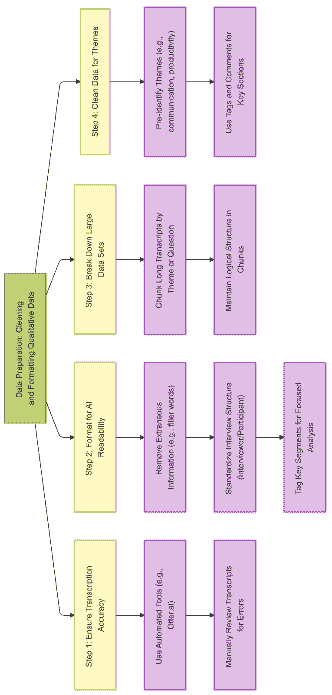

确保数据隐私和合规性

定性研究通常涉及敏感和个人的数据，尤其是当它涉及访谈、焦点小组或任何形式的数据收集，这些数据收集捕捉到个人的经验和见解时。当使用 ChatGPT 进行定性研究时，确保数据隐私和符合伦理标准变得更加重要。AI 工具如 ChatGPT 处理大量文本数据，在遵守法律和伦理要求的同时保护研究参与者的隐私至关重要。

这里是确保在 AI 辅助定性研究中数据隐私和合规性的关键考虑因素：

|   |  |   |
| --- | --- | --- |

# 匿名化数据

匿名化是准备定性数据以供 ChatGPT 分析时最重要的步骤之一。这涉及到从记录中移除任何个人标识符以保护参与者的隐私并确保机密性。

#### 匿名化数据步骤：

+   移除识别信息：在将你的访谈记录输入 ChatGPT 之前，确保移除或用通用标签替换所有个人标识符，例如姓名、职位、公司详情和地理位置。这最大限度地减少了从数据中识别个人的风险。

    +   示例：

        +   而不是“来自 ABC 公司的约翰·史密斯”，使用“来自公司 A 的参与者 1”。

        +   对于地理细节，用更广泛的术语替换具体的城市或地点，例如用“地区 X”代替“纽约市”。

+   匿名化：为参与者分配唯一的化名或代码（例如，“参与者 1” , “团队成员 A” ）以在整个分析过程中区分他们，同时不透露他们的身份。这允许你在保护匿名性的同时保持数据的清晰性。

在使用 ChatGPT 之前对数据进行匿名化是确保在分析过程中敏感信息不会被泄露或不当处理的关键。

|   |  |   |
| --- | --- | --- |

# 知情同意

知情同意是研究中的基本伦理原则，尤其是在使用像 ChatGPT 这样的 AI 工具时。参与者必须充分了解他们的数据将被如何使用，包括其通过 AI 系统的处理，并且在数据收集开始之前必须给予明确的同意。

#### 知情同意步骤：

+   关于 AI 使用的透明度：确保你的同意书清楚地概述了 AI（尤其是 ChatGPT）在分析过程中的使用方式。解释他们的定性数据（例如，访谈记录）将由 AI 系统处理以生成见解或主题，并澄清这在通俗语言中的含义。参与者应了解他们的数据将如何被使用、存储和保护。

+   外部系统同意：由于 ChatGPT 是一个外部 AI 工具，因此必须告知参与者他们的数据可能由第三方平台（在这种情况下是 OpenAI）处理。参与者应了解任何潜在的数据传输可能超出主要研究机构。

+   自愿参与：重申参与是自愿的，参与者可以在任何时候无惩罚地退出。提供明确的指示，说明他们如何撤销同意，如果他们决定不再参与。

通过获得明确涵盖 AI 使用的知情同意，您确保参与者充分了解他们的权利和研究的范围。

|   |  |   |
| --- | --- | --- |

# 遵守数据保护法律

在进行涉及敏感定性数据的研究时，您必须遵守相关数据保护法律，这些法律规定了个人数据的存储、处理和使用。这些法律因地区而异，了解适用于您的研究的法律非常重要。

#### 关键数据保护法律：

+   GDPR（通用数据保护条例）：如果您的涉及欧洲参与者的研究，您需要遵守 GDPR，该条例规定了个人数据必须如何处理和保护。根据 GDPR，个人数据必须匿名化、安全存储并经明确同意处理。

+   CCPA（加利福尼亚消费者隐私法案）: 对于涉及加利福尼亚参与者的研究，CCPA 概述了数据隐私权，包括了解个人数据如何被使用以及请求删除数据的权利。

+   其他地区法律：根据参与者的位置，熟悉当地的数据保护法规，例如加拿大的 PIPEDA、美国的健康相关研究 HIPAA 或澳大利亚隐私原则（APPs）。

确保您使用 ChatGPT 的方式符合这些法律框架。这包括告知参与者他们根据这些法律享有的权利，例如访问他们的数据或请求删除数据的权利。

|   |  |   |
| --- | --- | --- |

# 存储和数据安全

在处理敏感定性数据时，确保数据在整个研究过程中安全存储和保护至关重要，从最初的数据收集到分析阶段。适当的存储和安全措施可以防止未经授权的访问或泄露，尤其是在使用基于云的服务或外部工具如 ChatGPT 时。

#### 数据存储和安全最佳实践：

+   加密：将所有数据，包括转录和分析输出，存储在安全、加密的数据库中。这确保了即使数据被截获，没有解密密钥也无法读取或访问。

+   云服务合规性：如果您使用基于云的服务来存储数据，请确保这些服务符合数据保护法规，如 GDPR 或 CCPA。云服务提供商应提供强大的加密和访问控制。

+   访问控制：仅限直接参与研究的人员访问敏感数据。确保所有可以访问数据的使用者使用强密码和双因素认证（2FA）以防止未经授权的访问。

+   备份程序：定期备份您的数据以防止系统故障导致的数据丢失。但是，请确保备份副本也进行了加密并安全存储。

|   |  |   |
| --- | --- | --- |

# OpenAI 的数据使用政策

当使用 ChatGPT 进行定性分析时，了解 OpenAI 的数据使用政策非常重要。截至写作时，OpenAI 不会将其 API 收到的数据用于训练目的，除非用户同意。然而，这项政策可能会改变，因此保持对 OpenAI 服务条款的更新至关重要。

#### 需要审查的内容：

+   数据保留政策：检查 OpenAI 通过 API 提交的数据保留时间以及为确保数据隐私所采取的措施。理想情况下，您希望确保数据不会无限期存储，分析完成后即被删除。

+   数据处理实践：请查阅 OpenAI 的条款，了解您的数据是如何被处理的，无论是用于分析、存储还是用于模型训练。如果此选项可用，您可以选择退出未来模型训练中的数据使用。

通过了解 OpenAI 的数据政策，您确保您的科研与您的道德标准一致，并符合关于数据使用的参与者同意。

|   |  |   |
| --- | --- | --- |

# 透明度和道德报告

在发布或展示您的研究时，关于如何使用 ChatGPT 的透明度至关重要。道德报告包括清楚地记录 AI 在数据分析过程中的作用，并解决 AI 可能引入分析中的任何局限性或潜在偏差。

#### 透明报告的步骤：

+   记录 ChatGPT 的作用：清楚地解释 ChatGPT 在研究过程中的使用情况——无论是用于生成代码、识别主题还是分析模式。这应该是您的方法论部分的一部分，其中描述了用于分析的工具和流程。

+   承认局限性：像 ChatGPT 这样的 AI 模型可能会引入偏见或疏忽。坦率地说明这些局限性以及你如何减轻它们，例如在人类监督下审查和改进 AI 生成的代码。重要的是要承认，尽管人工智能可以帮助分析，但最终的解释仍然应该由研究人员负责。

+   维护道德边界：确保你的分析符合道德标准，例如公平性、准确性以及对参与者数据的尊重。不要过度夸大人工智能的能力，并确保人类判断和专业知识在研究结论中保持核心地位。

|   |  |   |
| --- | --- | --- |

# 访谈记录示例

以下访谈示例关注员工和团队如何受到远程工作环境中虚拟现实（VR）引入的影响。这可能包括使用 VR 进行虚拟会议、协作项目和甚至虚拟工作空间中的社交互动。

由于虚拟现实（VR）在专业环境中的新颖性，参与者可能是远程员工或管理人员，他们一直在尝试使用 VR 工具来增强协作、沟通和团队建设。访谈的目的是捕捉他们的独特经历以及他们遇到的挑战和机遇。

"虚拟现实（VR）对远程工作环境中团队协作的影响"

理由：

远程工作的兴起加速了新技术在工作场所的应用，包括虚拟现实（VR）。然而，使用 VR 进行远程团队协作的影响尚未得到广泛研究。这个主题相对较新，使我们能够探索沉浸式技术如 VR 如何塑造团队在虚拟空间中的互动、协作和沟通方式。随着 VR 在远程会议、虚拟头脑风暴会议和培训计划中的应用越来越受欢迎，这个主题为如何尖端技术影响工作场所动态提供了新的视角，使其成为定性分析的理想主题。

|   |  |   |
| --- | --- | --- |

# 演绎主题分析

演绎主题分析非常适合探索像远程工作环境中的 VR 这样的新颖且不断发展的主题。在这种情况下，分析将由基于现有团队协作和工作场所技术采用理论的预定义主题指导。通过将这些预定义主题应用于访谈数据，我们可以探索 VR 的整合如何影响沟通、生产力、人际关系以及虚拟工作环境中的整体团队凝聚力。

我们的关注点将是如何利用 ChatGPT 从访谈记录中识别关键主题和重复出现的模式，将这些与预先建立的类别对齐，并帮助研究人员探索 VR 对团队动态的更广泛影响。

这个例子使我们能够调查研究不充分探索的领域，例如 VR 是否有助于弥合地理上分散的团队之间的差距，促进更好的沟通，甚至创造新的工作场所压力或数字疲劳。

|   |  |   |
| --- | --- | --- |

# 访谈结构：

半结构化访谈设计将重点关注与 VR 及其对远程团队协作的影响相关的核心领域。这种结构允许进行详细的质量响应，同时确保访谈与预定义的主题保持一致。

#### 访谈结构：

1.  引言和一般问题：

    +   “您在远程工作环境中使用虚拟现实（VR）工具有多长时间了？”

    +   “您的团队使用 VR 的主要任务或活动是什么？”

1.  团队沟通与协作：

    +   “VR 如何影响您在远程工作中与团队沟通的方式？”

    +   “您认为与传统的视频会议工具相比，VR 有助于还是阻碍了协作？”

1.  团队动态与关系：

    +   “VR 的使用是否影响了您与同事之间的联系感？”

    +   “您认为 VR 是否改变了团队成员之间的互动方式或建立关系的方式？”

1.  生产力和效率：

    +   “您在使用 VR 进行会议或协作任务时，感觉更有效率还是更少？”

    +   “VR 在远程项目中的任务管理是否带来了任何挑战或改进？”

1.  情感和心理影响：

    +   “使用 VR 进行工作如何影响您的心理健康或压力水平？”

    +   “您是否经历过任何形式的数字疲劳或 VR 相关的疲劳？”

1.  适应与学习曲线：

    +   “适应工作场所中的 VR 工具的学习曲线是什么样的？”

    +   “您的公司是否为过渡到 VR 提供了足够支持？”

1.  VR 在远程工作中的未来：

    +   “您认为 VR 在未来远程工作中将扮演更重要的角色吗？为什么或为什么不？”

    +   “您建议在团队协作中使用 VR 时进行哪些改变或改进？”

1.  结束问题：

    +   “您想分享关于您使用 VR 的经验，而我们尚未涉及的内容是什么？”

    +   “您认为关于 VR 对团队动态的影响还有什么其他重要的事情吗？”

这种结构平衡了实际问题和探索性问题，使参与者能够分享他们个人经验的见解，同时确保访谈涉及与远程工作和 VR 相关的主题。

|   |  |   |
| --- | --- | --- |

# 预定义主题用于演绎分析

对于演绎主题分析，我们将使用基于现有文献中关于团队协作、技术采用和 VR 等沉浸式环境心理效应的预定义主题。

#### 预定义主题：

1.  沟通和互动：

    +   重点关注：VR 如何影响团队内部以及团队成员之间的沟通。

    +   子主题：沟通清晰度、协作便利性、非正式与正式互动、VR 中的非言语线索。

1.  团队凝聚力和关系：

    +   重点关注：VR 对团队动态和人际关系的影响。

    +   子主题：团队凝聚力、社交联系、建立信任、远程团队整合。

1.  生产力和工作流程：

    +   重点关注：VR 如何影响远程工作环境中的个人和团队生产力。

    +   子主题：任务效率、专注力、工作流程管理、VR 中的多任务处理。

1.  情感和心理影响：

    +   重点关注：作为工作工具使用 VR 的心理和情感影响。

    +   子主题：压力、数字疲劳、认知负荷、沉浸式超负荷、孤独或存在感。

1.  适应和学习曲线：

    +   重点关注：在职场中采用和适应 VR 技术的容易程度。

    +   子主题：培训、学习挑战、技能获取、公司支持。

1.  对未来使用的感知：

    +   重点关注：员工对远程工作中 VR 长期可行性和未来的看法。

    +   子主题：可扩展性、长期适应、创新潜力、采用障碍。

这些预定义主题将指导我们的演绎分析，ChatGPT 将协助从访谈数据中识别相关代码。这些主题提供了一种结构化的方式来分析 VR 对远程工作的影响，同时为针对这一新兴技术的特定见解留出空间。

|   |  |   |
| --- | --- | --- |

# 假设性访谈记录

#### 访谈者：你在远程工作环境中使用 VR 工具有多久了，你们团队通常使用 VR 来完成哪些任务或活动？

参与者：我大约已经使用 VR 八个月了。最初，我们只是偶尔使用它进行会议——通常在我们需要头脑风暴或进行更互动的讨论时。但随着时间的推移，它已经变成了更常见的事情。现在，我们用它来进行更大的团队会议、虚拟培训课程和创意研讨会。当我们需要视觉协作时尤其有用，比如我们在虚拟白板上绘制想法或审查 3D 模型时。我认为它比常规的视频通话更直观，但我们并不是用它在所有事情上。有时，直接跳上 Zoom 仍然更容易。

#### 采访者：VR 如何影响你在远程工作时与团队沟通的方式？

参与者：它确实改变了我们沟通的方式，而且大部分情况下，这已经是一个改进。在 VR 中，感觉我们都在同一个房间里，这增加了你在传统视频通话中得不到的参与度。这些虚拟形象给人一种存在感，尽管它是虚拟的，但它有助于肢体语言和非言语提示。我发现我在 VR 会议中更加专注——当你完全沉浸其中时，很难分心。

话虽如此，也有一些挑战。团队中并非每个人都舒服地使用 VR，所以参与度存在一些差距。有些人仍然犹豫不决，这可能会减慢事情的发展。此外，一开始的技术学习曲线很陡峭——存在头戴设备无法正常工作的问题，或者人们不熟悉如何导航虚拟空间。现在它已经变得稍微顺畅一些，但偶尔还是会有一些故障或有人在虚拟房间中迷路。

#### 采访者：使用 VR 是否影响了你与同事之间的联系感？你认为它是否改变了你与团队成员互动的方式？

参与者：在某些方面，它确实让我们更近了。虚拟环境让我们感觉好像我们都在同一个空间，即使我们都在不同的地方工作。我注意到，当我们使用 VR 进行社交活动或团队建设练习时，它比仅仅进行 Zoom 欢乐时光或类似的活动更有互动性。例如，我们在 VR 中进行了虚拟咖啡休息，感觉像在真实的办公室环境中一样自然地四处走动和与不同的人交谈。

但它并不完美。还有一些东西缺失。这些虚拟形象很有趣，但你知道，它们并不是真实的人。我还是怀念看到面部表情和真实的肢体语言。有时候，VR 感觉有点不自然，我认为这造成了一些情感上的距离。它确实比只是盯着 Zoom 上的面孔屏幕要好，但它不能替代面对面的互动。

#### 采访者：VR 如何影响你的生产力？你认为在使用 VR 进行会议或协作任务时，你更有效率还是更没效率？

参与者：这完全取决于任务。对于像创意头脑风暴或协作设计这样的任务，VR 非常神奇。它让我们能够可视化想法，并以一种感觉非常协作的方式一起工作。对于这类任务，我会说我确实更有效率。你可以在虚拟白板上工作或与 3D 模型互动，这加快了过程，使一切更加亲身体验。

但对于日常会议呢？并不多。对于像状态更新或快速检查这类常规事务来说，这有点过度了。还有设置时间——你需要戴上头戴式设备，确保一切正常工作，有时还要处理技术故障。此外，在 VR 中会议往往更长，因为我们仍在探索最佳使用方式。所以，虽然它在某些任务上很棒，但我不会说我因此提高了整体的生产力。

#### 采访者：VR 如何影响你的心理和情感健康？

参与者：我没有想到 VR 会这么累。它可能会让人筋疲力尽，尤其是如果你长时间使用它。VR 中有大量的感官输入——视觉、声音以及整个沉浸式环境——一段时间后可能会让人感到压倒。我发现，在 VR 中待了几个小时后，我感到的疲惫程度比常规视频通话后要大。我确实体验到了所谓的“VR 疲劳”，那时我只需要摘下头戴式设备休息一下。

另一件事是，从沉浸式的虚拟空间中摘下头戴式设备并意识到你只是独自一人在房间里，这可能会让人感到有些震惊。我没有预料到这一点。感觉就像你的大脑同时在两个地方，在长时间 VR 体验后，需要一段时间才能调整回现实。

#### 采访者：适应工作场所的 VR 工具的学习曲线是怎样的？贵公司为 VR 的过渡提供了足够支持吗？

参与者：一开始的学习曲线相当陡峭。适应控制、在虚拟环境中导航，甚至只是长时间佩戴头戴式设备都需要一些时间。我的公司确实提供了培训，但主要是自学，这对我们中的一些人来说效果不错，但对其他人来说有点困难。技术更熟练的人适应得很快，但我知道一些同事在开始时遇到了困难。我们本可以使用更多结构化的培训或一对一的辅导，帮助每个人跟上进度。

优点是，公司一直做得很好，在提供设备和处理问题时。他们理解 VR 对我们大多数人来说都是新的，并且在我们逐渐适应的过程中表现出了耐心。但我确实认为，如果一开始就提供更多手把手支持，过渡过程会更为顺畅。

#### 采访者：你认为 VR 在未来远程工作中会扮演更重要的角色吗？为什么或为什么不呢？

参与者：我认为 VR 在远程工作中有很大的潜力，尤其是在某些行业和任务中。它非常适合创意协作、培训和任何需要 3D 可视化的场合。但我并不认为它会取代一切。对于常规会议或快速对话，常规的视频通话仍然更简单、更高效。

话虽如此，我认为随着技术的进步，我们将看到更多的人开始采用它。目前，硬件仍然有点笨重，软件可能会有点故障，但随着这些问题的解决，我认为 VR 可能会成为我们远程工作方式的一个重要组成部分。但就目前而言，我把它看作是工具箱中的一个工具——而不是我们做事的主要方式。

#### 采访者：您会改变您在工作场所使用 VR 的哪些方面？

参与者：我认为我们需要更清晰的指南，说明何时使用 VR，何时最好坚持使用传统工具。目前，感觉我们还在实验阶段，有时我们会使用 VR 进行会议，但实际上并不必要。我还建议缩短 VR 会议的时长——大约一个小时后，就会感到非常疲劳。而且，正如我之前提到的，更多的结构化培训会有所帮助，特别是对于那些不熟悉这项技术的人来说。

#### 采访者：您在使用 VR 进行远程工作时，还有其他想分享的经验吗？

参与者：总的来说，我认为 VR 是一个令人兴奋的工具，具有很大的潜力。它改变了我对远程工作的看法，并使某些任务变得更加互动。但它不是万能的，确实存在一些挑战——尤其是在疲劳和学习使用技术方面。我认为，在适当的平衡和支持下，VR 可能会成为远程工作某些方面的游戏改变者，但它不会取代一切。

|   |  |   |
| --- | --- | --- |

# 保护人工智能辅助研究中的隐私

确保数据隐私和合规性是使用 ChatGPT 等 AI 进行定性研究的关键方面。通过匿名化数据、获得知情同意、遵守数据保护法、确保存储安全、理解 OpenAI 的政策以及保持报告的透明度，您保护了您的参与者并维护了您研究的完整性。

在下一节中，我们将继续探讨有效的提示工程，我们将探讨如何创建特定的提示，以引导 ChatGPT 提供与您的研究目标一致的准确、有洞察力的回答。

| 章节要点：

+   研究人员可以使用默认的 GPT 模型或构建定制的 GPT 来在定性数据分析中应用 ChatGPT。

+   默认 GPT 模型易于访问，需要的技术技能最少，适合一般定性任务。

+   定制 GPT 可以通过提供特定指令来进行定制分析，而无需编程或 API。

+   正确的数据准备——包括清理和格式化——对于准确的 AI 辅助定性分析至关重要。

+   将大型数据集分解成小块，可以适应 ChatGPT 的令牌限制，并保持分析上下文。

+   确保数据隐私和合规性涉及匿名化数据、获得知情同意并遵守数据保护法。

+   研究人员必须实施数据安全措施，如加密和访问控制，以保护 AI 分析过程中的敏感数据。

+   透明度和道德报告需要记录 AI 的作用，承认其局限性，并确保人类判断引导研究结果。

|

第十章。

|   |  |   |
| --- | --- | --- |

# 使用 ChatGPT 和 QualCoder 进行逐步定性数据分析

本节提供了一个全面、易于遵循的逐步指南，用于使用 ChatGPT 进行 AI 辅助开放式编码。无论您是采用演绎法还是归纳法，本指南都将指导您进行访谈记录的清理和准备、设置 ChatGPT、创建有效的提示以及将结果与 QualCoder 等定性分析软件集成。

本章对于确保您的分析全面、透明和有效至关重要，同时利用 AI 的力量，同时保持研究者的洞察力。

|   |  |   |
| --- | --- | --- |

# 第 1 步：清理访谈记录

#### 目标：

在使用 ChatGPT 进行定性数据分析之前，请确保您的数据是干净的、匿名的，并且格式正确（图 10.1）。

#### 流程：

1.  删除不必要的文本：

    +   仔细阅读访谈记录，并删除可能干扰分析的任何无关信息。这包括：

        +   填充词：像“嗯”、“啊”和其他口头填充词。

        +   无意义短语：不贡献于研究问题的短语，如无关评论或中断。

        +   时间戳/访谈者提示：如果记录包括时间戳、访谈者问题或提示，而这些对于分析不是必需的，则删除或最小化它们。

1.  匿名化敏感信息：

    +   为了保护参与者的隐私，删除或替换任何个人标识符，如姓名、公司信息或地理细节。

    +   用通用标签替换敏感细节：

        +   示例：将“来自 ABC 公司的约翰·史密斯”替换为“来自公司 A 的参与者 1”。

    +   如果您正在使用多个访谈，请确保每个参与者在整个数据集中有一个一致的标识符（例如，“参与者 1”），以确保清晰性和匿名性。

1.  确保数据结构适合 AI：

    +   明确区分访谈者和参与者。例如：

        +   访谈者：“你对使用 VR 进行团队会议有何感受？”

        +   参与者：“我认为这既令人兴奋又具有挑战性。”

T HIS STEP ENSURES THAT ChatGPT focuses on the relevant participant responses for analysis as you can see in the hypothetical interview example in the preceding sections in Chapter 4.

图 10.1\. 清理访谈记录

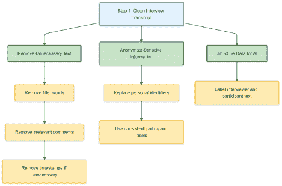

|   |  |   |
| --- | --- | --- |

# 第 2 步：设置 ChatGPT 以进行定性数据分析

#### 目标：

配置 ChatGPT 以在定性数据分析中有效使用，无论是使用默认的 GPT 模型还是构建适合你研究的自定义 GPT（图 10.2）。

处理过程：

1.  选择你的方法：

    +   默认 GPT 模型：对于大多数研究人员来说，通过 OpenAI 网络界面使用默认的 GPT-4 模型就足够了。这种方法需要最少的设置，非常适合一般定性分析任务。

    +   自定义 GPT：如果你的研究需要高度特定的编码或涉及需要更深入定制的复杂数据集，考虑在高级 ChatGPT 版本中构建自定义 GPT 模型。此选项允许你使用特定的数据集和提示来个性化模型，从而产生更符合需求的输出。

1.  配置模型：

    +   对于这两种方法，确保你为你的定性研究背景配置 ChatGPT，并提供相关背景信息、编码框架或先前编码的数据，以便针对你的特定需求进行微调。

1.  管理令牌限制：

    +   注意令牌限制（即 ChatGPT 在单个查询中可以处理的单词或字符数）。如果需要，将较大的访谈记录分成较小的部分以提高处理效率。

注意：虽然可以通过应用程序编程接口（API）集成构建高度特定的自定义 GPT，但本书专注于利用 ChatGPT 平台直接提供的默认和高级自定义 GPT 功能。因此，通过 API 构建和部署自定义 GPT 的过程超出了本书的范围，使我们能够专注于 ChatGPT 界面内易于访问、用户友好的应用。

图 10.2\. 设置 ChatGPT 以进行定性数据分析

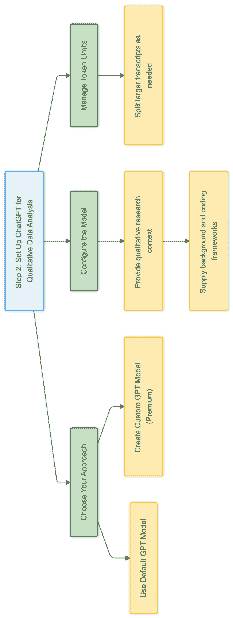

|   |  |   |
| --- | --- | --- |

# 第 3 步：定义主题并为演绎或归纳分析开发提示

#### 目标：

根据你选择的定性分析方法（演绎或归纳）（图 10.3）制定生成初始编码的策略。

#### 归纳主题分析：预定义主题和子主题

1.  识别预定义主题：

    +   回顾为你的研究提供信息的理论框架或文献，并确定与研究相关的关键主题和子主题。例如：

        +   主题：生产力，团队动态，情感福祉。

        +   子主题：生产力提高，协作挑战，虚拟工具带来的压力。

1.  开发基于主题编码的提示：

    +   创建指示 ChatGPT 在定义的主题内搜索特定代码的提示。例如：

        +   提示： “在这份记录中识别与生产力相关的任何陈述。关注提及的生产力提高或降低，并解释参与者如何描述这些变化。”

1.  精炼：

    +   在收到 ChatGPT 的初始代码后，根据响应质量对提示进行细化或修改，确保 AI 始终专注于您预定义的主题。

#### 归纳分析：从数据生成主题

1.  无预定义主题：

    +   在归纳方法中，让数据自己说话。而不是强加预定义的主题，ChatGPT 将探索原始数据以生成自然出现的代码和主题。

1.  开发开放式提示：

    +   使用允许对数据进行开放式探索的提示。例如：

        +   提示： “分析这份记录并识别任何重复出现的想法或模式。关注与团队协作和 VR 使用中的情感反应相关的概念。”

1.  重复过程：

    +   审查 ChatGPT 的初始输出，并调整你的提示以关注似乎最相关的出现想法。你可能需要运行多次迭代来探索数据中的不同角度。

图 10.3. 定义主题和开发分析提示

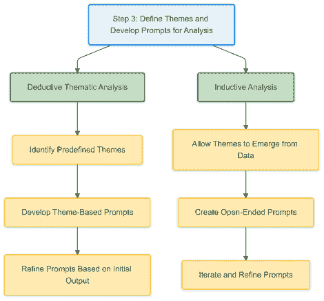

以下部分说明了 ChatGPT 如何根据预定义的主题区域和结构化的演绎主题分析，从访谈记录的每个部分识别相关代码。

ChatGPT 提示示例：

指令：

你被要求使用预定义的主题框架对访谈记录进行演绎主题分析。你的目标是识别与提供的主题和子主题相对应的记录中的相关代码。对于每个识别出的代码，提取支持它的记录中的确切引语。

请按照以下步骤操作：

1.  仔细阅读访谈记录：

    +   仔细阅读整个记录，以了解背景和内容。

1.  使用预定义的主题框架：

    +   在分析时，以提供的主题和子主题作为指南。

1.  识别相关代码：

    +   对于每个主题和子主题，识别在记录中明显的代码。

    +   代码应该是简洁的短语，捕捉与主题相关的关键想法或概念。

1.  提取确切引语：

    +   对于每个识别出的代码，找到并提取从记录中展示该代码的确切引语（引语）。

    +   确保引用准确，并包含任何相关背景。

1.  组织您的发现：

    +   以结构化格式展示您的结果，按主题和子主题组织。

    +   在每个子主题下，列出已识别的代码及其支持性引用。

1.  确保准确性和相关性：

    +   确保所有代码和引用直接与主题和子主题相关。

    +   避免引入预定义框架中未包含的新主题。

以下是为您提供的预定义主题框架供参考。

预定义主题框架：

1.  沟通与互动：

    +   重点关注：VR 如何影响团队内部和团队成员之间的沟通。

    +   子主题：

        +   沟通的清晰度

        +   协作便捷性

        +   非正式与正式互动

        +   VR 中的非言语线索

1.  团队凝聚力和关系：

    +   重点关注：VR 对团队动态和人际关系的效应。

    +   子主题：

        +   团队凝聚力

        +   社交联系

        +   建立信任

        +   远程团队整合

1.  生产力和工作流程：

    +   重点关注：VR 如何影响远程工作环境中个人和团队的生产力。

    +   子主题：

        +   任务效率

        +   重点关注

        +   工作流程管理

        +   VR 中的多任务处理

1.  情感和心理影响：

    +   重点关注：使用 VR 作为工作工具的心理和情感影响。

    +   子主题：

        +   压力

        +   数字疲劳

        +   认知负荷

        +   沉浸过载

        +   孤独感或存在感

1.  适应和学习曲线：

    +   重点关注：在职场中采用和适应 VR 技术的容易程度或难度。

    +   子主题：

        +   培训

        +   学习挑战

        +   技能获取

        +   公司支持

1.  对未来使用的感知：

    +   重点关注：员工对 VR 在远程工作中长期可行性和未来的看法。

    +   子主题：

        +   可扩展性

        +   长期适应

        +   创新潜力

        +   采用障碍

访谈记录：

[请在此行下方插入访谈记录。]

如何展示您发现示例：

主题 1：沟通与互动

+   子主题：沟通的清晰度

    +   代码：通过沉浸式会议提高理解

        +   引用：“自从我们开始使用 VR 以来，我感觉我更好地理解了同事们的想法，因为我们能一起可视化概念。”

+   子主题：VR 中的非言语线索

    +   代码：缺乏真实面部表情

        +   引用：“有时很难衡量反应，因为化身无法展示真实的面部表情。”

对每个主题和子主题重复此格式。

备注：

+   重点关注质量而非数量；有良好支持的代码比大量薄弱的代码更好。

+   确保提取的引用直接与代码相关，并提供对主题的明确证据。

|   |  |   |
| --- | --- | --- |

# 第 4 步：创建提示并运行编码过程

#### 目标：

通过为每个访谈记录运行定制的提示并保存输出以供进一步分析来执行编码过程（图 10.4）。

#### 流程：

1.  创建清晰和有针对性的提示：

    +   对于每一份记录，创建与你的研究目标一致的提示。例如，可能的提示包括：

        +   演绎示例：“对于这份记录，识别任何关于团队沟通的引用。关注参与者如何描述他们在使用 VR 时的互动和挑战。”

        +   归纳示例：“识别与参与者体验虚拟会议中的情绪福祉相关的任何新兴主题。总结提到的关键点。”

1.  为每一份记录运行提示：

    +   使用准备好的提示将每一份记录提交给 ChatGPT。确保每次运行后 AI 的输出以结构化格式（如 Word 文档或文本文件）保存。

    +   示例输出：

        +   代码：团队孤立，VR 会议中的专注力提升，学习新工具的压力。

        +   引用：“我发现我在 VR 中工作时有时会感到与团队脱节。”

1.  迭代和验证：

    +   对于每一份记录，你可能需要运行多个提示来探索数据的各个方面（例如，团队动态，情绪反应）。使用迭代提问来细化输出。例如，如果一个代码太宽泛，请要求 ChatGPT 将其分解成更具体的组成部分：

        +   提示：“你能提供更多关于参与者描述‘团队孤立’的不同方式的细节吗？具体有哪些因素导致了这种情况？”

1.  保存输出以供分析：

    +   运行每一份记录后，确保输出以一致格式保存。这些输出将随后上传到 QualCoder 进行进一步分析。

图 10.4. 创建提示并运行编码过程

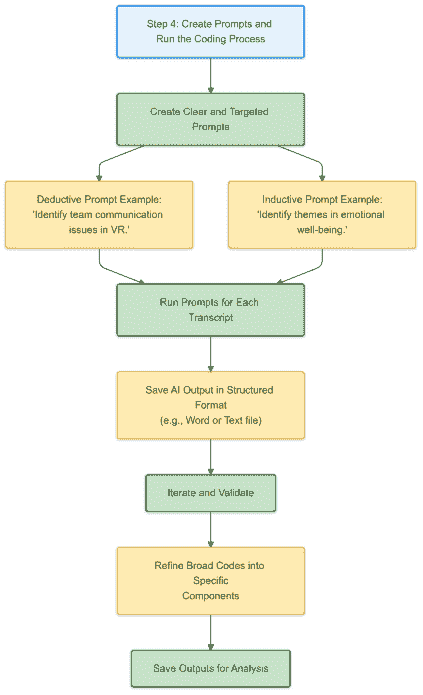

ChatGPT 的输出

主题 1：沟通与互动

| 子主题 | 代码 | 引用 |
| --- | --- | --- |
| 沟通清晰度 | VR 会议中的参与度提升 | “在 VR 中，感觉我们都在同一个房间里，这增加了你在传统视频通话中得不到的参与度。” |
|  | 通过视觉协作更好地理解 | “当我们需要视觉协作时，例如在虚拟白板上绘制想法或审查 3D 模型时，这尤其有用。” |
| VR 中的非语言线索 | 虚拟化身和存在感 | “虚拟化身给人一种存在感，即使它是虚拟的，也有助于身体语言和非语言线索。” |
|  | 缺失真实面部表情 | “虚拟化身很有趣，但它们不是真人，你知道？我还是怀念看到面部表情和真实身体语言。” |

主题 2：团队凝聚力和关系

| 子主题 | 代码 | 引用 |
| --- | --- | --- |
| 团队融合 | VR 增强社交活动和团队建设 | “我注意到，当我们使用 VR 进行社交活动或团队建设练习时，感觉比仅仅进行 Zoom 快乐小时或类似活动更互动。” |
| 社交联系 | 通过共享虚拟空间增加联系 | "虚拟环境让我们感觉我们都在同一个空间，即使我们都在不同的地点工作。" |
|  | 虚拟环境中的情感距离 | "有时，VR 感觉有点不真实，我认为这会产生一点情感距离。" |

主题 3：生产力和工作流程

| 子主题 | 代码 | 引用 |
| --- | --- | --- |
| 任务效率 | VR 支持创意和视觉任务 | "对于创意头脑风暴或协作设计等活动，VR 非常出色。它让我们能够可视化想法并共同工作。" |
| 工作流程管理 | VR 不适用于日常任务 | "对于日常会议？并不多。对于像状态更新或快速检查这样的常规事务来说，有点过度。" |
| VR 中的多任务处理 | VR 会议的设置时间较长 | "还有设置时间——你需要戴上头盔，确保一切正常工作，有时还要处理技术故障。" |

主题 4：情感和心理影响

| 子主题 | 代码 | 引用 |
| --- | --- | --- |
| 数字疲劳 | VR 引起的疲劳体验 | "我没有想到 VR 会这么累。它可能会很累，尤其是如果你长时间处于其中。" |
| 沉浸过载 | VR 中的过度感官输入 | "在 VR 中，感官输入非常多——视觉、声音以及整个沉浸式环境——一段时间后可能会感到压倒性。" |
| 孤独感或存在感 | 虚拟现实（VR）体验后的调整挑战 | "还有一件事就是，当你从这个沉浸式虚拟空间中摘下头盔，意识到你只是独自一人在房间里时，会有一种脱节感。" |

主题 5：适应和学习曲线

| 子主题 | 代码 | 引用 |
| --- | --- | --- |
| 学习挑战 | VR 工具的学习曲线陡峭 | "一开始的学习曲线相当陡峭。习惯控制、在虚拟环境中导航……需要一些时间。" |
| 公司支持 | 与培训支持的混合体验 | "我的公司确实提供了培训，但它主要是自学式的，这对我们中的一些人来说效果不错，但对其他人来说有点困难。" |

主题 6：对未来使用的感知

| 子主题 | 代码 | 引用 |
| --- | --- | --- |
| 可扩展性 | 对于常规任务的有限潜力 | "对于常规会议或快速对话，常规的视频通话仍然更容易、更高效。" |
| 创新潜力 | 随着技术的改进而日益普及 | "随着技术的改进，我认为我们会看到更多的人采用它……VR 可能会成为我们远程工作方式的一个更大组成部分。" |
|   |  |   |

# 第 5 步：将数据导入 QualCoder 并生成代码树

QualCoder 中的定性数据编码：手动与自动导入方法

在定性分析中，在 QualCoder 中导入和组织数据可以采用三种不同的方法：手动编码、半自动导入并辅以 ChatGPT 的帮助，以及通过 API 集成实现的全自动导入。每种方法都有其独特的优点和局限性，最佳方法取决于研究需求、可用时间、技术技能以及与数据的期望互动等因素（图 10.5）。

只有手动编码选项（选项 1）在本书的范围内，涵盖了在 QualCoder 中手动导入、编码和组织数据的完整过程。半自动导入和通过 API 集成实现的全自动导入（选项 2 和 3）超出了本书的范围，需要更高级的技术知识和工具，这些超出了本指南的焦点。

1. 手动导入和编码

#### 步骤：

+   第 1 步：上传转录文件

    +   在 QualCoder 中导航到文件 > 导入。

    +   选择并上传定性数据文件，如访谈或焦点小组的转录文件。

    +   根据参与者、访谈编号或相关元数据对导入的文件进行组织和标记。

+   第 2 步：基于 ChatGPT 洞察的手动编码

    +   首先，审查 ChatGPT 的输出，包括建议的代码、主题以及可能有用的引言或短语。

    +   在 QualCoder 中，根据这些建议创建新的代码，或根据需要修改它们以适应你的研究背景。

    +   打开每个转录本并手动审查文本。在继续的过程中突出相关部分并分配代码。

    +   通过手动应用代码，你控制着 ChatGPT 洞察的解释，并与数据紧密互动。

第 3 步：构建代码树

+   在编码过程中，你可以将相关的代码结构化为主题和子主题，形成一个层次化的代码树。

+   将相似代码分组，标记总体主题，并根据你对数据和 ChatGPT 建议的理解进行调整。

+   这个迭代过程确保你在从 ChatGPT 的自动建议中受益的同时，保持与数据的连接。

#### 手动编码的优点：

+   深度参与：允许你完全与数据互动，从而提高洞察的质量和有效性。

+   完全控制：研究人员保留对要编码的章节的控制权，确保解释由研究者主导。

+   灵活性：你可以修改 ChatGPT 的建议，根据编码过程中出现的新模式或洞察调整代码和主题。

#### 手动编码的缺点：

+   耗时：在较长的转录本上手动应用代码可能耗时，尤其是对于大型数据集来说。

+   不一致性风险：在手动编码中，编码风格或重点可能会因研究者在不同阶段的解释而有所不同。

+   劳动密集型代码结构化：将代码组织到主题中可能需要大量努力以保持一致性和层次结构。

2. 自动导入和编码（含 ChatGPT）

自动方法使用 ChatGPT 生成代码和主题，然后通过最小的人工干预导入 QualCoder。虽然目前尚未实现完全自动化，但这种方法提供了一种半自动化的方法来简化编码过程（表 10.1）。

#### 步骤：

+   第 1 步：在 ChatGPT 中进行开放式编码

    +   使用 ChatGPT 通过分析转录本并建议代码、主题和潜在类别来执行开放式编码。

    +   ChatGPT 可能提供直接引用、短语或与访谈数据相对应的主题见解。

+   第 2 步：将 ChatGPT 的输出导出为 REFI-QDA 或 CSV 格式

    +   将 ChatGPT 生成的代码、主题和引用建议保存为 CSV 或 REFI-QDA XML 格式。

    +   结构应包括相关细节，如代码、类别、引用和来源。

+   第 3 步：将代码和主题导入 QualCoder

    +   在 QualCoder 中导航到文件 > 导入 > REFI-QDA 项目或导入 > 从 CSV 导入代码。

    +   选择包含 ChatGPT 代码和主题的文件，并按照提示导入它们。

    +   QualCoder 将导入代码并将任何提供的引用与相关代码关联，从而实现编码过程的局部自动化。

+   第 4 步：审查和细化导入的代码

    +   在 QualCoder 中打开每个转录本，检查自动代码与数据匹配得如何。

    +   根据需要调整、删除或重新分配代码，以确保准确性与与您的研究问题的一致性。

    +   如果代码应用不一致，根据上下文手动应用或修改代码。

#### 自动导入的优点：

+   效率：减少手动创建和应用代码所需的时间，特别是对于大型数据集非常有用。

+   快速初始结构：提供可细化的初始代码结构，使研究人员在分析中取得先机。

+   可扩展性：通过提供可手动细化的基础代码集，便于对大型数据集进行分析。

#### 自动导入的缺点：

+   依赖 AI 解释：自动代码基于 ChatGPT 的解释，可能无法像研究者那样捕捉细微的含义。

+   数据丢失的可能性：未经仔细审查导入代码可能导致遗漏或误解的见解。

+   对上下文控制的限制：ChatGPT 可能无法根据上下文因素准确应用代码，需要 QualCoder 中进行额外的手动调整。

表 10.1. QualCoder 中手动导入与自动导入的比较

| 方面 | 手动导入和编码 | 自动导入和编码（使用 ChatGPT） |
| --- | --- | --- |
| 参与度 | 高 | 中等 |
| 时间需求 | 高 | 低 |
| 数据控制 | 高 | 中等（取决于 ChatGPT 编码的质量） |
| 编码准确性 | 研究者驱动；更准确的分析上下文 | AI 驱动；可能需要细化 |
| 可扩展性 | 适用于小型数据集 | 更适合大型数据集 |
| 数据一致性 | 易受研究者差异影响 | 一致但可能缺乏细微的解释 |

3. 通过 API 集成实现完全自动导入

第三种选择——通过 API 集成完全自动导入——可以考虑作为一个可行的解决方案，特别是对于大规模定性项目或需要简化工作流程的研究团队（见表 10.2）。以下是可能的框架：

集成 ChatGPT 和 QualCoder 的最先进方法使用 API 来自动化分析和数据传输。虽然 QualCoder 没有内置 API，但创建一个连接 OpenAI 的 ChatGPT API 和 QualCoder 的自定义中间件可以使完全自动编码成为可能。

#### 步骤：

+   API 设置：

    +   通过 OpenAI 的平台获取 API 访问权限，并设置一个环境，使 ChatGPT 可以直接接收和分析文本。

    +   开发或利用一个可以将 ChatGPT 中的数据转换为 QualCoder 可识别格式的中间件解决方案。

    +   这可能需要编程知识，因为 QualCoder 缺乏现成的 API。然而，一个自定义脚本可以作为 ChatGPT 的输出和 QualCoder 导入功能之间的桥梁。

+   自动编码和导入：

    +   在 API 就位的情况下，ChatGPT 分析文本并自动生成代码。这些代码，连同相关引言和主题，可以实时地结构化到 QualCoder 中。

    +   中间件将 ChatGPT 的输出直接传输到 QualCoder，在处理过程中应用代码和主题。

    +   这种设置可以通过将 ChatGPT 生成的代码直接映射到 QualCoder 中的特定文本段来实现完全自动化，无需任何手动干预。

+   高效的数据管理：

    +   这种完全自动化的工作流程非常适合大型数据集或快速项目。通过自动化整个周期——从 ChatGPT 的文本分析和编码到 QualCoder 中无缝代码应用——这种方法最小化了手动任务并提高了效率。

    +   由于所有编码都是实时进行的，研究人员可以更多地关注解释结果，而不是数据处理。

#### 通过 API 完全自动导入的优点：

+   最大效率：非常适合快速管理和编码大型数据集。

+   无缝工作流程：提供了一种简化的端到端解决方案，自动化定性数据分析，从初始编码到导入 QualCoder。

+   可扩展性：特别适用于需要快速或大量数据处理的项目。

#### 通过 API 完全自动导入的缺点：

+   技术设置：需要大量的编程知识来创建中间件或自定义脚本以进行集成，这可能超出了某些研究人员的范围。

+   依赖 AI 解释：自动编码基于 ChatGPT 的分析，可能缺乏语境细微差别。

+   可能的数据丢失：像所有自动化系统一样，这个设置可能会错过细微的见解或细微差别，需要一些手动审查。

表 10.2. 通过 API 完全自动导入与手动和半自动方法

| 方面 | 手动编码 | 半自动导入 | 通过 API 完全自动导入 |
| --- | --- | --- | --- |
| 参与度水平 | 高 | 中等 | 低 |
| 技术知识 | 最小 | 中等（基本数据导入/导出） | 高（需要编程技能） |
| 编码准确性 | 高（研究者控制） | 中等（审查导入的代码） | 可变（ChatGPT 驱动的编码） |
| 时间要求 | 高 | 中 | 低 |
| 最佳用例 | 小型数据集，详细分析 | 中型数据集，高效结构化 | 大型数据集，快速处理 |

* * *

在这种情况下，完全自动化的 API 方法可以为寻求将 AI 驱动的编码直接集成到 QualCoder 的研究者提供强大的解决方案。虽然它需要大量的初始设置，但它可以是一种变革性的方法，用于扩大定性研究项目。包括所有三种方法提供了如何满足不同研究需求的不同集成方法的全面视角，从深度手动参与到高效率的自动化。

图 10.5\. 将数据导入 QualCoder 并生成代码树

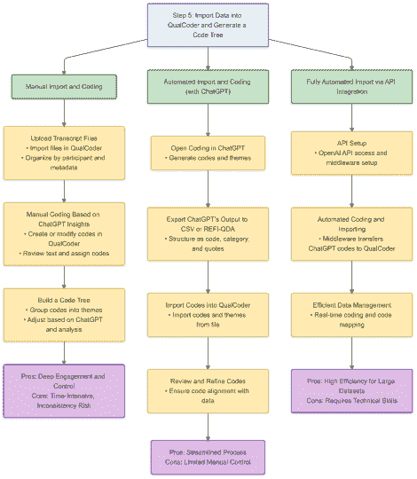

#### 选择正确的方法

+   手动方法是那些喜欢动手操作和与数据建立更深层联系的人的理想选择。它适合那些希望对代码的应用和改进承担全部责任的研究者。

+   半自动化方法平衡了自动化和手动监督。它减少了代码创建等重复性任务，但仍然允许研究者手动将代码应用于特定的文本片段，保持灵活性和解释深度。

+   完全自动化的方法推荐给熟悉编程和 API 集成的资深用户。它提供最大效率，对于速度和自动化至关重要的大规模项目来说，它是理想的。

|   |  |   |
| --- | --- | --- |

# 第 6 步：在 QualCoder 中分析代码

#### 目标：

完成编码过程并分析整个数据集中的主题（图 10.6）。

#### 流程：

1.  进行交叉分析：

    +   使用 QualCoder 进行交叉分析，以探索主题在不同参与者或转录本中的变化。例如，你可以比较不同团队成员在使用 VR 进行远程会议时对“隔离”的感受。

1.  生成报告和可视化：

    +   QualCoder 允许你生成总结数据集中代码频率和分布的报告。使用这些报告来探索主题之间的关系，并可视化分析结果。

1.  解释研究结果：

    +   在代码树和详细定性编码的帮助下，解释研究结果以回答你的研究问题。使用 ChatGPT 中识别的主题和引用，并在 QualCoder 中进行细化，从数据中得出有意义的结论。

图 10.6\. 在 QualCoder 中分析代码

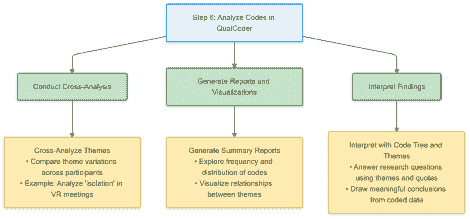

|   |  |   |
| --- | --- | --- |

# 第 7 步：开发主题和类别

在开放式编码过程之后，转向主题分析以识别数据中的更大模式和联系（图 10.7）。

1.  将代码分组到主题中：

    +   使用 QualCoder 将相关代码分组到更广泛的主题中。例如，与“沟通挑战”和“技术适应”相关的代码可能形成一个主题，如“远程工作效率障碍”。

1.  使用 ChatGPT 进行主题建议：

    +   提示 ChatGPT 帮助将代码分组到潜在的主题中：

        示例提示：

        “这里是我从我的数据中生成的代码。你能建议一些总体的主题或类别吗？”

    +   此步骤允许您利用 AI 进行更深入的图案识别。

1.  在 QualCoder 中最终确定主题：

    +   通过审查 AI 建议和手动创建的主题来在 QualCoder 中最终确定主题。

    +   根据需要细化，根据您的喜好合并或调整主题。

图 10.7. 开发主题和类别

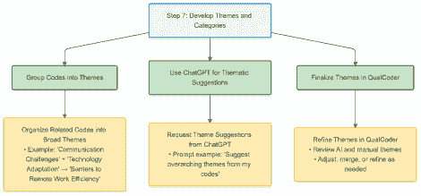

|   |  |   |
| --- | --- | --- |

# 第 8 步：在 ChatGPT 中进行主题分析

目标：

通过识别编码数据中的模式、关系和总体主题，利用 ChatGPT 进行更深入的主题分析（图 10.8）。

流程：

1.  准备用于分析的数据摘要：

通过从 QualCoder 中收集所有代码及其相关摘录来编译代码和摘录。将它们组织成结构化的格式，例如表格或文档，将相似的代码分组在一起。

创建一个包含以下内容的总结文档：

代码名称：您为不同代码分配的标签。

典型引言：体现每个代码的关键摘录。

初始观察：在编码过程中所做的任何笔记或洞察。

1.  开发用于主题探索的高级提示：

通过创建提示来识别关系，提示 ChatGPT 探索代码、潜在子主题和总体主题之间的关系。例如，“根据以下代码和摘录，确定任何总体主题并解释这些代码如何相互关联。考虑任何出现的模式或矛盾。”

通过提供关于你的研究目标、理论框架或任何你想要关注的特定方面的背景信息，让 ChatGPT 融入上下文信息。例如，“考虑到虚拟现实对团队协作的影响，分析与‘沟通挑战’和‘技术适应’相关的代码如何相互作用，形成更广泛的主题。”

1.  在 ChatGPT 中运行主题分析提示：

通过粘贴总结的代码、摘录和你的精心制作的提示到 ChatGPT 中输入总结数据。确保输入清晰且组织良好，以帮助 AI 有效地处理信息。

审查 AI 生成的主题。ChatGPT 将生成潜在的主题，突出代码之间的关系，并可能识别出并非立即显而易见的细微差别。例如，“代码‘团队隔离’和‘缺乏非言语线索’暗示了一个更广泛的主题‘远程沟通的挑战’。此外，‘增加关注’和‘灵活性’指向‘VR 在生产力方面的好处’。”

1.  与 ChatGPT 迭代地细化主题：

提出后续问题。如果初始输出过于宽泛或缺乏深度，请要求 ChatGPT 进行详细阐述或专注于特定方面。例如，"你能深入探讨‘团队隔离’如何影响‘情绪健康’，并建议由此关系产生的任何子主题吗？"

通过鼓励 ChatGPT 识别数据中的任何矛盾或紧张关系来探索矛盾和紧张。例如，“识别与‘生产力’和‘压力水平’相关的参与者回答中的任何冲突主题或悖论。”

1.  记录 AI 建议的主题：

保存输出。通过记录 ChatGPT 为每个提示生成的主题和见解，以与现有代码结构相一致的方式组织它们，以便于比较。

记录 AI 的贡献：通过明确标记由 ChatGPT 提出的主题和见解，以保持分析过程的透明度。

1.  将 AI 见解与人工分析相结合：

通过将 AI 生成的主题与你在 QualCoder 中手动开发的主题进行比较，来比较与手动主题。识别重叠、差异以及 ChatGPT 引入的新视角。

通过结合 AI 和人工分析中最相关和最有洞察力的主题来综合主题。细化主题结构，以反映对数据的全面理解。

图 10.8\. ChatGPT 中的主题分析

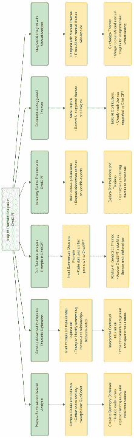

|   |  |   |
| --- | --- | --- |

# 第 9 步：验证和交叉检查

确保你的编码和主题发展既严格又透明（图 10.9）。

1.  将 AI 建议的代码与人工编码进行比较：

    +   将 ChatGPT 的编码建议与你自己的进行比较，以确保准确性并减轻 AI 可能带来的潜在偏差。

1.  三角测量法：

    +   如果适用，通过比较 AI 生成的发现与传统手动方法或额外数据源来验证你的结果，进行三角测量法。

图 10.9\. 验证和交叉检查

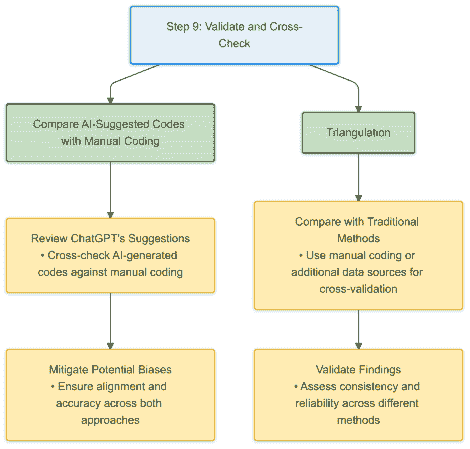

|   |  |   |
| --- | --- | --- |

# 步骤 10：在 QualCoder 中可视化和分析

使用 QualCoder 内置的工具对编码数据进行进一步分析和可视化（图 10.10）。

1.  生成代码树：

    +   使用 QualCoder 的代码树功能来可视化你的代码和主题的结构。这对于查看不同主题和子主题之间的关系很有用。

1.  备忘录编写：

    +   在 QualCoder 中创建备忘录以记录你对编码过程的思考、解释和反思。这有助于保持透明度和严谨性。

1.  导出发现：

    +   一旦编码完成，你可以导出编码数据、主题和备忘录，以进行进一步分析或包含在你的研究报告内。

图 10.10\. 在 QualCoder 中可视化和分析

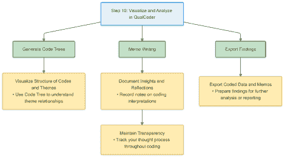

报告和展示发现

展示你的发现，确保清楚地记录 ChatGPT 和 QualCoder 的作用。

在展示你的发现时，彻底解释如何将 ChatGPT 和 QualCoder 整合到你的研究过程中至关重要。首先详细说明它们在你方法论中的作用，特别是 ChatGPT 如何协助编码和主题分析。这种透明度通过允许他人了解 AI 参与的深度及其如何影响你的结果，增强了你研究的研究力。

将你的发现围绕在 QualCoder 中开发的主题组织起来。使用代码树或主题图等视觉辅助工具有效地说明这些主题及其相互关系。这些可视化可以帮助读者理解你数据中的复杂关系，并为你的展示增添深度。

在使用 ChatGPT 时，承认遇到的任何局限性也很重要。讨论挑战，例如 AI 在没有人类解释的情况下可能难以完全捕捉细微的语境意义。通过公开地处理这些局限性，你提供了关于你方法的一个平衡视角，并强调了在 AI 辅助研究中的人类监督的重要性。

使用 AI 和 QualCoder 实现稳健且透明的定性分析

通过遵循这个结构化、分步进行的方法，您可以利用 ChatGPT 简化开放式编码的初始阶段，同时确保分析基于严格的定性研究原则。平衡人工智能生成的洞察力与研究人员直觉，并将结果整合到 QualCoder 中，允许一个透明且可重复的过程。这种方法赋予研究人员进行高效、深入定性数据分析的能力，这种分析在方法论上是可靠的，并且由人工智能驱动的功能得到增强。

整个 10 步流程总结在表 10.3 中。

表 10.3\. ChatGPT 和 QualCoder 中定性数据分析 10 步流程总结

| 步骤 | 目标 | 关键行动 |
| --- | --- | --- |
| 1\. 清洗访谈转录文本 | 通过清洗、匿名化和格式化转录文本以备分析来准备数据。 | - 删除不必要的文本：消除填充词、无关短语和不必要的提示。- 匿名化敏感信息：用通用标签（例如，“参与者 1”）替换个人标识符。- 为人工智能结构化数据：明确区分访谈者和参与者的回答。 |
| 2\. 为定性数据分析设置 ChatGPT | 使用默认或自定义 GPT 模型有效地配置 ChatGPT。 | - 选择您的方案：选择默认的 GPT-4 用于一般任务或为特定需求构建自定义模型。- 配置模型：提供具体指令；如有自定义，使用相关数据进行微调。- 调整设置：将温度设置为 0.2–0.4 以获得专注的响应；注意令牌限制。 |
| 3\. 定义主题并开发提示 | 使用演绎或归纳分析制定生成初始代码的策略。 | - 演绎分析：- 从文献或框架中识别预定义的主题。- 创建针对这些主题的提示。- 根据人工智能的响应精炼提示。- 归纳分析：- 使用开放式提示让主题自然出现。- 迭代提示以探索新出现的想法。 |
| 4\. 创建提示并运行编码过程 | 通过运行定制提示并保存输出执行编码。 | - 创建清晰的提示：使提示与研究目标一致。- 为每个转录文本运行提示：将转录文本提交给 ChatGPT；保存输出。- 迭代和验证：通过后续问题精炼输出。- 保存输出以供分析：整理结果以供后续使用。 |
| 5\. 将数据导入 QualCoder 并生成代码树 | 将 ChatGPT 结果转移到 QualCoder 进行进一步分析。 | - 上传转录文本：将清洗后的转录文本导入 QualCoder。- 生成代码树：按层次组织 ChatGPT 代码。- 转移代码：手动输入代码和相关引文。- 审查和调整：精炼代码以准确反映内容。- 一致应用代码：在整个转录文本中使用代码树。 |
| 6. 在 QualCoder 中分析代码 | 完成编码并分析数据集中的主题。 | - 进行交叉分析：探索参与者之间主题的变化。- 生成报告和可视化：总结代码频率和关系。- 解释发现：使用代码和主题来回答研究问题。 |
| 7. 开发主题和类别 | 识别数据中的更大模式和联系。 | - 将代码分组到主题中：将相关代码组合到更广泛的类别中。- 使用 ChatGPT 提出建议：提示 AI 提出总体主题。- 最终确定主题：在 QualCoder 中完善和调整主题。 |
| 8. 在 ChatGPT 中进行主题分析 | 使用 ChatGPT 进行更深入的主题分析。 | - 准备总结数据：汇编代码和关键摘录。- 开发高级提示：制作提示以探索关系和模式。- 运行分析：将数据和提示输入 ChatGPT；审查 AI 生成的主题。- 完善主题：迭代提出后续问题以加深理解。- 记录 AI 贡献：保存和组织 AI 建议的主题。 |
| 9. 验证和交叉检查 | 确保编码和主题的严谨性和透明度。 | - 比较 AI 和手动编码：检查一致性和准确性。- 三角验证发现：使用传统方法或附加数据源验证结果。 |
| 在 QualCoder 中可视化和分析 | 利用 QualCoder 的工具进行进一步分析和可视化。 | - 生成代码树：可视化代码和主题结构。- 编写备忘录：记录洞察和反思。- 导出发现：为报告或附加分析准备数据。 |

| 第十章要点：

+   删除填充词，匿名化个人信息，并格式化转录本以区分说话者。

+   在默认的 GPT-4 或自定义模型之间进行选择，提供具体指令，并调整设置以获得专注的回应。

+   使用预定义的主题进行演绎分析或让主题自然出现，相应地创建和改进提示。

+   开发与研究目标一致的清晰提示，为每个转录本运行它们，完善输出，并将结果保存以供分析。

+   将清洗后的转录本上传到 QualCoder，按层级组织代码，手动输入代码和引语，并确保应用的一致性。

+   进行交叉分析，生成报告和可视化，并解释发现以解决研究问题。

+   将相关代码分组到更广泛的主题中，使用 ChatGPT 提出建议，并在 QualCoder 中完善主题。

+   总结代码和摘录，创建高级提示以探索模式，运行分析，完善主题，并记录 AI 生成的洞察。

+   比较 AI 生成的代码与手动编码的一致性，并与其他方法或数据源进行三角验证以验证发现。

+   使用 QualCoder 的工具创建代码树和可视化，用备忘录记录洞察，并将发现导出以供报告。

|

|   |  |   |
| --- | --- | --- |

# 第三部分：使用人工智能增强可信度和报告

第十一章。

|   |  |   |
| --- | --- | --- |

# 增强可信度和可靠性

随着像 ChatGPT 这样的 AI 工具被整合到定性研究中，关于可信度、偏见和可靠性的担忧自然产生。确保人工智能辅助分析的严谨性对于产生可信且有意义的发现至关重要。本章重点介绍通过将人工智能结果与传统定性方法相结合、减轻 AI 偏见以及使用同伴简报和成员检查等技术来验证发现，以增强研究可信度的策略。这些方法可以帮助您无缝地将人类判断与人工智能生成的见解相结合，确保研究既具有创新性又具有方法论上的严谨性。

|   |  |   |
| --- | --- | --- |

# 将人工智能发现与传统方法三角测量

三角测量是定性研究中一个经过验证的策略，通过使用多个数据来源、方法或理论来交叉验证发现，从而增强可信度。在分析过程中整合人工智能时，三角测量变得更加关键，让您能够平衡人工智能的效率与传统定性技术的深度。

##### 1. 用手动编码补充人工智能生成的代码

确保人工智能辅助研究可靠性的最有效方法之一是将人工智能生成的代码与手动编码进行比较。虽然 ChatGPT 可以快速处理大量数据集并根据文本中的模式提出代码建议，但手动审查这些代码是至关重要的。研究人员应手动编码数据的一个子集，然后比较结果与人工智能生成的代码。

例如，如果 ChatGPT 建议“工作压力”是一个主要主题，手动编码可能会揭示人工智能未注意到的细微但重要的方面，如“工作负荷压力”或“人际冲突”。这种比较确保人工智能不会忽略微妙但重要的主题，保持定性数据的丰富性。此外，它防止过度依赖人工智能，并保留研究者的解释角色。

##### 2. 将人工智能主题与理论框架交叉验证

AI 可以有效地识别重复出现的模式，但研究人员仍然必须验证这些主题是否与理论框架和更广泛的研究背景相符。假设 ChatGPT 提出了诸如“团队合作”或“领导力挑战”的主题，那么你应该将这些主题与指导你研究的理论框架进行对照，确保它们与现有知识或概念一致。

通过将 AI 生成的代码与诸如社会资本理论或组织文化框架等理论模型叠加，研究人员可以深化他们的理解并确保分析反映了有意义的洞察。这在跨学科研究中尤其有价值，因为它提供了一种结构化的方法来将机器生成的模式与学术严谨性对齐。

##### 3. 在多个数据源中验证 AI 发现

在某些情况下，研究人员可以将人工智能应用于各种数据集（例如，访谈、焦点小组和实地笔记）并在这些来源之间三角测量研究结果。如果 ChatGPT 在不同类型的数据中识别出相同的主题——例如“沟通中断”——这会增强发现的可信度。然而，数据源之间的差异或不一致性应进一步探索，无论是通过重新审视原始数据还是通过细化 AI 提示以捕捉更多特定于上下文的洞察。

通过比较不同数据集的结果，你确保 AI 的输出不是孤立的产物，而是跨不同视角和背景的稳健主题。

|   |  |   |
| --- | --- | --- |

# 缓解 AI 偏差的策略

AI 模型，包括 ChatGPT，都是在互联网上的大量数据上训练的，这意味着它们可能反映了固有的偏差。这些偏差可能会通过歪曲数据的解释来影响定性研究的质量，尤其是在处理敏感或文化特定信息时。为了保持可信度，采用缓解 AI 偏差的策略至关重要。

##### 1. 批判性监督和反思性

虽然 CHATGPT 可以根据大量文本生成主题和代码，但它缺乏人类研究人员带来的对上下文、文化和情感的细微理解。因此，AI 可能会加强数据中存在的偏差，或基于偏颇的假设生成输出。研究人员必须批判性地评估 AI 的输出，识别任何潜在的偏差，并反思性地质疑 AI 的“客观性”。

例如，如果 AI 在男性参与者的访谈中不成比例地突出与“领导力”相关的主题，但忽略了女性参与者中的类似主题，这可能表明存在性别偏见。认识到这样的模式允许研究人员介入并调整 AI 的输出。

##### 2. 精炼提示以获得平衡输出

提示工程是控制 AI 输出和减少偏见的有力工具。如果初始提示产生偏斜或偏见的结果，迭代优化可以帮助。例如，一个提示如“识别与该数据集中领导力相关的主题”可以被修订为“识别不同性别、年龄和文化群体中关于领导力和团队合作的多元视角。”这鼓励 AI 考虑更广泛的响应集，并产生更平衡的输出。

研究人员应不断优化他们的提示，以鼓励 AI 对数据的解释多样性，确保在分析中考虑了代表性不足的声音。

##### 3. 结合多个 AI 模型

不同的 AI 模型根据其训练数据和设计具有不同的优势和劣势。使用多个模型（例如，ChatGPT 与 Bard 或 Cohere 一起）分析同一数据集可以帮助识别和减轻偏见。如果一个模型强调某些主题，而另一个模型突出不同的方面，比较它们的结果可以提供更全面和更少偏见的解释。

这种多模型方法在分析敏感或跨文化数据时特别有用，在这些情况下，偏见可能会对结果产生重大影响。

|   |  |   |
| --- | --- | --- |

# 在 AI 辅助下的同伴反馈和成员检查

同伴反馈和成员检查是定性研究中确保发现可信度的一种成熟技术。当与 AI 生成的见解结合使用时，这些技术可以帮助验证机器生成数据和研究人员解释的准确性。

##### 1. 同伴反馈：使用人类专业知识交叉验证 AI 发现

同伴反馈涉及与研究人员或同事讨论 AI 辅助发现，以确保分析的有效性。例如，在 ChatGPT 帮助识别关键主题后，你可以将这些主题展示给同伴进行批判性评估。同事可以提供见解，判断这些主题是否与数据相符，或者是否有 AI 可能遗漏的替代解释。

此过程有助于揭示 AI 生成结果中的任何盲点或偏见，因为同伴可能提供与 AI 输出不同的观点。在实践中，这可能涉及将 ChatGPT 生成的主题摘要与你的手动编码一起分享，以便进行比较，从而促进对两种方法的积极反馈。

##### 2. 成员检查：与 AI 生成的主题参与参与者互动

成员检查是验证发现的过程，通过与研究参与者分享这些发现。AI 可以通过提供从大型数据集中得出的主题的简洁、易于消化的摘要来增强这一过程，使参与者更容易审查和确认发现的真实性。

例如，ChatGPT 可以生成访谈主题的摘要，然后你可以与参与者分享。如果参与者阅读 AI 摘要并觉得它准确地反映了他们的经历，这会增强你发现的可信度。另一方面，如果参与者指出不准确或遗漏的方面，你可以相应地修改分析。

这种方法不仅与参与者建立了信任，还确保了他们的声音在最终结果中得到真实反映。

##### 3. AI 辅助成员检查中的道德透明度

当使用 AI 辅助进行成员检查时，向参与者透明地说明 AI 的使用方式至关重要。参与者应被告知涉及了 AI 工具，用于总结或识别主题，并且他们应该有机会询问关于该过程的问题。通过清楚地解释 AI 在分析中的作用，你将透明度和问责制融入你的研究，确保参与者对他们的数据如何被处理感到舒适。

将 AI 整合到定性研究中为加快分析提供了令人兴奋的机会，但也引入了与可信度和可靠性相关的新挑战。通过将 AI 生成的见解与传统定性方法相结合、批判性地处理偏见、使用同伴简报和成员检查，你可以确保 AI 增强而不是削弱你研究的严谨性。

关键的收获是，AI 应被视为一种补充而非取代人类判断的工具。研究人员仍然是数据的最终解释者，负责在 AI 的速度和效率与定性研究的深度和复杂性之间取得平衡。当负责任地使用时，AI 可以作为增强定性研究可靠性和可信度的强大伙伴，帮助研究人员在保持人类洞察力丰富性的同时，导航复杂的数据库。

| 章节要点：

+   将 ChatGPT 整合到定性研究中需要确保可信度、缓解偏见并保持可靠性，以获得可靠的发现。

+   将 AI 生成的代码与手动编码相结合，通过结合 AI 的效率和人类的解释深度来增强可靠性。

+   将 AI 主题与理论框架进行交叉检查，确保 AI 输出与既定研究概念和背景相一致。

+   在多个数据源上验证 AI 发现，通过确认主题在不同数据集中的一致性来增强可信度。

+   缓解 AI 偏见需要关键的监督、细化提示以实现平衡的输出，并使用多个 AI 模型以获得不同的观点。

+   同行简报涉及与同事讨论 AI 辅助发现，以验证和增强分析准确性。

+   成员验证通过分享由 AI 生成的主题以供验证，确保研究结果准确反映他们的经验。

+   伦理透明度要求向参与者告知 AI 在数据分析中的作用，保持对研究过程的问责制和信任。

|

第十二章。

|   |  |   |
| --- | --- | --- |

# 报告和展示研究结果

一旦 AI 在定性研究分析的阶段提供协助，接下来的挑战是以既吸引人又忠实于数据的方式报告和展示研究结果。将 AI 洞察融入报告需要深思熟虑如何将 AI 生成的主题与你的解读相结合，确保透明度，并有效地向广泛的受众传达复杂主题。在本章中，我们将探讨如何利用 AI 制作引人入胜的报告，处理在研究中归因于 AI 角色的伦理考量，并分享向不同利益相关者展示复杂发现的战略。

|   |  |   |
| --- | --- | --- |

# 利用 AI 洞察制作引人入胜的报告

类似于 ChatGPT 的 AI 工具可以处理和分析大量数据，但研究人员仍然是报告过程中最重要的部分。制作引人入胜的报告涉及将 AI 生成的洞察与你的解读相结合，以创建既具有洞察力又基于数据的叙述。

##### 1. 将 AI 洞察组织成连贯的叙述

AI 模型擅长识别模式、生成主题和总结大量数据集。然而，将这些输出转化为连贯且引人入胜的故事需要人类的输入。首先，将 AI 生成的主题组织成与你的研究目标一致的逻辑结构。常见的策略包括使用主题结构，其中报告的每一部分都专注于特定的主题，或者使用基于案例的结构，其中你展示个别案例，然后进行主题分析。

例如，如果 ChatGPT 将“远程工作挑战”、“员工自主性”和“工作与生活平衡”识别为关键主题，这些可以作为报告中的章节。在每个章节中，将 AI 洞察与具体的参与者引言、手动编码结果和你的理论框架交织在一起，以创建丰富、有解释性的叙述。

##### 2. 通过参与者叙述增强深度

虽然 AI 可以有效地识别总体模式，但一个引人入胜的报告需要将这些洞察建立在原始数据的基础上——即参与者的引述、故事和背景细节。将 AI 生成的主题作为报告的骨干，但依靠直接引述和案例示例来增加深度和细微差别。这不仅增强了报告的丰富性，而且确保了参与者的声音始终处于前沿。

例如，如果 AI 建议围绕“工作场所压力”的主题，请包括参与者描述他们个人压力体验的具体、详细的引述。这使数据人性化，并允许读者更深入地参与发现。

##### 3. 可视化数据以增强清晰度

将数据可视化——如主题图、词云或网络图——可以使复杂的研究发现更容易为读者所理解。许多与 AI 集成的定性软件工具，如 NVivo 或 QualCoder，提供创建主题、模式和代码之间关系视觉表示的功能。当这些视觉元素与叙述描述一起使用时，它们提供了双重洞察：数据背后的故事及其结构的视觉总结。

例如，一个展示“员工自主性”与“工作满意度”之间关系的主题图可以直观地突出分析过程中出现的联系，使你的发现对读者来说更加清晰和引人入胜。

|   |  |   |
| --- | --- | --- |

# 归属 AI 贡献的道德考量

随着 AI 在定性研究工作流程中越来越深入，关于其在研究过程中角色的透明度至关重要。道德地归属 AI 的贡献确保读者了解 AI 是如何被使用的，并且研究保持方法论上的严谨性。

##### 1. 记录 AI 在研究过程中的作用

报告 AI 辅助研究时，透明度至关重要。你应该清楚地记录 AI 工具在每个阶段的使用情况——无论是用于编码、识别主题还是总结数据。这在报告的方法论部分尤为重要，其中你详细说明了遵循的过程。包括如何将 ChatGPT 或其他 AI 模型整合到你的分析中，以及你采用的任何传统方法。

例如，如果使用 ChatGPT 生成初始代码，请解释研究人员是如何对这些代码进行审查和改进的。这为读者提供了一个清晰的图景，展示了 AI 和人类输入之间的劳动分工，确保读者理解最终分析是一个 AI 和研究人员之间的协作过程。

##### 2. 平衡 AI 和人类归属

虽然 AI 可以显著帮助研究过程，但结果的解释应始终是人类的责任。研究人员必须避免过分强调 AI 在产生洞察力中的作用。重要的是传达 AI 协助组织和分析数据，但最终的解释——特别是主题和模式的情境化——是由研究人员进行的。AI 缺乏人类研究人员在分析中带来的文化、情感和理论理解。

在致谢或方法论局限性部分，明确说明 AI 对研究做出的贡献。例如，“ChatGPT 协助识别重复主题和总结数据，但最终编码和主题发展是由研究人员完成的。”

##### 3. 解决潜在偏见和局限性

在分析过程中承认 AI 工具的局限性，特别是在偏见和情境理解方面非常重要。AI，尤其是像 ChatGPT 这样的模型，是在可能包含固有偏见的庞大数据集上训练的，这些偏见可能会微妙地影响主题的识别或解释。

在你的报告中包含一个关于局限性的部分，解决 AI 引入的潜在偏见以及你如何减轻它们。例如，你可以描述如何将 AI 的输出与手动编码交叉检查，或者你如何使用同行反馈来确保 AI 生成的发现与人类解释一致。

|   |  |   |
| --- | --- | --- |

# 向不同受众传达复杂主题

在呈现定性研究结果时，一个主要挑战是将复杂、通常抽象的主题转化为与不同受众产生共鸣的形式。无论你是与学术同行、政策制定者还是实践者分享你的研究结果，有效的沟通都是必不可少的。

##### 1. 针对受众调整演示文稿

在呈现 AI 辅助定性研究结果时，理解你的受众至关重要。不同的受众可能对 AI 或定性研究方法熟悉程度不同，因此你的演示的深度和风格应相应调整。

+   对于学术受众，强调方法论严谨性，包括详细解释如何将 AI 与传统方法整合和三角测量。关注理论贡献以及 AI 如何增强了你的分析深度。

+   对于政策制定者或实践者，关注实际影响。你确定的主题如何影响现实世界的决策？以清晰、简洁的方式呈现研究结果，使用视觉辅助工具使复杂主题更易于理解。

+   对于普通公众来说，通过关注易于理解的叙事和具体例子来简化演示。使用通俗易懂的语言并尽量减少技术术语。视觉工具，如信息图表或案例研究，可以帮助使发现结果更具吸引力。

##### 2. 分解复杂主题

AI 可以帮助揭示复杂且多层次的主题，这些主题可能难以用直接的方式传达。为了使这些主题更容易理解，可以将它们分解为子主题或关键点。例如，如果你的研究将“远程工作挑战”作为一个广泛的主题，可以将其分解为具体的子主题，如“沟通障碍”、“技术困难”和“工作与生活平衡问题”。

通过将复杂主题组织成更小、更清晰的组成部分，你使发现结果更容易被你的受众理解，并更具可操作性。

##### 3. 利用故事讲述来增强参与度

在定性研究中，故事讲述是一种强大的工具，尤其是在传达复杂主题时。AI 可以帮助识别总体模式，但通过生动的叙述将这些模式呈现出来的任务仍然落在研究人员身上。将参与者的故事和直接引语编织进你的演示中，以创造一个引人入胜的叙事，使数据人性化。

例如，如果你的 AI 辅助分析识别出“远程工作的满意度”这一主题，可以加入参与者描述个人经历的引言来丰富这一主题。这不仅增强了发现结果的情感冲击力，而且使主题更容易与更广泛的受众产生共鸣。

##### 4. 利用多媒体工具

在当今的数字世界中，多媒体工具可以极大地增强定性发现结果的呈现。将视频剪辑、音频录音或交互式视觉元素整合到你的演示中，使数据更加生动和引人入胜。例如，参与者的访谈视频剪辑可以通过书面报告无法实现的方式使你的主题栩栩如生。

此外，使用允许利益相关者自行探索数据的交互式仪表板可以提供更深层次、更个性化的对发现结果的参与。

报告 AI 辅助定性研究的过程需要仔细考虑如何平衡 AI 洞察与人类解释，确保透明度，并有效地向不同受众传达发现结果。虽然像 ChatGPT 这样的 AI 工具可以在总结和结构化数据方面提供有价值的帮助，但研究人员在解释和呈现结果的角色仍然是核心的。

通过明确记录 AI 在研究过程中的作用，解决伦理问题，并使用故事讲述、视觉和定制演示，研究人员可以确保他们的发现既引人入胜又可信。无论是向学术同行、政策制定者还是公众传达，成功报告的关键在于在保持定性研究所要求的丰富性和严谨性的同时，使复杂主题易于理解。

| 章节要点：

+   将人工智能生成的见解与您的解释相结合，以创建引人入胜、数据驱动的叙事。

+   合理组织 AI 识别的主题，以与您的研究目标保持一致。

+   结合参与者的引言和故事，以增加深度并保持数据丰富性。

+   使用主题图和词云等可视化工具来阐明并吸引观众。

+   透明地记录 AI 工具在编码和主题生成中的辅助作用。

+   平衡人工智能的贡献与人类解释，以确保主题具有情境信息。

+   通过批判性地评估输出和使用多个 AI 模型来减轻 AI 偏差。

+   通过同行反馈和成员检查验证发现，以确保准确性和可信度。

+   根据不同的受众调整深度和视觉辅助工具，以定制您的演示。

+   通过使用故事讲述和多媒体工具清晰地呈现复杂主题来增强参与度。

|

|   |  |   |
| --- | --- | --- |

# 有一点要说

如果您觉得这本书有用，并且喜欢阅读它，如果您能抽出时间写一篇评论，我将不胜感激。

您的支持真正地影响了其他人，他们可能从这本指南中受益。我亲自阅读所有评论，因为它们使我能够收集您宝贵的建议和见解，这有助于我为未来的读者改进这本书。

深表感谢您的支持！

这对我来说意义重大，并鼓励我继续我的工作，使研究对每个人来说都更加易于接近和理解。您的反馈不仅激励了我，还培养了一个学习者社区，他们可以分享发现和知识的旅程。

|   |  |   |
| --- | --- | --- |

# 参考文献

1. Jalali MS, Akhavan A. Integrating AI language models in qualitative research: Replicating interview data analysis with ChatGPT. Syst Dyn Rev. 2024 Jul 21;40(3).

2. Şen M, Şen ŞN, Şahin TG. A New Era for Data Analysis in Qualitative Research: ChatGPT! Shanlax International Journal of Education. 2023 Oct 1;11(S1-Oct):1–15.

3. Bijker R, Merkouris SS, Dowling NA, Rodda SN. ChatGPT for Automated Qualitative Research: Content Analysis. J Med Internet Res. 2024 Jul 25;26:e59050.

4. Dengel A, Gehrlein R, Fernes D, Görlich S, Maurer J, Pham HH, et al. Qualitative Research Methods for Large Language Models: Conducting Semi-Structured Interviews with ChatGPT and BARD on Computer Science Education. Informatics. 2023 Oct 12;10(4):78.

5. Brower RL, Jones TB, Osborne-Lampkin L, Hu S, Park-Gaghan TJ. Big Qual: Defining and Debating Qualitative Inquiry for Large Data Sets. Int J Qual Methods. 2019 Jan 1;18.

6. Briganti G. ChatGPT 是如何工作的：一篇小型综述。欧洲耳鼻喉科档案。2024 年 3 月 22 日；281(3)：1565–9。

7. Creswell JW. 研究设计：定性、定量和混合方法（第 4 版）。加利福尼亚州千橡市：Sage 出版社；2014 年。

8. Reeves S, Kuper A, Hodges BD. 定性研究方法：民族志。英国医学杂志。2008 年 8 月 7 日；337(aug07 3)：a1020–a1020。

9. Khan SN. 定性研究方法：扎根理论。国际商业与管理杂志。2014 年 10 月 23 日；9(11)。

10. Petticrew M, Rehfuess E, Noyes J, Higgins JPT, Mayhew A, Pantoja T, 等等。综合复杂干预措施的证据：元分析、定性研究和混合方法如何做出贡献。临床流行病学杂志[互联网]。2013 年；66(11)：1230–43。可在以下网址获取：http://dx.doi.org/10.1016/j.jclinepi.2013.06.005

11. Weyant E. 研究设计：定性、定量和混合方法（第 5 版）。医学图书馆电子资源杂志。2022 年 4 月 3 日；19(1–2)：54–5。

12. Westbrook L. 定性研究方法：主要阶段、数据分析技术和质量控制综述。信息科学研究。1994 年；

13. Sutton J, Austin Z. 定性研究：数据收集、分析和管理。加拿大医院药学杂志。2015 年 6 月 25 日；68(3)。

14. Novak M, Drummond K, Kumar A. 医疗保健专业人员短期医疗任务中教育的经历：归纳主题分析。公共健康生物医学中心。2022 年 12 月 17 日；22(1)：997。

15. Brownstone LM, Mihas P, Butler R, Maman S, Peterson CB, Bulik CM, 等等。主观暴饮暴食的生活经历：归纳主题分析。国际饮食失调杂志。2021 年 12 月 11 日；54(12)：2192–205。

16. Merriman SE, Plant KL, Revell KMA, Stanton NA. 我们能从自动车辆碰撞中学到什么？五起自动车辆碰撞的演绎主题分析。安全科学。2021 年 9 月；141：105320。

17. QualCoder. 什么是 QualCoder[互联网]。2024 年[引用于 2024 年 11 月 2 日]。可在以下网址获取：https://qualcoder.wordpress.com/

18. Thomas SC, Neenumol K, Chacko S, Prinu J, Pillai MR, Pisharody S, 等等。在印度实施由护士领导、mHealth 辅助和基于团队的协作护理模式治疗心力衰竭的可行性：一项多利益相关者定性研究结果。威康开放研究。2024 年 4 月 24 日；9：219。

19. Namu E, Mberia H. 叙事原则对选定肯尼亚大学混合学习变革采纳的影响。国际传播与公共关系杂志。2024 年 8 月 16 日；9(4)：15–23。

20. Sushmitha G, Eashwar VMA, Charulatha RJ, Surya BN. 平衡行为：关于钦奈邦昌加帕塔区医学学院学生视频游戏成瘾双重性质的定性研究。2024 年。

21. Cousins JM, Bereznicki B, Parameswaran Nair N, Webber E, Curtain C. 老年人住院后药物不良反应：一般开业医生的定性探索。国际临床药学杂志。2024 年 10 月 19 日；

22. 鹿特丹交易所格式倡议. 2024. [引用于 2024 年 11 月 2 日]. REFI. 可从: https://www.qdasoftware.org/

23. OpenAI. Open AI - 介绍 ChatGPT [互联网]. 2023. 可从: 介绍 ChatGPT
